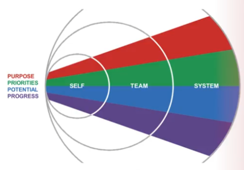

## Start your Journey
### Welcome to Connected Leadership!
By the end of the course, you'll have a token, a detailed purpose-driven action plan, a clear vision of where you're headed next, and a strategy for inspiring others to join you. 

### Course Overview
- We will focus on tools to help you achieve what matters to you in your personal life, at work, and in the broader world. 
  - The aim of connected leadership is to inspire and empower the curious, (that's you), to improve the world around us in your own unique way.
  - We will help you identify and connect with your purpose and unlock the potential of working with others to make positive change, whatever that may be. 
- The connected leadership course is designed to one:
  - improve the ability to get the most out of life.
    - Learn practical tools within a unified framework to reflect on your purpose, clarify priorities, visualize your potential, and maximize your effectiveness at progress towards your goals. 
  - Two strengthen your leadership toolkit. 
    - Tap into your unique leadership style and strengths and join or create a community of others to maximize your potential as a team. 
  - Apply systems thinking to plan for change. 
    - Become a more effective and still humble agent of positive change, appreciate the power and complexity of systems thinking and the perspectives of others. 
- By the end of the course, you'll understand how to leverage purpose to create change at the self, team, and system levels. You'll also have a personalized leadership toolkit on paper in a workbook or screen that you can return to an update, including a detailed map of what matters to you and how to accomplish it.

### Pre-Course Survey

## The Connected Leadership Framework

### Framework Overview
- You're at your best as a leader when you know:
  1. why you're here and why those around you are here. 
  2. you know what's truly important to be spending time on, and 
  3. be very clear of the intended destination of what's important. 
- So while this flow is relatively simple, it's often hard to do, especially as we progress through life with larger and more complex goals.

To work through this and consistently achieve this logic flow connected leadership is organized into four parts. Which I call the 4 Ps:
1. questioning and confirming your **purpose**, 
2. clarifying and personalizing what is most important, your **priorities**. 
3. Creating a vivid view of the future you've spent time visualizing and want to help create your **potential**. 
4. And then ensuring you **progress** forward by illuminating where you have come from and where you are going, creating a high performance you connected to the first 3 Ps.
- You could think of connected leadership as a rope made up of four fibers. Our ability to thrive as a purpose driven leader is only as strong as the weakest of these fibers, being present and intentional across all four of these Ps, makes a stronger rope than being strong in some areas and weaken others.

These 4 Ps can apply across all levels as we rise out of the individual or **self level**, to the **team level**, through to the world around us or **system level**. 

-And so as we work on the **self level**, we might channel Maya Angelo and be yourself only better. 
-At the **team level**, we will cover the 4 Ps in context of a clear vision and mission, aligned priorities, a shared view of the future, and a way of holding each other to account for progress. As the african proverb says, `if you want to go fast, go alone, if you want to go far, go together`. 
Finally, at the system level we will talk about uncovering the purpose of a system, identify leverage points for change, and planning for system knowledge and positive change. Indeed `be the change you wish to see in the world` as attributed to Gandhi.

### Unpacking "Connected" + "Leadership"

### What do you think of the word "leader"?

### Brown-2020 Power 'With' vs Power 'Over'

### Navigating the Course

### (Co-active Institute) Your Leadership Approach

### Your Connected Leadership Workbook