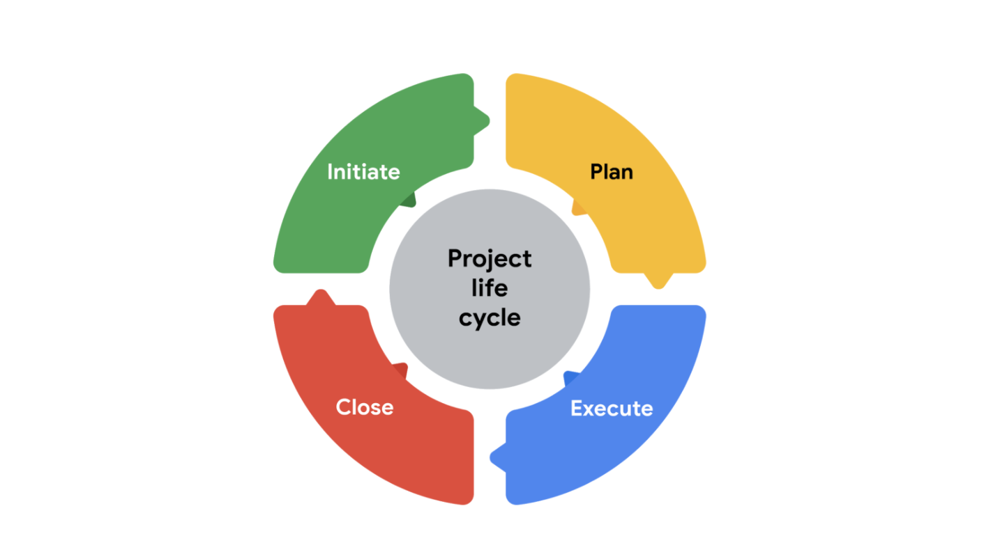

<!-- vscode-markdown-toc -->
* 1. [Understanding the project life cycle](#Understandingtheprojectlifecycle)
	* 1.1. [Introduction: The project management life cycle and methodologies](#Introduction:Theprojectmanagementlifecycleandmethodologies)
	* 1.2. [Exploring the phases of the project life cycle](#Exploringthephasesoftheprojectlifecycle)
	* 1.3. [Case study: The significance of each project phase](#Casestudy:Thesignificanceofeachprojectphase)
	* 1.4. [Practice Quiz: Test your knowledge: Understanding the project life cycle](#PracticeQuiz:Testyourknowledge:Understandingtheprojectlifecycle)
* 2. [Analyzing the different project phases](#Analyzingthedifferentprojectphases)
	* 2.1. [Phases in action: Initiating and planning](#Phasesinaction:Initiatingandplanning)
	* 2.2. [Phases in action: Executing and closing](#Phasesinaction:Executingandclosing)
	* 2.3. [Summary of the project phases](#Summaryoftheprojectphases)
	* 2.4. [Identify: Phases of the project life cycle](#Identify:Phasesoftheprojectlifecycle)
* 3. [Comparing project management methodologies and approaches](#Comparingprojectmanagementmethodologiesandapproaches)
	* 3.1. [Introduction to project management methodologies](#Introductiontoprojectmanagementmethodologies)
	* 3.2. [Overview of Waterfall and Agile](#OverviewofWaterfallandAgile)
	* 3.3. [Comparing Waterfall and Agile approaches](#ComparingWaterfallandAgileapproaches)
	* 3.4. [Introduction to Lean and Six Sigma](#IntroductiontoLeanandSixSigma)
	* 3.5. [Lean and Six Sigma methodologies](#LeanandSixSigmamethodologies)
	* 3.6. [Common project management approaches and how to select one](#Commonprojectmanagementapproachesandhowtoselectone)
	* 3.7. [Identify: Project management methodologies](#Identify:Projectmanagementmethodologies)
* 4. [Review: The project management life cycle and methodologies](#Review:Theprojectmanagementlifecycleandmethodologies)
	* 4.1. [Wrap-up](#Wrap-up)

<!-- vscode-markdown-toc-config
	numbering=true
	autoSave=true
	/vscode-markdown-toc-config -->
<!-- /vscode-markdown-toc -->

##  1. Understanding the project life cycle

###  1.1. Introduction: The project management life cycle and methodologies

- I'll introduce you to the two most popular approaches to project management, Waterfall and Agile.
- We'll also cover the project management life cycle and phases, and you'll learn about the different styles, scenarios, and factors that can impact a project and its tasks at any given phase.
- you'll be able to:
   - explain and follow the life cycle of a project,
   - define and outline a project's phases, and each phase's tasks,
   - compare different project management methodologies to determine which methodology is most effective for a project, and finally,
   - organize how a project is run, according to different program management methodologies. Ready? Let's get started.

###  1.2. Exploring the phases of the project life cycle

No two projects are exactly the same, which means there are many different ways to manage them. Each project comes with its own needs and factors that impact how you'll take action and achieve your goals. There are many ways to manage projects and not always one right way to do so. 

The life cycle is a great way to guide your project in the right direction so that you and your project stay on track and end up in the right place. Most project life cycles have four major phases, each with their own set of tasks and concerns. Check it out. The main phases of a project are:
- initiate the project,
- make a plan, 
- execute and complete tasks, and finally, 
- close the project

- initiate the project:
   - you'll **define project goals and deliverables**,
   - **identify the budget and resources you'll need**, the **people involved** in your project, and any other details that can impact the successful completion of your project.
   -  You'll **document all this information in one place to showcase the project's value**, and hopefully get approval to move forward with it. Once the project is approved, it's time to get rolling. 

- make a plan:
   - for how you will meet the goals of your project. There are all kinds of ways to plan your project, and we'll get into some different methods and techniques later on.
   - **for every single project, creating a plan of how you're going to meet your goals is absolutely 100 percent essential**.
   - To be effective, your plan needs to include a lot of things. For example:
      - a budget,
      - a breakdown of all the tasks that you need to be completed,
      - ways to communicate team roles and responsibilities,
      - a schedule,
      - resources,
      - and what to do in case your project encounters problems or needs to change. That's just to name a few.
- Once you have your plan in place, it's **time to execute and complete those tasks**
   - It's important to point out that: **your project team has the job of completing the project tasks**
  - your primary tasks as the project manager are to **monitor progress and keep your team motivated**.
  - You also **remove any obstacles that might come up** so that the tasks are executed well and on time.
- Finally, when all the tasks have been completed, all the resources have been accounted for and the project has crossed the finish line, it's time to **close the project**.
   - Why is it important to close?
   - One big reason is so your team has a moment to celebrate all of their hard work.
   - it is also a chance to evaluate how the project went. You can make note of what worked and what didn't so you can plan better for next time.
      - Even if the project was a massive success, it's helpful to take time to reflect.
   - Closing the project is also a great way to connect with anyone outside your team who may have had interest in the project's goal.
   - You can **let everyone know what was completed and what you accomplished**.
- Following the project processes you will learn in this course will set you up for project management success. Next, we'll take a closer look into what happens during each phase of the traditional project life cycle.

###  1.3. Case study: The significance of each project phase

#### The consequences of rushing through a project phase

- It’s Friday night when Jason, a project manager at a company that specializes in virtual reality software, receives an urgent call from his manager, Mateo. Mateo tells Jason that he needs a cost and timeline for a virtual reality training program for Flight Simulators, Inc., a company that does aircraft maintenance, by the end of the weekend.

- Jason spends the weekend working through a proposal for Flight Simulators, Inc. He quickly throws together a proposal estimating that it will cost $200,000 and take six weeks to develop the course. This is the standard cost and time frame for developing training on his company’s platform. He sends the proposal over to Flight Simulators, Inc. so that he can meet their deadline. 

- When Jason walks into the office on Monday morning, Mateo tells him that *"he got reprimanded for not following the company’s process for building out a proposal and including the engineers in the process**.
   - The engineers take a look at the information presented by Flight Simulators, Inc. and **realize that the company’s software won’t work with their platform**. It will take six months to develop their platform to meet the needs of the organization’s software and another six months to test the software and platform integration. The cost to develop and test this software will be over a million dollars.  

This project **has failed before it even started**. There’s no way to complete the request from Flight Simulators, Inc. without impacting the budget, quality, and timeline. 

#### What should have happened
When his manager calls, Jason tells him that while he understands that Mateo wants to make the customer happy by getting them a proposal promptly, he would like to take a little more time to get the proposal right. Jason tells Mateo that he will draft up an email to Flight Simulators, Inc. and **request additional time to develop an accurate and reasonable proposal**. Mateo is hesitant but agrees. 

On Monday morning, Jason sees that Flight Simulators, Inc. has responded to his request. They appreciate the fact that he communicated his concerns about the quick turnaround on the proposal request. They say they will give him **a week to work with his team to provide an estimate for the project**.  

Now Jason **has the time to get all of the key players involved in estimating the effort it will take to complete the project, including the cost, schedule, and resources**. 

Let’s apply the project life cycle to this project. 

#### Initiating the project
Ideally, in this phase: 
1. Jason discusses project goals with Flight Simulators, Inc. to gain a clear understanding of what they are asking for.
2. Once Jason has defined the project goals, he can gather the stakeholders and project team members to define what needs to be done to successfully create this training for Flight Simulators, Inc.
3. Jason identifies the skill sets required, the timeline, and the cost to develop the training.
4. He identifies and documents the value that this project creates for the company.
5. He presents all of the information he has put together to his company’s leadership team, who approves Jason’s proposal.
6. Jason then submits the proposal to Flight Simulators, Inc., and they accept it. 

#### Making a plan
Now that Jason has the green light to work on the project: 
1. he makes a project plan to get from start to finish. Having a plan in place ensures that all team members and stakeholders are prepared to complete their tasks.
2. Jason outlines the important deadlines and tasks for the project to be successful.
3. He creates a schedule to account for all resources, materials, and tasks needed to complete the project. 

#### Executing and completing tasks
During this project phase, 
1. Jason’s project team puts his plan in motion by executing the work.
2. Jason monitors his team as they complete project tasks. His role as the project manager is not to complete the individual tasks but to help break down any barriers that would slow or stop the team from completing their tasks.
3. It is also Jason’s responsibility to communicate schedule and quality expectations. Jason uses his communication skills to keep Flight Simulators, Inc. up to date on the project status and gather feedback from them.
4. This keeps the project on schedule and within budget.

#### Closing the project
- Jason’s team has successfully completed the training, and he delivers it to Flight Simulators, Inc.
   - They are very pleased with how it turned out!
- Jason is now ready to close this project and move on to the next one. 
- Before he closes this chapter, Jason and his team discuss and document the lessons learned from the project. What worked well, and what could work better next time?
- Jason also puts together a small lunch gathering for his team to celebrate and recognize their hard work. 

#### Key takeaway
It may seem like a lot of work to go through an entire project life cycle, but the long-term impact it will have on your project is huge! It is your job as the project manager to make sure that **your leadership truly understands the risk of not properly preparing for a project**. Making assumptions that are incorrect can put your company at risk. Instead, taking the time to carefully initiate, plan, execute, and close your project leads to project success and good working relationships with customers.  

###  1.4. Practice Quiz: Test your knowledge: Understanding the project life cycle

##  2. Analyzing the different project phases

###  2.1. Phases in action: Initiating and planning
Now that we've discussed the project life cycle, we're going to explore some of the different tasks that match up with each life cycle phase. But first, let's review the phases. The project life cycle phases are initiate the project, make a plan, execute and complete tasks, and close out the project. Great. Let's get back to the tasks that need to be accomplished during each phase. For this video, we're going to focus on the first two project life cycle phases, initiating the project and making a plan. It's important to call out that the name or tasks for each phase might change, or may be a little different depending on the type of project or the organization where you work. At Google, we use a mix of different project management methods, which you'll learn more about later in the course. But regardless of the method, all projects share a lot of the same tasks needed to get the job done. So, let's get into it. The first step of the project life cycle is to initiate the project. During initiation, you'll organize all of the information you have available to you about your project. This way, when you're ready to continue on, you'll be prepared for the next phase when you can create your plan. Defining project goals makes the details of your project clear so that you and your team can successfully complete the project. For example, if the project goal is to manage a political campaign, then some deliverables, which are specific tasks or outcomes, might be to raise $5,000 or get 500 signatures in support of your candidate's cause. With this in mind, you'll need to do some research to come up with ideas that will help you meet your goals. You'll also need to find out what resources are available. Resources can include people, equipment, software programs, vendors, physical space or locations, and more. Anything you need to actually complete the project is considered a resource. Now as a project manager, you'll record all of these details in your project proposal and then get them approved by a decision maker or group of decision makers at your company so that you can move ahead with your project plans. Now in some cases, you may be the decision maker so be sure to consider the same set of factors when initiating your project before moving to the next stage. No worries, you will learn all the details about how to create a project proposal. We will be getting into more detail of what this is and how to create one later in the course. Voila, once your project is approved, you'll move into the second step of the project life cycle, which is to make a plan. In this phase, you'll create a budget and set the project schedule. You'll establish the project team and determine each person's roles and responsibilities. Let's pause for a second. You may be thinking, "Why can't we just get started?", but that's the thing with project management, deliberate planning is critical to a project's success. A crucial part of project management is planning for risk and change. An experienced project manager knows that plans always change. This ability to adapt is all about thinking and planning ahead. Scheduling delays, budget changes, technology and software requirements, legal issues, quality control, and access to resources are just some of the more common types of risks and changes that a project manager needs to consider. So, it's important to keep in mind that planning is key to reducing those risks. But don't worry, if the idea of risks seems a little overwhelming right now, in later courses, we'll teach you all about understanding risks. Just know that it's really important not to skip this step and to always make a plan. Again, the success of your project depends on it. Once you have a plan, you'll communicate all of this information to your team. That way, each member will know which tasks they'll own and what to do if they have questions or if they run into problems. You'll also communicate your plan with others who have an interest in the project success, so that they are aware of your plans and your progress as the project continues to move forward. Nice job, we've made it halfway through the steps of a project life cycle. Up next, we'll check out the remaining two phases, executing and completing tasks and closing the project. Catch you in a bit.

###  2.2. Phases in action: Executing and closing
Welcome back. We just learned about the core tasks that need to be completed in the first two phases of the project life cycle, initiating the project and making plans. Now, it's time to put your plans into action. Remember, it's not your job to actually do all the tasks. Your primary job as the project manager is to manage the progress of the project as a whole. This means you'll oversee your team's efforts and make sure everyone understands what's expected of them, what tasks need to be done, and how and when to complete those tasks. It's also your job to help remove any obstacles and to alert the right people if it looks like there might be a delay to the project. This means you'll need to communicate with your team, and anyone else involved in your project through meetings, written communications like memos, emails or internal chat tools, and other working documents like task reports. Quick pro tip, if in doubt, err on the side of overcommunication. As your project progresses you'll make adjustments to the schedule, budget, and allocation of resources, clearly communicating updates all along the way. When all the tasks are complete and you've met the project goal, it's time to close the project. This phase is usually overlooked because it's easy to assume that once the project goal has been delivered, everyone can move on. But hold up, there's still a lot that needs to be done. First, check to make sure all tasks have been completed, including any work that was added along the way. Be sure any outstanding invoices have been paid, resources are returned and accounted for, and project documentation has been submitted. Next, and this is very important, get confirmation that the final outcome of your project is acceptable to the people you're delivering it to. It is crucial to your project's success that the person who asked you to manage the project is satisfied with the end result. Once your project has been accepted as meeting its goals, take some time to reflect on what went well and maybe what didn't go so well. This reflection is usually called a retrospective, and it's a chance to note best practices and learn how to manage your project more effectively next time, even if everything went great. The notes from your retrospective are also valuable to the people or organization receiving the end result of the project. That's because they can use that information to inform decisions about their business the next time they consider a project. Now it's time to collect all the project documentation that you created or collected along the way, including all of your plans and reflections, and share the final results of your project with your stakeholders. Remember, stakeholders are people who are interested in and affected by the project's completion and success. Depending on the type of project, stakeholders could include a department or organization's management team, clients or customers of your product or service, users of your new tool or process, or even the community at large if you're planning a community town hall meeting. Pro tip, stakeholders play a huge role in the development, and success of your project. You'll learn a lot more about these key players later on. But for now, just know that they're like the VIPs of your project. Next, take some time to celebrate the effort your team invested in the project. Celebrations help people feel good about the work they've done, and think of the work as uplifting and rewarding because it truly is. Some ideas for small celebrations are a company or team-wide email, thanking the team and acknowledging individual efforts. Now for big projects, you may even consider a company party to celebrate the team and the project success. To wrap up, you and your team can formally move on from the project so that you can pursue new projects in the future. Well, as you can see, being a project manager is a lot of work, but it's very rewarding, and it's all, well, manageable when you follow through with the project life cycle. You can see how the organization, communication, and improvements you add to various areas of a project can make the entire team more effective and efficient, and you can have an impact on many areas of a project in a way that's greater than if you focused on any one task on the project. Similar to a coach with a sports team, even though you aren't actually playing a direct role in the game, your guidance, your communication, and your team-building can make the difference in a happy, high-performing, and successful team. In later courses we'll discuss each of these project phases, and you'll learn methods, techniques, and tools to help you. For now, we just want you to become familiar with the general project management process, and we'll share some of the terms and concepts used in the field that you'll need to know as you develop your project management skills. Up next, we'll introduce you to two of the more popular project methodologies, Waterfall and Agile. See you soon.

###  2.3. Summary of the project phases
The project life cycle is the path for your project from start to finish. Each project phase builds toward the subsequent phase and helps to create a structure for the project. To recap, the main phases of the project life cycle are: initiating the project, making a plan, executing and completing tasks, and closing the project. 

In this reading, we will summarize each phase of the project life cycle. 

#### The project life cycle

##### Initiate the project
In this phase, ask questions to help set the foundation for the project, such as:

- Who are the stakeholders?
- What are the client’s or customer’s goals?
- What is the purpose and mission of the project?
- What are the measurable objectives for the team?
- What is the project trying to improve? 
- When does this project need to be completed? 
- What skills and resources will the project require? 
- What will the project cost? What are the benefits?

##### Make a plan
In this phase, make a plan to get your project from start to finish. 
- Create a detailed project plan. What are the major milestones? What tasks or deliverables make up each milestone?  
- Build out the schedule so you can properly manage the resources, budget, materials, and timeline. Here, you will create an itemized budget.

##### Execute the project
In this phase, put all of your hard work from the first two phases into action. 

- Monitor your project team as they complete project tasks. 
- Break down any barriers that would slow or stop the team from completing tasks. 
- Help keep the team aware of schedule and deliverable expectations.
- Address weaknesses in your process or examine places where your team may need additional training to meet the project’s goals.
- Adapt to changes in the project as they arise.

##### Close the project
In this phase, close out the project.
- Identify that your team has completed all of the requested outcomes. 
- Release your team so they can support other projects within the company.
- Take time with your team to celebrate your successes! 
- Pass off all remaining deliverables and get stakeholder approval.
- Document the lessons you and your team learned during the project.
- Reflect on ways to improve in the future.

##### Key takeaway
Each phase of the project life cycle has its own significance and reason for existing. By following the project life cycle, you’re ensuring that you are: 
- Capturing the expectations of your customer
- Setting your project up for success with a plan
- Executing project tasks and addressing any issues that arise 
- Closing out your project to capture any lessons learned 

As you continue through this course, we will walk through each project phase in more detail.

##  3. Comparing project management methodologies and approaches

###  3.1. Introduction to project management methodologies

- Welcome back, as we've already discussed, not all projects are alike. Different types of projects will benefit from applying different project management approaches or methodologies. A project management methodology is a set of guiding principles and processes for owning a project through its life cycle. Project management methodologies help guide project managers throughout a project with steps to take, tasks to complete, and principles for managing the project overall. We will talk through two different types, linear and iterative. Linear means the previous phase or task has to be completed before the next can start. A linear approach would work well for a project like building a house. You'd need the blueprint created before you can begin laying the foundation. You've got to know exactly what the house will look like, its dimensions, and what type and how many resources you'll need. Then you've got to finish the foundation before you put up the walls and the walls before you put up the roof and so on before you have the finished project, which is a bungalow-style home. There's also a clear goal, you know exactly what the house will look like. It's unlikely that in the middle of building the house, your client is going to decide they'd rather have a multi-level Victorian instead of a single-level bungalow. What's more, even if they wanted to change, it's too late, you already laid the foundation and built the walls for the bungalow, done and done. A bungalow is what they wanted, and a bungalow is what they'll get. Using this type of linear project management approach, completing each step in order and sticking to the agreed upon specific results and being able to deliver just what the client ordered. For a project like producing a new show for a television company, on the other hand, it might be more effective to use a methodology that uses an iterative, more flexible approach where some of the phases in tasks will overlap or happen at the same time that other tasks are being worked on. Your team comes up with an idea for a show and films a pilot. You ran several tests of the pilot in different locations and time slots. As your team gathers feedback about the pilot, adjustments to the show are made. At the same time, you're able to make decisions and start working on other parts of the project, like hiring permanent actors, starting film production, and working on advertising even while the final version of the show is being worked on. And even though the overall goal is clear, produce a new show, the type of show could end up being different from the original idea. Your team may have started out creating a one-hour show, but during testing they realized a half-hour show would actually be more popular. Or maybe a supporting character got a lot of positive feedback, so you want to make them one of the main characters. What's more important is that you produce a show that audiences are going to watch. Because of the iterative approach, plans remain flexible and you're able to make adjustments as you go along. Each of these projects, benefits from a different approach to how tasks will be carried out, in order to best meet the project's goals. Linear projects don't require many changes during development and have a clear sequential process. If you stick to the plan, it's likely you'll finish your tasks within the time schedule and all other criteria. Iterative projects allow for more flexibility and anticipate changes. You're able to test out parts of the project to make sure they work before the final result is delivered, and you can deliver parts of the project as they are completed, rather than waiting for the entire project to be done. Over the years, the field of project management has developed many different methods that project managers can choose from that will help them manage most effectively. Google takes a hybrid approach to project management. We mix and match from different methods depending on the type of project. Our project managers are encouraged to adapt their own style to what makes the most sense to their project and their team. So are you starting to see how different approaches might benefit the projects you'll be working on now? Pretty soon you'll become a pro at picking an approach or combining approaches to fit with your project. Up next, we'll learn about the most well known and most used project management methods that you can add to your project management tool box.

###  3.2. Overview of Waterfall and Agile
Two of the most popular project management methodologies are Waterfall and Agile. Each of these methods has a rich and complex history. In fact, you could take an entire certificate on just one of these methods alone. You'll have a chance to learn more about Waterfall and Agile methods in the upcoming courses of this certificate. Be sure to check those out after completing this one to learn more. For now, I'll just give you a brief introduction and provide you with some examples that illustrate how different types of projects can be more successful or easier to manage when you consider which method to use. First, let's take a look at the Waterfall approach. Waterfall as a methodology was created in the 70s, and refers to the sequential ordering of phases. You complete one at a time down the line like a waterfall starting at the top of a mountain and traveling to the bottom. Remember the definition and example of linear from that last video? Well, Waterfall has a linear approach. At first, Waterfall was used in the physical engineering disciplines like manufacturing and construction, then software emerged as an important field of engineering and Waterfall was applied to those projects as well. It still used a lot in engineering fields including product feature design and application, also known as app design. Over time, other industries like event planning and retail have adapted Waterfall phases to fit their projects. There are now many styles of Waterfall, and each style has its own specific set of steps. What they all have in common, though, is that they follow an ordered set of steps that are directly linked to clearly defined expectations, resources, and goals that are not likely to change. Let's take a closer look. The phases of a Waterfall project life cycle follow the same standard project life cycle flow that you learned about earlier. Initiating, planning, executing, which includes managing and completing tasks, and closing. When would you want to use a Waterfall approach to project management? Well, when the phases of the project are clearly defined or when there are tasks to complete before another can begin, or when changes to the project are very expensive to implement once it's started. For example, if you are catering an event for a client on a very tight budget you might want to use Waterfall methodology. This way, you could confirm the number of guests first, then very clearly define the menu, get approval and agreement on the menu items and costs, order the unreturnable ingredients, and successfully feed the guests. Because the budget is limited, you can't afford to make changes or waste food. The traditional method won't allow for the client to make changes to the menu once the order has been placed. You can also reserve tables, chairs, and dishes because you know exactly how much and what kind of food is being prepared. A well-thought-out traditional approach to managing a project can help you reach your desired outcome with as little pain as possible during the project implementation. By spending extra effort thinking through the entire project upfront, you'll set yourself up for success. In an ideal world, following this approach will help you identify the right people and tasks, plan accordingly to avoid any hiccups along the way, create room for documenting your plans and progress, and enable you to hit that goal. However, plans don't always go according to plan. In fact, they rarely do. The Waterfall method has some risk management practices to help avoid and deal with project changes. Luckily, there are other methodologies that are entirely built for change and flexibility. One of these is Agile, another popular project management approach. The term agile means being able to move quickly and easily. It also refers to flexibility, which means being willing and able to change and adapt. Projects that use an Agile approach often have many tasks being worked on at the same time, or in various stages of completion which makes it an iterative approach. The concepts that shaped Agile methodology began to emerge in the 90s as a response to the growing demand for faster delivery of products, mainly software applications at that time. But it wasn't officially named Agile until 2001. The phases of an Agile project also follow the project life cycle stages we described earlier, generally speaking. However, rather than having to always go in order or wait for one phase to end before starting the next, Agile project phases overlap and tasks are completed in iterations, which in Scrum, are called sprints. Scrum is a form of Agile that you'll learn more about in the course focused entirely on Agile, and by sprint, we do not mean running a race as fast as possible. In this case, sprints are short chunks of time usually one to four weeks where a team works together to focus on completing specific tasks. What's important to understand is that Agile is more of a mindset than just a series of steps or phases. It's concerned with building an effective, collaborative team that seeks regular feedback from the client so that they can deliver the best value as quickly as possible and adjust as changes emerge. Projects that are best suited for an Agile approach are those where the client has an idea of what they want but doesn't have a concrete picture in mind, or they have a set of qualities they'd like to see in the end result, but aren't as concerned with exactly what it looks like. Another indicator that a project may benefit from Agile is the level of high uncertainty and risk involved with the project. We'll talk more about those things later. An example of a project that would work well with an Agile approach might be building a website. Your team would build the different parts of the website in sprints and deliver each part to the client as they are built. This way, the website can be launched with some parts, say the main homepage that are complete and ready for public view, while other parts, maybe the company blog or the ability to book online appointments, continue to get built out over time. This allows the team to get feedback early on about what works and what doesn't, make adjustments along the way, and reduce wasted efforts. This same website example, the Waterfall method will plan for and require the whole website to be complete before it can launch. Having a basic understanding of Waterfall and Agile will help you figure out an effective way to organize and plan out your project. Knowing about these two methodologies will come in handy during future job interviews, because you'll be able to demonstrate a solid understanding of the project management landscape. Waterfall and Agile are two of the more common and well-known project management methodologies, but they're by no means the only or the best ones. In the next videos, you'll learn about Lean Six Sigma, another way to approach projects. Here at Google, believe it or not, we select from many of these methodologies for project management.

###  3.3. Comparing Waterfall and Agile approaches
Now that you know more about some of the different approaches and frameworks associated with project management, let's compare specific aspects of Waterfall (also commonly called traditional) and Agile approaches. 

Understanding the fundamentals of—and differences between—these common project management approaches can help you demonstrate your project management knowledge during an interview. It can also help you evaluate a project to determine the right approach when working on the job.

Waterfall and Agile are implemented in many different ways on many different projects, and some projects may use aspects of each. The chart below briefly describes and compares Waterfall and Agile approaches. You can use it as a quick reference tool, but be aware that in practice, the differences between these two approaches may not always be clearly defined.

Now that you better understand the differences between Waterfall and Agile project management approaches, you can use this understanding to determine which is most effective for your projects.

###  3.4. Introduction to Lean and Six Sigma
Hey again. Now, you've got Waterfall and Agile methodologies in your project manager toolbox, Lean Six Sigma is one more you can add. It's a combination of two parent methodologies, Lean and Six Sigma. The uses for Lean Six Sigma are common in projects that have goals to save money, improve quality, and move through processes quickly. It also focuses on team collaboration which promotes a positive work environment. The idea is that when your team feels valued, motivation and productivity increases and the whole process functions more smoothly. There are five phases in the Lean Six Sigma approach. They are define, measure, analyze, improve, and control, commonly known as DMAIC. DMAIC is a strategy for process improvement, meaning you're trying to figure out where the problems are in the current process and fix them so that everything runs more smoothly. The goal of each step is to ensure the best possible results for your project. Just like with Waterfall and Agile, there're more specific details for using DMAIC and the Lean Six Sigma approach. But what's great about the DMAIC process is that it can be used to solve any business problem. Let's break it down. The first phase is to define the project goal and what it will take to meet it. This first phase is very similar to the initiation phase of traditional project management. Let's take a real scenario to illustrate. Imagine that you are brought on as a project manager for a large travel company to help streamline and minimize customer service wait times that have been surging due to a recent sales promotion. Before you begin working on tackling the issue, you're going to need to define the project goal and talk to stakeholders about expectations for the project. In this case, the goal is to take average wait times down to less than 10 minutes on average compared to 30 minutes. Next, it's time to measure how the current process is performing. In order to improve processes, DMAIC focuses on data. Here you want to map out the current process and locate exactly where the problems are and what kind of effect the problems have on the process. Using our example, you're trying to figure out why it's taking so long for the travel company to address a customer service issue. To do this, you look at company data like average wait times, number of customers per day, and seasonal variations. Then you'll set a plan for how you'll get that data and how often to measure it. This could look something like having the company generate reports on a weekly, monthly, quarterly basis. In other situations, you might have employees or customers fill out surveys or look at inventory, shipping, and tracking records, things like that. Once you have the data and measurements, you can move on to the next phase which is analyze. Here, you'll begin to identify gaps and issues. In our example, after mapping out the process and data points, you may see that staffing is inadequate on days where customers are the highest. Data analysis is important for project managers regardless of which method you choose and we will learn more about that in an upcoming course. From your data, you'll have a strong understanding of causes and solutions to get to the next stage, improve. Oftentimes, project managers may want to leap straight to this phase but really projects in process improvements should only be made after a careful analysis. This is the point where you present your findings and get ready to start making improvements. In our example, this could be modifying staffing to address customer needs. The last step of this cycle is control. You've gotten the process and project to a good place, and now it's time to implement it and keep it there. Controlling is all about learning from the work you did up front to put new processes and documentation in place and continue to monitor so the company doesn't revert back to the old, inefficient way of doing things. To sum it all up, you can remember DMAIC like this, defining tells you what to measure, measuring tells you what to analyze, analyzing tells you what to improve, and improving tells you what to control. Lean Six Sigma and the DMAIC approach are ideal when the project goal includes improving the current process to fix complex or high risk problems like improving sales, conversions, or eliminating a bottleneck, which is when things get backed up during a process. Following the DMAIC process prevents the likelihood of skipping important steps and increases the chances of a successful project. As a way for your team to discover best practices that your client can use going forward, it uses data and focuses on the customer or end-user to solve problems in a way that builds on previous learning so that you can discover effective permanent solutions for difficult problems. There are many ways out there that break the flow of project management into digestible phases and approaches, all with the same end goal of accomplishing the desired outcome as smoothly as possible and delivering the best value. Like I said earlier, at Google we follow a lot of different approaches. For instance, an engineering team releasing a customer-focused product may primarily use Agile when creating the product, but decide to plug in some of the aspects of Waterfall project management for planning and documentation. A customer service team might focus on using Lean Six Sigma to improve an experience for our users like offering new features based on a recent analysis. But the team might develop parts of the code and roll out the features using Agile iterations and sprints to allow for change. Or one of our internal education and training teams may focus solely on Waterfall project management to achieve a targeted goal of having all employees complete an annual compliance training. Here, Waterfall makes sense since the requirements of the training program are fixed and so is the deadline and goal. The biggest takeaway is to know the various methods and tools to be able to confidently apply what works best for you, your team, and the end goal. There is no real prescription for how to execute a project perfectly because there're always pieces you can't 100 percent control. But the good news is, you can get pretty close with the skill sets you develop through learning about these different frameworks.

###  3.5. Lean and Six Sigma methodologies

Previously you learned about Agile and Waterfall project management approaches. Now, we will define some key concepts from Lean and Six Sigma methodologies. We will learn how these methodologies can be used to organize and manage your projects, and we will discuss which is the most effective for different kinds of projects.   

#### Lean
Lean methodology is often referred to as Lean Manufacturing because it originated in the manufacturing world. The main principle in Lean methodology is the removal of waste within an operation. By optimizing process steps and eliminating waste, only value is added at each phase of production.  

Today, the Lean Manufacturing methodology recognizes eight types of waste within an operation: defects, excess processing, overproduction, waiting, inventory, transportation, motion, and non-utilized talent. In the manufacturing industry, these types of waste are often attributed to issues such as: 

- Lack of proper documentation
- Lack of process standards
- Not understanding the customers’ needs
- Lack of effective communication
- Lack of process control
- Inefficient process design
- Failures of management

These same issues create waste in project management. 

Implement Lean project management when you want to use limited resources, reduce waste, and streamline processes to gain maximum benefits. 

You can achieve this by using the pillars of the Lean 5S quality tool. The term 5S refers to the five pillars that are required for good housekeeping: sort, set in order, shine, standardize, and sustain. Implementing the 5S method means cleaning up and organizing the workplace to achieve the smallest amount of wasted time and material. The 5S method includes these five steps: 

1. Sort: Remove all items not needed for current production operations and leave only the bare essentials. 
2. Set in order: Arrange needed items so that they are easy to use. Label items so that anyone can find them or put them away. 
3. Shine: Keep everything in the correct place. Clean your workspace every day.
4. Standardize: Perform the process in the same way every time. 
5. Sustain: Make a habit of maintaining correct procedures and instill this discipline in your team.

Within the Lean methodology, 5S helps you boost performance. 

The final concept of Lean uses a Kanban scheduling system to manage production. The Kanban scheduling system, or Kanban board, is a visualization tool that enables you to optimize the flow of your team’s work. It gives the team a visual display to identify what needs to be done and when. The Kanban board uses cards that are moved from left to right to show progress and help your team coordinate the work. 

Kanban board, showing columns (to do, in progress, testing, and done) with sticky notes representing tasks of a project.
Kanban boards and 5S are core methods of the Lean methodology. They can help you successfully manage your project. Now let’s analyze the Six Sigma method and learn when is the best time to use it. 

#### Six Sigma
Six Sigma is a methodology used to reduce variations by ensuring that quality processes are followed every time. The term “Six Sigma” originates from statistics and generally means that items or processes should have 99.9996% quality.

The seven key principles of Six Sigma are:
1. Always focus on the customer.
2. Identify and understand how the work gets done. Understand how work really happens.
3. Make your processes flow smoothly.
4. Reduce waste and concentrate on value.
5. Stop defects by removing variation.
6. Involve and collaborate with your team.
7. Approach improvement activity in a systematic way.

Use this methodology to find aspects of the product or process that are measurable like time, cost, or quantity. Then inspect that measurable item and reject any products that do not meet the Six Sigma standard. Any process that created unacceptable products has to be improved upon.  

Now that you understand both Lean and Six Sigma, let's see how they come together to improve the performance of your project!

#### Lean Six Sigma 
After both Lean and Six Sigma were put into practice, it was discovered that the two methodologies could be combined to increase benefits. The tools used in Lean, such as Kanban boards and 5S, build quality in processes from the beginning. Products developed using Lean methods are then inspected or tested using Six Sigma standards. The products that do not meet these standards are rejected. 

The largest difference between these methodologies is that Lean streamlines processes while Six Sigma reduces variation in products by building in quality from the beginning and inspecting products to ensure quality standards are met. You may find that one of these two methods—or using them both together—can improve the efficiency of your projects. 

###  3.6. Common project management approaches and how to select one

You have been learning a lot about different project management approaches and when to use them. In this reading, we will briefly recap some of the most common ones and recommend a couple of articles with supporting information. You’ll continue to learn more about these approaches throughout this certificate program. 

#### Popular project management approaches
Below is a brief recap of some of the project management approaches you’ve been introduced to so far:

Waterfall is a traditional methodology in which tasks and phases are completed in a linear, sequential manner, and each stage of the project must be completed before the next begins. The project manager is responsible for prioritizing and assigning tasks to team members. In Waterfall, the criteria used to measure quality is clearly defined at the beginning of the project.

Agile involves short phases of collaborative, iterative work with frequent testing and regularly-implemented improvements. Some phases and tasks happen at the same time as others. In Agile projects, teams share responsibility for managing their own work. Scrum and Kanban are examples of Agile frameworks, which are specific development approaches based on the Agile philosophy.

Scrum is an Agile framework that focuses on developing, delivering, and sustaining complex projects and products through collaboration, accountability, and an iterative process. Work is completed by small, cross-functional teams led by a Scrum Master and is divided into short Sprints with a set list of deliverables.

Kanban is a tool used in both Agile and Lean approaches that provides visual feedback about the status of the work in progress through the use of Kanban boards or charts. With Kanban, project managers use sticky notes or note cards on a physical or digital Kanban board to represent the team’s tasks with categories like “To do,” “In progress,” and “Done.”

Lean uses the 5S quality tool to eliminate eight areas of waste, save money, improve quality, and streamline processes. Lean’s principles state that you can do more with less by addressing dysfunctions that create waste. Lean implements a Kanban scheduling system to manage production.

Six Sigma involves reducing variations by ensuring that quality processes are followed every time. The Six Sigma method follows a process-improvement approach called DMAIC, which stands for define, measure, analyze, improve, and control.

Lean Six Sigma is a combination of Lean and Six Sigma approaches. It is often used in projects that aim to save money, improve quality, and move through processes quickly. Lean Six Sigma is also ideal for solving complex or high-risk problems. The 5S organization framework, the DMAIC process, and the use of Kanban boards are all components of this approach. 

Despite their differences, all of these project management methodologies require communication and collaboration among various teams and aim to deliver projects on time and within budget. 

A woman thinking with her hand to her chin. Three thought bubbles are coming from her head.

#### Selecting a project management approach
With so many methodologies available, there are many options that would work well for your project. Since projects and the organizations in which you will execute them vary greatly, the approach you choose to implement for each project will vary. At Google, we often use a hybrid of approaches and frameworks to efficiently meet the project goal! All approaches can be combined with others, depending on the needs of your project. 

Choosing an approach that works best for the project, the organization, and the team takes time and practice. You’ll learn more about how to choose a project management approach throughout this certificate program. In the meantime, take a look at how this article breaks down common methodologies and when (or when not) to use them: 
Which project management methodologies should you use?

##  4. Review: The project management life cycle and methodologies

###  4.1. Wrap-up
Congrats on completing this module on the project life cycle and project management methodologies. So what did you think? Hopefully, this introduction to a few of the core project management methodologies and hearing from a Googler about the way we approach project management here at Google has you interested and excited to keep on learning. One of the great things about project management is that it can be really creative and present you with challenging problems to solve that have a rewarding impact. You get to work with teams full of interesting, skilled, and dedicated people who help with the problem-solving and idea-generating process. Every project is an opportunity to learn and try something new. Waterfall, Agile, and Lean Six Sigma are solid foundations from which to build your understanding of project management. Each methodology has its own set of rules, values, and processes. There is no such thing as a right or a wrong methodology. There is no one-size-fits-all approach to take, and there is almost no limit to the number of ways you can blend different approaches to fit the needs of your project. Your goal in choosing a methodology is to maximize the use of resources and time. The method, or combination of methods, will help you reach your goal in the most efficient and effective way. This might feel like choice overload right here, but hang in there. With time and practice, you will become more comfortable with the benefits and limits of different methodologies, and you'll be able to approach your project assignments with confidence. Next, you'll build on these foundations by learning how an organization structure and culture can impact the way you manage your project. See you soon.
