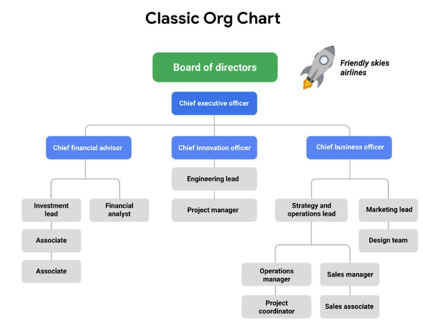
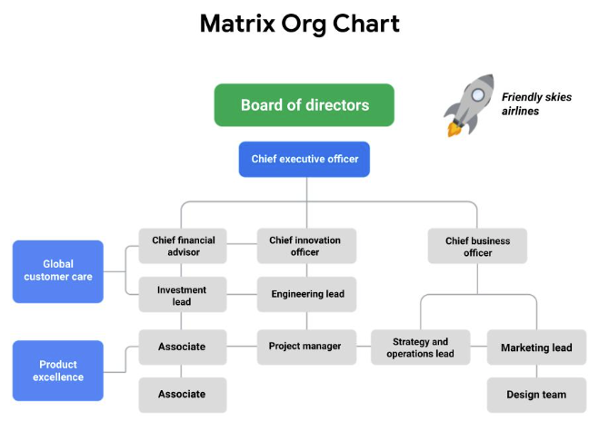

<!-- vscode-markdown-toc -->
* 1. [Understanding organizational structure](#Understandingorganizationalstructure)
	* 1.1. [Introduction: Organizational structure and culture](#Introduction:Organizationalstructureandculture)
	* 1.2. [Overview of Classic and Matrix structures](#OverviewofClassicandMatrixstructures)
	* 1.3. [A project manager's role within different organizational structures](#Aprojectmanagersrolewithindifferentorganizationalstructures)
	* 1.4. [How organizational structure impacts project management](#Howorganizationalstructureimpactsprojectmanagement)
	* 1.5. [The role of a Project Management Office](#TheroleofaProjectManagementOffice)
	* 1.6. [Lan: Working in a Project Management Office](#Lan:WorkinginaProjectManagementOffice)
* 2. [Understanding the impact of organizational culture](#Understandingtheimpactoforganizationalculture)
	* 2.1. [Introduction to organizational culture](#Introductiontoorganizationalculture)
	* 2.2. [Learning about an organization’s culture](#Learningaboutanorganizationsculture)
	* 2.3. [Amar: Project management in life and in the organization](#Amar:Projectmanagementinlifeandintheorganization)
	* 2.4. [Case study: Balancing company culture and strategic goals](#Casestudy:Balancingcompanycultureandstrategicgoals)
* 3. [Understanding change management](#Understandingchangemanagement)
	* 3.1. [Introduction to change management](#Introductiontochangemanagement)
	* 3.2. [A project manager’s role in change management](#Aprojectmanagersroleinchangemanagement)
	* 3.3. [Participating in change management](#Participatinginchangemanagement)
	* 3.4. [Corporate and project governance](#Corporateandprojectgovernance)
* 4. [Optional - Pursuing your new career](#Optional-Pursuingyournewcareer)
	* 4.1. [Preparing for your job search](#Preparingforyourjobsearch)
	* 4.2. [How to uncover job opportunities](#Howtouncoverjobopportunities)
* 5. [Course review: Foundations of project management](#Coursereview:Foundationsofprojectmanagement)
	* 5.1. [Join the community](#Jointhecommunity)
	* 5.2. [Congrats! What's coming in Course 2](#CongratsWhatscominginCourse2)
	* 5.3. [Course 1 Glossary](#Course1Glossary)
	* 5.4. [Get started](#Getstarted)

<!-- vscode-markdown-toc-config
	numbering=true
	autoSave=true
	/vscode-markdown-toc-config -->
<!-- /vscode-markdown-toc -->

##  1. Understanding organizational structure

###  1.1. Introduction: Organizational structure and culture
Hey there, how are you feeling so far? We're nearing the end of this course. And honestly, you've done a great job. Previously, we talked about the life cycle of a project, the task breakdown of phases, and some different methodologies you can use as a project manager to help ensure your project success. You also heard from my colleagues about some of the ways we manage projects at Google. Here, you'll learn about organizational structure and culture and how they impact the way you set up and execute your project. I'll describe some common types of structures that you're likely to encounter during your project management career. You'll also learn about change management, which refers to the way you present the final project to the organization and get them to accept and implement your project outcome. These are important elements to ensure that your project is adopted and lives on. Are you ready? Let's get into these concepts.

###  1.2. Overview of Classic and Matrix structures
Welcome back. In this video, I'm going to talk about the concept of organizational structure and the project manager's role within a given structure. Keep in mind that your role won't be the same for every team or organization, because many companies are structured differently. But this overview will serve as a foundation for wherever you work. So what is organizational structure? Organizational structure refers to the way a company or organization is arranged or structured. This structure also tells you how job tasks are divided and coordinated and how all the different members of the organization relate to one another. In other words, organizational structure gives you a sense of who reports to who. But organizational structure is much more than that. Understanding the different types of organizational structures can serve as a map to help you determine where you fit in, who you should communicate with, and how frequently to communicate with them. Now that we have a basic overview of the definition of organizational structure, let's look at the various organizational hierarchies that you may encounter at work. An organization's structure is most commonly mapped out using a reporting chart or "org chart," which is short for "organizational chart." Reporting charts show the relationship between people and groups within the organization, and details who each person or group reports to. There are a few different types of organizational structures. But for this course, we're going to focus on two of the more popular ones: Classic and Matrix. Let's start with Classic. The Classic grouping includes what are usually called "functional" or "top-down" structures. The Classic grouping follows a typical chain of command where the Chief Executive Officer, also known as CEO, and other executives are at the top, followed by directors or managers, then their direct reports and so on. Each of these directors or managers typically oversee teams within their function of the organization, like marketing, sales, or human resources. You can see this type of structure in effect by looking at a branch of the military. Take the Army, for example. You may enter the Army as a private, and report up to a sergeant who oversees multiple people in your squad, and that sergeant ultimately reports up to a lieutenant and so on. If your organization works in this structure, as the project manager, you might communicate regularly with your manager, the person directly above you, and also with your peers who work on the same types of projects as you. There isn't always a straightforward, top-down approach. There are other factors at play that make organizational structures a bit more complicated than we can see on paper. For instance, you may have project teams that sit across different functions. This is common in many companies, Google included, and is usually referred to as the Matrix structure. You might think of a Matrix structure as a grid where you still have people above you, but you also have people in adjacent departments who expect to hear updates on your work progress. These people may not be your direct bosses, but you are responsible for communicating with them, since they may inform changes to your work. For example, at Google, we have the major functions of marketing, sales, and more, with the traditional reporting chain. But we also have programs for our products, like Google Search, where project teams consist of program managers, engineers, user experience or "UX" designers, and so on, and each team member reports to their own management chains. Another example is my organization. It's called Global Affairs. I have a direct manager who oversees the work I do and my core role and who is responsible for delivering my performance reviews. But because I work with multiple people across other teams and specialties, I often get asked to manage projects where I'm informally working with lead program managers in other organizations. Similar to my own manager, I provide updates to that program manager, seek their approval, and solicit feedback on our partnership and progress. So to recap, the Classic structure follows a traditional, top-down system of reporting, and the Matrix structure has direct higher-ups to report to and stakeholders from other departments or programs. Knowing which kind of organizational structure you're working in plays a major role in how you prepare for and carry out your project or even in an interview. During an interview, you can ask about the type of organizational structure the company uses and where your role will fit in. This will help you and the interviewer communicate clearly about the people you will engage with daily, and the expectations for the role. In the next course, you'll hear from a Googler about a third type of structure, Project Management Office, which you might see in some of the organizations where you work or interview. Enjoy.

###  1.3. A project manager's role within different organizational structures
In the last video, you learned about the way a company is arranged, which is called organizational structure. You also learned that two of the most common organizational structures are Classic and Matrix. 

Understanding the differences in Classic and Matrix organizational structures can help you ask questions during a job interview to fully understand the role and responsibilities you are considering. This will also help you understand which skills will be most important for you to have if you get the position. 

Once you are hired into a role, knowing a company’s organizational structure can help you identify key points of communication and key stakeholders. It can also help you navigate within the organization when you need support or need to determine who has authority in a certain situation. Let’s examine the characteristics of each of these organizational structures in greater depth so you can identify the type of structure an organization has and how to navigate it as a project manager. 

Classic organizational structures
The Classic organizational structure is a top-down hierarchy system, where a Chief Executive Officer (CEO) has direct authority over several department managers. The department manager has direct authority over several other sections of employees. This system requires communication both up and down the ladder. In a Classic structure, authority comes from the top and filters to the bottom. Frequent reporting of project status updates may be required to pass up through management levels to keep higher leaders informed. 

Classic organizations are also referred to as functional organizations because the organization is divided into departments based on function. Each department is led by a functional manager, and employees are grouped according to the functions of their role. For example, the main function of Friendly Skies Airlines, an airline company, is to fly airplanes. There are typically departments logically arranged to fulfill other important company functions, such as Marketing, Human Resources, and Strategy. Employees usually have a specialty within the organization and may not work within other areas during normal everyday operations. 

Managing a project in a Classic organization
Friendly Skies Airlines has a Classic organizational structure, as indicated by its reporting or “org” chart.

Imagine that the Friendly Skies Airlines Board of Directors approves an initiative to retrofit existing airplanes to carry more passengers. The CEO sponsors a project team to redesign the airplanes. The project will be led by a project manager from the Engineering and Innovation department and will require representatives from Finance, Marketing, Strategy, and Operations, along with several other team members from the Design department, to successfully complete the project. 

The project team will typically remain in their reporting lines but act as their own assembled team. They do not fall under any of the existing functional departments. In the Classic organizational structure, the project builds from already existing departments to form teams. 

If you are a project manager in this type of structure, you may need to consult with functional managers to understand your resources and the capacity of each teammate, as well as to familiarize yourself with each function’s internal processes and approval structure. Your authority may be slightly limited due to competing priorities, approval chains, and other complexities, but setting expectations up front will enable you to navigate the organization and execute your project successfully.

Matrix organizational structures
The Matrix structure differs from the Classic structure in that the employees have two or more managers. In Matrix structures, you still have people above you, but you also have people in adjacent departments with whom you will need to communicate on your work progress. Functional areas tend to cross paths more frequently, and depending on the nature of the work, the responsible manager for each area has the most authority. 

As a project manager in a Matrix organization, a team will essentially have at least two chains of command, or managers. You can think of the project manager as being a temporary manager while assigned to the team. The functional manager is consistent regardless of the project a project manager is supporting. The visual below illustrates what the Friendly Skies Airlines would look like if it had a Matrix organizational structure.

Sample of a Matrix org chart that has both direct reporting (up to the CEO) and adjacent reporting (other departments)

Managing a project in a Matrix organization
Imagine that Friendly Skies Airlines is organized in a Matrix structure. Their Product Excellence team develops a new amenity kit for long-haul flights. They ask the Project Manager to help gather marketing materials that present research data about how this product fulfills passenger desires. The Project Manager is working on behalf of the Product Excellence team, but they are able to work in partnership with the Marketing team to create these materials.  

You can read more about an overview of Matrix organizations in this 
[PMI article](https://www.pmi.org/learning/library/matrix-organization-structure-reason-evolution-1837)
.

Key takeaway
In both Classic and Matrix organizations, project managers must clearly define roles and responsibilities in order to work effectively. However, within most Matrix organizations, some project managers or department leads may have the same level of authority as the functional managers and operate more directly.

Now you know how to identify Classic and Matrix organizational structures, how project managers fit into them, and how an organization’s structure may affect projects. You are well on your way to becoming a great project manager in any organizational structure! 

###  1.4. How organizational structure impacts project management
Hey again, ready to keep going? The previous videos explained that knowing what kind of organizational structure you're working in plays a major role in how you prepare for and carry out your project. An organization's structure provides the framework for accountability and communication. As the project manager, it's vital that you understand who you're reporting to on each project, and just as importantly, who the members of your team report to. Knowing the organizational structure also tells you how and where to get the resources you'll need so you can get the project done efficiently. When you understand the organization's structure, you'll be able to identify how it impacts the way you manage the project. One way organizational structure can impact the way you manage a project is by the amount of authority given to the project manager. Authority has to do with your ability to make decisions for the project that impact the organization. In some cases, you might have the authority to do things like select the vendors who provide services or goods for the project. Other times, you might have a set of vendors selected for you. Your level of authority and responsibility will vary from project to project. Another way organizational structures can impact project management is through resource availability. Managing a project is a lot easier when you know how to access the people, equipment, and budget that you need. Let's explore how different structures can affect the way you manage a project. In a Classic structure, you might find yourself with less authority and a tighter scope. You may need to rely on getting approval from the appropriate managers, directors, and department heads in order to move forward and complete certain tasks. In this case, it's likely that these people are in charge of the people on your team and the resources you need. As a project manager working in a Classic structure, you may depend on the managers in your organization to approve resources. In other words, the amount of people working on your project or the budget that you have allocated to your project is decided by the leaders of your department or function. In a Classic structure, you may have to go through a chain of approvals and advocate for more resources if you need them. For example, if you need a budget increase, you would report this to your manager. Then your manager might escalate this up to their management chain to get approval. That's the Classic structure; a traditional top-down arrangement of employees and authority. Now, let's explore the Matrix structure. The main difference with a Matrix structure is that employees often have two or more managers or leaders they'll need to work with and update. Your team members will have their functional manager and you, the project manager. If members are working on multiple projects, they may have even more managers. This can affect your authority as a project manager, as you will need to cooperate with more than one leader in the organization. You may need to share resources and negotiate priorities. The key is to make sure you know who your stakeholders are and who controls what since the chain of command isn't always as clearly defined as in the Classic structure. Because there isn't always a clear chain of command in a Matrix structure, you need to make sure you have identified and communicated with anyone you might need to report to and get approval from well before the project begins. Once this is established though, your project within a Matrix structure should be able to run efficiently. Matrix structures emphasize a strong project focus from the team and the organization. You as the project manager, generally have more autonomy to make decisions and gather resources as needed. As I hope you've noticed, the way an organization is structured can have a big impact on the planning and execution of your project. Understanding all of this will help you run and manage a project much more efficiently. Next, I'll tell you about organizational culture, another factor that impacts how you manage your project. Catch you in a bit.
###  1.5. The role of a Project Management Office
In this lesson, you are learning about different types of organizational structures. Project managers serve key functions in both Classic and Matrix organizations. Within both of these types of structures, there is sometimes a group devoted specifically to project management in the organization: the Project Management Office. In this reading, we will discuss the purpose and functions of a Project Management Office.

What is a PMO?
A Project Management Office, or PMO, is a group within an organization that defines, sets, and helps maintain project management standards and processes throughout that organization. It often acts as a coordinated center for all of the organization’s projects, helping them run more smoothly and efficiently.

An organization’s project managers may operate within the PMO itself or within other departments. At Google, for example, there are project managers who work in a PMO focused on operational excellence, but there are numerous project and program managers in other departments throughout the organization, as well.

What are the functions of a PMO?
PMOs offer guidance and support to their organization’s project managers. They share best practices, project statuses, and direction for all of the organization’s projects while often taking on strategic projects themselves. The main functions of a PMO include:

Strategic planning and governance
This is the most important function of a PMO. This involves defining project criteria, selecting projects according to the organization’s business goals, and then providing a business case for those projects to management. 

Best practices
PMOs help implement best practices and processes within their organization. They also share lessons learned from previous successful projects. They help ensure consistency among their organization’s projects by providing guidance about processes, tools, and metrics.

Common project culture 
PMOs help set common project culture practices by training employees about optimal approaches and best practices. This helps keep project management practices consistent and efficient across the entire organization. 

Resource management
PMOs are often responsible for managing and allocating resources—such as people and equipment—across projects throughout the organization based on budget, priorities, schedules, and more. They also help define the roles and responsibilities needed on any given project. PMOs provide training, mentoring, and coaching to all employees, but project managers in particular. 

Creation of project documentation, archives, and tools
PMOs invest in and provide templates, tools, and software to help manage projects. They also play an important role in maintaining their organization’s project history. Once a project closes, they archive all of the documents created during the project for future reference and to capture lessons learned.

Key takeaway
To recap, the key purposes of a PMO include: strategic planning and governance, implementing project management best practices, establishing common project culture, resource management, and creating project documentation, archives, and tools. PMOs support their organizations in managing large numbers of projects and help keep all employees working in the same direction towards the organization’s goals. 

##  2. Understanding the impact of organizational culture
###  2.1. Introduction to organizational culture
Hey again, let's begin with two quick questions. What do you know about culture, and how do you define culture? When I hear the term culture, the first things that come to mind are things like languages, food, clothing, and types of dress. It's important to note that there are other, maybe less obvious, but just as impactful parts of culture like beliefs, traditions, and customs. When we learn about someone's culture, we gain a much deeper insight and more complete picture into who they are and how they navigate the world. The same can be true for organizations. An organization's culture provides context and acts as a guide for what their people value, how they operate on a daily basis, how they relate to one another, and how they can be expected to perform. There are many ways to define organizational culture. Some definitions emphasize teamwork and innovation, while others focus on attention to detail and achievement. Entire thesis papers, workshops, and conferences are dedicated to defining and analyzing organizational culture. We only have a few minutes here, so I'll do my best to sum it up. Organizational culture is in part the values employees share, as well as the organization's values, mission, history, and so on. In other words, organizational culture can be thought of as the company's personality. Understanding an organization's culture will help you navigate your team more effectively toward achieving the project's goal. It also impacts the way you plan your project. You'll need to be familiar with an organization's culture, so that you can minimize conflict and complete the project with as much support and harmony as possible. An organization's mission and values can provide clues to its culture. If you can demonstrate how the project supports the company's mission or how the project aligns with the company's values, you'll have more support from executives and stakeholders to get the approvals and resources you need. Pay attention to what leaders in the organization value when conducting business. Does the management team care about speed over perfection? How do people within the organization make decisions? Do they thoroughly examine every option for every decision? This will help inform which values are the most important to them and how you can approach your decision-making. If you're ever stuck in your project and need guidance about making a certain decision, or are unsure how to communicate with someone in the organization, reviewing the mission and values may help direct you toward the right way to handle that situation. Here's an example.: if the company values stability and user feedback, it might encourage expanding the project timeline to allow for testing and then making decisions based on those testing results. If the company values innovation and revenue growth, it might encourage a shorter timeline to get the product out faster, and taking some risks to try out new ideas. As a project manager, when you understand the different types of values, and what to prioritize, you'll have an idea of how you can better prepare for conversations within the organization. Ideally, you'll want to have a good sense of an organization's culture before you start the first phase of your project. If you are interviewing for a project management position, asking about the culture is a great way to get more information about the company. It also shows the interviewer that you're knowledgeable about the impact culture can have on a project. To help you gain a better sense of an organization's culture, consider the following questions. How do people prefer to communicate? Is it primarily through scheduled meetings, via email, over the phone? How are decisions made, majority vote or top down approvals? What kinds of rituals are in place when someone new comes to the office? Are they taken out to lunch, given a tour of the building or introduced to the staff? How are projects typically run? Do they prefer a Classic, do they prefer Matrix, or some other style of project management? And finally, what kinds of practices, behaviors, and values are reflected by the people in the organization? Is overtime or weekend work an expectation? Are there company sanctioned social events? Finding out what the company values, will tell you a lot about the culture. And how to handle communication, manage expectations, and identify potential conflicts as you work through your project. Once you begin working on a project, here are some ways to navigate company culture that will help you get the most out of your team, and ensure that your project is supported. As I just discussed, make sure to ask questions. As you observe the culture, try asking your peers what they think is going well and what they would change. Your peers may have the same opinion as you, and if not you may learn something new you didn't learn in the interview process. Either way, you'll be in a better place to assess risk, adjust your current project, or be more prepared for projects in the future. It's also a good idea to make observations. It's important to understand how things work, and what people like and respect about the company's culture. When working in different geographies, it's also important to be aware of established customs, like bowing, shaking hands, or wearing head coverings. This will help you gain understanding and form respectful relationships. Lastly, it's important to understand your impact. Be aware of your role as a change agent. A change agent is someone who helps the organization transform by focusing on improving organizational effectiveness and development. You and your project will most likely affect the organization in some way. Sometimes just the presence of a project manager creates changes in the office environment or employee dynamics. If your project requires major changes that the organization must adapt to, be mindful of how extreme those changes could be and seek feedback and approval early on. The company may not agree with certain kinds of changes that don't seem to fall in line with their mission, vision, or culture. It's important to recognize the limits or boundaries of changes to implement and understand what would be the most beneficial for the project and the company overall. As you can see, organizational culture has a strong influence over how decisions are made about the project. The way an organization is structured usually influences the type of culture that exists. So it's important to consider both structure and culture when planning and carrying out your project. Coming up, we'll talk about the way your project can create change in the workplace and how to get stakeholders and employees on board with implementing your project.

###  2.2. Learning about an organization’s culture
It is important to learn about the culture of the organization where you work or want to work. Understanding the company’s culture can help you navigate your team through a project. Consider this quote from Peter Drucker, an expert on management: "Culture eats strategy for breakfast." Drucker is implying that the culture of a company always influences its success, regardless of how effective the company’s business model may be. Organizational culture is critical to the health of a company, the people who work there, and the customers it serves.

The importance of organizational culture 
Identity: An organization’s culture defines its identity. Its identity essentially describes the way the company conducts  business, both internally and externally. A company’s values and organizational culture go hand-in-hand; its values are part of its identity. You can almost think of an organization’s culture as its personality. That is why it is important to learn your company’s (or target company’s) mission and value statements. The mission and value statements will help you understand why the company exists and will give you insight into what the company believes in and how it will behave. 

People: Strong, positive organizational culture helps retain a company’s best employees. People who feel valued, engaged, and challenged are more likely to give their best and want to drive for success. An organization’s culture can help keep talented employees at a company, and it can attract great people too! On the other hand, a toxic culture can have the opposite effect. It is important to find an organization with a culture that fits your personality. One way to find out more about an organization's culture is to talk to the people who work there. You can also take note of the current employees’ attire, expressions, and overall behavior.

Processes: Organizational culture can have direct impacts on a company's processes, and ultimately, its productivity. The organization’s culture is instilled throughout the company—from its employees to how its employees do their job. For example, a company that values feedback and employee involvement might have that reflected in their processes by including many opportunities for employees to comment. By allowing employees to feel their voices are heard, this company is adhering to its culture. 

Understanding an organization’s culture
As a project manager, it is important to understand your company’s culture, especially because it could affect the projects you work on. Some aspects of an organization’s culture that are directly related to how you will manage projects are communication, decision-making, rituals, previous management styles, and values. To learn more about a company’s culture and how it applies to you as a project manager, you can: 

Ask questions
You can learn about an organization's culture by asking questions of management and peers. It can be helpful to ask these questions in the interview phase to better understand the company’s culture before accepting a position. You might want to ask questions about:

Atmosphere
What is the company’s dress code? 

How do people typically share credit at this company? 

Is risk-taking encouraged, and what happens when people fail?

How do managers support and motivate their team?

How do people in this role interact with customers and users?

When and how do team members give feedback to one another?

What are some workplace traditions?

What are some of the ways the company celebrates success?

Policies
What are the policies around sick days and vacation?

Does the company allow for employee flexibility (e.g., working from home, flexible working hours)?

What policies are in place that support employees sharing their identity in the workplace?

Processes
What is the company’s onboarding process?

How do employees measure the impact of their work?

Values
What are the company’s mission and value statements?

How might the person in this role contribute to the organization’s mission?

How does the organization support professional development and career growth?

Listen to people’s stories
Listening to what current employees have to say and how they portray the company will give you great insight.

What were employees' experiences with similar projects in the past? 

What can they tell you about key stakeholders and customers? 

Take note of company rituals
Rituals can be powerful drivers of culture. They engage people and help instill a sense of shared purpose and experience. 

How are birthdays and holidays celebrated? 

Do employees generally eat lunch at the same time and in the same place? 

Watch employee interactions: Observing how employees interact can help you tailor your interaction style to the company norm. 

Are employee interactions more formal or informal in nature? 

Are ideas solicited from employees in different roles? 

Understand your impact
As a project manager, you become a change agent. Remember: a change agent is a person from inside an organization who helps the organization transform by focusing on improving organizational effectiveness and development. When you begin a new role, sit down with management to better understand what is expected of you and how you can make the most of the opportunity.

Sharpen your communication skills
Interpersonal communication skills are a major part of project management. How a company communicates is directly tied to its organizational culture. You will most likely have interactions with various departments and management levels while executing projects. To communicate effectively, you will need to understand how to navigate the different channels in your company. Ask questions about communication practices when you start a new role such as: Is it customary to sign emails from the team rather than from you individually? Should presentations include team members or be solely presented by the project manager? This can help you make sure you are adhering to expectations.

Approaching projects differently from how similar projects were managed in the past may be met with some resistance. Although some projects may call for you to break the status quo, when you show an appreciation of your organization’s culture, you may help your team members accept any improvements you are implementing.

Key takeaway
Organizational culture is important because it has a direct impact on you as a project manager, and learning how to navigate organizational culture gives you a great advantage when you are executing projects. Being able to navigate departmental interactions, communicate effectively, and plan your project in line with the organization’s culture will help set you up for success in your project management career path.

###  2.4. Case study: Balancing company culture and strategic goals
As you’ve learned, organizational culture refers to the values employees share and an organization’s values, mission, history, and more. In other words, organizational culture can be thought of as a company's personality. A company’s organizational culture can help drive its internal and external success. When a company’s culture is aligned with its corporate strategy and goals, the level at which it can perform is impressive. When researching a company for a possible new job, understanding the company’s culture can help you decide if it is a good fit for you and your priorities. Also, understanding a company's culture as a project manager can help you make informed choices about when you want your actions and decisions to fit within the culture or when you might choose to intentionally push back against the culture to affect change or create improvements. Let’s explore an example of a positive organizational culture and how a project manager fits into that culture.

The Family Java culture 
The Family Java coffeehouse has over 2,000 stores worldwide. The Family Java’s culture is closely linked to their strategy and capabilities—this is what they feel sets them apart from other coffee shops. The company has invested in a relationship-driven, employees-first approach. Their culture establishes that the employees are what makes the company unique. This helps foster a warm, comfortable, and calm environment for both employees and customers. Because The Family Java’s organizational culture has cultivated employees who genuinely care about the company and their jobs, those employees create the same environment for their customers to enjoy. 

Company logo for The Family Java, showing the company name and a hot cup of coffee.
The Family Java’s mission and values speak to this approach directly:

Mission

To provide a welcoming environment where our employees become our family and our guests become our friends

Values

To create a place where everyone is welcome

To always give our best and hold ourselves accountable for the results

To treat others with respect and kindness

The Family Java has worked hard to be able to create the structure to put their mission and values into practice daily. They practice these values, all while achieving new levels in sales and growth. For example, The Family Java believes in expressing their employees-first value by spending more on employee healthcare than on coffee beans! Each employee is crucial to the success of the company and their ability to fulfill their mission and adhere to their values. In turn, the company makes their employees feel valued by offering substantial training, education scholarships, assistance with daycare, and growth within the company.

The Family Java is able to capitalize on the critical link between culture and strategic goals to achieve optimal performance. When evaluating their organizational culture, the company focuses on their positive attributes and adapts to what works and has proven to be beneficial. By taking the time to perfect what the company does well, The Family Java has created a culture that drives out negativity, empowers employees to be their best selves, and aligns with their strategic goals.

A project manager’s relationship to organizational culture 
Learning the company’s values
Avi was excited to begin his role as a project manager at The Family Java. He had asked questions about the organization’s culture during his job interview and was told about the company’s people-first approach. Avi’s previous company prioritized profitability over teamwork and mentorship. While his previous company was very successful, it was difficult for Avi to engage meaningfully in his work because the culture was so focused on financial results rather than on their employees’ job satisfaction. Avi felt like The Family Java’s approach better aligned with his own values.

Clarifying the company’s expectations
Avi’s manager at The Family Java said that his role would involve a substantial emphasis on team building and keeping morale high. When he began, Avi asked his manager to clarify the time investment expected by the company in order to accomplish team- and morale-building goals. He also asked for suggestions and guidance based on what had been done at the company in the past. If Avi had made incorrect assumptions about the company’s culture and tried to manage projects with his previous company’s culture in mind, he might have emphasized speed over collaboration and communication. Avi now knew that he would need to carefully balance expectations related to The Family Java’s culture with the project workload in order to meet project timelines and achieve the desired outcome.

Applying organizational culture to a project
Before beginning his first project, Avi planned a team lunch to get to know everyone at The Family Java. Then, he scheduled one-on-one meetings with each of his team members to learn more about their working style and professional goals. He also asked how he could help support and remove any barriers for them. One of Avi’s team members, Miguel, said that he needed to start his workday early because he picked his children up from school at 3:00. After hearing this, Avi avoided scheduling team meetings in the late afternoon. Another team member, Elisa, told Avi that she preferred face-to-face or phone conversations to email since she felt like she communicated better verbally. When Avi needed to discuss something with Elisa, he made sure that he talked with her in person as much as possible. Avi continued to check in with all of his team members regularly as the project progressed. He also scheduled weekly “Coffee Chats” with his team, since he had learned that this was company tradition. Avi’s efforts to align his project management style to The Family Java’s organizational culture were noticed by executives and stakeholders, and he was given a lot of support in getting the resources he needed.

Key takeaway
The culture of each organization you encounter will be different and can change over time. Like Avi, it is worth your time as a project manager to learn about your company's culture because it directly relates to your projects’ success.

##  3. Understanding change management
###  3.1. Introduction to change management
Welcome back. Let's talk about change management. Sometimes the deliverable of a project is a new tool or new process that must be adopted by the organization. You've just learned that understanding organizational structure and culture will help you plan for and manage your project. It will also help you roll out changes from your project to an organization. In project management, the process of delivering your completed project and getting people to adopt it is called change management. Understanding change management can ensure that a project is completed successfully and that the organization accepts and adopts the recommendations from the project. For example, if you are launching a new time tracking system for employees, the project wouldn't be successful if the employees didn't adopt the new system. When you understand change management and your role in the process, it can ensure a smooth roll out of changes and easier adoption. Adoption is often the first step to your project having the desired impact once it goes live. Let's get started. As a new project manager, you may not be responsible for planning all of the required change management for your project. But regardless, you can help the success of the project by understanding your role in the process and how your organization may react to that change. It's important to recognize that it's the people in an organization who are directly impacted by any changes in the workplace. Implementing a new project can mean changes to processes, budgets, schedules, and employee roles and responsibilities. Even aesthetic changes, like building a new wing, renovating the lobby, or switching to a new company logo, means employees will have to adjust to something new and different. Something as simple as adding a new logo can lead to a major headache for the employees, who have to swap out all the old stationery and make sure everyone in the office is using the new logo correctly. When you consider the success of your project, it's important to keep in mind the changes that people will need to implement as a result. Thinking through these changes will set you up for success in getting your project accepted and adopted. There are many change management models and strategies and a quick internet search will provide you with more explanations and examples than you will probably ever need. While we have additional readings on change management coming up, feel free to read on any articles on the topic from well respected project management organizations to keep learning. Though there are lots of different models, they all share the same general concepts. Change management in project management is centered around three core concepts and best practices. The first core concept is creating a sense of ownership and urgency around the project. Ownership means getting others to feel they are empowered to take responsibility for the successful completion of their tasks. Urgency means getting them to understand that the project is important and to identify what actions need to be taken to move the project along. When team members feel a sense of ownership and urgency around a project, it increases interest, motivation, and engagement with the project outcome. Another core concept is to figure out the right combination of skills and personalities when selecting the people who will work on your team. Find people whose knowledge and skills complement one another. If your team is selected for you, see if you're able to choose who gets assigned which tasks. If that's not possible, then it's extra important for you to find ways to connect with your team. This will get them excited about the project so then they can be advocates for change when it's needed. One effective way of motivating your team is to communicate clearly your vision and approach for the project. Then you can share how you see everyone working together as a team to make it happen. Communicating this idea clearly allows others to share in your vision and take ownership in bringing it to life. The final core concept is the ever important one, effective communication. And I can't stress this enough: communication is key. Having effective communication with your team means being transparent and up front with your plans and ideas and making information available. Make sure your team, along with the rest of the organization, is kept up-to-date on your progress. This will allow everyone to feel like they're included and part of the project. Once your project is complete, you may experience some resistance or a few roadblocks. Remember, change doesn't happen overnight, so don't give up on it yet. If you do get some push-back, you can move the process along by helping folks adjust, rewarding their efforts, and reminding them of the overall value the project is providing long-term. Understanding the change process can help you determine how you can support a successful response to your project. For example, understanding the importance of communication will help you be mindful of clearly communicating project plans to your team, as well as communicating the expected impact of the project with the rest of the organization. Remember learning about Agile Project Management? Since it's a popular methodology that you'll probably use at some point, I wanted to point out that many of the principles of Agile Project Management align with successful change management. How might an Agile team approach change management, you ask? Being receptive to change is a core value in Agile teams. You will often find that they are in a state of evolution or are constantly adapting to change. If this seems like a lot to remember, no stress. We'll continue learning more about these concepts throughout the course. Just know, as the project manager, you can enact effective change management approaches in all of your interactions. In the next video, we'll discuss the differences between managing and participating in the process. See you soon.

###  3.2. A project manager’s role in change management
In this lesson, you’re learning about how to support the change management process for your project. To review, change management is the process of delivering your completed project and getting other people in the organization to adopt it. In this reading, we will discuss strategies for approaching change management as a project manager.

Your project’s success depends on the adoption and acceptance of your project—whether that entails the launch of a new external tool or a process that will change operations at a production facility. In both cases, the greatest impact of the change will be on the people who use and interact with the product or process that is changing. 

For example, if your website’s user interface changes, the major impact of that change affects the user. The user must learn how the website has been reorganized and adapt to the new way to navigate it. If part of the website’s interface update includes a new brand logo, the major impact of that change impacts your organization’s employees. They must be made aware of the new logo and measures must be taken to ensure that all company communications include the new logo, not the old one.

You can help ensure your project’s success by embracing changes as they come and by convincing the wider audience, whether that is the end user or members of the organization, to embrace changes, too. When you implement a careful approach to change management, you can address issues that might occur in the later stages of your project.

Integrating project management and change management
Change management is a major undertaking and a project in and of itself. When it comes to change management, you may not always be responsible for leading and planning the entire end-to-end process. There will be times when your manager, a team member, or another senior leader might be responsible for taking on that transition and successfully implementing the changes. However, although you may not be the one directly leading the change, there are still ways in which you can support and participate in the successful adoption of your project. 

As a project manager, you can think of change management as necessary for the successful outcome of your project. Both change management and project management aim to increase the likelihood of project success. They also incorporate tools and processes to accomplish that goal. The most effective way to achieve a project goal is to integrate project management and change management, and it is your responsibility as a project manager to do so. 

When you are thinking about change management as it relates to your project, begin by asking yourself the following questions:

How will the organization react to change?

Which influencers can affect change?

What are the best means of communication? 

What change management practices will lead to the successful implementation of my project? 

The answers to these questions will help you prepare for a variety of possible scenarios and allow you to craft solutions to effectively support the adoption of your project. 

Let’s look at some best practices for approaching change management on your projects:

Be proactive. Proactive and inclusive change management planning can help keep any potentially impacted stakeholders aware of the upcoming changes.

Incorporate change management into your project management steps. For example, you can schedule time during team meetings or create a feedback document to ensure that your team members know there is a place to voice their suggestions and concerns. 

You can also plan steps towards the end of your project to introduce the deliverable to stakeholders in the form of demonstrations, question and answer forums, or marketing videos. You can factor all of these decisions into your plan so that any potential changes are less likely to impact your timeline. If these steps have not been built into your plan, you can escalate and stress the importance of a change management plan to your stakeholders. 

Communicate about upcoming changes. Communication should occur regularly among impacted stakeholders, the change management team, and the project team. Check in and communicate throughout the project about how the changes will provide a better experience for end users of the project deliverables. In this way, you support the process by providing everyone with the information they need to feel prepared to adjust to changes once the project is ready to launch. 

Follow a consistent process. Following a clear change management process helps maintain consistency each time there is a change. The change management process should be established and documented early on in your project to guide how the project will handle change. Your organization may also have an overarching change management plan that can be adopted for your project. This may include when the promotion of the change should happen, when training should occur, when the launch or release will occur, and corresponding steps for each phase of the process. 

Practice empathy. Changes are inevitable, but we are often resistant to them. By being empathetic to the challenges and anxiety change can bring, you can support the process in subtle ways. 

Use tools. Incorporating tools to assist in the adoption of a change can be very helpful. Here are a few examples you can use on your next project:

Feedback mechanisms, such as surveys, can capture input from stakeholders.

Flowcharts
 can visualize the project's development process.

[Culture mapping](https://www.strategyzer.com/library/the-culture-map-a-systematic-intentional-tool-for-designing-great-company-culture)
 can illustrate the company's culture and how the company's values, norms, and employees behavior may be affected by the change.

As the project manager, you are responsible for successfully delivering projects. As you hone the skill set you acquire throughout this program, you will find that change management is essential to your projects’ success.

For more on how to participate in the change management process, check out the following resources:

[Change Management at the Project Level](https://www.prosci.com/resources/articles/change-management-at-the-project-level)

[Change Management Framework](https://docs.google.com/presentation/d/1YMVERX1vBsknCjbCtsKFmHgWWZxFcO5A3urvWbWXKbs/template/preview?resourcekey=0-_V7hj-KwQu75EI2Y9qpsTw)

###  3.3. Participating in change management
Hey, welcome back. In the previous video, we talked about the process of change management. Change management is actually a huge undertaking and a project in itself. As mentioned, you may not always be responsible for leading and planning the entire end-to-end change management process. Instead, you may ask a member of the project team, your manager, or another senior leader to help take on that transition. If you are participating in change management, then someone else is responsible for successfully implementing the changes. Let's say you just completed the project of creating the new check-in system. The project is now at the point where it needs to be installed and adopted by the organization, but you don't have the formal authority or influence to enact this change. Your role as a project manager then doesn't include getting employees to use the new system, that's someone else's job. But just because you're not the one directly calling for, or leading the change, there's still ways in which you can and should participate. And that's what this section is about, the process of handing off the project, and the ways in which you, as the project manager who created the new system, can stay involved. Being empathetic to the challenges of change management can help you support the process in subtle ways. In this case, participating in change management might mean communicating with employees throughout the project about how the system will provide a better experience for their customers. You support the process by providing employees with information so they feel prepared to adjust to changes once the system is ready to launch. Since participating in change management is such a big part of being a successful project manager, I want to take you through a few examples so you can see how this might play out in different types of organizations. You'll see how to combine your knowledge of organizational structure and culture to make decisions about planning for the change management process. Let's explore the same pharmacy check-in project in two different organizational structures and with different team cultures to understand how these ideas are applied. Say the pharmacy chain is a Classic organizational structure and has an informal corporate culture. The final project requires a name change from the old check-in system called "Speedy Care" to the new system called "Speedy Check-in." Getting this change implemented, is an example of change management. As the project manager, you need to participate in the change management process by communicating the project needs through the appropriate channels. In this case, the chief executive officer or CEO, sends an email to the C-suite, now these are all the chief level officers in an organization. The CEO lets them know that the name must be changed and to please inform their teams to implement the name change. Since this is a Classic structure within a hierarchical organization, the budgets are managed separately, and the marketing department needs to request an extra $10,000 to change all of their printed posters for the stores. This request goes back up to the Chief Financial Officer or CFO. There may be other cost adjustments and process changes that need to happen across the organization to ensure a successful system name change. In this instance, you may need to have multiple meetings with others to help them understand what is changing, and why. Now suppose that the pharmacy chain is a Matrix organization structure and has a formal corporate culture. What does change management look like in this scenario? Well, you might meet with representatives from marketing and technology to explain the overall budget impact for all the necessary changes. With the formal culture, you might write a document that describes all budget, timeline, and training impacted by the name change. Then you might circulate that document to get feedback and alignment from all the stakeholders and share that feedback with the CEO so they can understand the full scope of the name change. The feedback and alignment from the stakeholders will tell the CEO how the change management process went. Did everyone agree on the implications? Was the feedback positive, or was there resistance? Then, when the CEO needs to communicate the name change to the entire organization, she may have someone on her team write up a formal memo that describes why the name change needs to happen and share out the memo to her staff and their teams. Keep in mind these are just examples and every organization's structure, team culture, and change management processes are going to be different. But understanding this framework can help you navigate how to effectively participate in and support change management. This understanding can allow you to ask yourself questions that will inform change management, such as how will the organization react to change? Which influencers can affect change? What are the best means of communication? What change management practices will lead to the successful implementation of my project and so on? The answers to these questions will help you prepare for a variety of possible scenarios, and craft solutions to effectively support the adoption of your project. They will also help you navigate possible challenges along the way and lead your project through a successful change management process. I know this is a lot, but you're doing a great job. We'll continue to talk about these concepts throughout the course. So no sweat if you're still processing all this new information. See you in a bit.

###  3.4. Corporate and project governance
Governance in business is the management framework within which decisions are made and accountability and responsibility are determined. In simple terms, governance is understanding who is in charge. In this reading, we will discuss corporate governance and project governance. It is important to learn how corporate and project governance are related since you may have to speak about governance in an interview. Additionally, you will need to understand how your project relates to the governance structure of the organization.

Corporate governance
Each organization is governed by its own set of standards and practices that direct and control its actions. Those standards and practices are called corporate governance, and they will influence your projects. Corporate governance is the framework by which an organization achieves its goals and objectives. Corporate governance is also a way to balance the requirements of the various corporate entities, such as stakeholders, management, and customers. Corporate governance affects every part of an organization, including action plans, internal and external controls, and performance measurements.

Governance and change management go hand-in-hand. Think back to the previous videos on change management. To successfully implement change management, it is essential that you understand the structure and culture of the organization. Effective governance in change management provides clearly defined roles and responsibilities during change. This enables the people within the organization to have a precise understanding of who makes decisions and of the relationship between those managing and participating in the change management process. 

Another example of governance within an organization is the creation and use of steering committees. Steering committees decide on the priorities of an organization and manage the general course of its operations. The steering committee essentially acts as an advisory board or council to help the project manager and the company make and approve strategic decisions that affect both the company and the project. 

Project governance
As a project manager, you will be responsible for project governance. Project governance is the framework for how project decisions are made. Project governance helps keep projects running smoothly, on time, and within budget. Project governance involves all the key elements that make a project successful. It tells you what activities an organization does and who is responsible for those activities. Project governance covers policies, regulations, functions, processes, procedures, and responsibilities. 

How project and corporate governance intersect
Project governance needs to be tailored to your organization's specific needs. These needs will influence how you implement and monitor the governance framework on your project. Project governance concerns those areas of corporate governance that are specifically related to project activities. Effective project governance ensures that an organization’s projects are aligned to the organization’s larger objectives, are delivered efficiently, and are sustainable. This includes:

Considering the long- and short-term interests of your organization

Making thoughtful decisions about which projects to take on and avoiding projects if you do not have sufficient resources

Providing timely, relevant, and reliable information to the board of directors and other major stakeholders 

Eliciting the input and buy-in of senior managers since they are the decision-makers 

During the initiation phase, prioritizing clear, reachable, and sustainable goals in order to reduce confusion and conflict

During the planning phase, assigning ownership and accountability to an experienced team to deliver, monitor, and control the process 

During the execution phase, learning from mistakes and adapting to new or improved knowledge

Corporate governance can involve clearing many hurdles before making decisions. These decisions can influence not only a single project, but the entire corporation. 

At the same time, corporate governance can help support project governance, as it provides oversight on compliance and mitigating risk and offers guidance and direction for project managers. Good corporate governance can also help project managers secure resources, get issues addressed, avoid delays in decision-making, get buy-in from stakeholders, and achieve visibility for projects on the executive level.

Key takeaway
You should think about an organization’s culture and structure when you are interviewing for a new role and as you begin a new role or project. You should consider an organization’s governance processes and practices in the same way. This will help you understand how decisions are made, who is responsible for what, and what are the potential issues and areas of concern. 

##  4. Optional - Pursuing your new career
###  4.1. Preparing for your job search

Hi. I'm Lan Haarmann and I'm a Program Management Director here at Google. During my career journey here, I've supported products like Google Maps and Google Earth and I've had a ton of fun creating maps for our users. Earlier in my career, I held many different roles that were not project management jobs; bussing tables at a chain restaurant, interning at the Forest Service, and working as a business analyst. I was even a software engineer. My journey into project management has not been the most straightforward, but it has been fulfilling. Your career journey will be a unique one as well. Once you complete the project management program, you'll have a new set of skills and knowledge that hiring managers look for in project managers. Deciding what you'd like to do with all that new knowledge is an exciting prospect. The great thing about project management is that it's a life skill that's useful at almost any organization. Wherever your interests lie, whether that's gaming or biotech or something totally different, there's a good chance that your desired industry needs project managers. Finding the right job takes effort, consistency, and a little expert advice to help you along the way. That's why I'm here. Throughout the program, there will be a collection of career-based videos included to help you find your next opportunity in project management. We'll cover some basics, such as building a resume and interviewing. We'll also include additional tips for creating an online professional presence through sites like LinkedIn, as well as tips on communicating and interviewing remotely. While you can find a lot of general job search and career information online, the purpose of these videos is to give you insight into specific industry relevant information as it relates to project management. In addition to what you have already learned about searching for these types of roles, I'll offer some of my own tips and best practices on how to take it a step further to help you navigate through the job search process, breeze through the interview, and land your next opportunity. Sounds exciting, right? Enjoy the rest of the content, and I'll see you soon.
Share
###  4.2. How to uncover job opportunities
Starting a new career means not only developing a new skill set but also learning how to relate your previous experience and skills to the new role you’re pursuing. If you’re ready to start your journey on a new career path, this reading will help you position yourself for success in your job search. You’ll learn how to understand what your potential employer is looking for and how to connect your background to their needs. The strategies outlined below are designed to help you become a strong job candidate, even if you don’t have directly relevant experience. 

The first step is to fully understand the role you’re targeting.

Understand your target role
One of the primary challenges for anyone looking to launch a new career is how to stand out against candidates who already have experience in the field. Overcoming this challenge begins with developing a comprehensive understanding of the role you’re targeting. You'll need to understand the role in the context of any company you’re applying to, and more broadly as well. Having a holistic understanding of what it takes to succeed in your target role will help you determine your suitability for the role, and identify any steps you can take to improve your chances of getting hired.

To understand everything from minimum must-have requirements to skills that might help you stand out from the crowd, you can begin by researching and analyzing job descriptions across different organizations. 

Below you’ll find our recommended strategy for how to approach this process effectively.

Analyze job listings
The first part of the process is to gather information from multiple job listings:

Pull up ten job descriptions for your target role. To do this, you can use job boards like Indeed, Glassdoor, and LinkedIn. Make sure the roles you select come from different companies, share similar titles, and are roles you would actually apply for. In each job description, you should be able to identify a section listing requirements for the role. 

Combine all the job requirements. To do this, create a new Google document and copy over all the required responsibilities from all ten job descriptions. 

Order requirements based on appearance frequency. Certain requirements will likely appear in multiple descriptions. The more commonly they appear, the more likely it is that they’re essential for the role. Put the most frequently appearing requirements at the top of your list. For example, a requirement that appears in all ten descriptions would go at the very top.

After completing these steps, you should have a clearer picture of which requirements are most common and important for the role. You may also have questions:

Why do requirements differ across job descriptions? 
One of the most common reasons for this has to do with overly general job titles, or job titles that don’t necessarily communicate the specific scope of a given role at a particular company. For example, a program manager at one company might be focused on customer management, while at another company, the emphasis might be on project management. A Data Analyst might primarily use SQL at one company and Python at another. Because of these differences, it’s important to look beyond job titles. This is why we recommend the process outlined above—to help ensure you’re targeting the exact roles that are right for you—and that you understand the requirements for those exact roles.

Why are some requirements higher on my list than I thought they would be, while others I expected to see barely show up at all? 
If you’re surprised by your results, you may need to spend more time learning what the role really entails, as you may have some preconceptions about the role that require adjusting. You might also need to do additional research to ensure you’re targeting the right roles in your job search. 

How do I know if I’m really right for my target role?
It’s perfectly normal to experience self-doubt at this stage of the process. Remember, this is a new career for you. You’re not expected to know everything about the role, and it’s likely that your existing skills and experience won’t line up perfectly. The more you learn about the role, the better you’ll understand what’s required for success, and the more you’ll know about how to prepare yourself for that success.

Create your professional inventory
For this next step, you can temporarily set aside the master list of role requirements you previously created. The focus here will be on your existing professional qualifications, and any other skills or experience you possess that might be relevant to your target role and of value to a potential employer. 

To begin, assemble a comprehensive list of the following:

Technical (hard) skills. These are skills relating to a specific task or situation such as programming, technical writing, project management, and more.

Non-technical (interpersonal) skills. These are the skills that enable people to navigate their environment, work well with others, perform well, and achieve their goals. They include skills like communication, leadership, team management, and more.

Personal qualities. These are positive attributes and personality traits such as being honest, having a good sense of humor, and being dependable. You can also include your professional interests on this list.

Education. This includes any post-secondary education, certifications, or independent classes completed online or offline.

Tip: You do not need to limit your professional inventory to skills and qualities developed through professional experience. Consider any volunteer, extracurricular, or personal experiences that might help a hiring manager understand your capabilities. 

Once you’ve created your inventory of skills and experience, you’re ready to line these up against your requirements list.

Match your profile to the job requirements
The concluding step in this process is to match your profile to the job requirements. The goal here is to make it easy for any hiring manager to see why you’re a great fit for their role. You’ll accomplish this by learning what to emphasize and focus on in your search, on your resume, and during interviews.

To begin, go through your professional inventory of skills and experience, highlighting each item in green, orange, or red, depending on its relevance to your target role. Relevance is determined by whether a given skill appears on your role requirements list, how high it appears on your list, and how directly it aligns with your list. 

For example, let’s say you’re interested in a program manager role. If you’re skilled at using project management software, and project management software skills are high on your job requirements list, then highlight that item in green. If you have some experience with tools that do not consistently show up on job descriptions but could still be relevant, highlight these skills in orange. 

Green should be used for skills that are directly relevant to your target role. You should look for roles that emphasize these skills. You should also highlight these skills on your resume, and be prepared to discuss them in an interview.

Orange should be used to identify those skills and experiences that are relevant for the role but not necessarily in a direct way. These are generally your transferable skills—skills that you bring with you from past experiences that can help you succeed in your new role. Plan to have to explain these to recruiters and hiring managers, as their relevance may not be immediately evident.

Red should be used for items that are not relevant for your job search. De-prioritize these skills, and steer clear of highlighting them on your resume and focusing on them during interviews.

Of these three categories, the orange items are where you’ll need to focus extra attention. When it comes to transferable skills, you have to do the convincing, as you can’t count on a recruiter or hiring manager making the connection. For example, no job description for a project manager role calls for waitstaff experience. However, that project manager job description will likely mention excellent communication skills—which you would have developed during your hospitality career. When applying for the project manager role, make sure your resume specifically mentions excellent communication in addition to listing “waiter” or “waitress” as your previous occupation. Once you’ve categorized your skills and experience based on how well they align with the requirements for your target role, you’re ready to move your job search forward.

##  5. Course review: Foundations of project management
###  5.1. Join the community

###  5.2. Congrats! What's coming in Course 2

###  5.3. Course 1 Glossary
[LINK](https://docs.google.com/document/d/100bNgK8Ly_30OjVzjRPkxBNle-zF92YtclgXCg_doGU/template/preview)

A

Agile: A project management approach in which project phases overlap and tasks are
completed in iterations
Authority: Refers to one's ability to make decisions for the project that impact the organization

B
Barrier: Something that can get in the way of project progress
Buzzword: A word or phrase that is popular for a period of time or in a particular industry

C
C-Suite: All the “chief” level o

cers in an organization

Change agent: A person from inside an organization who helps the organization transform by
focusing on improving organizational e

ectiveness and development
Change management: The process of delivering a completed project and ge

ing people to

adopt it
Classic structure: An organizational structure with a traditional, top-down reporting hierarchy

Closing: The phase at the end of a project during which team members' work is celebrated and
how the project went is evaluated
Contract work: Work done for a company by non-employees on a project-by-project basis
Corporate governance: The framework by which an organization achieves its goals and
objectives
Cross-functional team: Team members who have di

erent skill sets and may even work in

di
erent departments but are all working towards the successful completion of a project
Culture mapping: A tool that can illustrate a company’s culture and how the company’s values,
norms, and employee behavior may be a

ected by change

D
Delegation: Assigning tasks to individuals or resources who can best complete the work

Deliverable: A speci

c task or outcome

DMAIC: A strategy for process improvement; refers to the

ve phases in the Lean Six Sigma

approach: de

ne, measure, analyze, improve, and control

E

E
ective communication: Refers to being transparent, upfront with plans and ideas, and
making information available

Escalation paths: Refers to the courses for communicating risks to the right people at the right
time

Executing: Completing the tasks necessary to achieve the project goals

F

Feedback mechanism: A tool that can capture input from stakeholders, such as a survey
Floating task: A task for which a change in its delivery would not a

ect the project's overall

success or impact its timeline
Flowchart: A tool that can visualize a project’s development process
Functional manager: The leader of a department in a functional (Classic) organization
Functional organizations: An organization divided into departments based on function; also
called a Classic organization
G
Governance: The management framework within which decisions are made and accountability
and responsibility are determined
I

In
uencing without authority: Refers to a project manager’s ability to guide teammates to
complete their assigned work without acting as their direct managers
Initiation: The project phase that is the launchpad for the entire project; project goals,
deliverables, resources, budget, and people are identi

ed at this stage
Internship: A short-term way to get hands-on experience in an industry
Interpersonal skills: The behaviors used to interact with others; skills than can help one
in
uence without authority, including communication, negotiation, con

ict mediation, and

understanding motivations
Iterative: Refers to phases and tasks that overlap or happen at the same time that other tasks
are being worked on

K

Kanban: An Agile approach and a tool that provides visual feedback about the status of the
work in progress through the use of Kanban boards or charts.

L
Lean: A methodology in which the main principle is the removal of waste within an operation
Lean Six Sigma: A combination of two “parent” project management methodologies: Lean and
Six Sigma; used for projects that have goals to save money, improve quality, and move through
processes quickly
Linear: A project structure in which the previous phase or task has to be completed before the
next can start

M
Matrix structure: A hybrid organizational structure that is like a grid; includes direct higher-ups
to report to, as well as stakeholders from other departments or programs
Mission: Clari

es what the “what,” “who,” and “why” of the organization

O
Organizational culture: Employees’ shared values and the organization’s values, mission,
history, and so on; a company’s personality
Organizational structure: The way a company or organization is arranged
Ownership: When people feel like they are empowered to take responsibility for the
successful completion of their tasks

P

Planning: Making use of productivity tools and creating processes; creating and maintaining
plans, timelines, schedules, and other forms of documentation to track project completion
Program manager: A project manager who manages multiple projects for speci

c products,

teams, or programs
Project: A unique endeavor which usually includes a set of unique deliverables; a series of tasks
that need to be completed to reach a desired outcome
Project governance: The framework for how project decisions are made
Project life cycle: The basic structure for a project; consists of four di

erent phases: initiate

the project, make a plan, execute and complete tasks, and close the project
Project management: The application of knowledge, skills, tools, and techniques to project
activities to meet the project requirements
Project management methodology: A set of guiding principles and processes for owning a
project throughout its life cycle
Project management o

ce: An internal group at a company that de

nes and maintains

project management standards across the organization
Project manager: Individual who shepherds projects from start to

nish and serves as a guide
for their team, using their impeccable organizational and interpersonal skills every step of the
way
Project task: An activity that needs to be accomplished within a set period of time by the
project manager, the project team, or the stakeholder
R

Reporting chart: A diagram showing the relationships among people and groups within the
organization and who each person or group reports to

Resource availability: Knowing how to access the people, equipment, and budget needed for
a project
Resources: Anything needed to complete a project, such as people, equipment, so
ware

programs, vendors, and physical space or locations
Retrospective: A workshop or meeting with the project team to note best practices and learn
how to manage a project more e

ectively the next time

Risk: A potential event which can occur and have an impact on a project
S
Scrum: An Agile framework that focuses on developing complex projects through
collaboration and an iterative process. Work is completed by small, cross-functional teams led
by a Scrum Master and is divided into short Sprints with a set list of deliverables.
Six Sigma: A methodology used to reduce variations by ensuring that quality processes are
followed every time
Sprint: A phase in the Agile project management approach which has a de

ned duration with a

set list of deliverables
Stakeholder: People who are interested in and a

ected by the project’s completion and

success
Steering commi

ees: A group that decides on the priorities of an organization and manages

the general course of its operations
T

Transferable skill: An ability that can be used in many di

erent jobs and career paths

U
Urgency: Ge

ing team members to understand that the project is important and to identify

what actions need to be taken to move the project along

V
Values: Principles that describe how employees are expected to behave

W

Waterfall: A project management methodology that refers to the sequential ordering of
phases

###  5.4. Get started