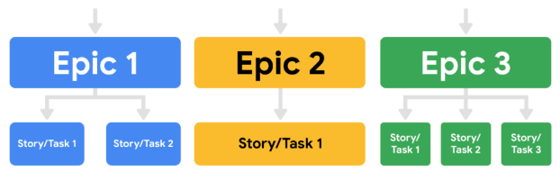
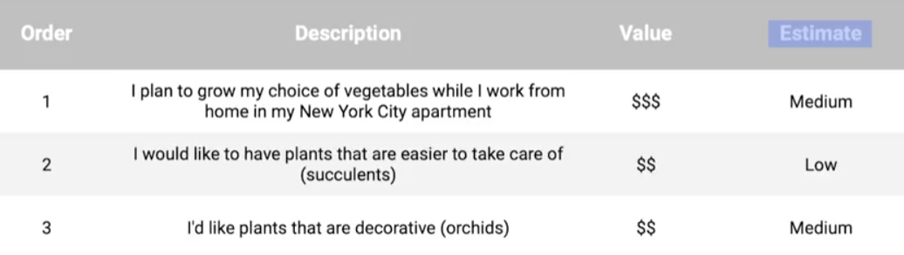
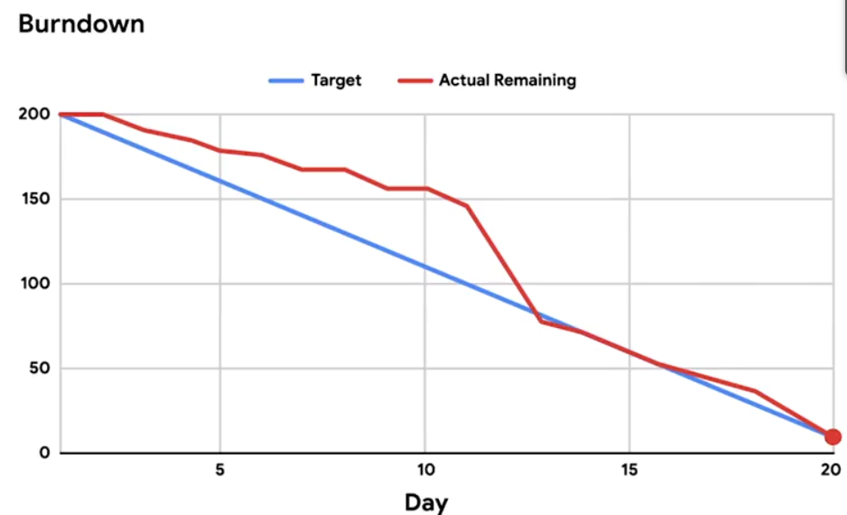
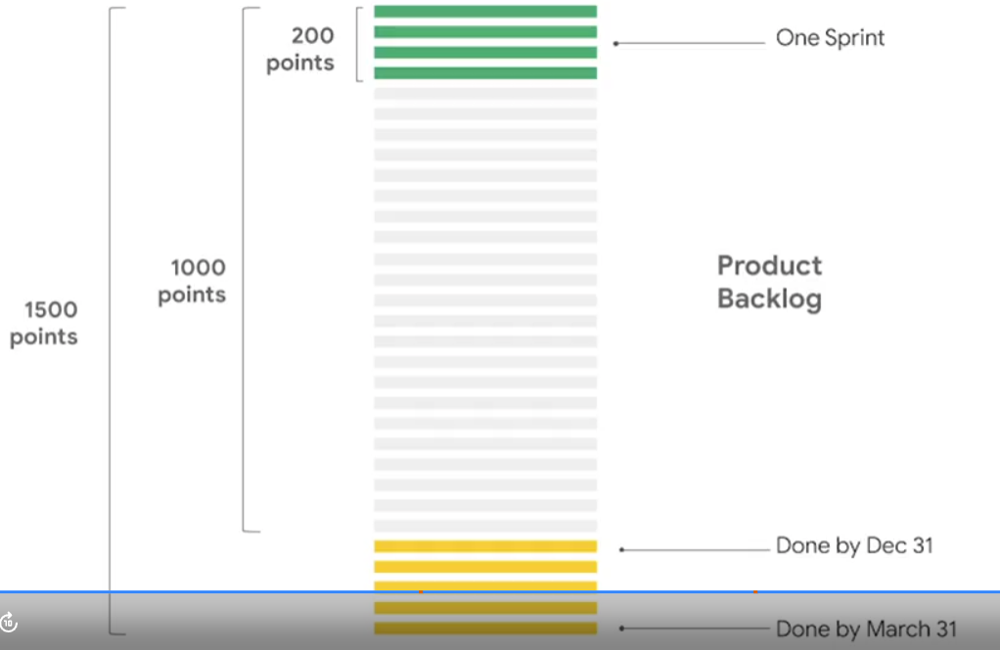
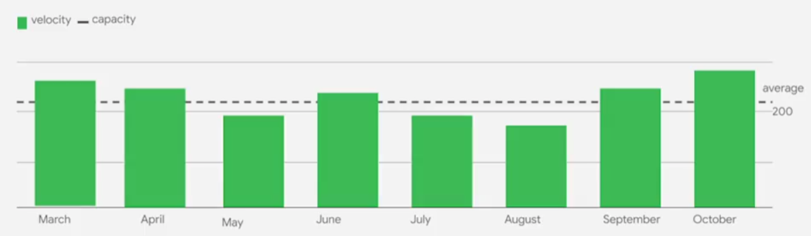

<!-- vscode-markdown-toc -->
* 1. [The Product Backlog](#TheProductBacklog)
	* 1.1. [Introduction: Implementing Scrum](#Introduction:ImplementingScrum)
	* 1.2. [Building a Product Backlog](#BuildingaProductBacklog)
	* 1.3. [Reading Product Backlog: The Scrum Guide overview](#ReadingProductBacklog:TheScrumGuideoverview)
	* 1.4. [Writing user stories](#Writinguserstories)
	* 1.5. [Reading The elements of user stories and epics](#ReadingTheelementsofuserstoriesandepics)
	* 1.6. [Reading Activity Exemplar: Create a Product Backlog](#ReadingActivityExemplar:CreateaProductBacklog)
	* 1.7. [Reading Create Product Backlogs using work management tools](#ReadingCreateProductBacklogsusingworkmanagementtools)
	* 1.8. [Backlog refinement and effort estimation](#Backlogrefinementandeffortestimation)
	* 1.9. [Reading Agile effort estimation techniques](#ReadingAgileeffortestimationtechniques)
	* 1.10. [Reading T-shirt sizes and story points](#ReadingT-shirtsizesandstorypoints)
	* 1.11. [Reading Activity Exemplar: Add estimation](#ReadingActivityExemplar:Addestimation)
	* 1.12. [Reading Add effort estimates using work management tools](#ReadingAddeffortestimatesusingworkmanagementtools)
* 2. [Scrum events](#Scrumevents)
	* 2.1. [Introduction to the Sprint](#IntroductiontotheSprint)
	* 2.2. [Reading The Sprint: The Scrum Guide overview](#ReadingTheSprint:TheScrumGuideoverview)
	* 2.3. [Sprint planning](#Sprintplanning)
	* 2.4. [Reading Create and manage Sprints using work management tools](#ReadingCreateandmanageSprintsusingworkmanagementtools)
	* 2.5. [The Daily Scrum and Sprint Review](#TheDailyScrumandSprintReview)
	* 2.6. [Sarah: The benefits of a Daily Standup](#Sarah:ThebenefitsofaDailyStandup)
	* 2.7. [Reading Releasable Increment versus Minimum Viable Product](#ReadingReleasableIncrementversusMinimumViableProduct)
	* 2.8. [The Sprint Retrospective](#TheSprintRetrospective)
	* 2.9. [Reading Sprint Retrospectives: Pitfalls and best practices](#ReadingSprintRetrospectives:Pitfallsandbestpractices)
	* 2.10. [Reading Activity Exemplar: Recap a Sprint Retrospective](#ReadingActivityExemplar:RecapaSprintRetrospective)
* 3. [Scrum tools](#Scrumtools)
	* 3.1. [Velocity and burndown charts](#Velocityandburndowncharts)
	* 3.2. [Reading Interpreting velocity: Dos and Don'ts](#ReadingInterpretingvelocity:DosandDonts)
	* 3.3. [Utilizing Kanban boards](#UtilizingKanbanboards)
	* 3.4. [Tools for transparency and collaboration](#Toolsfortransparencyandcollaboration)
* 4. [Review: Implementing Scrum](#Review:ImplementingScrum)
	* 4.1. [Wrap-up](#Wrap-up)
	* 4.2. [Reading Optional: Agile in a nutshell](#ReadingOptional:Agileinanutshell)

<!-- vscode-markdown-toc-config
	numbering=true
	autoSave=true
	/vscode-markdown-toc-config -->
<!-- /vscode-markdown-toc -->


##  1. <a name='TheProductBacklog'></a>The Product Backlog

###  1.1. <a name='Introduction:ImplementingScrum'></a>Introduction: Implementing Scrum

Hi there. In the previous section, we introduced you to Scrum. We learned about Scrum values and explained the roles that are essential for all Scrum Teams. In this video, we'll complete our overview of Scrum and dive deep into the setup and day-to-day execution of a Scrum Team. We will go beyond what is provided in the official Scrum Guide and share the most popular tools, methods, tips, and tricks for working with a Scrum Team. I'll discuss how to manage your Product Backlog, which contains all of the features, requirements, and activities associated with deliverables to achieve the goal of the project. Once we have a Backlog, one of the trickiest parts of Scrum is estimation. We'll learn what T-shirt sizes and story points have to do with Scrum as we discuss a technique called relative effort estimation. Next, you'll learn about the five important Scrum events. Those are the Sprint, the Sprint Planning, the Daily Scrum, the Sprint Review, and finally, the Sprint Retrospective. We'll learn what velocity means and how your team can use tools like burndown charts to manage their progress. I'll show you some other useful tools like Google Docs, JIRA, Asana, Trello, Kanban boards, and more, which will help your workflow stay organized and transparent. So let's get started. We'll begin by discussing the Product Backlog, which is a critical artifact for Scrum Teams. Meet you in the next video.

###  1.2. <a name='BuildingaProductBacklog'></a>Building a Product Backlog


In this program, we've introduced you to lots of project management artifacts, such as project plans, statements of work, RACI charts, and more. Now, we'll review an important artifact of the Scrum framework, the Product Backlog. In an earlier video, we defined the 
Product Backlog as the single authoritative source for things that a team works on.
It contains all of the features, requirements, and activities associated with deliverables to achieve the goal of the project. 
The traditional non-Agile project management equivalent would be the set of project requirements. 

There are three key features of a Product Backlog. 
1. First, the Product Backlog is a living artifact, meaning that items are added to the Backlog at any time. The Product Backlog evolves throughout the whole life cycle of the project and serves as a central guide for the team to know what to work on next. 
2. Second, the Product Backlog is owned and adjusted by the product owner. And finally, the Product Backlog is always a prioritized list of features. So when there's new information or new features, those are added to the Backlog in order of importance. The items at the very top of the list are very specific and well-defined, leaving the more vague items for the bottom of the list. Remember, the Product Backlog is the guide and roadmap of your product. It's the central artifact in Scrum, where all possible ideas, deliverables, features, or tasks are captured for the team to work on. Because the backlog is so central, there are a few best practices and pieces of data to capture when working with Product Backlogs. There's the description, the value, the order, and the estimate. Let's go through how to build a sample Backlog with these best practices in mind. First, there's the item description. The item description is exactly what it sounds like, it describes an item. When you're writing an item description, it's a good idea to be really clear when adding Product Backlog items so the details are encouraged. For instance, on Office Green's new project, Virtual Verde, here's an example of an item description: as a Virtual Verde client, I plan to grow my choice of vegetables while I work from home in my New York City apartment. This item description includes essential details, such as an action and a location from the perspective of the customer. This ensures that the Development Team has enough information to meet the users' needs. Next up, we have the value field. This is the field that tells us how much business value the item delivers to the customers, to the team, or to the users. How to indicate value is a choice the Scrum Team should make together. I like to set value by using dollar signs, ranging from one dollar sign for low value, all the way up to four dollar signs for high, added business value. Next, we have to add in an estimate. An estimate is how much effort the Scrum Team thinks an item will take to complete. We'll explore how to do relative effort estimation coming up. But for now, it's important to know that the relative effort estimate is captured in each Backlog item. This field in the Backlog is owned by the Development Team. The next attribute of each Backlog item is the order. As we mentioned, the Backlog should always be prioritized. Both the estimate and value fields we just discussed help the Product Owner figure out where to place an item in the Backlog's order of hierarchy. A Product Owner may ask themselves, how important is this Backlog item compared to all the other items? Product Backlogs order items from highest to lowest priority. This is called a stacked rank. Ordering items this way allows teams to operate more efficiently. For example, our Virtual Verde market research team learned that people who work from home would much rather have plants that are easy to take care of, versus a more high-maintenance plant like orchids. Then, the team prioritizes the simple and easy plants on the Backlog, like succulents, higher than the orchids. So their Product Backlog lists one: succulents, two: orchids. But say, for example, Support gets an email from a user who says they'd love to have bonsai trees, which are also hard to take care of. Where do we put it in the order, before orchids or after? The Product Owner does some research and decides that the team will do orchids first because they find that many more users have requested orchids versus bonsai trees. The Product Owner gives orchids a two dollar sign value rating, bonsai trees a one dollar sign value rating, and puts bonsai trees last on their list. Awesome, let's move on. When creating Backlog items, the goal is to include as much as you can while not stressing about the unknowns too much. For example, the Product Owner in Virtual Verde doesn't know yet how much bonsai trees cost compared to succulents, so they don't know if they serve a high-end market or a low-end market. They document an assumption in the bonsai tree description and move on. They can study that in more detail when it is higher on the priority list. Now you know a bit more about defining the Product Backlog and who owns it. We also discussed how the various roles work with the Product Backlog, and we can identify and describe each field in a Product Backlog. In the next video, we'll learn how to manage the Backlog which changes throughout the Scrum practices. Meet you there.

###  1.3. <a name='ReadingProductBacklog:TheScrumGuideoverview'></a>Reading Product Backlog: The Scrum Guide overview

Product Backlog and Product Goal
In this lesson, you are learning about an important Scrum artifact: the Product Backlog. To recap, the Product Backlog is an ordered list of what needs to be done to improve a product. It is the single authoritative source for items the Scrum Team works on. During Product Backlog refinement, items are broken down and further defined by adding details. These details can vary, but often include such attributes as description, value, order, estimate, and size. 

The Product Goal is the long-term objective for the Scrum Team, and it is included in the Product Backlog. The rest of the Product Backlog defines what tasks will fulfill the Product Goal.

###  1.4. <a name='Writinguserstories'></a>Writing user stories


In the last video, you learned about a Product Backlog. We discussed that in order to properly build the Backlog, the project manager must consider factors like descriptions, value, order, and estimations. This ensures that you, as the project manager, will include enough information to meet the Product Owner's vision for user value. Now that you know about the various fields associated with each item in your Backlog, let's discuss a popular way to capture and manage those Backlog items, user stories. User stories are short, simple descriptions of a feature told from the perspective of the user. This helps the team create a solution that's always centered around the user and the user experience. User stories might start off large and broad or may be broken down to be as small or as specific as possible. In this lesson, we're going to give you some ideas on how to write user stories and how to break them down. User stories are made up of three different elements: the user, the action they will take, and the benefit to them. These elements might have a few different formats, but the most common is "As a user role, I want this action so that I can get this value." When writing effective user stories, the team must have a user in mind. Imagine that the user will interact with the product in order to achieve a specific outcome. What I really like to do at this stage is create personas or detailed descriptions of my different users. Sometimes I even give them names. In Virtual Verde, we could give our users some names and some information about them. Here are some user persona ideas. Leo is my plant vendor, who manages acquiring the plants, the supply chain, and delivery logistics. Felicity is my gardening expert, who helps my support team give our customers really excellent advice on how to take care of their plants. Zach is my amateur vegetable gardener, who wants to use the plants they purchase to make dinner. Nia is my management consultant, who works from home and wants to set up a professional backdrop for video conferences in their home office. Reena is my flower aficionado, who wants to have a different flower arrangement each week to brighten up their home. By giving these users a name and a backstory, we can imagine them in our minds and we will design better products for them as a result. 

Each user story should meet six different criteria, represented by the acronym I.N.V.E.S.T., or invest. 
- I, for independent: the story should be able to be started and finished by itself. It's not dependent on another story to finish it. 
- N stands for negotiable: there's room for negotiation and discussion about this item. 
- V is for valuable: this means that completing the user story has to deliver value. 
- E is for estimable: our Definition of Done must be clear so that the team can give each user story an estimate. 
- S is for small: each user story needs to be able to fit within a planned Sprint. If that user story is too big, it should be broken down into smaller stories. Stories that are a low priority on the Backlog can stay big until they become a priority for an upcoming Sprint. 
- T is testable: a test can be written to check and make sure that it meets the acceptance criteria. 

While the Product Owner is the main person responsible for writing user stories, the team has a responsibility to give feedback on whether the user story is clear and fits the invest criteria before they invest any time into it. In addition to user stories, you need to know the term epic, which simply represents a group or collection of user stories. Some epics for Virtual Verde might be live plant delivery, office plant advice service, vendor management, or client data management. Let's come up with a sample user story for our Virtual Verde clients in the live plant delivery epic. As a Virtual Verde client, I would like to acquire a bonsai tree so that I can have a beautiful plant and I can meditate as I trim the branches. I thought of this one because I bought a bonsai tree for my 12-year-old nephew last year. He did some research and learned that in Japan, pruning bonsai trees is a meditative practice. He's learning how to do that. With that sample user story, the Product Owner creates something called the acceptance criteria, which is essentially the checklist you will use to decide whether the user story is done. To have a completed user story, you must meet the acceptance criteria checklist. Here's an example of acceptance criteria for the bonsai tree user story. Users can: Browse for three different types of bonsai trees to purchase. Compare the three trees to know which is easiest and hardest to grow in their home. Maybe each plant has a beginner, intermediate, and advanced gardener notation next to it. Can purchase specific bonsai tree care packages like fertilizer, trimming shears, etc. Access online to a bonsai booklet sheet, as well as having a care booklet packaged with the tree. Can find a troubleshooting bonsai tree issues page on Virtual Verde's FAQ page. Sounds like an amazing story, doesn't it? It feels like a real thing that a user can interact with and get excited about. Each user story in the Backlog should be written this way. It's natural for items higher on the priority list to have more detail and fewer gray areas. By leaving these low-priority items vague, this saves the team time from working on items that may end up getting deprioritized down the road. Fantastic. Now you know how to explain user stories, the criteria for assessing user stories readiness for the team, and you can explain epics and user stories acceptance criteria. In the next video, we'll discuss Backlog refinement and explain relative effort estimation, T-shirt sizes, and story points. Meet you there.

###  1.5. <a name='ReadingTheelementsofuserstoriesandepics'></a>Reading The elements of user stories and epics

#### The elements of user stories and epics

In the previous video, we introduced user stories and epics. User stories are short, simple descriptions of a deliverable told from the perspective of the user. Creating user stories helps the team develop a solution that is always centered around the user’s needs and overall experience. 

You also learned that epics are a collection of user stories. Think of the concept of user stories in terms of books or films. A story is one single narrative, while an epic is a set of several related, independent stories. Each story tells a specific chronicle, while an epic gives a high-level view of the overall arc. 

**User stories**
The driving factor behind every Scrum project is putting the customer first. User stories are a key component of ensuring that customers are satisfied with the product. A team writes a user story from the perspective of the user. Not only do user stories provide insight into what goals the user wants to achieve, but they enable collaboration, inspire creative solutions, and create momentum by giving the team a small win when the stories are developed. 

When writing user stories, you will need to include the following elements: 

- **User persona.** What is your user like? What is their relation to the project? What goals do they have? 
- **Definition of Done.** This refers to an agreed upon set of items that must be completed before a user story can be considered complete. 
- **Tasks.** What are the key activities needed to complete the user story?
- **Any feedback already provided.** If you are adding features to an existing product and you have already received feedback from customers on a past iteration, make sure to consider this feedback.  

**I.N.V.E.S.T.** 
Recall from the video that your user stories should meet the **I.N.V.E.S.T.** criteria: 

- **Independent:** The story’s completion is not dependent on another story.
- **Negotiable:** There is room for discussion about this item.
- **Valuable:** Completing the user story has to deliver value. 
- **Estimable:** The Definition of Done must be clear so that the team can give each user story an estimate. 
- **Small:** Each user story needs to be able to fit within a planned Sprint.
- **Testable:** A test can be conducted to check that it meets the criteria.

Let’s imagine you are working on a project for a local library. The library hopes to launch a website so that customers can read reviews before they check out books from the branch. The typical template for a user story looks like this: 

`As a <user role>, I want this <action> so that I can get this <value>.` 

Therefore, an example user story for this situation might read: **As an avid reader, I want to be able to read reviews before I check out a book from my local branch so that I know I am getting a book I am interested in.**

**Epics**
An epic’s purpose is to help manage related user stories. In this [post](https://www.mountaingoatsoftware.com/blog/stories-epics-and-themes), Mike Cohn, the inventor of the term “epic” as it relates to Scrum, describes epic as a “very large user story”—one that could not be delivered within a single iteration and may need to be split into smaller stories. The team should discuss together and reach a shared view of how to write and capture their user stories and epics. Keep in mind, epics are just larger user stories that are there to help organize the project. 

Let’s imagine you are creating user stories and epics based on the previous example. User stories may include customers wanting to read reviews of books on the website or wanting to add books to their cart. These user stories could fall into the “website creation” epic. 

Another user story could be that customers want to walk into the library and easily find the non-fiction section. This would fall under the “organization of the physical space” epic.

So rather than those various user stories appearing in a list together, they are organized into sections, or epics.



Hierarchy chart with three epics at the top and corresponding tasks and stories below each of themTesting 1234
It’s important to note that while the Product Owner can write user stories and epics, a Developer can also write them as long as the Product Owner remains accountable for the Product Backlog item.

**Key takeaway**
Epics allow you to keep track of large, loosely-defined ideas, while user stories are a much smaller unit of work, inspired directly from the end user or customer. Both user stories and epics help teams ensure they are delivering value to the customer.

###  1.6. <a name='ReadingActivityExemplar:CreateaProductBacklog'></a>Reading Activity Exemplar: Create a Product Backlog

Imagine you are overseeing the development and launch of Virtual Verde, Office Green's new product line. Virtual Verde’s mission is to make working from home more enjoyable by offering desk plants for home office use. New customers recently received the first batch of plants.

As a next step, your team had planned to introduce new product offerings to the Virtual Verde catalog—starting with Bonsai trees. However, a customer survey discovered that 70% of the new customers had difficulty caring for their plants. Many of the plants wilted and died within a month. This information inspired the team to develop new offerings and companion products to help new owners care for their plants.

From the survey, Office Green learned that they can create value for their customers by making it easy to:

- Find out which plants are easiest to care for
- Access care instructions easily
- Have the right tools to care for their plants
- Remember when to water their plants
- Get expert help and advice quickly
- Have a hassle-free way to return their orders

You will work with your team to create user stories that will help them build solutions to address these customer needs, and add them to the Product Backlog. Your team has already added Bonsai tree user stories to the Backlog, but the new plant care stories have now become the top priority.

Note: In general, the Product Owner leads in prioritizing the Backlog and addressing new concerns. Anyone can work on user stories, but the Development Team typically gives feedback on them.

`As a <user role>, I want <this action> so that I can <get this value>.`

#### Solution 

Compare the exemplar to your completed approach plan. Review your work using each of the criteria in the exemplar. What did you do well? Where can you improve? Use your answers to these questions to guide you as you continue to progress through the course. 

Note: Your user stories, titles, and acceptance criteria will differ in some ways from the ones below. That’s okay--the most important thing is that your user stories are concise, actionable, and deliver value to the user role.

Let’s examine the exemplar:


- Low-maintenance options: The user story follows the correct structure and meets the I.N.V.E.S.T. criteria: “As a potential customer, I want to find out which plants are easiest to care for so that I can purchase low-maintenance options.” The acceptance criteria enable customers to sort plants by difficulty on the website and find out which plants have similar care needs.

- Plant care tips: The user story follows the correct structure and meets the I.N.V.E.S.T. criteria: “As a plant owner, I want to access care instructions easily so that I can keep my plant alive longer.” The acceptance criteria enable customers to consult a plant care leaflet and sign up for monthly emails with seasonal tips.

- Plant care tools: The user story follows the correct structure and meets the I.N.V.E.S.T. criteria: “As a plant owner, I want to have the right tools to care for my plant so that I can keep it healthy and beautiful.” The acceptance criteria enable customers to purchase plant care starter kits or buy tools individually.

- Watering reminders: The user story follows the correct structure and meets the I.N.V.E.S.T. criteria: “As a plant owner, I want to remember when to water my plants so that I don't under- or overwater them.” The acceptance criteria enable customers to sign up to receive watering reminders and purchase reminder stickers for their calendars.

- Expert help and advice: The user story follows the correct structure and meets the I.N.V.E.S.T. criteria: “As a plant owner, I want to get expert help and advice quickly so that I know what to do if my plant gets sick.” The acceptance criteria enable customers to access live chat support and call phone support during extended hours.

- Return policy: The user story follows the correct structure and meets the I.N.V.E.S.T. criteria: “As a customer, I want a hassle-free way to return my order so that I can be sure I have the right plant for me.” The acceptance criteria enable customers to easily find credit and return information on the website and ship their returns with a pre-printed label.

Finally, because the stories all relate to helping customers care for their plants, they all belong to an epic titled “Plant Care Initiatives.”

###  1.7. <a name='ReadingCreateProductBacklogsusingworkmanagementtools'></a>Reading Create Product Backlogs using work management tools

###  1.8. <a name='Backlogrefinementandeffortestimation'></a>Backlog refinement and effort estimation

- **Backlog refinement** refers to the act of keeping the Backlog described, estimated and prioritized, so that the scrum team can operate effectively. 
- After the product owner has added the Backlog items with a description and a value statement, they do Backlog refinement. It is when the Product Owner and some or all of the Scrum team review the Backlog to ensure: 
  - it contains the appropriate items and that nothing new is needed or nothing needs to be removed,
  - that the items are prioritized by the Product Owner, (this is also called setting the order field) 
  - the items at the top of the Backlog are ready for delivery with clear acceptance criteria, 
  - the Backlog items include estimates, or an informed assessment about how much work a particular Backlog item will be. 

- Let's discuss estimates since they're crucial in Backlog refinement. 
 
- We add estimates to Backlog items to inform our planning practices about how much effort it will be to finish each item or user story. 
- **Through estimation, we can find out how much work we have ahead of us**. 
- It can be difficult to estimate the amount of time it takes to complete a task. More often than not, we human beings tend to underestimate the time until completion. When it comes to big projects, this effect can be multiplied many times and can be the root cause of projects being late and over budget. So in Scrum, we try to overcome this problem by practicing relative estimation, instead of absolute estimation.
- `Absolute estimation` is also called **time and effort estimation** in traditional project management. 
- `Relative estimation` means that** instead of trying to determine exactly how long a task will take, we compare the effort of that task, to the effort for another task, and that becomes the estimate**. 
- That estimation is not done in traditional units of hours, days or weeks, instead we assign each Backlog item of value that is a relative unit or size. There are two common relative estimation methods that I find most useful when estimating user stories. These are T-shirt sizes and story points. Let's start with the simpler of the two: T-shirt sizes. To get started, the team simply picks one item on the Backlog that seems to be about a medium size workload, and simply calls that a "medium" in the estimate field. After that they take another item on the Backlog and compare it to the medium item they just identified, and answer the question: if that first item was a medium, what size would I give this one? The team will repeat this process on each additional item or user story on the Backlog until they're all addressed and done. For example, let's take four items from Virtual Verde's Product Backlog. Adding bonsai trees to the catalog, creating a mobile app, launching a new logo, and creating the new account page. The team decides that launching a new logo is their medium. The team, together, compares the other three items to that medium item, which gives them their relative effort estimate. Then, there's my favorite method for estimating user stories, tasks and Backlog items known as story points. Story points are a bit more advanced than T-shirt sizes, but the concept is similar. The first step is the same: The team picks an item as their anchor item and they'll conduct their estimations relative to that item. Instead of using t shirt sizes, this process uses what are called story points. Most teams use a famous mathematical sequence of numbers called the Fibonacci sequence. The sequence is 0,1,1,2,3,5,8,13, 21 continues on to infinity. For the sake of story points, we skip zero and the first 1. These numbers are special in that they start out close to one another, but as the numbers get higher, they spread farther and farther out. This is helpful because as the estimate gets higher, the uncertainty and risk also gets higher. This number combines both effort and risk into one number. In other words, there's not much use in debating estimation values between 21 and 25 points, but choosing between 21 and 34 is a real conversation. This concept can be tricky at first and practice is the best way to learn it to explain this concept. In the classes that I teach at google, we use this example, let's say you want to measure the effort to completely consume different kinds of fruit. You have in front of you: an orange, a strawberry, a banana, a mango, a pineapple and a cherry. What are the factors that go into that estimate? Are there seeds to deal with, do I need to eat it with a napkin? Can I eat in one bite? Do I have to peel it or do I need any tools to prepare it? Okay, let's try it, if I choose a mango as our starting fruit at five points, how might you estimate the rest? I would rate them this way: Orange is three, because the peel is easier than cutting a mango. Strawberry: one, because I don't mind eating stems; low effort. Banana: three, because I have to peel it similar to oranges. Pineapple 13, because it's giant, I can't eat it in one sitting. Cherry: two. stems, seeds, you know what I mean. It's really fun to learn how differently people have learned how to cut up a pineapple. But more importantly, what estimation exercises do for a team is uncover great ideas on how to get something done, as well as surfacing where the riskiest parts of the project are. Why do I like story points better than t shirt sizes? Let's apply them to our Virtual Verde Backlog. Now we can see that adding a new user and adding bonsai trees to our catalogue aren't quite the same Size, which the T-shirt sizes might have implied. Using story points, a new user is eight points and the bonsai trees are 13. Why would I mark them this way? Well, implementing a new user page is a simple software update. Adding bonsai trees is more than just software, it includes finding vendors building a supply chain and more. I mentioned earlier that Backlog refinement, which includes adding estimates and updating the order field, should take place regularly. Just as it's up to the team to choose which estimation method they select, it's up to the team to decide when and how often to conduct Backlog refinement. Some teams prefer to set up special meetings just to refine the Backlog. Others will simply refine the Backlog continuously in conversations or emails. And finally, some teams will conduct Backlog refinement as part of a scheduled event, like their Sprint planning meeting. Now, you know how to define Backlog refinement and you can explain relative effort estimation, T-shirt sizes and story points. In the next video, we're going to learn more about Sprint planning, meet you there.

###  1.9. <a name='ReadingAgileeffortestimationtechniques'></a>Reading Agile effort estimation techniques

There are all kinds of techniques to use when estimating effort in an Agile way. Effective relative effort estimation leads to successful and predictable sprint outcomes, which leads to a successful project overall. Generally speaking, the main steps to Agile estimation are the same, even if the specific approach varies. Some examples of Agile estimation techniques are: 

- Planning Poker™
- Dot Voting
- The Bucket System
- Large/Uncertain/Small
- Ordering Method
- Affinity Mapping


#### Planning Poker™
This particular method is well-known and commonly used when Scrum teams have to make effort estimates for a small number of items (under 10). Planning Poker is consensus-based, meaning that everyone has to agree on the number chosen. In this technique, each individual has a deck of cards with numbers from the Fibonacci sequence on them. The Fibonacci sequence is where a number is the sum of the last two numbers (e.g., 0, 1, 1, 2, 3, 5, 8, 13, and so on). 

Sometimes, Planning Poker decks also include cards with coffee cups and question marks on them. The question mark card means that the person doesn’t understand what is being discussed or doesn’t have enough information to draw a conclusion. The coffee cup card means that the person needs a break.

The Planning Poker strategy is used in Sprint Planning meetings. As each Product Backlog item/user story is discussed, each team member lays a card face down on the table. Then, everyone turns their card over at the same time and the team discusses the estimates, particularly when they are far apart from one another. By first hiding the estimates, the group avoids any bias that is presented when numbers are said aloud. Sometimes, when hearing numbers aloud, people react to that estimate or the estimator themselves, and it changes what their initial thought may have been. In Planning Poker, teams can easily avoid that bias.

#### Dot Voting 
Dot Voting, like Planning Poker, is also good for sprints with a low number of Sprint Backlog items. In Dot Voting, each team member starts with small dot stickers, color-coded by the estimated effort required (e.g., S=green, M=blue, L=orange, XL=red). The items or user stories are written out on pieces of paper placed around a table or put up on the wall. Then, team members walk around the table and add their colored stickers to the items. 

#### The Bucket System
The Bucket System is helpful for backlogs with many items since it can be done very quickly. 
In fact, a couple hundred items can be estimated in just one hour with the Bucket System. The Bucket System is an effective strategy for sizing items because it explores each item in terms of pre-determined "buckets" of complexity. Keep in mind that these buckets are metaphorical; this strategy doesn't require the use of actual buckets, and instead uses sticky notes or note cards as buckets.

In this technique, the team starts by setting up a line of note cards down the center of the table, each marked with a number representing a level of effort. Then, the team writes each item or user story on a card. Each person draws and reads a random item,  then places it somewhere along the line of numbered note cards. There is no need to discuss further with the team. If a person draws an item that they do not understand, then they can offer it to someone else to place. Additionally, if a person finds an item that they think does not fit where it was placed, they can discuss it with the team until a consensus about a more accurate placement is reached. Team members should spend no more than 120 seconds on each item.  

#### Large/Uncertain/Small 
Large/Uncertain/Small is another quick method of rough estimation. It is great for product backlogs that have several similar or comparable items. 

This is the same general idea as the Bucket System, but instead of several buckets, you only use three categories: large, uncertain, and small. Starting with the simpler, more obvious user stories, the team places the items in one of the categories. Then, the team discusses and places more complex items until each is assigned to a category.

#### Ordering Method
The Ordering Method is ideal for projects with a smaller team and a large number of Product Backlog items. First, a scale is prepared and items are randomly placed ranging from low to high. Then, one at a time, each team member either moves any item one spot lower or higher on the scale or passes their turn. This continues until team members no longer want to move any items. 

#### Affinity Mapping
Affinity Mapping is useful for teams that have more than 20 items in their Product Backlog. 

A best practice is to conduct this technique using sticky notes placed onto a wall, whiteboard, or table. Each sticky note features a different user story or item. Using sticky notes allows the team to move user stories around in order to group them by similar theme, group, and pattern. The team begins by placing one sticky note on the board. Then, the team takes the next sticky note and discusses whether it is similar to the first item. Based on the team’s assessment, the second sticky note is placed in the first group or into its own group. 

After all of the items are grouped (there should be anywhere from 3–10 groups total), the team gives a name to each group that represents the general theme of the items. Then, the groups are prioritized by importance so that the team knows which items to tackle first. 

#### Characteristics of effective estimation
Regardless of which technique your team chooses, there are several important characteristics the techniques share that lead to effective estimation:

- **Avoids gathering false precision of estimates.** In Scrum, assigning rough estimates results in more accuracy across the project. Therefore, if the team focuses on identifying relative estimates—rather than a team having a lengthy debate about whether a task will take seven or 10 days of work—the team saves time and avoids potentially missing deadlines.
- **Avoids anchoring bias.** Many of these techniques (e.g., Planning Poker) keep the initial estimate private, which allows team members to form an independent opinion on the estimate before sharing their thoughts with the team. This prevents a known phenomenon called anchoring bias, where individuals find themselves compelled to put forth estimates similar to others in the room to avoid embarrassment. 
- **Promotes inclusivity.** These group estimation techniques not only lead to better estimates but also help the team develop trust and cohesiveness.
- **Leads to effort discovery.** Estimating in these dynamic ways can help the team uncover strategies to get items completed which might otherwise not have been revealed.

#### Key takeaway
There are several strategies to enlist when it comes to estimating effort and ordering your Product Backlog. Any one of these techniques are useful. Choosing a particular strategy is just a matter of what your team prefers. 

###  1.10. <a name='ReadingT-shirtsizesandstorypoints'></a>Reading T-shirt sizes and story points

T-shirt sizes and story points
In the previous videos, you learned about T-shirt sizes and story points—the two most common units used to help teams estimate user stories in Agile projects. In this reading, we will explore the processes of estimating user stories in these units. 

As a recap, relative estimation means to compare the effort estimated for completing a backlog item to the effort estimated for another backlog item. Doing this instead of trying to determine exactly how long a task will take allows your comparisons and estimates to be more accurate relative to one another.

T-shirt sizes
At first, T-shirt sizes may seem like a somewhat unusual way to measure an item or user story. But when you think about assigning estimations to items based on sizes (e.g., XS, S, M, L, XL, XXL), it is actually very helpful and easy. Some of the benefits to using this technique are that it is quick, well understood by Agile experts, and a good introduction for teams who are just learning relative estimation. 

Image of six individual t-shirts with a size on each. Ranging from XS-XXL
So what does the process of assigning T-shirt sizes entail? There are several specific techniques a team can try, but each generally follows these steps. The team: 

Agrees on the chosen scale and metrics to be used.

Identifies at least one anchor backlog item. That item will be assigned a T-shirt size. Some teams will choose two anchor items—one at the top of the range and one at the bottom of the range.

Sorts through the remaining backlog items and agrees on T-shirt sizes for each of them. 

Story points
Using story points as the estimate unit is a little more advanced than T-shirt sizes, but it is essentially the same concept. This method is good for experienced teams. When using story points, teams usually use the Fibonacci sequence. As a reminder, this sequence comes from adding the two previous numbers in the sequence together. For example, 1 + 2 = 3 and 2 + 3 = 5. The important thing to notice about this sequence is that, as the list continues on, the numbers spread further apart from each other. Because of this, story points provide more accuracy and specificity than T-shirt sizes. 

So what does the process of assigning story points entail? There are several specific techniques a team can try, but the basic steps are the same as with T-shirt sizes. The team: 

Agrees on the permitted points values. Some teams cap the size at a certain number, like 21. Some teams decide to jump from 21 to 100 as the next larger value. This is a team decision.

Identifies at least one anchor backlog item and agrees to assign it a points value. Some teams will choose two anchor items, one at the top of the range and one at the bottom of the range.

Sorts through the remaining backlog items as a team, agrees on an estimate for each item, and captures it in the backlog management system. 

Best practices
Some best practices, regardless of the technique you use, include:

Asking the Product Owner questions about the user story or item to ensure that there is enough information to estimate it.

Discussing divergent estimates from various team members so that everyone has a chance to understand how to implement the item.

Agreeing on the final T-shirt sizes or points value and capturing it in the system.

If certain items fall into the larger T-shirt size or story points value range, discussing whether it makes sense to break them down into smaller pieces before moving on.

Key takeaway
Either of these effort estimation units are effective at estimating your items and user stories. As a team, it is important to spend the appropriate amount of time deciding which is better for you. If you are a less experienced team, try starting out with T-shirt sizes, but more advanced teams should feel free to use either method. 

###  1.11. <a name='ReadingActivityExemplar:Addestimation'></a>Reading Activity Exemplar: Add estimation

###  1.12. <a name='ReadingAddeffortestimatesusingworkmanagementtools'></a>Reading Add effort estimates using work management tools

- As a potential customer, I want to find out which plants are easiest to care for so that I can purchase low-maintenance options. Value: $$$. Estimation: 8.
  - Value is high, since finding the right plants can increase the chances of a new plant owner’s success. The search and sorting options should take less effort than the Bonsai Tools, since they won’t involve working with vendors to source items or materials. The effort is estimated at 8, which is lower than the estimate for the Bonsai Tools story.
- As a plant owner, I want to access care instructions easily so that I can keep my plant alive longer. Value: $$$. Estimation: 8.
  - Value is high, since accessible care instructions can make it easier for customers to keep their plants healthy. As a landscaping company, Office Green already has the knowledge and resources to make the care leaflets. The effort involved is therefore closer to the search and sorting options than the Bonsai Tools story, so the effort is also estimated at 8.
- As a plant owner, I want to have the right tools to care for my plant so that I can keep it healthy and beautiful. Value: $$. Estimation: 13.
  - The story brings value to customers because having the right tools can make it easier for customers to care for their plants. Your team may need to source or manufacture products, resulting in more effort, coordination, and costs for the company. Given the resources required, an effort estimation of 13 or higher is appropriate—similar to the Bonsai Tools story.
- As a plant owner, I want to remember when to water my plants so that I don't under- or overwater them. Value: $$. Estimation: 5.
  - Watering reminders bring value to customers who have trouble remembering when their plants need attention. The reminder stickers should take less effort than the plant care leaflets, so the estimated effort is 5. 
- As a plant owner, I want to get expert help and advice quickly so that I know what to do if my plant gets sick. Value: $. Estimation: 8.
  - The value of this item is lower, since customers are just as likely to search the internet for ways to cure their plants as they are to contact support. Live chat and longer phone support hours would be an extension of existing support services. Therefore, the effort required is 8, which is less than sourcing materials for plant care kits.
- As a customer, I want a hassle-free way to return my order so that I can be sure I have the right plant for me. Value: $$. Estimation: 5.
  - The value of an easy return process is potentially high, since it can help with customer satisfaction and retention. The effort involved is relatively low, since linking the FAQ can be done quickly and Office Green has prior experience with shipping and returns. Effort is estimated at 5.

##  2. <a name='Scrumevents'></a>Scrum events

###  2.1. <a name='IntroductiontotheSprint'></a>Introduction to the Sprint

Sprints, which we also called iterations, provide the whole rhythm for the team and is one of the five Scrum events. 
They allow us to get feedback quicker, encourage team collaboration, and provide more focus for Scrum teams. 
Within a Sprint, the amount of work is planned based on the historical capacity of the team and is made ready for the Sprint Planning event. 
It might help to think of each Sprint as a mini-project with planning, execution, delivery, closing, and a retrospective all wrapped into this bite-sized package. Sprints are so important to Scrum, that the other four Scrum events revolve around the Sprint. The Scrum Guide technically defines five events: the Sprint itself, Sprint Planning, Daily Scrum, Sprint Review, and the Sprint Retrospective. Throughout this section of videos, I'll share what the recommended duration, or timebox, is for each of these events. 

Timeboxes are an important concept in Scrum. Some examples of benefits are that:
- they create a sense of urgency which will drive prioritization, 
- provide a window of focus which improves productivity, and 
- they help the team develop a predictable rhythm to their work. 

Timebox range considerations:
1. think about what you expect the frequency of changes to be. How often do you think your requirements might change? If you expect your project to have new requests popping up each week, you may want to make your Sprint length one week, so that you can adapt more often. If the needs are more stable, perhaps longer will be just fine. 
2. think about how much focus time your solution developers might need to build a Backlog item. If the baseline effort for most of your activities requires at least a week to create something valuable, then your Sprint length should be at least two weeks to give the team room to execute without feeling the crunch mode. 
3. think about how much overhead goes into a delivery of your product. If your deliverable or solution requires a large review with many stakeholders or goes through a rigorous testing and quality assurance process that takes several days, you should factor that into your Sprint length and choose a longer Sprint, such as three or four weeks instead. 

Like most things in Scrum, there's no one-size-fits-all. If you set a Sprint length and decide it's too long or too short after a few Sprints, you can always change it. For example, my current team has Sprints that are one week long because we expect a lot of change and new requests coming into our Backlog every week, but often our work takes longer than a week to complete. We're currently reflecting on that contradiction and considering changing our Sprint length to two weeks. Great. Now you know more about defining the Sprint. In the next few videos, we'll discuss the relationship between the other Scrum events and the Sprint. We'll start with the events leading up to the Sprint, conducting Sprint Planning, and compiling the Sprint Backlog. Meet you there.

###  2.2. <a name='ReadingTheSprint:TheScrumGuideoverview'></a>Reading The Sprint: The Scrum Guide overview

As a recap, please read this overview of the Sprint taken directly from the 
2020 Scrum Guide
:

The Sprint
Sprints are the heartbeat of Scrum, where ideas are turned into value.

They are fixed length events of one month or less to create consistency. A new Sprint starts immediately after the conclusion of the previous Sprint.

All the work necessary to achieve the Product Goal, including Sprint Planning, Daily Scrums, Sprint Review, and Sprint Retrospective, happen within Sprints.

During the Sprint:

No changes are made that would endanger the Sprint Goal;

Quality does not decrease;

The Product Backlog is refined as needed; and,

Scope may be clarified and renegotiated with the Product Owner as more is learned.

Sprints enable predictability by ensuring inspection and adaptation of progress toward a Product Goal at least every calendar month. When a Sprint’s horizon is too long the Sprint Goal may become invalid, complexity may rise, and risk may increase. Shorter Sprints can be employed to generate more learning cycles and limit risk of cost and effort to a smaller time frame. Each Sprint may be considered a short project.

Various practices exist to forecast progress, like burn-downs, burn-ups, or cumulative flows. While proven useful, these do not replace the importance of empiricism. In complex environments, what will happen is unknown. Only what has already happened may be used for forward-looking decision making.

A Sprint could be cancelled if the Sprint Goal becomes obsolete. Only the Product Owner has the authority to cancel the Sprint.


###  2.3. <a name='Sprintplanning'></a>Sprint planning

Hi again. In the last video, we discussed the parameters for a Sprint. We learned that a Sprint is one of five Scrum events and creates the frame around all other Scrum events. Next up is Sprint Planning, the first event within the Sprint that sets your team up for success for the next one to four weeks, depending on the length you chose. For Sprint Planning, the entire Scrum team comes together and meets to confirm how much capacity, meaning time and people, are available during this Sprint, and then they identify what items from the Backlog will be done during the Sprint. This becomes the Sprint Backlog, and ultimately, the Sprint goal. This is a time for the Scrum Master to facilitate team communication and answer the following questions throughout the event: Who is available during this Sprint?
Play video starting at ::55 and follow transcript0:55
Are there any vacations or conflicts that we should know about?
Play video starting at ::59 and follow transcript0:59
What has been our average velocity, meaning how many points or Backlog items have we been able to complete in a single Sprint in the past? What can and should be accomplished by the team in this upcoming Sprint?
Play video starting at :1:13 and follow transcript1:13
What is the ultimate Sprint goal? How will the work get done?
Play video starting at :1:18 and follow transcript1:18
Throughout the Sprint, who is responsible for what tasks? We've discussed Sprint lengths and story sizes. So let's explore the meaning of Definition of Done. Definition of Done refers to an agreed upon set of items that must be completed before our user story or Backlog item can be considered complete. Some things that may be within your Definition of Done are the code or solution itself is reviewed by an independent peer group. The product or unit passes all testing requirements, which could include security or performance testing. Documentation is completed. All user story acceptance criteria specified by the product owner is met. And finally, the product owner accepts the user story. 
This list isn't comprehensive, and the team should determine what should be on this list and improve it as needed. A key deliverable of the Sprint Planning event is the Sprint Backlog. The Sprint Backlog is the set of product Backlog items that are identified for completion during the upcoming Sprint. In other words, the Sprint Backlog is a subset of items from the Product Backlog that you'll aim to finish during that particular Sprint. 

For example, Virtual Verde's product Backlog might have 50 Backlog items, and Virtual Verde has created four week Sprints that are named by month: May Sprint, June Sprint, July Sprint, and so on. For the May Sprint, the team has determined that they can complete the top five of those items based on the capacity of the team for May and the size of the effort of those items. Those five items now make up the Sprint Backlog. The Sprint goal is the overarching objective that the team aims to achieve and helps the team understand the why of the Sprint. This should be taken from a big picture view of the items on the Sprint Backlog.
Play video starting at :3:11 and follow transcript3:11
The benefit of having a bigger Sprint goal identified is that it helps the team focus on a broader team objective, rather than putting them into separate work streams. For example, let's say Virtual Verde has identified these five items as the Sprint Backlog for May. Virtual Verde users can purchase bonsai trees. Virtual Verde users can access an online discussion forum about home office decor. Virtual Verde vendor management team can add audit results for vendors.
Play video starting at :3:45 and follow transcript3:45
Virtual Verde users can use a coupon to purchase home office accessories. Virtual Verde customer support can connect products to support tickets. So the Sprint goal is to provide a comprehensive experience to the user who wishes to install a bonsai tree in their home office. All of these Backlog items can be connected to this Sprint goal in some way. For example, there is a new coupon for bonsai, the vendors are audited for bonsai tree quality, and so on. To recap, we just learned that Sprint Planning will result in a well-defined and estimated Sprint Backlog, as well as a Sprint goal to keep the team motivated towards that final achievement. See you in the next video, where we'll cover more Sprint events.

###  2.4. <a name='ReadingCreateandmanageSprintsusingworkmanagementtools'></a>Reading Create and manage Sprints using work management tools

###  2.5. <a name='TheDailyScrumandSprintReview'></a>The Daily Scrum and Sprint Review


As a refresher, one of the principles from the Agile manifesto states: the most efficient and effective method of conveying information to and within a Development Team is face to face conversation. 

Two kinds of face to face events that occur during and after the Sprint: the Daily Scrum and the Sprint Review. 

#### Daily Scrum:
which is sometimes referred to as stand up, is a time for the Scrum Team to synchronize and prioritize activities for the day. 
- In 15 minutes, and at the same time and place every day, each team member answers the following questions: 
  - **What did I do yesterday that helped the Development Team, meet the Sprint goal?** 
  - **What will I do today to help the Development Team meet the Sprint goal?**
  - **Do I notice any impediment that prevents me or the Development Team from meeting our goals?** 
- Daily stand ups should **provide the Scrum Master with the opportunity to quickly unblock the team with little delay**. 
- Daily Stand-ups are an **opportunity to reinforce focus on the Sprint Backlog and Sprint Goal**. 

The official Scrum Guide says that:
- Daily Stand-ups must happen every single day, though I will say I have had successful Scrum Teams who meet less frequently than that. 
  - Try it out and see what works best for your team. 

At the closing of a Sprint, the team will complete another event, known as the **Sprint Review**. 
- This Sprint event is **crucial to the Scrum Pillars of inspection and adaptation**, and **demonstrates the values of openness, courage, and respect**. 

#### The Sprint Review 
A meeting with the entire Scrum Team where the **product is demonstrated in order to determine which aspects are finished and which aren't**. 
- the Development Team and Product Owner will play a heavy role in this inspection and discussion. They will also cover an exploration of which items should be considered done in the Product Backlog, and they'll demonstrate and inspect the product. 
- It should be really fun and uplifting. 
- the team gets to impress each other with the cool things they've accomplished over the last 1 to 4 weeks. 
- These time-boxed meetings should not exceed **four hours** and 
- A good opportunity for the team to **practice the Scrum Values of openness and respect**, as they give feedback about the completed work. 
- Often, some of the greatest product ideas come out of the Sprint Review. 

```
Let's look at an example. With the new service, the Virtual Verde team needs to launch their new website page featuring home office plants. 
Let's imagine that the Scrum Team has a marketing specialist on the team. Remember **Scrum Teams are cross-functional**. 
During the August Sprint Review meeting one of the Sprint Backlog items was to create a launch email to send out to their existing Plant Pals corporate customers about their brand new adventure.

During the Sprint Review meeting, the team gets a demo of the email. They pull up the email onto the shared screen and give the specialist feedback right there in the meeting, such as: I love that opening line, it really draws them in; let's make the opening image bigger; can we make it easier for the recipient to forward this to their friends; Can we make this text shorter? It's a bit long. 
This group inspection of a work product from the team has many benefits that go way beyond just a better marketing email:
- First, it makes the feedback as immediate as possible. No need to wait for people to review on their own and send in their feedback later on. 
  - Feedback and adjustments might be made right there in the meeting. 
- Second, everyone has a voice, leading to a shared sense of ownership of every aspect of their product launch. 
- Last, but not least, the team learns more about how their marketing teammate does their job, leading to greater trust and understanding between team members. 
```

The Sprint Review **is a time for the team to demonstrate what they've accomplished**. 
- It is also where team members unveil what is called the **Product Increment**. 
  - The Product Increment is **what's produced after a given Sprint and is considered releasable**. 
- A product is **releasable when the team has developed a Minimum Viable Product**, which has a set of implemented features or requirements. 
- A `Minimum Viable Product` is a **version of a product with just enough features to satisfy early customers**. 

1. At the end of each Sprint, **only items that have met the definition of done are considered part of the Product Increment**. 
2. Anything that is not done goes back to the Product Backlog. 

###  2.6. <a name='Sarah:ThebenefitsofaDailyStandup'></a>Sarah: The benefits of a Daily Standup

- creates a certain amount of visibility, transparency, and creates a sense of camaraderie and teamwork in a way that just documenting all of that without having a conversation about it doesn't really solve for. 
- isn't to be something at the length of a retrospective or like a town hall.
- to be as short as possible. I usually schedule them for 15 to 20 minutes, and I'm happy if it's shorter. 

We really want people to just quickly get through what they're working on right now and if they have any blockers—anything that might be getting in the way for a particular teammate or project, part of the project and making progress, then you might need to set up additional time with that particular person or workstream owner to work through those tasks and see what you can do to help unstick them. 

- working with people across a lot of different time zones, a lot of different locations. 
  - My recommend is sending out a gut check or survey to be like, "Are we going to be okay with doing 11:00 am ET? Are we going to be okay with doing 4:00 pm ET?," and then sticking with it to make sure that it feels like it's a consensus before you just put it on calendar and expect everybody to show up every single time. 
- If you're working on a project with a very tight deadline, if you're doing a Standup every single day, I try not to create a culture where it's mandatory that everybody's there. It's happening every day, and there might be some components of a project that are moving quicker at other times than others. A great way to keep people within their timebox within a Daily Standup or any type of meeting is to, before the meeting, create an agenda and actually write out next to it how many minutes you're hoping to allocate to whatever update it is. But if something comes up, I generally try to say, don't cut them off mid-sentence. It's never, never a nice way to work with your stakeholders or with your project team to just be like, "Two minutes are up—you're done." But just say at some point when there's a natural break in conversation that, "Hey, we actually needed to give this other thing another 10 to 15 minutes, so can we put a pin in that and come back to it if we have time later and if not in the next meeting?"

###  2.7. <a name='ReadingReleasableIncrementversusMinimumViableProduct'></a>Reading Releasable Increment versus Minimum Viable Product

#### Releasable Increment versus Minimum Viable Product
- Product Increment is what is produced after a given Sprint and is considered releasable. 
  - The Scrum Guide states that “An Increment is a concrete stepping stone toward the Product Goal. Each Increment is additive to all prior Increments and thoroughly verified, ensuring that all Increments work together. In order to provide value, the Increment must be usable.”

#### Potentially releasable product increment**
- Potentially releasable (or shippable) Product Increment is a handy way for teams to think about the desired result of a Sprint. 
  - The **goal** for every Sprint is to result in a **completed, tested, ready-to-ship addition to the product or solution**. This doesn’t mean the product will actually ship to customers—that is why they use the word “potentially.” 

Consider, for example, building an application for *finding and adopting pets*. Three features on the product backlog could be: 
1. Presenting information about available pets
2. Rating potential matches based on adopters
3. Allowing user to contact the adoption center

It doesn’t make sense to ship any one of those features in isolation, but **finishing a potentially releasable Product Increment is helpful because it enables the team to see one feature in its entirety rather than to work on bits and pieces of all three features with none of them actually completed.** 
- With a **potentially releasable Product Increment**, you will **create a complete, working, tested implementation of one feature in a single sprint**.

Having a potentially releasable Increment also allows the team to: 
- get early feedback on the product, 
- ensure that the work is high quality, and 
- have the opportunity to respond to change. 

**You should always focus on a potentially releasable product increment as your sprint goal.**

#### Definition of Done
- It is a formal description of the state of the potentially releasable Product Increment and what **it means when it meets the quality measures required for the product**. 
- It is the team’s agreed-upon requirements for any backlog item that is considered “done.” 
- In software projects, teams often decide that “done” means **the software has been completed, reviewed, and has passed testing**. 
- In a non-software project, a Definition of Done may be **a document including a legal review with approval or a formalized closeout report**. 
- The important part of figuring out your team’s Definition of Done is **to have an explicit, shared understanding of what being “done” entails**.

how do you know when a solution is shippable or releasable? 
- In a Scrum Team, it is ultimately the **decision of the Product Owner to ensure there is value before releasing an item**. To determine this, they may consider a few things: 
  1. Is the increment complete? 
  2. Will it bring value and does it meet quality measures? 
  3. Has it been well-tested? 
  4. Is it usable by the end user? 
  5. Can we use their direct or indirect feedback to improve future versions of the product?

#### Comparing Releasable Product Increment to Minimum Viable Product
- As you learned in the previous video, a m**inimum viable product (MVP) is a version of a product with just enough features to satisfy early customers**. Eric Ries, an entrepreneur and author, coined the term in this [guide](https://www.startuplessonslearned.com/2009/08/minimum-viable-product-guide.html)
  - He defines an MVP as **that version of a new product which allows a team to collect the maximum amount of validated learning about customers with the least effort.** 
    - In other words, gathering insights from an MVP enables quicker feedback from users than developing a full-featured product that may not be 100% tested or secure. Some examples of an MVP could be a landing page for your website or a “buy now” button that doesn't do anything other than register that someone has clicked it. 

- A minimum viable product **is a package of features that may take several sprints to develop**, but every sprint’s goal is to produce a product increment. 
  - To differentiate between a potentially releasable increment and a MVP, let’s take our example_
    - the online pet adoption app and the three features we discussed previously. We noted that each of these features on their own wasn’t a useful release of the solution. However, the Product Owner may decide that the MVP for this user experience is to implement these three requirements for cats only. By reducing the scope of the MVP, the Product Owner is able to release the solution into the marketplace and collect feedback from the users who wish to adopt cats. This feedback will be valuable not only for the cat adoption process but for any type of pet adoption in future iterations of the product. 

#### Key takeaway
- So can a releasable increment be an MVP? Yes!  Does it always have to be an MVP? Not necessarily. 
- A Scrum Master or Product Owner is always **making sure that the team is building potentially releasable increments of the solution or product**. 
- Then, the Product Owner uses those product increments and business insights to determine what will make up a valuable and viable release of the product to their customers. 
  - This is based on both user value delivered and the ability to gather feedback that will continuously improve the product.


###  2.8. <a name='TheSprintRetrospective'></a>The Sprint Retrospective

- The Sprint Retrospective **is an essential meeting of up to three hours for the Scrum Team to take a step back, reflect, and identify improvements about how to work together as a team**. 
- In a Sprint Retrospective, the Scrum Team will reflect on:
  - **what's working or not working for the team regarding the people, the processes, and the tools**. 
  - What improvements are worth exploring in the next Sprint? 
  - What improvements were put in place for the last Sprint? 
  - Were they helpful or not, and why? 
- In my experience, there are some key measures to take to ensure Sprint Retrospectives are a success:
  - First, it's important to demonstrate the Scrum value of respect and always allow the team to remain blameless. 
    - If any team member is worried there may be negative consequences for providing feedback, your outcome won't be as beneficial. You'll need to create a safe space for candor by acknowledging potential awkwardness and, if needed, create a space for anonymous or private feedback. 
    - Participation is key because retrospectives only work if participants feel like their input matters. 
  - If you notice folks aren't volunteering their perspectives, search for ways to generate new ideas, such as asking them: 
    - What is one thing we could try in the next Sprint? 
    - What slowed us down? 
    - What happened that we didn't expect? 
  - The answers to these questions can help you understand how to improve. For example, just recently, my team discovered that having dependencies on stakeholders outside of our Scrum Team was slowing us down. 

In our retrospective, we decided to increase awareness of our priorities with these external stakeholders through some new communication channels. Next, balance the negative with the positive. 

Don't just ask where you can improve, but also ask things like, where did we notice success? **You want your team to feel like they were successful, and you also want to recreate these successful outcomes.** 

Finally, **make sure to act on it**. 
- **Teams can get discouraged from participating in future retrospectives if it feels like their feedback won't inspire change**. 
- **Search for improvements**, or simply **convert the things that worked best into your team's habits and norms**. 
- **Facilitating conversation** among the Scrum Team, both **during retrospectives and in everyday workflows**, is an incredibly important aspect of being the Scrum Master and a project manager. 

###  2.9. <a name='ReadingSprintRetrospectives:Pitfallsandbestpractices'></a>Reading Sprint Retrospectives: Pitfalls and best practices

#### Sprint Retrospectives: Pitfalls and best practices
Throughout this program, we have discussed retrospectives. Retrospectives are an integral aspect of project management, especially true when it comes to working in Scrum. As we mentioned in the previous video, retrospectives are one of the five Sprint events in Scrum. In this reading, you will learn some best practices to implement and pitfalls to avoid when conducting Sprint Retrospectives. 

##### Sprint Retrospectives
As a refresher, retrospectives are workshops or **meetings that give project teams time to reflect on a project and brainstorm potential future improvements**. In the Scrum framework, Sprint Retrospectives occur at the end of each Sprint, which is usually every one-to-four weeks. 

Sprint Retrospectives are a key practice that supports the Scrum theory and values. They are a critical moment to inspect and adapt to the outcomes produced within the Sprint timebox. Retrospectives occur much more often in Scrum than in traditional project management,  so it is important to consider some best practices and pitfalls to avoid to help make them engaging and productive for the entire team.

##### Pitfalls
- Avoid too many gimmicks. 
  - There are many fun games and exercises that can be used by a Scrum Master when facilitating a Sprint Retrospective. However, not all teams enjoy this style. Consider using these exercises only occasionally or when the team asks for new ways of doing retrospectives.
- Try not to only focus on the negative. 
  - Not only is it necessary for the team to recognize what’s not working well, it is also important to highlight where they exceeded expectations. This ensures that the team both avoids failures and repeats successes as well.
- Avoid changing processes after each retrospective. 
  - It is okay to keep a new process in place for a few Sprints before deciding whether it was useful or not. You can always make note of opportunities for change, but try to wait a few Sprints before implementing new changes.

##### Best practices
- **Ask open-ended, probing questions.**
  - Ask questions that require thoughtful discussion rather than a yes-or-no answer. For example, ask, “How could we have better achieved our Sprint Goal?” rather than “Did we achieve the Sprint Goal?””
- **Consider diverse styles of communication and participation.** 
  - Make it easy for all team members to contribute their ideas and feedback. For example, **not everyone feels comfortable speaking up in a large group**. Try things like 
    1. starting the retrospective with silent reflection by journaling or 
    2. putting the team into pairs before starting a larger group conversation.
- **Cover the many aspects of the Sprint when conducting a retrospective.**
  1. The productivity and efficiency of the team
  2. The scope and understanding of the definition of done
  3. Communication and interactions within the team
  4. Stakeholder communication
  5. Progress towards more long-range release plans
- **Consider reflecting periodically on Scrum theory and values by asking specific questions.** 
  - For example, ask, “How could the team become more transparent?” or “How did we abide by our Scrum values in this Sprint?”

###  2.10. <a name='ReadingActivityExemplar:RecapaSprintRetrospective'></a>Reading Activity Exemplar: Recap a Sprint Retrospective

#### Scenario

The Virtual Verde team has completed the first Sprint based on the Backlog you created in the last activity, 
Create a Sprint Plan and Sprint Backlog. The team also gathered for a Sprint Retrospective to go over what worked well during the Sprint, and what they want to change for the future. Your team reviewed each item from the Sprint, and discussed how the work went and how the team performed.

After the meeting, you took photos of the whiteboards your team created during the discussion, knowing you’d need the notes to reflect on team accomplishments and what to change for the future. 

Note: Any team member can write Retrospective recaps. Even if you don't write them, this activity will help you recognize effective recap emails.

Open the slide deck with your whiteboard notes (click the link and select “Use Template” to make a copy in Google Slides or download the notes using the attachment below).  Then review the team’s successes, what worked well in terms of process and performance, and what issues you need to resolve for future Sprints.

The team used a +/Δ format for the discussion: They listed what went well under the + (or plus) heading, and listed roadblocks and things they want to change going forward under the Δ (or Delta) heading (Δ is the mathematical symbol for change).

Step 3: Make a list of takeaways

Make a list of 5-10 key takeaways from the whiteboard notes. These could be about team performance, tasks accomplished, workflow, communication, or anything else you discussed. 

For example, a note reading, “Didn't truly understand the scope of this item,” could translate into the takeaway, “Let’s review how we do our estimates next time, as we may not be accounting for the full scope.”

Step 4: Write a recap email to the Scrum Team

Finally, compose an email recapping the meeting and listing the key takeaways. Be sure to include:
- A Subject line: It should be brief and describe the content of the message.
- An Introduction: Greet the team and explain why you are sending the email.
- A Recap: Summarize your thoughts on the retrospective. Were you pleased with how the meeting went? How much did the team accomplish?
- Key takeaways: List 5-10 key takeaways from the whiteboard notes. What went well with the Sprint? What issues need to be addressed before the next Sprint?
- Next steps: Wrap up the email and propose next steps.
- A Closing: Sign off with your name and title.


##  3. <a name='Scrumtools'></a>Scrum tools

###  3.1. <a name='Velocityandburndowncharts'></a>Velocity and burndown charts
In this video, we'll explore two very important concepts that allow a Scrum Team to manage their work as they progress through a Sprint and the entire Product Backlog. These two concepts are burndown charts and velocity. Let's start with what a burndown chart's purpose is and how a Scrum Team uses it. A burndown chart measures time against the amount of work done and the amount of work remaining. The goal of using a burndown chart is to keep the team aware of how they're doing against their overall goals. In a Scrum Team, burndown charts reflect how the team is doing with completing user stories during the Sprint. The Scrum Master will review the burndown chart, sometimes daily, to examine if the team will hit their goals or not. There are some simple math and numbers here. Now is a good time to mention what to do if your team is using T-shirt sizes rather than story points. In that case, simply map the sizes to a number and use that number for the burndown and velocity calculations. For example, maybe an extra small is one point, a small is two points, a medium is five, a large is eight, and so on. Here's an example, let's imagine our Virtual Verde team's Sprints are four weeks long, which will count as 20 business days. In their July Sprint, the Sprint Backlog had stories that added up to a total of 200 points to be completed. If you assumed an even burn of points over the business days, you'd expect 10 points to be burned each day. By day five in their Sprint, 22 points had been burned or completed. It's only 25 percent of their Sprint, so maybe things are on track. By day ten, 45 points had been completed. We should have been approximately halfway done by now, which would be 100 points. According to the burndown chart, we're running late, according to our Sprint goal. Now this isn't the time to panic and stress out the team. At this point, as Scrum Master, you should already be discussing with your team to find out how you can help and unblock them. By day 15, the burndown is 140 points. 


Phew! The team is back to humming along. By day 20, the burndown is 188 points completed. Great job. Let's discuss what happened in the retrospective. In Scrum, there's a term for how many points a team burns down in a Sprint on average. 
- velocity: it is a measure of how many points a team burns down during a single Sprint on average. When the team is conducting Sprint Planning, they're using their average velocity over at least three Sprints to determine how many items they can safely add to their Sprint Backlog. 
There are a few things worth noting when it comes to calculating velocity: 
- there's no such thing as a good velocity or bad velocity. Velocity is simply what the team has historically been able to achieve in a predetermined timebox. 
- each team will have a different velocity, especially since each team decides their own point system calibration. It's impossible to compare your team's velocity to another team's. For example, I'm currently on a team of three people and we're burning down 70 points in a one-week Sprint, so our velocity is 70. But on a previous five-person team, our velocity for a two-week Sprint was only a 120 points. Was one team better or worse than the other? Nope. Just different. 
  
Once you have a stable velocity and a refined Backlog with prioritization and estimates, this unlocks an incredibly valuable superpower. You can now tell your stakeholders and sponsors two important things. You can tell them approximately how long it will take to complete the entire Product Backlog and how much of your Backlog will be completed by a particular time. This ability to confidently predict when things can get done is one of the most powerful tools in Agile and Scrum, in my opinion. 

Let's imagine that our Virtual Verde team has averaged 200 points in each monthly Sprint for the last three months. The team knows they have 1500 points left in their Product Backlog. They can now can say that it will take them approximately seven or eight Sprints to complete the entire Product Backlog. What if it's July and the team wants to know what will be available by January first? No problem—that's five months away. 



Just go down the Backlog from the top and draw a line when you hit 1000 points. That's a pretty confident estimate based on the past performance of the team. Pretty powerful. If you want to pull in the dates, you can use this information to decide to add people to the team and increase velocity, rearrange the priorities, or make other key project decisions. On any given team, it can take multiple Sprints to reach a stable velocity, and that's perfectly normal. 



As the team gets used to estimating and working together, the velocity should begin to stabilize. Now you know how to define velocity, velocity trends, and burndown charts. You also learned a bit about how an Agile team reaches a stable velocity and what that entails. Using these tools is essential to any high-performing Scrum Team. They are powerful means to achieve execution predictability. I'll demonstrate another useful visualization tool in the next video. Meet me there.

###  3.2. <a name='ReadingInterpretingvelocity:DosandDonts'></a>Reading Interpreting velocity: Dos and Don'ts
Interpreting velocity: Dos and Don'ts
- velocity as **“The measure of how many points the team burns down in a given Sprint on average.”** 
- Velocity **measures the amount of work a single team can be expected to complete during an iteration**. 
  - When we refer to **story points**, we are referring to **a unit of measurement that expresses the estimated effort required to implement that Product Backlog item**. 
  - These story points are calibrated and decided on by the team.

#### Calculating velocity
Estimating effort can be done in a variety of units. Most often in Agile teams, story points or T-shirt sizes are used to estimate effort. If you use T-shirt sizes, your team will map those sizes to a numeric value for the purpose of calculating a team velocity. 

- When your team begins running Sprints or iterations, they won’t be able to accurately determine velocity because they will have no historical basis on which to calculate an average number of points completed in a Sprint. 
- In their very first Sprint, your team will make a rough guess as to how many items they can complete just to get started. 
- **Once a few Sprints have been completed, your team will have a good measure of their velocity**, and they will use that number to determine which items to include in their Sprint Backlog. 
- This should be easy to do if your team has a properly prioritized and estimated backlog to work from. As you will recall from the videos, this process is called **backlog refinement**.

#### Using velocity for good 
- When interpreting velocity, it is important to keep a few things in mind. You may feel inclined to share velocity with members outside of your team or to use velocity as a performance or comparison metric. 
- You may also feel inclined to use it to determine a projected delivery date. However, some Agile experts warn against these practices. Let’s discuss why. 

**Do: Be careful when sharing velocity with external stakeholders**
- Velocity can be helpful for individuals outside of the Scrum team, but when sharing it with non-team members, be very careful. Since **velocity is different for every team, a stakeholder may not have enough context to interpret it**. Be sure to share relevant supporting materials to help add context. A good example of this is sharing the velocity with a corresponding date range and visualization that indicates trends over time. There may be dips and spikes in velocity that draw insights and encourage improvements in future projects. 

**Don't: Use velocity as a performance metric**
- It is natural for individuals to want to quantify performance through data, but it can be detrimental for a team to feel that kind of pressure within their Sprints. There may be executives, sponsors, or stakeholders that want to use velocity as a performance metric, but this will only hurt the team by encouraging tactics like intimidation. If the team is worried about their velocity making it seem like they are underperforming, the team’s culture can become harmed as a result. 

**Don't: Use velocity as a comparison metric**
- If you are leading a few different Scrum teams, you may be tempted to compare the two teams’ productivity based on their velocity. You may have the impulse to check which teams are completing the most story points per iteration. 
- However, **the weight of different story points is subjective because they are created by the team**. One team may consider a story to be five points, but another team might consider it to be closer to three points. Therefore, judging productivity solely on velocity isn’t accurate or fair. Additionally, **velocity is not a measure of value**. One team’s velocity might differ from another team’s, but this variability is fine as long as both teams are delivering value to your stakeholders.

**Do: proceed with caution when using velocity as a metric for project delivery date**
- Using velocity to estimate the delivery date of a project spanning numerous Sprints can be tricky. Velocity can be used as a pressure point by external stakeholders who want to set a date for their product launch. 
- Velocity **can also create false expectations** and a harshly competitive culture when the team doesn’t hit the estimated dates. 
- Projecting deliverable dates is harmful because it can take a team several Sprints to really understand what they are capable of delivering in each iteration. 
- Also, if you map out too many dates in advance, you aren’t able to account for the changes and issues that will arise. Therefore, make sure you are being careful not to use the estimated delivery dates as commitments. 

###  3.3. <a name='UtilizingKanbanboards'></a>Utilizing Kanban boards

There are other visual tools that can also help a team progress throughout their Sprint. The tool we cover in this video may be familiar to you since we briefly covered it in a previous video. It's the Kanban board. Some teams refer to this as the Scrum board rather than the Kanban board. While the two do have minor differences, they're referring to the same basic tool.

The Scrum Guide doesn't specify exactly what a Scrum board is, but some Scrum tools available in the market provide a board that add some features to a Kanban board. These features make it suitable specifically for Scrum. Both boards have three main features that make it a great Sprint tracking tool for Scrum Teams. There's:

- visualization, 
- work-in-progress limits (also known as WIP limits), and 
- flow of work. 

Visualization can be an important strategy for learning and tracking.

This Kanban board communicates everything we need to know at a glance. We can point at specific work items on the board we want to discuss, use images with variation and colors and sizes as we check in on work items, and we can notice where the challenges are in our team.

Without this visualization, it's not as easy to find out where we can make improvements. These boards make it easy to notice where WIP limits break. We learned earlier in this course that common WIP limits are constraints on how many work items the team actively works on at any given time. This provides focus for the team, which is one of our Scrum values.

Have you heard the idea that there's no such thing as multitasking? In Scrum, it can be very true. And the more work you have, the less efficient you can become. When you use a Kanban, or Scrum board, each team may set a WIP limit based on their configuration and context. This way, it's really obvious to notice when the team is going beyond the WIP limit.

And finally, using a Kanban board can give you a better sense of the flow of work through the team's execution processes. Physical Post-it notes or even virtual versions of Kanban or Scrum boards allows the team to experience the movement of work from one phase to another. Using a Kanban or Scrum board, the team will move the items through the following stages: to do, doing, and done. This action often takes place during the Daily Scrum, but the team can move items at any time.

For example, with our Virtual Verde team, let's say that Leo our plant vendor has finished the item to finalize contracts with the three top plant vendors we plan to use for our initial launch.

Leo will go to the Kanban board and move his item from doing to done, and find out what's next to work on.

If for some reason that was the last thing for him in the Sprint, he may reach out to his team to see where he can help a teammate with their work. So to recap, Kanban and Scrum boards are really useful because they help you visualize your progress, set and maintain your team's workload and WIP limits, and give you a sense of the flow of work throughout the team's execution process. Awesome. I'll see you in the next video, where we'll review a few software products that help a Scrum Team manage all of this information.

###  3.4. <a name='Toolsfortransparencyandcollaboration'></a>Tools for transparency and collaboration

Welcome back. We've covered a lot of ground in this section. We've learned all about the various Scrum events and what each of them does to ensure a Scrum Team's success. To wrap up this section, we'll review the tools available to implement and facilitate the Scrum and Agile workflows. These can help improve collaboration and keep your workflow transparent. As a refresher, one of Scrum's pillars is transparency. So a Scrum Team's success is very dependent on transparency within the team, and tools encourage everyone to be fully aware of progress and updates. These tools will be used to store the Product Backlog, Sprint Backlog, and any other essential documentation. Using Scrum tools will help your team keep all of your progress organized and in one centralized place. We've already heard about scheduling and work management, collaboration, and productivity tools. Let's revisit those tools now from the perspective of a Scrum Team. Let's talk about scheduling and work management tools. In traditional project management, applications like Microsoft Project provide you with very powerful schedule and resource management capabilities. In a Scrum Team, though, the most critical tool you'll need is something to manage your Backlog and your Sprints. Jira by Atlassian is a popular Agile team project management tool, and it supports all aspects of team and backlog management. It can be customized for your team and will provide you with the central place to find all things related to your Scrum Team, your Product Backlog, your Sprint definitions, your velocity, your burndown charts, and much more. After Jira, there are other tools in the market that your team can purchase that provide similar capabilities. Some teams build their own Agile tooling inside of spreadsheets, too. When it comes time to choose a tool, most of these tools will let you have a free trial period before you make a permanent choice. If you're searching for something simple and fun to try, I recently started using Trello's Kanban capabilities just for my own personal projects. It's helped me plan a move and organize a big birthday party for my dad. Asana is another tool we've referenced in this program that works great for Sprint Planning and Backlog management. Asana helps teams plan and coordinate their work—from daily tasks to strategic initiatives. With Asana, everyone can view, discuss, and manage team priorities. This allows teams to understand who's doing what and their time frame for each task. It's great for assigning tasks, automating workflows, tracking progress, and communicating with stakeholders. These applications are built specifically to help a team manage a Backlog and their Sprints, but there are many activities that these products can't perform. This is where additional tools for documentation, collaboration, and productivity come in. You'll want to use some form of documentation or word processing tool. This ensures that you capture key information about your project in a long format. Many products in this space feature both the documentation and the collaboration, all in one tool. Google Docs is a great example of this, but it's not the only one. Spreadsheets, such as Microsoft Excel or Google Sheets, are useful for most teams. You can use spreadsheets to capture Backlogs and Backlog item information or any number of other pieces of information for your project. You may also want a tool to create presentations, either using Google Slides or the Microsoft equivalent. These presentation tools are used all the time to—you guessed it—present information to the team. And finally, since it's Agile, we value individuals and interactions, so it's essential that we have excellent tools for collaboration and communication. The types of collaboration you'll experience on a Scrum Team are video conferencing, team and one-on-one online chats, and e-mails. These tools will result in huge productivity improvements for your team. They allow teammates to communicate more effectively, get quicker answers, and unblock themselves long before the next day's Daily Scrum. There are so many useful applications out there to help Scrum Teams maintain the desired transparency between team members. In Scrum, they decide what to use together. Just like that, you're almost at the end of the module. In the next video, we'll review and wrap up what you've learned so far.

##  4. <a name='Review:ImplementingScrum'></a>Review: Implementing Scrum

###  4.1. <a name='Wrap-up'></a>Wrap-up
Congrats on finishing another set of videos. I hope you're feeling as excited about Scrum and Agile as I do every day. We spent a lot of time covering one of the most important parts of Scrum: the Product Backlog. We learned about refining the Backlog and the importance of relative effort estimation using methods like T-shirt sizes and story points. We identified the five important Scrum events, which are the Sprint itself, Sprint Planning, the Daily Scrum, the Sprint Review, and Sprint Retrospective. We learned about when each of these take place and what their purposes entail. We discussed visual learning by using tools like burndown charts and Kanban boards. We also explored tools like Jira, Asana, and Trello, which make it easy to keep your workflow transparent and keep every team member up-to-date on the progress made throughout the Sprint. I really want to congratulate you on making it this far. You've already learned and accomplished so much, and I'm excited for you to continue learning. Next step, we'll learn about using Agile and Scrum to adapt in real-life situations.

###  4.2. <a name='ReadingOptional:Agileinanutshell'></a>Reading Optional: Agile in a nutshell

[LINK](https://www.youtube.com/watch?v=502ILHjX9EE)