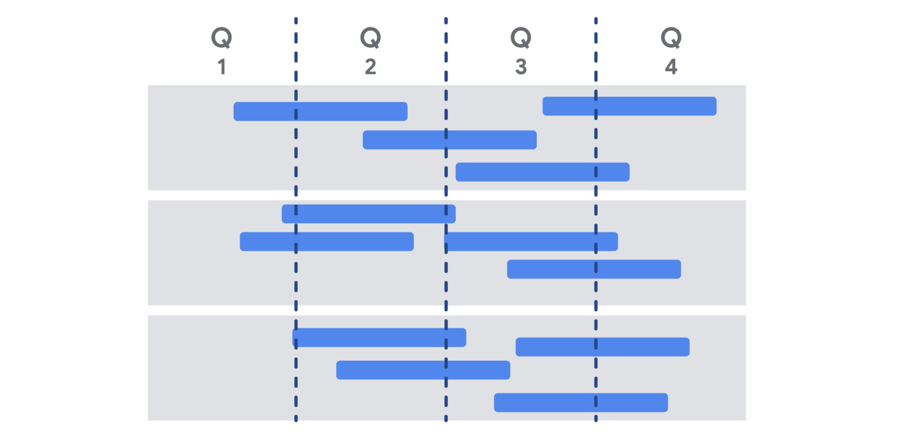

<!-- vscode-markdown-toc -->
* 1. [Understanding value-driven delivery](#Understandingvalue-drivendelivery)
	* 1.1. [Introduction: Applying Agile in the organization](#Introduction:ApplyingAgileintheorganization)
	* 1.2. [Maximizing value-driven delivery](#Maximizingvalue-drivendelivery)
	* 1.3. [Reading Case study: Forming a value-driven task force](#ReadingCasestudy:Formingavalue-driventaskforce)
	* 1.4. [Camron: How Agile can drive value](#Camron:HowAgilecandrivevalue)
	* 1.5. [Components of a value roadmap](#Componentsofavalueroadmap)
	* 1.6. [Reading Product roadmaps: Benefits, pitfalls, and best practices](#ReadingProductroadmaps:Benefitspitfallsandbestpractices)
	* 1.7. [Creating an effective value roadmap](#Creatinganeffectivevalueroadmap)
	* 1.8. [Reading Responding to change over following a plan](#ReadingRespondingtochangeoverfollowingaplan)
	* 1.9. [Reading Activity Exemplar: Make changes to your release plan](#ReadingActivityExemplar:Makechangestoyourreleaseplan)
* 2. [Leading through change and challenges](#Leadingthroughchangeandchallenges)
	* 2.1. [Facilitating organizational change](#Facilitatingorganizationalchange)
	* 2.2. [Reading The influencer change framework](#ReadingTheinfluencerchangeframework)
	* 2.3. [Coaching an Agile team](#CoachinganAgileteam)
	* 2.4. [Reading Coaching versus managing in Agile](#ReadingCoachingversusmanaginginAgile)
	* 2.5. [Agile team challenges](#Agileteamchallenges)
	* 2.6. [Common Agile coaching challenges](#CommonAgilecoachingchallenges)
* 3. [Agile opportunities](#Agileopportunities)
	* 3.1. [The evolution of Agile](#TheevolutionofAgile)
	* 3.2. [Reading The relationship between Agile and DevOps](#ReadingTherelationshipbetweenAgileandDevOps)
	* 3.3. [Reading Scaling Agile](#ReadingScalingAgile)
	* 3.4. [Jez: My thoughts on Agile](#Jez:MythoughtsonAgile)
	* 3.5. [Agile project management opportunities](#Agileprojectmanagementopportunities)
* 4. [Course review: Agile in practice](#Coursereview:Agileinpractice)
	* 4.1. [Reading Reflect and connect with your peers](#ReadingReflectandconnectwithyourpeers)
	* 4.2. [Course wrap-up](#Coursewrap-up)
	* 4.3. [Reading Course 5 glossary](#ReadingCourse5glossary)
	* 4.4. [Reading Getting started on Course 6](#ReadingGettingstartedonCourse6)

<!-- vscode-markdown-toc-config
	numbering=true
	autoSave=true
	/vscode-markdown-toc-config -->
<!-- /vscode-markdown-toc -->

##  1. Understanding value-driven delivery

###  1.1. Introduction: Applying Agile in the organization

Hi there. In the previous section, we wrapped up how to run a project using Scrum. I introduced you to the day-to-day practices that most Scrum Teams use. These practices include developing user stories, managing a Product Backlog, and running Sprints. In this next section, we're going to take an even wider view of Scrum and Agile. I'll introduce you to how to use Scrum and Agile in your daily life. I'll help prepare you to apply Agile thinking and methods to both job interviews and potential work scenarios. These work scenarios will teach you how to implement Agile to deliver value and achieve your business goals. You'll also learn some techniques for responding to risks and team dynamics. Finally, I'm going to wrap up this course on the foundations of Agile by discussing Agile as it applies to the broader project management discipline. I'll help you figure out how to use Agile in your next position. Ready for the final stretch of this Agile journey? Let's go.

###  1.2. Maximizing value-driven delivery

Hi again. Previously, you learned how to effectively implement Scrum so that you and your team can deliver amazing products to your users. In this video, we'll explore the result of a project and the end product you'll ultimately deliver, which is what holds value for the user and the customer. I'm going to define the term value as it relates to project management. Then, I'll share some strategies and tactics you can employ to maximize the value your team delivers. The end product of a project is what provides value to the user. Value could be financial benefits, user growth and engagement, or compliance adherence. The term "value" can mean different things for each customer based on what they expect the product to accomplish. The number one Agile principle is to satisfy the customer by delivering valuable software. You can always replace the term software with the words product or solution for non-software related projects. Delivering value as quickly and efficiently as possible to users is the primary reason Agile came into existence. The term "value-driven delivery" means you and your team are focused on delivering a product of high value. Just because you deliver a product, that doesn't mean it's valuable. As I explained during the overview of Agile history, there was a growing problem of project teams churning out products that weren't very valuable. This is because teams were focused on the process and weren't taking the time to evaluate the usefulness of the product until the very end, after it had been delivered. Agile redirects the team's focus to be about the product and ensures that the process for producing the product supports the goal of delivering value. How can you make sure your team is focused on value-driven delivery? Build the right thing, build the thing right, and run it right. Remember, Agile and Scrum evolved out of the software industry. The terms "build" and "run" describe processes for building or running a software program, machine, or other technology. You can replace the words "build" and "run" with terms like "create," "produce," or "deliver" for non-software projects to describe the same concept. Let's break this down. First and foremost, to deliver value, you have to build the right thing. You can do this by making sure you really understand what your customers want. You might ask the customer what they want, and they may say they want to build a website to promote their new plant service. But take this one step further and ask about their goals. Do they want to increase their brand recognition? Do they want to get more customers? Having a solution-oriented conversation with your customer will help you build the right thing. The Agile value of "individuals and interactions over processes and tools" extends beyond just the team. It refers to having those important interactions with our customers and users, too. Next, you must build the thing right. That's lingo for ensuring that your team only builds the requested or approved features. Working on features that aren't necessary can lead to complexities in the product that don't add any value to the users. In addition, building more than you need delays or reduces your value upon delivery. It also increases the risk of bugs or other issues down the road. Finally, in addition to building the right thing and building the thing right, you have to make sure that you're running it right. To run it right means that your team has thought through how the user will interact with the product once it's been delivered. Make sure your team thinks through some of the operational tasks that will need to be addressed after the product has left the door. Ask the following questions: How do users get support? How does the product add value to users long after they initially received it? How do you make sure that new features and capabilities reach the existing users? Building the right thing, building the thing right, and running it right all work together to ensure that the team creates a steady and continuous delivery of value to users throughout the life of the product. Let's consider how the Virtual Verde team can ensure that they focus on value-driven delivery. First, how could the Virtual Verde team ensure they build the right thing? How do they know they're creating something the customer really wants? In this case, the team needs to ensure that they create a service providing the types of plants that customers want to buy. They could create a survey that asked current and potential customers what their plant preferences are and the type of home office design they want to create. Then they'll use this data to update the user stories on their Product Backlog. Next, how could the Virtual Verde team ensure they build the thing right? Once the team knows what kinds of plants and designs the customer wants, how do they ensure the right processes are in place to deliver them? Well, the team can secure a trusted plant vendor that carries the desired plant types and work with designers to make pots, vases, and other plant accessories in the different design styles that customers like. The team can also communicate with marketing to make sure the types of plants and designs that customers want are prominently featured on the website and in the catalog. Finally, how can the Virtual Verde team makes sure to run it right? How do they ensure customer satisfaction once a customer has signed up for the service? How does the Virtual Verde team retain their customers long after their plants have been delivered? The Virtual Verde team can send out follow-up customer satisfaction surveys that ask about their plant and design offerings, delivery times, plant quality, and other insights. The team can then use this data to continually evaluate their vendors, plant and design offerings, and marketing strategy. For example, the team could find ways to increase the quality of service by offering watering cans and automatic plant health systems, or even free monthly gardening tips, so the user feels empowered and supported to maintain their plants. There are many ways to maximize your team's value delivery. Building the right thing, building the thing right, and running it right all work together to ensure that the team delivers value to users. In the next video, I'll teach you another effective, proven way to deliver value called a value roadmap. Meet you there.

###  1.3. Reading Case study: Forming a value-driven task force

In the previous video, you learned that value-driven delivery is critical to Agile and Scrum project management. In this reading, you will read a case study and analyze how Agile brought value to the organization. 

Learning from case studies
As you pursue your career in project management, you will come across many resources for learning about other companies and their journeys to becoming Agile. 

Case studies—in-depth, data-driven analyses of a business, community, or organization—are valuable tools for gaining key industry insights and learning from the successes and failures of your competitors. 

When reading case studies, focus on the problem, the effect it had on the business or organization, and the pros and cons of the solutions reached to help you determine some applicable key takeaways.

As you read, ask yourself: 

What is the issue?

What is the goal of the analysis?

What is the context of the problem?

What key facts should be considered?

What alternatives are available to the decision-maker?

What would you recommend, and why?

Value-driven delivery at Penta
The case study linked below is about how the team at Penta, a construction software company, created scrum-team-based problem solving by forming an Agile task force. 

Keep the questions above in mind as you read through the case study. Notice how the various roles and responsibilities were essential to the process and how the company brought people from across the organization together to ideate, test, and analyze. 

When you are finished, think about how Scrum and Agile principles benefitted Penta and how it improved their overall business model.
Link: 
A Six-Month Cultural Transformation: The Penta Story
###  1.4. Camron: How Agile can drive value

My name is Camron. I'm a technical program manager. A technical program manager is a program manager with a technical background that enables him to engage in technical conversations or decisions with their team. My favorite thing about Agile has got to be the flexibility. So when you're making most of the decisions at the beginning, when you know the least, not all those decisions might be right. Some will, but probably all of them won't be. So with Agile, it's a framework and a mindset that is open to that change that embraces it. It welcomes it as you learn more. Agile gives you built in opportunities to make changes. An important aspect of Agile is incremental delivery.

You're delivering little bits over the course of a long period of time.

To contrast that, you could think of Waterfall—that's when you deliver everything at once to the customer at the end. In a Waterfall project, you have to wait and wait and wait until the very end to get everything, and perhaps you're waiting days, months, years, and you cannot extract any value out of it until the very end until the product is delivered.

I think that makes sense for a house. I think that makes sense for a car.

I cannot give someone parts of a car and have them start getting value out of it

because a car has certain safety requirements. For things that take longer to figure out, for more challenging design issues, you don't have to sacrifice the entire project for that one last bit. If you built 90% of the project and you can ship it, go ahead. Agile lets you extract that value. That way people can use that 90% while you're trying to figure out that last ten. And then hopefully you have an ecosystem where it's okay to deploy or release that last 10% down the line. Change is never free. Because you've already communicated plans, you've already made estimates, you already have some work in progress. Then if you're going to change that, you're going to lose a little bit. Is that change within your threshold or your budget to be able to adapt to get it right or get it better. It's not always about it being perfect. It's about it being good. [SOUND]

###  1.5. Components of a value roadmap

Hello again. In the last video, you learned about value-driven delivery, which is when the team is focused on delivering a product that has maximum value for its customers. One way to help teams make sure they're staying focused is by following a value roadmap. In this video, I'll explain what a value roadmap is and what you need to create one. As a project manager, part of your job is to help team stay focused on delivering value. A great way to do this is to build a value roadmap. It's an Agile way of mapping out the timelines and requirements for the product development process and can be used in all types of businesses. This roadmap is a guide that demonstrates where to go, how to get there, and what to accomplish along the way in order to maximize value.

It helps map out a product idea and the strategy for how to deliver it. As the team follows their roadmap, they gather input from customers and stakeholders and apply their findings to each iteration of the product. Creating a roadmap helps the team explain the vision of the product and can also be used to identify important milestones. A typical value roadmap has three components: a product vision, a product roadmap, and release plans.

The first component of a value roadmap is the product vision. Your product vision is a critical step to starting any new Scrum project. Your vision is based on your user interviews and market analysis and becomes your team's north star. In other words, it's what guides your team. The product vision defines what the product is, how it supports the customer's business strategy, and who will use it. Next, there's the product roadmap, which the Product Owner is responsible for creating and maintaining. It provides a high-level view of the expected product, its requirements, and an estimated schedule for reaching milestones. It's key to making sure your team is building the right thing.

The third component of a value roadmap is a series of release plans. The Product Owner and project manager work together to develop these plans. Product releases occur when the team has developed a basic working version of a given feature or requirement. A release plan includes the approximate date when the team is expected to release and deliver certain features to the customer or user.

An Agile team may have several releases over the course of a project until their project is considered done. For this reason, only the first release date should be considered to be set in stone. The rest of the release plan is based on early estimates and is subject to change as the project proceeds. A release plan contains a release goal, which is an overall business goal for the features you plan to include in the release; the list of Backlog items such as epics, user stories, or features that you require for that release goal; an estimated release date; and any other relevant dates that impact a release, like a convention or major holiday. It's important to add all of your release plans to your value roadmap to help you stay focused on the path to your overall value goal.

In summary, the value roadmap contains three key components: the product vision, product roadmap, and release plan. These three work together to help an Agile team reach its goals through multiple iterations. A value roadmap only works if the team is collaborative and all stakeholders work together regularly. This will ensure that the project achieves results that aligned with the Agile values and principles. Awesome. Now you know how to create a value roadmap. In the next video, I'll share some tips that will help you create an effective value roadmap.

###  1.6. Reading Product roadmaps: Benefits, pitfalls, and best practices

As you learned in the previous video, roadmaps are an important part of any long-running project. In this reading, we will summarize the benefits of and best practices for developing a product roadmap, as well as highlight some of the pitfalls you might encounter. 

You may see different types of roadmaps as you continue your project management career. Each team or company may interpret the roadmap slightly differently. Here are some of the various types:

- Project roadmap
- Product roadmap
- Value roadmap
- Lean roadmap
- Agile roadmap

Roadmaps are often represented visually and many try to fit the roadmap on one page so that reviewers can notice the big picture of the product timeline.

Graphic of sample roadmap with horizontal bars representing tasks over four quarters

The benefits of developing and maintaining a product roadmap are numerous:

- Clarifying the sequence of deliverables 
- Showing teams how their efforts relate to the north-star vision. In other words, their ultimate goal. 
- Showing stakeholders the incremental value that will be achieved over the course of the project (rather than reviewing it as one big delivery at the end)
- Helping stakeholders roughly understand the layout of the work behind the deliverable

There are also some pitfalls around roadmaps to avoid:
- Letting stakeholders think the roadmap is set and unchangeable. This may cause stakeholders to impede teams’ ability to adapt in response to new information, as well as put a lot of pressure on teams to achieve deadlines no matter what it takes.
- Spending too much time fine-tuning delivery dates versus keeping them rough and improving specificity as the dates get closer
- Putting all the work into creating the roadmap rather than producing the deliverables 

Here are some best practices to help you get the most from your roadmaps:
- Make it highly noticeable to the team and refer to it frequently.
- Clearly indicate the highest priority items.
- If possible, clearly indicate the highest value items.
- Make it visible to your wider stakeholder group so that they can use it for their planning. 
- Conduct regular reviews of the roadmap with sponsors, stakeholders, and the team to ensure that it is still providing the blueprint for the project.

To learn more about some best practices for building product roadmaps, check out this article: 
[Product Roadmap First Principles](https://www.scrum.org/resources/blog/product-roadmap-first-principles-empower-scrum-teams-align-w-stakeholders)

**Key takeaway**
Roadmaps are important for any well-managed project, but they are especially useful to Agile teams. Having a shared roadmap about what the team is delivering over a longer time period is an important way to connect the work that the team does on the sprints with the broader vision for the project. This helps the team stay motivated through the rough patches and leads to a great sense of accomplishment as roadmap deliverables are achieved. 

###  1.7. Creating an effective value roadmap
Hi again. In the previous video, I introduced you to the concept of a value roadmap and described its three main components. product vision, product roadmap, and release plans. A value roadmap helps you determine specific routes for your team to deliver the most value. It uses the basic events of Scrum to define product goals and requirements so the team can deliver a successful final product. In this video, I'll share some tips for creating an effective value roadmap. My first tip is about creating the product roadmap. The product roadmap provides a high level view of the expected product, its requirements and an estimated timeline for reaching milestones. Many of those milestones will be product release dates. You'll need to ensure that product release dates are only rough estimates. This is because as an Agile team, you know, that things can and do change. This is especially true since these dates could be anywhere from several months to several years down the road. If the roadmap is too specific, it might set the team up for failure because the dates can't be guaranteed.

Speaking of product release dates, this leads me to my next tip, which is about the release plans. There are some important things to know about creating a release plan which includes approximate target release dates. It's very important that the Product Owner and Project Manager or Scrum Master work together to develop each release plan. This is because the release plans need to connect the product roadmap with the team's capacity and velocity. The capacity and velocity is the measure of the team's ability to complete work at a certain pace. A release plan that isn't connected to the team's ability to complete work could be unrealistic and lead to an unsustainable pace for the team. This would violate one of our Agile principles, which states Agile processes, promote sustainable development. The sponsors, developers, and users should be able to maintain a constant pace indefinitely. If there are any hard dates or deadlines on your roadmap, meaning a date that cannot change, factor these into any release plans that might be affected. For example, Virtual Verde might realize that Office Green has an office décor convention in October, and they want to launch the first phase of Virtual Verde services at that event. Communicate hard deadlines with your stakeholders, so there's a clear understanding of must have features. This way, if the team discovers it might be at risk for not meeting the deadlines, they can quickly focus on the must have features. Since Agile is all about embracing and anticipating change, it might seem like having a release plan goes against the actual value of responding to change over following a plan. But having a release plan does not mean you are resistant to change. And Agile team treats a release plan as a living artifact. So the plan can change based on the environment and new information that's received. Some common factors that may result in a change to the release plan could include a change in team velocity, or how much work the team can do in a given iteration or Sprint. This could be from adding or losing team members or even just efficiency gains from how they work. A second factor is a change to the product scope. If the Product Owner approves the change to the product. And a third factor that could affect a release plan, is improving the understanding of how much effort is needed to build certain features. The team may discover that a user story or epic is more or less difficult than they originally thought, after doing some research or simply from better understanding the product space. My last tip for creating an effective value roadmap is that the Scrum Master or Project Manager should always review the release plan before starting a Sprint planning session. They review the release plan to check whether the team is on track. If the team is off track, the Scrum Master needs to have an open conversation with the Product Owner and business people to figure out what they can adjust to get back on track. This is where the Scrum Value of transparency is key. An effective value roadmap is a powerful tool for building and delivering successful products. The plans you create will help you stay focused on delivering maximum value and the ability to remain flexible and stay Agile. In the next set of videos, we're going to switch gears and discuss some common challenges that you might encounter when introducing Agile and Scrum, or when joining an organization that is transitioning to Agile. I'll share some tips for how you, as the project manager can help support and coach your team along the way. Meet you there.

###  1.8. Reading Responding to change over following a plan

As we learned in the beginning of this course, Agile dedicates one of its four values to “Responding to change over following a plan.” This reading aims to clarify some important considerations when implementing a change to the release plan.

The best way to think about changing your plan is to break it down into three stages:

1. Identifying a needed change 
2. Deciding to make the change
3. Implementing the change

#### Step 1: Identifying a needed change 
First, how do you know if your plan needs to be changed? Here are some aspects of your project that may be candidates for change: scope, time, and costs (or resources). As we previously learned, these are called the “triple constraint,” and they provide a great framework for evaluating change in Agile and traditional projects.

- In Agile, scope refers to the contents of the product roadmap, the items in the Product Backlog, the intended deliverables of the project, and the intended users or customers. This is the “what” of the project.
- Time refers to the elements of time or layout of the deliverables over a period of time. This could include the product roadmap timeline, release schedule, or even the Sprint duration. This is the “when” of the project.
- Costs or resources refer to the makeup of the Development Team, project managers, and product owners, and other “business people” as well as the equipment available to create the deliverable. This is the “how” of the project.

Agile projects are open to change in any of these three areas, and a needed change could be identified by any project stakeholders, including the Product Owner, Project Manager, Scrum Master, or the Development Team themselves. Sources of identified changes could include:

- Customer feedback on early prototypes results in new features and some deleted features (scope change)
- Sprint Retrospective identifies an area of understaffing (cost or resource change)
- Critical project dependencies or deliverable dates have shifted, resulting in a change to the project roadmap (schedule or time change)

#### Step 2: Deciding to make the change
Next, how do you decide to actually make the change? There are many decision-making models available to reference. Here are the basic steps involved in most of these models:

- Identify the “decider.” It is best to have a single person—generally the Product Owner or a senior stakeholder—in the role of decider to ensure consistency and accountability. 
- Develop and share what factors are important to the decision, and gather supporting data that will help the decider make the decision.
- Openly discuss the benefits and costs of the decision. Identify areas of uncertainty and capture assumptions.
- Document the decision.

#### Step 3: Implementing the change
Once changes are approved, it is important to do several things:

- **Document the change and decision-making process**. Include meeting notes, pros/cons lists, assumptions, and data that went into making the decision to change the project.
- **Capture the change in any affected artifacts**. Update any roadmaps, Product Backlogs, staffing plans, and integration dates, and include a reference to the source of the change so that stakeholders can refer back to it. Consider using revision labels or dates on affected documents like “version 1.2” or “updated on December 20th” so that the team can clearly recognize that the document has changed.
- **Share the change with all affected stakeholders**. You can do this through many types of forums: in person at meetings, in documentation and meeting notes, and through email announcements. 
- **Monitor the change for a certain amount of time**. This ensures that the team is supportive and aware of the change.

If the change was not approved during the decision stage, you should still document the information and logic used to make the decision. You may even consider putting a change on hold while you wait for more information to make the decision with higher confidence.

###  1.9. Reading Activity Exemplar: Make changes to your release plan

##  2. Leading through change and challenges

###  2.1. Facilitating organizational change

Hi there. In this video, I'm going to discuss your role as a project manager in an organization that wants to implement Agile practices. As you conduct your project management job search, you're likely to find many of the organizations you apply to as either already being Agile, making the switch to becoming Agile, or not yet Agile but ready to transition. As an entry level project manager, it's not likely you'll be expected to lead a complete change to Agile in a large organization. But you may be expected to help support the change process. On the other hand, you might get hired by a smaller organization that does want you to lead the change. The techniques I'll share with you in this video will set you up to be prepared for all of these different scenarios. Let's begin. First, let's review some of the key learnings from one of the earlier courses on organizational culture and change management. When an organization shifts the way it conducts business, it usually requires a shift in its culture as well. Understanding organizational culture and the change management process is crucial when introducing new ways of working. Organizational culture is based on shared workplace values and pops up in people's behaviors, activities, the way they communicate, and how they work with each other. A change that's out of sync with the existing culture is much more difficult to complete. In fact, there's research proving that companies that don't consider the cultural aspects of Agile are more likely to fail. Change management is the process of getting folks to adopt a new product, process, or in Agile's case, a new value system. Let's get into how to help introduce—or continue the adoption of—Agile or Scrum into an organization. Unless the organization has many years of Agile behaviors and experience, you may be facing a change in organizational culture. These changes take time—sometimes years—to complete. As a project manager, you might only implement a few changes, and that's okay. You'll still be adding value by demonstrating to your team or organization new and different ways of approaching their business. I'll share with you some words of wisdom I heard from a colleague many years ago. They said, "Change takes patient persistence." It may feel like things are taking too long, but in many cases, small changes add up to a big change in the long run. What are some ways that you can bring Agile or Scrum to a new team? First, I want you to think about the concept of creating a sense of ownership and urgency. When people feel a sense of ownership and urgency around a project, it increases interest, motivation, and engagement with the project outcome. One way to create a sense of ownership is to find an executive sponsor who also feels a sense of ownership for the change you're creating. Wherever possible, point out connections between the changes you're making and the company's stated mission or values. Having buy-in from someone at the top increases your chances of successfully driving any change in organizational culture. Ideally, your sponsor will reinforce the benefits of Agile to the organization and give you the support and resources you need. What about creating a sense of urgency? My favorite approach to this is to ask the team, the organization, and the stakeholders questions about what's working and what's not working right now. Then I ensure the changes relate directly to those opportunities. Here are some questions you could try. What is preventing us from providing the best possible product to our customers? What is allowing our competitors to outperform us in this market? How can we help our teams become more productive and supported in their work? This not only helps you prioritize your work, you get the team thinking about the possibilities they'll enjoy if the change is successful. You can use these questions going forward to collect feedback during the change. Coming back to these questions and demonstrating the incremental improvements is the true spirit of Agile. Let's come back to our friends at Virtual Verde. When the team set out to create this Agile project and change towards an Agile approach, they realized that the CEO of Office Green wanted to make sure they took advantage of the market trends since more people were moving to home offices. They created a sense of urgency by highlighting that home office decorating was becoming a hot online trend, and they wanted Office Green to become a part of the action. Lastly, the Virtual Verde team had lots of experience from their Plant Pals project, so they could gather a team who was motivated to apply what they learned and try a different approach to a new market opportunity. Bringing Agile or Scrum to a new team could be challenging but well worth the effort. By applying some of these techniques, you will increase your chances of success. I've found that with a little patient persistence, you can get past some of the initial skepticism, and the benefits of an Agile approach will start to become obvious to the team. Once this happens, change will become easier to drive over time with their commitments. I once had a large global team at Google of about 200 developers. My director and I wanted to transform them into an Agile organization. It took us about two years and many trips to different work sites for me and my team of project managers to deliver the tools, processes, and coaching to bring the team up to speed on an Agile way of working. I approached that transformation very much like how I described here, and it worked. In the next video, I'll share some tips for coaching new and developing Agile teams. Meet you there.
###  2.2. Reading The influencer change framework

In the previous video, we learned how to apply organizational change management techniques to your team in Agile or Scrum. In this reading, we will learn about the influencer change framework developed by Joseph Grenny, Kerry Patterson, David Maxfield, Ron McMillan, and Al Switzler in the book INFLUENCER: The New Science of Leading Change, which explores the power of influence in facilitating organizational change. 

What does it mean to be an influencer? 

These days, when we hear the word influencer, some might think of social media stardom. But being an influencer is bigger than getting “likes”—it is about someone’s ability to lead and influence others to change their behaviors, hearts, and minds to produce meaningful, sustainable results. As a project manager, you will be asked to lead efforts that require this level of change, and applying this model can lead to a big impact.

To influence is different than to persuade. Persuasion is short-term, while influence is lasting. In order to have real influence, you need others to trust you, consider you an authority, and have confidence in your decisions. As a project manager in Agile projects, you may use influence to facilitate organizational change or to get a team to try a new tool, process, or technology. When facilitating organizational change, influence is the difference between temporary changes in behavior and deep change in culture and values.

Three keys to influence 
The three keys to influence, as researched by the authors of this model, are to clarify measurable results, find vital behaviors, and use the six sources of influence. Let’s break each of these down.

Clarify measurable results
You can’t influence others to change until you know what you want, why you want it, and when you want it. You may recall that effective results are specific, measurable, achievable, relevant, and time-bound (S.M.A.R.T). When setting goals for a project, remember to ask yourself what the “why” entails. Are the results specific and measurable? Is it what you intended? Is it time-bound? Also, make sure the measures are visible and transparent to the entire team throughout the change.

Find vital behaviors 
A vital behavior is the action an individual takes at a pivotal moment in the context of the change they are seeking. For example, if a member of the Development Team is seeking to increase involvement of the Product Owner throughout the development process, they might exhibit a vital behavior when they have just finished mocking up a new feature. Instead of just continuing on to the next item on their to-do list, they might send an email to the Product Owner to review their work and provide feedback. By choosing to include or exclude their Product Owner at a pivotal moment, the developer is taking a small action to enact the change they want to create.

As we have discussed, real change happens when you can change the behaviors of others. Whether you are changing the minds of your team, stakeholders, or customers, it is important to track their current behavior patterns and understand the behaviors you need them to adopt in order to make the change you are seeking. 

To determine vital behaviors, you might consult experts, scan the best and most-cited articles and research, or perform a culture assessment by identifying norms and customs within the team. When identifying the behaviors, evaluate which behaviors are constructive to the change you wish to promote and notice examples of those who succeed where most others fail.

Use the six sources of influence
The authors of INFLUENCER: The New Science of Leading Change studied companies and individuals who were successful or unsuccessful with implementing change, and they identified six sources or factors that were correlated with successful change. When determining how to influence your target audience to create change, you should consider using all of these sources to increase your chances of success. You may even consider prioritizing these based on your knowledge of your audience. For example, some target audiences may be most swayed by financial incentives, while others may be more incentivized by social justice impacts.  

Here are the six sources uncovered by the authors in their research, including a sample idea of how you can use these examples in your work in tandem with our Product Owner involvement scenario (described earlier):  

Personal motivation: Are the individuals motivated internally to engage in the new behavior? Can you help them “love what they hate”? 

Example: Ensure the Product Owner is timely, appreciative, and effective while giving their feedback. 

Personal ability: Are the individuals capable of performing the behavior? Do they have the ability, knowledge, and skills to “do what they can't”?

Example: Ensure that the developer knows how to use the available demo tools and can easily send a quick video of the new feature in their email to the Product Owner. 

Social motivation: Are there social contacts or networks encouraging or discouraging this new behavior? 

Example: Have the Development Team members remind each other in the Daily Scrum to email the Product Owner before they finalize the work.

Social ability: Does the team have resources within their social network to help them carry out the new behaviors?

Example: Give the Development Team a tool to track all of their demos to the Product Owner during the Sprint. 

Structural motivation: Are there rewards or incentives that they will receive if they perform the new behaviors? 

Example: Provide a coffee gift card Sprint award that the Product Owner gets to award after each Sprint.

Structural ability: Are there environmental factors at play that either deter or support the new behavior? Can you make the incorrect behavior harder to do than the correct behavior?

Example: Add a rule to the content management system that pre-populates the name of the Product Owner in the reviewer list. 

Key takeaway
These three keys to influence make up the influencer change framework and will improve your chances of success with a change. Clarify measurable results, find vital behaviors, and leverage six sources of influence in tandem to lead an organization, team, or an individual to experience positive change. 

To learn more, we suggest reading the book 
[INFLUENCER: The New Science of Leading Change](https://www.prnewswire.com/news-releases/influencer-the-new-science-of-leading-change-207352831.html)
 or the article [The Influencer Change Framework–The Power to Change Anything](https://sourcesofinsight.com/influencer-the-power-to-change-anything/)
, which summarizes the book. 

###  2.3. Coaching an Agile team

Hi again. As the project manager or Scrum Master, you're in the position to help the team improve. In other words, you're the designated Agile coach. You're there to help the team recognize areas for improvement and help them implement solutions. In this video, I'm going to break down your role as a coach into three steps, similar to how you might approach being a coach for a sports team. First, you'll design the "plays" with the team. Second, you'll provide feedback to the team. Lastly, you'll celebrate and learn with the team. Let me elaborate on each area a bit more. First, the Scrum Master designs the plays. Although the Scrum Master owns the playbook, it should be created with the whole team. The playbook should include how the whole team runs a Sprint Review, how the team works day-to-day, and how the team publishes plans to stakeholders. When updates are needed to the team's plays, it's important that you involve the team in any decisions. Take them through new processes together, think through all the positions on the team, and make sure everyone notices the flow. A personal example of this was when I facilitated a brainstorm meeting with my team to discuss which parts of our process weren't working. We used sticky notes to organize our ideas for improvement and then prioritized the ideas to implement changes. Second, is provide feedback. You should always provide feedback to your team and stakeholders as early as possible and on a day-to-day basis. Just like a coach gives directions from the sidelines, the Scrum Master needs to provide guidance all the time. In addition to feedback provided in the moment, the Scrum Master also takes in a big picture view. This is similar to how a coach might watch a video recap of the game to find patterns that need improvement or plays that worked so well, they should do it every game. Providing feedback shouldn't only be about fixing broken things, but finding processes and activities that worked really well and encourage the team to continue using the things that work. Third, celebrate and learn. Congratulate the team often on a job well done, a happy customer, or a big solution launch. If the team "loses," meaning they weren't successful in fulfilling a requirement, acknowledge that loss as critical data that will help the team improve next time. It's important for the team to still feel positive about any disappointment and think of it as a learning opportunity. As Thomas Edison famously said, "I have not failed—I've just found 10,000 ways that won't work." As a Scrum Master or Agile project manager, you play an essential role in the team and you're a big part of why Scrum and Agile work at all. You're responsible for ensuring the team is always improving and becoming the best team it can possibly be. Awesome. Now you know the three steps of coaching your team: designing the plays with the team, providing feedback to the team, and celebrating and learning with the team. Next up, we'll learn how to anticipate and respond to real-world risks with Agile and Scrum implementations. Meet you there.

###  2.4. Reading Coaching versus managing in Agile
In the previous video, we learned about the importance of an Agile coach. In this reading, we will further explore the work of a coach and how it differs from that of a manager. 

Both managing and coaching play important roles in project management. The difference in each approach is in communication. Management is about giving direction, while coaching is about teaching. Some situations will call for coaching, and others will call for management. As a project manager, it is important that you understand when each skill set is necessary for success. 

Managing
So far, we have focused on the responsibilities of project managers. We know that project managers are tasked with delivering a project objective and solving problems as they arise. Project managers keep team members organized and on track. They streamline communication and give directions. This is very indicative of a traditional management approach. At its core, managing requires overseeing the work of others and can include: 

Onboarding and orienting new employees

Conducting meetings

Delegating tasks and assignments

Monitoring progress and performance against those tasks

Making high-level decisions

In Agile project management, however, teams are designed to be self-managing. A self-managing team has the autonomy to choose how best to accomplish their work, rather than being directed by others from the top down. Agile team members should also feel empowered and equipped to problem-solve on their own.

Even so, there are some cases where the decisive action of a manager is required. Examples include if there is an emergency that needs immediate action, if you are behind on a deadline, or if a client has very specific needs and you are the most familiar with them. In a results-driven project with little room for error, someone needs to step in and take the lead. That is where a managing approach comes in. 

Coaching 
Although managing seems inherent to project management, coaching is also an important part of the project management role. 

Coaching is a two-way communication style aimed at influencing and developing team members’ skills, motivation, and judgment. Coaching empowers team members to arrive at solutions on their own by teaching them critical thinking and decision-making skills. This is achieved through offering feedback and providing opportunities for professional development. When challenges arise, coaches will offer guidance, then get out of the way. Coaches don’t jump in during times of crisis in a way that a manager would. Coaches ask questions to help team members arrive at conclusions on their own.  

Coaches trust that their team members can make smart decisions, and trust can go a long way. When team members feel trusted, workplace satisfaction increases, and the quality of work improves. 

Image of a project manager as a coach
It is appropriate to use a coaching approach when a team member already has experience working on similar projects and is working on growing new competencies or is trying a new approach for the first time. Coaching is about building confidence and capabilities so that individuals can continuously grow and improve. There are a few principles to keep in mind when coaching: 

Motivate: Coaches motivate team members to take action. They point out the value in others’ work and instill within them a sense of pride in what they do. 

Support: Coaches are an accessible resource for their team to come to when they experience problems or if they have an idea they want their feedback on. 

Encourage and appreciate: When someone on their team is struggling with a heavy workload, a coach will acknowledge and validate the weight of their efforts and assure them that they are capable of handling the challenges ahead.

Coaching is appropriate in many circumstances, especially when you need to build up the confidence of an individual or a team. The most effective leaders strike a healthy balance between managing and coaching based on the needs of the situation, individual, and project they are leading. Examples of where coaching would be helpful include when a team member is branching out into using a new technology or discipline that will turbocharge their career opportunities, when an individual’s behavior is having unintended consequences on the team dynamics that are not readily visible, or if a team is recovering from a setback.

Here’s a scenario where a project manager or Scrum Master should step in to coach a team: Imagine a Scrum team has failed to launch a product that meets the customer needs Sprint after Sprint. The Product Owner continues to communicate to the team that the features are not quite right, and they need to rework the product in the next Sprint or release. The team feels deflated, and they are showing signs of burnout because they keep working on the same three features. Here is a perfect opportunity to do some coaching with the whole team. Consider bringing them together for a working session and cycle through all three principles of coaching:

Motivation: Ask the team to brainstorm positive reasons why the customer is providing this feedback and why it matters to create an excellent end product.  

Support: Work with the team to capture ideas on how to streamline the customer feedback process, such as a design Sprint with the customer in attendance.

Encourage and appreciate: Set up an event where the team celebrates the work they have accomplished so far, and make the event fun and inclusive for all team members.

Key takeaway 
Managing and coaching are distinct leadership approaches that each yield different results, and both styles require effective communication. A managing style typically utilizes one-way communication to assign tasks and give directives. Coaching relies on open communication in both directions to help develop an employee’s or team’s skills, so they can become self-sufficient. Some team members and company cultures will naturally favor one style over another, but both are necessary leadership skills. As an Agile project manager or Scrum Master, you will use both styles. That said, in Agile and Scrum, a coaching style is usually the best initial option since it will increase the capabilities of the team, leading to more agility over time. 

When deciding which approach to use, ask yourself:  

What is the desired outcome? 

What is the skill level of the team member who has encountered a problem? 

What does the situation need now to reach the desired outcomes?

For further reading on coaching with Scrum values, check out this 
[blog post](https://www.scrum.org/resources/blog/4-ways-coach-scrum-values)
 from Scrum.org. 

###  2.5. Agile team challenges

Hi there. In this video, we'll go through some of the challenges you might encounter during a change process that are specific to Agile teams. As the project manager or Scrum Master, it's your responsibility to help teams improve how they work and coach them on how to effectively adopt Scrum practices. So anticipating and understanding how to work through common challenges before they happen is super important. Remember the four themes of Agile principles that we discussed in an earlier video? To refresh your memory, the themes are: value delivery, business collaboration, team dynamics, and culture and retrospectives.

In this video, we'll focus on challenges you might encounter with an Agile team that are related to the first three themes. The first set of challenges are related to value delivery, which is about making sure the team is delivering working solutions frequently. Some signs that your team is experiencing value delivery issues could include things like the team has started missing expected delivery dates and is taking a lot longer than usual to complete tasks. Or you might notice that the team seems burned out, is working long hours, and showing signs of exhaustion. Or maybe the team has too many items in progress at any given time, preventing tasks from actually getting to done. If you start to notice your team is struggling in these areas, there are a few things you can do to help. You can try doing more demos of the solutions with the team to ensure they're delivering on the value roadmap. When the team pauses to take in a big picture view of the working product, they often notice areas where they can improve and speed up the work. You can also use retrospectives to ask the team if anything is slowing them down, like waiting on dependencies or communication challenges. It can also help to do a quick review with the team and make sure that everyone understands what "done" means. And finally, be sure to focus on only a few user stories per Sprint. This ensures the team finishes an item together before moving on. Putting all this into practice can be harder than you might think. My current team is asked to cover a lot of ground in each Sprint, so it can be tempting for us to try and tackle too much at once. But doing that usually just makes everything take longer, so it's not actually helpful. It's better to maintain focus and deliver fewer Backlog items in one Sprint than to deliver a lot of items in more Sprints. Okay, another set of challenges you might encounter relate to the business collaboration theme. To recap, business collaboration is about making sure that developers are collaborating with business people on how to build the right product. There are a few common signs that your team might be experiencing business collaboration issues. You might notice that the team is overwhelmed with critical feedback or change requests from business people after they reviewed the working solution. That could lead to people on your team avoiding asking for feedback or complaining about requested changes coming from the Product Owner or business team.

Or you might start to detect an "us versus them" mentality between the team doing the work and management. I've sometimes noticed this manifest in negative comments from team members like, "Don't give a demo to the salesperson. It's not ready yet, and they'll just point out what's wrong." If you notice any of these signs, there are a few things you can do to help rebuild trust and collaboration between the developers and the business people. To start with, try addressing critical feedback and change requests by doing more demos. This ensures feedback comes in at a steady pace and that everyone involved has a shared understanding of what done means. Next, consider conducting a Solution Design Sprint, which is an entire Sprint spent working solely on the solution design. These are most effective when the working team and the business people actually sit together and collaborate on the solution. Finally, you can help your team focus by ensuring changes to the Backlog are introduced only in between Sprints. This prevents your team from getting distracted by possible changes which could stress them out and lead to resentment. For example, I was once on a Scrum Team where the engineering director loved to stop by the engineer's desk to ask for a quick dashboard, which is a web page that shows data. Asking the engineer to do this completely disrupted the team's focus and slowed down the team's velocity. We finally decided to ask the director to come straight to the Scrum Master when they needed something so that it could be planned properly and not interrupt the team's current workflow.

Okay, let's move on to the third theme: team dynamics and culture. Human beings are complex creatures with lots of different motivations and styles of working, so it's likely that you'll encounter at least a few challenges in this area.

Here are a few common signs of team dynamics and culture issues to watch out for. First is low team morale. If people are super grumpy, irritated, or generally in a bad mood, then you might have some underlying team dynamics issues to sort out. Next, watch out for signs the team is experiencing lots of conflict. If people are arguing a lot and issues aren't getting resolved, the team probably needs some help. Not everyone is going to get their way. If team members feel resentful or hold onto grudges, it'll negatively impact the team's performance. And finally, and this might surprise you, but low conflict can also be a sign that the team is experiencing issues. We're usually taught to believe that no conflict is a good thing, right? But if a team never has disagreements, it's a sign that they might be worried about starting a conflict because they don't feel like it's a safe environment. Being open and courageous are two of our Scrum values, but it's not always easy to put them into practice. As a project manager, part of your role is helping your team get comfortable being honest with each other and working through conflicts together. If you notice these or any other clear signs of team distress, here are some ideas you can try. You could run a team brainstorm session about how to work better together. Ask the team to identify some areas to improve on. An example exercise could involve asking the team to write down stories about the worst team they've ever worked on and the best team they've ever worked on, then sharing them in a meeting. Then you might have the team create a list of do's and don'ts for working together, based on the stories everyone shared. Another idea is to change up the workflows. Try pairing up people to work together on a hard task or change up the way you run one of your regular meetings. It can also help to take a training class together or watch a video about team dynamics and discuss it as a group.

You can also try a retrospective technique from the internet. There are a ton of great resources out there. One of my favorite retrospective techniques is called the Six Hats Thinking Technique. In this technique, each team member chooses a different hat to explore the subject of the retrospective. The different hats each involve a different objective, like discussing positives or negatives that happened during the Sprint or sharing emotive statements. This helps to ensure that the team takes a well-rounded approach to the retrospective. All right, that's it for this video. Now you've got some idea of some of the common challenges Agile teams might face and how to address them. Coming up, we'll explore some more issues you might encounter as a project manager or Scrum Master.

###  2.6. Common Agile coaching challenges

Hi again. In previous videos, we discussed how your role as an Agile project manager or Scrum master is similar to the role of a coach. We also explored some of the ways you can help an agile team improve their performance. In this video, we'll discuss some more common coaching challenges you might encounter while managing and Agile team or project. Whether they're a new team or they've been around for awhile. The three challenges we'll focus on are managing a stable product roadmap, incomplete implementation of Scrum, and experiencing a lack of stability within the team. First, let's discuss the challenge of managing a stable product roadmap. Agile projects almost always experience changes in the product roadmap. Being able to respond quickly and productively to these changes is a core Agile value. But it is possible to have too much change impacting the project, which can lead to an unstable product roadmap. There are two main causes of an unstable product roadmap; product ambition and product assumptions. Let's cover product ambition first. Product ambition poses a challenge when product leadership is overly ambitious about what the team can realistically deliver. The product owner is responsible for representing the project to customers and executives. Because the product owner wants to make the stakeholders happy, it can be easy for them to over-promise what the project can deliver. For example, imagine that our office green CEO notices that the virtual Verdi business in North America is doing really well. In a meeting they say to the product owner, this is amazing. I'd love to launch virtual Verdi in Asia in the next four months, what do you think? The product owner really wants to deliver so they tell the CEO, sure. But the product owner won't actually know if meeting this objective as possible until they discuss it with the team which means they might accidentally be setting an unrealistic expectation with the CEO. So how do you deal with this challenge? Here are three ideas to maintain a healthy roadmap management plan between you and the product owner. First agreed upfront how to handle new opportunities, define when they are reviewed and estimated, and how customer or management commitments are made. Second, setup regular roadmap reviews with the entire team, at least quarterly so that everyone knows what to expect. Third, promote sharing knowledge between the product owner and the development team so that the product owner knows how much effort the product takes to build and the team is aware of changes as early as possible. The second thing that can cause an unstable product roadmap is making too many product assumptions. When there's uncertainty in a project, you may be required to make some assumptions to move things forward but making too many assumptions can jeopardize the team's success. Let's go back to our virtual Verdi example. Sending plants to customers homes is a complex process. You need to consider a lot of different factors like which plants will sell best, which plants will stay healthy in a wide variety of climates and settings, and what vendors to work with? The team does their best to study the market and opportunity, but they have to make some assumptions and move forward with decisions, relying on less than perfect information. As a way to deal with product assumption issues, document the assumptions and make them transparent. This allows you to discuss the assumptions as a team and either agree that they're safe assumptions to make or decide to question and double-check them. If you do decide to double-check them, you can use unbiased user research. Unbiased user research gathers information about what users really want. It allows you to confirm or reject assumptions and helps you move forward with confidence. User research could involve conducting surveys, running focus groups, or using other methods to collect objective data about your users. The next big challenge you might encounter relates to an incomplete implementation of Scrum. This happens when Scrum practices are only partially implemented or when Scrum practices are implemented without proper support and coaching. Scrum roles, artifacts and activities are designed to work together as a set. If you only partially implement them, you might end up reducing their benefits. Incomplete implementation of Scrum can cause a lot of issues. First, it can lead to a loss of clear roles and responsibilities. To implement Scrum completely, you should define the roles for the team and then fill those roles with specific individuals. For example, if you try to have a developer also act as the Scrum master, they might not have the bandwidth to do either role very well. Better to have developers beyond the development team and you, the project manager, be the Scrum master. You might also be tempted to skip some events or blend them to save time. But a lack of clear boundaries for sprint review, sprint retrospective, and sprint planning can lead to reduced transparency, inspection, and adaptation and these are all essential to experience the full benefits of Scrum. Finally, not providing the team with the Scrum coaching they need would also mean that you haven't fulfilled your role as Scrum master. It's your job to fully explain the Scrum practices and provide coaching so your team understands the reasoning behind the practices and can embrace their benefits. The solution to all of these challenges is to implement Scrum completely. Being the Scrum master is a critical role. You're the coach, so you should reinforce the connections between the teams activities and the Scrum and Agile values. For example, if your team complains about daily stand-ups, remind them that the purpose of stand-ups is to gain feedback, unblock work, ask for help, and reinforce the importance of staying focused on the sprint goals. You can also make sure roles are well defined and properly fulfilled. For example, ensure that all team members understand their own roles as well as the roles of their teammates and how those roles interact. For example, the product owner makes sure we build the right thing, the development team ensures we build it right, and Scrum master ensures we build it fast. Finally, the last big challenge you might encounter with Agile and Scrum teams is a lack of team stability. When the team changes a lot with people leaving and joining frequently, it can make things unpredictable and disrupt the flow of work. There are few things you can do to address instability on your team. First, have a quick onboarding process for new team members to help them get to know the rest of the team and understand the project. Second, use a pair programming style where a new team member teams up with a colleague and starts learning on the job. This also helps if people leave the team, since a partner should be able to pick up where they left off. Third, if team composition changes because members keep leaving, try having shorter sprints. This way, team members can wrap up their last sprint's worth of work before leaving. To recap, the three main challenges we've covered in this video are managing a stable product roadmap, incomplete implementation of Scrum, and a lack of team stability. I've encountered each of these challenges and more in many of my teams. The wonderful thing about Agile is that there's a huge community of Agilists that are happy to help with any challenges you might come across. Even an experienced Agilist like myself asked for help now and then. Coming up, we'll explore how Agile is evolving and keeping up with the times. Now that's an agile way to be.

##  3. Agile opportunities

###  3.1. The evolution of Agile

Hey, welcome back. Since its creation in 2001, Agile popularity has increased incredibly fast. One industry report showed that 85 percent of organizations have adopted a product-centric model, which is associated with an Agile approach. The state of Agile report describes how 30 percent of those companies using the product-centric model apply a hybrid of methodologies. This means that being able to blend methods will be a super useful skill to have as you start your project management career. Like we explained in an earlier video, one of the reasons for Agile's growing popularity is that we're in a very VUCA world. Businesses face a lot of volatility, uncertainty, complexity, and ambiguity, and they recognize that Agile and the frameworks that derive from it are a way to overcome those challenges. In this video, we'll discuss how Agile has already started evolving and explore some emerging ideas about how it might continue to evolve in the future. The Agile Manifesto as a mindset or philosophy, hasn't changed much in almost 30 years. The frameworks it inspired though, have continued changing and evolving to keep up with changing business environments. One emerging Agile framework is called DevOps, which combines software development and IT operations. Our Google Cloud Platform Business defines DevOps as an organizational and cultural movement that aims to increase software delivery velocity, improve service reliability, and build shared ownership among software stakeholders. Like all Agile frameworks, DevOps aims to shorten the product lifecycle and deliver software products continuously and with very high-quality. DevOps emerged when software companies were faced with trying to figure out how to ensure their software products would run reliably for billions of people across the world, 24 hours a day, seven days a week. As someone who spent my first few years at Google studying product breakdowns, I can tell you how difficult this is. If a business has the ability to launch products and features fast and reliably to a global marketplace, that's a significant competitive advantage. DevOps is about growing and managing teams and organizations that can build and evolve large-scale systems at a rapid pace. These systems need to be both secure and reliable, so they can better deliver value to customers and organizations. If you decide to pursue a project manager role in the DevOps framework, you'll venture into the future of Agile approaches and large-scale software systems that are literally changing the world. Pretty exciting, right? One of the next frontiers of Agile is called business agility, which involves incorporating Agile principles into the wide sphere of management, so that the organization can thrive in high VUCA environments. Organizations that want to become Agile in this sense often find themselves rethinking everything, from financial planning processes, governance and reporting structures, to hiring and HR practices, and much more. They're looking for ways to make Agile values and frameworks work for larger and larger organizations. As an Agile project manager in a larger organization, you might find yourself using frameworks like Scrum of Scrums or Scaled Agile Framework, also known as SAFe. Check out the resources and readings for this video to learn more. It's also important to call out that Agile has reached a lot of industries beyond technology and software. Recently, I was asked to give Agile training to the Google sales team in Latin America. They experienced major changes in their market and wanted to develop the skills to react quickly to those changes and still deliver results. During the training, we had great discussions about the benefits of Agile. The team especially liked how Agile can help reduce risk at all stages of their sales cycle, through early feedback and frequent and thorough discussions with teammates and customers. Even the construction industry has started applying an Agile approach to their projects. An article published by the Project Management Institute describes how construction projects used Agile to deal with delays and budget overruns by translating the Agile Manifesto into construction industry terms, like: silos are minimized and close cooperation is encouraged. Finally, Agile methodologies can also be applied to your own personal life. For example, I was planning a move recently and immediately set up a Kanban board to start planning my tasks. Have any projects in your life that could use a Kanban board? How about a garage cleanup or a family reunion or barbecue? Who's on your Scrum Team? From DevOps and business agility to Agile methodologies in the construction industry and beyond, it's clear that Agile's benefits will be useful for a long time to come. The practitioners, project managers, and teams who live and breathe the Agile values are the ones that help Agile evolve and advance, which means that you can play an important role in contributing to the future of Agile too. Coming up, we'll explore how to approach your job search so you can find an opportunity in Agile project management. Meet you there.

###  3.2. Reading The relationship between Agile and DevOps
In the last video, we discussed the role of DevOps in Agile at a high level. Many organizations have begun to embrace and employ this approach. We recommend reading about the relationship between traditional Agile frameworks and DevOps in these articles for further understanding: 

- [How to Combine DevOps and Agile](https://devops.com/how-to-combine-devops-and-agile/)
- [Agile vs DevOps: What's the Difference?](https://www.cmswire.com/information-management/agile-vs-devops-whats-the-difference/)
- [The Convergence of Scrum and DevOps](https://www.scrum.org/resources/convergence-scrum-and-devops)

###  3.3. Reading Scaling Agile
In the preceding videos, we’ve covered how to run a Scrum team of up to nine team members. But what do you do if your team is larger than that? Or if the size of the product or solution is so large that multiple teams are required to do the work? In this reading, we will explore five frameworks that scale the Agile approach to address the needs of large initiatives or solutions: Scaled Agile Framework (SAFe), Scrum of Scrums, Large Scale Scrum (LeSS), Disciplined Agile Delivery (DAD), and the Spotify Model.

Scaled Agile Framework (SAFe)
The most popular scaled framework is the 
[Scaled Agile Framework](https://framework.scaledagile.com/)
 or SAFe. SAFe is a Lean-Agile scaling framework that draws heavily on concepts from Kanban, Scrum, Extreme Programming (XP), DevOps, and Design Thinking methodologies. SAFe puts the goal of delivering value above all else—the first principle of SAFe is “take an economic view.” The framework organizes all work and teams into “Agile Release Trains” based on value streams; for example, sales. The SAFe framework is mature and provides detailed guidance on all elements of using SAFe, but some elements are more critical than others. Be sure to check back to the Agile principles and values in the manifesto to be sure you are preserving agility. 

SAFe, like most Agile practices, is founded on a set of core values:

Alignment: Synchronize the planning and execution of SAFe activities at all levels of the organization. 

Built-in Quality: Build quality into all stages of solution development. 

Transparency: Make execution activities visible at all levels to build trust among teams and across the organization. 

Program Execution: Focus on working systems and business outcomes. 

Leadership: Model the values and principles of SAFe. 

Read this article to learn more about the 
[core values of SAfe](https://framework.scaledagile.com/safe-core-values/#:~:text=The%20four%20Core%20Values%20of,participates%20in%20a%20SAFe%20portfolio)
.

#### Scrum of Scrums
[Scrum of Scrums](https://www.atlassian.com/agile/scrum/scrum-of-scrums)
 is a technique for integrating the work of multiple, smaller Scrum teams working on the same project or solution. Coordination among teams is critical to ensuring the deliverables from each team can be integrated into one larger, cohesive deliverable. 

Scrum of Scrums involves the following elements:

A group of at least 12 or more people divided into Scrum Teams of five to ten people each 

Scrum of Scrums meetings, which are held once a week, twice a week, or daily. These meetings follow the same format as a Daily Scrum meeting but focus on the Scrum team. In these meetings, you’ll discuss questions like: “What did the team do yesterday? What problems occurred, if any, that are negatively affecting your team? What does your team want to accomplish before we meet again? Is your team blocked from moving forward on any tasks?”

A Scrum Master or designated “ambassador” for each team that participates in the Scrum of Scrums meetings and a Scrum of Scrums Master who focuses on the overall Scrum process across multiple teams 

Sprint Planning, Sprint Review, and Sprint Retrospective meetings 

Beyond these very basic guidelines, there is no official framework or methodology to implement Scrum of Scrums. Scrum of Scrums assumes that teams have a good working understanding of Scrum and are able to apply the scaling principles to how they work. Building on this knowledge, they design and iterate their own approach to coordinate multiple teams working on the same product. 

#### Large-Scale Scrum (LeSS)
[LeSS](https://less.works/) is a framework that aims to maximize the Scrum team’s ability to deliver value and reduce waste in larger organizations. LeSS grew out of more than 600 experiments that expanded the practice of Scrum to larger groups. 

LeSS includes ten principles for applying the value, elements, and overall purpose of Scrum across an organization. These principles were designed to create more customer- and collaboration-focused teams. LeSS teams prioritize learning, transparency, and customer needs. The ten LeSS principles are:

Large-scale Scrum is Scrum: Apply the values and principles of Scrum to a larger team. 

Empirical process control: Inspect, adapt, and learn from experience to improve processes. 

Transparency: Ensure clarity and accessibility across a project. 

More with less: Create only necessary processes, roles, artifacts, and waste when scaling. 

Whole-product focus: Think holistically about the product, making sure that all the parts serve the whole.

Customer-centric: Keep the customer’s needs and values at the heart of your process.

Continuous improvement towards perfection: Improve the product—and your process—during every single Sprint. 

Systems thinking: Think about the system as a whole; Don’t get lost in the details. 

Lean thinking: Seek continuous improvement, aim for perfection, and respect people.

Queuing theory: Embrace the Lean principles of “flow,’ manage queue size,” and “minimize multitasking” to keep delivering value. 

The LeSS toolkit provides two frameworks—one for up to about 50 people (called Basic LeSS) and one for 50–6000+ people (called LeSS Huge). More information on the LeSS frameworks can be found at 
[less.works](https://less.works/)
.

Disciplined Agile Delivery (DAD)
[DAD](https://www.pmi.org/disciplined-agile/process/introduction-to-dad)
 is a hybrid approach that combines the strategies from various Agile frameworks, including Kanban, LeSS, Lean Development, Extreme Programming, Agile Modeling, and more. DAD guides people through the process-related decisions that frameworks like SAFe and Scrum of Scrums leave open. DAD helps you develop a scaled Agile strategy based on context and desired outcomes. 

DAD is organized into four “layers”:

Foundations discusses the principles, guidelines, Agile concepts, roles and team structure definitions, and Way of Working (WoW).

Disciplined DevOps ensures that solutions are delivered to customers effectively and safely, with data and security management always at the forefront.

Value Streams ensures that solutions are aligned with the organization's business strategy, connecting customers, sales, and portfolio management to the framework.

Disciplined Agile Enterprise (DAE) connects the industry marketplace with corporate governance and larger enterprise activities.

Project managers wishing to implement DAD can read more about the framework in this article: 
[Going Beyond Scrum](https://www.pmi.org/disciplined-agile)
.

The Spotify Model
Another approach you may encounter is the “Spotify Model,” which we discussed in a 
[previous reading](https://www.coursera.org/learn/agile-project-management/supplement/Wco3A/the-spotify-model).
 It is important to note that Spotify’s model is not a true Agile framework. There is no standard guide on how to implement it. The model began as a description of how Spotify overcame the challenges of scaling Agile. By focusing their efforts on culture, team autonomy, communication, accountability, and quality, they increased their agility over time. Spotify’s approach has had a huge impact on workflows and team structures across the tech world. Some of the key components include:

Squads: Like Scrum teams, Squads are autonomous teams of 6–12 people working toward the same outcome. All Squads include a coach (similar to a Scrum Master) and a Product Owner.

Tribes: When multiple Squads work on the same feature area, they form a Tribe of 40–150 people. Each Tribe has a Tribe Lead who fosters collaboration and coordination.

Chapters: Squads may be autonomous, but specialists (e.g., JavaScript developers) should still align across an organization. Chapters establish best practices and, where necessary, set standards. 

Guilds: Any group of people interested in a certain topic can form a Guild, where people with shared interests can come together as a community. 

While some organizations have had success with this model, be aware that it evolved from Spotify’s already significant Agile experience. It is the product of extensive introspection and adaptation and draws heavily on the company’s culture of trust, transparency, and autonomy. Therefore, the value of Spotify’s approach to scaling is not in team names like Squads and Tribes but in how they developed practices that supported and served their organizational culture. To learn more about the Spotify Model, check out this 
[video](https://www.youtube.com/watch?v=4GK1NDTWbkY) from Henrik Kniberg.

Best practices for scaling Agile
No matter which framework you choose, it’s important to keep a few basic principles in mind:

Treat scaling models like SAFe, Scrum of Scrums, LeSS, etc., as general frameworks, not instruction manuals. 

Different situations require different solutions. It’s okay to mix and match elements from multiple frameworks, as long as you apply the principles and values of the Agile Manifesto.

Don’t try to scale without prior Agile experience. Going straight from Waterfall to scaled Agile can be risky without a knowledgeable guide.

Finally, and most importantly, don’t scale if it isn’t necessary. The larger your team, the more complex and difficult your project becomes. 

Key takeaway
Scaling Agile can be as simple as putting two Scrum teams together into a Scrum of Scrums configuration or as sophisticated as training an organization of thousands in the SAFe framework. When you have a large team or a big deliverable that requires multiple workstreams, think about how you can scale to suit your situation. Remember that you can modify SAFe, LeSS, and other scaled frameworks to meet the needs of each project. Make sure your team understands Agile principles before you try to scale since scaling inevitably introduces more waste and complexity.

###  3.4. Jez: My thoughts on Agile

My name is Jez. I'm an SRE here at Google, and my job is about making sure that Google's systems stay up and are reliable. So what would I tell someone who is new to Agile and DevOps about really what this is about and what you do to be effective? Fundamentally, Agile and DevOps are about solving complex problems. You solve a big problem by splitting it up into smaller chunks and then working out which of those chunks you can deliver first, in such a way that you will maximize the information that you gain, which will help you solve the bigger problem, and then iterating and keeping on doing that. Not only will you discover better how to solve your problem in a way that actually makes life better for your users, makes them more awesome in what they do, you'll also discover about how to do that, like what process will work most effectively. Here's the user problem that we want to solve. You go and work out how to do it. What I've seen happen in the last ten years is taking the front end of that process, the planning process, and bringing that into the team. Taking the back end part of the process, the release and operational part, and bringing that into the team and then making that very religiously user-centered. So how do we make everything user-centered and bring that into the team as well? That I think has been a big transformation and we are a long way from being done with that. The other piece to success in Agile that I think people talk about but isn't sufficiently internalized is that you are going to make a ton of mistakes, especially as a new person, you're going to make a ton of mistakes. That's okay. You can't learn if you don't make mistakes. First of all, don't expect that you'll get it right the first time or the second time or ever. I still make mistakes all the time. I've seen actually a lot of evolution of Agile over the 15 years that I've been involved in it in organizations of all different kinds all over the world. It works. 
###  3.5. Agile project management opportunities

We just covered the evolution of Agile, and I shared how other organizations are adopting Agile practices. We also discussed the best mindset for delivering value to users as quickly as possible. Agile project management opportunities are everywhere. Whether you're looking for a new role in Agile or want to incorporate Agile into your current lifestyle or workplace, I have a few tips to help get you there. Let's start by discussing how to land an Agile project management position. These types of jobs might show up on job boards as Agile Project Manager, Scrum Master, IT Agile Project Manager, or a DevOps Project Manager.

After taking this course, you'll be a great fit for any one of these. Look for a role that suits your experience level, complements your industry domain expertise, and offers growth opportunities. Also, look for a role that provides a culture that'd be a good fit for you. And I can't emphasize enough how important it is to find an employer who supports your goals and personal growth. I'm a hiring manager at Google. I've interviewed and hired many project managers here, both Agile and non-Agile, and I'd like to share how I approach interviewing and searching for an excellent Agile project manager for my team. Even if a candidate doesn't have Agile on their resume, one of the first things I ask them is, What's the difference between Agile and Waterfall project management? Their answer usually tells me instantly if they know what Agile is about, and it's a great launching off point for more follow-up questions. In the candidate's answer to that question, I look for a few specific things. I want to know whether the candidate knows that Agile is more than just Scrum, Sprints, and Standups. Do they know it's also about founding values that include customer collaboration, value delivery, self-organizing teams? I'm also interested to know whether they make Waterfall out to be the worst solution, or do they know that all projects benefit from certain types of approaches, including Waterfall, like clear requirements, risk management, stakeholder awareness, and more. I also ask, how do you know when to use an Agile approach or framework on your project?

Their answer helps me know if they understand how Agile or Scrum can help a project manager with specific challenges and what those challenges are.

And finally I ask, if you are facing resistance with your team following a Scrum or Agile practice, how do you convince them to give it a try? Their answer helps me understand how they use communication and influence skills and whether they truly believe that an Agile team can be self-organizing.

At Google, our teams sometimes resist being told what to do, especially because this can diminish innovation and creativity, so I always want to hire project managers who work with the team and don't try to force them to do things a particular way.

An important part of every interview is when the candidate gets to ask the interviewers questions. These could be questions about the job, about the interviewer's experience in project management, about the culture, and about the job expectations. This is a huge opportunity for you as the candidate. As an Agile project manager, you now know how crucial culture is to the success of an Agile project. This is a great time to ask questions that will help you determine if you'll be happy with this job or not. Some questions you should ask are, how supportive is the management here towards blending project management approaches? What's the first thing I should know about the culture here? And how often will I get to hear about the needs of our users or customers? And what would a typical day look like for me if I were to take on this position?

Maybe you're not interviewing for a new role, but you want to bring what you learned in this Agile course back to your team. How would you go about that? As we discussed, bringing Agile or Scrum to a new team is often challenging if their culture doesn't support it.

Here are four things that helped me bring Agile to my teams. First, start small. You may be excited by everything you've learned here, but your team might like things how they are. So introduce Agile practices in bite-sized pieces. Maybe start by using a Kanban board, just to keep track of one workstream, or set up a retrospective after a major milestone. Second, listen to feedback. The most powerful tool a project manager has is the ability to listen to their team and meet them where they are. When you introduce changes, ask the team how it's going. Get their ideas on how to make it better, and include them in your approach. This will amplify your small changes into big results for the team. Third, be strategic.

Target your improvements to challenges your team has today—introduce new ways of working that address head on the biggest issues your team's experiencing. For example, maybe your team has trouble estimating effort predictably and always ends up in crunch mode. Maybe relative estimation techniques would help with that. Or maybe you have too many people chiming in on what the product should be. Introducing a single person who acts as the Product Owner to help ensure consistency in prioritizing features. Lastly, find allies.

You may have setbacks or need to lean on supporters to bring these ideas back to your team. Find Agile allies in your organization or network. These allies will give you advice when things get rough and help you stick to Agile values and principles. We built up a network of about 60 volunteer Agile coaches here at Google, and we're always leaning on each other for ideas and solutions. Great. Now you have all the tips you need to ace your interview and successfully bring Agile to your team or organization. In the next video, we'll wrap all this up and set you up for the final course of this program.
##  4. Course review: Agile in practice

###  4.1. Reading Reflect and connect with your peers
Congratulations on completing the Agile Project Management course!

You gained an understanding of Agile project management and Scrum theory, learned how to blend Agile with other approaches, which will allow you to apply your project management skills in different settings.

Elevate your experience by sharing ideas and collaborating with fellow learners. Learning is more rewarding when you're part of a supportive community. As a reminder,  you can connect with fellow learners by accessing the [Google Project Management Community](https://lu.ma/GoogleCareerCertificatesStudyGroup) to discuss course content and expand your network. 

###  4.2. Course wrap-up

###  4.3. Reading Course 5 glossary
[Glossary](Glossary_Course5.docx)

###  4.4. Reading Getting started on Course 6
