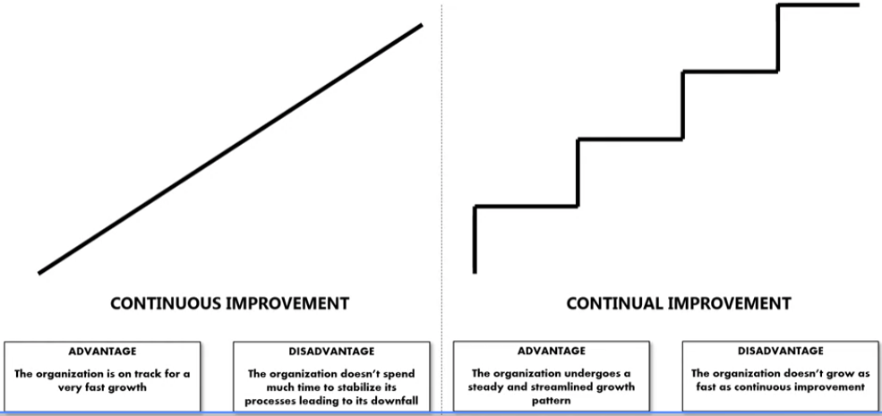

<!-- vscode-markdown-toc -->
* 1. [Module 1](#Module1)
	* 1.1. [Course Introduction](#CourseIntroduction)
* 2. [Module 2](#Module2)
	* 2.1. [Section Introduction](#SectionIntroduction)
	* 2.2. [What is Quality?](#WhatisQuality)
	* 2.3. [The History of Quality](#TheHistoryofQuality)
* 3. [Module 3](#Module3)
	* 3.1. [Section Introduction](#SectionIntroduction-1)
	* 3.2. [What is Six Sigma?](#WhatisSixSigma)
	* 3.3. [What are the Six Sigma Roles and Responsibilities?](#WhataretheSixSigmaRolesandResponsibilities)
	* 3.4. [Practical Examples of Six Sigma Performance](#PracticalExamplesofSixSigmaPerformance)
	* 3.5. [The Six Sigma DMAIC Model](#TheSixSigmaDMAICModel)
	* 3.6. [What is Lean and Kaizen?](#WhatisLeanandKaizen)
* 4. [Module 4](#Module4)
	* 4.1. [What are the Seven Basic Tools of Quality?](#WhataretheSevenBasicToolsofQuality)
	* 4.2. [Section Conclusion](#SectionConclusion-1)
	* 4.3. [Exploring the Seven Basic Tools of Quality](#ExploringtheSevenBasicToolsofQuality)
* 5. [Module 5](#Module5)
	* 5.1. [Section Introduction](#SectionIntroduction-1)
	* 5.2. [What is a Fishbone Analysis?](#WhatisaFishboneAnalysis)
	* 5.3. [What are the Steps to Create a Fishbone Diagram on PowerPoint?](#WhataretheStepstoCreateaFishboneDiagramonPowerPoint)
	* 5.4. [Activity](#Activity)
	* 5.5. [Activity Solution](#ActivitySolution)
	* 5.6. [Section Conclusion](#SectionConclusion-1)
	* 5.7. [Creating and Analyzing Fishbone Diagrams](#CreatingandAnalyzingFishboneDiagrams)
* 6. [Module 6](#Module6)
	* 6.1. [Section Introduction](#SectionIntroduction-1)
	* 6.2. [What are Check Sheets?](#WhatareCheckSheets)
	* 6.3. [What are the Steps to Create a Check Sheet?](#WhataretheStepstoCreateaCheckSheet)
	* 6.4. [Activity](#Activity-1)
	* 6.5. [Section Conclusion](#SectionConclusion-1)
	* 6.6. [Creating and Using Check Sheets](#CreatingandUsingCheckSheets)
	* 6.7. [Assessment 2](#Assessment2)
* 7. [Module 7](#Module7)
	* 7.1. [Section Introduction](#SectionIntroduction-1)
	* 7.2. [What are Control Charts?](#WhatareControlCharts)
	* 7.3. [What are the Seven Indicators of an Out-Of-Control Process?](#WhataretheSevenIndicatorsofanOut-Of-ControlProcess)
	* 7.4. [How to Create a Control Charts on Excel? - Part 1](#HowtoCreateaControlChartsonExcel-Part1)
	* 7.5. [How to Create a Control Charts on Excel? - Part 2](#HowtoCreateaControlChartsonExcel-Part2)
	* 7.6. [How to Create a Control Charts on Excel? - Part 3](#HowtoCreateaControlChartsonExcel-Part3)
	* 7.7. [Section Conclusion](#SectionConclusion-1)
	* 7.8. [Creating and Interpreting Control Charts](#CreatingandInterpretingControlCharts)
* 8. [Module 8](#Module8)
	* 8.1. [Section Introduction](#SectionIntroduction-1)
	* 8.2. [What is a Histogram?](#WhatisaHistogram)
	* 8.3. [How to Create a Histogram on Excel?](#HowtoCreateaHistogramonExcel)
	* 8.4. [Activity](#Activity-1)
	* 8.5. [Activity Solution](#ActivitySolution-1)
	* 8.6. [Section Conclusion](#SectionConclusion-1)
	* 8.7. [Creating and Analyzing Histograms in Excel](#CreatingandAnalyzingHistogramsinExcel)
* 9. [Module 9](#Module9)
	* 9.1. [Section Introduction](#SectionIntroduction-1)
	* 9.2. [What is a Pareto Analysis?](#WhatisaParetoAnalysis)
	* 9.3. [What is a Pareto Chart?](#WhatisaParetoChart)
	* 9.4. [How to Create a Pareto Chart in Excel?](#HowtoCreateaParetoChartinExcel)
	* 9.5. [Activity](#Activity-1)
	* 9.6. [Activity Solution](#ActivitySolution-1)
	* 9.7. [Section Conclusion](#SectionConclusion-1)
	* 9.8. [Creating and Analyzing Pareto Charts](#CreatingandAnalyzingParetoCharts)
	* 9.9. [Assessment 3](#Assessment3)
* 10. [Module 10](#Module10)
	* 10.1. [Section Introduction](#SectionIntroduction-1)
	* 10.2. [What is a Scatter Diagram?](#WhatisaScatterDiagram)
	* 10.3. [What are the Steps to Construct a Scatter Plot?](#WhataretheStepstoConstructaScatterPlot)
	* 10.4. [Activity](#Activity-1)
	* 10.5. [Activity Solution](#ActivitySolution-1)
	* 10.6. [Section Conclusion](#SectionConclusion-1)
	* 10.7. [Using Scatterplots to Identify Correlations](#UsingScatterplotstoIdentifyCorrelations)
* 11. [Module 11](#Module11)
	* 11.1. [Section Introduction](#SectionIntroduction-1)
	* 11.2. [What is Stratification?](#WhatisStratification)
	* 11.3. [How to Perform Stratification Using Excel?](#HowtoPerformStratificationUsingExcel)
	* 11.4. [Activity](#Activity-1)
	* 11.5. [Activity Solution](#ActivitySolution-1)
	* 11.6. [Section Conclusion](#SectionConclusion-1)
* 12. [Module 12](#Module12)
	* 12.1. [Conclusion](#Conclusion-1)
	* 12.2. [Full Course Practice Assessment](#FullCoursePracticeAssessment)
	* 12.3. [Full Course Assessment](#FullCourseAssessment)

<!-- vscode-markdown-toc-config
	numbering=true
	autoSave=true
	/vscode-markdown-toc-config -->
<!-- /vscode-markdown-toc -->##  1. Module 1

###  1.1. Course Introduction

- A six Sigma white belt is a subject matter expert in the business process. 
- A white belt has an understanding of six Sigma lean and Kaizen. 
- A white belt also has a thorough knowledge of the **seven basic tools of quality**. 
- In this course, you will learn what is quality. Introduction to six Sigma Lean and Kaizen what are the different six Sigma roles and responsibilities? 

##  2. Module 2 

###  2.1. Section Introduction

- you will learn what is quality and history of quality. 

###  2.2. What is Quality?

- It is the very purpose of the existence of an organization for a customer. Quality means resolution of its problems getting service on time and getting solution correct. 
- Joseph Juran: 
  - *quality as fitness for use those product features which meet the needs of customers and thereby provide product satisfaction*. 
  - *It is all about freedom from deficiencies*. 

Doctor W Edwards Deming promoted the shoe Hardart cycle (that is plan, do, check and act(). According to him, quality is defined from the customer's point of view as anything that enhances their satisfaction. 
- American society for quality defines quality as *the totality of features and the characteristics of a product or service that bear on its ability to satisfy stated or implied needs*. 
- In simple terms, *quality is derived by meeting expectations of your customers*.
- There are four activities that make this happen: 
  - First, you understand customer requirements. 
  - Second, you model and design your products and services such that they satisfy those identified customer requirements. 
  - Third, you develop business processes that are proficient and have the ability to produce those products and services. 
  - Finally, you manage and regulate those business processes. So they always deliver to their abilities. 

###  2.3. The History of Quality

Managers and business owners in the past over the centuries have been innovating different ways and means to ensure their organization is in business. 
- But, **Change is the only constant through all these centuries**. The feature that is considered exciting today will become the norm tomorrow. 
  - For example, the touchscreen in smartphones was considered a brilliant feature until a few years ago. However, it is considered a common feature today. 
  - So every organization has to regularly find new ways to satisfy these new and exciting needs and wants of their customers. 
- Whenever a product or service is developed, the producers identify the existing standards and design their products to meet those standards. 

Ideally, the responsibility for satisfying customers was in the hands of the people who actually did the work of making the product or providing the service. 

Many organizations still struggle with customer satisfaction. 
- `Walter Shohr`, a brilliant statistician who worked for Bell Labs devised a unique technique in the 19 twenties to monitor business processes. This technique identified if a business process acted predictably or became unstable, causing special causes that affected the performance. 
  - This technique was in the form of a line chart that became known as the **control charts**. 
- Further in 1979 Kao Ishikawa developed quality circles. Quality circles are also known as **quality improvement or self-improvement study groups**. They consist of 10 or fewer employees and their managers and are focused on improving processes. The concept originated in Japan. 
- Statistical process control (SPC) was another technique developed in the mid 19 eighties. It involves applying several statistical techniques to control the process performance. The other name for statistical process control is statistical quality control.
- The year 1987 witnessed the institution of the ISO 9000 standards. ISO stands for International Organization for Standardization ISO 9000 is a set of international standards on quality management and quality assurance. It was developed to help companies effectively document the quality system elements. 

Implementation of these elements helped companies maintain an efficient quality system. Six Sigma was then established between 1985 and 1988. **Lean manufacturing** came to life in early 2000. You will be going through more details on six Sigma and Lean manufacturing in subsequent lectures. 

##  3. Module 3 

###  3.1. Section Introduction

you will learn:
- what is six Sigma? 
- What is the six Sigma philosophy? 
- What are the six Sigma roles and responsibilities? 
- Practical examples of six Sigma performance, 
- the six Sigma Dmaic model.
- What is Lean and Kaizen? 

###  3.2. What is Six Sigma?

- Six Sigma is a business process improvement methodology. 
It is the only structured step-by-step improvement method that solves any business problem.
- It is also termed a disciplined methodology. 
  - That is because the processes which embrace six Sigma need to be disciplined in ensuring its practices, policies and procedures are followed strictly. 
- This discipline allows consistency in the flow of business operations and thus facilitates effective root cause identification. 
- The six Sigma is widely accepted because it directly impacts the bottom line **saving high costs for your organization**. 
  - Six SIGMA helps **identify the root causes and eliminates them**, allowing the additional cost factors of repair, rework, customer dissatisfaction others to disappear completely. 
  - When Six Sigma is fully adapted, six Sigma ensures that you make use of your manpower and intellectual resources. Fully, these resources execute **identified process improvement projects that have an organization or business process wide importance** and these projects when completed have a direct and positive impact on the organization's profit and loss account. 
- Six Sigma is a **datadriven methodology**. 
  - It ensures that managers and employees who drive six Sigma projects are trained in analyzing data and use statistical methods to get to the root causes. Employees at all levels are involved in different levels of statistical training. 
- The step by step process of the six Sigma methodology follows the D mac approach. D mac stands for the **define measure analyze improve and control** phases of any project. 
- Some organizations view six Sigma as a philosophy. This view outlines that any business process has inputs and outputs. 

It further states that when you focus on managing the inputs, the outputs are bound to come, the input output relationship is generally expressed as Y is equal to function of X six. 
- Sigma is also known as a **combination of process improvement tools**. 
  - These tools can be histogram barchart, piechart control charts, Sipo project charter parametric and nonparametric statistical tests to name a few. 
  - I keep saying that six Sigma is a process improvement methodology. This methodology involves using the D mac approach for solving business problems. it begins by understanding customer requirements and ends with improving the business to fulfill those requirements. 

So if any layman asks you what really is six sigma, what will be your answer? a process that operates at six sigma level of performance produces only 3.4 defects in 1 million.

###  3.3. What are the Six Sigma Roles and Responsibilities?

A six Sigma project is always a team effort, multiple individuals play different roles in any six Sigma project. 
- **Champion**, the champion is typically an upper level manager. His responsibilities include allocation of resources for projects, determine project selection criteria, interact with senior management, remove barriers, hindering the success of the project. Approve completed projects implement change. 
- **Master black belt**, master black belts are individuals trained in six Sigma methodologies, statistical tools, basic financial tools, change management, risk assessment, project management, executive communication. They are well experienced in teaching, coaching and mentoring black belts and green belts. 
  - This is always a full time position. 
- Black belt, black belts are individuals trained in six Sigma methodologies, statistical tools, basic financial tools, change management, risk assessment, project management and well experienced in managing black belt projects. This is always a full time position. 
- Green belt, green belts are individuals trained in six sigma methodologies, basic statistical tools and process improvement techniques. This is typically a part time position and some organizations make this part of an existing job responsibility. 
- Yellow belt, a yellow belt has basic knowledge of six Sigma is often responsible for running smaller process improvement projects has expertise on using the seven basic tools of quality is generally a part-time role and participates on a green belt project. 
- White belt, white belts are selected by either the black belt or the green belt and have an awareness of the six Sigma methodology. 
  - They are trained on the seven basic tools of quality and process improvement techniques. Their primary responsibilities include 
    - support and contribute to the six Sigma projects. 
    - Participate in charter and scope definition. 
    - Provide inputs during project meetings. 
    - Brainstorm ideas 
    - help collect data where responsible 
    - follow the mac Mac process, 
    - applying appropriate tools, 
    - review the approach periodically with the green belt and experience Black belts, 
    - provide inputs to green belt and black belts and process owners during the project. 

###  3.4. Practical Examples of Six Sigma Performance

Six Sigma level of performance is also known as 99.9997% level of performance. You may say 99% quality is good enough for a customer. Then why is there a need for driving six Sigma level of quality? That is 99.9997% quality. Well, here's a snapshot of the difference between these two variants. 

 

###  3.5. The Six Sigma DMAIC Model

- The acronym DMAIC stands for **define measure, analyze, improve and control**. It is very similar to the **plan, do study Act** or **plan do check act model**. Everyone in the organization will be asked to get involved with the six Sigma model to look for continual improvement opportunities in their work areas. 
- In a nutshell, you will execute the following activities in each step of the D mac process.
  - Define, capture the voice of the customer and identify their needs and wants 
  - measure, collect data for the identified customer issue. 
  - Analyze, identify the root cause using graphical and statistical techniques. 
  - Improve, create action plans and pilot them on the identified root causes 
  - control, implement the actions across the floor and sustain the gains. 

- what is continual improvement and how is it different from continuous improvement? 
  - Continuous improvement is an improvement where the organization continues to improve consistently. 
    - The good thing about it is that the organization is on track for a very fast growth 
    - However, the disadvantage is that the organization doesn't spend much time to stabilize its processes. This can lead to the downfall of the organization in the long run. 
  - Continual improvement is that improvement in which the organization grows for a certain period of time and then stabilizes itself on that growth then continues to grow for some more time, then stabilize again, then grows again and stabilizes again. This is a recurring process. 
    - The benefit of continual improvement is that the organization undergoes steady and streamlined growth pattern. It helps them sustain very well in this constantly changing marketplace. 
    - The only possible disadvantage of continual improvement is that it **is not as fast as continuous improvement**. 

- Thus, continual improvement is a key driving force. It allows six sigma to be tangentially different from other quality improvement programs. 
- The other driving forces include:  
  - getting everyone in the organization involved, 
  - getting the information technology group to assist in supplying data more quickly for everyone and 
  - getting financial data in the form of cost of quality analysis. 

###  3.6. What is Lean and Kaizen?

Lean is a business process improvement methodology that focuses on waste elimination from a business process. 
- It ensures that all the activities in the process. Add value from the customer's viewpoint. 
- Lean achieves its objective of waste elimination by classifying each activity in a business process as value added and nonvalue added.
  - value-added activities are those that add value from the customer's viewpoint, 
  - nonvalue added activities are those that the c**ustomer is not willing to pay for these activities**, do not add any value to the business process. From the customer's viewpoint. 

Kaizen is an acronym of two Japanese words Kai and Zen, which means **change for the better**. It is defined as any improvement idea in and around the workplace. 
  - Continuous small improvements by everybody in all areas of operations is the most powerful way of reducing variation and defects due to common causes. 

### Assesment 1

##  4. Module 4 

###  4.1. What are the Seven Basic Tools of Quality?

- quality is everyone's job as this realization became widespread. 
- The next question was **how to strengthen every employee of our organization with the know how of these quality improvement tools**? And this question led to the birth of what we call the seven basic tools of quality. 

In this lecture, you will learn what the seven basic tools of quality. A quick introduction to each of these seven tools and the history of the seven basic tools of quality
- the seven basic tools of quality are the fixed seven tools to improve quality in any business process.

- what is the focus of these seven tools?. 
  - These tools are focused on:
    - identifying root causes
    - collecting data 
    - streamlining processes and 
    - having a direct and positive impact on quality. 
  
- Are these tools graphical or statistical?
  - Most of these are graphical tools. These tools are designed to solve quality related issues. They can provide quick fixes to business problems. 
- Why are these called the basic tools? 
  - they do not require a high level of statistical understanding. These are simple and can be used swiftly with limited formal training. Their rigorous use for several decades have proven the fact that they can solve a number of quality related issues. 

- So what really are these seven basic tools of quality? 
- These are:
  1. fish bone diagram 
  2. checks sheet 
  3. control chart, 
  4. histogram, 
  5. pareto chart, 
  6. scatter diagram and 
  7. stratification. 

- Let's talk about each of these:
  - fish bone diagram. is a visual tool. It helps in organizing identified root causes into different categories. 
  - Checks sheet checks sheets are data collection forms that are designed to collect data in specific format. When data is collated in a well structured format, it helps in minimizing errors during data collation. 
    - It also helps in reducing the time needed to clean the data and make it suitable to perform analysis. 
  - Control charts, control, monitor the process performance over a period of time. You compare the data with historical records and identify if there are any special causes present in your business process 
  - histogram. Histogram is a frequency distribution diagram. It helps identify if your data is following a normal distribution or any other distribution 
  - Pareto chart. A poto chart helps identify those 20% causes that have 80% effects. It is a root cause analysis tool scatter diagram. 
  - A scatter diagram helps understand the impact of one or multiple independent variables on a dependent variable. It helps define the relationship of the variables in discussion. 
  - Stratification. Stratification is used to segregate data based on its sources. In some written material. You will find that stratification is replaced by flowcharts or run charts
   
- What is the history of these seven basic tools of quality? 
  - The seven basic tools of quality are said to have been developed after world war two. The quality guru Kaoru Ishikawa is credited with the introduction of these tools under one package and brand name. These are said to have been inspired by the **seven weapons of Benkei** 
- who is Benke. Benke is known as the warrior monk of the ancient era in Japan. He armed himself with seven weapons and is known to have carried them on his back wherever he wandered.

###  4.2. Section Conclusion

Congratulations and kudos to have successfully completed this section here, you learned, what are the seven basic tools of quality? You also received a high-level overview of each of those seven basic tools namely fishbone diagram checks, sheet control chart, histogram, Pareto chart, scatter diagram and stratification. At the end, you learned the history of the seven basic tools of quality. It is now time to understand each of these seven tools in thorough detail. 

##  5. Module 5 

###  5.1. Section Introduction
Have you ever come across a situation where you have completed the brainstorming session? Have a laundry list of ideas and are unable to present them in a subtle yet comprehensive manner to the senior most management who are always short on time. Do you find it difficult to bifurcate your brainstormed ideas into meaningful categories? Are you looking to showcase your root cause analysis into a meaningful pattern that can be easily consumed and digested by a reader who looks at your analysis. If your answer is yes to these questions, all you need is the fish bone diagram. So in the past few sections, you learned what is quality? What is six Sigma lean and Kis and you got introduced to the seven basic tools of quality. 

You are right here in your core journey. This section is dedicated to understanding fish bone diagram in its entirety. In this section, you will learn what is a fish bone diagram who conceived and developed this tool? Why is a fish bone diagram used the example of a fish bone diagram when to use a fish bone diagram? What are the steps to create a fish bone diagram? And finally, you will complete a fish bone diagrams activity. So why wait, let's dive into the first lecture of this section. 
###  5.2. What is a Fishbone Analysis?
A fish bone diagram has its name that way because a completed diagram resembles the skeleton of a fish who conceived and developed this tool recall that the seven basic tools of quality were introduced by Cairo Ishikawa. The fish bone diagram was conceived and developed by the same gentleman and this is the reason why it is also called the Ishikawa diagram. A fish bone diagram is also known as the cause and effect diagram. Kairo Ishikawa was a prominent quality guru of his time in Japan and worked as a professor at the University of Tokyo. Why is a fish Bobo diagram? Used a fish bone diagram helps identify a large number of root causes. It helps you establish the cause and effect relationship in one diagram. 

This tool is generally used after you have completed a brainstorming session, it structures a brainstorming session and visually depicts all the root causes. It ensures that you do not overlook or miss any possible root causes. It keeps the team focused on the causes of the problem rather than the symptoms. The example of a fish bone diagram. This is an example of a completed fish bone diagram. The eye of the fish is where you will write the problem. In this example, the problem is low employee productivity. 

The main bone of this fish bone diagram is further subdivided into sub bones. These sub bones are the infamous predetermined categories called the man method, machine material measurement and Mother nature. The fish bone diagram is absolutely flexible. Can use these same category names or you can build your own categories. Let's look at each of these categories in detail man. This category man includes people related root causes in your process method. The category related to the method will include the root causes of the procedures, machine. 

The category of machine would include system and other hardware issues. Material material can include materialistic problems that your business process may face measurement. The category related to measurement includes measuring your metrics, key deliverables or other measuring gauge related issues. Mother nature, mother nature includes uncontrollable external factors. When to use a fish bone diagram, you can use a fish bone diagram in the following series after completing the brainstorming session as a standalone tool. And if your team is unable to identify root causes, let's look at each of these in detail. After completing the brainstorming session. 

Once you complete the brainstorming session, you are required to represent the root causes. On one page pictorially, a fish bone diagrams comes in very handy as a standalone tool to use a fish bone diagram. You may not always need to execute a project. A fish bone diagram can be used as a standalone tool. If you are looking to identify possible root causes of any problem, the team is unable to identify root causes. If you or your team is unable to identify root causes and need to channelize your thoughts in specific directions to gather those root causes. Go ahead and use fish bone diagram. 

###  5.3. What are the Steps to Create a Fishbone Diagram on PowerPoint?

Creating a first-born diagram requires the following steps. Define the problem. Draw the generic headings as branches, brainstorm. The level one root causes brainstorm. The level two root causes and cover the entire spectrum. Let's look at each of these in detail. Define the problem. 

The first step is to define the problem that you're trying to solve. It is said that if you define the problem correctly, you have achieved half of your success. Hence clearly documenting what the problem is is very critical document this problem on a chart paper as the eye of the fish. In this example, you will write low employee productivity. Second, draw the generic headings as branches. In this step, you will draw a horizontal arrow running from the eye of the fish across your chart paper. You will also write generic headings and draw lines from the main arrow towards the generic headings. 

These generic headings can be the six MS or any other headings you prefer to use. In this example, we have drawn these lines and added the six MS as headings. Number three brainstorm, the level one root causes ask the why question to the main problem in this step, you will start asking the why question to the main problem. As each idea is discussed, you will write the idea as a branch of the appropriate category. If a cause belongs to multiple categories such as man, as well as the machine, you are allowed to write it as a branch of both the categories it belongs to. In this example, all the level one root causes are documented on this fish bone diagram. Under the category of man, we have issues such as multitasking, workplace stress burnout, et cetera that have an impact on employees productivity. 

You will observe that multitasking is updated in two categories man, as well as the method. Number four, brainstorm, the level two root causes ask the why question to each root cause you must then ask the why question against each cause. You can write the sub causes that will branch out of the causes you had documented. Initially, you should continue asking the question and generate deeper levels of causes as you increase these branches, it indicates a causal relationship between the problem and the root causes. In this example, all the level two root causes are now documented. Number five cover the entire spectrum. As your group feels that it has run out of ideas. 

You must look at those branches of your fish bone diagram where the ideas are few that brings us to the end of this lecture. You have covered the theoretical and the practical aspect of the fish bone diagram. It is now time to practice using this tool. You will do that in the next lecture. 

###  5.4. Activity

Hi, welcome to this activity. You are provided two inputs. One assume your team has completed a brainstorming session and have listed the ideas on an Excel spreadsheet two. You are given a brainstorming template. All you have TODO in this activity is to look at the brainstorming ideas listed on the Excel spreadsheet and divide them into meaningful categories namely man machine measurement material method and mother nature. You are free to use these categories or you may also define your own categories. Once you have classified each brainstorming input, the next step is to draw the fish bone diagram using the powerpoint template, you will get the powerpoint template as a part of the downloadable material that is provided with this course. 

###  5.5. Activity Solution

Welcome to this activity Solutions lecture. I hope you have completed the previous activity in the resources section of this lecture or in the downloadable materials. I have shared the activity solution document. It has the completed brainstorming output that I had asked you to complete in the previous lecture. A quick disclaimer as this is a subjective activity, your responses may be different than mine. That is absolutely fine. Completing the activity and understanding how to create a fish bone diagram is the key objective here. 

###  5.6. Section Conclusion

Congratulations and kudos to have completed this section here, you learned. What is a fish bone diagram who conceived and developed this tool? Why is a fish bone diagram used the example of a fish bone diagram? When to use a fish bone diagram? What are the steps to create a fish bone diagram? And finally, you completed a fish bone diagram activity that brings us to the end of this section. You are also set to begin the next one. See you there. 

##  6. Module 6 
###  6.1. Section Introduction

Have you ever been in a situation where you asked your team members to collate data and they collated it in a number of different formats which resulted in doing the exercise again. Do you want your entire business process to follow certain steps consistently without missing them? Are you in the midst of data, collation and analysis and want to ensure the data is collated in a clean and easy format? If your answer is yes. For all these questions, all you need is checks sheets. So in the past few sections, you learned what is quality? What is six Sigma Lean and Kisen, you got introduced to the seven basic tools of quality and you learned everything about the fish bone diagram. 

You are right here in your course, journey checks sheets is another important tool in the seven basic tools of quality toolkit. This section is dedicated to understanding checks sheets in its entirety. In this section, you will learn what is a checks sheet when to use a checks sheet. What are the steps to create a check sheet? Checks sheet example and checks sheet related activity? So why wait, let's dive into the first topic? Of this section. See you there. 

###  6.2. What are Check Sheets?

A checks sheet is a generic form that is used for data collation and analysis. It is structured and formatted to collect data, uniformly, checks sheets can be accommodated for a wide variety of purposes. You can modify checks sheets, readjust them, alter change or transform them based on your needs. And wans for collecting data and conduct analysis. When to use a checks sheet, it is advisable to use a checks sheet in the following scenarios when you need to collect data regularly in the same format. When you are collecting data for defects, root causes specific events, issues or similar situations when you are collecting data from a production process at a regular frequency and in the measure phase of your six sigma project, when your team is collecting data. 

###  6.3. What are the Steps to Create a Check Sheet?

To create a checks sheet, you will follow the six easy steps. They are identify the situation to be observed. Document the operational definition when who at what frequency and for how long create your checks sheet. Pilot the checks sheet, rollout the checks sheet. Let's look at each of these steps in detail. Identify the situation to be observed. The first step is to understand what situation or event you want to observe. 

For example, you want to observe the total number of defects in a business process. Document the operational definition. The next step is to document the operational definition of calculating the metric. You must first check if an operational definition already exists. If it doesn't, then you must focus on creating one. For example, a transaction can only be considered a defect. If it does not fulfill the eight parameters outlined in your business process, then who at what frequency? And for how long the next step is to identify, when will the data be collated? 

That is what will be the frequency to collect this data? Who will collect this data? And for how long will you collect this data? For example, the business process executives will collect the data of defects after each defect occurs and it will be collected for the next three months, create your checks sheet. The next step is to create the checks sheet. You must ensure that anyone can record the data in the checks sheet by simply making checkmarks or symbols. This will make it easy for the person who is recording these details to follow the documentation process. 

You must also label all the spaces on your checks sheet, create a glossary of definitions tab if required to clarify the labels, pilot the checks sheet, you must test the checks sheet's ease of use, ability to collate data and accuracy issues by executing a pilot for a few weeks. All the findings identified during this pilot needs to be incorporated as feedback and a revised checks sheet must be prepared. Rollout the checks sheet, train the users to use the checks sheet, then roll out its use on the shop floor and start recording your data checks sheet. Example, this is an example of a checks sheet used to collect the different defect types. The users add the tick mark as they collect data over several weeks. 

###  6.4. Activity

Welcome to this activity. This is more of a do it yourself exercise in this activity for your business process. Identify the area where there is an opportunity to collect data. You create a checks sheet, follow all the steps to roll out the checks sheet to your shop floor, such as documenting the operational definition, identifying answers to questions such as when should the data be collected at what frequency who will collect this data and for how long create the checks sheet and pilot it before rolling it out on the shop floor. 

###  6.5. Section Conclusion

Congratulations. And kudos to have successfully completed this section on checks sheets. Here you learned. What is a checks sheet when to use a checks sheet? What are the steps to create a checks sheet? Checks sheet example? And you did a checks sheet related activity that brings us to the end of this section. See you in the next one. 

###  6.7. Assessment 2

##  7. Module 7 

###  7.1. Section Introduction
Are you looking for a suitable tool that can help you monitor the performance of your business process over a period of time? Do you want to ensure that minor changes in the performance of your business process are easily captured? Are you looking for a tool that will help you provide the leading indicators of your process performance? If your answer is yes to these questions, all you need is a control chart. So in the past few sections, you learned what is quality? What is six Sigma Lean and Kis you got introduced to the seven basic tools of quality. You then learned everything about the fish bone diagram. And in the previous section, you learned about checks sheets. 

You are right here in your course. Journey control charts were developed by Walter A HHT in the 19 twenties, their significance has grown with time and this tool has now become a part of the seven basic tools of quality. In this section, you will learn what are control charts. Why is a control chart used? When is a control chart used? What are the seven indicators of an out of control process? How to create a control chart on Excel that is preparing the data worksheet and creating the chart on Excel. 

So why wait, let's dive right into the first lecture of this section. What are control charts? 

###  7.2. What are Control Charts?
Control charts are the means through which process and product parameters are tracked. Statistically over time. Usage of control charts is referred to as statistical process control or PC. Attentive use of PC can allow us to detect special cause variation through out of control signals. You will learn these out of control signals. In the next lecture control charts incorporate and use two control limits. These are the upper and lower control limits. 

These reflect the calculated but natural limits of random variation in the process. Why is a control chart used? A control chart is used to analyze the process performance and effectively control it. It identifies and evaluates variation in implemented process improvements. The type of variation determines and helps you understand which corrective action should you take to improve your business process? Control charts are highly sensitive. They may easily reflect small changes over time. 

When is a control chart used, you will use a control chart when you want to monitor the key, short and long term process input and output metrics over time. This is especially useful when a process has changed. 

###  7.3. What are the Seven Indicators of an Out-Of-Control Process?

When you observe a control chart, you need to know the language it speaks in this lecture, you will learn the seven indicators of an out of control process. The first of the seven indicators is when one or more data points falls outside the control limit. The second one is when you have seven back to back data points that are either following an increasing or decreasing order of occurrence. The third is when you have eight back to back data points moving on one side of the mean or the average line. 4th 14 back to back data points either alternating up or alternating down. Fifth, two data points out of three back to back data points are on the same side of the mean or the average. This could be in zone A or beyond. Sixth, four out of five back-to-back data points are on the same side of the mean or the average.

This could be in zone B or beyond. And 7th 15 back-to-back data points are above or below the mean or the average line. This could be within zone C 

###  7.4. How to Create a Control Charts on Excel? - Part 1
So far you learned what is a control chart? Why use it when to use it? And what are the seven indicators when your process is out of control? Well, that is good background knowledge for you to start the creation of your own control charts. But wait for a moment. Unlike other tools, there are a number of control charts. These can be used for different situations for the purpose of understanding the seven basic tools of quality. 

You will be learning one of the most used variable control chart. And that is an IMR chart. So what is an IMR chart? IMR stands for individual moving range chart? It is actually two control charts combined together. The first or the top part of the control chart is the individual's chart. And the second or the lower part of the control chart is the moving range chart. 

The control charts are characterized by a center line and the upper and lower control limits. The center line is the average, the data is plotted in time order. The upper and lower control limits are determined using historical data. The top chart monitors the centering of the distribution of the data from the process, the bottom chart monitors the range or the width of the distribution. Now learning to create an IMR chart can be divided into two parts. The first part focuses on preparing the data to create the chart. And the second part focuses on actually creating the chart and getting inferences from your analysis. 

This particular lecture focuses on the form how to prepare the data to create the IMR chart. 
###  7.5. How to Create a Control Charts on Excel? - Part 2

###  7.6. How to Create a Control Charts on Excel? - Part 3

###  7.7. Section Conclusion

Congratulations. And kudos for completing this section on control charts. Here you learned, what are control charts? When is a control chart used? What are the seven indicators of an out of control process and how to create a control chart on Excel that brings us to the end of this section? See you in the next one. 

###  7.8. Creating and Interpreting Control Charts

##  8. Module 8 
###  8.1. Section Introduction

###  8.2. What is a Histogram?

###  8.3. How to Create a Histogram on Excel?

###  8.4. Activity

###  8.5. Activity Solution

###  8.6. Section Conclusion

###  8.7. Creating and Analyzing Histograms in Excel

##  9. Module 9 
###  9.1. Section Introduction

###  9.2. What is a Pareto Analysis?

###  9.3. What is a Pareto Chart?

###  9.4. How to Create a Pareto Chart in Excel?

###  9.5. Activity

###  9.6. Activity Solution

###  9.7. Section Conclusion

###  9.8. Creating and Analyzing Pareto Charts

###  9.9. Assessment 3

##  10. Module 10 

###  10.1. Section Introduction

###  10.2. What is a Scatter Diagram?

###  10.3. What are the Steps to Construct a Scatter Plot?

###  10.4. Activity

###  10.5. Activity Solution

###  10.6. Section Conclusion

###  10.7. Using Scatterplots to Identify Correlations

##  11. Module 11 

###  11.1. Section Introduction

###  11.2. What is Stratification?

###  11.3. How to Perform Stratification Using Excel?

###  11.4. Activity

###  11.5. Activity Solution

###  11.6. Section Conclusion

##  12. Module 12 

###  12.1. Conclusion

###  12.2. Full Course Practice Assessment

###  12.3. Full Course Assessment
