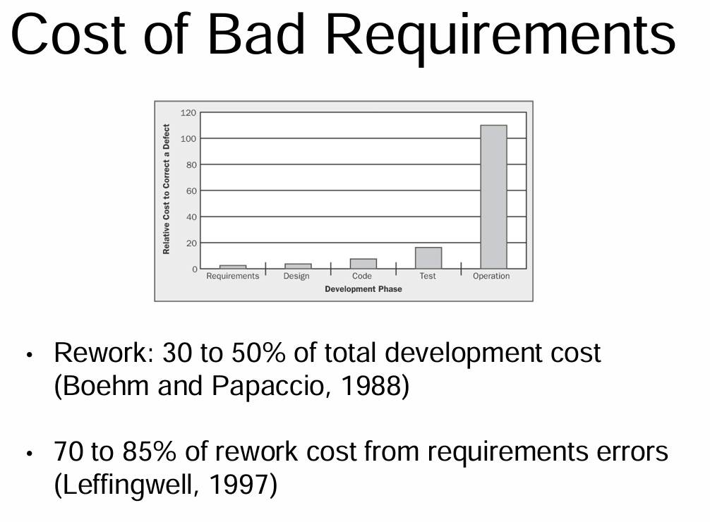

<!-- vscode-markdown-toc -->
* 1. [Welcome](#Welcome)
	* 1.1. [Introduction to specialization](#Introductiontospecialization)
* 2. [What is the Software Requirement Specification Process and What if you mess up](#WhatistheSoftwareRequirementSpecificationProcessandWhatifyoumessup)
	* 2.1. [ The Software Requirement Specification Process](#TheSoftwareRequirementSpecificationProcess)
	* 2.2. [Reading Software Requirement Specification Process](#ReadingSoftwareRequirementSpecificationProcess)
	* 2.3. [Cost of Bad Requirements](#CostofBadRequirements)
	* 2.4. [Reading: ReadingCost of Bad Requirements](#Reading:ReadingCostofBadRequirements)

<!-- vscode-markdown-toc-config
	numbering=true
	autoSave=true
	/vscode-markdown-toc-config -->
<!-- /vscode-markdown-toc -->

##  1. Welcome

###  1.1. Introduction to specialization
When starting any software project, an extremely critical part is to learn what the customer actually wants and needs and define that clearly for our developers.
- As a requirements engineer:
  -  you shall fully learning about the system that was and the system to be. 
  -  You are the face to the customer and the liaison between the customer and the developers and the rest of the software development team.
- It's an extremely important role and the first step toward creating secure successful software. That is the key focus of this Software Requirements and Specifications Specialization. 
- Requirements engineers end up touching and affecting almost all parts of the software development process. And its important for all involved in that process to understand how the process works and how it affects you. Either if you aren't the one doing the writing. 
- The specialization will help requirements engineers even those who have worked in the field for many many years. It will help those because we will be discussing many alternative life cycle approaches, different environments and new techniques that can be used to expand your current view. 
- Software engineers, development and product managers, testers, QA and analysts, product analysts, technical writers and security engineers will also all benefit from the specialization. This is because you all must work with and understand these technical software requirements specifications in order to perform your jobs well. And developers and software engineers, you're often creating these documents or some versions of these documents yourselves tip. 

##  2. What is the Software Requirement Specification Process and What if you mess up

###  2.1.  The Software Requirement Specification Process

- Requirements Elicitation, our goal is to identify and understand the system as it was, if such a system existed. And this overall system to be.
- Software Requirements Elicitation involves elicitation of information from humans, archives, past documents on the existing software,documents and research related to that software and much, much more. There's so much information out there that it's easy to become overwhelmed and to lose focus. The system to be will have many requirements that must be identified at both the **functional** and the **non-functional** levels.

- With so many options, and more options, and more options, how can we go about figuring out the system to be efficiently, and effectively?
- In this lesson, we're going to discuss the information that we can gather about the system as it is, the system to be and how to deal with the huge amounts of data that we obtain.
   1. So the first step of the software requirements process is to **determine the system to be and to document it**.
      - The information is used to **generate software requirements documents**, which may come in many forms depending on what area you are working in, what kind of software development lifecycle you are working in. We use these documents in two ways. 
         - The first is to **talk with the customer** and make sure that we are making the system that they actually want.
         - The second is to **give enough information to software architects**, and also following software developers.

You'll give this to UI designers as well, and giving everybody a start. So the first question is, what is a software requirements specification document?

A software requirement specification document is called by multiple names. You'll often hear it called an SRS or an SRD.

I'm going to be calling it a SRS throughout these lectures. An SRS can be written in many, many forms and at different levels of granularity. For example if you are working in an agile development lifecycle documentation is going to be pretty limited. In a waterfall model where there's tons of documentation, you will have hundreds of pages of documents.

Overall though, the SRS is a document of the system that is to be developed. It also describes the system that was there before. This includes both functional and the non-functional requirements.

It may also include a sets of use cases that describe user interactions that the software needs to provide.

Functional requirements are descriptions of what the system should be doing. Non-functional requirements are how the system should operate.

These include things like security, performance, maintainability, modularity, modifiability and pretty much every ity that you could think of.

Security falls into this.

The size of SRS documents can range depending on the amount of documentation that's needed by the development organization. In agile environments, SRS documents are minimal if existent at all. Many organizations require documentation of everything. And they could be hundreds or thousands of pages. And anyone who has worked with these knows that they are a pain to read. Given these differences, we run into many challenges. Because we need to balance the time and the effectiveness for both ourselves and for our customers.

Some issues that come into play include the user involvement, poor planning on our part and customer representation.

Now on the user side it's often hard to get a hold of the customers. We work across different time zones. We have different schedules and overall we're just fighting time.

Thus, it's always challenging to get as much information from as many people as we want to.

Additionally, as you start talking with customers, you'll have the problem of they get excited. And they add in, well, I want this too. This would be cool. It can't be that hard.

However, time is limited for us all and we have to be careful about scope. You'll also run into the challenge of not having answers from your customers. You don't want to run to your customers with every single little question.

So we end up writing requirements with some sort of assumptions, and we hope for the best.

Developers can also influence the overall requirements. Because they also get excited and make assumptions.

They'll think about the product, and say, Well, I really like this. I bet the customers would really like it too. I'm going to add it in. It won't take that long.

Five hours later, we're trying to debug, and hey, there was a missing semicolon.

We've all had that happen. This is a slight exaggeration. But my point is that implementation and debugging is hard. And both customers and developers tend to get out of scope. So we need to be very careful. Meetings with stakeholders is always a challenging prospect.

Many occur during lunches, dinners, social events. And in those kinds of situations you might just be drawing out ideas on napkins or writing them down in a notebook or something like that. Lo fi UI diagrams and story boards similarly are frequently written on napkins. That is the guideline of how they are written.

But when we write them in this way, they are easy to lose. And we also have a lot of ambiguity. Remember that customers aren't trying to think the whole process through. They just know what they want.

This is probably vague.

You'll hear phrases such as I want this product to be user friendly.

Okay, I want this to be fast.

Yeah, we want everything to be fast.

All lead to ambiguity and they don't give developers enough information to make an accurate product to actually fit their needs.

So when there's not enough information, we start guessing, and we start assuming requirements, and that is always dangerous.

Developing requirements is a balancing act on your time, the customer's time, and on overall accuracy.

###  2.2. Reading Software Requirement Specification Process 

- Elicitacion Why?
   -  What are software requirements documents?
   - Why do we need them?
   - Why are they challenging to write?
- Software Requirements Specification (SRS)
   - A description of the software system to be developed
      - Functional requirements: What the system should do
      - Non-functional requirements: How the system should operate (i.e. security, performance, maintainability, modularity, modifiability, etc…)
- Making Bad Requirements - User Involvement Challenges
   - Customer: “But just one more feature... that can’t be hard!”
   - Requirements writer: “This isn’t clear, so we’ll assume...”
   - Developer: “I bet they’d like this too!"
- Making Bad Requirements - Poor Planning
   - We drew it on this napkin/white board. Don’t lose it. 
   - Ambiguity- customers to developers
   - Guessing at effort needed 
   - Assuming requirements
- Example: A Meeting System- Stakeholders
   - Meeting Organizer
   - Meeting Attendees
   - Meeting Participants
   - Others

###  2.3. Cost of Bad Requirements

###  2.4. Reading: ReadingCost of Bad Requirements 

