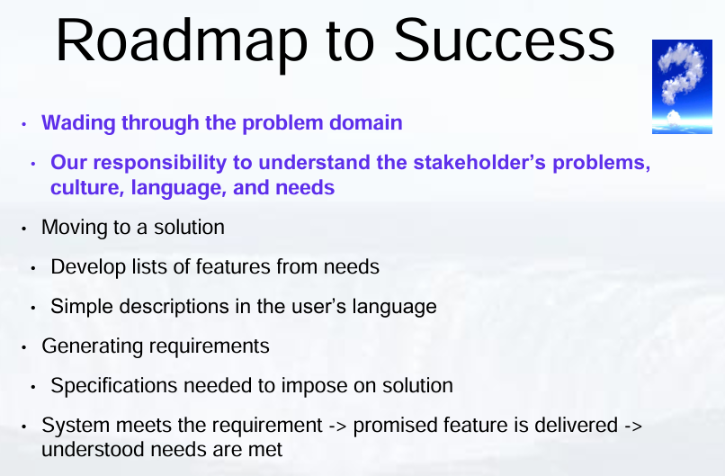

## Introduction to Requirements Engineering

### Introduction to Requirements Engineering

Requirements development and requirements management both involve many different tasks. The ones that we're going to be focusing on are elicitation, analysis, specification, and validation.
Play video starting at ::13 and follow transcript0:13
Specifically in this lesson, we're looking at elicitation. How do we elicit? How do we make this easier on ourselves and for our customers?
Play video starting at ::26 and follow transcript0:26
First, we need to look at the overall roadmap for requirements engineering.

Remember, our goal is to make software requirements.
Play video starting at ::35 and follow transcript0:35
A software requirement is a software capability needed by the user to solve a problem to achieve some objective.
Play video starting at ::47 and follow transcript0:47
Some of our software capabilities need to be possessed by a system or a system component.
Play video starting at ::54 and follow transcript0:54
They may need to satisfy a contract, some standard, a specification, or some formally imposed documentation.

So how do we get started in software requirements engineering? The very first thing is just to understand the problem.
Play video starting at :1:11 and follow transcript1:11
That is easier said than done. We have to wade through the entire problem domain.
Play video starting at :1:17 and follow transcript1:17
Our responsibility is to understand the stakeholders' problems, culture, language, overall needs, and figure out how all of those apply into the product.

1:29
Normally this will start with us talking with the customers and the stakeholders.
Play video starting at :1:36 and follow transcript1:36
Sometimes these are too far removed. We don't have access to them. We can't talk to them. They don't have time for us.
Play video starting at :1:46 and follow transcript1:46
And it's just challenging to talk to people and actually connect.
Play video starting at :1:53 and follow transcript1:53
Remember though, that customers are people who are individuals or organizations, who derive direct or indirect benefits from the product.
Play video starting at :2:5 and follow transcript2:05
Usually our customers we consider as our project stakeholders and our product users.
Play video starting at :2:13 and follow transcript2:13
We also have senior managers, hirers, business people. These are people who are establishing project vision, product scope,
Play video starting at :2:26 and follow transcript2:26
defining the business requirements, and also paying us. So we need to keep all of these people in mind.

Another set of users that we have are end-users. This is another smaller category. End-users are the people who are going to be using the product directly or indirectly. End-users are helpful to us in requirements engineering and requirements gathering because they can describe the tasks that they need to perform.
Play video starting at :2:56 and follow transcript2:56
They can also describe some of the quality characteristics that they expect.
Play video starting at :3:1 and follow transcript3:01
A challenge here though is that with end-users, and customers in general, will give you some vague statements that can be conflicting.
Play video starting at :3:12 and follow transcript3:12
For example, someone might say, well, the system has to be fast. It has to be running at all times. Downtime is going to ruin my ability to work.
Play video starting at :3:24 and follow transcript3:24
Having a fully reliable system in this way, likely not possible. How much do they really need?
Play video starting at :3:36 and follow transcript3:36
On the security side, you will have people saying, well, it needs to be secure. But I don't want to jump through hoops in order to get into the system.

Well, what is jumping through hoops? Do you need to log in? Do you need to check your cellphone? Do you need to check your email? How do you do it? What is jumping hoops?
Play video starting at :4:1 and follow transcript4:01
Also, what level of security do they actually need?
Play video starting at :4:6 and follow transcript4:06
Business requirements may also go against your end-user desires and they need to be negotiated.
Play video starting at :4:14 and follow transcript4:14
Business requirements are different from business rules. That is important.
Play video starting at :4:20 and follow transcript4:20
Business rules are covering regulations, policies, formulas, events.
Play video starting at :4:27 and follow transcript4:27
They are needed to define constraints and give you definitions.
Play video starting at :4:34 and follow transcript4:34
Business requirements on the other hand focus on what the business people,
Play video starting at :4:39 and follow transcript4:39
the money people, what they want.
Play video starting at :4:43 and follow transcript4:43
You need to look at both of these. They both come into your requirements. The user requirements from all of these groups will help you to see how people really need to use the product.
Play video starting at :4:58 and follow transcript4:58
So business people, end-users, the people giving you the money, all possible customers,
Play video starting at :5:7 and follow transcript5:07
all the people who are pressing the keys, and so on and so forth.
Play video starting at :5:13 and follow transcript5:13
Once stakeholders on the business and user side have been identified and questioned, then we can move on to finding solutions that are firmly stated.

For example, you can start determining actual requirements, such as, the car should have power windows, the search will return a list of outbreak locations, the program will allow web-enabled entry of sales orders, and so on and so forth.
Play video starting at :5:44 and follow transcript5:44
The goal is to create a feature set, then gain customer agreement.
Play video starting at :5:50 and follow transcript5:50
Many of the features may still be vague at this point. But you're starting to get a general idea of what is wanted.
Play video starting at :5:58 and follow transcript5:58
We do this from two different angles. From artifact-driven elicitation and also from stakeholder-driven elicitation.
Play video starting at :6:8 and follow transcript6:08
These will be discussed in future lessons.

### Building Requirements

Next, let's consider how we build our requirements. We need to form user requirements and business requirements. Between these two, we then build the functional requirements of the system. The actual requirements of rewrite should have a number of properties. 

Remember that requirements are supposed to fully describe functionality, they contain all information needed for the developer to design and implement that functionality. If you don't know market to be determined put it in red, put it in bold, mark it in some way. In your software requirements specification, you must accurately describe the functionality to be built. In describing the functionality, you also need a reference for correctness so that you can relate your requirement back to the source of the requirement. Who did you work with? Who did you negotiate with? Who were those stakeholders who were affecting your decisions on that requirement? Each requirements statement should be possible to implement within known capabilities. They also should be able to work within limitations of the system within the environment. You may not know all of this information, that means that not only are you working with the customers in the situation, you are also working with the developers. The developers can tell you the limitations, the other abilities, and what you can really do. They can also help you to find alternatives. Every single statement should originate from an authority. That authority should be a business level person or a set of customers. The relevancy of the requirement is also very important. The feature or requirement should add value to someone. In these qualities, wording is very critical as many will be reading these requirements, potentially both the customer and the developer sides. There needs to be single consistent interpretation. It is very challenging to determine all needs fully during elicitation and make sure that everyone's happy. And face it, not everyone is going to end up happy. However, another point, another desirable quality that we need for our requirements is that the requirement is measurable and verifiable. Think, can I create a test that can either be verified by a human or can be verified automatically? For example, the statement, I need email sending to some recipient to be fast, it's vague, it's not verifiable. One way to restate it would be to say, the email should be sent and confirmed as sent within 5 minutes. In addition to all of these important desirable qualities for statements, the specification overall needs to be complete, consistent, modifiable and traceable. 

You ask questions, you get answers, you write it up. Easy, not so much. Elicitation of functional and nonfunctional requirements such as security, brings up many challenges especially the nonfunctional requirements. Before we get into nonfunctional requirements, we need to think about who we talk to, when, how do you balance responses, how do you negotiate and find alternatives, how do you balance risk. With risk analysis comes the security issue. In many situations, people will say, "I need my system to be really fast, but it also has to be very secure." First, that statement I just made was really vague. But note that when we're balancing security and performance, it all comes down to what's more important, it is totally a balancing game. This game varies depending on how and when you elicit requirements. And in our next sections, we'll discuss some of the ways that we go about eliciting requirements, and how this fits into the software development process.