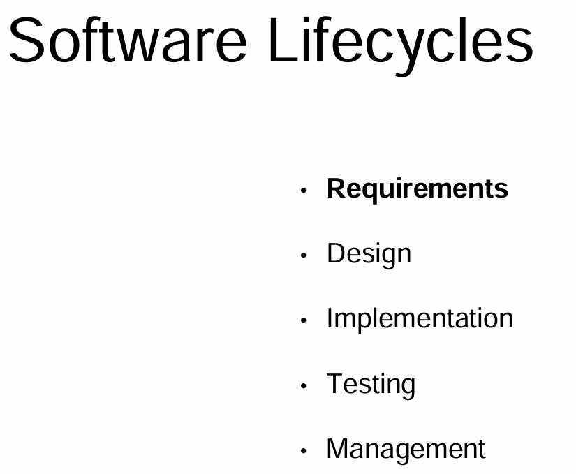
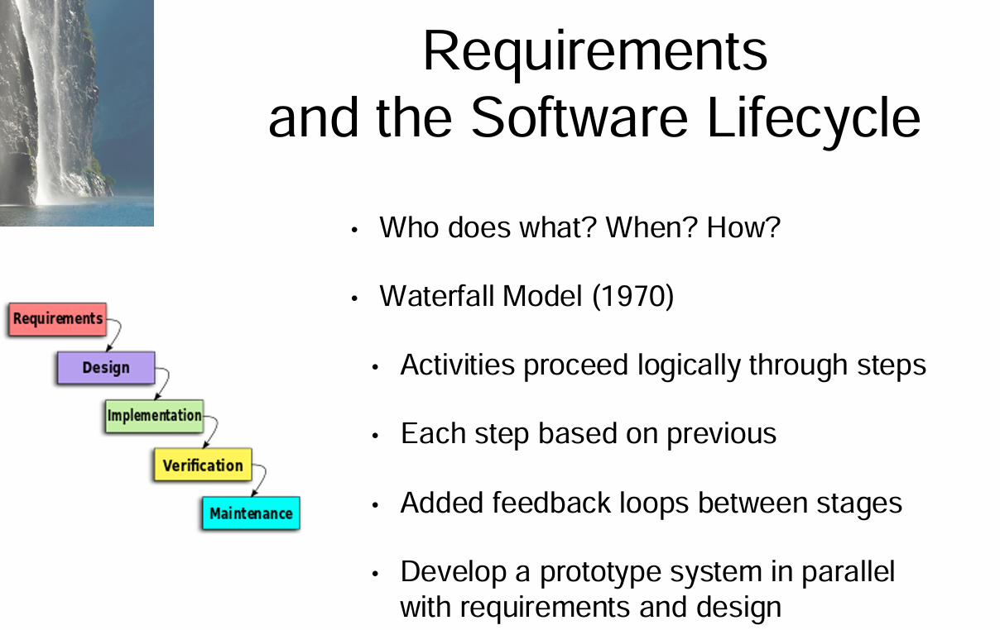
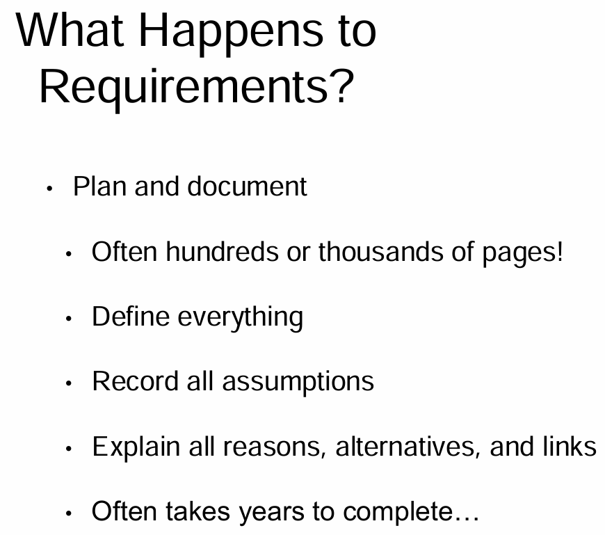
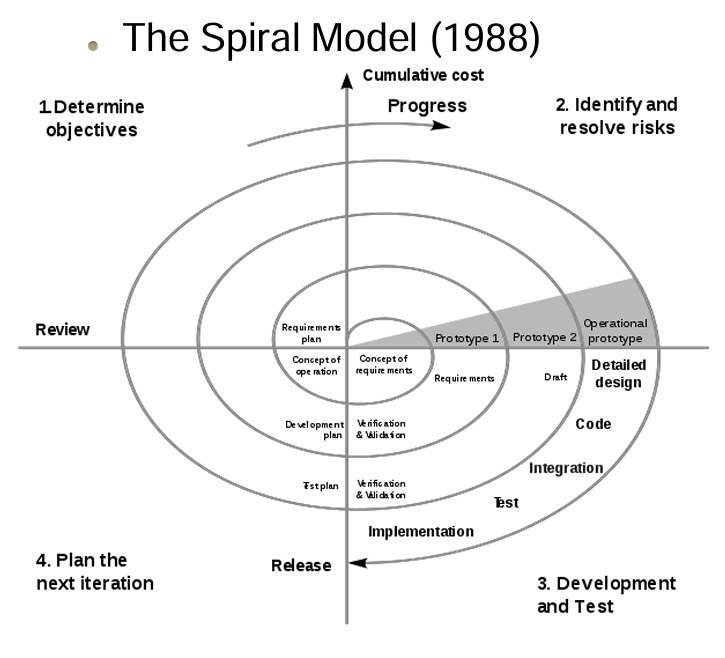
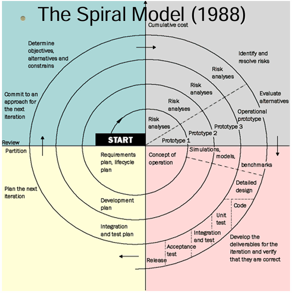
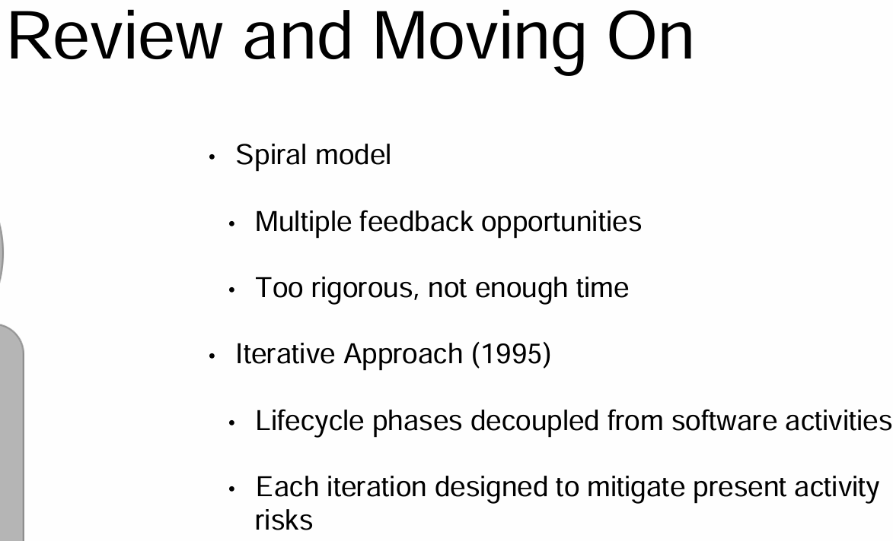
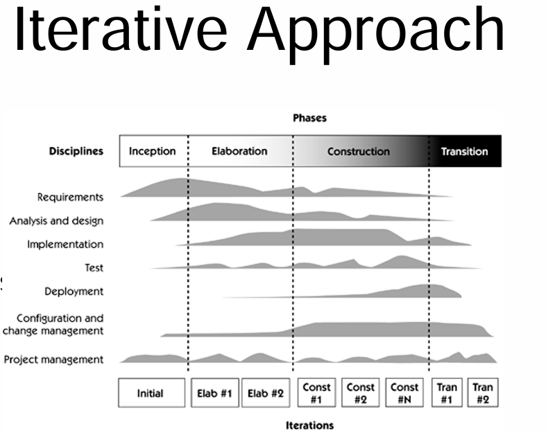
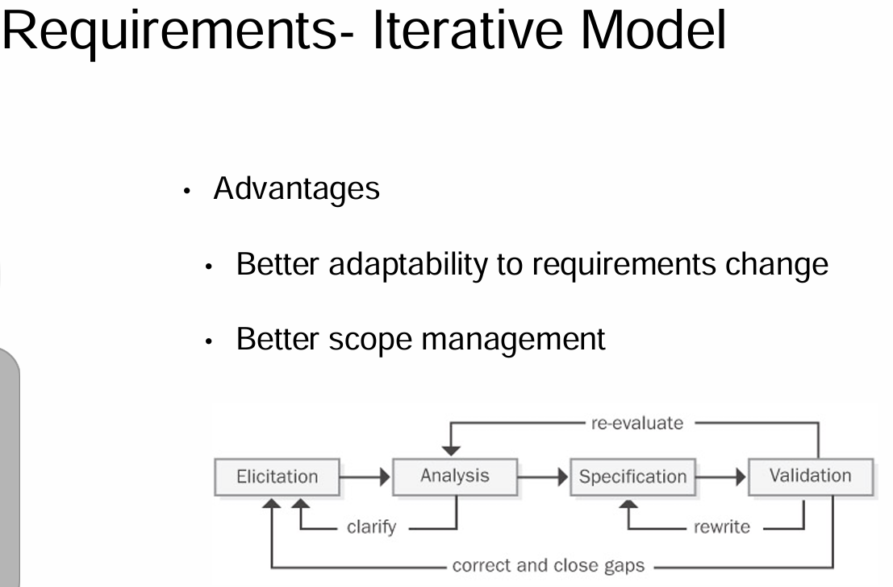

<!-- vscode-markdown-toc -->
* 1. [The Software Lifecycle](#TheSoftwareLifecycle)
* 2. [Different Lifecycle Models](#DifferentLifecycleModels)
* 3. [Hybrid Model/Iterative Lifecycle Approaches](#HybridModelIterativeLifecycleApproaches)
* 4. [Software Development Lifecycles- Approaches and Benefits](#SoftwareDevelopmentLifecycles-ApproachesandBenefits)

<!-- vscode-markdown-toc-config
	numbering=true
	autoSave=true
	/vscode-markdown-toc-config -->
<!-- /vscode-markdown-toc -->

##  1. The Software Lifecycle

So we already know that we want requirements documents that are consistent, complete, modifiable and traceable. We also have to deal with the individual statements within that. But of course, things are going to change and the requirements may not be complete or correct in your very first pass of getting information from the customers. This brings us back to the software lifecycle. Effective requirements management can only occur in the context of reasonably well-defined software process. This specialization is focusing on the requirements portion of the software lifecycle. But it's very important as a software engineer to have experience in the others as well. At least have an understanding of them. This understanding includes requirements, design, implementation, testing and management. As a requirements engineer, you are the person finding out what the customers really want, what the customers really need and relaying that to the designers or the developers. 

In design, we move to figuring out what the product will really look like. This starts with a high level design process. For example, you might decide that you need a software as a service application. Software as a service, is a software distribution model in which a third party provider hosts applications and makes those applications available to customers over the Internet, or through some very lightweight sort of browser thing. So once you have software as a service, you then need to ask yourself, what the product will look like and what models can be used. When I say models, I mean, architectural sort of models. Given your product, should you use a model view controller structure? Should you use a Template structure? Or, something else? This is high level design. Low level design then makes you think and write about what kind of language structures are needed. Should it be object oriented? Should it be procedural? Why? If you decide that it should be object oriented, then, what objects do you need to create? How are they linked? How does data flow from between activities? So on and so forth. Some of these goes into your requirements document but a lot of it, will go into a design document. Once you've come up with design, then you code, then you test and hopefully you get a good product out and then, you can manage it.

So given that there's so much to do, there are different software requirements lifecycles that have been created. The very first was back in 1970. And perhaps surprisingly, it's also what we automatically fall back on whenever things start failing in whatever model we're trying to do. It's a danger. This model from 1970 is called the waterfall model. It has each step of requirements, design, implementation, testing and maintenance. And in waterfall, you follow each and every one of those in order. As you move through, you finish all of the requirements, move onto design, finish all of the design, move on to implementation and so on. In some later models, that were variations of the waterfall model, feedback loops were also added between stages. Within those feedback loops, there were also some prototypes. 

In the waterfall model, documentation is key. Planning is utterly important. The requirements documents created in the waterfall are very often huge. I'm talking hundreds or thousands of pages. You define absolutely everything. So for example, imagine that you're creating a library system, how do you define a book? I asked this to one of my students and they said, "Well, it's something that you can read." I said, "Well, I made a flip book of images that's really horribly drawn. Is that a book?" And she said, "Yeah, I guess so." Said, "Okay, my neighbor's kid drew this picture with some text. Is that a book?" "No." Even in defining something as simple as a book, it gets very challenging for both you and your customers to really understand. What are simple terms? In the document, you will also need to figure out what implicit requirements are. Explicit requirements are those that come directly from the customer. Implicit requirements are ones that you have to kind of figure out on your own. Sometimes you have to make assumptions. Mark them in your assumptions section of your requirements document. You also need to explain all reasons, alternatives, risk analyses etc, within your requirements and documents. Because of this, within the waterfall model especially, these documents take years to complete and they result in a lot of work. **Oh hey, and guess what? Then, your customer changes their mind.**

##  2. Different Lifecycle Models

The waterfall life cycle came to represent a fixed and rigid approach to development, where requirements were frozen for the life of the entire project.

Over time, the team could become completely disconnected from the things the project was originally based on.

Understandably, the model lost favor.

But when people went back to just trying to jump right back into coding then we lost so much information.

They said, well, we've done all of this. We want to just want to make products, and make people as happy as quickly as possible.

So the model that we tried to move on to after that, came out in 1988, and this was the spiral model. The spiral model serves as a role model for those who believe that success follows a more risk-driven, incremental development path.

As originally envisioned, the iterations were typically six months to a year long. This was very similar to what we had in the waterfall model.

Each phase starts with a design goal and ends going back to the clients with a prototype. In identifying major risks, both technical and managerial, and determining how to lessen the risk, helps to keep the software development process under a little bit more control. As you can see from this picture, we go through a spiral process of pretty much everything, like in the waterfall model.

You do some requirements elicitation. You come up with some design. You move into implementation, and you create a prototype. You give it to your customer and see how it goes.

This is especially helpful for risk driven prototypes, where again, risk could be anything from security to managerial.

The spiral life cycle model allows for elements of the product to be added when they become available or known.

This assures us that there's no conflict with previous requirements or design.

This method is consistent with approaches that have multiple software builds and releases and allows for making an orderly transition to a maintenance activity.

Another positive aspect of the spiral model is that it forces the user early on to get involved with the development of the system.

For projects with heavy user interfacing, such as user application programs or projects that instrument interface applications,

that customer involvement is extremely helpful.

So can anyone guess the problems that they run into with this system?

Think about this for just a minute.

What did happen was that projects started falling into a cut and try approach.

Some refer to this approach as the process to create instant legacy code.

Basically unmaintainable, incomprehensible, but, we made it two or three times faster than before.

However, the spiral model does have some good components, especially when we think of it in terms of software requirements. You start with requirements planning and then concept validation, and then there are a few prototypes to confirm the understanding of the requirements.

There's some chance to get feedback from the users and the customers, and get rid of those, yeah, I want that but. Try to get rid of that early.

So the waterfall model tends to fail because it takes too long. Customer views, technology and circumstances all change.

The spiral model brings in prototypes and more customer feedback, but it's still a rigorous model that takes a lot of time.

There's just not enough time to have full constant validation then get two or three prototypes and then basically do the full waterfall methodology.

So what do we do to combat this? We're fighting the desire of the developers and for companies to have full documentation for legal reasons, for posterity, for education of future developers, but we also need to get stuff done.

For this reason, we came up with an iterative approach. This is a hybrid of spiral and waterfall, trying to take the best of both worlds.

In these traditional models, time moves forward in a series of sequential activities. Those activities are requirements to design, to implementation, etc. In this process, it allows us to revisit activities during other parts of the project.

##  3. Hybrid Model/Iterative Lifecycle Approaches

As waterfall and spiral models have semi failed due to time requirements for production or due to lack of customer participation, more iterative approaches have been created. In the iterative approach, the activities associated with the development of software are organized into a set of disciplines. Within those disciplines, they are logically related to sets of activities that you define in order to produce the activities, in order to produce a valuable and viable product. Often, these disciplines look a lot like a mini waterfall. However, the difference is that each is tuned to the needs for that iteration. For example, when you're doing elaboration, you mostly spend time in refining requirements and defining the architecture. When you're actually constructing the project, you do a little bit less design, you do, hopefully, less requirements, and you're moving toward actual code and test writing. Note that the model that is shown right here comes from the Rational Unified Process, which was defined in 2002. It's often called RUP.

The model recognizes that requirements change, and requirements activities are therefore active throughout the lifecycle. Requirements are not frozen, they are understood early to some certain level of detail, and then they are refined successfully overtime. Even though it may lack some functionality, the release will deliver value to the user if the main features have been picked and prioritize carefully. This allow you to meet your customer objectives at least in part. As you continue with further development in iterations, you can continue making progress. If the architecture is robust and addresses the key technical issues, your team will, hopefully, have a solid platform on which to base the additional functionality. Many requirements engineers had the same ideas regarding requirements as people did for many years about the full development lifecycle. But as with models, it kept falling apart. One of the main reasons for these models falling apart is that requirements change. Requirements discovery, and management are actually full cycle issues in themselves. The more we discover, the better we understand the system to be that we need to build. Everything keeps changing. So now with this context behind us, we can move on to discovering that the information that we need to discover about our impending system. We're going to learn how to manage requirements changes in a way that will augment rather than destroy the foundation of our development work.

##  4. Software Development Lifecycles- Approaches and Benefits
Information: SoftwareDevelopmentLifeCycleModelsAndMethodologies.pdf

