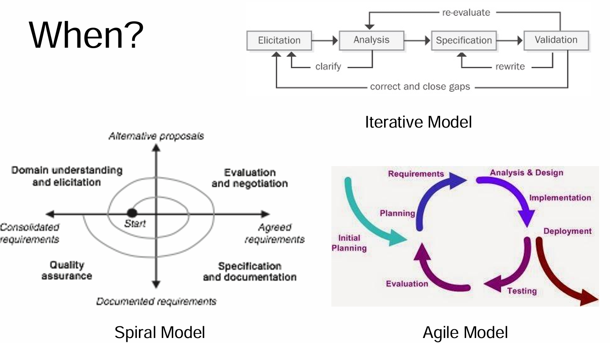
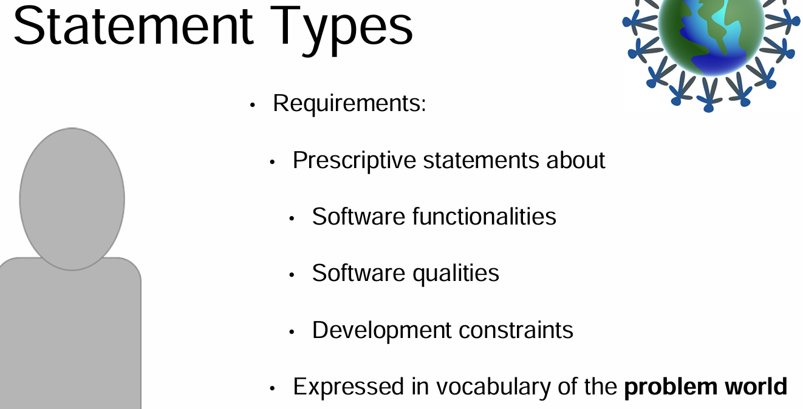
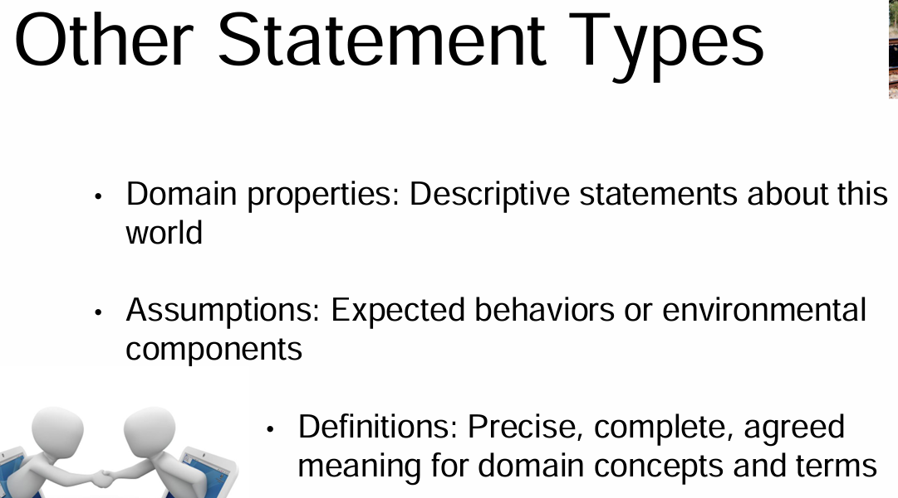
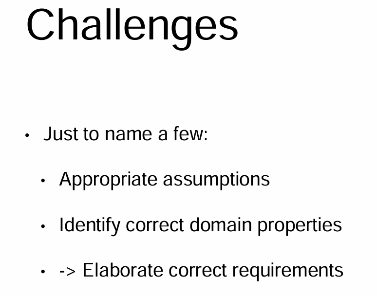
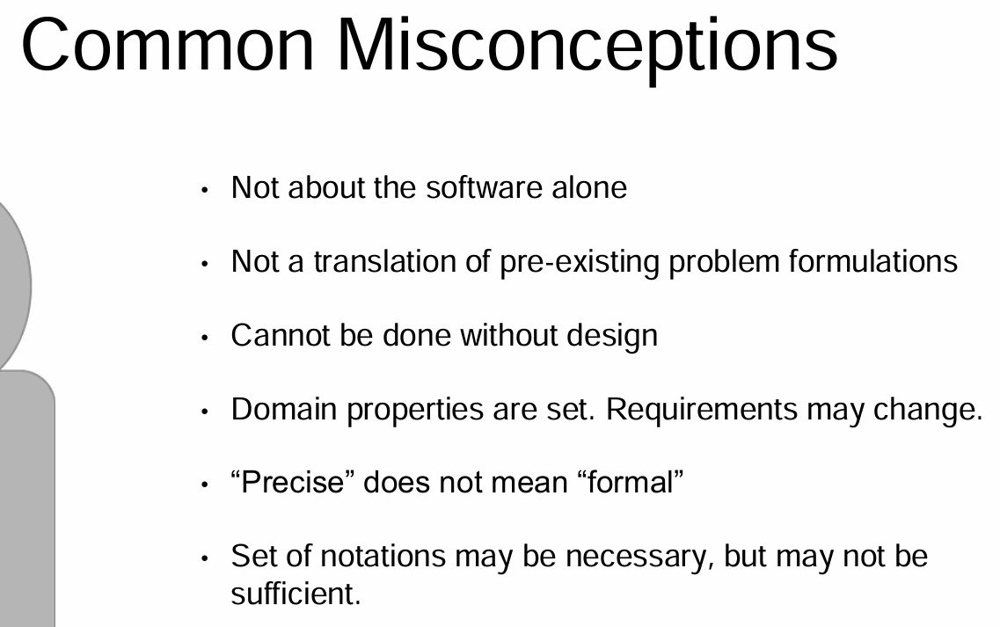
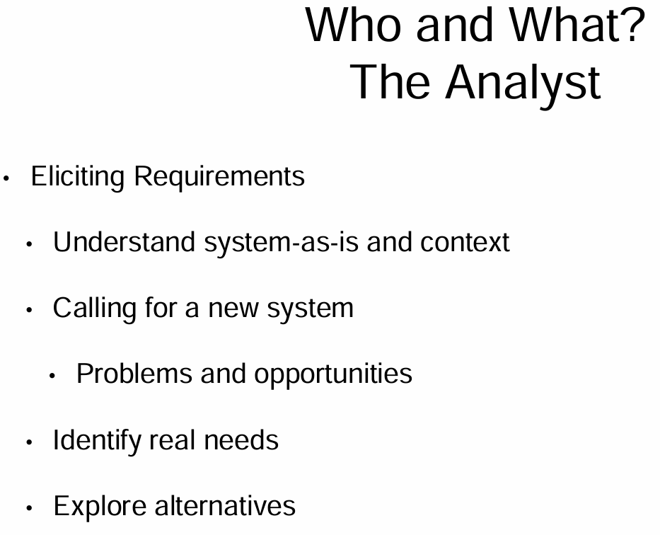
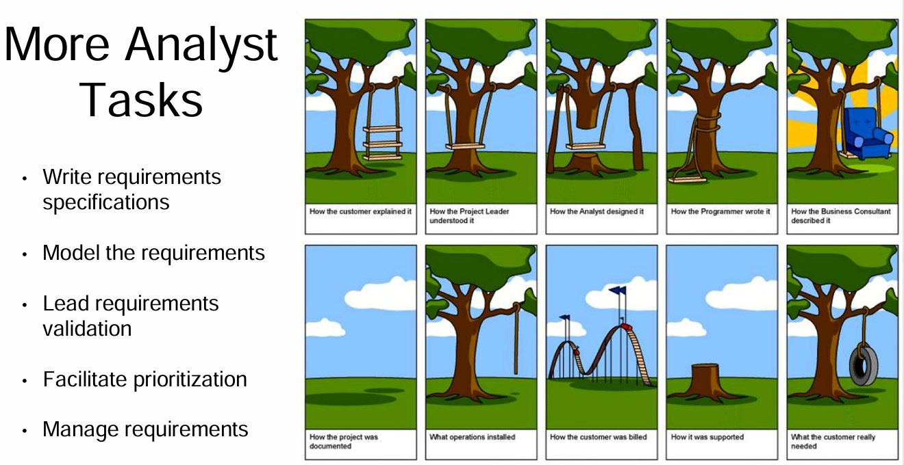
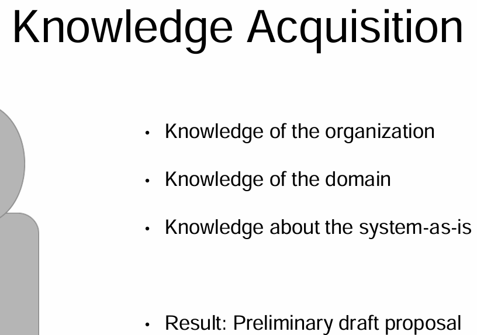
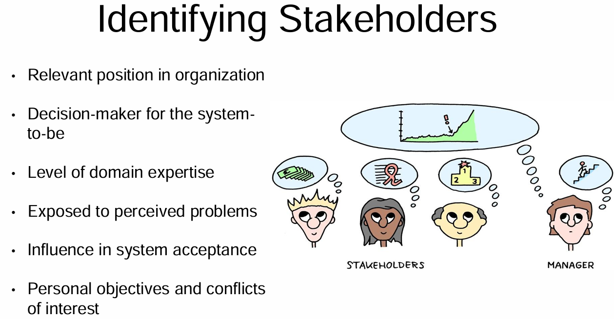
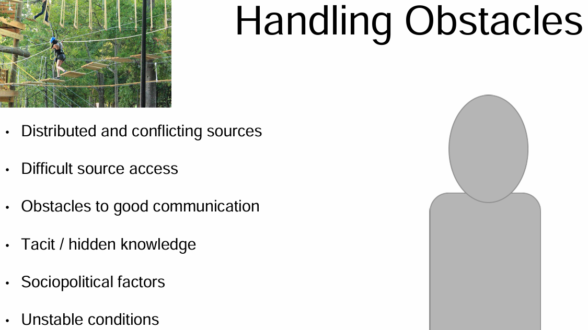

<!-- vscode-markdown-toc -->
* 1. [Elicitation Challenges and Your Aims in the Initial Process](#ElicitationChallengesandYourAimsintheInitialProcess)
	* 1.1. [Challenges and Your Goals](#ChallengesandYourGoals)
* 2. [First Meetings with the Customer](#FirstMeetingswiththeCustomer)
	* 2.1. [Lines and Cats- What we can learn](#LinesandCats-Whatwecanlearn)
* 3. [Determining How to Perform Elicitation and What to Look For](#DeterminingHowtoPerformElicitationandWhattoLookFor)
	* 3.1. [Who, when, why, and how?](#Whowhenwhyandhow)
	* 3.2. [Requirement Engineering Statement Types](#RequirementEngineeringStatementTypes)
	* 3.3. [Requirement Challenges](#RequirementChallenges)
* 4. [Being the Analyst and Learning](#BeingtheAnalystandLearning)
	* 4.1. [The Analyst Who and What](#TheAnalystWhoandWhat)
	* 4.2. [Steps to Effective Knowledge Acquisition - Identifying Stakeholders](#StepstoEffectiveKnowledgeAcquisition-IdentifyingStakeholders)
	* 4.3. [Obstacles in Data Handling](#ObstaclesinDataHandling)

<!-- vscode-markdown-toc-config
	numbering=true
	autoSave=true
	/vscode-markdown-toc-config -->
<!-- /vscode-markdown-toc -->
##  1. Elicitation Challenges and Your Aims in the Initial Process

###  1.1. Challenges and Your Goals

Before we actually move into how to elicit requirements, both from the stakeholder and from artifacts, we need to consider one more software development lifecycle that's becoming very common and it's certainly a buzzword. This is the Agile development lifecycle. In the Agile development cycle, iterations involve the customer before the product is completed. This reduces the chance of misunderstandings. However, in that Spiral model, if you have iterations that are 6 - 24 months long, there are plenty of time and space for customers to change their minds. They get new ideas. They have new needs or they just change their minds. You also run into the issue that they get excited about the product and come up with lots of new ideas. This leads to something that we call scope creep, but we'll get into that later. You can think of the issues that we have with the Waterfall or Spiral model, as it was off of the famous Dr. Seuss rhyme, the users exclaimed with a laugh and a taunt, it is just what we asked for but not what we want. 

So because of these issues back in 2001, 17 engineers came up with the Agile manifesto and the manifesto included four theses. Just like Martin Luther nailed his 95 Theses on October 31 back in 1517 to the door of the catholic church, which sparked the reformation movement on Christianity, these four theses defined a new concept of software development. Credit there are different levels there but it did make a huge change to how we develop software. Within the Agile process, you focus on individuals and interactions rather than processes and tools. You also focus on working software rather than comprehensive documentation. Customer collaboration is vital and you focus on that rather than contract negotiation. Another big thing about the Agile manifesto is that it's saying that we need to be able to change quickly rather than following a very set plan like we did in the Waterfall model,

the Agile development cycle changes how we look at requirements and everything else within the software development lifecycle. We have more communication with users. That's probably the biggest part. This is one challenge that we have that is hard to get over. For any of you who have worked with customers in the past and worked on living software, how many times did you really see your customers? You all have time constraints, you have meeting constraints, you have differences and it becomes very very challenging. In Agile, we try to create documents but at the same time that is not the emphasis. The emphasis within requirements is to have customer collaboration rather than the contract negotiation and working software rather than comprehensive documentation. So there are many companies out there now saying we want Agile, but we still want all the documentation and so you come up then with a weird mix between basically the Spiral Model and the Agile approach. Remember that Agile's impact on requirements is like you do have more communication with your customers, you have less documentation and it's usually written in a different way. But, on a great side, the more you can communicate with your customers, the more you actually learn and that allows you to move forward.

 So we've talked about elicitation and the players that need to be involved to discover the requirements throughout the project. We need to first start by understanding the main ideas. Part of this is understanding the business vocabulary. You can't just talk to your customers in technical jargon. You need to be willing to learn and be willing to learn to understand. You need to get the customers and you need to understand what their requirements really are. Also remember that they probably don't fully know. Be very respectful. Explain all of the work products that are being created from the requirements process. As you are discussing ideas, you can also provide some other ideas. Mention some other alternatives. Something that could be very costly for you to implement, could be solved in a much easier way. Also, no matter what software engineering process you're using, when your requirements change, be honest about the changes. The changes are going to include possibly materials, possibly costs and other things.

So look at yourself as the analyst. The analyst also serves as the main link between the customer community and the development team. Some of their responsibilities include:
- gathering requirements, 
- analyzing those requirements, 
- documenting those requirements and 
- validating them. 

With all of this, you're also likely working with the team. As we all know, teamwork is frustrating. So, you will also have to work with your team to determine who goes where, who got the correct requirements. Keep the requirements development alive. Keep moving forward. Manage activities as the requirements change. As you and your team work together, you will have many insights. As you work with the development team, the development team will maybe say this isn't possible and you have to go back and come up with alternatives and put all of this together. So, next, we'll see other roles that you as an analyst will play and what needs to be done. How do we actually elicit requirements?

##  2. First Meetings with the Customer

https://www.youtube.com/watch?v=BKorP55Aqvg

###  2.1. Lines and Cats- What we can learn

0:00
So, we have lines, we have cats. You apparently have cat balloons. We have invisible lines, green lines that are drawn in red ink, and what!
That video was absolutely ridiculous, right?
While it was ridiculous and extreme, there are a lot of lessons that can be learned from it.

One is how we deal with customers, both in body language and in verbage.
Also, we should think about how we define things and how we relay that to the customer and communicate with them.
What techniques can we use to come up with a viable solution semi-quickly?

Finally, how on Earth do you deal with a manager like that?
Before we answer these questions, I want you to take a quick poll, just so you can see each other's answers.
In this poll, you're going to be looking at, is this a kitten or is it a cat?
Is it cute? Is it not? Is it fluffy, or is it not?
Once we all pull together our responses, I bet you're going to be surprised by the results. You are going to see all of the differences that customers have.
Note that while this exercise seems really silly, it relates strongly back to requirements and nonfunctional requirements. We're at nonfunctional requirements include things such as security.
How do we define everyday things?
We all have our own views.
For example what defines a cat versus a kitten?
What defines cute versus, I don't want that cuddling with me.
What defines secure software?
And secure software, it could be that the software is just password protected. It could be behind firewalls, contain special encryption, work with secure databases, where clearance is required to access it and so much more.
It's really all up for grabs.
But we need to pull that information from our stakeholders and from the archive data.
The first lesson to be learned from the silly video is about the body language and verbiage of the expert.
Know that you are going to have dumb customers.
Dumb's a kind of strong term but they often don't know what they really want. The customers that you meet with may not know the business terminology or the real definitions for what they're trying to explain.
For example, in these videos this customer didn't know what a line was or what perpendicular meant.
Then when they tried to clarify, they said they wanted one line to be a cat.
Again, this is extreme, but stakeholders are very likely to use terminology that isn't quite correct. And it's up to us to figure out what they really mean.
Once they are gone and we get back home then we go cry.
But one of the first things that I noticed in this video was the attitude of the expert. He'd obviously gotten thrown into the situation by the boss or somebody else. And the boss said he's the expert, he can do anything.

Be careful of your facial expressions when talking with customers.

You have to be the confident one and not be giving the look of, my goodness how did I get here?

Take charge and figure out how to mitigate the risks and how to learn the actual needs.

The next big question is how do we actually get productive information out of our stakeholders?

In a first meeting, like the one presented in this video, you're mainly trying to determine the high level goals of the project.

Take notes as the stakeholders talk.

Ask for clarifications on definitions. They may not fit what you're currently thinking about.

You also may have no idea what the word actually means.

An example here is the use of the word perpendicular.

While that's a common word, that's obviously not what the stakeholders actually meant.

Other words lead to vague or ambiguous requirements.

For example it should be a cat. It should be a kitten. It should be fluffy. It should be cute.

This relates to requirements we often get from customers. Like it should be user friendly. It should be secure.

These aren't really measurable things without further specification. And it is your job to identify where there is ambiguity and to clarify.

One great thing that the expert did was to grab a marker and start working out his idea. A bad thing was his tone and voice in sounding utterly critical and well, having no clue what was going on.

Asking the stakeholder for an example likely would have helped more before he started drawing.

Having your stakeholders walk through the product firs helps us to better understand what they're actually thinking about no matter what words they're using.

This particular course is all about figuring out this information. The product that was, the product to be and beginning to gather these requirements for future analysis.

Note also at the end of this video that the customer potentially introduced scope creep.

**Scope creep is any kind of information that doesn't need to be in the final product.**

It maybe caused by the customer because they get excited and suddenly they want a red cap balloon or could be caused by the developers because they say, I could add this just like that. It will take me five seconds. I bet the customer will love it. This can happen at any point during the process.

Beware of this from the very start.

We will come back to scope creep in many of our other lessons. Arguably here, the experts could have started asking about the material of the balloon, the size of the balloon. How it should be inflated, with helium or air, etc, etc. Scope creep! Is it a key project item or not? So now we will move on.

As to the boss, this is a tricky one.

When you're in a meeting you need to make sure to be very respectful to your boss because hopefully you like your job.

So you shouldn't or possibly can't even override the boss while at a meeting. But before contracts are signed and flights are arranged for you to go out and blow up a balloon, cost and risk need to be analyzed.

Changes may need to be made and discussed with the customers. Cost and risk analysis will be covered in a separate course.

There's always a balance to be made between the desires, the feasibility and the money.

If you find yourself in a situation like this, one of the best options is to come up with a cost risk analysis metrics to present to your boss and well, cover your butt too.

Show them the cost, the benefits, the deterrents and see what they decide.

If they're willing to send you to a warm, happy resort island to go blow up a balloon, well,

at least you discussed it with them and why or why not that is necessary.

##  3. Determining How to Perform Elicitation and What to Look For

###  3.1. Who, when, why, and how?

The analyst is responsible for gathering, analyzing, documenting, and validating requirements. In order to do this you need to determine who you will talk to, who you will work with, when to do so, remember why you're doing it, and figure out how to do so.
The analyst has a large and important set of responsibilities, in addition to working with the customer they also need to work closely with a team of designers, developers, testers, managers, and more.
You manage activities as requirements change, as new insights are made, or as new risks appear.
So far we've focused a little bit on the why and when. We know requirements are necessary,
even when they don't need to be extremely well documented. Requirements allow us to know what we are actually producing, they are gathered at different times depending on what development life cycle is being used and how much contact we actually have with the customers.

Way back in 1976 there was an ICSE, which is the International Conference on Software Engineering,
Play video starting at :1:13 and follow transcript1:13
an ICSE paper called Software Requirements: Are they really a problem? While this paper was written more than 40 years ago, the issues that it brings up still hold true today.
Play video starting at :1:27 and follow transcript1:27
Do requirements arise naturally from an obvious need or do they only come about through diligent effort,
Play video starting at :1:36 and follow transcript1:36
even when you put forth diligent effort can they still contain problems? Now the answer is yes, the results discovered in this paper were dramatic. Software requirements are important and their problems are surprisingly similar across all different types of projects no matter how they're developed or in what environment.
Play video starting at :1:59 and follow transcript1:59
This ICSE paper identifies critical qualities of requirement statements and discusses many examples of errors, flaws, and expense that arise from the requirements and the developments process.
Play video starting at :2:13 and follow transcript2:13
There are many requirements that need to be made explicit that customers don't even realize.
Play video starting at :2:19 and follow transcript2:19
For example if you were creating a movie website that is supposed to display a list of movies, you know the explicit requirement of we want to show the movies. You do not necessarily know the other requirements of how do you sort them, alphabetically, by date, by director, or what, this is something a customer may not immediately tell you.
Play video starting at :2:51 and follow transcript2:51
You also need to determine why the product is actually needed.
Play video starting at :2:56 and follow transcript2:56
Why if they want a list of movies, why don't they just use a site like Rotten Tomatoes or something like that?
Play video starting at :3:4 and follow transcript3:04
What are the limitations of the system as it is right now, could you build off Rotten Tomatoes or is that overkill, can you exploit existing APIs or other databases or do you need to start totally from scratch?
Play video starting at :3:20 and follow transcript3:20
With all of this you can develop complete, consistent, adequate, unambiguous documents that are hopefully also feasible, testable, and contain only necessary information.

3:34
Many lessons about how to minimize problems in requirements engineering come from challenges that were experienced in the overall software development life cycle. Just as in the software development life cycle we learn that there is an inevitable intertwining between requirements engineering, system design, and software architecture design, thus a more a spiral, agile, or iterative approach can help.
Play video starting at :4:1 and follow transcript4:01
Agile processes are aimed at early and continuous provision of functionality where that functionality will provide value to the customer, reduce the requirements engineering effort, and also reduce the requirements to code distance.
Play video starting at :4:17 and follow transcript4:17
The fundamentals are the same though, no matter what software development life cycle you'll use or what documentation style you select, very detailed versus user stories alone for example, the concepts of domain elicitation under domain understanding
Play video starting at :4:35 and follow transcript4:35
and the other software requirements engineering techniques are very similar in all of them, although they vary in detail and the actual requirements rating.

###  3.2. Requirement Engineering Statement Types

The requirements engineering process involves four different types of statements. The first set and those that are most well-known, are known simply as requirements. These may include both functional requirements, system requirements, and nonfunctional requirements. Nonfunctional requirements again, are things like usability or security. Requirements are to be understood and agreed upon by all parties concerned with the system to be. Thus, vocabulary is key. And the vocabulary of the world in which you're working should be used. We can think of these requirements as "shall statements" for now. Well, shall or should. For example, if we were creating a train system, we might have the requirement of, "The door state output variable shall always have the value closed when the measured speed input variable has a non-null value." That's complex terms for, "If the train's moving, door should be shut." As a simpler example, if we were writing a meeting organizer system, a functional requirement might be, "A request for constraint shall be emailed to the address of every participant in the meeting invitee list." These statements are understandable for both the customers and the developers, and they help us to define the necessary conditions of the statement to be.

Thus, vocabulary is key. And the vocabulary of the world in which you're working should be used. We can think of these requirements as "shall statements" for now. Well, shall or should. For example, if we were creating a train system, we might have the requirement of, "The door state output variable shall always have the value closed when the measured speed input variable has a non-null value." That's complex terms for, "If the train's moving, door should be shut." As a simpler example, if we were writing a meeting organizer system, a functional requirement might be, "A request for constraint shall be emailed to the address of every participant in the meeting invitee list." These statements are understandable for both the customers and the developers, and they help us to define the necessary conditions of the statement to be. Three other types of statements that are also necessary in your document are domain properties, assumptions, and definitions. Domain properties hold invariably regardless of how the system should behave. These often correspond with physical laws that cannot be broken. For example, a train is moving if and only if its physical speed is non-null. In our example the meeting system, in a meeting, a participant can't attend multiple meetings at the same time. Unless the laws of physics change, these are set by physical truth. They also help us to understand the world in which we're working. The next set of statements are assumptions, and these are much more challenging to determine. Assumptions constrain behaviors on specific environmental components. As one example, let's go back to that meeting system. We might assume that participants will promptly respond to email requests for constraints. Okay, for any of you who have tried to set up meetings or expect email responses from people, we know how well that usually goes. However, if we don't make that assumption, we may need to add a lot more into the system. For example, an entire side reminder system. We might also assume that a participant is on the invitee list for a meeting if and only if he or she is invited to that meeting. As a more complex example, in our train example, a train's measured speed is non-null if and only if its physical speed is non-null. While we want to assume this, just like with the meeting participants actually answering emails, it's not set by physical law, it's an assumption. This statement places a constraint on the speedometer of the train control system. The last kind of statements are definitions. Definitions are a bit different in that they have no truth value. It makes no sense to say that it's satisfied or not. For example, a person participates in a meeting, if he or she attends the meeting from beginning to end. Is that definition complete and accurate? What does it mean to participate? We may need to redefine full participation versus partial participation. For example, do they need to talk? If so, what defines talking? How much do they need to talk? Or, do they just need to be there? If so, for how long?

###  3.3. Requirement Challenges

Making these assumptions, learning domain properties, and writing clear definitions lead to your ability to elaborate on correct requirements. This is very easy to mess up and requires our constant thought, attention, and probably a lot of revision. You know, I had this issue in one of my courses, where I told my students that they were required to participate in at least one class a week. Also, if they couldn't be present in class, I needed to be notified, before the class, so that they would receive participation credit for the day and not be penalized. Given that statement, I had a student walk in, probably 20 minutes late, say, "Hi," wave and walk out. Obviously, the definitions in my syllabus were not clear enough. Requirements are hard

A common misconception is that the target of investigation in our software requirements documents, is just the software itself. This is not the case though, you must explore the system of which the software is a component. Requirements engineering also doesn't amount to just some translation of pre-existing solutions. For example, for those of you who have used a common course management tool. The one that we, that I've been using students say, "Oh my, this is so annoying," for various reasons. And they say, "Oh, we need a course project, we're going to remake this course management software." First, yes, that was the look on my face and response because it's utterly unreasonable given the scope, unless it was a huge 100 person group and they never really wanted to graduate. But it turned out in questioning the students more that they didn't want to make changes to, that they wanted to make changes to the product, but they didn't understand even a quarter of the components underlying it. All most of them really wanted to do was to be able to submit their homework, get a grade, see the grade. And because of that, they had minor complaints about how the system did that. Another misconception, is that requirements is just about figuring out what the users want. But, it's also actually involving system design. We can't just view software like we did in the waterfall model. Often, we need to make decisions that may influence the system design. Thus, even if you never want to code a single line ever in your life, it's good to understand coding and good to understand design because some of your requirements are linked so closely to this, that you can only really understand them once the design has taken place. Security is a good example of this, especially when certain protocols, business rules must be used. Unlike domain properties, requirements may need to be negotiated, changed or weakened. When we discuss precise requirements, we mean that every statement must have a unique, accurate interpretation without necessarily being machine processable. You can write requirements formally, but precise is generally sufficient. A set of notations may be a necessary condition for requirements engineering methods, but not a sufficient one. A requirements engineering method should provide systematic guidance for building complex requirements documents.

##  4. Being the Analyst and Learning

###  4.1. The Analyst Who and What

So now we're really getting started as to who you are as an analyst, what you do and how. The analyst collects and disseminates product information. In collecting product information, you learn about the system as it is and the context in which it works. From this, you identify the real needs and look for problems and opportunities available from the existing systems and existing technologies. This may include things such as databases, APIs, cryptography protocols, network protocols and other techniques. The analyst also is responsible for exploring alternatives. For example, in security of the Internet of things, Telnet is generally used at least right now. But it's not secure. Given your project, you might look at the alternative of should SSHP be used instead. Probably not due to resources and design conflicts, but maybe sometime in the future. It's a consideration. 

Analysts also generally are the individuals who write the requirements specifications, including the use cases, functional requirements and nonfunctional requirements. In writing the requirements models, they are very helpful tools in providing more clarification of statements. You can also have graphical representations that are simpler to access. These graphical representations provide a clearer view for both the developers and customers. Graphical representations may include, graphical analysis models, tables, equations, formal languages, storyboards, prototypes and more. We'll get into that in another course, in how we can diagram things. Throughout the process, we also do requirements validation. In validation, we ensure that the requirements statements possess all desired characteristics and that the system described in the requirements, will satisfy the user needs. Sential participants and peer reviews of requirements documents and review designs, also look at the requirements, the designs, the code and test cases to ensure that requirements were interpreted correctly. The analyst needs to negotiate between the different types of users and the developers to prioritize the requirements. Each requirements should be managed well. It must be recorded, maintained and have tracking information from all the way from inception to the verification. By monitoring this tracking status, this allows us to create traceability information and traceability matrices. Traceability matrices link requirements to other system elements and track links to original features and what needs to be described. Given that software engineering teams frequently have quick turnaround times in terms of employees, these links and documents allow for quicker training and change of control rather than relying solely on tacit requirements. There is much room for learning and miscommunication as you move through the various roles in the production cycle. So, at least start early in trying to get it right. 

Before we can understand the system that we need to build, we must focus on how to get an initial understanding of the system as it is. How to identify the challenges and the opportunities and how to discover analystic real needs of our stakeholders of the system to be. The preliminary phase of the requirements engineering process involves a great deal of knowledge acquisition. This includes knowledge that we need to understand first about the system that was. This includes, the structure, business objectives, policies, rules, stakeholder responsibilities and others. On an interesting note, some stakeholders may be involved in the process in such a way that they don't even realize that they have stake in the system. For an example, in a case study that I saw, there was an automated university system where part of the process involved an assistant retrieving a form from a mailbox, glancing at it and moving it to the next person's mailbox. No one acknowledged that transition, even the assistant who was doing the job. So how do you make sure not to miss this kind of interaction? Understanding the organization can help here. Next, we deal with understanding the domain in which the problem world is rooted. This includes, concepts involved in the domain, the objectives specific to it and regulations that may be imposed on it. For example, you may get a job, and you get contracted out, and you are suddenly working with a satellite monitoring system. I don't know anything about satellite monitoring. Even those who have worked in the field for years may only know about specific pieces that they have dealt with and they can't describe the rest including where you really fit in. These stakeholders can help us to some degree but know that you may end up feeling totally lost. If the stakeholders are already using some kind of system, automated or not, we need to learn what the objectives of that system are, who the actors and the resources involved are, what the tasks and workflows are and what problems were raised in the current context that make them want to change. The output of this exploration, is a preliminary draft proposal that describes the system as is. How it fits into the domain and the organization, the identified problems, opportunities to be exploited and hopefully, some potential alternatives in view of the opportunities that you've discovered. This will be used in evaluation phase at both the elicitation phase and in the requirements analysis phases. It's also very helpful to create glossaries of terms as you learn. This should be appended to your document as well.

###  4.2. Steps to Effective Knowledge Acquisition - Identifying Stakeholders

For effective knowledge acquisition, we first need to identify the stakeholders. By communicating with the stakeholders, we can gain a much more complete, adequate, and realistic idea of system requirements. Often there are a huge number of stakeholders. Remember a key phrase in any software engineering course should include the word balance. We need to determine a sample of the available stakeholders based on their respective roles, what their stakes are, what their interests are, and the type of knowledge they can contribute. Some ways to get started include finding relevant positions in the organization. Know that you will likely find more later. Keep your options open and stay very organized. First, find decision makers for the system to be. This is rarely just the people who have the money. But, you can start with them and then find out who the real users of the system are, which may include the people with the money too, who knows? From the real users, consider their level of domain expertise. Remember that you're attempting to determine problems and opportunities in the system as it is, as well as some background information. Those with higher domain experience can assist there. The decision makers and experts are also more likely to have influence over the decision of acceptance of the final system. As you work with the different stakeholders, you'll also probably observe lots of conflict of interests and personal objectives, that will need to be taken into consideration to get a full view of what your future system will really need, and what problem should be addressed. For example, a manager may say, "I want this to be cheap." The security manager says, "I want it to be very secure." Whatever that means. The users who log in constantly, want it to be user friendly and fast. This is just one example of conflict. Oh and by the way, "I really hate those people in the other department, I don't know why that department exists." So why are you listening to their requirements? Oh dear, lots of issues can come up. A first step through this is just identifying who the players are, at all levels and areas and try to avoid bias.

###  4.3. Obstacles in Data Handling

There are many potential obstacles that we need to be aware of at the outset. When we're acquiring data we have multiple stakeholders and large numbers of documents and data. Conflicts can arise for a number of reasons, there may be competition between departments, competition between individuals, diverging interests, different priorities and concerns, you're dealing with outdated documents, etc.
Play video starting at ::28 and follow transcript0:28
Given all of this information and all of the people that you'd like to talk to, you also need to keep in mind that stakeholders are very busy.
Play video starting at ::36 and follow transcript0:36
They also may not be convinced that it's worth the effort to put in the time of giving their input, or that their input matters. Think for example of how many surveys you get at your job or how many surveys you get in your email inbox. How many do you actually answer?
Play video starting at ::57 and follow transcript0:57
Why do you answer them or why don't you? These surveys take away valuable time from your main priorities.
Play video starting at :1:6 and follow transcript1:06
So why help?
Play video starting at :1:8 and follow transcript1:08
Stakeholders may also be reluctant to provide input info. Or they may feel that they'll get in trouble for giving their real information.
Play video starting at :1:20 and follow transcript1:20
Many stakeholders also don't want to change, they don't want to move to a new system. They see it as more unneeded work for them, and more learning that they need to do and go with the concept of, ain't broken, don't fix it. You'll also run into stakeholders with different backgrounds at cultural, educational, and other levels.
Play video starting at :1:44 and follow transcript1:44
This can result in you hearing a lot of different terminology, leading to obstacles in good communication.
Play video starting at :1:52 and follow transcript1:52
Next, there's a lot of tacit or hidden knowledge that we need to understand to get the system.
Play video starting at :2:1 and follow transcript2:01
This knowledge may be implicit in the stakeholder's mind.
Play video starting at :2:4 and follow transcript2:04
Or, because they are very familiar with the product, and very familiar with their area, they may see it as just common sense, so they may not explain details or connections.
Play video starting at :2:15 and follow transcript2:15
They may also have a hard time explaining things from a distance, either in verbal, written, or even video examples, if we aren't really interacting with them.
Play video starting at :2:28 and follow transcript2:28
Also, another joy with all customers, is they probably don't really know what they want or they have a hard time expressing what they want and why they want it.
Play video starting at :2:39 and follow transcript2:39
They may miss the problem and try to jump straight into solutions that they see.
Play video starting at :2:45 and follow transcript2:45
This is especially frustrating if you are working on software that is serving another development need. Developers jump straight into solutions and don't really necessarily consider all the options. When the problem explanation is unclear, it's hard to distinguish between essential aspects and subsidiary details.
Play video starting at :3:10 and follow transcript3:10
If the environment is changing, it may be hard to map the hypothetical descriptions of the new system into future working conditions.
Play video starting at :3:19 and follow transcript3:19
This leads to unrealistic expectations.
Play video starting at :3:23 and follow transcript3:23
There may additionally be competing ideas, goals, politics, resistance to change, time cost pressures, etc. The organization may be changing.
Play video starting at :3:36 and follow transcript3:36
Turn around time now is quite high and people come and go. And thus, the perceived needs and proprieties of the project may change as new people come and people leave.
Play video starting at :3:49 and follow transcript3:49
In order to deal with these, we need to think about our communication skills. Effective interaction with all kinds of people is essential and we need to take the right attitude with them given their circumstances.
Play video starting at :4:4 and follow transcript4:04
Know that you will have multiple extremes. Frequently, information is kept implicit or you'll get overwhelmed with completely irrelevant details.
Play video starting at :4:16 and follow transcript4:16
To help with this listen carefully, ferret out key points. All stakeholders should see you as a trusting partner, looking out for their best interests.
Play video starting at :4:30 and follow transcript4:30
As information is gathered, double check, use review meetings, and present your understanding of the problem world. Where this problem world information has been acquired from multiple resources and do it in an integrate and structured way.
Play video starting at :4:47 and follow transcript4:47
Validate, refine, and keep increasing confidence over time.

