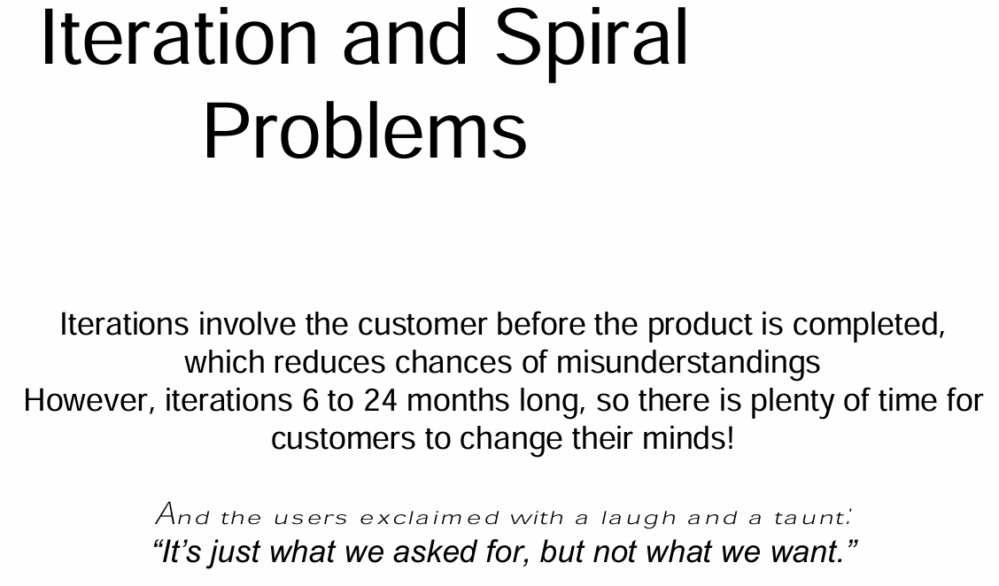
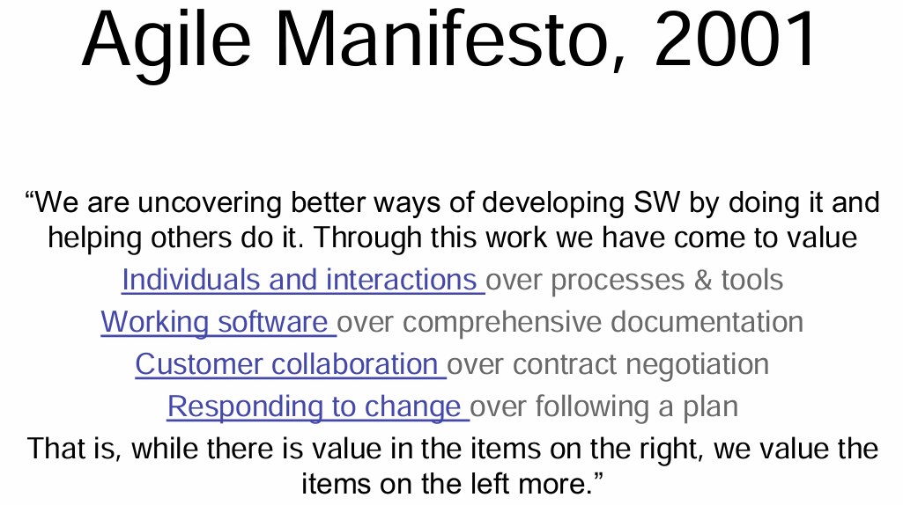
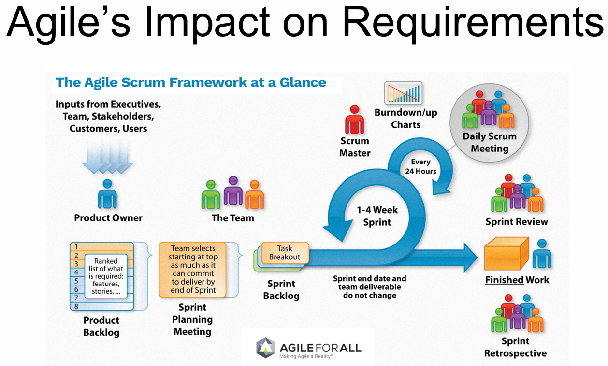
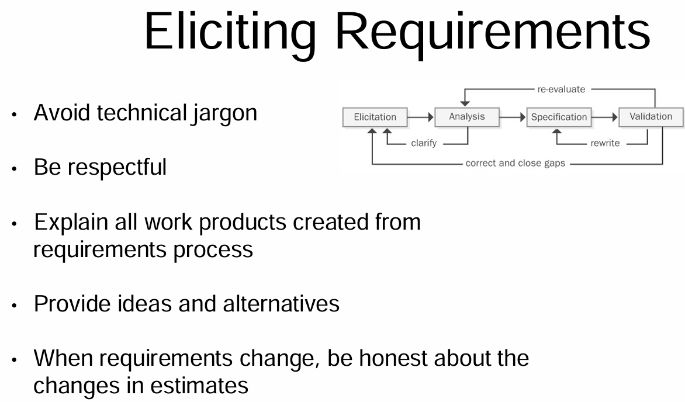
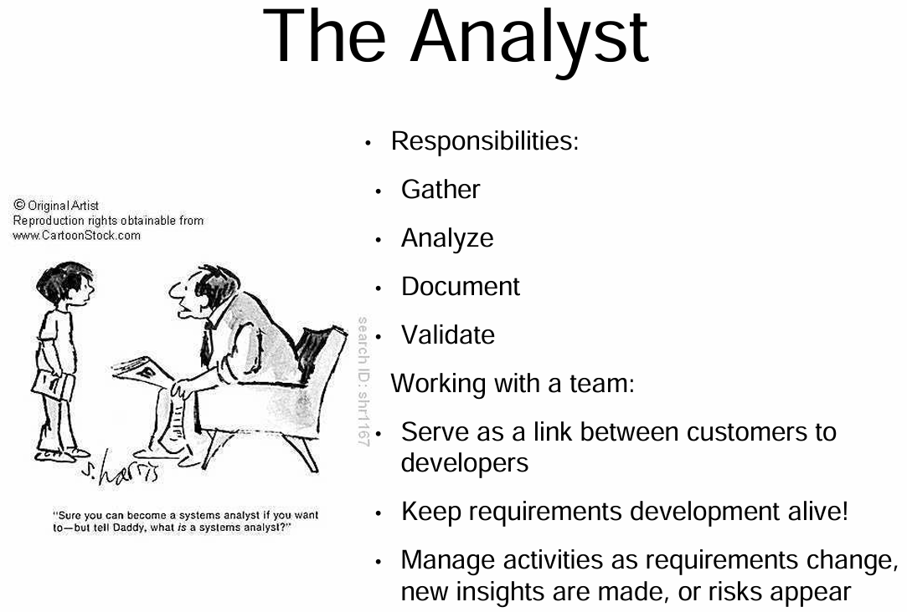
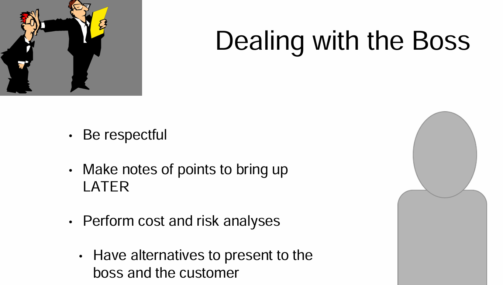
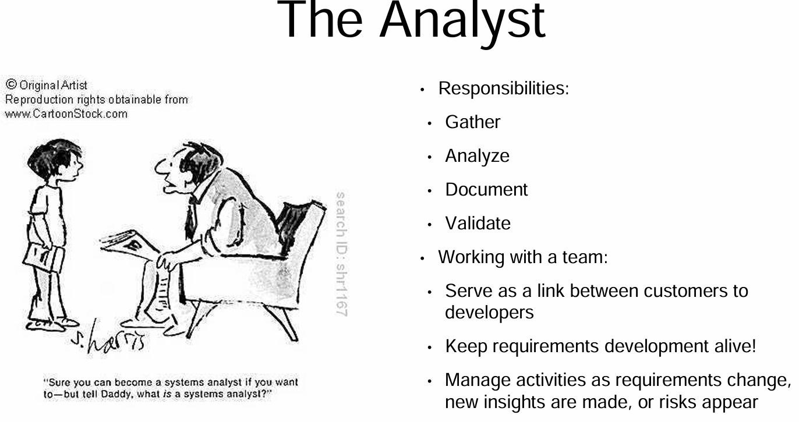
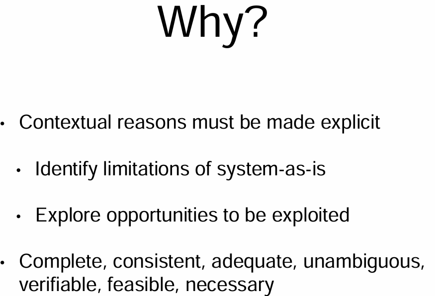

## Elicitation Challenges and Your Aims in the Initial Process

### Challenges and Your Goals

## First Meetings with the Customer

### Lines and Cats- What we can learn

## Determining How to Perform Elicitation and What to Look For

### Who, when, why, and how?

### Requirement Engineering Statement Types

### Requirement Challenges
