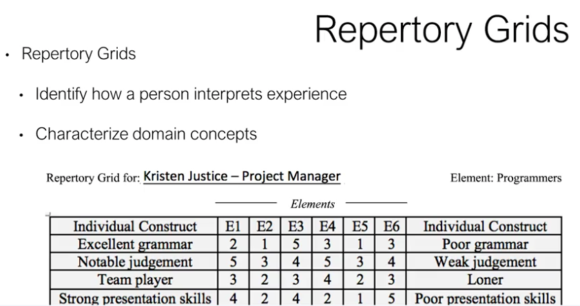

<!-- vscode-markdown-toc -->
* 1. [Artifact-driven Elicitation](#Artifact-drivenElicitation)
	* 1.1. [Artifact-driven elicitation- What is it?](#Artifact-drivenelicitation-Whatisit)
	* 1.2. [Who are your Stakeholders? A Meeting Scheduler Example](#WhoareyourStakeholdersAMeetingSchedulerExample)
	* 1.3. [Get help and meet other learners in this course. Join your discussion forums!](#Gethelpandmeetotherlearnersinthiscourse.Joinyourdiscussionforums)
* 2. [Artifact Gathering](#ArtifactGathering)
	* 2.1. [Artifact gathering - Questionnaires](#Artifactgathering-Questionnaires)
* 3. [Repertory Grids](#RepertoryGrids)
	* 3.1. [Repertory grids](#Repertorygrids)
* 4. [Card Sorts / Conceptual Laddering](#CardSortsConceptualLaddering)
	* 4.1. [Card sorts/conceptual laddering](#Cardsortsconceptualladdering)

<!-- vscode-markdown-toc-config
	numbering=true
	autoSave=true
	/vscode-markdown-toc-config -->
<!-- /vscode-markdown-toc -->

##  1. Artifact-driven Elicitation

###  1.1. Artifact-driven elicitation- What is it?

In order to get the information that we need, we can use a combination of two main types of techniques. These include:
- **artifact driven elicitation** and 
- **stakeholder driven elicitation**.

An artifact driven elicitation, **artifacts include any existing information about the system** that can be gathered from a number of sources.
These can include things like:
- pre-existing documents about the current system, 
- data samples, 
- questionnaires, 
- conceptional grids, 
- scenarios of interactions between system components,
- system prototypes, 
- reusable knowledge, and a lot more. Basically, what can you get from the company?

If we were unfamiliar with the system as is, one way is to start by collecting, **reading and analyzing the existing relevant documentation** (this background study is sometimes called **content analysis**).
- A background study supplies information that can be used later.

In the content analysis:
- we learned about the terminology, 
- objectives and policies that we're taking into account in creating the system as it was.
- distribution of responsibilities among the stakeholders and the main users of the system.

Big challenge of this, is that **there could be tons of information**.
- The key information needs to be extracted. And it may be inaccurate or, very frequently, it's quite outdated.

So, in order to sort out this information, we try to acquire some meta knowledge, basically, for guidance.

**What is needed in the system? What is not?**
- Model driven approaches can provide a solution for this. However, **first we need to learn about the organization**, itself. This can be very, very basic. Such as:
   - what does the organization do?
   - How does work flow? What policies do they have?
   - Who cares at all about this product?
   - You can begin to learn about this, first, by talking to your customers, obviously.
      - However, customer contact takes a lot of time, so we should try to get some background knowledge first.

You could start looking at documents that exist within the organization, if available. These might include things like:
- **organizational charts**: help you to understand the connection between the management and the employees
- **business plans**: to see what the key goals of the company are and how that ties to the product. How it ties to the product that was, as well as the product that is to be. 
- **policy manuals**: let you better understand the underlying environment. 
   - For example, are there areas that require different government clearances?
   - How important is security, from both the human and the computing senses?
- **financial reports**: can reveal key stakeholders and company holders who should be talked with
- **existing meeting** minutes regarding the product: may include **complaints and suggestions** for the upcoming project 
- job descriptions: help determine potential stakeholders who use the product.

Next, we examine and try to understand the overall domain.

Sometimes the general domain is something that you're already very familiar with, but maybe not entirely. Be careful of that, you probably don't know everything.

What to to if you have a project where you dont know nothing about?
- To start, do some research. Consider books, surveys, and published articles.
- You will not become an expert, but you will be able to begin to **learn questions to ask in the area of the stakeholders** (try to clarify what you're talking about).
- Within these books and surveys and articles, notice, particularly, **regulations within the domain**.
- You can also notice in these are documents, if there are similar systems out there.
- When working in domains that you know little about, similarity recognition is challenging and you may be wrong.
- However, it does **give you an idea of questions to begin asking your stakeholders** in order to clarify some of your knowledge.
- And, also, it will **help you not sound like an idiot when you're talking with them**.

But, again, the point of all this, is to **gather background knowledge to guide your understanding so that you can question**.
- The more questions, the better questions you can ask early on, the more information you'll be able to get from your customers.
- As we gain knowledge of the organization and the domain, we can simultaneously learn about the system as it is.

**Learning about the organization, help you to learn about the system**

From the artifact perspective, well, you have to see what's available. Not all companies are going to have everything.

User manuals are likely the most common resource that you'll be able to get your hands on, but they're also likely very big. You don't want to read through them in complete thoroughness. So other resources that you might pull out, are things like information flow reports, designated work procedures, and some written business rules.

You may also have access to defect reports, complaints, whether those complaints are from higher ups, workers, the people who are paying you, who knows, and you may also be able to get change requests.

**All of these will help you to understand the system as it was. Why stakeholders are desiring a new system, and how the stakeholders are related to the system.**

###  1.2. Who are your Stakeholders? A Meeting Scheduler Example

##  2. Artifact Gathering

###  2.1. Artifact gathering - Questionnaires

Another technique of gathering artifact data is to **submit lists of specific questions to selected stakeholders**, where **those stakeholders have been identified by artifacts or possibly by conversations**. 

This **leads to stakeholder elicitation**.
- Each question may be given a brief context and may require **short, standardized answers**.
   - By keeping your answers short and standardized, it eases frustration on both sides.
   - Essay questions leave much room for misunderstanding and for vagueness.
   - They also take a lot longer to read, to write, and to review.
   - And they're almost impossible to evaluate.
- Multiple choice questions help both the reader and the evaluator in making decisions and determining standardized answers.
   - These can be expounded upon later, as needed.
- Within a questionnaire, you might also include **weighting questions**.
   - These are **questions that are weighted by the respondent for perceived importance, preference, or risk**.
   - For example, on a level of one to five, rate the importance of getting a response about meeting participation from all meeting participants within seven days. Where one is I don't care, to five it's mandatory.
- All of these questions that you write in a questionnaire **can be either qualitative of quantitative in nature**.
   - **Qualitative questionnaires** could be used to gather facts about people's beliefs, feelings, experiences in certain jobs, services offered, Activities, and so on. The questionnaire is designed in such a way that participants have **freedom to express their views** in response to the question asked without any influence or any clues from the interviewer.
      - These questions are usually open-ended to allow the respondents to write either positive or negative responses based on the types of questions.
      - Data gathered in this way is helpful if a researcher seeks to understand how people feel about certain issues.
        - For example, you've all probably taken surveys on using certain products, about services offered by hospitals, by banks, by restaurants, and so on.
      - This type of research method can be **useful for companies who seek to understand the experiences and feelings of consumers who use certain products**.
      - Responses from the participants **could influence the way that the company changes their strategies**. And can influence your information on **how you need to design the system to be to suit the needs of the current customers**.
      - However, this type of research method **may not be helpful if the researchers are interested in quantifying and confirming hypotheses about certain outcomes**.
      - Now, the good thing about qualitative questionnaires is that **they are very flexible**. And they can be worded in different ways to let participants give responses in their own words, compared to yes or no.
   - **Quantitative questionnaires**, however, are the **best way to gather numerical data that could be used to confirm hypotheses about actual occurrences and opinions**. **Closed-ended questions** are used in this type of method, and are assigned numerical values from which the responder can choose from.
      - For example, you can ask the participants to choose their **age groups**.
      - the respondents choose answers from the given list. They have **no chance to express their views or opinions about the questions**. For example, participants could be asked to rank their feelings based on some given scale from one to five. One being poor, five being best.
  
Questionnaires allow us to acquire information promptly, at low cost, remotely. And they can be used to access many people.
- Qualitatitive and quantitative metrics can come into play.
- On the other hand, **questionnaires may be biased**.
   - How many surveys have you gotten in the past month that you haven't responded to?
   - Who is getting the questionnaire? Who is responding? What is the context of the response? Especially for qualitative questions, where you have to do a lot of parsing on your own, could they be interpreted or read differently?

There are some **tricks that we can use to make better questionnaires**. 
- First is ask **implicitly redundant questions**. This will help you to see if people are answering honestly.
   - Now, we're not saying that we shouldn't expect people to be honest. But we may not always have an answer in exactly the same way.
- In asking redundant questions, you can get a clearer sense of what's going on. They may have a **different response if the question is rephrased**.
- Some people fill a survey in a randomly way, drawing something...
   - Redundant questions can help factor out those questionnaire takers and remove that bad data.
- Also try to favor close-ended questions with accurate answers. These are often used prior to interviews. And can be used to prepare for interviews and can help target interviewees.

An **open-ended question** is designed to **encourage full, meaningful answers using the subject's own knowledge and, or feelings**.
A **closed-ended question**, which **encourages the short or single word answer**.

NOTE: In gathering initial knowledge, closed-ended questions are generally much more helpful.

##  3. Repertory Grids

###  3.1. Repertory grids

Another way to identify how people interpret experiences is to form something called a **repertory grid**.
   - These are sometimes used in expert system development.

An **expert system**: something that has a unique structure different from traditional programs. It's divided into two parts, **the inference engine and the knowledge base**.

To run an expert system, **the engine reasons about the knowledge base like a human**.
- The goal of our repertory grid is to get more information from the stakeholders regarding domain concepts, by having them characterize or categorize them.

- The repertory grid is **a technique for identifying the ways that a person construes, meaning interprets or gives meaning to his or her experience**.
   - It provides information from which we can infer information about the personality. But it's not a personality test in a conventional sense.

In a repertory grid, the grid consists of four parts:
- the topic: That is about some part of the person's experience.
- the elements. Elements are examples of instances of the topic.
   - For example, we might have a project manager as the topic, where the elements are programmers.
   - You can use any kind of well defined set of words, phrases or even some behavioral vignettes that can be used as elements.
   - For example, to see how I construe the setting of a project manager, I could select from a bunch of programmers.
- the set of constructs. These are basic terms that the client uses to make sense of the elements and they are always expressed as a contrast.
   - Thus, the meaning of good depends on whether you intend to say good versus poor, say, if you were construing a theatrical performance or good versus evil, as if you were construing the moral status of a fundamental experience or something like that.
   - And the example that you see here, we have ranges from excellent to poor, team player versus likes to be alone, great to poor etc. Then, in the middle of this charts, you have a set of ratings of elements versus constructs.
- The set of ratings: Each element is positioned between the two extremes of the construct using usually either a five or a seven point rating scale system.
   - This is done repeatedly for all constructs that apply.
   - In most rating systems, you want to use odd numbers and not give too many options.(That's why we usually choose five or seven.)

And thus, the meaning to the client can be captured. And the statistical analysis varying from simple counting to more complex multivariable analysis of meaning is made possible.

If you're looking at this graph and saying, what's going on, basically it's a rating system. In this example, element 1 who's going to be one of those of programmers, gets a 2 out of 5 on the range from poor to excellent on grammar.

Note that ratings do not need to be unique within a row. A single grade could be analyzed for content using eyeball inspection or you can get into very complex analysis based on the overall structure.

You can use cluster analysis, principal component analysis and a variety of structural indices relating to the complexity and the range of the rating.

Unless the chart is enormous, eyeballing it is generally used.

##  4. Card Sorts / Conceptual Laddering

###  4.1. Card sorts/conceptual laddering

Another way to determine information about domain concepts is through card sorts and conceptual laddering.

1. you give stakeholders a set of cards with what you see as key requirements given your knowledge. *Your knowledge* of the system as it is.
   - These requirements may include both functional and non functional requirements. Stakeholders are likely to focus more on the functional requirements. However, in systems that we want to be secure, learning the non functional requirements may be equally important. And should be definitely considered early on.
   - We often see these non functional requirements being important in products that involve things like banking information, realty information, any kind of identity information.
   - One way to address this in doing a card sort is perhaps to start by making two piles of cards. (one for functional the other for non functional)
2. Meet with subsets of stakeholders and have them partition the cards into subsets based on their views.
   - As they do the card sort, hopefully you're doing this in person or over Skype or something.
   - Have them explain their reasoning, and start asking questions.
   - Customers will ask, will make statements, that are both descriptive and prescriptive.
      - Descriptive statements: are **showing things as they actually are, not as they wish them to be**.
      - Prescriptive statements, on the other hand are things that are **how the system should be**.

During the process, we **try to learn implicit properties, such as classification criteria**.
We can also **learn some domain knowledge in there, and see some of our misunderstandings**.
We can determine **if their statements and sorting are decided due to different domain properties or are they potential requirements**?

For example, in our meeting scheduling system we may have a meeting versus a participant.
- Participants need to be invited to meetings. This is a **prescriptive statement**.
- The scheduler needs to know the constraints of the invited participants in order to attend the meeting, also **prescriptive**.
- A person can not be in two meetings at the same time, otherwise they are Skyping and not listening and multi-tasking and they're not allowed to do that. **Descriptive statement**.

With these sorts, we can also do something called conceptual laddering. 

**conceptual laddering**, we're **trying to delve deeper into individual requirements that we discover and arrange the concepts into taxonomical trees**.
- For example, in defining a meeting, can we divide a meeting into sporadic meetings versus regular meetings?
What's the difference?

- Repertory grids, card sorts, and concept laddering tools are simple, cheap, and easy to use, especially at the beginning of the process.
   - However, **they may be subjective, and hard to do when there are a large set of concepts**.

They are easy to understand though, to both you and your customers. Cards aren't threatening. Surveys aren't threatening. They can be covered quickly, if done well, and can help you gain early knowledge.

