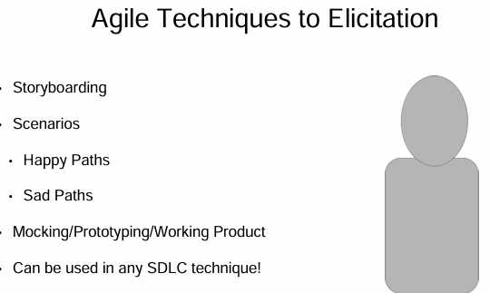
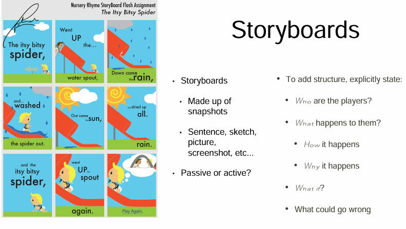
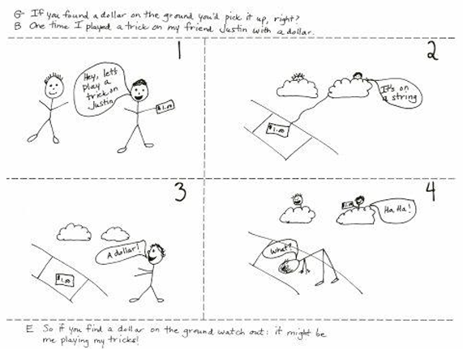
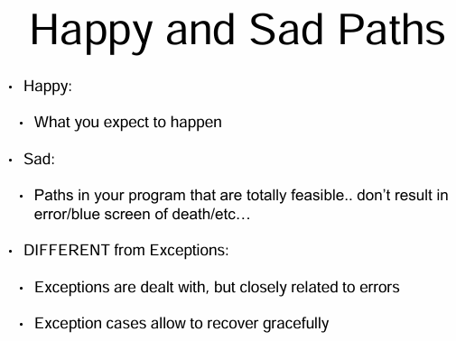
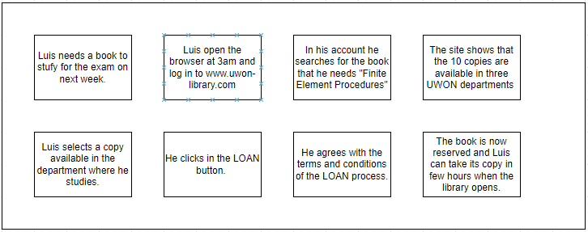

<!-- vscode-markdown-toc -->
* 1. [Storyboarding](#Storyboarding)
	* 1.1. [Storyboarding](#Storyboarding-1)
* 2. [Scenarios](#Scenarios)
	* 2.1. [Scenarios](#Scenarios-1)
	* 2.2. [Scenario Advantages and Disadvantages](#ScenarioAdvantagesandDisadvantages)
	* 2.3. [Reading Scenarios / Scenarios Advantages & Disadvantages - Slides](#ReadingScenariosScenariosAdvantagesDisadvantages-Slides)
	* 2.4. [Reading Requirements Elicitation: Towards the Unknown Unknowns](#ReadingRequirementsElicitation:TowardstheUnknownUnknowns)
* 3. [Mockups and Prototypes](#MockupsandPrototypes)
	* 3.1. [Mockups and Prototypes](#MockupsandPrototypes-1)
	* 3.2. [Reading Mockups and Prototypes - Slides](#ReadingMockupsandPrototypes-Slides)

<!-- vscode-markdown-toc-config
	numbering=true
	autoSave=true
	/vscode-markdown-toc-config -->
<!-- /vscode-markdown-toc -->

##  1. Storyboarding

**Narratives** are especially useful early on for eliciting and validating the understanding that you currently have of the system. One way to tell narratives is through **storyboarding**. 
You can also use scenarios and prototypes.
- With prototyping, you could do a prototype or you could also create an actual working product and we'll go through the differences there. Please note that when I say **working product in an agile environment**, 
   - I mean that the product actually executes, it is not complete but it does work. 
   - You're adding individual features that work each individual iteration. You show how it works. Then you get feedback to keep growing and make happy paths and sad paths as identified by the users through the storyboards and the scenarios as they're needed. 
   - **Happy and sad paths** will be discussed shortly. 

All of these different techniques can be used in any software development life cycle. The terms that I just used though of storyboarding, scenarios, I also mentioned user stories, these are things that are usually heard within an agile environment. So, how do we get requirements? 

- First, we're trying to ask how are things running on the system as it is? 
Then how should they be on the system to be? 

One of the loosest forms to represent these kinds of questions, is a **storyboard**.
Think of a storyboard as a movie just made out of a bunch of individual snapshots. 
- The snapshots all come together. They tell a story about the system. Well, hopefully, in a movie they tell the story about the movie. But these are quick and easy to understand for all that are involved. 
- Two techniques to create a storyboard include **passive and active**. 
   - In passive storyboarding, you're kind of going off of your domain knowledge and say, Okay, I think I know what we want to do. So, given that, here's the story. You tell your stakeholder the story and you see if you're right. Your other stakeholders go through that story with you and have them explain and validate your statements. 
   - In active storyboarding on the other hand, s**takeholders are saying, "here's what we want to do," and you kind of create the story board together**. The stakeholders are contributing to joint exploration. This is useful when you aren't really sure what's going on. You're working together in a very active way. In either technique, you need to determine how the story of the software is coming together. 

In addition to determining the main actors, also you need to ask who are the rest of the cast? Do you have walk ons in the background? Who all do you need to talk to? This allows you to figure out more about your domain knowledge and know what questions you need to ask and whom you need to ask those questions too. So, going along with the movie idea or I guess a TV idea, you just want to ask what happened through specific episodes where you could be involving the main cast, the main characters, all the cast and the Locketts. You ask questions like what if such and such an event occurs. If that happens, what is the ideal outcome? If things go totally wrong, what are the consequences? 
  
 

- Storyboards are beautifully simple. And as you can see from this picture, they're understood by all. 
   - They lack a lot of detail. However, they can act as a key discussion point. You're getting started. 
   - If you are really, really bad at art, remember their drawing stick figures? Totally fine. I don't mean that as a joke. Seriously, a lot of these drawings, these storyboards and the scenarios that we'll be talking about here, are being drawn out on napkins when you go to a lunch meeting and you're discussing possibilities or maybe skyping over the phone or things like that. They look horrible. It's okay.
   - In this picture you see a very simple example of a happy path of a prank. In this picture the kid wants to play a trick on his friend. So, the kid puts a dollar or something. We're going to assume that we're putting it on a string, and we're going to assume that the friend could not see that string, and the person who's pulling the prank goes and hides behind a bush. The friend walks by says, "A dollar!" And they try to pick it up. The hacker of the situation then suddenly or maybe very quickly pulls away the trap. They pull away the dollar. There are many possible consequences after that happens. The happy path is that the friends tricked and they go oh, how did I fall for that? And they start laughing. Or they could get really mad. Or in trying to get the dollar, they could fall and in doing so fall into the street, get hit by a passing car. Okay, that went into the morbid side of things. But let's come back to the idea of what we're doing in dealing with software requirements. We have happy paths. We have sad paths. 

   - **Happy paths** are **what we expect to happen**. In this example,the friend gets tricked, both laugh over it. 
   - The **sad paths** are basically **all of the other possibilities**. Sad paths are **things in your program that are totally feasible, but just not quite what you want**. 
   - Note that sad paths are different from exceptions in code. If you do a lot of coding, **exceptions are things where you're catching code that could kill the program**, it could modify answers within your programs that the program is able to continue to proceed, or it might give an error. We've all seen the exception code and we've worked with the errors. But these are different from sad paths in that exceptions deal with recovery. 
   - Sad paths deal with the stuff that we just hope won't happen. It's not what we necessarily expect, but it really is likely at any point.

##  2. Scenarios

###  2.1. Scenarios

When we create storyboards and begin discussing them, whether we're doing it in a passive way or an active way, we **try to find the happy and the sad paths that should be addressed in the program**.
- One way to address the happy and the sad paths is through the **use of scenarios**.
- similar to storyboards in that they **illustrate sequences of interactions**. But they have quite **a bit more detail**. 
   - you're actually defining who, what, when, where, and how things are interacting.
- The scenario shows **how all of the system components are interacting to accomplish the implicit objectives and determine how the implicit objective can be met**.
   - You also discover, **how you would hit the sad paths**.

When we create scenarios, **creating scenarios is made simpler by discussing the concrete examples of real life interaction sequences**.
- From these interactions, you can **gather concrete examples of hypothetical interaction sequences**. 
- You can ask specific questions about them. From that, you can also elicit underlying objectives.
   - you can say, well, why would you do that? Or why could that happen?
All of these ideas can later be pulled together to generalize the interactions into models of the desired behavior.

Let's say that in our meeting scheduler, the meeting initiator asks that the scheduler plan a meeting with some particular date range.
This request includes a list of desired participants.
The scheduler goes and checks to see that first, the initiator is allowed to create a meeting and that their request is valid. So for example, you can't say that you want the meeting to start in January of 2017 and end in December 2016. That would be a faulty date range. The scheduler should be checking that. As an additional requirement, one of the participant returns their constraints. Then, the scheduler will validate those constraints. Just like in making sure it's not looking at invalid dates, it does that for both the initiator and the participant. Additionally, when the participant returns their constraints, the scheduler will validate them. Just like they did for the initiator of the meeting, we also check to see that the participants' dates are also correct.
In this confirmation, the constraints are confirmed as being received.
Once all of the valid constraints are received, the scheduler determines a meeting date and a location that will fit the constraints. We all know this never really goes well. There are going to be conflicts.
But these are the key goals.
Finally, the scheduled meeting date and the location are notified to the initiator and also to all the invited participants. Again, this is the happy path where everything goes well.

In scenarios, we have positives and negatives.
- **Positive** scenarios are **what should happen in terms of the one or more behaviors that the system should cover**.
- **Negatives**, you can think of as counter examples. Negatives illustrate **what may not happen**.
   - These are behaviors that the system should include, but they should deal with them. This relates to our sad paths.
   - In our scenario example, what are these?
   - What might a negative scenario look like?
   - Well, one sad path might be that the participant returns a list of constraints that covers all of the dates within the prescribed date range, but they mess it up and go a couple days later too.
- 
Is that really a sad path? They're saying they're available.
So what do you do?
As another example, let's say that the scheduler forwards the message of confirming the dates to all participants, asking for alternative constraints with some extended date range.
In this case, while this is not a sad path, it is a negative scenario.
Because we have an implicit requirement that participant behaviors are not disclosed to others.
If I say, nope, I can't be there Friday, you shouldn't know that.
So this is an example of a negative scenario that isn't a sad path, as sad paths are described in the software development life cycle. However, it is not allowed by the system.
That's why we define it as the negative scenario.
Within the program, that functionality should just not exist. We do need to think about it though, so that, that would provide an error if it occurred, maybe. Do we need to code that in or not?
Balancing act.

So scenarios can also be defined as normal or abnormal.
- Normal scenarios **capture the course of the action as it is expected**. These overlap very closely with the positive scenarios.
- Abnormal behavior scenarios **show the desired interaction under exceptional circumstances**.

If you work in an agile environment, all of these terms end up being confused.
- We confuse normal, abnormal, positive, negative, happy path, sad path.
   - Be careful when you are hearing these terms because we don't always use them in very firm ways.
   - Sad paths overall are covering the abnormal paths. Negative scenarios can usually be considered as sad paths too.
In this example of an abnormal scenario, where that abnormal scenario is that the participant constraints are not valid, that would be a sad path. You wouldn't want to raise an exception. You wouldn't want to just throw up an error. You wouldn't want the program to crash. You need this abnormal scenario to make sure that it's accounted for.
However, this is not a negative scenario, despite the terminology. It sounds negative. But negative scenarios are policies or ideas that are not allowed to happen. This scenario is abnormal in that it's allowed, given the policies and expectations, but we do not expect it.

###  2.2. Scenario Advantages and Disadvantages

- Scenarios are extremely useful, in that they are **concrete and they support a narrative style of description**. 
   - Just like the drawing of a storyboard, scenarios are easy to use and help to build a shared understanding of how the components are currently interacting, or how they should or should not act.
- useful when **validating requirements**.
- help us **find counterexamples** when we're going through and trying to verify the behavioral requirements.
- When you go to write your requirements document, they also **help you and your developers to write test cases**.
These test cases are acceptance tests that we formed from the requirements.
Acceptance tests you can think of as, if I fulfill these task cases and they pass, then this ties to these particular requirements.
If those requirements are fulfilled, get paid, contract fulfilled. Obviously, that is a very simple model of what actually happens, but that's the idea that we're going for with an acceptance test.
This helps us to see properties and models.
Note that there is going to likely be a common tutorial explosion problem.
Stakeholders may state their scenarios at different levels of granularity.
And sorry, but it's going to be up to you to decide at what level of granularity you need to rate the requirements to allow the development team to really get what they need.
At the end of the day, if you hand them a software requirement specification, or an SRS, the developers should be able to go, okay and create it. We also might make scenarios that show some desired behavior, but that desired behavior may not necessarily be required in the product.
When we come up with scenarios like that, you have to do a big balancing act again.
We're going to talk about some of these type of scenarios and how we can deal with them in risk analysis.
Lastly, you'll discover implicit properties as you create scenarios where those implicit properties need to be made explicit.
A lot of times no one realizes that they do need to be made explicit.
If you discover these properties, these are known as **known unknowns**. 
- Given known unknowns, you need to ask or go ahead and make assumptions.
- 
For example, if you're listing a bunch of movies on a website. Let's say the customer says that they want to see the movies within their filter.
So you find their movies, you put them up, then there's the question of, well, do you sort by date, by name, by genre?
Or what should be automatically done?
You could ask the customer. You realize that you don't know how to immediately to answer this question. Given that that example is a very small question, it's more likely that you're going to just make an assumption, which should be documented.

**Whatever decisions you make, whatever specifications that you write, all of these should be documented within your software requirements specification**, or the SRS.
Implicit requirements can also be unknown unknowns, take a guess what that means.
In the related reading, you'll find a paper explaining the issues between known knowns, known unknowns, unknown knowns and unknown unknowns.
That's always a mouthful to say.
Many of the unknown unknowns catch us in software development because issues such as security are often put on the side. And by put on the side, I mean, nobody thinks about it. We just kind of assume it is an issue, but we don't realize it's an issue. And there are many unknown unknowns that end up coming up along the software development process, where you say, crud, I forgot about security.
So we run into these challenges.

I hope you enjoy the reading of that paper.
Note that requirements documents don't usually include design properties at the UI or the architectural levels. They also don't go into algorithm decisions, unless that is for some reason set by the domain.
We're keeping everything high level.
However, it's important to identify security concerns in your scenarios, at least a little bit beyond, we need a login to our website.
We can clarify that by asking things like, what information is needed for a login? Is there a password? If there's a password, should it be encrypted?
Should the user be able to see their own password or reveal it? Should it be saved?
When it gets sent to a database, is that encrypted or can people on the other end actually see it? And this is just a small, very simple example.
Another example would be if you had credit card information.
Is that credit card information being saved, by you as the developers, you as the team?
Is it being shipped off to somewhere else like PayPal or some other credit servicing site? The question of if it's passed to something else, how is it interpreted?
Likely, we are not going to come up with these questions right at the beginning.
If we're asking the question of, how is something going to be passed? Is it going to be encrypted? Well, what encryption algorithms are we going to use?
Generally, we do not deal with that in a requirements document. That's left for design and coding.
However, it maybe a consideration as you consider APIs that might be used or alternatives that you want to discuss within your document.
With each requirement, especially the really challenging ones, you'll go through and ask, what are the other alternatives? What are the risks? You don't necessarily need to know all of the details, but you need to be aware of them, and document why you made the decisions that you did.

###  2.4. Reading Requirements Elicitation: Towards the Unknown Unknowns
[LINK](https://www.researchgate.net/profile/Alistair_Sutcliffe/publication/261044621_Requirements_elicitation_Towards_the_unknown_unknowns/links/561fd72a08ae93a5c92435c0.pdf)

Sutcliffe, Alistair, and Pete Sawyer. "Requirements elicitation: Towards the unknown unknowns." Requirements Engineering Conference (RE), 2013 21st IEEE International. IEEE, 2013.

Let's face it- there is SO much we don't know.  As customers, we don't know what to tell that would be useful.  As requirements engineers, we don't know what to ask.  This leads us to the "unknown unknowns."  This paper highlights these differences between known knowns and unknown unknowns- and asks the question of how do we figure out unknown unknowns?? It's a frustrating process, and we don't really have an answer.  However, this paper gives some suggestions to get started.  What are your unknown unknowns?? (heh- you don't know! Thus the challenge)

Paper Abstract: "Requirements elicitation research is reviewed using a framework categorising the relative ‘knowness’ of requirements specification and Common Ground discourse theory. The main contribution of this survey is to review requirements elicitation from the perspective of this framework and propose a road map of research to tackle outstanding elicitation problems involving tacit knowledge. Elicitation techniques (interviews, scenarios, prototypes, etc.) are investigated, followed by representations, models and support tools. The survey results suggest that elicitation techniques appear to be relatively mature, although new areas of creative requirements are emerging. Representations and models are also well established although there is potential for more sophisticated modelling of domain knowledge. While model-checking tools continue to become more elaborate, more growth is apparent in NL tools such as text mining and IR which help to categorize and disambiguate requirements. Social collaboration support is a relatively new area that facilitates categorisation, prioritisation and matching collections of requirements for product line versions. A road map for future requirements elicitation research is proposed investigating the prospects for techniques, models and tools in green-field domains where few solutions exist, contrasted with brown-field domains where collections of requirements and products already exist. The paper concludes with remarks on the possibility of elicitation tackling the most difficult question of ‘unknown unknown’ requirements."

##  3. Mockups and Prototypes

###  3.1. Mockups and Prototypes

In order to help yourself and the stakeholders: Another way that you can express your ideas other than storyboarding or scenarios is to **create prototypes, mockups**, or maybe small working systems in order to display the ideas that you have.
Stakeholders often find it difficult to process text descriptions of a future system and really think about how that system would tie into future working conditions.
These physical artifacts can help.
- A functional prototype shows the aspects of the software functionality.
- UI prototypes or user interface prototypes show dynamic aspects of user software interaction.
   - You can also sort of see these in our storyboards.

Given the meeting scheduler example, one prototype might show a tentative process for initiating a meeting and asking the participants for their constraints. But that scenario, or that storyboard, might leave out the requirements that are constraining their search of the scheduler to the optimal schedules.
When validating the optimal schedule, we're validating the process and trying to figure out how this all really goes together. It gives information that allows us to elicit further requirements.
Another example is explaining formats for the data entry of the system.
Also, what kinds of messages do the initiator and the participants get?
How is it displayed? What are the dialogue patterns?
In our meeting scheduler, you might show the format and dialogue required for submitting participant constraints to the scheduler. This can make it easier to elicit and validate the overall usability requirements. For example, calendar. You can click on the calendar.
Most of us understand that. But we shouldn't assume that they want a calendar right up there, maybe they want drop-down boxes.
There are dangers to prototypes and mockups, which I'm going to discuss in just a minute.

In the prototyping cycle, you just keep repeating.

Build a prototype version from the selected requirements that you have.
Show the prototype executions. Get your feedback from the stakeholders. Update the requirements from the feedback.
And then keep going until the prototype gets full agreement from the stakeholders.

- Prototypes are often used in agile and spiral model settings.
- Agile development methods, though, emphasize on **having really working products at every single stage**, at every single iteration. Not just a model of what should be happening. So there's the difference.
Prototypes can come in many forms. They help us to understand the implications of some of the requirements. They also help us to clarify, to turn inadequate requirements into adequate ones, and to elicit some of those hidden requirements, especially the known unknowns.
We'll also start discovering the unknown unknowns as we move through.

Prototypes can also be kept for things like user training before a final product is available or to simulate the unfinished parts during integration level testing.

Remember, though, that **prototypes cannot cover all aspects of the product**. They're going to leave some functionalities aside.
- X: Requirements about performance, cost, reliability, interoperability, and often security just get ignored until way later in the process, making them even more costly. 
- X: one large risk in prototyping is that customers may think it's real. This is very dangerous.
   - For example, I was working with a company and we made a prototype that was just a bunch of interactive PDFs. It kind of looked like a website. You could click, it'd go to another page. There was very little, if anything, really, going on in the background, other than links from page to page.
   - We presented this product, well, product, it's actually a prototype, to several stakeholders. And all of them reacted as though they thought it was a real full product. We had it on an iPad. And they had the iPad and they click, click, click, click, this is great! Well, why can't I enter in this information? Why didn't my information save if I put it there? It's not real.
   - Our goal was to ask if we had all of the right fields and try to get the general flow idea.
But just with how we presented it, it looked too good. They thought it was there and was working.
And then they said, well, why do you need another three years to build this?
We were so many years from building a fully working product, and we kind of got their expectations too high by making the prototype too real looking.

We need to be c**areful of this, especially in requirements documents, because we want our requirements documents to look good**.
don't make diagrams or pictures or screenshots that are real, that aren't. Prototypes can set those expectations too high. 
In requirements documents, it's actually safer to make them quick and kind of dirty.
They're hard to convert into something useful. But you get a general idea and you know where you actually stand on the product and can get opinions.

- Y: Frequent prototyping, however, has been shown to **decrease the requirements-code mismatch**.
This is because the prototypes can be accepted by the users. And you can walk through and give different representation for the developers.
From the representations, developers can convert from visual and story-based designs and then go actually into working software.
Because of this, prototypes are wonderful.
Remember that you are making your prototypes, or mock-ups, to lead to more elicitation. Learn about the system as it is.
Once you know about the system as it is, move into the system to be.

## Work

### Context
The University of Wonderland (UWON) wants to convert its library system into a new system to ensure more effective access to state-of-the-art books, periodicals, and proceedings while reducing operational costs. The current system consists of multiple unconnected library subsystems, one for each UWON department. Each department subsystem is responsible for its own library according to department-specific procedures for book acquisition, user registration, loan management, bibliographical search and access to library resources. Such services are essentially manual in most UWON libraries. They rely on card indexes maintained by library staff according to some keyword based classification scheme. Such schemes are specific to each department. A few departments are using rudimentary file-based software written by their members.

Some of the complaints about the current system as reported by university authorities, library staff, department members or students include the following:

- Unnecessary duplicate acquisition, by several departments, of infrequently accessed copies of books or proceedings that are relevant to more than one department.

- Unnecessary subscription, by several departments, to expensive journals that are relevant to more than one department.

- Acquisition of books or proceedings of marginal interest to the university, which could be borrowed from other universities with which UWON has an agreement.

- Subscription to journals of marginal interest to the university, which could be accessed in other universities with which UWON has an agreement.

- Unavailability of requested books, for a variety of reasons such as department budget restrictions, excessive borrowing by the same user, lack of enforcement rules limiting loan periods, loss or stealing of book copies and so on.

- Unavailability of journal issues while they are being bound into yearly volumes.

- Lack of traceability to previous borrowers when books, proceedings, or journal volumes are found to be damaged.

- Inaccuracy of card indexes, e.g. a book is stated as being available whereas it is not found at the appropriate place in the shelves.

- Bibliographical search restricted to library opening hours.

- Slow, tedious bibliographical search due to manipulation of card indexes.

- Inaccurate search results, due to poor classification of books, journals or proceedings within departments.

- Incomplete or ineffective search results, due to relevant books, journals or proceedings being indexed in other UWON department libraries, or unavailable at UWON.

The new UWON library system should address such problems through a software-based solution integrating all department libraries. The new system should interoperate with library systems from partner universities. It should provide interactive online facilities for book acquisition, user registration, loan management, bibliographical search and book reservation. Access to such facilities should be restricted to specific user categories, according to authorization rules specific to each facility.

The new system should take advantage of opportunities provided by new technologies. In particular, it should support subscriptions to e-journals, provide access to foreign digital libraries (under specific conditions), support e-mail communication between staff and users, enable bibliographical search from anywhere at any time, and provide a Web-based interface for book e-seller comparison, selection, and order submission.

Develop 10 scenarios representing the system. Create 5 normal and 5 abnormal scenarios.

- Scenario 1: Normal behavior - Book available in his department
  1. Saturday at 5am Luis wakes up and starts to study. He nows he needs a physics book so he logs into the UWON library site.
  2. He writes the book name in the search bar and clicks on the `SEARCH` button.
  3. A list of all the copies (in all the departments of UWON) of the the book requested are shown.
  4. Luis selects a copy (in the department where he studies) and clicks on the `LOAN` button.
  5. A Terms and Condition modal appears. Luis clicks on the `ACCEPT` button.
  6. Now he can get the book on Monday in the morning.
- Scenario 2: Normal behavior - Book not available in his department, but available in other.
  1. Saturday at 5am Luis wakes up and starts to study. He nows he needs a physics book so he logs into the UWON library site.
  2. He writes the book name in the search bar and clicks on the `SEARCH` button.
  3. A list of all the copies (in all the departments of UWON) of the the book requested are shown.
  4. *The book is not available in the department where he studies*.
  5. Luis selects a copy (in the CIVIL ENGINEERING department where he do not study) and clicks on the `LOAN` button.
  5. A Terms and Condition modal appears. Luis clicks on the `ACCEPT` button.
  6. Now he can get the book on Monday in the morning.
- Scenario 3: Normal behavior - Journal available in his department
  1. Saturday at 5am Luis wakes up and starts to study. He nows he needs a scientific publication so he logs into the UWON library site.
  2. He writes the DOI number in the search bar and clicks on the `SEARCH` button.
  3. A list of all the links (each link belong to one of the department libraries) where the article can be downloaded are shown.
  4. Luis selects a link (from the department where he studies) and clicks on the `DOWNLOAD` button.
  5. A Terms and Condition modal appears. Luis clicks on the `ACCEPT` button. The download starts
  6. Now he have the article as a PDF file.
- Scenario 4: Normal behavior - Journal available in other department
  1. Saturday at 5am Luis wakes up and starts to study. He nows he needs a scientific publication so he logs into the UWON library site.
  2. He writes the DOI number in the search bar and clicks on the `SEARCH` button.
  3. A list of all the links (each link belong to one of the department libraries) where the article can be downloaded are shown.
  4. *The article is not available in the department where he studies*
  5. Luis selects a link (from the another department) and clicks on the `DOWNLOAD` button.
  6. A Terms and Condition modal appears. Luis clicks on the `ACCEPT` button. The download starts
  7. Now he have the article as a PDF file.
- Scenario 5: Normal behavior - Book is in another university library
  1. Saturday at 5am Luis wakes up and starts to study. He nows he is looking for a book for a personal project. so he logs into the UWON library site.
  2. He writes the the book name and clicks on the `SEARCH` button.
  3. A list of all the copies of the the book requested are shown.
  4. *The book is not available in any of the departments of the UWON university*, However is available in another university.
  6. Luis selects a copy (which belongs to another university where he do not study) and clicks on the `LOAN` button.
  7. A Terms and Condition modal appears. Luis clicks on the `ACCEPT` button.
  8. A message appears that the book can be send to the library of the department where he studies in 24 hours
  9. Now he can get the book on TUESDAY in the morning.

- Scenario 1: AbNormal behavior - Book name is misspelled.
  1. Saturday at 5am Luis wakes up and starts to study. He nows he needs a physics book so he logs into the UWON library site.
  2. He does not remember the name of the book very well so he writes some words related to the book name in the search bar and clicks on the `SEARCH` button.
  3. A list of books with similar names appear.
  4. Luis selects the correct name of the book.
  5. A list of all the copies (in all the departments of UWON) of the the book requested are shown.
  6. Luis selects a copy (in the department where he studies) and clicks on the `LOAN` button.
  7. A Terms and Condition modal appears. Luis clicks on the `ACCEPT` button.
  8. Now he can get the book on Monday in the morning.
- Scenario 2: AbNormal behavior - Book name does not exist.
  1. Saturday at 5am Luis wakes up and starts to study. He nows he needs a physics book so he logs into the UWON library site.
  2. He does not remember the name of the book very well so he writes some words related to the book name in the search bar and clicks on the `SEARCH` button.
  3. A list of books with similar names appear.
  4. *However the book that he is looking for does not appear*
  5. Luis selects a book with similar content.
  6. A list of all the copies (in all the departments of UWON) of the the book requested are shown.
  7. Luis selects a copy (in the department where he studies) and clicks on the `LOAN` button.
  8. A Terms and Condition modal appears. Luis clicks on the `ACCEPT` button.
  9. Now he can get the book on Monday in the morning.
- Scenario 3: AbNormal behavior - He reach its maximun number of books borrowed at same time.
  1. Saturday at 5am Luis wakes up and starts to study. He nows he needs a physics book so he logs into the UWON library site.
  2. He writes the book name in the search bar and clicks on the `SEARCH` button.
  3. A list of all the copies (in all the departments of UWON) of the the book requested are shown.
  4. Luis selects a copy (in the department where he studies) and clicks on the `LOAN` button.
  5. *A warning message appear, he currently has reach the limit of books. He needs to return one book to get a copy*
  6. Luis changes his mind and close the site.
- Scenario 4: AbNormal behavior - DOI number does not exist.
  1. Saturday at 5am Luis wakes up and starts to study. He nows he needs a scientific publication so he logs into the UWON library site.
  2. He writes the DOI number in the search bar and clicks on the `SEARCH` button.
  3. *The DOI number is incorrect and there is now article related to it*.
  4. Luis writes the title of the article. 
  5. A list of all the links (each link belong to one of the department libraries) where the article can be downloaded are shown.
  6. *Its DOI number was wrong however the title was correct*
  7. Luis selects a link (from the department where he studies) and clicks on the `DOWNLOAD` button.
  8. A Terms and Condition modal appears. Luis clicks on the `ACCEPT` button. The download starts
  9. Now he have the article as a PDF file.
- Scenario 5: AbNormal behavior - All books are taken. 
  1. Saturday at 5am Luis wakes up and starts to study. He nows he needs a physics book so he logs into the UWON library site.
  2. He writes the book name in the search bar and clicks on the `SEARCH` button.
  3. *No copies are available now, all are taken*
  4. Luis clicks on the `WAITING LIST` button to receive an email when a copy is available.
  

Draw a storyboard of the potential system.  You may also draw this in terms of Lo-Fi UI diagrams.  If you use Lo-Fi UI diagrams, describe in words how the diagrams connect to each other.  
