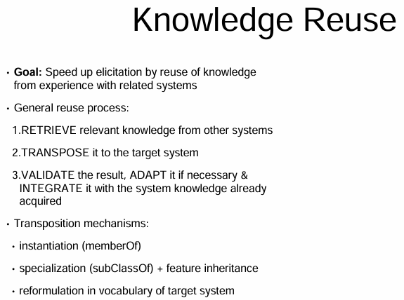
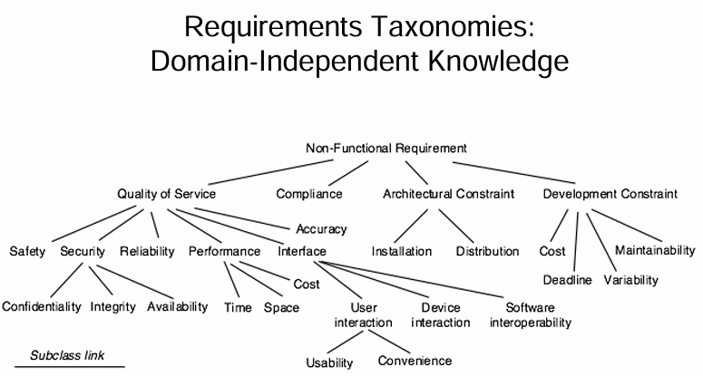
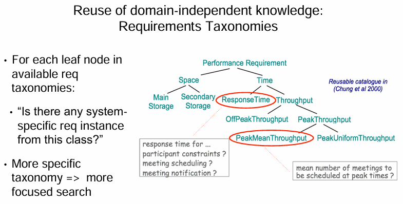
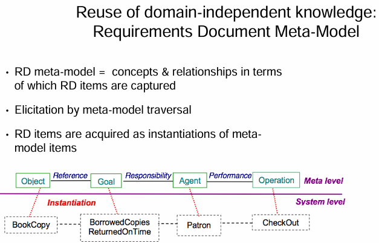
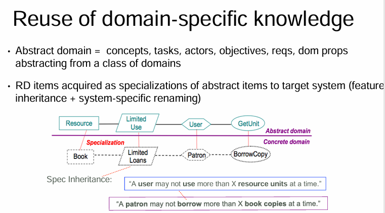
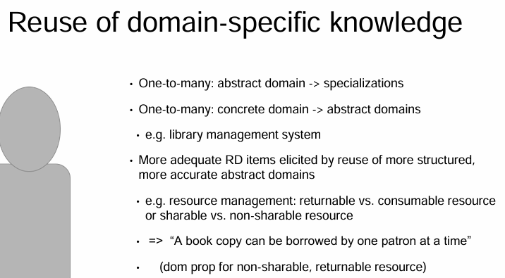
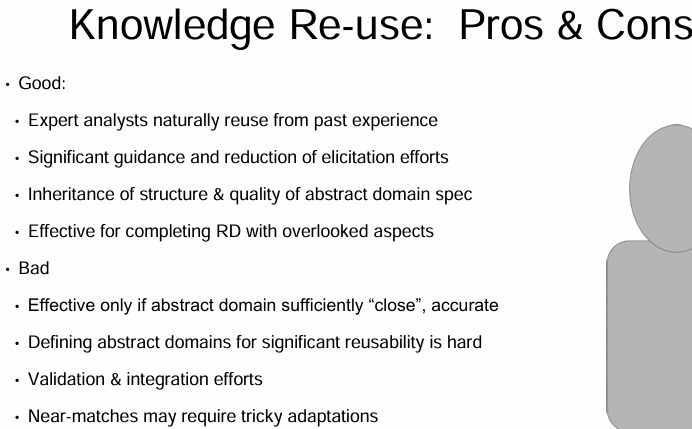
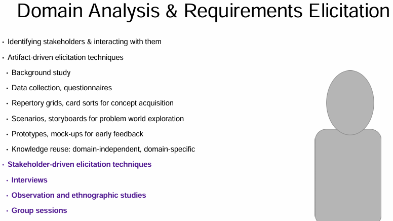

<!-- vscode-markdown-toc -->
* 1. [Knowledge Reuse](#KnowledgeReuse)
	* 1.1. [Knowledge Reuse](#KnowledgeReuse-1)
* 2. [Meta-Model Usage and Reuse Pros and Cons](#Meta-ModelUsageandReuseProsandCons)
	* 2.1. [Meta-Model Usage and Reuse Pros and Cons](#Meta-ModelUsageandReuseProsandCons-1)
	* 2.2. [Reading Inferring declarative requirements specifications from operational scenarios](#ReadingInferringdeclarativerequirementsspecificationsfromoperationalscenarios)

<!-- vscode-markdown-toc-config
	numbering=true
	autoSave=true
	/vscode-markdown-toc-config -->
<!-- /vscode-markdown-toc -->

##  1. Knowledge Reuse

###  1.1. Knowledge Reuse

A last method of **artifact driven elicitation** is **knowledge reuse**. 
- Systems are rarely conceived from scratch. 
- Requirements, engineers and stakeholders tend to reuse knowledge from past experience with other systems that are related to, well, what they know.
   - Such knowledge may refer to the host organization, to the domain in which the problem is rooted or to the kind of problems that were experienced with similar systems. May also relate to the kind of requirements that need to be considered for addressing such problems.
   - As we gain knowledge we can **transpose our systems**. Transposition can be achieved through mechanisms like looking for opportunities and instantiation, specialization and feature inheritance.
   - We can also try to reformat the vocabulary from the old system into the target system.

And we'll see some examples of this through this lesson.
Once you've retrieved existing information and transform that information from the existing system to the new system, you should then validate the result and adapt it if necessary.
And then integrate. Integration is always the fun part.

Adaptation and integration may require further elicitation and like everything else we have talked about in this lesson, you should be doing this in an iterative matter.

**Knowledge about similar organizations, domains and problem worlds helps us to reuse requirements, reuse assumptions, reuse domain properties and more.**

There are different types of reuse depending on the domain properties.

Requirements taxonomies exist from many different domains to help us with our identification.
For example, to thoroughly think about the needed nonfunctional requirements in the system. Consider this nonfunctional requirements taxonomy that you see here. Nonfunctional requirements are the ities of our work.
Things like security, usability, so on and so forth. They define the way that the software should be,
will satisfy the functional requirements. Or it also gives some ideas about the way that it should be developed.
For example, the diary constraints of a participant may not be disclosed to any other invited participant.
That's a pretty loose example. But there are a wide range of such constraints that make it helpful to classify them into a taxonomy.
Taxonomies list specific classes to help us then characterize precisely for the product that we need. They help us think of corresponding classes that might usually be overlooked.
Note that this example right here is only a subset of a full taxonomy.

For each node, well actually, for each leaf node in an available requirements taxonomy, ask yourself, is there some requirement from this class that's in my system?
In our meeting scheduler project example, we might look at all points in the system where responses are required in reaction to some kind of input stimuli.
One example there would be the average response time.
In thinking about response times, you might elicit assumptions about if there are particular average response times for getting the constraints from the participants.
Are there required or desired response times for, once we have the constraints, for getting the meeting scheduled? Once the meeting's scheduled, what about when the notification for the meeting is given?
Each of these questions focuses on the nonfunctional requirement of time.
By focusing on these sorts of questions early, you may also think of more functional requirements and also some alternatives for those requirements.
For example, if we want to get a meeting notification quickly, first, getting a meeting notification quickly is, yes, it is a requirement. But what does it mean? It's not measurable.
If you need it very quickly, say in five minutes, the notification might be sent by email, and might be sent by text.
If you have a little bit of extra time to get the meeting notification out, you could leave that out of the system pretty much entirely by you running down the hall.
It all depends.
Focusing on non functional requirements early, allows us to consider alternatives.
Requirements taxonomies can be expanded with domain-independent knowledge, and also, domain-dependent knowledge. Thinking on how specific requirements classes can be refined, and see how those requirements classes could conflict with each other.
Conflicts will happen, these are just big models. But they're helpful in making us think.

##  2. Meta-Model Usage and Reuse Pros and Cons

###  2.1. Meta-Model Usage and Reuse Pros and Cons

 

Reuse of a metamodel is another form of domain independent reuse. Meta-modeling is the construction of a collection of concepts, where those concepts are things terms and stuff. Here we see an example. In this case, we're acquiring knowledge about the organization or about the target system as an instantiation of the elements within the model. It helps us figure out which questions to ask and also sort of when we should ask them. For example, if the organization is modeled in terms of actors, tasks, resources and dependencies, then the metamodel will contain metaclasses where those metaclasses would mimic our scenario, actors, tasks, resources and dependencies. In this example, we're looking at a metamodel that helps with systems that can be modeled in terms of objects, goals, agents and operations. A metamodel like this could be used to describe part of the library checkout system. The object is a book copy. The goal of the requirement is to ensure that the borrowed book copies are returned on time. The agent is the patron and the patron, the responsibility is that the patron is checking out the book. This is a very simple example, but it demonstrates how mental models can assist us in asking many of the necessary questions, and start to firm up terminology in our own minds. By following metamodels we answer the who, what, when, where and why questions for each requirement and likely think of more. 

The idea is to reuse some abstraction of the domain. These elements of the abstract domain are defined once and for all. We then elicit portions of our system as specializations of those abstract elements. For example, in a library management system, an abstraction of a library management system domain might be the domain of resource management. Makes sense. From them, we can then specialize abstract elements like what is limited use. In the concrete domain, limited use might be defined as limited loan's of loanable items, or we might have other ideas about. If we assume that there are limited loans of loanable items, from that we can elicit from the stakeholders what is a limited loan, how long is a book allowed to be taken out, is a book in general, a book, a loanable item. Does it also include movies music etc? Is there stuff in the side that is not allowed to be taken out? What is a limited loan? Another example of a derive requirement about limited loans, might be that a user may not use more than X resource units at a time. It's up to us to determine what a resource unit is. We have to ask our customers what X is. As another alternative, we might determine that a patron may not borrow more than X book copies at a time. With these, we can expand our requirements knowledge. 

The same abstract domain may have multiple specializations, and a concrete domain may specialize multiple abstract domains. For example, when using a resource management meta domain that say could be applied to a library management system, or let's say a library loan management system, the meta domain that we're using could apply to that library loan system, it could apply to maybe a video store management system, or it could be applied to flight or concert seat allocations. On the other side, loan management could relate to resource management. Book acquisition could relate to E-shopping models. Patron registration could relate to group membership management. To increase the adequacy of reuse knowledge, the abstract domains should be made more structured and more accurate. For example, in a resource management setting, we might distinguish between returnable versus consumable resources. We might also compare between shareable items versus non shareable items. From this clarification of definitions, we can get specific domain property stating things like- let's see, for example that a book copy can be barred by one patron at a time. We have a book copy, we have a patron, they can get one. This clarifies the resources that can be loaned and exactly what's expected. Now, do keep in mind that when you are writing your requirements, you also need to think about what is a patron, what is a book copy, are all treated equally. 

Elicitation effort however can be slightly reduced when the target system is sufficiently close to node systems being reused. Reused knowledge fragments may codify high quality requirements engineering done in the past. When you reuse this knowledge, reuse these taxonomies and this metadata. These can lead to better quality results through the guided processes. On the annoying side though, it can be very hard to find the right abstractions. And it's also challenging to structure them and specify them appropriately for reusability. When you're composing for multiple domains, there are usually consistency and compatibility problems, know that. One of the biggest traps though, is as easy to spend way too much time validating the inappropriate features and performing tricky adaptations. We'll look at these models and say but if this would just fit. Really take a step back and ask yourself, can the square peg fit in the round hole. Sometimes easily, sometimes not.

###  2.2. Reading Inferring declarative requirements specifications from operational scenarios
[LINK](http://citeseer.ist.psu.edu/viewdoc/summary?doi=10.1.1.123.6403)

We learn, find patterns, and revise.  In this paper you'll read about moving scenarios into stronger forms.  

"Scenarios are increasingly recognized as an effective means for eliciting, validating, and documenting software requirements. This paper concentrates on the use of scenarios for requirements elicitation and explores the process of inferring formal specifications of goals and requirements from scenario descriptions. Scenarios are considered here as typical examples of system usage; they are provided in terms of sequences of interaction steps between the intended software and its environment. Such scenarios are in general partial, procedural, and leave required properties about the intended system implicit. In the end such properties need to be stated in explicit, declarative terms for consistency/completeness analysis to be carried out. A formal method is proposed for supporting the process of inferring specifications of system goals and requirements inductively from interaction scenarios provided by stakeholders. The method is based on a learning algorithm that takes scenarios as examples/counterexamples and generates a set of goal specifications in temporal logic that covers all positive scenarios while excluding all negative ones. The output language in which goals and requirements are specified is the KAOS goal-based specification language. The paper also discusses how the scenario-based inference of goal specifications is integrated in the KAOS methodology for goal-based requirements engineering. In particular, the benefits of inferring declarative specifications of goals from operational scenarios are demonstrated by examples of formal analysis at the goal level, including conflict analysis, obstacle analysis, the inference of higherlevel goals, and the derivation of alternative scenarios that better achieve the underlying goals. Index Terms—Scenario-based requirements elicitation, inductive inference of specifications, goal-oriented requirements engineering, specification refinement and analysis, lightweight formal methods. "

