<!-- vscode-markdown-toc -->
* 1. [Stakeholder Elicitation: Starting Interviewing Techniques](#StakeholderElicitation:StartingInterviewingTechniques)
	* 1.1. [Stakeholder Elicitation: Starting Interviewing Techniques](#StakeholderElicitation:StartingInterviewingTechniques-1)
	* 1.2. [Reading Stakeholder Elicitation: Starting Interviewing Techniques - Slides](#ReadingStakeholderElicitation:StartingInterviewingTechniques-Slides)
* 2. [SAMOSAs - Leading to Meeting Effectiveness](#SAMOSAs-LeadingtoMeetingEffectiveness)
	* 2.1. [SAMOSAs- Leading to Meeting Effectiveness](#SAMOSAs-LeadingtoMeetingEffectiveness-1)
* 3. [Interview Pros and Cons](#InterviewProsandCons)
	* 3.1. [Interview Pros and Cons](#InterviewProsandCons-1)
* 4. [Guidelines for Effective Interviews](#GuidelinesforEffectiveInterviews)
	* 4.1. [Guidelines for Effective Interviews](#GuidelinesforEffectiveInterviews-1)
	* 4.2. [Reading Guidelines for Effective Interviews - Slide](#ReadingGuidelinesforEffectiveInterviews-Slide)
* 5. [Observation and Ethnographic Studies](#ObservationandEthnographicStudies)
	* 5.1. [Observation and Ethnographic Studies](#ObservationandEthnographicStudies-1)
	* 5.2. [Reading Observation and Ethnographic Studies - Slides](#ReadingObservationandEthnographicStudies-Slides)
* 6. [Combining Techniques](#CombiningTechniques)
	* 6.1. [Combining Techniques](#CombiningTechniques-1)
	* 6.2. [Reading Combining Techniques and Conclusions - Slides](#ReadingCombiningTechniquesandConclusions-Slides)

<!-- vscode-markdown-toc-config
	numbering=true
	autoSave=true
	/vscode-markdown-toc-config -->
<!-- /vscode-markdown-toc -->

##  1. Stakeholder Elicitation: Starting Interviewing Techniques

###  1.1. Stakeholder Elicitation: Starting Interviewing Techniques

To obtain adequate, relevant information about the organization, domain, and problems that are currently happening with the system as it is. 
Direct interactions with the owners of such info proved to be invaluable. 
Such interactions may be organized according to specific protocols. And we're going to review a couple of techniques here.

These techniques are going to include:
- interviews,
- observation, 
- ethnographic studies, and also 
- group study settings.

- Interviews: 
  - one of the key ways to elicit knowledge from your stakeholders. 
  - one of the most challenging tasks to do efficiently and effectively. 
  - Given all of the domain knowledge, you now need to identify appropriate stakeholders and create good, clear questions to ask.

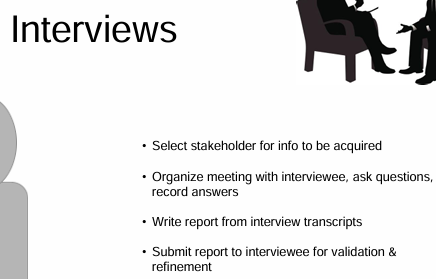

Stakeholders may include: domain experts, managers, sales people, end users, consultants and more.
- One question to start asking first is **who is going to be using the program most**?
- Another good question is **who's paying you**? What do they care about? The people who are using it most, are likely the stakeholders that you want to use to make up the majority of your interviewers. All the others should also be represented. And this will give you a bigger view of the overall project. 
- Focus first on the information that needs to be acquired.
- Then collect that information on the stakeholder roles as you understand them.

Organize meetings with the interviewees and be sure to record all of their answers. It's also helpful if the interviewee is willing to look over your report, and refine it.
- if they give their feedback, and they really care about the product, then that will really help you, and it'll give you extra information. Always remember when doing interviews that you should be protecting the customer's time as well as your own.

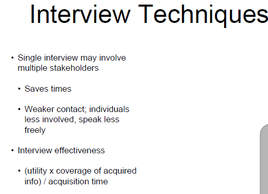

In order to help save time, a single interview may involve multiple stakeholders. By talking with multiple people at once, you can get multiple views and a get a valid view of the project. This may also reveal conflicting views and conflicting interests or extended interests.

When you pull this all in, it needs to be balanced carefully.

When you're interviewing multiple people at the same time, this can mean that there's weaker content that you've really get out.

- **Individuals tend to be less involved in big group meetings**, and they may also speak less freely. .
- if stakeholders realize that their ideas may be conflicted with others in the room. Then they may stay totally quiet and be less willing to put forth their views.
  - Conflicts can arise because of maybe business political issues. Like say, if I say this and my boss hears it, my boss is sitting right there. I'm going to get in trouble.
- Remember that it's scary to talk in front of other people.

So we need a balance between multi-purpose interviews versus single. There are benefits to both types of interviews with single and with multiple stakeholders. It can lead to good discussion or it could also lead to a single sided argument. We've also probably all been in those meetings where one person takes control and there goes the entire conversation. And then you quit paying attention and it's just like please, will they stop? As a moderator, as the mediator of an interview, if the discussion gets off topic, watch the time. See how long you've actually been talking about a certain question.

Jump in if you're spending too much time in one area.

If someone starts to take over the conversation, wait until there's sort of a break and then ask some kind of question of the others to see if there's more input. Keep everyone involved.

Always watch all of your interviewees interactions and reactions.

If someone's talking, one single person is talking for more than say, one or two minutes it very likely that the others are going to zone out and just go when is this going to be over. They're less inclined to participate and you need keep the meeting focused. Keep the interview focused.

**The effectiveness of an interview can be measured by a weighted ratio between the utility and the coverage of the required knowledge.**

Look at how much you actually got that was useful. And then compare that to the time needed to acquire that information.

##  2. SAMOSAs - Leading to Meeting Effectiveness

###  2.1. SAMOSAs- Leading to Meeting Effectiveness

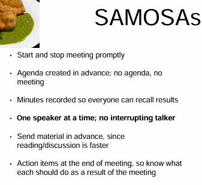

- Meeting effectiveness can also be increased by the idea of Samosas. This is actually an acronym used in software engineering and we have the joke that:
"If you don't like samosas, you could go with mimosas." 
- Samosas has a very clear meaning of how we work through a meeting. This also applies to our interviews. When you start an interview:
  - first, start it on time. Also, have a set end time, know when you need to end. Relay both of these concepts to the interviewees. We're all busy. So, have a very clear agenda of what needs to be covered and what needs to be accomplished during that interview. 
  - Also, remember that it is utterly unsatisfying to end a meeting realizing you're out of time but nothing has been decided or done. I've been in so many meetings personally where we walk away and at every single agenda item was, we're going to table this to another time. Three months later it came back again and it just kept happening. So, make sure you are actually making progress. 
  - In such situations, you will also have dominant people in the conversation. Watch their facial expressions and watch the reactions in those facial expressions of everyone in the group. As a mediator, ensure that there is only one speaker at a time. Don't have people talking over one another. Also, watch not just one person takes over the conversation. 
  - If other interviewees are nodding along and actually interacting then, they're likely okay. But make sure that they are still engaged in the conversation. 
  - If they're constantly typing on their laptops or making, "Oh, my goodness, please let me out of here," faces, then you probably need to move things along. 
  - Either it's not interesting to them or they just feel left out. When you come up with your list of what you want to cover in the agenda you can also sign questionnaires or that list of topics that you want to discuss in advance. This will allow your interviewees to prep in advance at least a little bit. 
  - Let them think about the big questions that you intend to discuss. 
  - Lastly, you can send a list of what was discussed or your overall action items to the interviewees after the meeting. 
    - This will allow them to review how you interpreted the material and correct errors or clarify ideas. 
    - Another place where this helps is when your interviewees have either thought about it more and then said, "Oh, I wish I'd said this during this meeting. But here's what I actually thought," or, it can also get around the, "This person was talking the entire time. I didn't get to say anything, here's what I thought." And other situations like that. Also, just sending out that list of responses on an individual level or on a group level, lets you say, "Hey, I did listen, here's what I heard, let me know if you have any feedback." Even if you get no response, your interviewees will likely appreciate it.

##  3. Interview Pros and Cons

###  3.1. Interview Pros and Cons

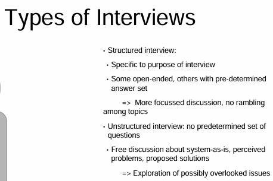

Interviews can be covered in structured or unstructured ways.

The full concept of samosas usually is linked more with structured interviews.

- In a structured interview,:
  - **have predetermined set of questions** and, thus, have a s**pecific purpose of the interview**. 
  - **Have some open ended questions ready** and some others. 
  - **have a predetermined answer set**. 
- Keep your stakeholders in mind as you write, so that the questions are actually appropriate for them.
  - Go back to all the domain knowledge that we've been talking about. And what experience you've gotten in order to figure out good questions to ask.

**Structured interviews allow you to lead a more focused discussion and they help you to keep the meetings on track.**

- In an unstructured interview:
  - **no predetermined set of questions**, but you should have a goal. Please don't go into a meeting and say let's talk about the product, and have that be all you have.
  - you have the idea of having free discussion about the system as it is, the perceived problems, proposed solutions for the system to be.
  - what do you want, what do we need?

These open discussions help us to explore the full system and also help us, perhaps, to notice overlooked issues and start to question them.

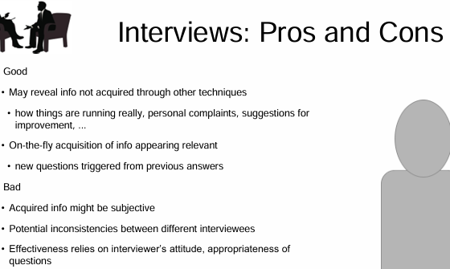

- Interviews may reveal info that's not required through the other techniques.
- And interviews can also show how things are actually running.
- Also, people will put forth complaints, likely give suggestions for improvement, and much more.
- Interviews can also help you to identify relevant information that could be further elicited.

Unstructured interviews, especially, allow us to **find new questions triggered from the previous answers**. Again, use the combination of structured and unstructured interviews, in order to achieve this goal.

Now, one bad thing about interviews, is that the acquired information might be subjective.
- It's overall hard to assess.
- This is always a challenge when we're dealing with just natural language versus, say, grading on a questionnaire that is quantitative.
- There also may be potential inconsistencies between the different interviewees.
- Effectiveness critically relies on the interviewer's attitude, and the appropriateness of the questions.

**Remember that and plan early, given your knowledge. Again, don't waste your customer's time or yours.**

When doing a structured interview, try now to just read from a checklist, rather, engage your customer.

##  4. Guidelines for Effective Interviews

###  4.1. Guidelines for Effective Interviews

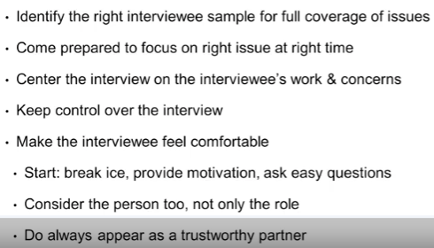

Lastly, here we have some more guidelines for effective interviews. Remember the goals that are based on the pros and cons that we've just discussed. Identify the right interviewee sample for full coverage of issues. You shouldn't just have all end users who use the product in the same way. You shouldn't have all managers. Pick out a good sample range between all of your proper stakeholders. Again, and I can't emphasize this enough. Come prepared to focus on the right issue, and also so that you can focus on the right issues at the right time. Start by getting the customer very interested. 
- Center of the interview on the interviewees work and their concerns. By centering your focus in that way, they're more likely to open up and talk to you and say, this is what we actually do, and really work you through it. If you're working specially in a multi-customer scenario, keep control over the interview. You want everyone to be engaged and every one to be contributed. Also, make the interviewee feel comfortable. Sometimes that may include, Hey I brought some MOSIS to our meeting. Other times, it's just asking questions and showing that you really care about their job and you want to know about what they do and how they do their work. Break the ice, provide some motivation, ask some easy questions. 
- Consider the person overall, not just the role. Also, always appear as a trustworthy partner. This is critical that your customers know that you are not judging them, you are not looking at them in any weird way, you just want to know what they want and why they want it. Your interviewees have different responsibilities, different expertise, different tasks, and different exposure to problems. 

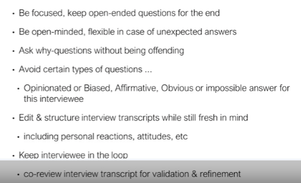

Do your background study first, then, pre-designed some sequence of questions for the interview. Stay focused. Plan. Keep most of the open ended questions for the end. If new questions come up during the interview, then I would suggest writing them down and asking them at the end. 
If they're quick to answer sorts of questions then you can ask them that, but if it's going to distract the conversation, write them down, remember, and add to the end if possible. Keep your priorities straight. Also, be open minded. You may get answers that you do not expect at all. 

Also, ask why a lot, but do be careful not to ask why, in a offending way. 
- For example, let's say the curious tone of, huh? That's okay, that's very interesting, why would we be wanting to do this. 
- That's versus the, Huh? Why would you want that?-tone. Yeah, don't you that one. You might also have more of the learning tone of, Oh, I don't really understand, could you please explain further? Okay, we're having trouble explaining this, could we draw it out? You might draw it, they might draw it, etc., at any weight, avoid offense. 

Additionally, try to avoid questions that are opinionated, or biased, affirmative, or ones that are obvious, or impossible answers. Your opinion does not really count in this situation. You don't want to lead the witness at this point. You can suggest some ideas, but be careful, you want most of the information to actually come from them. Time is limited, so also be careful of those affirmative or obvious answers. If it's an impossible answer, on one, you might not realize that, but, If you leave those toward the end of the interview, then there's time to try to talk out with the interviewees, and see if you can make the situation not impossible. Just like when writing a paper, edit, structure, outline. Edit, structure, and outline your interview. Give your interviewees notifications of the topics to be discussed. Record the results close to the end of your meeting. If you wait too long, you're going to forget it. If you write them right away, you can also include in your notes some of the personal reactions, and the attitudes that your customers had. Lastly, try to keep the interviewee in the loop. Of course, when you're keeping them in the loop you might want to leave out some personal reactions at that point, like, this person sneezed right here; we don't care and they don't need to know that we notice they seized. However, go and review the transcript of your interviewee and send that to them, to try to get some validation. Record the necessary parts for the main SRS documents. Most of the time, you won't get to double check your work with the stakeholders, but, it's worth a try, and many will appreciate it to know that their time was spent well. You did hear them, and you are moving forward.

##  5. Observation and Ethnographic Studies

###  5.1. Observation and Ethnographic Studies

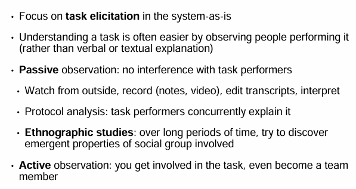

This next technique is based on the premise that you're trying to fully understand the task as it is right now.

This technique is a combination of observation and possibly ethnographic studies.

In observation and ethnographic studies, you're sitting down and watching the performance of the task.

This is the opposite, but complementary of the interviews or questionnaires that you've already done.

Rather than having a verbal or textual explanation, you're watching.

This is helpful because, for example, let's say we were trying to figure out how someone ties their shoe.

Okay, you do this, you do this, you go through the bunny hole.

Here's what I mean by let's go through the bunny hole.

In the observation, we're actually watching it and having them explain it verbally.

Observation can be done passively or actively. Or you could do a combination.

In **passive observation**, the idea is that you just watch.
- You are not interfering in any way with the task performers. You also aren't stalking them, they know that you're watching. But you're watching away from the customer and recording notes or maybe videoing how they record through a task.
- Then, you go back and write and interpret this data later.
- You might also do this by just sitting next to the person and having them go through the task.
- Big point there is, though, that you aren't interrupting.
- You may ask them to concurrently explain their process as they do it. In a combination between passive observation and active observation, you might also ask small questions that don't throw them off. But, you kind of want to avoid it. Keep passive observation separate.
- Don't distract them, just see what's normal.

Passive observation is especially useful when the task is something that your unable to participate in.

For example, if I were writing software to simulate, let's say, a professional baseball game. It'd be pretty awful if I had to go out in the field and try to play along with them. I'd be in the way, I'd break up the normal interaction and I'd probably get hit in the head with a ball or with something else. There are many other reasons, but we're going to stop right there. The same goes for if I were trying to write some flight simulation software, say, based on fighter pilots.

Passive observation on their interaction with the plane and with the software would be needed, preferably, with ongoing explanations as they work through their process.

Some studies also require long periods of time.

These are known as ethnographic studies.

An ethnographic study is a type of **observation that allows you to watch and observe emergent properties in situations between different people over time**.

In active observation, you get involved with a task and may even become a team member.

So, if you want to try your hand at pro sports and are doing baseball software, here's your chance. I'm totally kidding. Don't do that. But, while this helps you understand the process more, at becoming a team member, actually interacting, helps you understand the process more.

Its often not possible. Or, you could be getting in the way.

Having somebody sitting next to you even may get in the way of just normal activities.

So, a combination of passive and active observation could involve you watching the user, and actively asking questions and getting their feedback as they explain.

Or, that may mess them up a bit. Use a combination.

A lot of what we do on a daily basis is just habit or muscle memory.

We may not even realize what we're doing or that it's important.

For example, I need to print this document before I move to the next step.

Or I need to send this email to five different people, I already have a list. I don't have to worry about who those people are, it gets filled in by my email.

By watching and just watching, you can start catching these things and start to figure out what's missing in the process that you haven't learned about.

In your observations, think about task performance, think about attitudes, about reactions, about gestures, and look at the facial expressions. People will let you know if they're unhappy or frustrated.

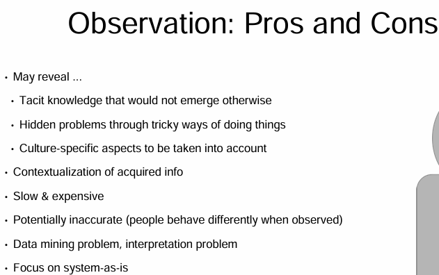

Through all of this, observation may help reveal tacit knowledge that would not be revealed otherwise.

You can also identify hidden problems in the existing software. That are brought out by when there are tricky things that need to be done in order to accomplish the task.

When observing multiple people, especially, you may note that there are culture specific aspects of how tasks are tackled.

- Unfortunately, observation does take a lot of time.
- It may need to be done over long periods of time amongst different groups. Like in an ethnographic study.

Observation may also need to happen at different times.

Like say, one process only happens in the morning. One happens in the evening. One happens at 3 am.

They gotta deal with each of those.

Situations also change under different workload conditions.

Are people's actions changing in those situations? When does it need to be done? What are the requirements?

##  6. Combining Techniques

###  6.1. Combining Techniques

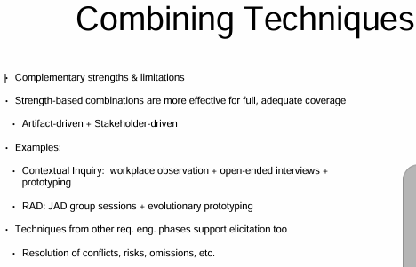

In this course we have covered many techniques for artifact-driven elicitation and stakeholder-driven elicitation, in addition to seeing how that ties into the software development life cycle. 

**Remember that one single technique will not do the job. **

All of the techniques should be combined in some way to gain knowledge of the system that was and the system to be. Each technique has its own strengths and limitations, given the environment in which you're working. For example, in contextual inquiry, you can use a combination of workplace observation, open-ended interviews, prototyping, and possibly more. 
In software development life cycles like RAD which stands for Rapid Application Development, these are helped by adding in JAD. JAD, again, is Joint Application Development. For RAD add JAD, plus group sessions, plus evolutionary prototyping to be successful. In agile software life cycles, or ones that are similar to agile, storyboarding and determining use cases are also quite key. In all of this elicitation, your goal is to determine what your customers actually want and need. 

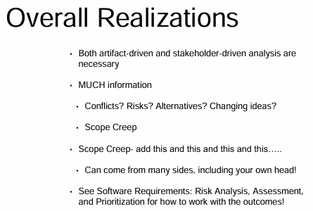

While combining these processes, you are also working to resolve conflicts, start to determine risks and try to get a sense of things that can be omitted or modified. Scope creep is a big danger. Scope creep is the idea that stuff is being added into your project that doesn't actually need to be there. And it can be done by the developers, or, more likely, your customers. Scope creep occurs more and more as discussions occur. People start to get excited. As they get excited, they'll talk about things that they'd like to see, but that isn't actually necessary. Note these for prioritization. Your stakeholders will talk about solutions that may not be feasible, given the environment, budget, or technology. Keep these points in mind for your risk analysis. If working with developers at the same time, you can also run in this scope creep. Developers can say, oh, well, this will be really cool, I can add this in five minutes. We all know how that goes. Five minutes goes to one month later. Huh, that didn't actually work. Or it could also be something that the customer really didn't even want. So be careful on both sides as you consider your options. Keep asking yourself what does the customer really need. Keep track of all the elicited material in an organized way. Also, note priorities as you go. Scope creep leads to delays and budget issues in many cases. And it's one of the reasons that projects completely fail. Now that we've talked about techniques for determining the overall requirements as well as some of the lesser requirements, next steps in our software requirements specification development include organizing all of these requirements. First, we need to analyze the requirements for risk and prioritization. Then, we need to figure out how to write them. How do we organize them into a software requirement specification to document. This document would be used by designers, developers, testers, and can be involved in business negotiation. Lastly, we need to remember to manage the requirements in terms of motives, risks, alternatives and always be prepared for change. Customers always change their minds. These topics are all covered in the other courses in the specialization, on secure software requirements and specifications.

