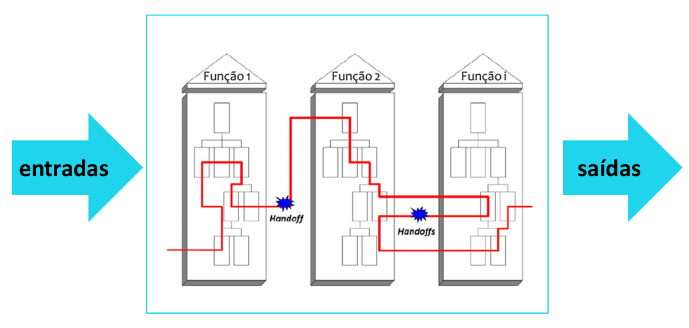
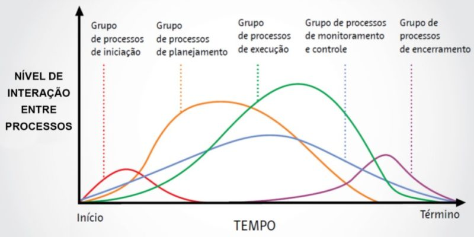

## Módulo 2 – Gestão de processos

Este módulo aborda:  
- a importância da gestão de processos e dos aspectos de padronização e melhora de processos organizacionais, 
- a importância dos indicadores, além do modelo plan, do, check, act (PDCA).

**PDCA**
- Ciclo de melhoria baseado no método científico de se propor uma mudança em um processo, implementá-la, analisar os resultados e tomar as providências cabíveis. 
- Também conhecido como Ciclo de Deming ou Roda de Deming, pois quem introduziu o conceito no Japão, nos anos 1950, foi W. Edwards Deming. O ciclo do PDCA tem quatro estágios:
   1. Planejar (plan): determinar os objetivos para um processo e as mudanças necessárias para alcançá-los.
   2. Fazer (do): implementar as mudanças.
   3. Verificar (check): avaliar os resultados em termos de desempenho.
   4. Agir (act): padronizar e estabilizar a mudança ou iniciar o ciclo novamente, dependendo dos resultados.

## Unidade 1 – Definição e identificação de processos

- **processo**: um conjunto de atividades e tarefas numa sequencia específica para transformar **entradas** (inputs) em **saídas** (outputs) que agreguem valor aos receptores, clientes do processo.
  - um conjunto de atividades inter-relacionadas ou interativas que transformam insumos em produtos.
- Tres tipos
  - Primários: levan o produto final ao cliente referenciados como processos essenciais ou finalísticos.
  - De apoio: suporte a processos primários, mas também podem ter a mesma utilidade em outros processos de suporte (de segundo nível, terceiro nível e sucessivos) ou ainda em processos de gerenciamento. Como entregam valor para outros processos, são interfuncionais e estratégicos, pois subsidiam a operação primária.
  - De controle: têm o propósito de **medir, monitorar, controlar atividades** (os primarios e de apoio) e administrar o presente e o futuro do negócio. 

**Gestao de Procesos**
- Processos podem ser executados por pessoas e máquinas.
- Da a visao de Ponta a Ponta: e.g. Entra Requisitos de Barcos -> Sai Barco
- HandOff: é o processo de passar informações ou responsabilidades de um funcionário ou departamento para outro, ou seja, uma passagem de bastão
- Ajuda aumentar eficiencia reduzir "espaõs em branco" i.e. tarefas que se chutam entrem times e ninguem quer pegar.
  - Eficiencia: Capacidade de executar melhor seus processos otimizando seus recursos.

- Os processos dentro do sistema tem que ser mapeados. Para poder ser analisados posteriormente.

## Projeto
- Projeto: Esforço temporario para criar um produto, serviço ou um resultado exclusivo.
- Tem inicio e fim.
- São compostos por 5 grupos de processos:
  1. Iniciação
  2. Planejamento
  3. Execução
  4. Monitoramento e Controle
  5. Encerramento

Na figura:
- Planejamento é maior no inicio
- Execução acentuada no meio do projeto.
- Melhor planejamento menor retrabalho.
- Qualidade é Controle
- "Qualidade involve Controle, quem nao mede nao controla quem nao controla nao gerencia"

## 1.1 Gestão por processos
- Gerenciamento de processos facilita a análise e melhoria. Alem disso da pra utilizar abordagens  de arquiteturas processuais.

### Migração da gestão de processos para a gestão por processos

**Gestão DE Processos VS Gestão POR Processos**
- Gestão de Processos: Gerir (mapear, redesenhar e melhorar) individualmente 1 processo.
  - Propósitos:
    - Aumentar a eficiencia a eficacia dos resultados. Para isso precisamos de **monitoriar e controlar**.
- Gestão POR Processos: Estrutura, organiza, melhora e controla uma organização a partir dos seus PROCESSOS.
  - Melhora a interface entre as áreas (times) de uma empresa.
  - Proveer uma estrutura de coordenação e controle para cada processo, com responsabilidade e prestação de contras sobre o desempenho.
  - orientar o uso de sistemas de informação.
  - orientar a criação e a organização de documentação normativa.
  - mapear e definir competencias requeridas para os colaboradores 
  - facilitar a alocação de recursos e a definição de orçamento a partir do entendimento das necessidades.

**Comparativo GDP vs GPP**
- GDP: Foco na eficiencia (executar determinado processo)
  - GPP: Foco na eficiencia e na eficacia. Aquele processo como ajuda na eficacia do projeto ou seja o impacto desse processo num todo
- GDP: Enfase na tarefa.
  - GPP: Enfase no todo no output final.
- GDP: Foco nos facilitadores
  - GPP: Cliente figura decisiva. O fim justifica os meios.
- GDP: Menor relevancia no cliente. O que importa é otimizar o proceso.
  - GPP: Maior relevancia do cliente.
- GDP: Arquiteturas bem definidas todo mundo sabe que fazer em cada processo.
  - GPP: O foco é no output gerado e como ele vai mudando em cada processo.

### Análise, desenho, gerenciamento do desempenho e transformação de processos
"Os Processos devem estar alinhados com a ESTRATEGIA"

Video: 19:00

- A gestão de processos de negócio: é foca na melhoria dos processos operacionais.
  - é uma metodologia de gestão criada para identificar, desenhar, executar, documentar, medir, monitorar e controlar processos de negócio, sejam eles automatizados ou não.

- A abordagem por ciclo de vida de processos visa aprimorar os processos operacionais de uma organização. Ela é composta por várias fases interconectadas que abrangem desde a identificação até a melhoria contínua dos processos.

- **Alinhamento de estratégias e metas**
  - alinhar os processos de negócio com as estratégias e metas organizacionais. i.e. quais processos são essenciais para alcançar os objetivos estratégicos da empresa?
  - Isto inclui:
    - **identificação dos objetivos estratégicos** da organização;
    - **mapeamento dos processos existentes** para entender como eles contribuem para as metas estratégicas;
    - **identificação de lacunas** entre os processos atuais e os requisitos estratégicos;
    - **seleção dos processos-chave que precisam ser melhorados** ou redesenhados para melhor suporte à estratégia.

- **Arquitetar mudanças**
  - projetar as mudanças necessárias nos processos de negócio para alinhar-se com as estratégias e metas identificadas. Isso pode envolver redesign, otimização e redefinição de fluxos de trabalho.
  - Isto inclui:
    - **redesenho dos processos** para atender aos objetivos estratégicos;
    - identificação de **oportunidades de automação** e simplificação dos fluxos de trabalho;
    - criação de um **plano para implementar as mudanças** nos processos;
    - **definição de novos padrões** e fluxos de trabalho que guiarão a implementação.

- **Desenvolver Iniciativas**
  - as iniciativas concretas são desenvolvidas para implementar as mudanças planejadas nos processos. Isso envolve a definição dos detalhes de implementação e alocação de recursos.
  - Isto inclui:
    - **definição das ações específicas necessárias** para implementar as mudanças nos processos;
    - **design detalhado dos novos fluxos de trabalho**, incluindo papéis, responsabilidades e etapas específicas;
    - **alocação de recursos**, incluindo equipe, tecnologia e ferramentas necessárias para a implementação.

- **Implementar Mudanças**
  - as mudanças projetadas são efetivamente implementadas nos processos de negócio. Isso pode envolver treinamento de equipe, configuração de sistemas e ajustes nas operações.
  - Isto inclui:
    - **implementação dos novos processos** de acordo com o plano desenvolvido;
    - **treinamento da equipe sobre os novos fluxos de trabalho e procedimentos**;
    - configuração de sistemas e tecnologias necessárias para apoiar os processos redesenhados.

- **Medir Sucesso**
  - medir o sucesso das mudanças implementadas e verificar se os objetivos estratégicos foram atingidos. Isso envolve avaliar o desempenho dos novos processos e identificar áreas de melhoria contínua.
  - Isto inclui: 
    - **coleta de dados e métricas** para avaliar o desempenho dos processos após a implementação;
    - **(hoje vs ontem) comparação dos resultados** obtidos com os objetivos estratégicos definidos anteriormente;
    - **identificação de áreas** que alcançaram sucesso e aquelas que podem necessitar de ajustes adicionais;
    - **ciclo de feedback contínuo** para ajustar e melhorar os processos ao longo do tempo.

## Unidade 2 – Indicadores de gestão
- são ferramentas-chave para o acompanhamento da performance empresarial. Eles estabelecem a lógica da medição de uma empresa e devem estar alinhados aos objetivos estratégicos da organização.
  - permite claramente uma tomada de decisão baseada em fatos e dados, deixando de lado uma abordagem intuitiva.

Deming: "não se gerencia o que não se mede, não se mede o que não se define, não se define o que não se entende, não há sucesso no que não se gerencia."

### Indicadores de Desempenho
- Pq estabelecer indicadores de desempenho?
  - Mensurar dos niveis de desempenho
    - Da organização: Como um todo, tem boa coordinação entre areas?
    - Dos processos: Processo de financieiro, de back office. Marketing ta dando certo? Produção nao ta dando erro?
    - Do trabalho executado pelas pessoas. e.g: levantamento de requisitos, design e implementação. "Quem faz bem o dever de casa, adoram mostrar para o professor".
      - Estabelecer meritocracia, e recompensas.
- abordagem clara à equipe de trabalho sobre onde devemos chegar e o que esperar dela.
- tomada de decisões para a prevenção ou a correção de problemas 
  - manutenção preventiva e nao corretiva.
  - isso reflete nos custos operacionais.
- adequação de recursos aos objetivos estabelecidos.

- **Abrangencia da Medição** É importante que os indicadores contemplen diversas dimensões importantes para o negocio:
  - Tempo: Rapidez na entrega e na execução e cumprimento de prazos.
  - Flexibilidade:customização de produtos e serviços, atendimento à demanda em flutuações e sazonalidades.
  - Qualidade: taxas de defeito e atendimento às necessidades dos clientes.
  - Custo: Importantissimo, mas, se analisado isoladamente, nao traz a realidade da empresa à tona.
  - Inovação: capacidade de criação de novos produtos e serviços.
  - Segurança: referente aos funcionarios e a todos aqueles com contato com a empresa e com os seus processos
  - Impactos ambientais: item cruxial na analise do negocio de uma empresa e da sua responsabilidade para com o ambiente
  - Governança e etica: enorme importancia recentemente devido À falencia de grandes empresas por lapsos de ética dos seus dirigentes.

Ejemplo: Indice de Insatisfação do cliente. 
- As métricas tem qe estar alinhadas com o objetivo estratético da sua empresa.
- O que vai ser medido deve ser importante para poder ver se alcançamos (ou nao) o objetivo da empresa.
- Uma tabela para listar as métricas a considerar deveria incluir:
  - Nome: e.g. "nivel de insatisfação"
  - Descrição: qual é o objetivo desse indicador e.g. mede quantas reclamações por produtos vendidos
  - Formula: Reclamações/NumTotalDeVendas
  - Unidade de medida: e.g. porcentagem
  - Criterio de acompanhamento
  - Freq. de mensuraçao
  - Responsavel pelo indicador.

**Ejemplos de medições que podem ser utilizadas em processos**
- WIP (work in progress/process): quantidade de trabalho na sua pilha
- Indice médio de conclusao
- tempo de ciclo ou lead time = (WIP/ tempoMedioDeConclusao)
- Variação de demanda
- rendimento de primeira passagem
- tempo de parada
- curva de aprendizagem
- defeitos versus capacidade sigma
- grau de complxidade de tarefa

## Unidade 3 – Padronização e melhoria
- A passagem da produção artesanal para a produção em massa só foi possível devido ao desenvolvimento de sistemas e padrões que tornaram as peças e os componentes intercambiáveis, podendo ser utilizados em processos seriados.
- Existem vários métodos e várias ferramentas para padronização e melhoria: 
  - trilogia Juran, 
  - ciclo PDCA, 
  - gerenciamento da melhoria e da rotina e 
  - ciclo PDCA na análise de problemas.

### PDCA
- pode ser utilizado tanto para o **aprimoramento de um processo quanto para a solução de um problema**.
- Alguns autores o chamam de **MASP**, que significa **metodologia de análise e solução de problemas**, e outros já o chamam **REP** – ou seja, **resolução eficaz de problemas**.

A sigla PDCA (plan, do, check, act) apresenta, de forma simples, quatro etapas que o gestor pode utilizar dentro do seu processo de gestão da rotina de trabalho. 
- PLAN:  
  - são **identificadas as possíveis melhorias ou os problemas que devem ser solucionados**. 
  - são **geradas propostas de solução para esse problema ou para a evolução de processo**, estabelecendo também metas e parâmetros almejados de desempenho.
- DO:
  - **implantação e implementação das ideias geradas e selecionadas na primeira etapa**. 
  - criar um plano de ação para que as ideias possam ser executadas e implantadas.
  - a aplicação das etapas planejadas seja feita mediante um teste piloto. Dessa forma, na etapa de checagem, você terá total condição de controlar e verificar a eficácia da solução.
- CHECK:
  - é verificada a eficácia da solução, ou seja, 
  - é chegado o momento de aplicá-la em larga escala, documentando lições aprendidas e estabelecendo planos de melhoria para o próximo ciclo.
- ACT:
  - Interpretada como aprendizagem, é nesta etapa que a solução é aplicada.

### Evolução histórica do PDCA
- Como o ciclo PDCA é a mais conhecida representação da filosofia do melhoramento contínuo,
- Lean6: DMAIC (a evolução)
- Lean Manufacturing: CAP-DO
  
### Ciclo PDCA e solução de problemas
- A utilização do ciclo PDCA na solução de problemas deve ser dominada por todos na organização, pois promove o tratamento adequado de problemas, a padronização da melhoria contínua e o desenvolvimento de oportunidades.

## 3.1 Adaptação a mudanças

- [LINK](https://www.youtube.com/watch?v=Sfi5P90BR-w&t=10s)

## Conclusão
- A lucratividade de uma empresa é consequência da eficiência dos seus processos. Quanto menos uma empresa falha ou negligencia as suas oportunidades de melhoria, menos custos ela tem e mais satisfeitos ficam os seus clientes.
- a qualidade passou de mera inspeção focada no funcionamento de um produto para ser percebida como estratégica para as organizações.