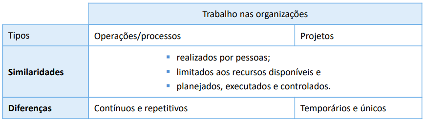

# Módulo 2 – Alinhamento de projetos à estratégia da organização

- como o planejamento estratégico nas organizações tem influência direta no seu portfólio, nos seus programas e projetos. 
- uma vez definida, a estratégia empresarial será usada como referencial para a avaliação, seleção e validação dos projetos que servirão à companhia, podendo esta, inclusive, utilizar um comitê avaliador para tal propósito.

Objetivos:
- entender a relação íntima entre a estratégia das organizações e os projetos que nelas são implementados;
- compreender os benefícios de ter um comitê que avalie e selecione o portfólio de uma companhia.

## Unidade 1 – Processo de planejamento estratégico de uma organização

- O planejamento estratégico ocorre nos mais altos níveis da estrutura das organizações. 
   - Normalmente envolvem o conselho de acionistas, o presidente e os altos diretores, grupo-chave responsável pela revisão da estratégia pré-definida da companhia na frequência devida.

- Tem-se observado que os **ciclos de revisão da estratégia estão cada vez mais curtos nas empresas**, ainda mais se considerarmos ramos de atuação mais competitivos e cambiantes, como é o de Tecnologia da Informação ou de Telecomunicações. 

- Normalmente, o processo de planejamento estratégico pressupõe analisar a empressa tanto interna como externamente:
  - externa: análises além das fronteiras organizacionais, sendo fundamental a compreensão desta imagem do ambiente antes da tomada de decisões ou antes de (re) desenhar ou repensar a estratégia atual. 
  - interna: Além do ambiente externo, fora dos limites empresariais, há o interno ou organizacional, que também merece detida avaliação por parte da empresa.

- Muitas empresas adotam ferramentas como **as cinco forças de Michael Porter** e a **análise SWOT** (ou FOFA, em português) para fazer essa análise de ambiente.

### SWOT 
- A análise SWOT levanta os pontos fortes (S), fracos (W), as oportunidades (O) e ameaças (T) relativos à realidade da empresa em estudo.
   - Os dois primeiros itens, pontos fortes (strengths) e fracos (weaknesses), são fruto da **análise do ambiente interno** que a organização fará de si mesma.
   - As ameaças (threats) e oportunidades (opportunities)** virão do levantamento do macroambiente, do ambiente externo**, ou seja, de elementos de pouco ou nenhum controle por parte das empresas.
- Os pontos de análise são bastante dinâmicos e, geralmente, consequência de fatores demográficos, socioeconômicos, políticos, tecnológicos, etc.

Exemplo numa empresa ABC
Análise Interna:
- Pontos fortes:
   - boa localização geográfica dos pontos de venda;
   - boa qualidade no atendimento percebida pelos clientes;
   - know-how de mercado;
   - renome junto à clientela;
   - inovação tecnológica;
   - receptividade da força de trabalho;
   - vantagens de custo;
   - patentes;
   - flexibilidade em negociações com clientes;
   - líderes compromissados;
   - bons equipamentos;
   - economias de escala na produção;
   - alta liquidez e
   - índices de lucratividade positivos.
- Pontos fracos:
   - recursos humanos desmotivados com a política salarial;
   - propagandas ineficazes;
   - falta de sistema financeiro automatizado;
   - setor de compras burocratizado;
   - distribuição de produtos limitada;
   - pouca força da marca;
   - baixo conceito junto ao mercado;
   - custos fixos elevados;
   - localização não favorável;
   - falta de acesso a fontes de matéria-prima;
   - pouco controle sobre a rede de distribuição;
   - custo final elevado;
   - fragilidade no atendimento;
   - elevado grau de insatisfação em determinado produto ou serviço e
   - alto índice de devolução de mercadorias/mercadorias danificadas.

Análise Externa:
- oportunidades:
   - saída de concorrente forte;
   - incentivos fiscais;
   - potencial aliança estratégica com outra organização;
   - ingresso em novo país (mercado internacional);
   - remoção de barreiras internacionais em novos mercados;
   - afrouxamento de regulamentações;
   - necessidades não satisfeitas do consumidor;
   - aumento do poder de compra do mercado;
   - maior disponibilidade de linhas de crédito;
   - economia aquecida e
   - alterações na legislação (tributária, trabalhista, ambiental, etc.) favoráveis à atividade exercida pela empresa.
- ameaças
   - mercado demográfico em declínio;
   - fornecedor-chave com problemas de liquidez;
   - pouca inovação nas tecnologias de fabricação dos fornecedores;
   - guerra de preços na indústria;
   - mudanças nos padrões de consumo;
   - produtos similares com valor final mais barato;
   - lançamento de produtos substitutos no mercado;
   - entrada de novos rivais no país;
   - redução no poder de compra dos consumidores e
   - instabilidade no mercado financeiro.

- [60% das-empresas-nao-sobrevivem-apos-cinco-anos-no-brasil-aponta-ibge](https://exame.com/negocios/60-das-empresas-nao-sobrevivem-apos-cinco-anos-no-brasil-aponta-ibge/)
  - o que reflete a fragilidade do ambiente de negócios
  - é mais evidente nas empresas de pequeno porte. pq? Alta competitividad, falta de gestão e dificultades financeiras.
  - maior taxa de sobrevivencia é na regiao Sudeste. As piores são norte e centro-oeste.
  - Serviços de baixo custo e nao especializads teve alta taxa de mortalidade.
  - Comercio = Alta Competitividade e Instabilidade do setor 

#### Planejamento Estratégico Empresarial
- [Planejamento Estratégico Empresarial: O Segredo das Empresas que Crescem e Dominam o Mercado](https://www.linkedin.com/pulse/planejamento-estrat%C3%A9gico-empresarial-o-segredo-1f0ef/)
- sucesso não é obra do acaso – é resultado de um planejamento estratégico eficiente.
- o planejamento estratégico é a espinha dorsal de qualquer empresa que deseja crescer, inovar e se manter competitiva no mercado.
- é um **roteiro detalhado que define onde a empresa quer chegar e quais caminhos deve percorrer para atingir seus objetivos**.
- Inclui: análise de mercado, definição de metas, criação de planos de ação e monitoramento constante dos resultados.
- Sem planejamento estratégico, **uma empresa pode até sobreviver por um tempo, mas dificilmente crescerá de forma sustentável**.
  - Pior ainda: ficará vulnerável a crises, concorrência agressiva e mudanças inesperadas no mercado.

##### As 5 Razões Irrefutáveis para Implementar o Planejamento Estratégico na Sua Empresa:
1. Direção e Foco Claro: Empresas sem planejamento vagam sem rumo, tomando decisões baseadas em intuição, e não em dados concretos. Com um planejamento estratégico sólido, todos dentro da organização sabem qual é a visão, os objetivos e como cada um pode contribuir para o sucesso do negócio.
2. Vantagem Competitiva Poderosa: As empresas que lideram seus mercados **não chegam ao topo por acaso**. 
   1. Elas antecipam tendências, 
   2. identificam oportunidades antes da concorrência e 
   3. tomam decisões estratégicas bem fundamentadas.
3. Melhor Uso dos Recursos: Você sabia que muitas empresas desperdiçam tempo e dinheiro simplesmente porque não têm um plano claro? O planejamento estratégico ajuda a priorizar investimentos, eliminar desperdícios e aumentar a eficiência operacional.
4. Adaptabilidade e Resiliência: Vivemos em um mundo de mudanças rápidas e imprevisíveis. Empresas que **possuem um planejamento estratégico são mais ágeis e preparadas para lidar com desafios, crises e novas oportunidades**.
5. Engajamento e Motivação da Equipe: Funcionários motivados são aqueles que sabem que fazem parte de algo maior. O planejamento estratégico cria um propósito compartilhado e aumenta o engajamento da equipe, reduzindo a rotatividade e aumentando a produtividade.

##### Os Passos Essenciais para um Planejamento Estratégico Eficiente:
Se você quer que sua empresa saia da estagnação e comece a crescer de forma estruturada, siga estes passos:
1. Defina a Visão e Missão da Empresa – Onde sua empresa quer estar nos próximos anos?
2. Analise o Mercado e a Concorrência – O que está acontecendo no setor? Quais são as tendências?
3. Estabeleça Metas SMART (Específicas, Mensuráveis, Atingíveis, Relevantes e Temporais) – O que precisa ser conquistado e em quanto tempo?
4. Crie um Plano de Ação Estratégico – Quais são as iniciativas e projetos que levarão ao sucesso?
5. Monitore e Ajuste – O planejamento estratégico não é estático! Acompanhe os resultados, avalie o desempenho e faça ajustes quando necessário.

Conclusão: O Futuro da Sua Empresa Depende do Planejamento de Hoje
Empresas que crescem, inovam e dominam seus mercados não contam com a sorte.

Elas planejam, executam e ajustam suas estratégias constantemente.

Se você deseja que seu negócio prospere e alcance novos patamares, não espere o momento perfeito.

#### Análise SWOT/FOFA
- [Análise SWOT/FOFA](https://asana.com/pt/resources/swot-analysis)

- Forças: 
  - As forças, no contexto da SWOT, se referem às iniciativas internas que estão com um bom desempenho. Elas podem ser comparadas a outras iniciativas ou a uma vantagem competitiva externa. Examinar essas áreas ajuda a entender melhor o que está funcionando bem para usar essas técnicas bem-sucedidas — portanto, as suas forças — em outras áreas que possam precisar de auxílio, como para aumentar a eficiência da equipe. 
  - Quando estiver pesquisando sobre as forças da sua organização, comece perguntando-se o seguinte:
    - O que fazemos bem?
    - O que diferencia a nossa organização?
    - De que o nosso público-alvo gosta na nossa organização?
  - Exemplo: "Atendimento ao cliente: Em comparação aos nossos concorrentes, o nosso atendimento ao cliente é de nível mundial, pois temos uma pontuação NPS de 90."
- Fraquezas: 
  - Na SWOT, as fraquezas se referem às iniciativas internas que estão com desempenho abaixo do esperado. É uma boa ideia analisar primeiro as forças para que você possa criar um parâmetro do que é um desempenho bom ou mau. Identificar as fraquezas internas é um bom ponto de partida para melhorar esses projetos.
  - Assim como na análise das forças, é possível fazer-se diferentes perguntas para começar a identificar as fraquezas:
    - Quais iniciativas estão com desempenho abaixo do esperado e por quê?
    - O que poderia melhorar?
    - Quais recursos poderiam melhorar o nosso desempenho?
  - Exemplo: Visibilidade de comércio eletrônico: A visibilidade do nosso site é baixa devido à falta de orçamento para marketing, e o número de transações feitas através dos aplicativos móveis continua diminuindo.
- Oportunidades:
  - as oportunidades são o resultado das suas forças e fraquezas existentes somadas a quaisquer iniciativas externas que colocarão a sua empresa em uma melhor posição competitiva. Elas podem ser qualquer coisa, como fraquezas que você gostaria de melhorar ou áreas que não foram identificadas nas duas primeiras fases da sua análise. 
  - Como há diversas formas de encontrar oportunidades, vale a pena considerar estas perguntas antes de começar:
    - Quais recursos podemos usar para melhorar as nossas fraquezas?
    - Existem lacunas de mercado nos serviços que prestamos?
    - Quais são as nossas metas para o ano?
  - Exemplo: Campanha de marketing: Para melhorar a visibilidade de comércio eletrônico, vamos promover campanhas publicitárias no YouTube, no Facebook e no Instagram.
- Ameaças:
  - áreas que podem causar problemas. Elas são diferentes das fraquezas, pois as ameaças são externas e costumam estar fora do seu controle. Podem ser qualquer coisa, desde uma pandemia a uma mudança no cenário competitivo. 
  - Estas são algumas perguntas que você pode fazer para identificar ameaças externas:
    - Quais mudanças na indústria são motivos de preocupação?
    - Quais são as novas tendências de mercado no horizonte?
    - Em que pontos nossos concorrentes têm um melhor desempenho que o nosso?
  - Exemplo: Novo concorrente: com um novo concorrente de comércio eletrônico planejado para inaugurar no próximo mês, pode ser que a nossa base de clientes diminua. 

#### Brasil em ação
- [Brasil em ação: uma aula de gestão de projetos governamentais](https://player.vimeo.com/video/446889777)

## Unidade 2 – Relacionamento entre programas, objetivos estratégicos e metas

### Programas e projetos derivados das estratégias

VIDEO

Podemos chegar às seguintes conclusões:
- o planejamento estratégico tem como função fazer com que a empresa cresça; 
- o crescimento não ocorre por meio das atividades atuais da empresa e sim dos novos produtos, serviços ou processos; 
- o desenvolvimento de novos produtos, serviços ou processos é feito por meio de projetos; 
- o planejamento estratégico é desdobrado em objetivos, que geram iniciativas, que, por sua vez, originam atividades que visam alcançar as metas estabelecidas pela empresa; 
- cada uma dessas iniciativas é, usualmente, conhecida como projeto ou programa;
- as empresas desdobram as suas definições estratégicas em portfólios de projetos, que são “cascateados” em programas, projetos, subprojetos, etc. A ilustração a seguir esboça esse desdobramento.

### Seleção de Projetos
- Todo projeto nasce de uma ideia. Antes de serem aprovados e implementados, os projetos passam por inúmeros crivos seletivos. Esse processo chama-se **seleção de projetos**.

### Matriz de priorização: como priorizar seus projetos e processos
[Matriz de priorização: como priorizar seus projetos e processos](https://artia.com/blog/matriz-de-priorizacao-de-projetos/)

### Nota técnica traz critérios para escolha de projetos de infraestrutura
[Nota técnica traz critérios para escolha de projetos de infraestrutura](https://agenciabrasil.ebc.com.br/geral/noticia/2023-06/nota-tecnica-traz-criterios-para-escolha-de-projetos-de-infraestrutura#)

## Conclusão

Neste módulo, pudemos verificar que o planejamento estratégico ocorre nos mais altos níveis da estrutura das organizações, envolvendo o conselho de acionistas, o presidente e os altos diretores. Esse grupo-chave revisa a estratégia da empresa na frequência devida, com o apoio de inúmeras ferramentas de mapeamento ambiental, como a análise Swot. Daí surge o gerenciamento de portfólio, para contribuir com a implementação dessa estratégia escolhida.

Tomadores de decisão de nível estratégico recebem inúmeras propostas de projetos e, entre essas alternativas há, certamente, as boas opções de investimento e as que não se adequam à trilha estratégica adotada pela empresa. Sendo assim, no momento de escolha (seleção de projetos), algumas propostas serão aprovadas (suportadas) enquanto outras não serão levadas adiante (rejeitadas). Os projetos que forem aprovados, ou seja, que sobreviverem aos filtros, espelharão a própria estratégia da organização.