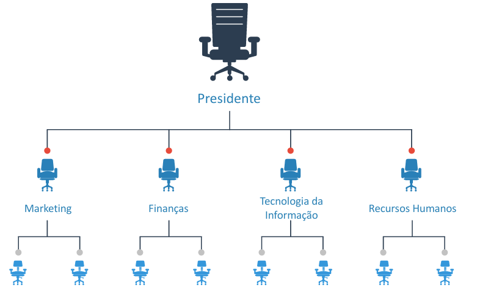
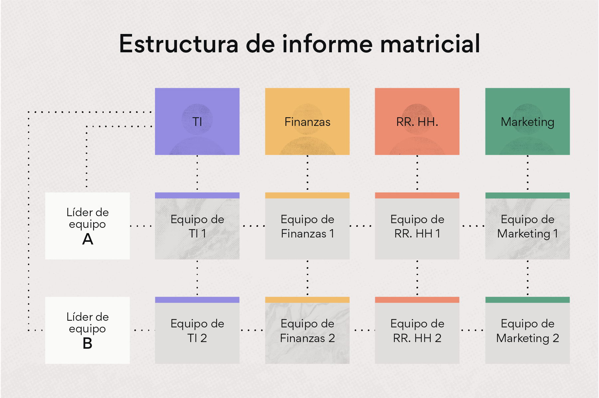
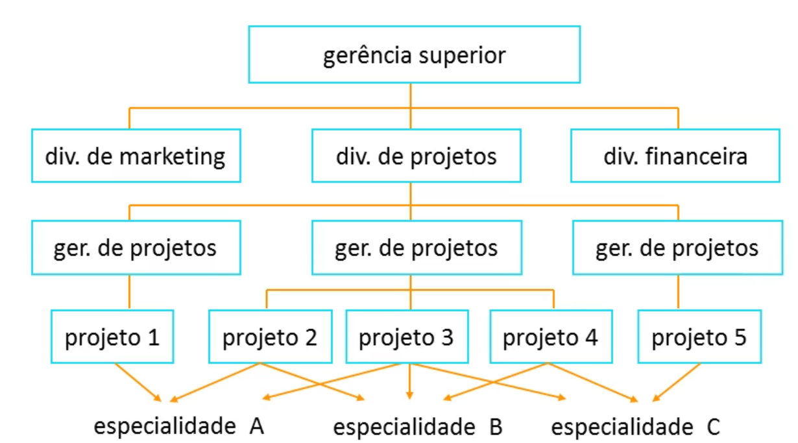
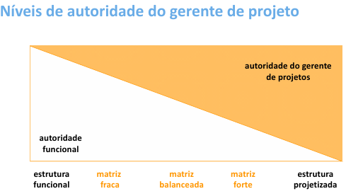
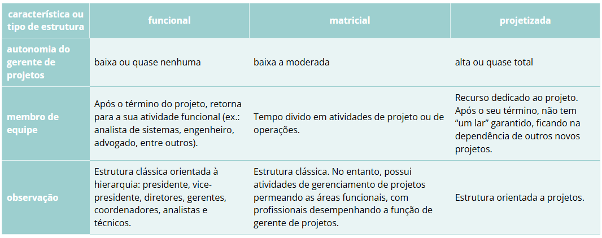
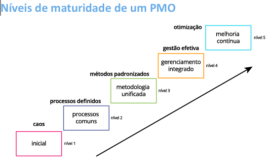

# Módulo 3 – Estruturas organizacionais e escritórios de gerenciamento de projetos (PMOS)

Neste módulo, trataremos das diversas estruturas organizacionais encontradas na atualidade corporativa, como as 
- funcionais, 
- matriciais, 
- compostas e 
- projetizadas. 

Serão evidenciados os seus prós e contras e também a forma como cada uma dessas estruturas impacta a gestão de projetos dentro do negócio e a posição do gestor de projetos.

Além disso, abordaremos o conceito de **escritório de gerenciamento de projetos** (PMO) com mais profundidade.
Ao final deste módulo, esperamos que você seja capaz de:
- distinguir as estruturas organizacionais e determinar a sua relação com a gestão de projetos;
- descrever as funções de um escritório de projetos (PMO).
  
## Unidade 1 – Tipologia das organizações para gerenciamento de projetos

- A estrutura de uma organização **deve ser estabelecida de acordo com os objetivos e as estratégias determinadas pela alta administração**. 
- Além disso, outros aspectos devem ser levados em conta, como **os procedimentos que darão suporte às atividades ou elevarão à maturidade da companhia** em relação à sua gestão de projetos.
- existem algumas orientações mais utilizadas que outras.

A maneira como uma equipe de projeto é composta, como e se os gerentes de projeto têm **autonomia na gestão**, se há ou não um escritório de projetos ou se as **comunicações fluem rapidamente** são apenas alguns pontos de realidade diretamente dependentes do modelo da estrutura adotado pelas suas organizações. 

É evidente que o tipo de estrutura hierárquica vigente em uma referida empresa poderá implicar em maior ou menor importância dada ao gerenciamento de projetos, permitindo ou tolhendo a sua evolução. 
Alguns formatos de entidades são mais propícios ao florescimento de metodologias de gestão e à própria carreira do gerente de projetos; outras estruturas, nem tanto.

### Tipos de estrutura e relação com projetos: estrutura funcional e estrutura matricial
- Funcional: 
  - a jerarquia tipica (parce uma arvore invertida o piramide)
  - podem ser especialista no que fazem porem vira rigida
  - problemas de comunicação entre as branches da arvore. 0 visao holistica.
  - nao tem carreira de GP, nem sequer existe o cargo.

- Matricial:
  - Tem linhas horizontais e verticalização.
  - Empresas que tem GP geralmente sao matriciais.
  - PMO: diretoria de projetos (ao mesmo nivel que as outras diretorias)
  - Fraca: Outras diretorias > PMO
  - Balanceada: Outras diretorias = PMO
  - Forte: Outras diretorias < PMO

### Tipos de estrutura e relação com projetos: estrutura projetizada
- Foco em projetos, terminou projeto? começa outro. Ejemplo? Uma consultoria

- É a evolução da matriz forte.

### Estrutura da companhia
[LINK](https://www.roberthalf.com/br/pt/insights/carreira/modelos-de-estrutura-organizacional-conheca-principais-rc)

### Tabela

## Unidade 2 – Project management office (PMO) ou escritório de projeto

O PMO (project management office) é uma unidade empresarial ou um departamento responsável pelos projetos de uma organização. Há outras variações de nomenclatura, como:  
- escritório de projetos (EG); 
- escritório de gerenciamento de projetos (EGP);
- comitê diretor de projetos;
- coordenação de projetos;
- escritório de apoio a projetos;
- project office (PO).

O PMO geralmente inicia as suas atividades com responsabilidades mais básicas e claras, como treinamento dos gerentes de projetos da companhia, criação e unificação de novos modelos (templates) de documentação usados nos diversos projetos e melhor integração de gestores de projetos e gestores funcionais. É comum o PMO aperfeiçoar padrões no gerenciamento, assumindo uma metodologia ou fazendo uma combinação de várias. 

Uma **recomendação geral para o sucesso** desses escritórios é que tenham a **merecida e necessária autoridade e autonomia**. 
- Há na literatura de projetos diversos casos de PMOs que falharam na sua missão porque não receberam o devido o aval ou o endosso das suas diretorias ou até das presidências. Outros casos de fracasso trazem até detalhes de sabotagem contra as atividades do escritório.

Uma vez que se trata de um** órgão que naturalmente cobrará resultados de outros setores e que exporá números e performances**, faz-se imprescindível que a criação de um PMO seja **combinada com uma "campanha" interna para conscientizar a todos da função desse departamento**, evitando essas naturais resistências. O apoio da alta cúpula da organização ao escritório certamente será uma peça-chave para a obtenção das vantagens que a sua boa operação normalmente traz.

### FUNÇÕES-CHAVE DO PMO
As funções-chave de um escritório de projetos (PMO) são:
- centralizar e coordenar os recursos do projeto; 
- apoiar a escolha dos projetos de acordo com a prioridade estratégica da organização; 
- implementar ou melhorar os processos de gerência de projetos da companhia; 
- promover reuniões regulares com um comitê de alto nível para governança do portfólio;
- auditar o andamento dos projetos junto aos diversos setores organizacionais.

### Níveis de maturidade
- Nasce odiado e com responsabilidades pq vai cobrar entrega dos outros setores.
- Esta mudança demora ANOS

### Project Management Office (PMO): o que é, quais as vantagens de ter um e como implantar o seu
- [LINK](https://www.euax.com.br/2019/07/project-management-office/)

O PMO atua como:

- uma unidade centralizadora de práticas, metodologias e ferramentas de gestão de projetos.
- Ele não apenas apoia os gerentes de projeto com orientações e recursos, mas também 
- monitora o desempenho das entregas, 
- promove a melhoria contínua e 
- facilita a tomada de decisões baseada em dados concretos. 

Assim, contribui para a eficiência operacional e a maximização do retorno sobre os investimentos em projetos.

### Eproj SC
[LINK](https://www.seplan.sc.gov.br/eproj/)

### Building a Stronger Special Olympics: How the PMO is Driving Transformation

[LINK](https://www.pmi.org/blog/building-a-stronger-special-olympics-with-a-pmo)

### Estudo do PMI-ES aponta a importância dos Escritórios de Gerenciamento de Projetos para a estratégia das empresas

[LINK](https://pmies.org.br/noticias/estudo-do-pmi-es-aponta-a-importancia-dos-escritorios-de-gerenciamento-de-projetos-para-a-estrategia-das-empresas/)

[Estudo](https://pmies.org.br/wp-content/uploads/2025/01/Benchmark-de-PMOs-2024.pdf)

