# Módulo 4 – Contexto de gerenciamento de projetos
- reflexão sobre o ambiente no qual os projetos estão inseridos. 
- Devemos **considerar a cultura**, os fatores ambientais e ativos que influenciam diretamente as organizações na aplicação de melhores práticas de gestão de projetos.
- É importante **conhecer o ambiente** onde está inserido um projeto, ja que influenciam diretamente o desempenho.
  - Quais influencias fazem sofrer o projeto?

Objetivos:
- reconhecer as fases do ciclo de vida de um projeto e os seus eventos mais usuais; 
- distinguir os modelos preditivos, ágeis e híbridos; 
- descrever as áreas de conhecimento no gerenciamento de projetos; 
- avaliar o papel dos stakeholders no contexto de todo e qualquer projeto; 
- analisar a utilidade do conceito de linha de base e o controle geral de mudanças;
- identificar as bases da metodologia Scrum.
 
## Unidade 1 – Tipologia de ciclo de vida de projetos
- Projetos são entidades vivas, orgânicas e finitas, sendo natural que também possuam o seu próprio ciclo de vida. (i.e. a característica de temporariedade própria dos projetos)
- Normalmente, um projeto é dividido em fases, divisões ou etapas, que servirão para conectar o esforço do começo até o seu final.
  - as fases de um projeto são bastante específicas de cada ramo de atuação dependendo de:
    - da atividade à que pertence a companhia executora do projeto; 
    - do setor responsável pela empreitada.
- A transição entre uma fase e outra pressupõe: 
  - um produto;
  - uma transferência de saber;
  - uma entrega ou entregável.
    - Podemos estar falando de um documento, uma reunião solene ou um resultado tangível e verificável, como:  
      - Plano de gerenciamento de projeto ao ser entregue;
      - protótipo do produto do projeto;
      - relatório de performance bimestral; 
      - fundação da obra;
      - módulo concluído de um curso.
- As transições de uma fase para a outra devem ser encaradas como **um ponto de controle de qualidade do projeto**
- Os projetos podem ser cancelados por diversos motivos tanto internos como externos. e.g. COVID 19

### Ciclo de vida de projetos
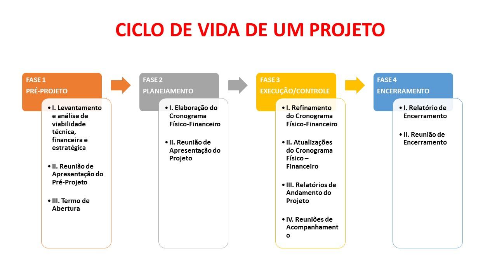
- Numa gráfica Nivel de Projeto (y) vs tempo (x) as fases seriam:
  - Iniciação (pre-projeto):
  - Planejamento:
  - Execução/controle:
  - Encerramento: importante documento de liçoes aprendidas, o que deu boa? o que deu ruim.
- No inicio do projeto o `Nivel de Risco` geralmente é descendente com maxima na `iniciação` e caindo ao longo do tempo.
### Comportamento de outros parâmetros
- Custos vs Tempo, e Pessoal vs Tempo

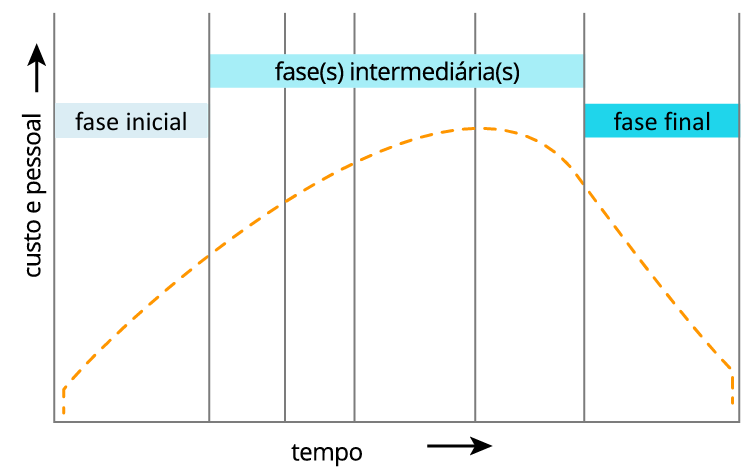

- Influência dos stakeholders (pessoas fisicas ou juridicas envolvidas no projeto) e do curso das mudanças

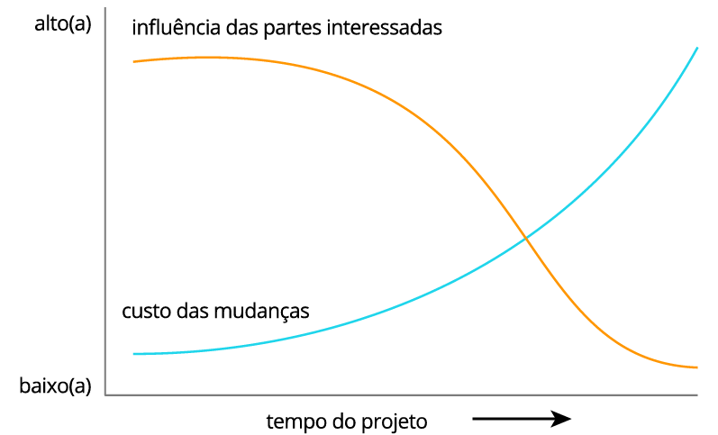

- Nivel de risco e incerteza. "O risco zera quando o pagamento cai e o projeto é entregue"

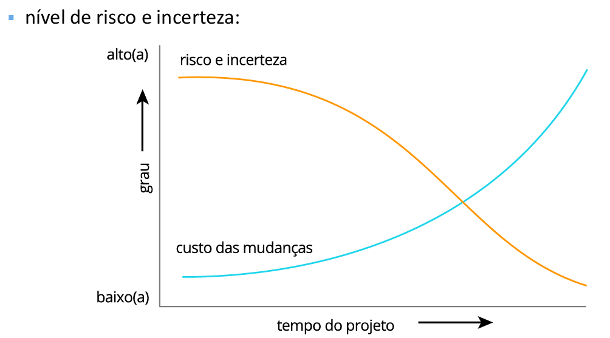

- Nivel de Conflitos:
   - Conflitos sao favoráveis bemvindos, ajudam a mudança melhoramento e inovação.
   - Conflitos no contexto de intelectuais e técnicas
   - Nao necessariamente pq teve conflito com um stakeholder vai ter também no seguinte projeto. O oposto tmbm é verdade.

- Nivel de motivação:
   - O que motiva um funcionario? se profesionalizar? será que tem o drive? 
   - O ambiente tem que motivar.
   - A razão de motivação da pessoa muda com o tempo. Grana? Projetos diferentes? Familia? Curiosidade?

## Unidade 2 – Modelos preditivos, ágeis e híbridos
- destacaremos  a importância dos marcos de referência nos projetos usados nas transições entre fases.
- será estudada a abordagem preditiva do ciclo de vida.

### Fases do ciclo de vida
- Projetos são finitos (ou temporarios) 
- Projetos tem um ciclo de vida geralmente dividido em fases. Ao final de cada fase é bom fazer uma retrospectiva do bom e ruim.
  - cada fase pode ter uma o mais "entregas-chave"
  - estas entregas são importantes **pontos de avaliação**
- Os **pontos da avaliação** tmbm podem ser **kill-points** ou seja pontos que podem abortar ou cancelar o projeto (logicamente tem que se documentar o pq).
- "Marco": uma refrencia, um momento importante i.e. soma de varias entregas.
- No ciclo de vida de projeto existem varios modelos um deles é o preditivo ou cascata.
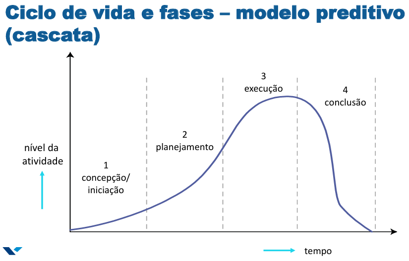

### Hospedagem Low Cost COP 30: saiba o que é o projeto lançado em Belém
- [LNK](https://www.oliberal.com/cop-30/hospedagem-low-cost-cop-30-saiba-o-que-e-o-projeto-lancado-em-belem-1.923778)

### Projeto Cancelado
- [LINK](https://fotografia.folha.uol.com.br/galerias/1823342653635211-obra-inacabada-da-nova-sede-do-banco-central-no-rio-de-janeiro)

### Tipologia de ciclos de vida de projetos - ágil
- Tres formas de ciclo de vida de projeto:
  - Preditiva (cascata):
    - Sequencial, entregas previsiveis 
  - Hibrida (iterativa ou incremental)    
  - Adaptativa (ágil): inicio 2001. Precisa de time com experiencia 
    - Atributos chave_
      - Transparencia_ sobre as intenções e demandas dos stake
      - Foco no cliente
      - Adaptabilidade
      - "Senso de dono" entregar bem feito
      - melhoramento continuo
      - autogerenciamento e autoorganização
      - espirito de equipe.
    - Precisa de uma mudança da cultura organizacional do negocio
- Conclusoes:
  - Nao é necesarrio adotar sempre a met. agil. Depende da natureza do negocio, o scenario.
  - Sempre precisa tailoring (customização)
  - Ser ágil é sinonimo de adaptabilidade, de eficiencia.
  - Defina com o cliente as prioridades.
  - Origem TI
  
  ### Tipologia de ciclos de vida de projetos - Hibridos
  - Tem tanto de cascata como uso de partes adaptativas.
  - Pequenos objetivos, foco em curto prazo.
  - Entregas sucesivas "rolling waves".
  - O progresso é adicionado via refinamentos ou incrementos a cada iteração.
  - Iterativo: pq vai ter varias etapas 
  - Incrementar: Novas partes são adicionadas ao longo do periodo.
  - Como? 
    1. O projeto é proposto
    2. O projeto inicia.
    3. A implementação começa:
       1. Plano
       2. Design
       3. Sequencia de MPVs  (cada entrega foi coordinada com stakes para que recebam o que querem e saibam o que vao receber)
       4. Operação assitida
    4. Fim do Projeto

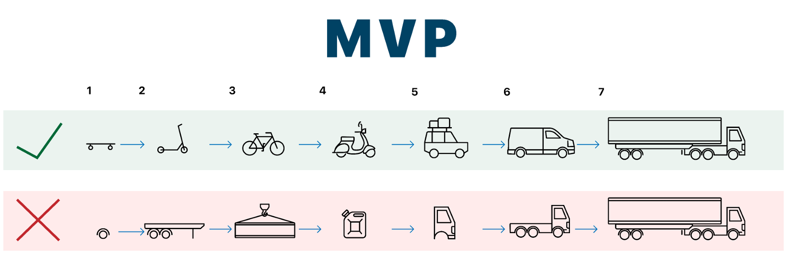

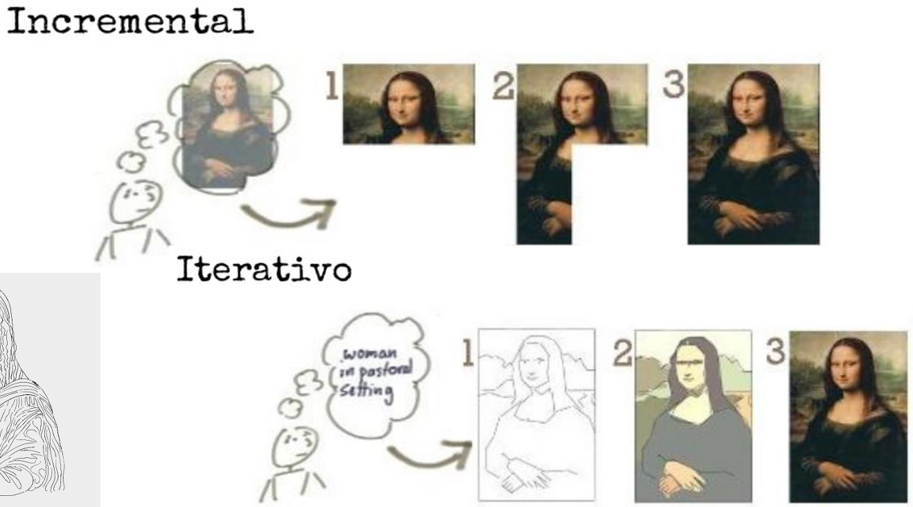

  ### Tipos de Projeto
  [LINK](https://netproject.com.br/blog/agil-tradicional-ou-hibrido-ainda-confuso-descubra-as-principais-diferencas-entre-as-principais-abordagens-de-gestao-de-projetos/)

## Unidade 3 – Gerenciamento de projetos preditivos
Diferenças entre abordagens cascata (esquerda) hibrida (centro) e ágil (direita).

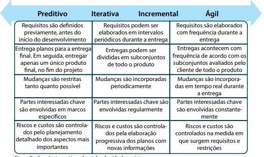

### Os 7 passos da gestao de projetos

[LINK](https://www.gestaodeprojeto.info/7passos)

## Unidade 4 – Demais áreas de conhecimento
O PMBOK ao ser uma guia (e não um framework) propoe algumas formas de gerir projetos.
Ele encara o mundo através das áreas de conhecimento.
Ele tem 10 áreas de conhecimento (nao tem ordem de importancia) e são integradas entre elas.

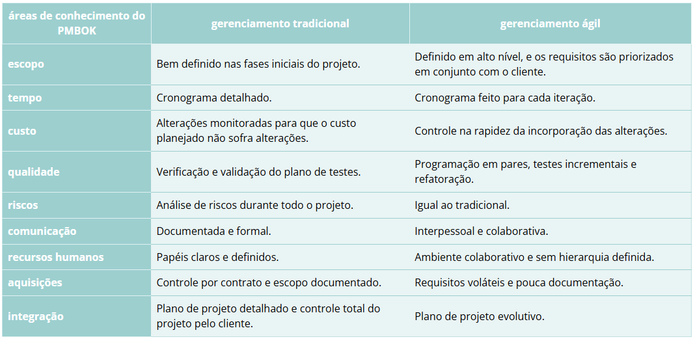

1. Integração:  
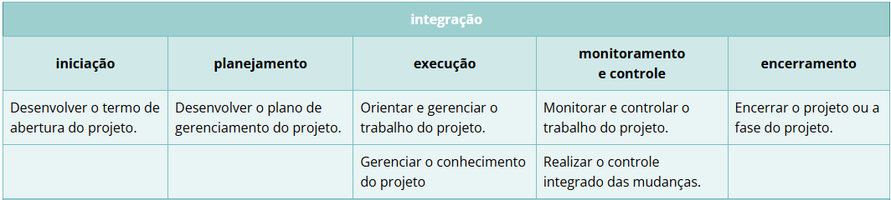
2. Escopo: Define o que será entregue. o trabalho necessario para entregar o projeto. Se fecha com o cliente, o que nao for definido nao se entrega.  
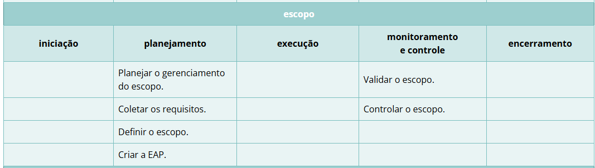
3. Cronograma: Define o prazo. Gerencia atividades, interdependenciasa entre elas. Dependencias, feriados.  
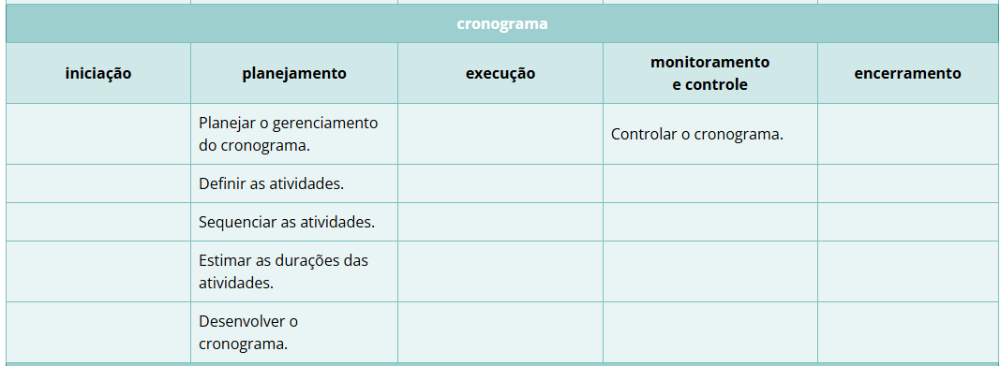
4. Custos: Organiza e cumpre o teto de orçamento. Trabalha junto com gerencia de riscos para poder controlar os gastos imprevistos.  
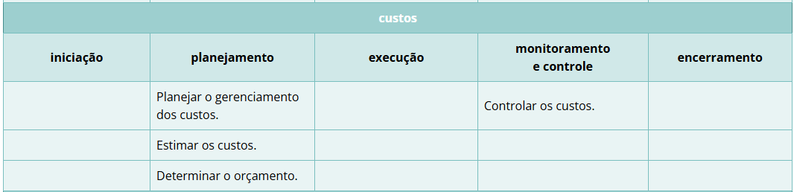
5. Riscos: Gerenciamento de riscos a fim de evitar gastos imprevistos.  
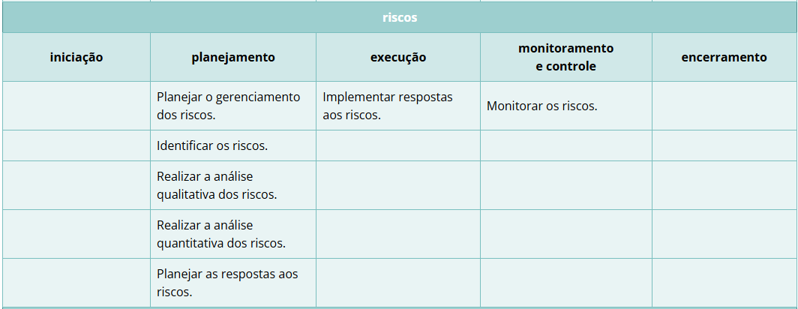
6. Stakeholders: saber gerir os stakes. Depende da Comunicação  
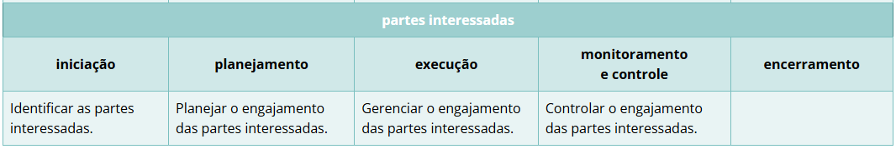
7. Comunicação: Definit formas de accesar o cliente. status e reportes.  
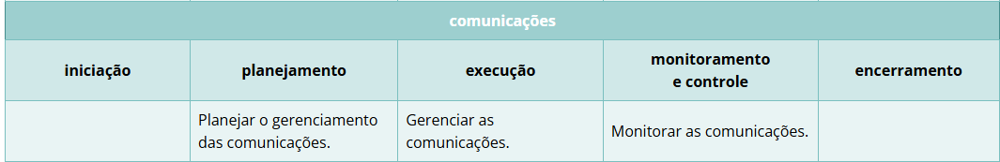
8. Qualidade: O nivel de especificação da qualidade a ser entregue do produo ou serviço  
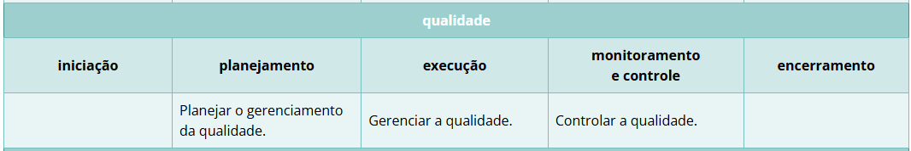
9. Aquisições: Suprimento, contratação de recursos.  
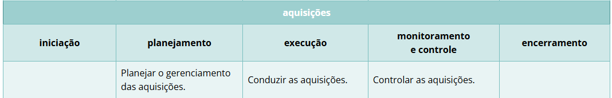
10.  Recursos (RH): preocupação com montagem de times, organização de jerarquias. Como motivar time, beneficios. Aprimoramento de times e desmobilização (realocados) ao final do projeto.  
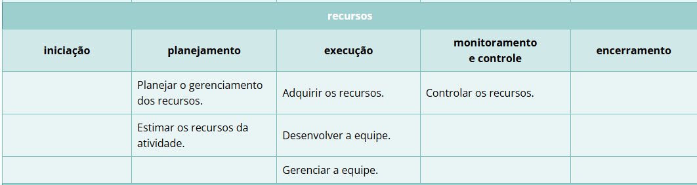

## Unidade 5 – Stakeholders do projeto

## Unidade 6 – Linha de base e controle de mudanças

## Unidade 7 – Metodologias ágeis, papéis e artefatos

## Unidade 8 – Framework Scrum

## Unidade 9 – Práticas de gerenciamento de projeto

## Conclusão
