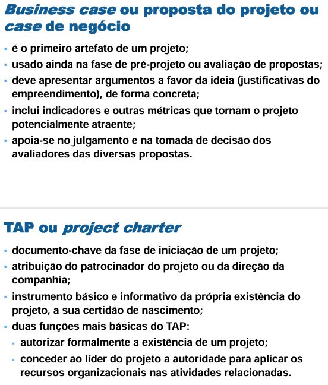
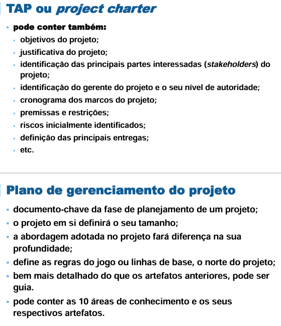

# Módulo 4 – Contexto de gerenciamento de projetos
- reflexão sobre o ambiente no qual os projetos estão inseridos. 
- Devemos **considerar a cultura**, os fatores ambientais e ativos que influenciam diretamente as organizações na aplicação de melhores práticas de gestão de projetos.
- É importante **conhecer o ambiente** onde está inserido um projeto, ja que influenciam diretamente o desempenho.
  - Quais influencias fazem sofrer o projeto?

Objetivos:
- reconhecer as fases do ciclo de vida de um projeto e os seus eventos mais usuais; 
- distinguir os modelos preditivos, ágeis e híbridos; 
- descrever as áreas de conhecimento no gerenciamento de projetos; 
- avaliar o papel dos stakeholders no contexto de todo e qualquer projeto; 
- analisar a utilidade do conceito de linha de base e o controle geral de mudanças;
- identificar as bases da metodologia Scrum.
 
## Unidade 1 – Tipologia de ciclo de vida de projetos
- Projetos são entidades vivas, orgânicas e finitas, sendo natural que também possuam o seu próprio ciclo de vida. (i.e. a característica de temporariedade própria dos projetos)
- Normalmente, um projeto é dividido em fases, divisões ou etapas, que servirão para conectar o esforço do começo até o seu final.
  - as fases de um projeto são bastante específicas de cada ramo de atuação dependendo de:
    - da atividade à que pertence a companhia executora do projeto; 
    - do setor responsável pela empreitada.
- A transição entre uma fase e outra pressupõe: 
  - um produto;
  - uma transferência de saber;
  - uma entrega ou entregável.
    - Podemos estar falando de um documento, uma reunião solene ou um resultado tangível e verificável, como:  
      - Plano de gerenciamento de projeto ao ser entregue;
      - protótipo do produto do projeto;
      - relatório de performance bimestral; 
      - fundação da obra;
      - módulo concluído de um curso.
- As transições de uma fase para a outra devem ser encaradas como **um ponto de controle de qualidade do projeto**
- Os projetos podem ser cancelados por diversos motivos tanto internos como externos. e.g. COVID 19

### Ciclo de vida de projetos

- Numa gráfica Nivel de Projeto (y) vs tempo (x) as fases seriam:
  - Iniciação (pre-projeto):
  - Planejamento:
  - Execução/controle:
  - Encerramento: importante documento de liçoes aprendidas, o que deu boa? o que deu ruim.
- No inicio do projeto o `Nivel de Risco` geralmente é descendente com maxima na `iniciação` e caindo ao longo do tempo.
### Comportamento de outros parâmetros
- Custos vs Tempo, e Pessoal vs Tempo

- Influência dos stakeholders (pessoas fisicas ou juridicas envolvidas no projeto) e do curso das mudanças

- Nivel de risco e incerteza. "O risco zera quando o pagamento cai e o projeto é entregue"

- Nivel de Conflitos:
   - Conflitos sao favoráveis bemvindos, ajudam a mudança melhoramento e inovação.
   - Conflitos no contexto de intelectuais e técnicas
   - Nao necessariamente pq teve conflito com um stakeholder vai ter também no seguinte projeto. O oposto tmbm é verdade.

- Nivel de motivação:
   - O que motiva um funcionario? se profesionalizar? será que tem o drive? 
   - O ambiente tem que motivar.
   - A razão de motivação da pessoa muda com o tempo. Grana? Projetos diferentes? Familia? Curiosidade?

## Unidade 2 – Modelos preditivos, ágeis e híbridos
- destacaremos  a importância dos marcos de referência nos projetos usados nas transições entre fases.
- será estudada a abordagem preditiva do ciclo de vida.

### Fases do ciclo de vida
- Projetos são finitos (ou temporarios) 
- Projetos tem um ciclo de vida geralmente dividido em fases. Ao final de cada fase é bom fazer uma retrospectiva do bom e ruim.
  - cada fase pode ter uma o mais "entregas-chave"
  - estas entregas são importantes **pontos de avaliação**
- Os **pontos da avaliação** tmbm podem ser **kill-points** ou seja pontos que podem abortar ou cancelar o projeto (logicamente tem que se documentar o pq).
- "Marco": uma refrencia, um momento importante i.e. soma de varias entregas.
- No ciclo de vida de projeto existem varios modelos um deles é o preditivo ou cascata.

### Hospedagem Low Cost COP 30: saiba o que é o projeto lançado em Belém
- [LNK](https://www.oliberal.com/cop-30/hospedagem-low-cost-cop-30-saiba-o-que-e-o-projeto-lancado-em-belem-1.923778)

### Projeto Cancelado
- [LINK](https://fotografia.folha.uol.com.br/galerias/1823342653635211-obra-inacabada-da-nova-sede-do-banco-central-no-rio-de-janeiro)

### Tipologia de ciclos de vida de projetos - ágil
- Tres formas de ciclo de vida de projeto:
  - Preditiva (cascata):
    - Sequencial, entregas previsiveis 
  - Hibrida (iterativa ou incremental)    
  - Adaptativa (ágil): inicio 2001. Precisa de time com experiencia 
    - Atributos chave_
      - Transparencia_ sobre as intenções e demandas dos stake
      - Foco no cliente
      - Adaptabilidade
      - "Senso de dono" entregar bem feito
      - melhoramento continuo
      - autogerenciamento e autoorganização
      - espirito de equipe.
    - Precisa de uma mudança da cultura organizacional do negocio
- Conclusoes:
  - Nao é necesarrio adotar sempre a met. agil. Depende da natureza do negocio, o scenario.
  - Sempre precisa tailoring (customização)
  - Ser ágil é sinonimo de adaptabilidade, de eficiencia.
  - Defina com o cliente as prioridades.
  - Origem TI
  
  ### Tipologia de ciclos de vida de projetos - Hibridos
  - Tem tanto de cascata como uso de partes adaptativas.
  - Pequenos objetivos, foco em curto prazo.
  - Entregas sucesivas "rolling waves".
  - O progresso é adicionado via refinamentos ou incrementos a cada iteração.
  - Iterativo: pq vai ter varias etapas 
  - Incrementar: Novas partes são adicionadas ao longo do periodo.
  - Como? 
    1. O projeto é proposto
    2. O projeto inicia.
    3. A implementação começa:
       1. Plano
       2. Design
       3. Sequencia de MPVs  (cada entrega foi coordinada com stakes para que recebam o que querem e saibam o que vao receber)
       4. Operação assitida
    4. Fim do Projeto

  ### Tipos de Projeto
  [LINK](https://netproject.com.br/blog/agil-tradicional-ou-hibrido-ainda-confuso-descubra-as-principais-diferencas-entre-as-principais-abordagens-de-gestao-de-projetos/)

## Unidade 3 – Gerenciamento de projetos preditivos
Diferenças entre abordagens cascata (esquerda) hibrida (centro) e ágil (direita).

### Os 7 passos da gestao de projetos

[LINK](https://www.gestaodeprojeto.info/7passos)

## Unidade 4 – Demais áreas de conhecimento
O PMBOK ao ser uma guia (e não um framework) propoe algumas formas de gerir projetos.
Ele encara o mundo através das áreas de conhecimento.
Ele tem 10 áreas de conhecimento (nao tem ordem de importancia) e são integradas entre elas.

1. Integração:  

2. Escopo: Define o que será entregue. o trabalho necessario para entregar o projeto. Se fecha com o cliente, o que nao for definido nao se entrega.  

3. Cronograma: Define o prazo. Gerencia atividades, interdependenciasa entre elas. Dependencias, feriados.  

4. Custos: Organiza e cumpre o teto de orçamento. Trabalha junto com gerencia de riscos para poder controlar os gastos imprevistos.  

5. Riscos: Gerenciamento de riscos a fim de evitar gastos imprevistos.  

6. Stakeholders: saber gerir os stakes. Depende da Comunicação  

7. Comunicação: Definit formas de accesar o cliente. status e reportes.  

8. Qualidade: O nivel de especificação da qualidade a ser entregue do produo ou serviço  

9. Aquisições: Suprimento, contratação de recursos.  

10.  Recursos (RH): preocupação com montagem de times, organização de jerarquias. Como motivar time, beneficios. Aprimoramento de times e desmobilização (realocados) ao final do projeto.  

## Unidade 5 – Stakeholders do projeto
PMBOK: 
- Partes interessadas no projeto são pessoas e organizações ativamente envolvidas no projeto ou cujos interesses podem ser afetados como resultado da execução ou do término do projeto. Podem também exercer influência sobre os objetivos e os resultados do projeto.
- as partes interessadas podem ser pessoas, grupo ou organizações que podem afetar, sentir-se afetados por uma decisão, atividade ou resultado de um projeto, um programa ou um portfólio. As partes interessadas também influenciam direta ou indiretamente um projeto, seu desempenho ou resultado de forma positiva ou negativa

### Principais stakeholders
- GP Gerente de Projeto: O personagem responsável pelo projeto. Integrador de todos os demais stakeholders e que planeja o uso dos recursos. Detém a autoridade e a responsabilidade de todo o esforço, respondendo pelo sucesso ou fracasso do projeto bem como pela sua entrega plena.
- Cliente: O contratante ou demandante do projeto, aquele que utilizará os produtos ou serviços gerados ou quem adquire os resultados produzidos; é a parte interessada a quem o projeto se destina. Pode ser um cliente externo ou interno do projeto. Apesar do primeiro ser mais comum, há inúmeros projetos internos nas organizações, cujos destinatários são outros departamentos (divisões) ou pessoas de dentro da própria entidade. 
- Organização executora ou hospedeira: A contratada, ou seja, a firma dentro da qual o projeto será executado e cujos funcionários estão diretamente envolvidos na execução do trabalho do projeto.
- Patrocinador: A pessoa, grupo ou organização que normalmente tem a ideia do projeto e a defende estrategicamente na alta cúpula da companhia. O patrocinador (ou sponsor) fornece os recursos financeiros e ideológicos para a execução do projeto.
- Equipe: Grupo de pessoas que responderão ao GP e que atuam diretamente na entrega dos produtos ou serviços do projeto. Podem vir cedidos de outras áreas da companhia ou do mercado; no entanto, a sua função é de literalmente executar o projeto. 

### Why Executive Sponsorship Fuels Projects
[LINK](https://www.pmi.org/blog/why-executive-sponsorship-fuels-projects)

## Unidade 6 – Linha de base BASELINE e controle de mudanças

Para fazer essa avaliação do progresso periódico do projeto (e, um dia, do sucesso ou insucesso dele), faz-se necessário o emprego de referências, chamadas de linha de base (**baseline**). 

- Parâmetro de comparação entre o planejado e realizado. 
- Utilizada para avaliar a performance do projeto.
  - Quem tem que achar que o projeto está bom é o CLIENTE. Ele que aprova a baseline.
- O plano de gerenciamento do projeto contém inúmeras linhas de base para a mensuração do desempenho.
- Linha de Base de Performance de um Projeto:
  - baseline de escopo
  - baseline de tempo 
  - baseline de custo

## Unidade 7 – Metodologias ágeis, papéis e artefatos
Os valores contidos no manifesto são:
- indivíduos e interações, mais que processos e ferramentas;
- software funcional, mais que documentação abrangente;
- colaboração com o cliente, mais que negociação de contratos;
- responder às mudanças, mais que seguir um plano.

### Metodologias ágeis: o que são, quais são as vantagens e como aplicá-las 
[LINK](https://www.amcham.com.br/noticias/gestao/metodologias-ageis-o-que-sao-quais-sao-as-vantagens-e-como-aplica-las)

### Com IA, mercado vive revolução das metodologias ágeis

[LINK](https://exame.com/bussola/com-ia-mercado-vive-revolucao-das-metodologias-ageis)

## Unidade 8 – Framework Scrum
A metodologia de gestão de projetos chamada Scrum trata, inicialmente, de uma **abordagem ágil**. Foi originalmente criada para suportar projetos de desenvolvimento de software. No entanto, atualmente outras áreas adotaram, integral ou parcialmente, os seus processos. 

A lógica da Srum é a partir do produto desejado:  
1. Particionar pequenas entregas do projeto, que serão priorizadas por ordem de valor e importância pelo cliente.
2. A equipe técnica constrói, testa e entrega dentro cada porção, dentro de um ciclo iterativo e previsto, ao qual damos o nome de sprint. Cada sprint, geralmente, dura de duas a quatro semanas.
3. A evolução da construção dessas pequenas entregas é acompanhada diariamente em reuniões de 10 minutos em que todos ficam em pé (o nome em inglês é stand-up meeting).
4. Também ocorrem as reuniões de planejamento do próximo ciclo e as lições levantadas do último ciclo são coletadas.

### Como criar uma equipe Scrum bem-sucedida

[LINK](https://monday.com/blog/pt/trabalho-em-equipe/como-criar-uma-equipe-scrum-bem-sucedida/)

### Os squads são responsáveis pelas entregas – atenção para o estabelecimento de objetivos
[LINK](https://player.vimeo.com/video/562084527)

### Exemplos de entregas dos squads
[LINK](https://player.vimeo.com/video/562084739)

## Unidade 9 – Práticas de gerenciamento de projeto

O gerente de projetos diligente **produz artefatos** durante toda a vida útil do projeto. Com ou sem o suporte de softwares de gestão de projetos, é esperado que as decisões tomadas no dia a dia sejam bem fundamentadas. 
- Ferramenta é apoio apenas, quem toma as decisões é o GP
- é impossível nos apoiarmos 100% nessas técnicas, documentos e métodos para prever o futuro ou os rumos do projeto. No entanto, faz parte das “melhores práticas” da atualidade gerir os projetos com o subsídio desses recursos. 
- Os principais artefatos são:
  
### Business Case:
- O business case é um registro da justificativa comercial do projeto, por isso precisa evidenciar a sua viabilidade técnica e econômica. Alguns autores tambéchamam esse artefato de pré-projeto.
- Para ter mais chances de uma resposta favorável, o business case deve conter uma excelente definição dos benefícios prometidos do projeto, inclusive as suacontribuições ao resultado do negócio.
- Como o orçamento geral das organizações é limitado, os vários proponentes de projetos devem ser muito convincentes nessa apresentação do empreendimento. Dessforma, uma confecção cuidadosa do business case poderá fazer toda a diferença na escolha de quais propostas serão feitas e as que não serão efetivamentimplementadas. 
- Um business case simplificado pode conter:
  - as razões para se investir no projeto;
  - a viabilidade do plano de ideia;
  - os benefícios esperados a partir da implantação do projeto;
  - as datas de início e fim do projeto ou os marcos;
  - os principais riscos inicialmente identificados do projeto.
  
### Termo de Abertura de projeto (TAP) ou Project Charter
- Tão logo seja confirmada a necessidade de um projeto, será emitido o TAP. Esse documento visa oficializar ou autorizar a abertura do projeto dentro da empresexecutora do mesmo, por isso que o TAP é gerado na fase preliminar ou de iniciação do empreendimento. 
- Podemos fazer algumas recomendações sobre o seu conteúdo. Normalmente, é feita uma introdução para efeito de contextualização, com algumas linhas djustificativa do projeto, ou melhor, para qual necessidade ele está sendo criado, o seu porquê.
- Devemos também agregar algumas linhas com os requisitos do projeto e os seus objetivos gerais e específicos. É comum encontrarmos no documento do TAP esseelementos:
  - produtos esperados da empreitada; 
  - definição dos seus principais stakeholders; 
  - premissas – tudo que é assumido ou pressuposto como certo no projeto; dessa forma, validado e acordado, torna-se uma premissa. Exemplos: 
    1. Farão parte da equipe executora do projeto os recursos Débora, Maria e Daniel, cedidos antecipadamente pelo seu gerente funcional. 
    2. O dólar ficará ancorado a R$ 6,00 ao longo do ciclo de vida. 
    3. O horário de trabalho do projeto será o turno da manhã, de 08h30 às 12h30, horário de Brasília.
  - restrições: todo e qualquer fator restritivo do projeto, que afete em maior ou menor grau a sua execução ou manutenção dentro do curso ideal. Exemplos:
    1. A data final deste projeto será 01/12/2025, sem autorização para postergações. 
    2. O teto orçamentário deste projeto é de R$ 290.000,00. 
    3. Apenas os membros do setor de contabilidade poderão acessar a sala de execução do projeto.
  - nomeação ou designação do gerente e as suas responsabilidades;
  - orçamento preliminar; 
  - cronograma “macro” ou sumarizado;
  - riscos identificados.
- Uma vez pronto e concebido o documento, é altamente recomendável que o TAP seja assinado pelo patrocinador do projeto, com a finalidade de torná-lo devidamentreconhecido. Após a assinatura dessa certidão de nascimento, o projeto estará oficializado ou autorizado. 
- Graças à importância desse ato e também como forma de valorizar a posse do gerente de projeto, o documento assinado deve ser distribuído internamente na empresexecutora, ou pelo menos o fato anunciado junto aos stakeholders mais ligados ao projeto. 
- Essa comunicação pode ser feita por meio de inúmeras mídias. No entanto, tem sido comum o compartilhamento do arquivo do TAP por meio de e-mail ou por anúnciofeitos em reuniões, presenciais ou virtuais, graças a ferramentas cada vez mais comuns nas empresas, como Skype, Google HandOut, Webex, Citrix go to Meeting, AdobConnect, Microsoft Office Live Meeting, entre outros.
- Com o TAP assinado e amplamente divulgado, o projeto encontra-se pronto para passar da etapa de concepção. Conforme vimos anteriormente em unidade sobre o ciclde vida, trata-se da fase seguinte de planejamento, a ser conduzida pessoalmente pelo gerente do projeto. 
- No período de planejamento do projeto ocorrerão os detalhamentos das estimativas e pormenorizações mais concretas assim como as definições mais fundamentais dempreitada. Nessa fase seguinte do planejamento, a grande meta do gestor do projeto passará a ser a confecção do Plano de gerenciamento do projeto (PGP).
   
### Plano de Gerenciamento de Projeto (PGP)
O Plano de gerenciamento do projeto (PGP) ou Plano geral do projeto ou, simplesmente, Plano do projeto, tem por fim ser um plano exequível e provedor das diretrizes para a execução do esforço. 

Deve haver coordenação na elaboração e integração do planejamento, onde as áreas de conhecimento serão apropriadamente integradas. Devido a esse foco que o PGP é o documento-chave da área de integração de um projeto. 

Quando se adota modelagem preditiva, o PGP tende a ser um documento mais robusto. Por outro lado, em casos de abordagens ágeis ou até híbridas, o artefato tenderá a ser inicialmente pequeno e é incrementado com o projeto e as suas interações.

Um plano do projeto pode conter subplanos ou planos auxiliares das 10 áreas de conhecimento. Plano de gerenciamento de:

1. escopo;
2. custo;
3. cronograma;
4. recursos; 
5. comunicações;
6. risco;
7. stakeholders;
8. qualidade;
9. aquisições;
10. integração.

Uma vez que esses subplanos sejam elaborados pelo gerente de projetos, teremos chegado às linhas de base de cada uma das áreas de conhecimento, pois o PGP é fruto da combinação (fusão) desses planos em um único documento.

### Business Case
[LINK](https://www.totvs.com/blog/negocios/business-case/)

### TAP
[LINK](https://escritoriodeprojetos.com.br/termo-de-abertura-do-projeto)

## Conclusão
