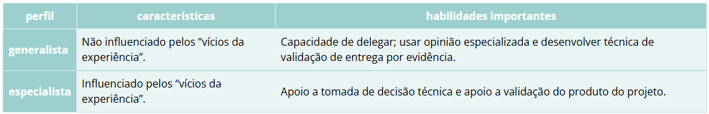
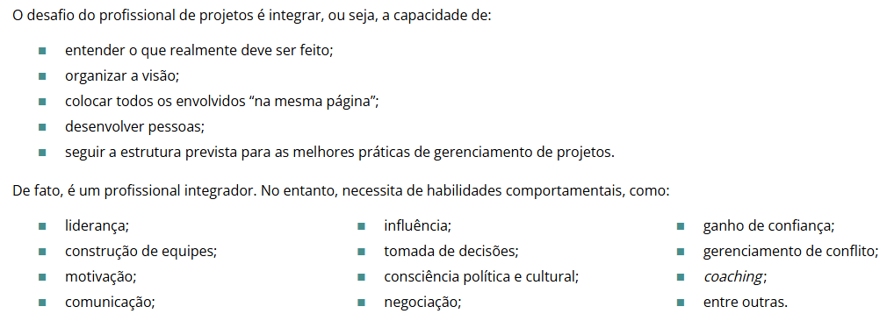

# Módulo 5 – Outros padrões e as competências necessárias para Gerenciamento de Projetos
- conheceremos outros padrões de gerenciamento de projetos, igualmente famosos e universalmente aplicáveis no mundo corporativo, como 
  - PRINCE2, 
  - ICB e 
  - ISO 21500.

## Unidade 1 – PRINCE2, ICB, ISO 21.500 e PMCD Framework

### PRINCE2
- PRINCE2 (projects in controlled environments) origem Reino Unido
  - mais estruturada e prescritiva do que o modelo do PMBOK
- Principios:
  1. justificativa continuada de negócios – deve haver uma razão justificável para executar e gerenciar o projeto; caso contrário, o projeto deve ser fechado;
  2. aprendizado com a experiência – as equipes de projeto do PRINCE2 devem procurar e aproveitar, continuamente, as lições aprendidas em trabalhos anteriores;
  3. papéis e responsabilidades definidos – a equipe do projeto PRINCE2 deve ter uma estrutura organizacional clara e envolver as pessoas certas nas tarefas certas;
  4. gerenciamento por etapas – os projetos do PRINCE2 devem ser planejados, monitorados e controlados passo a passo;
  5. gerenciamento por exceção – as pessoas que trabalham no projeto devem receber a quantidade certa de autoridade para efetivamente trabalhar no ambiente;
  6. foco nos produtos – os projetos do PRINCE2 se concentram nos requisitos de definição, entrega e qualidade do produto; 
  7. adaptação para se adequar ao ambiente do projeto – o PRINCE2 deve ser adaptado para se adequar ao ambiente, como tamanho, complexidade, importância, capacidade e risco do projeto. 

- Beneficios:
  - um prático guia passo a passo para gerenciar com sucesso qualquer projeto; 
  - um método flexível que pode ser adaptado a qualquer organização ou função envolvida no gerenciamento de projetos; 
  - uma certificação acessível e globalmente reconhecida que agrega valor ao seu currículo.
- As certificações PRINCE2 foram criadas para qualquer pessoa que coordena projetos. Isso varia do gerente de projeto dedicado até os profissionais que gerenciam projetos como parte do seu trabalho diário. Eles também são relevantes para os envolvidos no projeto, desenvolvimento e entrega de projetos.

## 1.1 – Perfil do gestor de projetos e PMCD framework
- Atualmente, o papel e a importância do gerente de projetos são reconhecidos em todo o lugar, segundo pesquisa do PMI e outras associações.
- É importante ressaltar que cada organização define, em acordo com a sua cultura e maturidade, como será a formalização (ou não) do gestor. Esse papel pode ser uma: 
  1. função comprovada em carteira (em acordo com a CLT, por exemplo); 
  2. função acumulada – por exemplo, um engenheiro, analista de sistemas ou advogado; ou ainda formato de contratação “pejotizada”, por projeto ou por período.

- A nomenclatura do GP também poder variar nas empresas. Vejamos alguns exemplos de tipos de funções e nomenclaturas que definem o profissional responsável pelo gerenciamento de projetos:
  1. gerente de projetos; 
  2. coordenador de projetos; 
  3. líder de projetos; 
  4. diretor de projetos; 
  5. analista de projetos; 
  6. coordenador técnico de projetos, etc.
- É importante ressaltar que o papel do gerente de projetos é diferente de um gerente funcional ou de um gerente de operações. 
- O profissional especialista em gerenciamento de projetos está apto a gerenciar qualquer tipo de projeto, em qualquer área, segmento, porte ou complexidade. O fator experiência na função, é claro, impacta diretamente o desempenho de tal profissional; no entanto, muito se discute sobre perfis de gerente de projeto.

### 7 profissões para quem gosta de gestão de projetos

- [LINK](https://exame.com/invest/guia/7-profissoes-para-quem-gosta-de-gestao-de-projetos) 

### 10 maiores erros de um GP

- [LINK](https://www.linkedin.com/pulse/os-10-maiores-erros-de-um-gerente-projetos-leonardo-bretas/?originalSubdomain=pt)

### Por Que a Gestão de Projetos é o Futuro para Profissionais Experientes

- [LINK](https://www.linkedin.com/pulse/navegando-na-onda-da-projetiza%C3%A7%C3%A3o-por-que-gest%C3%A3o-de-projetos-trentim-cisnf/)

### PMCD FRAMEWORK
- [LINK](https://pmimg.org.br/sindrome-de-burnout/)

## Unidade 2 – Habilidades e competências
- O profissional deve ser generalista ou especialista?
  - generalista: Profissional que irá gerenciar projetos cujo produto final é de uma área diferente da sua formação. Ex.: um engenheiro gerenciando projetos de Tecnologia da Informação.
  - especialista: Profissional de projetos que assumirá projetos, cujo produto final pertence à área da sua formação. Ex.: um engenheiro gerenciando projetos de obra.

Podemos ainda considerar três elementos essenciais para o profissional de gerência de projetos. 
- conhecimento: Refere-se ao que o gerente de projetos sabe sobre o gerenciamento de projetos, ou seja, compreender o PMBOK, metodologias, ferramentas e técnicas de gerenciamento de projetos.
- desempenho: Refere-se à capacidade de aplicar conhecimento em gerenciamento de projetos e está relacionado à experiência em gerenciamento de projetos.
- pessoal: Refere-se ao comportamento do gerente de projetos na execução do projeto ou atividade relacionada. Desenvolvimento de habilidades comportamentais (soft skills).

Também é recomendado pelo Guia PMBOK e pelo processo de (re)certificação profissional do PMI, o desenvolvimento em três tópicos:
1. gerenciamento técnico de projetos (práticas, ferramentas e técnicas); 
2. liderança (comportamental);
3. gerenciamento estratégico e de negócios (visão do negócio).

### Gestão de projetos: um aprendizado importante na carreira do CEO

[LINK](https://player.vimeo.com/video/447116973)

## Unidade 3 – Perfil do gestor de projetos

### Como Iniciar uma carreira em Gerenciamento de Projetos
[LINK](https://www.pmtech.com.br/artigos/Iniciando%20Carreira%20em%20GP%20-%20Mauro%20Sotille.pdf)

### Antecipando riscos futuros: atividade essencial na gestão de projetos
[LINK](https://player.vimeo.com/video/446890166)

## Unidade 4 – Domínios e princípios de performance

### Principios
- Caracteristicas:
  - são verdades fundamentais; 
  - possuem norma, regra ou valor fundamental;
  - tornam-se um guia para o comportamento ou a avaliação no projeto;
  - são:
    - acionáveis;
    - culturalmente neutros;
    - aplicados de diferentes maneiras;
    - um meio de determinar um guardrail claro;
    - aplicados em todo e qualquer cenário de entrega de valor.
- De acordo com o PMBO na sua sétima edição, os princípios podem refletir a moral, como o contido no Código de Ética e Conduta do Profissional, certificado pelo PMI. São quatro valores:
1. responsabilidade;
2. respeito;
3. equidade; 
4. honestidade. 

Os princípios são apresentados, a seguir, sem nenhuma ponderação de ordem:
- seja um administrador diligente, respeitoso e atencioso; 
- crie um ambiente colaborativo para a equipe do projeto; 
- envolva-se de fato com as partes interessadas; 
- concentre-se no valor; 
- reconheça, avalie e reaja às interações do sistema; 
- demonstre comportamentos de liderança; 
- faça a adaptação de acordo com o contexto; 
- crie qualidade nos processos e nas entregas; 
- navegue pela complexidade; 
- otimize as respostas ao risco; 
- adote a capacidade de adaptação e resiliência; 
- aceite a mudança para alcançar o futuro estado previsto.

### Dominios
Os domínios de desempenho do gerenciamento de projetos:
- são um grupo de conceitos e de práticas, cujo foco é combinar ferramentas e técnicas para elevar as chances de sucesso do projeto em curso;
- representam variáveis de alto impacto para toda a gestão de projetos;
- fornecem campos de conhecimento e fatores a serem trabalhados com cuidado e atenção na aplicação das práticas de projetos.

São oito domínios:
1. partes interessadas; 
2. equipe;
3. abordagem de desenvolvimento e ciclo de vida;
4. planejamento;
5. trabalho do projeto; 
6. entrega;
7. medição;
8. incerteza.

## Conclusão
