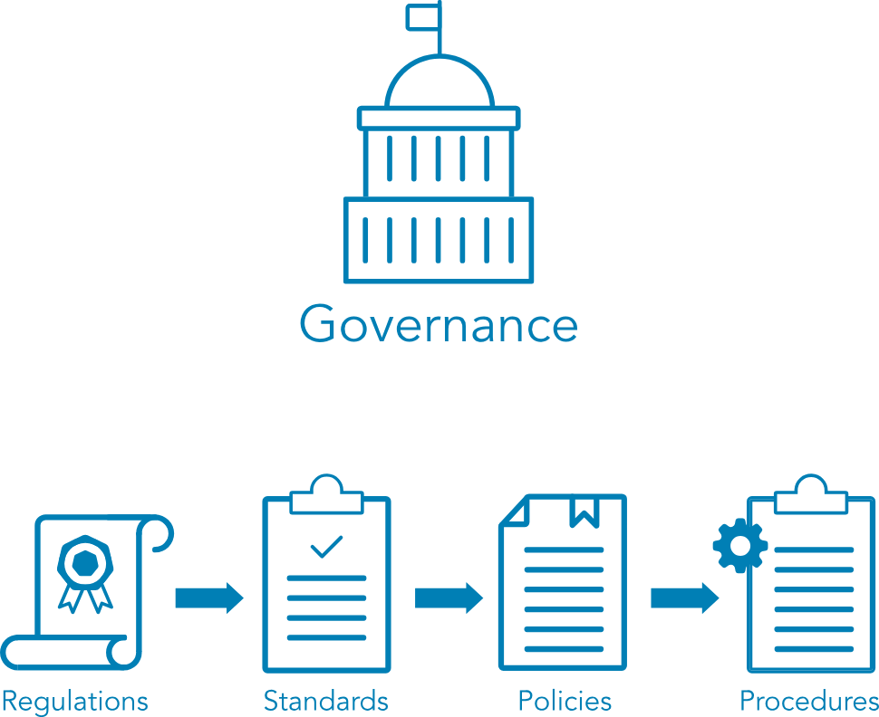

- [Introduction](#introduction)
- [Information Assurance](#information-assurance)
  - [CIA Triads](#cia-triads)
  - [R The CIA Triad](#r-the-cia-triad)
  - [R CIA Triad Deep Dive: Confidentiality](#r-cia-triad-deep-dive-confidentiality)
  - [R CIA Triad Deep Dive: Integrity](#r-cia-triad-deep-dive-integrity)
  - [R CIA Triad Deep Dive: Availability](#r-cia-triad-deep-dive-availability)
  - [V Identification](#v-identification)
  - [R Authentication](#r-authentication)
  - [V Multifactor Authentication or Single Factor Authentication](#v-multifactor-authentication-or-single-factor-authentication)
  - [R Methods of Authentication](#r-methods-of-authentication)
  - [R Non-repudiation](#r-non-repudiation)
  - [R Privacy](#r-privacy)
  - [Self Check: Security Concepts](#self-check-security-concepts)
- [Risk Mitigation Process](#risk-mitigation-process)
  - [R Module Overview](#r-module-overview)
  - [R Risk Management Terminology](#r-risk-management-terminology)
  - [R Threats](#r-threats)
  - [V Threats](#v-threats)
  - [R Vulnerabilities](#r-vulnerabilities)
  - [V Vulnerabilities](#v-vulnerabilities)
  - [R Reading Likelihood](#r-reading-likelihood)
  - [V Likelihood](#v-likelihood)
  - [Risk – Concepts and Definitions](#risk--concepts-and-definitions)
  - [V Risk Management](#v-risk-management)
  - [R Risk Identification](#r-risk-identification)
  - [R Risk Assessment](#r-risk-assessment)
  - [R Risk Treatment](#r-risk-treatment)
  - [Self Check: Risk Terms](#self-check-risk-terms)
  - [R Risk Priorities](#r-risk-priorities)
  - [R Risk Tolerance](#r-risk-tolerance)
- [Security Controls](#security-controls)
  - [V - Security Controls](#v---security-controls)
  - [R - What are Security Controls?](#r---what-are-security-controls)
  - [R - Physical Controls](#r---physical-controls)
  - [R - Technical Controls](#r---technical-controls)
  - [R - Administrative Controls](#r---administrative-controls)
  - [Self Check: Security Controls](#self-check-security-controls)
- [Governance](#governance)
  - [V - Governance](#v---governance)
  - [R - Governance Elements](#r---governance-elements)
  - [R - Governance Elements: Regulations and Laws](#r---governance-elements-regulations-and-laws)
  - [R - Governance Elements: Standards](#r---governance-elements-standards)
  - [R - Governance Elements: Policies](#r---governance-elements-policies)
  - [R - Governance Elements: Procedures](#r---governance-elements-procedures)
- [ISC2 Code of Ethics](#isc2-code-of-ethics)
  - [V - ISC2 Code of Ethics](#v---isc2-code-of-ethics)
  - [R - Professional Code of Conduct](#r---professional-code-of-conduct)
  - [Self Check: Applying the Code](#self-check-applying-the-code)
- [Security Principles Review](#security-principles-review)
  - [V - Chapter Review](#v---chapter-review)
  - [R - Course Summary](#r---course-summary)
  - [R - Terms and Definitions](#r---terms-and-definitions)
  - [V - Security Principles Quiz](#v---security-principles-quiz)

## Introduction

## Information Assurance

### CIA Triads
non-repudiation: A term that has its roots in the legal world. To repudiate something means to deny something. We're saying non deniability. 

CIA triad (Confidentiality, Integrity and Availability) These are concepts that help shape our thinking. We can think of these almost as lenses that we can look through when we're working on a project or when we're considering the cybersecurity environment. 
It helps us maintain a balance between some of the different elements, some of which are often overlooked. If we think about cybersecurity, it may be that we go to things like encryption, firewalls, things that primarily perhaps relate to confidentiality in our mind, helping protect access to documents or information. But we have integrity and availability which carry equal weight just as important. As we look at each of these three concepts, I'd like you to think about the fact that they relate both to the logical or technical environment when we're working on computer systems, for example. But they also relate to a physical environment. 

We're using logical and technical as terms interchangeably to mean something computer-based and physical, something in the real-world, something tangible. 

- confidentiality. Confidentiality we're protecting an asset which could be hardware, software, or information. There on this slide we're talking about data. Protecting the **data that needs controlled access**, needs restricting. What we're trying to do is to **prevent unauthorized access**, authorized and unauthorized. Those two words imply a decision is taking place. 
  - Something is acting to control the access. Now this might be in the physical world. For example, a security guard or a receptionist determining who enters a building. It could be some authentication system or password, for example, checking that you have the authority. Or maybe file permissions. With confidentiality, we have just given some examples of confidentiality and how it impacts both the real-world and also that logical technical environment. 
- Integrity is about ensuring that the data has not been altered by somebody that has no authorization to do so. 
Again, we're talking about a decision point. Integrity is **about controlling change**. If we think about confidentiality as the ability to read, integrity, often we think about as writing or changing something. Let's change, it could be accidental. Accidental change. Because a disk has been corrupted, for example. That's an unauthorized change. 
There's no malicious notice in that necessarily it could be accidental, or it could be deliberate. It could be somebody looking to falsify a record, for example. What we're trying to do is to prevent unauthorized accidental or unauthorized to deliberate changes usually to our information, to our assets. It could be a software configuration, it could be a piece of hardware. But we're trying to control that change. Often again, we think about data. 
- availability: Here we're saying systems need to be available to those subjects, to those people that are authorized to use them. They have to be available when and where needed in the form and format that is required. It's not just about restricting access. The opposite is true as well. 
  - We need to provide access to those people that need the service. If you work in the health care environment, for instance, you might need patient data to provide effective treatment, and it might have to be provided quickly, effectively and in a particular format. These are concepts that help shape our thinking. 

### R The CIA Triad
To define security, it has become common to use Confidentiality, Integrity and Availability, also known as the CIA triad. The purpose of these terms is to describe security using relevant and meaningful words that make security more understandable to management and users and define its purpose. 
- Confidentiality relates to permitting authorized access to information, while at the same time protecting information from improper disclosure. 
- Integrity is the property of information whereby it is recorded, used and maintained in a way that ensures its completeness, accuracy, internal consistency and usefulness for a stated purpose. 
- Availability means that systems and data are accessible at the time users need them. 

### R CIA Triad Deep Dive: Confidentiality
Confidentiality is a **difficult balance to achieve when many system users are guests or customers**, and it is not known if they are accessing the system from a compromised machine or vulnerable mobile application. So, the security professional’s obligation is to **regulate access—protect the data** that needs protection, yet permit access to authorized individuals.

**Personally Identifiable Information (PII)** is a term related to the area of confidentiality. It pertains to **any data about an individual that could be used to identify them**. Other terms related to confidentiality are **protected health information (PHI)** , which is information regarding one’s health status, and classified or sensitive information, which includes trade secrets, research, business plans and intellectual property.

Another useful definition is **sensitivity**, which is a **measure of the importance assigned to information by its owner**, or the purpose of denoting its need for protection. **Sensitive information is information that if improperly disclosed (confidentiality) or modified (integrity) would harm an organization or individual**. In many cases, sensitivity is related to the harm to external stakeholders; that is, people or organizations that may not be a part of the organization that processes or uses the information.

### R CIA Triad Deep Dive: Integrity
Integrity measures the **degree to which something is whole and complete**, internally consistent and correct. The concept of integrity applies to:
- information or data
- systems and processes for business operations
- organizations
- people and their actions

Data integrity: is the assurance that data has not been altered in an unauthorized manner. This requires the protection of the data in systems and during processing to ensure that it is free from improper modification, errors or loss of information and is recorded, used and maintained in a way that ensures its completeness. Data integrity **covers data in storage, during processing and while in transit**.

Information must be accurate, internally consistent and useful for a stated purpose. The **internal consistency of information ensures that information is correct on all related systems so that it is displayed and stored in the same way on all systems**. Consistency, as part of data integrity, requires that all instances of the data be identical in form, content and meaning.

System integrity refers to the maintenance of a known good configuration and expected operational function as the system processes the information. Ensuring integrity begins with an awareness of state, which is the current condition of the system. Specifically, this **awareness concerns the ability to document and understand the state of data or a system at a certain point, creating a baseline**. For example, a baseline can refer to the current state of the information—whether it is protected. Then, to preserve that state, the information must always continue to be protected through a transaction.

Going forward from that baseline, the integrity of the data or the system can always be ascertained by comparing the baseline with the current state. If the two match, then the integrity of the data or the system is intact; if the two do not match, then the integrity of the data or the system has been compromised. Integrity is a primary factor in the reliability of information and systems.

The need to safeguard information and system integrity may be dictated by laws and regulations. Often, it is dictated by the needs of the organization to access and use reliable, accurate information.

### R CIA Triad Deep Dive: Availability
Availability can be defined as 
1. timely and reliable access to information and the ability to use it
2. for authorized users, timely and reliable access to data and information services.

The core concept of **availability is that data is accessible to authorized users when and where it is needed and in the form and format required**. This does not mean that data or systems are available 100% of the time. Instead, the systems and data meet the requirements of the business for timely and reliable access.

**Some systems and data are far more critical than others, so the security professional must ensure that the appropriate levels of availability are provided**. This requires consultation with the involved business to ensure that **critical systems are identified and available**. Availability is often associated with the term criticality, because it represents the importance an organization gives to data or an information system in performing its operations or achieving its mission.

### V Identification
- identification is before we give credentials out. Once you have proved you are who you say you are, then credentials may be issued. 
- each situation may require a different level of confidence or different level of assurance which drives the type of process, the identity proofing process. 
- there are three commonly accepted security factors. Something you know, something you have, and something you are. 
  
- something you know. Something you know would be a username. Your username is something that you know, that you remember. Your password is an example of something that you remember. Equally, if you have a bank card, when you take money out, you have a pin number. Again, an example of something you know. If you have multiple instances of the same type, so let's say to login to your banking website, you have a username, a password, and a pin number, three different things, they are all something you know. 
So this would be using one authentication factor. Even though it's three separate things, they are all of the same type. This would constitute single factor authentication. Something you have is a token of some kind that you have physically with you. It could be a USB key, it could be an authenticator app. Many of the big tech companies have Authenticator apps that runs on your smart phone, your cell phone. It could be a traditional ID badge. 
Before computers existed, To gain access to a secure site, you presented your ID badge, maybe with a photograph of you. Modern ID badges tend to have some kind of radio-frequency identification embedded within them as well. That's a way of authentic, authenticating yourself to gain access to a site. Using your ID badge it's another example of something you have these door entry systems where you swipe your card that's allowing access. It identifies you to authenticate you rather when you access by you presenting the badge. That's an example of something you have. Something you are, we're talking about biometrics. 
The word bio-metric, if we break that word down, bio, biological, metric, measure, a biological measure. There are lots of different biological traits that we can measure. Over the past 10 years, this has been very commonly accepted. Biometrics has been around for a long time, but it wasn't used commonly until smartphones started to commoditize it. They've made it very easily accessible. We started to see things like fingerprint recognition on smartphones, maybe 6, 7 years ago. Very commonplace now. 
More recently, big investments, big use of facial recognition. This use is being spread, all of the technologies are being used, not just in these mobile computing platforms, but elsewhere as well, in CCTV cameras systems, in social media platforms. Some very obvious questions start to arise. Just because we can do something technically, is it ethical? Are there any privacy implications? How comfortable are you with a social media platform allowing people to identify you? Because there are a number of social media platforms available that allow you to try and identify somebody from a photograph. 
These aren't the biggest social media platforms, these are some of the smaller ones, but these services exist. Is it ethical? Is it right to be able to look up somebody's name from their face? How comfortable are you with the prospect of somebody holding onto the ability to recognize you from your biological traits? Now, most biological systems don't actually store your fingerprint or the face itself. What they do is make a digital representation, a digital map. There on the right, the image you can see shows a number of lines between common features on the face, between eyes, nose, mouth, and those measurements can be stored. 
If you add them up or multiply them, it will form some numerical representation of you that is relatively unique. The same is true with fingerprints. Iris scanning measures the unique pattern of the colored circle around your retina. Retinal scanning shines a light into your eye, usually an LED light source into your eye, illuminating the blood vessels on the back of your eyeball, and this vascular pattern is unique. There are a variety of other biological traits. What we want to think about, and we'll come back to this later in the course, are things like how acceptable the bio-metric measure is, what kind of throughput it could offer, how fast it works, how invasive it is. Retina scanning tends to be very slow and tends to be very invasive shining, you have to move your eye up to a scanner, it shines a light into your eye, it's not always comfortable. 
On smart phones, cell phones, these biometric systems tend to be less invasive. We will come back and look at biometrics later in the course. For now, just be aware that there are wider issues around the use of biometrics. One last thing on biometrics before we move forward. With passwords and tokens, whether or not you are authenticated is a binary decision, it's yes or no. With biometrics, it's much more about a judgment, it's much more analog. Because of those measurements on the face, if your face is at a slightly different angle or there is some change in your fingerprints, may be your skin wrinkles when it becomes wet, there is a fuzziness to this. 
How tight your presented assertion when you present your fingerprint or face to be scanned, how close that has to be against the template that you registered depends on the level of assurance that's needed, again, that level of confidence. Maybe on some systems, a degree of fuzziness is okay. If your fingerprint is slightly different, it's okay. Where in a military environment, maybe it's better to reject a valid login if there's not enough certainty. We'll talk about false acceptance rates and false rejection rates later in another chapter. Now, we mentioned using any one of these three factors is known as single factor authentication. If we use more than one, it becomes multi-factor authentication. 
If we use two or more, we're talking about multi-factor authentication. 

### R Authentication
When users have stated their identity, it is necessary to validate that they are the rightful owners of that identity. This process of verifying or proving the user’s identification is known as authentication. Simply put, authentication is a process to prove the identity of the requestor.
- There are three common methods of authentication:
- Something you know: Passwords or paraphrases
- Something you have: Tokens, memory cards, smart cards
- Something you have: Biometrics , measurable characteristics

### V Multifactor Authentication or Single Factor Authentication
think about this. Let's just remind ourselves then if your bank asks you when you try to log in for a user name for some digits from a passcode for a password, it's asking for three things your user name digits from a passcode and your password. Would we say that this is multi factor authentication? No, absolutely not. Why not? Because all three things it's asking for are of the same factor. If we use two factors, two of the three factors, it's commonly known as dual factor authentication or two factor authentication or two F. 
A more commonly. Now if you use two or three of these factors it is referenced as multi factor authentication but you will still hear two f a dual factor authentication for two of the three factors but it's more common to see multi factor authentication. If you have an authenticator app or a cell phone that's registered as a token. When you log in, you might receive a one time code. So a one time password is not an authentication factor. It is a password that works one time it's some kind of code that works just once. It's a single use credential but it is commonly used with multi factor authentication. 
It is commonly used with these tokens. You have something like an authenticator app. You log into a website with your user name with your password and then it will send you a one time code and it's sending you that one time code to your smartphone to your authenticator app to prove that you actually have that token physically with you. So the one time password is checking that you actually have something with you, that there's something you have. We've said some considerations are throughput acceptability and accuracy, but above all of these is making sure that the authentication system, the biometric system, whatever system we implement it has to meet the security needs of the of the implementation first and foremost. So those those three things are considerations how fast something works, how acceptable it is, how accurate it is. But our overriding main concern is making sure that what we have meets our security needs first and foremost. 
But those other items are still important considerations. I mentioned non repudiation and I said that this was a legal term and as a legal term it's existed for for a long time and it's about making sure that whoever signs a contract cannot deny having done so. So it's about particularly about performing transactions with confidence to repudiate, means to deny you sell your property to somebody and then you deny having sold it. We have a problem. And so the legal world has addressed this for very formal transactions. So non repudiation or non deniability, we could think of it as meaning non deniability applies to the modern technical world. Why? 
Well, because we are also performing transactions, if somebody sends an email to me, I want some proof, some assurance, some confidence that it has actually come from who has claimed to have sent it, that it's not been spoofed or faked. So this commonly we see non repudiation around email around online transactions. It's quite a big topic in online e commerce sites for that reason, making sure that if somebody performs a financial transaction that that is actually the right person. And again, we'll look at some of the technologies related to this as we progress through the remainder of the course, just as we move towards the end of our first module, let's look at privacy a really big topic right now and one that's worth investing some time in becoming familiar with because it is becoming a bigger topic rather than a smaller topic. It's something that is so important. Let's look at what privacy is. Is privacy a right do we have a right to privacy? 
Privacy is a fundamental right Eight. The United Nations Declaration of Human Rights in 1948 said no one shall be subject to arbitrary interference with his or her privacy or their privacy, their family, their home or correspondence, nor to attacks upon their honor and reputation. Everyone has the right to the protection of law against such interference or attacks, privacy is a fundamental right essential to autonomy to the protection of human dignity, serving as a foundation upon which many other human rights are built and technology has always been intertwined with this right. Our capabilities to protect privacy are often rooted in the in the technical world. But so are some of the things that potentially could undermine privacy. Our capabilities exist for surveillance to store huge amounts of data, biometric information about individuals. That means that means that privacy could also be very easily eroded. 
What we want to think about specifically within privacy as well as again as we progress through the course is something we call P. I. I. P. I. I is personally identifiable information. So this is a type of private information related to an individual. 
It's information that could be used to identify you or me. Things like name, photo or passport, passport number, would all constitute P. Ii? They would all be classed as P II. Why? Well, my name may not be globally unique, but it could still be used to identify me, my image, my passport number, my telephone number and so on. So this is about trying to balance protecting the needs of society, of many people against the needs of the individual, our individual right to privacy, but also we have law enforcement agencies that need to operate that need to help prevent crime. 
And what you'll see is a balance different perspectives globally around whether you protect the individual or whether you try to protect society. And I'm not saying either approach is right or wrong. There is a very broad spectrum of approaches, some more balanced, more geared towards protecting society, more authoritarian, some more geared towards protecting the individual. But this tension continues to play out and you see it in court cases in europe, you see it in court cases globally. 

### R Methods of Authentication
There are two types of authentication. Using only one of the methods of authentication stated previously is known as `single-factor authentication (SFA)` . Granting users access only after successfully demonstrating or displaying two or more of these methods is known as `multi-factor authentication (MFA)` . 
Common best practice is to implement at least two of the three common techniques for authentication: 
- Knowledge-based 
- Token-based 
- Characteristic-based  

Knowledge-based authentication uses a passphrase or secret code to differentiate between an authorized and unauthorized user. If you have selected a personal identification number (PIN), created a password or some other secret value that only you know, then you have experienced knowledge-based authentication. The problem with using this type of authentication alone is that it is often vulnerable to a variety of attacks. For example, the help desk might receive a call to reset a user’s password. The challenge is ensuring that the password is reset only for the correct user and not someone else pretending to be that user. For better security, a second or third form of authentication that is based on a token or characteristic would be required prior to resetting the password. 

The combined use of a user ID and a password consists of two things that are known, and because it does not meet the requirement of using two or more of the authentication methods stated, it is not considered MFA. 

### R Non-repudiation
Non-repudiation is a legal term and is defined as the **protection against an individual falsely denying having performed a particular action**. It provides the capability to determine whether a given individual took a particular action, s**uch as created information, approved information or sent or received a message**.

In today’s world of e-commerce and electronic transactions, there are opportunities for the impersonation of others or denial of an action, such as making a purchase online and later denying it. It is important that all participants trust online transactions. Non-repudiation methodologies ensure that people are held responsible for transactions they conducted. 

### R Privacy
- Privacy is the right of an individual to control the distribution of information about themselves. 
- While `security` and `privacy` both focus on the protection of personal and sensitive data, there is a difference between them. With the increasing rate at which data is collected and digitally stored across all industries, the push for privacy legislation and compliance with existing policies steadily grows. In today’s global economy, privacy legislation and regulations on privacy and data protection can impact corporations and industries regardless of physical location. Global privacy is an especially crucial issue when considering requirements regarding the collection and security of personal information. There are several laws that define privacy and data protection, which periodically change. Ensuring that protective security measures are in place is not enough to meet privacy regulations or to protect a company from incurring penalties or fines from mishandling, misuse, or improper protection of personal or private information. An example of a law with multinational implications is the European Union’s General Data Protection Regulation (GDPR) which applies to all organizations, foreign or domestic, doing business in the EU or with its citizens. Companies operating or doing business within the United States may also fall under several state legislations that regulate the collection and use of consumer data and privacy. Likewise, member nations of the EU enact laws to put GDPR into practice and sometimes add more stringent requirements. These laws, including national- and state-level laws, dictate that **any entity anywhere in the world handling the private data of people in a particular legal jurisdiction must abide by its privacy requirements**. As a member of an organization's data protection team, you will not be required to interpret these laws, but you will need an understanding of how they apply to your organization.

### Self Check: Security Concepts

## Risk Mitigation Process 

### R Module Overview
- This module gets you started by presenting foundational terminology and introducing you to the risk management process.
- First, a definition of  risk  is  a measure of the extent to which an entity is threatened by a potential circumstance or event. It is often expressed as a combination of:
  - the adverse impacts that would arise if the circumstance or event occurs,  and 
  - the likelihood of occurrence. 
- Information security risk reflects the potential adverse impacts that result from the possibility of unauthorized access, use, disclosure, disruption, modification or destruction of information and/or information systems. This definition represents that risk is associated with threats, impact and likelihood, and it also indicates that IT risk is a subset of business risk. 

### R Risk Management Terminology
- Security professionals use their knowledge and skills to examine operational risk management, determine how to use risk data effectively, work cross-functionally and report actionable information and findings to the stakeholders concerned. Terms such as threats, vulnerabilities and assets are familiar to most cybersecurity professionals.
   - An asset is something in need of protection.
   - A vulnerability is a gap or weakness in those protection efforts.
   - A threat is something or someone that aims to exploit a vulnerability to thwart (frustrate) protection efforts.
- Risk is the intersection of these terms. Let's look at them more closely.

### R Threats

- A threat is a person or thing that takes action to exploit (or make use of) a target organization’s system vulnerabilities, as part of achieving or furthering its goal or objectives. To better understand threats, consider the scenario in the video on the next page.
- In the context of cybersecurity, typical threat actors include the following:
   - Insiders (either deliberately, by simple human error, or by gross incompetence).
   - Outside individuals or informal groups (either planned or opportunistic, discovering vulnerability).
   - Formal entities that are nonpolitical (such as business competitors and cybercriminals).
   - Formal entities that are political (such as terrorists, nation-states, and hacktivists).
   - Intelligence or information gatherers (could be any of the above).
   - Technology (such as free-running bots and artificial intelligence , which could be part of any of the above).

*Threat Vector: The means by which a threat actor carries out their objectives.

### V Threats
Tourists are popular targets for pickpockets. 
- The existence of pickpockets in a crowded tourist spot is a **threat** to the people gathered there. 
- That threat applies to everyone in the vicinity, even other pickpockets, if you are in the vicinity and a pickpocket has identified you as a target, you are facing a **threat actor**, whether you know it or not. 
- The approach and technique taken by the pickpocket is their **threat vector**. 

### R Vulnerabilities
A vulnerability is an **inherent weakness or flaw in a system or component**, which, if triggered or acted upon, could cause a risk event to occur. Consider the pickpocket scenario on the next page.

An organization’s **security team strives to decrease its vulnerability**. 
- To do so, they **view their organization with the eyes of the threat actor**, asking themselves, “Why would we be an attractive target?” The answers might provide steps to take that will discourage threat actors, cause them to look elsewhere or simply make it more difficult to launch an attack successfully. 
- For example, to protect yourself from the pickpocket, you could carry your wallet in an inside pocket instead of the back pant pocket or behave alertly instead of ignoring your surroundings. Managing vulnerabilities starts with one simple step: **Learn what they are**.
- Which vulnerabilities my system has?

### V Vulnerabilities
Let's say the pickpocket chooses you as a target because they see that it will be easier or more profitable to steal from you. 
- Vulnerabilitie: Maybe you are distracted, have jewelry that is easy to snatch or appear weak and less likely to put up a struggle. 
- In other words, you appear more vulnerable than the other tourists, and the pickpocket feels that they can exploit that vulnerability or weakness. 

### R Reading Likelihood
When determining an organization’s vulnerabilities, **the security team will consider the probability**, or likelihood, **of a potential vulnerability being exploited within the construct of the organization’s threat environment**. 
- Likelihood of Occurrence is a weighted factor based on a subjective analysis of the probability that a given threat or set of threats is capable of exploiting a given vulnerability or set of vulnerabilities.

Finally, the security team will consider the likely results if a threat is realized and an event occurs. **Impact** is the **magnitude of harm that can be expected** to result from the consequences of unauthorized disclosure of information, unauthorized modification of information, unauthorized destruction of information, or loss of information or information system availability.

 Think about the impact and the chain of reaction that can result when an event occurs by revisiting the pickpocket scenario on the next page.

### V Likelihood
How do the pickpockets actions affect your ability to continue your journey? If you appear to be a weak target, and the pickpocket chooses to take your money by brute force, Will you be able to obtain more cash to complete your vacation or even return home? The downstream impact must also be considered. What if you are injured and require medical treatment or even hospitalization? **Impact does not often stop with the incident itself**. 

### Risk – Concepts and Definitions
- Threat: Thing that can cause harm. 
  - A lighting.
- Risk: Possibility of something bad happening.
  - The lightinh struck on someone
- Vulnerabilities: A weakness that increaes the likelihood of the risk materializing or increase impact.
  - Someone was under a tree
- Likelihood: Probability

### V Risk Management
- Risk appetite: the amount of risk an organization is willing to accept to achieve its objectives, balancing potential rewards against potential losses.
- Risk Management responses: There are 4 valid responses
  - Accept (less common): you can choose to accept the risk if it's within your risk appetite or the extreme opposite of that is the risk is too high. It is outside of your risk appetite or your risk tolerance. There is too bigger a risk of, let's say an earthquake occurring, therefore we are going to close that building down. We're going to avoid the risk by not doing the activity, by not locating in that area or whatever. 
  - Avoid (less common): To do nothing to not be in risk
  - Reduce(mitigate) (More common): We can reduce risks. We can manage those risks and reduce the level of either the likelihood or the impact or both through the use of controls. The word reduce is the International Standards Organization, ISO, that's their terminology in risk management. Old term was `mitigate` but that implies that the risk is gone, and that never happen.
  - Share (transfer) (More common): Old term was `transfer`, that never happen. But if you have insurance you share the risk of a car accident with a company.
- Ignoring a risk is not the same as chossing to accept a risk (should never do).
  - Ignoring it is pretending it's not there. That's not a good response. The role of security in risk management then is to help with the risk assessment, to help recommend risk management responses.
- The role of security in risk management.

### R Risk Identification
- In the world of cyber, identifying risks is not a one-and-done activity. It’s a recurring process of identifying different possible risks, characterizing them and then estimating their potential for disrupting the organization.  
- It involves looking at your unique company and analyzing its unique situation. **Security professionals know their organization’s strategic, tactical and operational plans**.
- Takeaways to remember about risk identification:
  - Identify risk to communicate it clearly. 
  - Employees at all levels of the organization are responsible for identifying risk.
  - Identify risk to protect against it. 
- As a security professional, you are likely to assist in risk assessment at a system level, focusing on process, control, monitoring or incident response and recovery activities. If you’re working with a smaller organization, or one that lacks any kind of risk management and mitigation plan and program, you might have the opportunity to help fill that planning void.

### R Risk Assessment
Risk assessment: is defined as the **process of identifying, estimating and prioritizing risks to an organization’s operations** (including its mission, functions, image and reputation), assets, individuals, other organizations and even the nation. Risk assessment should result in aligning (or associating) each identified risk resulting from the operation of an information system with the goals, objectives, assets or processes that the organization uses, which in turn aligns with or directly supports achieving the organization’s goals and objectives. 

A common risk assessment activity identifies the risk of fire to a building. While there are many ways to mitigate that risk, the **primary goal of a risk assessment is to estimate and prioritize**. For example, fire alarms are the lowest cost and can alert personnel to evacuate and reduce the risk of personal injury, but they won’t keep a fire from spreading or causing more damage. Sprinkler systems won’t prevent a fire but can minimize the amount of damage done. However, while sprinklers in a data center limit the fire’s spread, it is likely they will destroy all the systems and data on them. A gas-based system may be the best solution to protect the systems, but it might be cost-prohibitive.** A risk assessment can prioritize** these items for management **to determine the method of mitigation that best suits the assets being protected.** 

The result of the risk assessment process is often documented as a report or presentation given to management for their use in prioritizing the identified risk(s). This report is provided to management for review and approval. In some cases, management may indicate a need for a more in-depth or detailed risk assessment performed by internal or external resources.  

### R Risk Treatment
- **Risk treatment relates to making decisions about the best actions to take regarding the identified and prioritized risk.** The decisions made are dependent on the attitude of management toward risk and the availability — and cost — of risk mitigation. The options commonly used to respond to risk are:
  - Avoidance: Risk avoidance is the decision to attempt to eliminate the risk entirely. This could include ceasing operation for some or all of the activities of the organization that are exposed to a particular risk. Organization leadership may choose risk avoidance when the potential impact of a given risk is too high or if the likelihood of the risk being realized is simply too great.
  - Acceptance: Risk acceptance is taking no action to reduce the likelihood of a risk occurring. Management may opt for conducting the business function that is associated with the risk without any further action on the part of the organization, either because the impact or likelihood of occurrence is negligible, or because **the benefit is more than enough to offset that risk**.
  - Mitigation: Risk mitigation is the **most common** type of risk management and includes taking actions to prevent or reduce the possibility of a risk event or its impact. Mitigation **can involve remediation measures, or controls, such as security controls, establishing policies, procedures, and standards to minimize adverse risk**. Risk cannot always be mitigated, but mitigations such as safety measures should always be in place.
  - Transfer: Risk transference is the practice of **passing the risk to another party**, who will accept the financial impact of the harm resulting from a risk being realized in exchange for payment. Typically, this is an insurance policy.

### Self Check: Risk Terms  

### R Risk Priorities
When risks have been identified, it is **time to prioritize and analyze core risks through qualitative risk analysis and/or quantitative risk analysis**. This is necessary to determine root cause and narrow down apparent risks and core risks. Security professionals work with their teams to conduct both qualitative and quantitative analysis. 

Understanding the **organization’s overall mission and the functions that support the mission helps to place risks in context**, determine the root causes and prioritize the assessment and analysis of these items. In most cases, management will provide direction for using the findings of the risk assessment to determine a prioritized set of risk-response actions.

One effective method to prioritize risk is to use a risk matrix, which helps identify priority as the intersection of likelihood of occurrence and impact. It also gives the team a common language to use with management when determining the final priorities. For example, a low likelihood and a low impact might result in a low priority, while an incident with a **high likelihood and high impact will result in a high priority**. Assignment of priority may relate to business priorities, the cost of mitigating a risk or the potential for loss if an incident occurs.

### R Risk Tolerance
The perception management takes toward risk is often likened to the entity’s appetite for risk. How much risk are they willing to take? Does management welcome risk or want to avoid it? **The level of risk tolerance varies across organizations, and even internally**: Different departments may have different attitudes toward what is acceptable or unacceptable risk. Understanding the organization and senior management’s attitude toward risk is usually the starting point for getting management to take action regarding risks.

- **Executive management and/or the Board of Directors determines what is an acceptable level of risk for the organization**. 
  - Security professionals aim to maintain the levels of risk within management’s limit of risk tolerance.

Often, risk tolerance is dictated by geographic location. For example, companies in Iceland plan for the risks that nearby volcanoes impose on their business. Companies that are outside the projected path of a lava flow will be at a lower risk than those directly in the path’s flow. Similarly, the likelihood of a power outage affecting the data center is a real threat in all areas of the world. In areas where thunderstorms are common, power outages may occur more than once a month, while other areas may only experience one or two power outages annually. Calculating the downtime that is likely to occur with varying lengths of downtime will help to define a company’s risk tolerance. If a company has a low tolerance of the risk of downtime, they are more likely to invest in a generator to power critical systems. A company with an even lower tolerance for downtime will invest in multiple generators with multiple fuel sources to provide a higher level of assurance that the power will not fail.

## Security Controls

### V - Security Controls
- And this is our very next module, module three. So we will look at how controls operate, what a control is in effect. And then we will look at the three types of control. All modern security frameworks, break controls up into three types and we've looked already at physical and logical but there is a third type of control, administrative controls. And these are controls that tell people how to behave. Part of our governance policies, procedures and so on. And it's not the case that we use any one of these control types. 

- We actually layer them. There is an interdependency. It's not usually enough to have just administrative controls or just physical controls or just logical controls. Just think if you had a data center and your data center had lots of really good logical controls, lots of very good technical protections, firewalls, antivirus and so on. But there was no lock on the door. Anybody passing by your building could go in and out if you have zero physical controls. Even if you've got very good technical controls, There is still a significant risk. 

- So usually we need a balance between the two or a balance between the three factoring in the administrative controls, we tell people what to do, but people always don't don't always do what they are told to do. They might forget, make a mistake or intentionally behave in a different way. So it's not enough to have administrative controls. So we layer these three control types, we use a combination of them and that kind of relates back to multifactor authentication. The reason you you combine the different factors is because it's harder to attack a combination of factors instead of using one factor like something you know, three times it's much stronger to use three different types. Same is true here in terms of controls. Were using different types of controls in combination so a control helps to affect an outcome in the real world. 

- You have a remote control for your television, it affects an outcome. And what we're trying to do is to detect correct, prevent or reduce a risk to affect that that outcome somehow controls and control activity follow on from our risk management and we have a risk based approach to security. Therefore this control activity is really important now and it's part of all major cybersecurity frameworks and we have three listed there. So so 27,001 the international standards organization offer a certification for companies they can choose to to meet. And 27,001 has a requirement for a risk assessment risk management. And then depending on your risk management, what you say your risk management affect how you use controls and 27,001 has over 100 controls that it suggests you respond to. For example, do you synchronize time on your on your network, Do you do background checks for employees? 

- Lots of different controls that it asked you to think about. Control objectives in IT COBIT is managed by Osaka. Osaka as an organization grew out of audit. So when finance systems were paper based There were controls to manage the accuracy of finance data. When computers started to sort store finance data in the 1960s 70's at that point auditors realized that we needed to control our IT environment. We need to protect and control our IT environment and the control objectives in IT. We're an extension of that kind of financial audit, financial audit. 

- And again it contains a list of controls that we have to consider that we should consider as an organization. NIST, the National Institute for Science and Technology is the US based Organization that provides two really important sets of documents. The Special Publications SP. The Special Publications in the 800 series. And also they produce the federal information processing standards Phipps. And if you are a federal US agency, a government agency, a national government agency in America then you have to follow their guidance. You don't have any choice. 

- But the great thing about Nist is all of their guidance is available on their website. It is very easy to read and understand and it is free of charge. The price is zero. So this guidance I use extensively. It is very well known worldwide and on the right in the image there you see a QR code for one of the special publication documents sp 800-53. This is one of the most well known documents produced by Nist and it contains again their their control activity. Their recommendations for control activity. 

- So they go three different approaches to cybersecurity, three different frameworks, all of which are risk based, all of which require you to undertake control activity to manage your risk. Security controls then help to manage the risk by reducing the risk to a level that is acceptable, they lower the risk, very rarely do they lower it to zero. Usually there is some risk remaining, we call that residual risk, residual risk is the risk that remains after we have applied these security controls. And what we're looking to do is to decide whether the benefit from a control is worthwhile given the, given its cost. So the cost versus the benefit. For example, if we had a data center in the basement of a building And once a year it flooded and the flood caused $10,000 worth of damage. So the flooding happens once each year and causes $10,000 worth of damage. 

- If we could buy a pump that completely mitigated, reduced the risk to zero of flooding as soon as it detected water, it would pump the water away If that pump cost $20,000 a year to install and maintain, would we buy it Well in this example? Maybe not the cost of the control is $20,000 a year. The benefit that it gives is only $10,000 a year. So it depends, that's a really basic example. There would be other factors the disruption of the flood. If it if it causes $10,000 worth of damage. Those systems are likely to be offline. 

- The damage to our reputation of being offline. So that that was a really simple example. But we do think about the cost of the control versus its benefit and that judgment over whether to adopt control or not. That judgment in terms of how we manage the control we said is made by the leadership within the organization, by those C level officers and the security controls. We see they're just broken up into those three groupings. Administrative controls, physical and technical. Let's take a look at each of the types. 

- So controls relating to the administrative category. These are telling people how to behave. We have policies, procedures, guidelines, standards, policies are a high level statement, procedures are step by step, instructions on how to do something, guidelines or recommendations. With guidelines. Think about the word, you should you should do these things standards. The word to remember is must standards say you must do something, guidelines are just recommendations. Standards we have to follow. 
And are these controls enough in isolation. Could we just rely on administrative controls? Absolutely not. People forget people deliberately undermine controls. I've seen an argument. I've found somebody behaving in a way that breached policy and I said why are you doing this? And their answer was Well, my way of doing it is better. 

- And that may be that the kind of thinking people may not be aware of the reason for a policy or procedure to exist. A good policy will say what you're doing, but also will explain why to help generate buy in so that people understand they're more likely to comply with it if they understand. But administrative policies are not effective in isolation. We don't consider consider them to be effective in isolation. It doesn't mean they have no value. They're really important. They say what we do and then we try to make sure that we're doing what we say we do. 

- So this is the starting point for governance. This is what we do as an organization. This is how we behave. We then use physical and logical controls to enforce those behaviors. Physical controls often secure access to something, for example, a door in offense controls, access to a site, the door in a safe. It's a gap in a secure perimeter that controls access. So physical access control systems, door entry systems, CCTV systems, alarm systems are all examples of physical controls. 

- And again, really good physical security isn't enough. If we had good administrative controls. Good physical controls. Well that's great, but we still need technical controls. Just think if you had a data center that was very well guarded that had good procedures, policies surrounding its use surrounding its use what if it's connected to the internet without a firewall without any protection technically or logically it's going to face significant risks. So again, administrative, physical and logical used to be need to be used in combination for our technical or logical controls. Then things like encryption. 

- Endpoint security. Endpoint security is a more modern phrase for antivirus. Antivirus is protecting just against viruses. Modern endpoint detection and response systems E D R. They provide protection for network threats, ransomware malware viruses not just for viruses. So the term you'll hear commonly is either endpoint security or e D R. Endpoint detection and response clustering. 

- Getting systems to work together in combination to provide more resilience and we can think about some controls as being preventative of firewall we can think about as being preventative. It prevents somebody breaking into our network. But also if there is a problem, it might also be in part detective. The same is true of antivirus type products they might help prevent, they might help detect depending on the type of threat. And we talked already about whether a control is worthwhile a decision against the benefit it confers versus its cost, the cost of buying it to the cost of maintaining it. We looked at the common control frameworks 27,001 which companies can be certified to ice aka that produce the control objectives in it and they also produce something called risk it. So those two ice aka frameworks together Give us something very similar to ISO 27001. 

- Nist sp 800-53 Is a Nist National Institute of Science and Technology Longstanding Organization. It's been around since 1901. They produce those special publications and the federal information processing standards. 

### R - What are Security Controls?
- Security controls pertain to the physical, technical and administrative mechanisms that act as safeguards or countermeasures prescribed for an information system to protect the confidentiality, integrity and availability of the system and its information. The implementation of controls should reduce risk, hopefully to an acceptable level.

### R - Physical Controls
- Physical controls address process-based security needs using **physical hardware devices**, such as:
  - badge readers, 
  - architectural features of buildings and facilities, 
  - and specific security actions to be taken by people. 
- They typically provide ways of controlling, directing or preventing the movement of people and equipment throughout a specific physical location, such as an office suite, factory or other facility. Physical controls also provide protection and control over entry onto the land surrounding the buildings, parking lots or other areas that are within the organization’s control. In most situations, physical controls are supported by technical controls as a means of incorporating them into an overall security system.

- Visitors and guests accessing a workplace, for example, must often enter the facility through a designated entrance and exit, where they can be identified, their visit’s purpose assessed, and then allowed or denied entry. Employees would enter, perhaps through other entrances, using company-issued badges or other tokens to assert their identity and gain access. These require technical controls to integrate the badge or token readers, the door release mechanisms and the identity management and access control systems into a more seamless security system.

### R - Technical Controls
- Technical controls (also called logical controls) are security controls that computer systems and networks directly implement. These controls can provide automated protection from unauthorized access or misuse, facilitate detection of security violations and support security requirements for applications and data. Technical controls can be configuration settings or parameters stored as data, managed through a software graphical user interface (GUI), or they can be hardware settings done with switches, jumper plugs or other means.
- However, the implementation of technical controls always requires significant operational considerations and should be consistent with the management of security within the organization. 
  
### R - Administrative Controls
- Administrative controls (also known as managerial controls) are directives, guidelines or advisories aimed at the people within the organization. They provide frameworks, constraints and standards for human behavior, and should cover the entire scope of the organization’s activities and its interactions with external parties and stakeholders.

- It is vitally important to realize that administrative controls can and should be powerful, effective tools for achieving information security. Even the simplest security awareness policies can be an effective control, if you can help the organization fully implement them through systematic training and practice.

- Many organizations are improving their overall security posture by integrating their administrative controls into the task-level activities and operational decision processes that their workforce uses throughout the day. This can be done by providing them as in-context ready reference and advisory resources, or by linking them directly into training activities. These and other techniques bring the policies to a more neutral level and away from the decision-making of only the senior executives. It also makes them immediate, useful and operational on a daily and per-task basis.

### Self Check: Security Controls

## Governance

### V - Governance
- **governance** is how we make decisions, how we tell people how to behave, and this related to our administrative controls. 
- We're going to look at governance elements. We're going to look specifically at things like compliance, regulations and laws, but also some of that internal governance; standards, policies, procedures, and recommendations. Compliance. Compliance can be an external requirement. For privacy, we said you have to comply with regulations, you have to comply with laws. 
These can arise externally. We can also have internal compliance requirements. We have a set of standards policies that we have to meet. Then that compliance has been agreed by the board. We have to meet that there's something that we have to comply with. The policies, the procedures, the standards, the guidelines, those are things that we have talked that have been agreed at some point within the organization that we have to follow. Laws and regulations might mean that our internal policies, and procedures are shaped in a way that complies with the laws and the regulations. 
Similarly, we said standards, things you must do, guidelines, recommendations. These may arise externally. They could relate to your particular industry sector. But they may be internal standards and guidelines. Somebody could have said, well look, this is best practice, this is how we are going to behave. You will have these standards for encryption as an example. This links very much to the type of industry that you're in. 
Increasingly, industries are regulated. Privacy regulation is growing globally. But also we see health care, finance, military, government, communications, transport, all those critical national infrastructure elements are typically regulated. We talked already about ISO 27001, the cybersecurity standards that you can be certified to. It's the definitive standard, an international standard that sets out the specification for your information security, the documentation risk approach and controls. But ISO also have another document on cybersecurity management. This is ISO 27032, supposed to again be an international definitive standard, offering guidance on what to do, so you cannot be certified to this standard. 
The standard recognizes the different vectors that cyberattacks rely on and helps provide guidance on how to protect your organization from them. We said SPA800, special publication 800-53 is NIST control document, control framework, and we also have NIST cybersecurity framework. The cybersecurity framework was designed to help organizations identify their capabilities, and needs to help an organization identify where they are currently, their current posture, and where they want to be their target state: so your current state and your target state. Think about this as planning a journey. In order to travel somewhere, you need to know where you are, you need to know where you want to go. Then the gap between those two points gives you a roadmap. Literally when you're traveling a map across the roads, maybe. 
But the same is true for cybersecurity. If you can identify where you are, where you want to be, you can identify the gap and that becomes a road-map for you to go from where you are to where you need to be. The framework is divided into different tiers and profiles, and the profiles give you examples of different industries, and you try to recognize where you are within that continuum. We're a telecommunication provider, for example, and yeah, this profile looks like us, looks like where we are. That profile looks like where we want to be, and it helps you shape your next steps. It gives you effectively the basis for a strategy and the roadmap. Policies, we talked about policies. 
Policies are the high-level statement saying what we're doing. They should reflect the law, they should reflect the strategy and mission of the organization, and we said a good policy will explain why you're doing it. Doesn't have to, but a good policy will explain that because if people that have to follow this policy understand why it's asking you to do these things, they're more likely to comply. Policies are signed off by the senior leadership of the organization. One of those C-level officers, a member of the board. Procedures, are signed off at the next level down. Procedures are step-by-step instructions. 
They're signed off at a lower level, not at the next level down rather, but a lower level within the organization, within a business unit. Why they signed off at a low level? Well, the procedures are how we deliver the high-level policy, so how we deliver the policy. For example, we may have a backup policy that explains how we are going to protect data. The backup procedure might explain how you change the backup tapes. You remove the old tape, you put it in a secure location. You get the new tape, you insert it. 
Maybe you start the backup. Because these require specific knowledge usually related to a business area, so for the backups, maybe IT, then typically these procedures are signed off within that business area, the created within the business area. If a policy and procedure conflict in terms of contradicting each other, the policy usually takes precedence because it is signed off by the board. We would normally respect the policy over the procedure. 

### R - Governance Elements
Any business or organization exists to fulfill a purpose, whether it is to provide raw materials to an industry, manufacture equipment to build computer hardware, develop software applications, construct buildings or provide goods and services. To complete the objective requires that decisions are made, rules and practices are defined, and policies and procedures are in place to guide the organization in its pursuit of achieving its goals and mission.

When leaders and management implement the systems and structures that the organization will use to achieve its goals, they are guided by laws and regulations created by governments to enact public policy. Laws and regulations guide the development of standards, which cultivate policies, which result in procedures.

How are regulations, standards, policies and procedures related?  It might help to look at the list in reverse.   
- Procedures are the detailed steps to complete a task that support departmental or organizational policies.
- Policies are put in place by organizational governance, such as executive management, to provide guidance in all activities to ensure that the organization supports industry standards and regulations.
- Standards are often used by governance teams to provide a framework to introduce policies and procedures in support of regulations.
- Regulations are commonly issued in the form of laws, usually from government (not to be confused with governance) and typically carry financial penalties for noncompliance.

Now that we see how they are connected, we’ll look at some details and examples of each.

### R - Governance Elements: Regulations and Laws
Regulations and associated fines and penalties can be imposed by governments at the national, regional or local level. Because regulations and laws can be imposed and enforced differently in different parts of the world, here are a few examples to connect the concepts to actual regulations.

The Health Insurance Portability and Accountability Act (HIPAA) of 1996 is an example of a law that governs the use of protected health information (PHI) in the United States. Violation of the HIPAA rule carries the possibility of fines and/or imprisonment for both individuals and companies.

The General Data Protection Regulation (GDPR) was enacted by the European Union (EU) to control use of Personally Identifiable Information (PII) of its citizens and those in the EU. It includes provisions that apply financial penalties to companies who handle data of EU citizens and those living in the EU even if the company does not have a physical presence in the EU, giving this regulation an international reach.

Finally, it is common to be subject to regulation on several levels. Multinational organizations are subject to regulations in more than one nation in addition to multiple regions and municipalities. Organizations need to consider the regulations that apply to their business at all levels—national, regional and local—and ensure they are compliant with the most restrictive regulation.

### R - Governance Elements: Standards
Organizations use multiple standards as part of their information systems security programs, both as compliance documents and as advisories or guidelines. Standards cover a broad range of issues and ideas and may provide assurance that an organization is operating with policies and procedures that support regulations and are widely accepted best practices.

The International Organization for Standardization (ISO) develops and publishes international standards on a variety of technical subjects, including information systems and information security, as well as encryption standards. ISO solicits input from the international community of experts to provide input on its standards prior to publishing. Documents outlining ISO standards may be purchased online.

The National Institute of Standards and Technology (NIST) is a United States government agency under the Department of Commerce and publishes a variety of technical standards in addition to information technology and information security standards. Many of the standards issued by NIST are requirements for U.S. government agencies and are considered recommended standards by industries worldwide. NIST standards solicit and integrate input from industry and are free to download from the NIST website.

Finally, think about how computers talk to other computers across the globe. People speak different languages and do not always understand each other. How are computers able to communicate? Through standards, of course!

Thanks to the Internet Engineering Task Force (IETF), there are standards in communication protocols that ensure all computers can connect with each other across borders, even when the operators do not speak the same language.

The Institute of Electrical and Electronics Engineers (IEEE) also sets standards for telecommunications, computer engineering and similar disciplines.

### R - Governance Elements: Policies
Policy is informed by applicable law(s) and specifies which standards and guidelines the organization will follow. Policy is broad, but not detailed; it establishes context and sets out strategic direction and priorities. Governance policies are used to moderate and control decision-making, to ensure compliance when necessary and to guide the creation and implementation of other policies.

Policies are often written at many levels across the organization. High-level governance policies are used by senior executives to shape and control decision-making processes. Other high-level policies direct the behavior and activity of the entire organization as it moves toward specific or general goals and objectives. Functional areas such as human resources management, finance and accounting, and security and asset protection usually have their own sets of policies. Whether imposed by laws and regulations or by contracts, the need for compliance might also require the development of specific high-level policies that are documented and assessed for their effective use by the organization.

Policies are implemented, or carried out, by people; for that, someone must expand the policies from statements of intent and direction into step-by-step instructions, or procedures.

### R - Governance Elements: Procedures
Procedures define the explicit, repeatable activities necessary to accomplish a specific task or set of tasks. They provide supporting data, decision criteria or other explicit knowledge needed to perform each task. Procedures can address one-time or infrequent actions or common, regular occurrences. In addition, procedures establish the measurement criteria and methods to use to determine whether a task has been successfully completed. Properly documenting procedures and training personnel on how to locate and follow them is necessary for deriving the maximum organizational benefits from procedures.

## ISC2 Code of Ethics

### V - ISC2 Code of Ethics
Our last module then is looking at ethics. Ethics, really important. If you think about some different industries, for example, the world of law and medicine, they've had ethical frameworks for millennia, not just hundreds of years, thousands of years. Cybersecurity; well, cybersecurity didn't really exist as a profession until the silicon chip existed. Silicon chip was created in 1959 and so cybersecurity followed on. We started to see the ethical issues becoming discussed in the 1980s, '70s, '80s, and ISC Squared helpfully as a not-for-profit professional body for the industry, for us as members created a code of ethics. Let's look at what ethics are, and also specifically at the ISC Squared Code of Ethics and why it's important. 
Ethics are typically a reflection of a society's beliefs. For example, a society believes that it is, maybe, wrong to kill. You see that reflected in the culture and ultimately often in law. You start to see law saying, you must not kill. If you kill somebody, you will be punished. But what's interesting is that there isn't a single idea of what is ethical globally. In some cultures, certain behaviors are accepted that may not be acceptable in others. 
We see this as the world globalizes, as we become more connected to each other, as different societies, travel becomes easier. We're exposed to different societies, different cultures, and different legal frameworks. What does that mean in terms of our response as an organization and as individuals? Also, what truly is ethical? Are there common things that we should and shouldn't do? Do bear in mind if you have a company that operates in different parts of the world, in different territories, a single company may cross different cultural and consequently different ethical boundaries. There are some really small things like for example, in Japan, if somebody hands you a business card, it is expected you will treat that business card with respect. 
In other parts of the world, the business card is treated as a piece of paper with contact details on it. It's not treated with respect, is not unethical or disrespectful to place it on a shelf or to write on it. Two different ideas of what is appropriate. What is ethical? Well, ISC Squared, were one of the first professional bodies to come up with an idea for cybersecurity of what is ethical. Just think about the legal world, legal world, medical world we said, they've had these ethical codes for millennia because they have access to high levels of information or they have positions of power. Or within cybersecurity quite often, we have elevated access to systems, to services, and so the idea of ethics is important for that reason. 
The ISC Squared Code of Ethics, the preamble, the start, says that the safety and welfare of society and the common good, the duty to our principles and to each other requires that we adhere to and be seen to adhere to, the highest ethical standards of behavior and strict adherence to this code, is a condition of certification. Let's just look at some of the wording here. The very first thing it introduces is important, the safety and welfare of society. What is society? It's a group of human beings. Human beings come first. Then we talk about our principles. 
The principle is the senior person within the company you're working for. You are responsible maybe to the chief executive, the duty to our principal. But before the principal, is your responsibility to other human beings. We have the safety and welfare of people, of society. The duty to our principals, to our employer, or particularly to that senior manager within our employer and to each other, requires that we are ethical. It says, strict adherence is a condition of certification. So if you become certified and you behave in a way that is unethical, that operates counter to that statement, that first paragraph, you can be decertified. 
You can lose your certification. Just as a doctor can lose their ability to operate, they can lose their medical license or a lawyer can, so we can lose our professional credentials. The ISC Squared Code of Ethics has different canons. If English isn't your first language, the word canon can mean a weapon that shoots cannonballs. But it can also mean a grouping of items, and in this context, it's talking about a grouping of items. The code of ethics groups include protecting society, the common good, necessary public trust and confidence, and the infrastructure that we act honorably, honestly, justly, responsibly, and legally, and that we provide diligent and competent service to our principles. Finally, that we advance and protect the profession. 
Great set of items. Again, just look that piece about human beings and society, public trust is the very first thing. Really important. 

### R - Professional Code of Conduct
All information security professionals who are certified by ISC2 recognize that certification is a privilege that must be both earned and maintained. Every ISC2 member is required to commit to fully support the Canons of the ISC2 Code of Ethics. For more information on the Code of Ethics, please visit https://www.isc2.org/Ethics.

The preamble states the purpose and intent of the ISC2 Code of Ethics.

The Canons represent the important beliefs held in common by the members of ISC2. The most important tenets are listed first, followed by the rest in order of priority. Cybersecurity professionals who are members of ISC2 have a duty to all entities listed in the Canons.

According to the Canons, an ISC2 member is expected to do the following:

**ISC2 Code of Ethics Preamble**
- The safety and welfare of society and the common good, duty to our principals, and to each other, requires that we adhere, and be seen to adhere, to the highest ethical standards of behavior. 
- Therefore, strict adherence to this Code is a condition of certification. 

**ISC2 Code of Ethics Canons**
The ISC2 member is expected to do the following: 
- Protect society, the common good, necessary public trust and confidence, and the infrastructure.
- Act honorably, honestly, justly, responsibly, and legally.
- Provide diligent and competent service to principals.
- Advance and protect the profession.

### Self Check: Applying the Code

## Security Principles Review

### V - Chapter Review
So we have two slides, just trying to summarize the content that we've covered in this first chapter and then we have some questions. Let's start then with the first slide. Confidentiality, integrity and availability alongside privacy are important foundation concepts that are widely referenced and used throughout the course. It's important that we understand them because the knowledge we've gained in Chapter 1 is used in subsequent chapters, we build on that. We have said that authentication can occur in a variety of ways using the three different factors. Either one of them, one factor, single factor or combinations of those factors. Two factor or multi factor authentication. 
The correct implementation ultimately, primarily, depends on the level of assurance, the level of confidence that we require. In a military environment, maybe you use all three factors. For something more trivial, maybe just a single factor is okay. So, we looked at the considerations like throughput, invasiveness and so on. But the biggest issue was the level of confidence we need. We said risks, threats, vulnerabilities and likelihoods are managed formally by organizations according to their risk appetite. We should never ignore a risk. 
We choose one of the other four risk responses, one of the other four management responses. Remember e risk is the outcome, the threat is the thing trying to do the damage. A vulnerability is the weakness and the likelihood is the probability of something adverse happening of the risk materializing. Controls then help us reduce the risk down to an acceptable level until the remaining or residual risk is within our risk appetite. We said that pretty much all security frameworks now group controls into three types. Those three types are administrative, physical and logical. And when we say logical, we can use that term technical, interdependently logical or technical. 
We said governance is the process by which an organization makes decisions, but also how it documents its approach. And this includes abiding by legal and regulatory requirements, ensuring that policies and procedures exist to direct the way the organization operates.

### R - Course Summary
In this course, we covered security principles, starting with concepts of information assurance. We highlighted the CIA triad as the primary components of information assurance. The “C” stands for confidentiality; we must protect the data that needs protection and prevent access to unauthorized individuals. The “I” represents integrity; we must ensure the data has not been altered in an unauthorized manner. The “A” symbolizes availability; we must make sure data is accessible to authorized users when and where it is needed, and in the form and format that is required. We also discussed the importance of privacy, authentication, non-repudiation and authorization. 

You explored the safeguards and countermeasures prescribed for an information system to protect the confidentiality, integrity and availability of the system and its information. By applying risk management, we were able to assess and prioritize the risks (asset vulnerabilities that can be exploited by threats) to an organization. An organization can decide whether to accept the risk (ignoring the risks and continuing risky activities), avoid the risk (ceasing the risky activity to remove the likelihood that an event will occur), mitigate the risk (taking action to prevent or reduce the impact of an event), or transfer the risk (passing risk to a third party). 

You then learned about three types of security controls: physical, technical and administrative. They act as safeguards or countermeasures prescribed for an information system to protect the confidentiality, integrity and availability of the system and its information. The implementation of security controls should reduce risk, hopefully to an acceptable level. Physical controls address process-based security needs using physical hardware devices, such as a badge reader, architectural features of buildings and facilities, and specific security actions taken by people. Technical controls (also called logical controls) are security controls that computer systems and networks directly implement. Administrative controls (also known as managerial controls) are directives, guidelines or advisories aimed at the people within the organization.

You were then introduced to organizational security roles and governance, the policies and procedures that shape organizational management and drive decision-making. As discussed, we typically derive procedures from policies, policies from standards, standards from regulations. Regulations are commonly issued in the form of laws, usually from government (not to be confused with governance) and typically carry financial penalties for noncompliance. Standards are often used by governance teams to provide a framework to introduce policies and procedures in support of regulations. Policies are put in place by organizational governance, such as executive management, to provide guidance in all activities to ensure the organization supports industry standards and regulations. Procedures are the detailed steps to complete a task that will support departmental or organizational policies.

Finally, we covered the ISC2  Code of Ethics, which members of the organization commit to fully support. Bottom line, we must act legally and ethically in the field of cybersecurity.

Continue Your Path to Becoming CC-Certified You’re on your way! Make the most of your learning and go the distance to obtain your Certified in Cybersecurity (CC®) credential from ISC2—the world’s leading cybersecurity organization. 
[Register for CC](https://www.isc2.org/landing/cc-coursera)

### R - Terms and Definitions
Adequate Security - Security commensurate with the risk and the magnitude of harm resulting from the loss, misuse or unauthorized access to or modification of information. Source: OMB Circular A-130

Administrative Controls - Controls implemented through policy and procedures. Examples include access control processes and requiring multiple personnel to conduct a specific operation. Administrative controls in modern environments are often enforced in conjunction with physical and/or technical controls, such as an access-granting policy for new users that requires login and approval by the hiring manager.

Artificial Intelligence - The ability of computers and robots to simulate human intelligence and behavior.

Asset - Anything of value that is owned by an organization. Assets include both tangible items such as information systems and physical property and intangible assets such as intellectual property.

Authentication - Access control process validating that the identity being claimed by a user or entity is known to the system, by comparing one (single factor or SFA) or more (multi-factor authentication or MFA) factors of identification.

Authorization - The right or a permission that is granted to a system entity to access a system resource. NIST 800-82 Rev.2

Availability - Ensuring timely and reliable access to and use of information by authorized users.

Baseline - A documented, lowest level of security configuration allowed by a standard or organization.   

Bot - Malicious code that acts like a remotely controlled “robot” for an attacker, with other Trojan and worm capabilities.

Classified or Sensitive Information - Information that has been determined to require protection against unauthorized disclosure and is marked to indicate its classified status and classification level when in documentary form.

Confidentiality - The characteristic of data or information when it is not made available or disclosed to unauthorized persons or processes. NIST 800-66 

Criticality  - A measure of the degree to which an organization depends on the information or information system for the success of a mission or of a business function. NIST SP 800-60 Vol. 1, Rev. 1 

Data Integrity - The property that data has not been altered in an unauthorized manner. Data integrity covers data in storage, during processing and while in transit. Source: NIST SP 800-27 Rev A

Encryption - The process and act of converting the message from its plaintext to ciphertext. Sometimes it is also referred to as enciphering. The two terms are sometimes used interchangeably in literature and have similar meanings.

General Data Protection Regulation (GDPR) - In 2016, the European Union passed comprehensive legislation that addresses personal privacy, deeming it an individual human right. 

Governance -The process of how an organization is managed; usually includes all aspects of how decisions are made for that organization, such as policies, roles, and procedures the organization uses to make those decisions.

Health Insurance Portability and Accountability Act (HIPAA) - This U.S. federal law is the most important healthcare information regulation in the United States. It directs the adoption of national standards for electronic healthcare transactions while protecting the privacy of individual's health information. Other provisions address fraud reduction, protections for individuals with health insurance and a wide range of other healthcare-related activities. Est. 1996.

Impact - The magnitude of harm that could be caused by a threat’s exercise of a vulnerability.

Information Security Risk - The potential adverse impacts to an organization’s operations (including its mission, functions and image and reputation), assets, individuals, other organizations, and even the nation, which results from the possibility of unauthorized access, use, disclosure, disruption, modification or destruction of information and/or information systems.

Institute of Electrical and Electronics Engineers - IEEE is a professional organization that sets standards for telecommunications, computer engineering and similar disciplines.

Integrity - The property of information whereby it is recorded, used and maintained in a way that ensures its completeness, accuracy, internal consistency and usefulness for a stated purpose.

International Organization of Standards (ISO) - The ISO develops voluntary international standards in collaboration with its partners in international standardization, the International Electro-technical Commission (IEC) and the International Telecommunication Union (ITU), particularly in the field of information and communication technologies.

Internet Engineering Task Force (IETF) - The internet standards organization, made up of network designers, operators, vendors and researchers, that defines protocol standards (e.g., IP, TCP, DNS) through a process of collaboration and consensus. Source: NIST SP 1800-16B 

Likelihood - The probability that a potential vulnerability may be exercised within the construct of the associated threat environment.

Likelihood of Occurrence - A weighted factor based on a subjective analysis of the probability that a given threat is capable of exploiting a given vulnerability or set of vulnerabilities.

Multi-Factor Authentication - Using two or more distinct instances of the three factors of authentication (something you know, something you have, something you are) for identity verification.

National Institutes of Standards and Technology (NIST) - The NIST is part of the U.S. Department of Commerce and addresses the measurement infrastructure within science and technology efforts within the U.S. federal government. NIST sets standards in a number of areas, including information security within the Computer Security Resource Center of the Computer Security Divisions.

Non-repudiation - The inability to deny taking an action such as creating information, approving information and sending or receiving a message.

Personally Identifiable Information (PII) - The National Institute of Standards and Technology, known as NIST, in its Special Publication 800-122 defines PII as “any information about an individual maintained by an agency, including (1) any information that can be used to distinguish or trace an individual’s identity, such as name, Social Security number, date and place of birth, mother’s maiden name, or biometric records; and (2) any other information that is linked or linkable to an individual, such as medical, educational, financial and employment information.”

Physical Controls - Controls implemented through a tangible mechanism. Examples include walls, fences, guards, locks, etc. In modern organizations, many physical control systems are linked to technical/logical systems, such as badge readers connected to door locks.

Privacy - The right of an individual to control the distribution of information about themselves.

Probability - The chances, or likelihood, that a given threat is capable of exploiting a given vulnerability or a set of vulnerabilities. Source: NIST SP 800-30 Rev. 

Protected Health Information (PHI) - Information regarding health status, the provision of healthcare or payment for healthcare as defined in HIPAA (Health Insurance Portability and Accountability Act).   

Qualitative Risk Analysis - A method for risk analysis that is based on the assignment of a descriptor such as low, medium or high. Source: NISTIR 8286

Quantitative Risk Analysis - A method for risk analysis where numerical values are assigned to both impact and likelihood based on statistical probabilities and monetarized valuation of loss or gain. Source: NISTIR 8286

Risk - A possible event which can have a negative impact upon the organization.

Risk Acceptance - Determining that the potential benefits of a business function outweigh the possible risk impact/likelihood and performing that business function with no other action.

Risk Assessment - The process of identifying and analyzing risks to organizational operations (including mission, functions, image, or reputation), organizational assets, individuals and other organizations. The analysis performed as part of risk management which incorporates threat and vulnerability analyses and considers mitigations provided by security controls planned or in place. 

Risk Avoidance - Determining that the impact and/or likelihood of a specific risk is too great to be offset by the potential benefits and not performing a certain business function because of that determination.

Risk Management - The process of identifying, evaluating and controlling threats, including all the phases of risk context (or frame), risk assessment, risk treatment and risk monitoring.

Risk Management Framework - A structured approach used to oversee and manage risk for an enterprise. Source: CNSSI 4009

Risk Mitigation - Putting security controls in place to reduce the possible impact and/or likelihood of a specific risk.

Risk Tolerance - The level of risk an entity is willing to assume in order to achieve a potential desired result. Source: NIST SP 800-32. Risk threshold, risk appetite and acceptable risk are also terms used synonymously with risk tolerance.

Risk Transference - Paying an external party to accept the financial impact of a given risk.

Risk Treatment - The determination of the best way to address an identified risk. 

Security Controls - The management, operational and technical controls (i.e., safeguards or countermeasures) prescribed for an information system to protect the confidentiality, integrity and availability of the system and its information. Source: FIPS PUB 199

Sensitivity - A measure of the importance assigned to information by its owner, for the purpose of denoting its need for protection. Source: NIST SP 800-60 Vol 1 Rev 1

Single-Factor Authentication - Use of just one of the three available factors (something you know, something you have, something you are) to carry out the authentication process being requested.

State - The condition an entity is in at a point in time.

System Integrity - The quality that a system has when it performs its intended function in an unimpaired manner, free from unauthorized manipulation of the system, whether intentional or accidental. Source: NIST SP 800-27 Rev. A

Technical Controls - Security controls (i.e., safeguards or countermeasures) for an information system that are primarily implemented and executed by the information system through mechanisms contained in the hardware, software or firmware components of the system.

Threat - Any circumstance or event with the potential to adversely impact organizational operations (including mission, functions, image or reputation), organizational assets, individuals, other organizations or the nation through an information system via unauthorized access, destruction, disclosure, modification of information and/or denial of service.

Threat Actor - An individual or a group that attempts to exploit vulnerabilities to cause or force a threat to occur.

Threat Vector - The means by which a threat actor carries out their objectives.

Token - A physical object a user possesses and controls that is used to authenticate the user’s identity. Source: NISTIR 7711

Vulnerability - Weakness in an information system, system security procedures, internal controls or implementation that could be exploited by a threat source. Source: NIST SP 800-30 Rev 1 

### V - Security Principles Quiz

Video•. Duration: 5 minutes5 min
Security Concepts Quiz

Due, Jan 21, 11:59 PM -03
Graded Assignment•. Duration: 20 minutes20 min
•Grade: --
Peer Review

Due, Jan 21, 11:59 PM -03
Graded Assignment•. Duration: 1 hour1h
•Grade: --
Peer Review

Due, Jan 24, 11:59 PM -03
Review Your Peers
•Grade: --