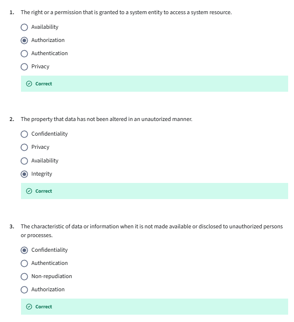
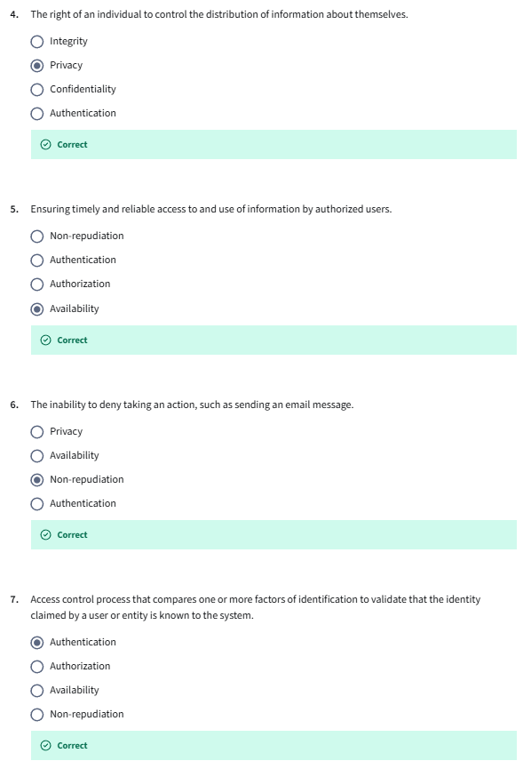
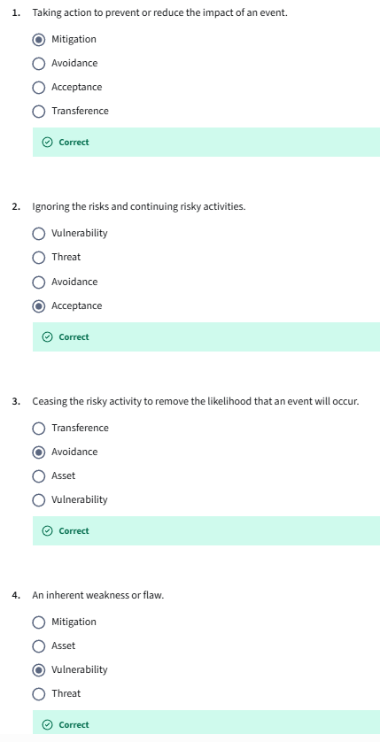
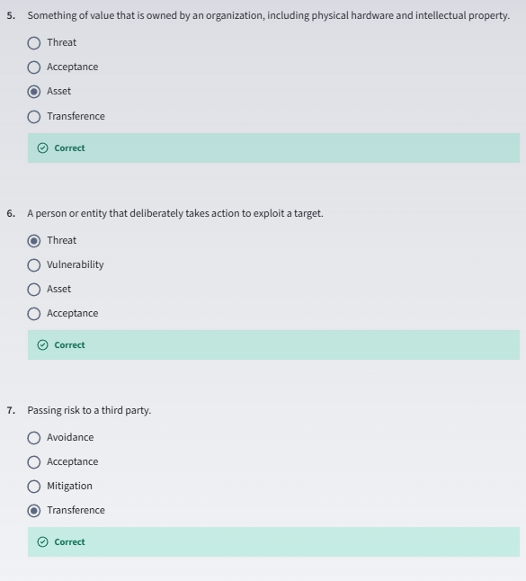
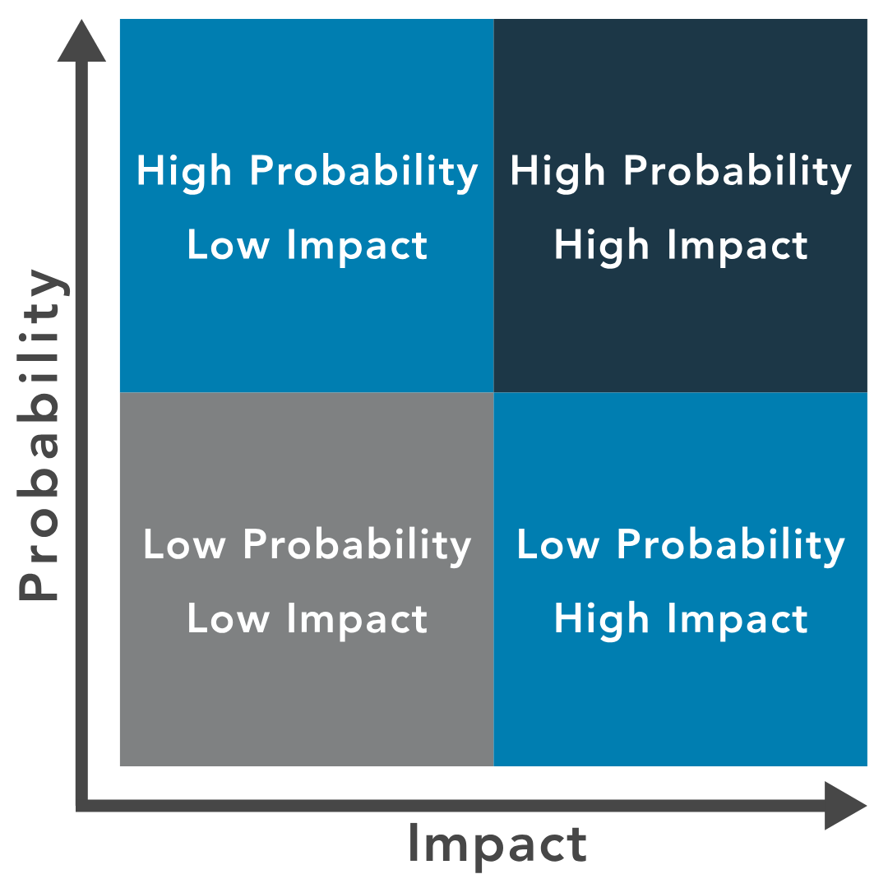

- [Introduction](#introduction)
- [Information Assurance](#information-assurance)
  - [CIA Triads](#cia-triads)
  - [R The CIA Triad](#r-the-cia-triad)
  - [R CIA Triad Deep Dive: Confidentiality](#r-cia-triad-deep-dive-confidentiality)
  - [R CIA Triad Deep Dive: Integrity](#r-cia-triad-deep-dive-integrity)
  - [R CIA Triad Deep Dive: Availability](#r-cia-triad-deep-dive-availability)
  - [V Identification](#v-identification)
  - [R Authentication](#r-authentication)
  - [V Multifactor Authentication or Single Factor Authentication](#v-multifactor-authentication-or-single-factor-authentication)
  - [R Methods of Authentication](#r-methods-of-authentication)
  - [R Non-repudiation](#r-non-repudiation)
  - [R Privacy](#r-privacy)
  - [Self Check: Security Concepts](#self-check-security-concepts)
- [Risk Mitigation Process](#risk-mitigation-process)
  - [R Module Overview](#r-module-overview)
  - [R Risk Management Terminology](#r-risk-management-terminology)
  - [R Threats](#r-threats)
  - [V Threats](#v-threats)
  - [R Vulnerabilities](#r-vulnerabilities)
  - [V Vulnerabilities](#v-vulnerabilities)
  - [R Reading Likelihood](#r-reading-likelihood)
  - [V Likelihood](#v-likelihood)
  - [Risk – Concepts and Definitions](#risk--concepts-and-definitions)
  - [V Risk Management](#v-risk-management)
  - [R Risk Identification](#r-risk-identification)
  - [R Risk Assessment](#r-risk-assessment)
  - [R Risk Treatment](#r-risk-treatment)
  - [Self Check: Risk Terms](#self-check-risk-terms)
  - [R Risk Priorities](#r-risk-priorities)
  - [R Risk Tolerance](#r-risk-tolerance)
- [Security Controls](#security-controls)
  - [Security Controls](#security-controls-1)
  - [Reading - What are Security Controls?](#reading---what-are-security-controls)
  - [Reading - Physical Controls](#reading---physical-controls)
  - [Reading - Technical Controls](#reading---technical-controls)
  - [Reading - Administrative Controls](#reading---administrative-controls)
- [Governance](#governance)
- [ISC2 Code of Ethics](#isc2-code-of-ethics)
- [Security Principles Review](#security-principles-review)

## Introduction

## Information Assurance

### CIA Triads
non-repudiation: A term that has its roots in the legal world. To repudiate something means to deny something. We're saying non deniability. 

CIA triad (Confidentiality, Integrity and Availability) These are concepts that help shape our thinking. We can think of these almost as lenses that we can look through when we're working on a project or when we're considering the cybersecurity environment. 
It helps us maintain a balance between some of the different elements, some of which are often overlooked. If we think about cybersecurity, it may be that we go to things like encryption, firewalls, things that primarily perhaps relate to confidentiality in our mind, helping protect access to documents or information. But we have integrity and availability which carry equal weight just as important. As we look at each of these three concepts, I'd like you to think about the fact that they relate both to the logical or technical environment when we're working on computer systems, for example. But they also relate to a physical environment. 

We're using logical and technical as terms interchangeably to mean something computer-based and physical, something in the real-world, something tangible. 

- confidentiality. Confidentiality we're protecting an asset which could be hardware, software, or information. There on this slide we're talking about data. Protecting the **data that needs controlled access**, needs restricting. What we're trying to do is to **prevent unauthorized access**, authorized and unauthorized. Those two words imply a decision is taking place. 
  - Something is acting to control the access. Now this might be in the physical world. For example, a security guard or a receptionist determining who enters a building. It could be some authentication system or password, for example, checking that you have the authority. Or maybe file permissions. With confidentiality, we have just given some examples of confidentiality and how it impacts both the real-world and also that logical technical environment. 
- Integrity is about ensuring that the data has not been altered by somebody that has no authorization to do so. 
Again, we're talking about a decision point. Integrity is **about controlling change**. If we think about confidentiality as the ability to read, integrity, often we think about as writing or changing something. Let's change, it could be accidental. Accidental change. Because a disk has been corrupted, for example. That's an unauthorized change. 
There's no malicious notice in that necessarily it could be accidental, or it could be deliberate. It could be somebody looking to falsify a record, for example. What we're trying to do is to prevent unauthorized accidental or unauthorized to deliberate changes usually to our information, to our assets. It could be a software configuration, it could be a piece of hardware. But we're trying to control that change. Often again, we think about data. 
- availability: Here we're saying systems need to be available to those subjects, to those people that are authorized to use them. They have to be available when and where needed in the form and format that is required. It's not just about restricting access. The opposite is true as well. 
  - We need to provide access to those people that need the service. If you work in the health care environment, for instance, you might need patient data to provide effective treatment, and it might have to be provided quickly, effectively and in a particular format. These are concepts that help shape our thinking. 

### R The CIA Triad
To define security, it has become common to use Confidentiality, Integrity and Availability, also known as the CIA triad. The purpose of these terms is to describe security using relevant and meaningful words that make security more understandable to management and users and define its purpose. 
- Confidentiality relates to permitting authorized access to information, while at the same time protecting information from improper disclosure. 
- Integrity is the property of information whereby it is recorded, used and maintained in a way that ensures its completeness, accuracy, internal consistency and usefulness for a stated purpose. 
- Availability means that systems and data are accessible at the time users need them. 

### R CIA Triad Deep Dive: Confidentiality
Confidentiality is a **difficult balance to achieve when many system users are guests or customers**, and it is not known if they are accessing the system from a compromised machine or vulnerable mobile application. So, the security professional’s obligation is to **regulate access—protect the data** that needs protection, yet permit access to authorized individuals.

**Personally Identifiable Information (PII)** is a term related to the area of confidentiality. It pertains to **any data about an individual that could be used to identify them**. Other terms related to confidentiality are **protected health information (PHI)** , which is information regarding one’s health status, and classified or sensitive information, which includes trade secrets, research, business plans and intellectual property.

Another useful definition is **sensitivity**, which is a **measure of the importance assigned to information by its owner**, or the purpose of denoting its need for protection. **Sensitive information is information that if improperly disclosed (confidentiality) or modified (integrity) would harm an organization or individual**. In many cases, sensitivity is related to the harm to external stakeholders; that is, people or organizations that may not be a part of the organization that processes or uses the information.

### R CIA Triad Deep Dive: Integrity
Integrity measures the **degree to which something is whole and complete**, internally consistent and correct. The concept of integrity applies to:
- information or data
- systems and processes for business operations
- organizations
- people and their actions

Data integrity: is the assurance that data has not been altered in an unauthorized manner. This requires the protection of the data in systems and during processing to ensure that it is free from improper modification, errors or loss of information and is recorded, used and maintained in a way that ensures its completeness. Data integrity **covers data in storage, during processing and while in transit**.

Information must be accurate, internally consistent and useful for a stated purpose. The **internal consistency of information ensures that information is correct on all related systems so that it is displayed and stored in the same way on all systems**. Consistency, as part of data integrity, requires that all instances of the data be identical in form, content and meaning.

System integrity refers to the maintenance of a known good configuration and expected operational function as the system processes the information. Ensuring integrity begins with an awareness of state, which is the current condition of the system. Specifically, this **awareness concerns the ability to document and understand the state of data or a system at a certain point, creating a baseline**. For example, a baseline can refer to the current state of the information—whether it is protected. Then, to preserve that state, the information must always continue to be protected through a transaction.

Going forward from that baseline, the integrity of the data or the system can always be ascertained by comparing the baseline with the current state. If the two match, then the integrity of the data or the system is intact; if the two do not match, then the integrity of the data or the system has been compromised. Integrity is a primary factor in the reliability of information and systems.

The need to safeguard information and system integrity may be dictated by laws and regulations. Often, it is dictated by the needs of the organization to access and use reliable, accurate information.

### R CIA Triad Deep Dive: Availability
Availability can be defined as 
1. timely and reliable access to information and the ability to use it
2. for authorized users, timely and reliable access to data and information services.

The core concept of **availability is that data is accessible to authorized users when and where it is needed and in the form and format required**. This does not mean that data or systems are available 100% of the time. Instead, the systems and data meet the requirements of the business for timely and reliable access.

**Some systems and data are far more critical than others, so the security professional must ensure that the appropriate levels of availability are provided**. This requires consultation with the involved business to ensure that **critical systems are identified and available**. Availability is often associated with the term criticality, because it represents the importance an organization gives to data or an information system in performing its operations or achieving its mission.

### V Identification
- identification is before we give credentials out. Once you have proved you are who you say you are, then credentials may be issued. 
- each situation may require a different level of confidence or different level of assurance which drives the type of process, the identity proofing process. 
- there are three commonly accepted security factors. Something you know, something you have, and something you are. 
  
- something you know. Something you know would be a username. Your username is something that you know, that you remember. Your password is an example of something that you remember. Equally, if you have a bank card, when you take money out, you have a pin number. Again, an example of something you know. If you have multiple instances of the same type, so let's say to login to your banking website, you have a username, a password, and a pin number, three different things, they are all something you know. 
So this would be using one authentication factor. Even though it's three separate things, they are all of the same type. This would constitute single factor authentication. Something you have is a token of some kind that you have physically with you. It could be a USB key, it could be an authenticator app. Many of the big tech companies have Authenticator apps that runs on your smart phone, your cell phone. It could be a traditional ID badge. 
Before computers existed, To gain access to a secure site, you presented your ID badge, maybe with a photograph of you. Modern ID badges tend to have some kind of radio-frequency identification embedded within them as well. That's a way of authentic, authenticating yourself to gain access to a site. Using your ID badge it's another example of something you have these door entry systems where you swipe your card that's allowing access. It identifies you to authenticate you rather when you access by you presenting the badge. That's an example of something you have. Something you are, we're talking about biometrics. 
The word bio-metric, if we break that word down, bio, biological, metric, measure, a biological measure. There are lots of different biological traits that we can measure. Over the past 10 years, this has been very commonly accepted. Biometrics has been around for a long time, but it wasn't used commonly until smartphones started to commoditize it. They've made it very easily accessible. We started to see things like fingerprint recognition on smartphones, maybe 6, 7 years ago. Very commonplace now. 
More recently, big investments, big use of facial recognition. This use is being spread, all of the technologies are being used, not just in these mobile computing platforms, but elsewhere as well, in CCTV cameras systems, in social media platforms. Some very obvious questions start to arise. Just because we can do something technically, is it ethical? Are there any privacy implications? How comfortable are you with a social media platform allowing people to identify you? Because there are a number of social media platforms available that allow you to try and identify somebody from a photograph. 
These aren't the biggest social media platforms, these are some of the smaller ones, but these services exist. Is it ethical? Is it right to be able to look up somebody's name from their face? How comfortable are you with the prospect of somebody holding onto the ability to recognize you from your biological traits? Now, most biological systems don't actually store your fingerprint or the face itself. What they do is make a digital representation, a digital map. There on the right, the image you can see shows a number of lines between common features on the face, between eyes, nose, mouth, and those measurements can be stored. 
If you add them up or multiply them, it will form some numerical representation of you that is relatively unique. The same is true with fingerprints. Iris scanning measures the unique pattern of the colored circle around your retina. Retinal scanning shines a light into your eye, usually an LED light source into your eye, illuminating the blood vessels on the back of your eyeball, and this vascular pattern is unique. There are a variety of other biological traits. What we want to think about, and we'll come back to this later in the course, are things like how acceptable the bio-metric measure is, what kind of throughput it could offer, how fast it works, how invasive it is. Retina scanning tends to be very slow and tends to be very invasive shining, you have to move your eye up to a scanner, it shines a light into your eye, it's not always comfortable. 
On smart phones, cell phones, these biometric systems tend to be less invasive. We will come back and look at biometrics later in the course. For now, just be aware that there are wider issues around the use of biometrics. One last thing on biometrics before we move forward. With passwords and tokens, whether or not you are authenticated is a binary decision, it's yes or no. With biometrics, it's much more about a judgment, it's much more analog. Because of those measurements on the face, if your face is at a slightly different angle or there is some change in your fingerprints, may be your skin wrinkles when it becomes wet, there is a fuzziness to this. 
How tight your presented assertion when you present your fingerprint or face to be scanned, how close that has to be against the template that you registered depends on the level of assurance that's needed, again, that level of confidence. Maybe on some systems, a degree of fuzziness is okay. If your fingerprint is slightly different, it's okay. Where in a military environment, maybe it's better to reject a valid login if there's not enough certainty. We'll talk about false acceptance rates and false rejection rates later in another chapter. Now, we mentioned using any one of these three factors is known as single factor authentication. If we use more than one, it becomes multi-factor authentication. 
If we use two or more, we're talking about multi-factor authentication. 

### R Authentication
When users have stated their identity, it is necessary to validate that they are the rightful owners of that identity. This process of verifying or proving the user’s identification is known as authentication. Simply put, authentication is a process to prove the identity of the requestor.
- There are three common methods of authentication:
- Something you know: Passwords or paraphrases
- Something you have: Tokens, memory cards, smart cards
- Something you have: Biometrics , measurable characteristics

### V Multifactor Authentication or Single Factor Authentication
think about this. Let's just remind ourselves then if your bank asks you when you try to log in for a user name for some digits from a passcode for a password, it's asking for three things your user name digits from a passcode and your password. Would we say that this is multi factor authentication? No, absolutely not. Why not? Because all three things it's asking for are of the same factor. If we use two factors, two of the three factors, it's commonly known as dual factor authentication or two factor authentication or two F. 
A more commonly. Now if you use two or three of these factors it is referenced as multi factor authentication but you will still hear two f a dual factor authentication for two of the three factors but it's more common to see multi factor authentication. If you have an authenticator app or a cell phone that's registered as a token. When you log in, you might receive a one time code. So a one time password is not an authentication factor. It is a password that works one time it's some kind of code that works just once. It's a single use credential but it is commonly used with multi factor authentication. 
It is commonly used with these tokens. You have something like an authenticator app. You log into a website with your user name with your password and then it will send you a one time code and it's sending you that one time code to your smartphone to your authenticator app to prove that you actually have that token physically with you. So the one time password is checking that you actually have something with you, that there's something you have. We've said some considerations are throughput acceptability and accuracy, but above all of these is making sure that the authentication system, the biometric system, whatever system we implement it has to meet the security needs of the of the implementation first and foremost. So those those three things are considerations how fast something works, how acceptable it is, how accurate it is. But our overriding main concern is making sure that what we have meets our security needs first and foremost. 
But those other items are still important considerations. I mentioned non repudiation and I said that this was a legal term and as a legal term it's existed for for a long time and it's about making sure that whoever signs a contract cannot deny having done so. So it's about particularly about performing transactions with confidence to repudiate, means to deny you sell your property to somebody and then you deny having sold it. We have a problem. And so the legal world has addressed this for very formal transactions. So non repudiation or non deniability, we could think of it as meaning non deniability applies to the modern technical world. Why? 
Well, because we are also performing transactions, if somebody sends an email to me, I want some proof, some assurance, some confidence that it has actually come from who has claimed to have sent it, that it's not been spoofed or faked. So this commonly we see non repudiation around email around online transactions. It's quite a big topic in online e commerce sites for that reason, making sure that if somebody performs a financial transaction that that is actually the right person. And again, we'll look at some of the technologies related to this as we progress through the remainder of the course, just as we move towards the end of our first module, let's look at privacy a really big topic right now and one that's worth investing some time in becoming familiar with because it is becoming a bigger topic rather than a smaller topic. It's something that is so important. Let's look at what privacy is. Is privacy a right do we have a right to privacy? 
Privacy is a fundamental right Eight. The United Nations Declaration of Human Rights in 1948 said no one shall be subject to arbitrary interference with his or her privacy or their privacy, their family, their home or correspondence, nor to attacks upon their honor and reputation. Everyone has the right to the protection of law against such interference or attacks, privacy is a fundamental right essential to autonomy to the protection of human dignity, serving as a foundation upon which many other human rights are built and technology has always been intertwined with this right. Our capabilities to protect privacy are often rooted in the in the technical world. But so are some of the things that potentially could undermine privacy. Our capabilities exist for surveillance to store huge amounts of data, biometric information about individuals. That means that means that privacy could also be very easily eroded. 
What we want to think about specifically within privacy as well as again as we progress through the course is something we call P. I. I. P. I. I is personally identifiable information. So this is a type of private information related to an individual. 
It's information that could be used to identify you or me. Things like name, photo or passport, passport number, would all constitute P. Ii? They would all be classed as P II. Why? Well, my name may not be globally unique, but it could still be used to identify me, my image, my passport number, my telephone number and so on. So this is about trying to balance protecting the needs of society, of many people against the needs of the individual, our individual right to privacy, but also we have law enforcement agencies that need to operate that need to help prevent crime. 
And what you'll see is a balance different perspectives globally around whether you protect the individual or whether you try to protect society. And I'm not saying either approach is right or wrong. There is a very broad spectrum of approaches, some more balanced, more geared towards protecting society, more authoritarian, some more geared towards protecting the individual. But this tension continues to play out and you see it in court cases in europe, you see it in court cases globally. 

### R Methods of Authentication
There are two types of authentication. Using only one of the methods of authentication stated previously is known as `single-factor authentication (SFA)` . Granting users access only after successfully demonstrating or displaying two or more of these methods is known as `multi-factor authentication (MFA)` . 
Common best practice is to implement at least two of the three common techniques for authentication: 
- Knowledge-based 
- Token-based 
- Characteristic-based  

Knowledge-based authentication uses a passphrase or secret code to differentiate between an authorized and unauthorized user. If you have selected a personal identification number (PIN), created a password or some other secret value that only you know, then you have experienced knowledge-based authentication. The problem with using this type of authentication alone is that it is often vulnerable to a variety of attacks. For example, the help desk might receive a call to reset a user’s password. The challenge is ensuring that the password is reset only for the correct user and not someone else pretending to be that user. For better security, a second or third form of authentication that is based on a token or characteristic would be required prior to resetting the password. 

The combined use of a user ID and a password consists of two things that are known, and because it does not meet the requirement of using two or more of the authentication methods stated, it is not considered MFA. 

### R Non-repudiation
Non-repudiation is a legal term and is defined as the **protection against an individual falsely denying having performed a particular action**. It provides the capability to determine whether a given individual took a particular action, s**uch as created information, approved information or sent or received a message**.

In today’s world of e-commerce and electronic transactions, there are opportunities for the impersonation of others or denial of an action, such as making a purchase online and later denying it. It is important that all participants trust online transactions. Non-repudiation methodologies ensure that people are held responsible for transactions they conducted. 

### R Privacy
- Privacy is the right of an individual to control the distribution of information about themselves. 
- While `security` and `privacy` both focus on the protection of personal and sensitive data, there is a difference between them. With the increasing rate at which data is collected and digitally stored across all industries, the push for privacy legislation and compliance with existing policies steadily grows. In today’s global economy, privacy legislation and regulations on privacy and data protection can impact corporations and industries regardless of physical location. Global privacy is an especially crucial issue when considering requirements regarding the collection and security of personal information. There are several laws that define privacy and data protection, which periodically change. Ensuring that protective security measures are in place is not enough to meet privacy regulations or to protect a company from incurring penalties or fines from mishandling, misuse, or improper protection of personal or private information. An example of a law with multinational implications is the European Union’s General Data Protection Regulation (GDPR) which applies to all organizations, foreign or domestic, doing business in the EU or with its citizens. Companies operating or doing business within the United States may also fall under several state legislations that regulate the collection and use of consumer data and privacy. Likewise, member nations of the EU enact laws to put GDPR into practice and sometimes add more stringent requirements. These laws, including national- and state-level laws, dictate that **any entity anywhere in the world handling the private data of people in a particular legal jurisdiction must abide by its privacy requirements**. As a member of an organization's data protection team, you will not be required to interpret these laws, but you will need an understanding of how they apply to your organization.

### Self Check: Security Concepts

## Risk Mitigation Process 

### R Module Overview
- This module gets you started by presenting foundational terminology and introducing you to the risk management process.
- First, a definition of  risk  is  a measure of the extent to which an entity is threatened by a potential circumstance or event. It is often expressed as a combination of:
  - the adverse impacts that would arise if the circumstance or event occurs,  and 
  - the likelihood of occurrence. 
- Information security risk reflects the potential adverse impacts that result from the possibility of unauthorized access, use, disclosure, disruption, modification or destruction of information and/or information systems. This definition represents that risk is associated with threats, impact and likelihood, and it also indicates that IT risk is a subset of business risk. 

### R Risk Management Terminology
- Security professionals use their knowledge and skills to examine operational risk management, determine how to use risk data effectively, work cross-functionally and report actionable information and findings to the stakeholders concerned. Terms such as threats, vulnerabilities and assets are familiar to most cybersecurity professionals.
   - An asset is something in need of protection.
   - A vulnerability is a gap or weakness in those protection efforts.
   - A threat is something or someone that aims to exploit a vulnerability to thwart (frustrate) protection efforts.
- Risk is the intersection of these terms. Let's look at them more closely.

### R Threats

- A threat is a person or thing that takes action to exploit (or make use of) a target organization’s system vulnerabilities, as part of achieving or furthering its goal or objectives. To better understand threats, consider the scenario in the video on the next page.
- In the context of cybersecurity, typical threat actors include the following:
   - Insiders (either deliberately, by simple human error, or by gross incompetence).
   - Outside individuals or informal groups (either planned or opportunistic, discovering vulnerability).
   - Formal entities that are nonpolitical (such as business competitors and cybercriminals).
   - Formal entities that are political (such as terrorists, nation-states, and hacktivists).
   - Intelligence or information gatherers (could be any of the above).
   - Technology (such as free-running bots and artificial intelligence , which could be part of any of the above).

*Threat Vector: The means by which a threat actor carries out their objectives.

### V Threats
Tourists are popular targets for pickpockets. 
- The existence of pickpockets in a crowded tourist spot is a **threat** to the people gathered there. 
- That threat applies to everyone in the vicinity, even other pickpockets, if you are in the vicinity and a pickpocket has identified you as a target, you are facing a **threat actor**, whether you know it or not. 
- The approach and technique taken by the pickpocket is their **threat vector**. 

### R Vulnerabilities
A vulnerability is an **inherent weakness or flaw in a system or component**, which, if triggered or acted upon, could cause a risk event to occur. Consider the pickpocket scenario on the next page.

An organization’s **security team strives to decrease its vulnerability**. 
- To do so, they **view their organization with the eyes of the threat actor**, asking themselves, “Why would we be an attractive target?” The answers might provide steps to take that will discourage threat actors, cause them to look elsewhere or simply make it more difficult to launch an attack successfully. 
- For example, to protect yourself from the pickpocket, you could carry your wallet in an inside pocket instead of the back pant pocket or behave alertly instead of ignoring your surroundings. Managing vulnerabilities starts with one simple step: **Learn what they are**.
- Which vulnerabilities my system has?

### V Vulnerabilities
Let's say the pickpocket chooses you as a target because they see that it will be easier or more profitable to steal from you. 
- Vulnerabilitie: Maybe you are distracted, have jewelry that is easy to snatch or appear weak and less likely to put up a struggle. 
- In other words, you appear more vulnerable than the other tourists, and the pickpocket feels that they can exploit that vulnerability or weakness. 

### R Reading Likelihood
When determining an organization’s vulnerabilities, **the security team will consider the probability**, or likelihood, **of a potential vulnerability being exploited within the construct of the organization’s threat environment**. 
- Likelihood of Occurrence is a weighted factor based on a subjective analysis of the probability that a given threat or set of threats is capable of exploiting a given vulnerability or set of vulnerabilities.

Finally, the security team will consider the likely results if a threat is realized and an event occurs. **Impact** is the **magnitude of harm that can be expected** to result from the consequences of unauthorized disclosure of information, unauthorized modification of information, unauthorized destruction of information, or loss of information or information system availability.

 Think about the impact and the chain of reaction that can result when an event occurs by revisiting the pickpocket scenario on the next page.

### V Likelihood
How do the pickpockets actions affect your ability to continue your journey? If you appear to be a weak target, and the pickpocket chooses to take your money by brute force, Will you be able to obtain more cash to complete your vacation or even return home? The downstream impact must also be considered. What if you are injured and require medical treatment or even hospitalization? **Impact does not often stop with the incident itself**. 

### Risk – Concepts and Definitions
- Threat: Thing that can cause harm. 
  - A lighting.
- Risk: Possibility of something bad happening.
  - The lightinh struck on someone
- Vulnerabilities: A weakness that increaes the likelihood of the risk materializing or increase impact.
  - Someone was under a tree
- Likelihood: Probability

### V Risk Management
- Risk appetite: the amount of risk an organization is willing to accept to achieve its objectives, balancing potential rewards against potential losses.
- Risk Management responses: There are 4 valid responses
  - Accept (less common): you can choose to accept the risk if it's within your risk appetite or the extreme opposite of that is the risk is too high. It is outside of your risk appetite or your risk tolerance. There is too bigger a risk of, let's say an earthquake occurring, therefore we are going to close that building down. We're going to avoid the risk by not doing the activity, by not locating in that area or whatever. 
  - Avoid (less common): To do nothing to not be in risk
  - Reduce(mitigate) (More common): We can reduce risks. We can manage those risks and reduce the level of either the likelihood or the impact or both through the use of controls. The word reduce is the International Standards Organization, ISO, that's their terminology in risk management. Old term was `mitigate` but that implies that the risk is gone, and that never happen.
  - Share (transfer) (More common): Old term was `transfer`, that never happen. But if you have insurance you share the risk of a car accident with a company.
- Ignoring a risk is not the same as chossing to accept a risk (should never do).
  - Ignoring it is pretending it's not there. That's not a good response. The role of security in risk management then is to help with the risk assessment, to help recommend risk management responses.
- The role of security in risk management.

### R Risk Identification
- In the world of cyber, identifying risks is not a one-and-done activity. It’s a recurring process of identifying different possible risks, characterizing them and then estimating their potential for disrupting the organization.  
- It involves looking at your unique company and analyzing its unique situation. **Security professionals know their organization’s strategic, tactical and operational plans**.
- Takeaways to remember about risk identification:
  - Identify risk to communicate it clearly. 
  - Employees at all levels of the organization are responsible for identifying risk.
  - Identify risk to protect against it. 
- As a security professional, you are likely to assist in risk assessment at a system level, focusing on process, control, monitoring or incident response and recovery activities. If you’re working with a smaller organization, or one that lacks any kind of risk management and mitigation plan and program, you might have the opportunity to help fill that planning void.

### R Risk Assessment
Risk assessment: is defined as the **process of identifying, estimating and prioritizing risks to an organization’s operations** (including its mission, functions, image and reputation), assets, individuals, other organizations and even the nation. Risk assessment should result in aligning (or associating) each identified risk resulting from the operation of an information system with the goals, objectives, assets or processes that the organization uses, which in turn aligns with or directly supports achieving the organization’s goals and objectives. 

A common risk assessment activity identifies the risk of fire to a building. While there are many ways to mitigate that risk, the **primary goal of a risk assessment is to estimate and prioritize**. For example, fire alarms are the lowest cost and can alert personnel to evacuate and reduce the risk of personal injury, but they won’t keep a fire from spreading or causing more damage. Sprinkler systems won’t prevent a fire but can minimize the amount of damage done. However, while sprinklers in a data center limit the fire’s spread, it is likely they will destroy all the systems and data on them. A gas-based system may be the best solution to protect the systems, but it might be cost-prohibitive.** A risk assessment can prioritize** these items for management **to determine the method of mitigation that best suits the assets being protected.** 

The result of the risk assessment process is often documented as a report or presentation given to management for their use in prioritizing the identified risk(s). This report is provided to management for review and approval. In some cases, management may indicate a need for a more in-depth or detailed risk assessment performed by internal or external resources.  

### R Risk Treatment
- **Risk treatment relates to making decisions about the best actions to take regarding the identified and prioritized risk.** The decisions made are dependent on the attitude of management toward risk and the availability — and cost — of risk mitigation. The options commonly used to respond to risk are:
  - Avoidance: Risk avoidance is the decision to attempt to eliminate the risk entirely. This could include ceasing operation for some or all of the activities of the organization that are exposed to a particular risk. Organization leadership may choose risk avoidance when the potential impact of a given risk is too high or if the likelihood of the risk being realized is simply too great.
  - Acceptance: Risk acceptance is taking no action to reduce the likelihood of a risk occurring. Management may opt for conducting the business function that is associated with the risk without any further action on the part of the organization, either because the impact or likelihood of occurrence is negligible, or because **the benefit is more than enough to offset that risk**.
  - Mitigation: Risk mitigation is the **most common** type of risk management and includes taking actions to prevent or reduce the possibility of a risk event or its impact. Mitigation **can involve remediation measures, or controls, such as security controls, establishing policies, procedures, and standards to minimize adverse risk**. Risk cannot always be mitigated, but mitigations such as safety measures should always be in place.
  - Transfer: Risk transference is the practice of **passing the risk to another party**, who will accept the financial impact of the harm resulting from a risk being realized in exchange for payment. Typically, this is an insurance policy.

### Self Check: Risk Terms  

### R Risk Priorities
When risks have been identified, it is **time to prioritize and analyze core risks through qualitative risk analysis and/or quantitative risk analysis**. This is necessary to determine root cause and narrow down apparent risks and core risks. Security professionals work with their teams to conduct both qualitative and quantitative analysis. 

Understanding the **organization’s overall mission and the functions that support the mission helps to place risks in context**, determine the root causes and prioritize the assessment and analysis of these items. In most cases, management will provide direction for using the findings of the risk assessment to determine a prioritized set of risk-response actions.

One effective method to prioritize risk is to use a risk matrix, which helps identify priority as the intersection of likelihood of occurrence and impact. It also gives the team a common language to use with management when determining the final priorities. For example, a low likelihood and a low impact might result in a low priority, while an incident with a **high likelihood and high impact will result in a high priority**. Assignment of priority may relate to business priorities, the cost of mitigating a risk or the potential for loss if an incident occurs.

### R Risk Tolerance
The perception management takes toward risk is often likened to the entity’s appetite for risk. How much risk are they willing to take? Does management welcome risk or want to avoid it? **The level of risk tolerance varies across organizations, and even internally**: Different departments may have different attitudes toward what is acceptable or unacceptable risk. Understanding the organization and senior management’s attitude toward risk is usually the starting point for getting management to take action regarding risks.

- **Executive management and/or the Board of Directors determines what is an acceptable level of risk for the organization**. 
  - Security professionals aim to maintain the levels of risk within management’s limit of risk tolerance.

Often, risk tolerance is dictated by geographic location. For example, companies in Iceland plan for the risks that nearby volcanoes impose on their business. Companies that are outside the projected path of a lava flow will be at a lower risk than those directly in the path’s flow. Similarly, the likelihood of a power outage affecting the data center is a real threat in all areas of the world. In areas where thunderstorms are common, power outages may occur more than once a month, while other areas may only experience one or two power outages annually. Calculating the downtime that is likely to occur with varying lengths of downtime will help to define a company’s risk tolerance. If a company has a low tolerance of the risk of downtime, they are more likely to invest in a generator to power critical systems. A company with an even lower tolerance for downtime will invest in multiple generators with multiple fuel sources to provide a higher level of assurance that the power will not fail.

## Security Controls

### Security Controls

### Reading - What are Security Controls?

### Reading - Physical Controls

### Reading - Technical Controls

### Reading - Administrative Controls

Self Check: Security Controls

Practice Assignment•. Duration: 14 minutes14 min
•Grade: --

## Governance

Governance

Video•. Duration: 7 minutes7 min
Governance Elements

Reading•. Duration: 2 minutes2 min
Governance Elements: Regulations and Laws

Reading•. Duration: 2 minutes2 min
Governance Elements: Standards

Reading•. Duration: 2 minutes2 min
Governance Elements: Policies

Reading•. Duration: 2 minutes2 min
Governance Elements: Procedures

Reading•. Duration: 1 minute1 min

## ISC2 Code of Ethics

ISC2 Code of Ethics

Video•. Duration: 6 minutes6 min
Professional Code of Conduct

Reading•. Duration: 2 minutes2 min
Self Check: Applying the Code

Practice Assignment•. Duration: 2 minutes2 min
•Grade: --

## Security Principles Review

Chapter Review

Video•. Duration: 2 minutes2 min
Course Summary

Reading•. Duration: 3 minutes3 min
Terms and Definitions

Reading•. Duration: 20 minutes20 min
Security Principles Quiz

Video•. Duration: 5 minutes5 min
Security Concepts Quiz

Due, Jan 21, 11:59 PM -03
Graded Assignment•. Duration: 20 minutes20 min
•Grade: --
Peer Review

Due, Jan 21, 11:59 PM -03
Graded Assignment•. Duration: 1 hour1h
•Grade: --
Peer Review

Due, Jan 24, 11:59 PM -03
Review Your Peers
•Grade: --