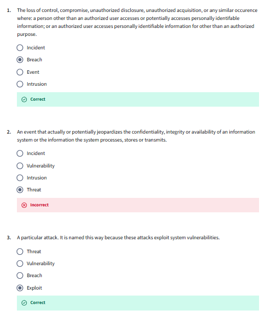
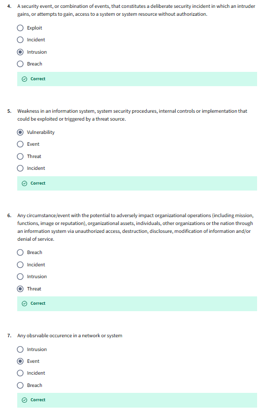
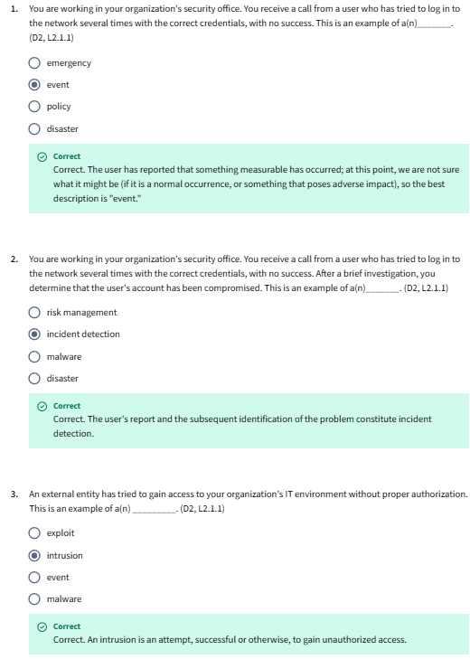
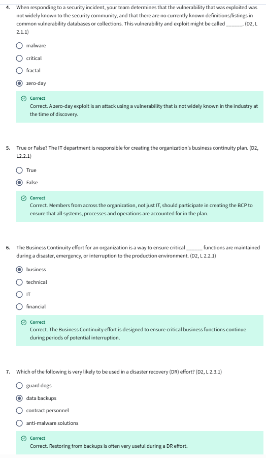
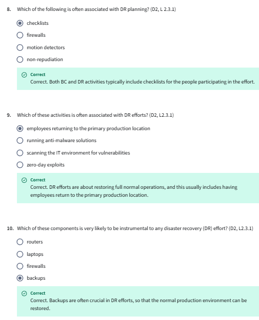

- [Course Introduction](#course-introduction)
  - [Course Introduction](#course-introduction-1)
- [Incident Response](#incident-response)
  - [Incident Response](#incident-response-1)
  - [Incident Terminology](#incident-terminology)
  - [The Goal of Incident Response](#the-goal-of-incident-response)
  - [Components of the Incident Response Plan](#components-of-the-incident-response-plan)
  - [Self Check: Incident Response Terms](#self-check-incident-response-terms)
  - [Incident Response Team](#incident-response-team)
- [Business Continuity (BC)](#business-continuity-bc)
  - [The Goal of Business Continuity](#the-goal-of-business-continuity)
  - [Components of a Business Continuity Plan](#components-of-a-business-continuity-plan)
  - [Self Check: Common BC Components](#self-check-common-bc-components)
  - [Business Continuity in Action](#business-continuity-in-action)
- [Disaster Recovery (DR)](#disaster-recovery-dr)
  - [The Goal of Disaster Recovery](#the-goal-of-disaster-recovery)
  - [Components of a Disaster Recovery Plan](#components-of-a-disaster-recovery-plan)
- [Incident Response, Business Continuity, and Disaster Recovery Review](#incident-response-business-continuity-and-disaster-recovery-review)
  - [Course Summary](#course-summary)
  - [Terms and Definitions](#terms-and-definitions)
  - [Incident Response, Business Continuity, and Disaster Recovery Quiz](#incident-response-business-continuity-and-disaster-recovery-quiz)
  - [Incident Response, Business Continuity \& Disaster Recovery Concepts Quiz](#incident-response-business-continuity--disaster-recovery-concepts-quiz)

## Course Introduction

### Course Introduction

## Incident Response

### Incident Response

**Terminology**
- Incident: it is an occurrence that actually or ​potentially jeopardizes the confidentiality integrity or ​availability of an information system. ​The system itself or ​the information that the system processes the information it stores or transmits. ​Or something that constitutes a violation or imminent threat of violation ​of security policy, security procedures or acceptable use policies.
- Incident Response: Implies the adverse event has already ocurred and we are now responding:
  - The opportunity to plan has passed:
    - Important to have planned and prepared prior to the incident ocurring.
    - If we havent planned we pay high price.
    - If we have planned, our investment pays dividends.
- Zero Day: 
  - A new threar that is Not yet registered or recognized.
  - A formally recognized threat is issued a unique reference number.
  - particularly damaging.
  - dont have all the tools we need to detect an incident that is happening.
- Vulnerability:
  - Weakness in a system that can be exploited by a threat
- Threat/Threat actor
  - Threat actor: somebody with a motive, trying to cause disruption, destruction or theft.
- Breach: 
  - broad term used for many types of cibersecurity compromises
  - Media-information breaches
  - A breach of confidentiality: confidential information has been disclosed.
- People:
  - Computer Incident Response Team (CIRT): the team formed to respond to incidents.

**Incident Response Life Cycle**
1. Preparing for the incident
2. Incident occurs - need to detect and analyze
3. Contain to prevent further damage and eradicate to recover back to normal operations
4. Quickly take a look at what happened to better prepare to the next incident. 

**Incident Response Communications**
- Single voice. single message, clarity, single source of information.
- Internal communication. Business language/direct.
- External communication. Align with public relations message, consider all stakeholders.
  - Customers
  - Supply chain/logistics
  - Shareholders
  - Regulators
- Regular communication - even if nothing new.

**Incident Response Plan**
- Who is involved
- Relevant equipment, policies and procedures.
  - Regular training is imperative
- Links to Business Continuity (BC) and Disaster Recovery (DR) capabilities and plans.
- When to invoke and escalate (depends on the impact)
  - Judgement made by senior manager.

### Incident Terminology

While security professionals strive to protect systems from malicious attacks or human carelessness, inevitably, despite these efforts, things go wrong. For this reason, security professionals also play the role of first responders. An understanding of incident response starts with knowing the terms used to describe various cyberattacks.

- **Breach**: The loss of control, compromise, unauthorized disclosure, unauthorized acquisition, or any similar occurrence where: **a person other than an authorized user accesses or potentially accesses personally identifiable information**; or an authorized user accesses personally identifiable information for other than an authorized purpose. NIST SP 800-53 Rev. 5
- **Event**: Any observable occurrence in a network or system. NIST SP 800-61 Rev 2
- **Exploit**: A particular attack. It is named this way because these attacks **exploit system vulnerabilities**.
- **Incident**: An event that actually or potentially jeopardizes the confidentiality, integrity or availability of an information system or the information the system processes, stores or transmits.
- **Intrusion**: A security event, or combination of events, that constitutes a deliberate security incident in which **an intruder gains, or attempts to gain, access to a system** or system resource without authorization. IETF RFC 4949 Ver 2
- **Threat**: Any circumstance or event with the **potential to adversely impact organizational operations** (including mission, functions, image or reputation), organizational assets, individuals, other organizations or the nation through an information system via unauthorized access, destruction, disclosure, modification of information and/or denial of service. NIST SP 800-30 Rev 1
- **Vulnerability**: Weakness in an information system, system security procedures, internal controls or implementation that could be exploited by a threat source. NIST SP 800-30 Rev 1
- **Zero Day**: A previously unknown system vulnerability with the potential of *exploitation without risk of detection or prevention because it does not, in general, fit recognized patterns, signatures or methods*.

What does incident response in cybersecurity look like? No 911 calls have reported an incident. No ambulances or fire engines are coming to the rescue. It's up to the cybersecurity professionals to detect and respond to incidents.

### The Goal of Incident Response
Every organization must be prepared for incidents. Despite the best efforts of an organization’s management and security teams to avoid or prevent problems, it is inevitable that adverse events will happen that have the potential to affect the business mission or objectives.

The priority of any incident response is to **protect life, health and safety**. When any decision related to priorities is to be made, **always choose safety first**.

The primary goal of incident management is to be prepared. **Preparation requires having a policy and a response plan that will lead the organization through the crisis**. Some organizations use the term “crisis management” to describe this process, so you might hear this term as well.

An event is any measurable occurrence, and most events are harmless. However, **if the event has the potential to disrupt the business’s mission, then it is called an incident**. Every organization **must have an incident response plan** that will help preserve business viability and survival.

The incident response process is aimed at **reducing the impact of an incident** so the organization can **resume the interrupted operations as soon as possible**. Note that incident response planning is a subset of the greater discipline of **business continuity management (BCM)**, which we will cover shortly.

### Components of the Incident Response Plan
The incident response policy should reference an incident response plan that **all employees will follow, depending on their role in the process**. The plan may contain several procedures and standards related to incident response. It is **a living representation of an organization’s incident response policy**.

The organization’s vision, **strategy and mission should shape the incident response process**. Procedures to implement the plan should define the technical processes, techniques, checklists and other tools that teams will use when responding to an incident.

To prepare for incidents, here are the components commonly found in an incident response plan:

1. Preparation
   - Develop a policy approved by management.
   - Identify critical data and systems, single points of failure.
   - Train staff on incident response.
   - Implement an incident response team. (covered in subsequent topic)
   - Practice Incident Identification. (First Response)
   - Identify **Roles and Responsibilities**.
   - Plan the **coordination of communication between stakeholders**.
      - Consider the possibility that a primary method of communication may not be available.
2. Detection and Analysis
   - **Monitor all possible attack vectors**.
   - Analyze incident using known data and threat intelligence.
   - Prioritize incident response.
   - Standardize **incident documentation**.
3. Containment, Eradication and Recovery
   - Gather evidence.
   - Choose an appropriate containment strategy.
   - Identify the attacker.
   - Isolate the attack.
4. Post-Incident Activity
   - Identify evidence that may need to be retained.
   - Document lessons learned.
- Retrospective
   - Preparation
   - Detection and Analysis
   - Containment, Eradication and Recovery
   - Post-incident Activity

NIST Computer Security Incident Handling Lifecycle. NIST SP 800-61 Rev. 2

### Self Check: Incident Response Terms

 

### Incident Response Team

Along with the organizational need to establish a **Security Operations Center (SOC)** is the need to **create a suitable incident response team**. A properly staffed and trained incident response team can be leveraged, dedicated or a combination of the two, depending on the requirements of the organization. 

Many IT professionals are classified as first responders for incidents. They are the first ones on the scene and know **how to differentiate typical IT problems from security incidents**. They are similar to medical first responders who have the skills and knowledge to provide medical assistance at accident scenes and help get the patients to medical facilities when necessary. The medical first responders have specific training to help them determine the difference between minor and major injuries. Further, they know what to do when they come across a major injury. 

Similarly, IT professionals need specific training so they can **determine the difference between a typical problem that needs troubleshooting and a security incident that they need to report and address at a higher level**. 

A typical incident response team is a **cross-functional group** of individuals who represent the **management, technical and functional areas** of responsibility most directly impacted by a security incident. Potential team members include the following:

- Representative(s) of senior management
- Information security professionals
- Legal representatives
- Public affairs/communications representatives
- Engineering representatives (system and network)

Team members should have training on incident response and the organization’s incident response plan. Typically, team members assist with investigating the incident, assessing the damage, collecting evidence, reporting the incident and initiating recovery procedures. They would also participate in the remediation and lessons learned stages and help with root cause analysis.

Many organizations now have **a dedicated team responsible for investigating any computer security incidents that take place**. These teams are commonly known as computer incident response teams (CIRTs) or computer security incident response teams (CSIRTs). When an incident occurs, the response team has four primary responsibilities:

- Determine the **amount and scope of damage caused by the incident**.
- Determine **whether any confidential information was compromised** during the incident.
- Implement any necessary **recovery procedures to restore security** and recover from incident-related damage.
- Supervise the **implementation** of any additional **security measures** necessary to improve security and prevent recurrence of the incident.

## Business Continuity (BC)

- **Goal of Business Continuity**: Sustain business operations while recovering from a significant disruption (NIST SP800-34).
  - Determine which element of business need to continue or which can be paused (depends of the type of company i.e. health, finance etc).
  - Identify controls and teams 
- **Business Continuity Plan**
  - It documents set of procedures that describe how a mission and business processes will be sustained.
  - To know when to invoke
  - Controls: ways to continue the business. 
    - Alternate site or energy supply.
  - Is describes People, communication and authority involved
  - Testing the plan to ensure it is appropiate.
- In Pandemic:
  - Problems:
    - Supply chain problemas
    - Shortages of people and commodities.
  - Invoking the plan:
    - VPNs and remote working
    - Spaling up 
    - Effect communication
    - Remote working
### The Goal of Business Continuity
- **​Business continuity** refers to **enabling the critical aspects of ​the organization to function**. 
  - ​Perhaps at a reduced capacity during a disruption caused by any form of ​disturbance, attack, infrastructure failure, or natural disaster. 
    - ​Most incidents are minor and can be handled easily with minimal impact. ​A system requires a reboot for example, but ​after a few minutes the system is back in operation and the incident is over. ​
    - But once in a while, a major incident will interrupt business for an unacceptable ​length of time, and the organization cannot just follow an incident plan, but ​must move toward business continuity. 
- ​Business continuity **includes planning, preparation, response and ​recovery operations**, but it does not generally include activities to ​support full restoration of all business activities and services. ​
- It **focuses on the critical products and services that the organization provides**, ​and ensures those important areas can continue to operate, ​even at a reduced level of performance, until business returns to normal. 

- ​Developing a business continuity plan requires a significant organizational ​commitment, in terms of both **personnel and financial resources**. ​
  - To gain this commitment, organizational support for business continuity planning ​efforts, must be provided by Executive Management, or an Executive sponsor. ​
  - Without the proper support, ​business continuity planning efforts have little chance of success. 

### Components of a Business Continuity Plan
- **Business continuity planning (BCP)** is the proactive development of **procedures to restore business operations after a disaster** or other significant disruption to the organization. A disaster can be a burning building or a hacking attack.
- Members from across the organization should participate in creating the BCP to ensure all systems, processes and operations are accounted for in the plan.
- The term business is used often, as this is mostly a business function as opposed to a technical one. 
  - However, in order to safeguard the confidentiality, integrity and availability of information, the technology must align with the business needs.

- Here are some common components of a comprehensive business continuity plan:
  - List of the BCP **team members**, including multiple contact methods and backup members
  - Immediate **response procedures and checklists** (security and safety procedures, fire suppression procedures, notification of appropriate emergency-response agencies, etc.)
  - Notification systems and call trees for alerting personnel that the BCP is being enacted
  - Guidance for management, including designation of authority for specific managers
  - How/when to enact the plan
  - Contact numbers for critical members of the supply chain (vendors, customers, possible external emergency providers, third-party partners)

### Self Check: Common BC Components

### Business Continuity in Action
What does business continuity look like in action?

Imagine that the billing department of a company suffers a **complete loss in a fire**. The fire occurred overnight, so no personnel were in the building at the time. 
- A **Business Impact Analysis (BIA)** was performed four months ago and identified the functions of the billing department as very important to the company, but not immediately affecting other areas of work. Through a previously signed agreement,**the company has an alternative area in which the billing department can work**, and it can be available in less than one week. Until that area can be fully ready, customer billing inquiries will be answered by customer service staff. The billing department personnel will remain in the alternate working area until a new permanent area is available.

In this scenario, the BIA already identified the dependencies of customer billing inquiries and revenue. Because the company has ample cash reserves, a week without billing is acceptable during this interruption to normal business. Pre-planning was realized by having an alternate work area ready for the personnel and having the customer service department handle the billing department’s calls during the transition to temporary office space. *With the execution of the plan, there was no material interruption to the company’s business or its ability to provide services to its customers—indicating a successful implementation of the business continuity plan.*

## Disaster Recovery (DR)

**Goal**
- Restore operability of the target system, application or computer facility infrastructure at an alternate site after en emergency (NIST SP800-34)
- Restoring operations
- Usually activated after an event that causes disruption with long-term effects.

**Disaster Recovery Plan**
- Similar to business continuity plan
- Documentation of instructions or procedures that describe how an organization's mission/business processes will be sustained during and after a significant disruption.
- It consist:
  - Preparation - who to involve
  - Business Impact Analysis
  - When to invoke
  - Controls: Alternate site, backups, preventive controls
  - People, communication and authority
- Test the plan
- It should change over time. Why? Organization changesm Environment changes.
- It is a documentation of a predeterminated set of instructions and procedures that describe how critical processes can be sustained after a significant disruption.
- Even with a DR, not everything will go well. Something will be need to be adapted and updated.

### The Goal of Disaster Recovery
In the Business Continuity module, the essential elements of business continuity planning were explored. Disaster recovery planning steps in where BC leaves off. When a disaster strikes or an interruption of business activities occurs, **the Disaster recovery plan (DRP) guides the actions of emergency response personnel until the end goal is reached—which is to see the business restored to full last-known reliable operations**.

Disaster recovery refers specifically to **restoring the information technology and communications services and systems needed by an organization**, both during the period of disruption caused by any event and during restoration of normal services. The recovery of a business function may be done independently of the recovery of IT and communications services; however, the recovery of IT is often crucial to the recovery and sustainment of business operations. Whereas **business continuity planning is about maintaining critical business functions**, **disaster recovery planning** is about **restoring IT and communications back to full operations after a disruption**.

### Components of a Disaster Recovery Plan
Depending on the size of the organization and the number of people involved in the DRP effort, organizations often maintain multiple types of plan documents, intended for different audiences. The following list includes various types of documents worth considering:

- Executive summary providing a high-level overview of the plan
- Department-specific plans
- Technical guides for IT personnel responsible for implementing and maintaining critical backup systems
- Full copies of the plan for critical disaster recovery team members
- Checklists for certain individuals:
  - Critical disaster recovery team members will have checklists to help guide their actions amid the chaotic atmosphere of a disaster.
  - IT personnel will have technical guides helping them get the alternate sites up and running. 
  - Managers and public relations personnel will have simple-to-follow, high-level documents to help them communicate the issue accurately without requiring input from team members who are busy working on the recovery. 

## Incident Response, Business Continuity, and Disaster Recovery Review
- incident, is something that ​jeopardizes the confidentiality, integrity or availability of an information system. 
- ​Incident response. ​Business continuity and disaster recovery plans are crucial to preparing for ​adverse events. 
- ​Plans must be prepared, reviewed and ​tested in order to remain effective 
- following an incident of any kind. ​Learning can and should be used to improve plans. 
- ​An effective communication during an adverse event is critical, and this ​usually involves a range of stakeholders, and 
- the communications are differentiated. ​It's not one size fits all

### Course Summary
- This course** focused mainly on the availability part of the CIA triad and the importance of maintaining availability for business operations**. 
- Maintaining business operations during or after an incident, event, breach, intrusion, exploit or zero day is accomplished through the implementation of Incident Response (IR), Business Continuity (BC), and/or Disaster Recovery (DR) plans. While these three plans may seem to overlap in scope, they are three distinct plans that are vital to the survival of any organization facing out of the ordinary operating conditions. Here are the primary things to remember from this course:

- First, the Incident Response plan responds to **abnormal operating conditions to keep the business operating**. The four main components of Incident Response are: 
  - Preparation; 
  - Detection and Analysis; 
  - Containment, 
  - Eradication and Recovery; 
  - and Post-Incident Activity. 
- Incident Response teams are typically a cross-functional group of individuals who represent the management, technical and functional areas of responsibility most directly impacted by a security incident. The team is trained on incident response and the organization’s incident response plan. 
- When an incident occurs, the team is responsible for determining the amount and scope of damage and whether any confidential information was compromised, implementing recovery procedures to restore security and recover from incident-related damage, and supervising implementation of future measures to improve security and prevent recurrence of the incident.

- Second, the **Business Continuity plan is designed to keep the organization operating through the crisis**. Components of the Business Continuity plan include details about how and when to enact the plan and notification systems and call trees for alerting the team members and organizational associates that the plan has been enacted. In addition, it includes contact numbers for contacting critical third-party partners, external emergency providers, vendors and customers. The plan provides the team with immediate response procedures and checklists and guidance for management.

- Finally, **when both the Incident Response (IR) and Business Continuity (BC) plans fail, the Disaster Recovery (DR) plan is activated to return operations to normal as quickly as possible**. 
- The Disaster Recovery (DR) plan may include the following components: executive summary providing a high-level overview of the plan, department-specific plans, technical guides for IT personnel responsible for implementing and **maintaining critical backup systems**, full copies of the plan for critical disaster recovery team members, and checklists for certain individuals.

### Terms and Definitions
Adverse Events - Events with a negative consequence, such as system crashes, network packet floods, unauthorized use of system privileges, defacement of a web page or execution of malicious code that destroys data.

Breach - The loss of control, compromise, unauthorized disclosure, unauthorized acquisition or any similar occurrence where: a person other than an authorized user accesses or potentially accesses personally identifiable information; or an authorized user accesses personally identifiable information for other than an authorized purpose. Source: NIST SP 800-53 Rev. 5

Business Continuity (BC) - Actions, processes and tools for ensuring an organization can continue critical operations during a contingency. 

Business Continuity Plan (BCP) - The documentation of a predetermined set of instructions or procedures that describe how an organization’s mission/business processes will be sustained during and after a significant disruption.

Business Impact Analysis (BIA) - An analysis of an information system’s requirements, functions, and interdependencies used to characterize system contingency requirements and priorities in the event of a significant disruption. Reference: https://csrc.nist.gov/glossary/term/business-impact-analysis

Disaster Recovery (DR) - In information systems terms, the activities necessary to restore IT and communications services to an organization during and after an outage, disruption or disturbance of any kind or scale. 

Disaster Recovery Plan (DRP) - The processes, policies and procedures related to preparing for recovery or continuation of an organization's critical business functions, technology infrastructure, systems and applications after the organization experiences a disaster. A disaster is when an organization’s critical business function(s) cannot be performed at an acceptable level within a predetermined period following a disruption.

Event - Any observable occurrence in a network or system. Source: NIST SP 800-61 Rev 2 

Exploit - A particular attack. It is named this way because these attacks exploit system vulnerabilities.

Incident - An event that actually or potentially jeopardizes the confidentiality, integrity or availability of an information system or the information the system processes, stores or transmits. 

Incident Handling - The mitigation of violations of security policies and recommended practices. Source: NIST SP 800-61 Rev 2

Incident Response (IR) - The mitigation of violations of security policies and recommended practices. Source: NIST SP 800-61 Rev 2

Incident Response Plan (IRP) - The documentation of a predetermined set of instructions or procedures to detect, respond to and limit consequences of a malicious cyberattack against an organization’s information systems(s). Source: NIST SP 800-34 Rev 1

Intrusion - A security event, or combination of security events, that constitutes a security incident in which an intruder gains, or attempts to gain, access to a system or system resource without authorization. Source: IETF RFC 4949 Ver 2 

Security Operations Center - A centralized organizational function fulfilled by an information security team that monitors, detects and analyzes events on the network or system to prevent and resolve issues before they result in business disruptions.

Vulnerability - Weakness in an information system, system security procedures, internal controls or implementation that could be exploited or triggered by a threat source. Source: NIST SP 800-128. 

Zero Day - A previously unknown system vulnerability with the potential of exploitation without risk of detection or prevention because it does not, in general, fit recognized patterns, signatures or methods.    

### Incident Response, Business Continuity, and Disaster Recovery Quiz

### Incident Response, Business Continuity & Disaster Recovery Concepts Quiz

