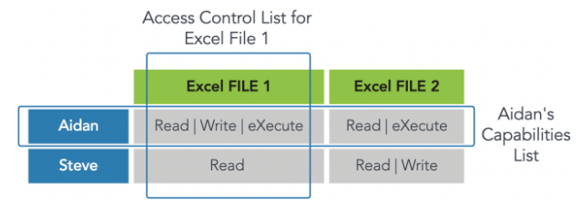

- [Module 1](#module-1)
  - [V - Course Introduction](#v---course-introduction)
- [Module 2](#module-2)
  - [V - What is a Control?](#v---what-is-a-control)
  - [R - Controls Overview](#r---controls-overview)
  - [V - Defense in Depth](#v---defense-in-depth)
  - [R - Defense in Depth](#r---defense-in-depth)
  - [V - User Life Cycle Management](#v---user-life-cycle-management)
  - [R - Privileged Access Management](#r---privileged-access-management)
  - [R - Segregation of Duties](#r---segregation-of-duties)
  - [R - Authorized Versus Unauthorized Personnel](#r---authorized-versus-unauthorized-personnel)
  - [R - How Users Are Provisioned](#r---how-users-are-provisioned)
- [Module 3](#module-3)
  - [V - Administrative Controls](#v---administrative-controls)
- [Module 4](#module-4)
  - [V - Key Concepts](#v---key-concepts)
  - [R - What Are Physical Security Controls?](#r---what-are-physical-security-controls)
  - [R - Types of Physical Access Controls](#r---types-of-physical-access-controls)
  - [V - Security](#v---security)
  - [R - Monitoring](#r---monitoring)
  - [Self Check: Physical Access Controls](#self-check-physical-access-controls)
- [Module 5](#module-5)
  - [V - Logical Controls](#v---logical-controls)
  - [R - What are Logical Access Controls?](#r---what-are-logical-access-controls)
  - [R - Discretionary Access Control (DAC)](#r---discretionary-access-control-dac)
  - [R - Mandatory Access Control (MAC)](#r---mandatory-access-control-mac)
  - [V - Role-Based Access Control (RBAC)](#v---role-based-access-control-rbac)
- [Module 6](#module-6)
  - [V - Controls Review](#v---controls-review)
  - [R - Course Summary](#r---course-summary)
  - [R - Terms and Definitions](#r---terms-and-definitions)
  - [V - Controls Quiz](#v---controls-quiz)
  - [Controls Quiz](#controls-quiz)

## Module 1

### V - Course Introduction
- in order to manage risk to ​assets, we use controls. 
- ​Controls are something that interact with the real-world. ​In Chapter 2, ​we looked at the use of controls in **incident response, ​business continuity and disaster recovery**. 

Agenda:
- Key Concepts
- Control types
  - Administrative Controls
  - Physical Controls
  - Logical Controls
- Controls Review

## Module 2

### V - What is a Control?
​We want to examine that link between controls and risk. ​Why are we using controls? ​How do they relate to our risk? ​Very common to hear us talking about ​risk-based approach to security, ​we will look at some control frameworks. ​We'll look at the importance, ​the need for control assessments, ​and then we'll look at some concepts or defense in depth, ​least privilege before moving on ​to use a lifecycle management. ​Related to user Lifecycle Management, ​we have some users that have more capabilities, ​more power than others. ​These are our privileged accounts. 

​They too need a set of processes ​for management and control. ​Privileged Access Management, ​often referred to as PAM as an acronym. ​We will also look at segregation of duties. ​This is quite a big introductory module. ​When we want to talk about controls. ​Really helpful to start with a definition and from ​NIST Computer Security Resource Center, great resource. ​You guys can Google this or ​just use that QR code on the screen there ​if you have a smart phone handy to visit, ​it has lots of definitions, ​not just for a control, ​it has an entire glossary. 

​Really useful resource, something that I still use today. ​But the definition it offers for a control is ​some safeguard or countermeasure ​designed to protect the C, I, and A of its information ​and to meet a set of defined security requirements. ​This is taken from NIST, ​but there are other definitions available ​and they all amount to the same thing, ​something which affects an outcome. ​When we think about controls in the real-world, ​think about the remote control for your television. ​You press a button and it affects that equipment. ​The volume goes up, the volume goes down, ​the channel changes and this is what we're doing. ​We're using a control to affect an outcome, ​usually to improve the confidentiality, ​integrity, availability of ultimately information. 

​Now I talk about information. ​It can be other asset types, ​but they are usually indirectly protecting information. ​If we think about offense, protecting a building ​and the building with a locked door, ​protecting a server room, ​with information stored on an encrypted disk, ​lots of controls there. ​Encrypted disks, physical barriers, ​all protecting what's stored on the server. ​The information usually is ​what ultimately what we're protecting. ​Controls, how does this relate to risk? ​Well, control is an important part of risk mitigation. 

​If you think back to Chapter 1, ​we mentioned are untreated risk ​and we have four management responses to risk. ​The four management responses to risk are to try ​and share the risk, ​sometimes called risk transfer. ​An example of that might be insurance for example, ​we try and share the risk with another party. ​We can choose to accept the risk. ​We know what the risk profile is if the risk level of ​risk is within our risk tolerance or our risk appetite, ​then we can choose to accept it. ​We can continue to operate. ​We know what the risk is, we are informed. 

​Usually our board would make this decision. ​One of our C-level officers would make this decision. ​We could choose not to operate. ​We could choose to cease operations to avoid the risk. ​Now this is a fairly drastic response and for example, ​with information security, one way we ​can manage this is by turning computers off. ​Logically that will remove the risk, ​creates different risks and actually removes the service. ​Sometimes that's just not viable. 

​The fourth risk management response ​is to reduce the risk, ​sometimes called risk mitigation. ​The more modern terminology is risk reduction. ​The reason we say risk reduction is because ​usually we are not mitigating it completely. ​Mitigation sounds a little bit optimistic. ​The risk is going away. ​Instead, what we're doing is managing the risk down. ​What we're trying to do is to use controls to influence ​the risk level downwards until the remaining ​or residual risk is within our risk appetite. 

​You can see that on the right-hand column ​that we have a reduced level of risk ​and the difference between the lower risk in ​the colored green block and ​the blue block is the impact of control. ​That's the benefit that the control is giving us. ​This tells us why it's important. ​We need to check that the risks ​or that the controls are operating correctly. ​If we implement something like ​a firewall to manage the risk down, ​to manage the risk of a network-based attack, ​for instance, ​downwards until the risk level is acceptable. ​What happens if the firewall stopped working correctly, ​the firewall ceases to function. ​What then? 

​This is why it's important that ​we check our controls are still effective. ​We have to review the risks, ​the threats, the vulnerabilities, ​and we have to review the impact of ​the control to make sure it's still working. ​It's not working correctly we may be closer to ​the blue column on the left ​than the green column on the right. ​In fact, some controls when they don't operate correctly, ​may not just remove the benefit, ​they may increase the risk. ​Just think about an unpatched firewall ​that has lots of vulnerabilities. ​Instead of conferring a benefit, ​might actually create a further vulnerability. ​It might reduce our protection rather than increase it. 

​We have the idea of a control assessment. ​Risk reduction. ​Risk reduction is typically ​dependent upon the effective function of the control. ​Lots of things change. ​This is why we assess controls like anything ​else this review should be structured. ​If there's no structure how do we know ​when it will happen? ​What will happen? 

​How do we know what will be ​included or excluded, the scope? ​We need to document this. ​What is the frequency of our control assessment? ​Usually is a reasonable minimum. ​We're talking annually, ​but it might be more frequent than that. ​The scope which controls are we including, ​which are we scoping in and which are we ​scoping out? What's our plan? 

​How are we going to undertake this control assessment? ​How do we get a level of confidence or ​assurance that things are working as they should? ​This is a really good example of ​a set of processes that are ongoing. ​Quite often as human beings, ​we like to implement something and move on ​to the next exciting project. ​Insecurity, as we talked about in the last chapter, ​when we looked at incident response, ​business continuity, disaster recovery, ​we looked at sets of processes that are cyclical. ​They have a start, ​they have an end for that particular cycle. ​But we looked at the lessons learned ​which fed forward into the next cycle of activity. 

​Lots of things insecurity follow this pattern. ​It's not something we do want ​some forget about risk management, ​control assessments, incident response, ​disaster recovery, business continuity, ​all things that need continual vigilance, ​partly because of this changing environment. 

### R - Controls Overview

It can be argued that access controls are the heart of an information security program. Earlier in this course we looked at security principles through foundations of risk management, governance, incident response, business continuity and disaster recovery. But in the end, security all comes down to, “who can get access to organizational assets (buildings, data, systems, etc.) and what can they do when they get access?”

Access controls are not just about restricting access to information systems and data, but also about allowing access. It is about granting the appropriate level of access to authorized personnel and processes and denying access to unauthorized functions or individuals.

Access is based on three elements:  

**Subjects**
A subject can be defined as any entity that requests access to our assets. The entity requesting access may be a user, a client, a process or a program, for example. A subject is the initiator of a request for service; therefore, a subject is referred to as “active.”

A subject:

- Is a user, a process, a procedure, a client (or a server), a program, a device such as an endpoint, workstation, smartphone or removable storage device with onboard firmware.
- Is active: It initiates a request for access to resources or services.
- Requests a service from an object.
- Should have a level of clearance (permissions) that relates to its ability to successfully access services or resources.

**Objects**
By definition, anything that a subject attempts to access is referred to as an object. An object is a device, process, person, user, program, server, client or other entity that responds to a request for service. Whereas a subject is active in that it initiates a request for a service, an object is passive in that it takes no action until called upon by a subject. When requested, an object will respond to the request it receives, and if the request is wrong, the response will probably not be what the subject really wanted either.

Note that by definition, objects do not contain their own access control logic. Objects are passive, not active (in access control terms), and must be protected from unauthorized access by some other layers of functionality in the system, such as the integrated identity and access management system. An object has an owner, and the owner has the right to determine who or what should be allowed access to their object. Quite often the rules of access are recorded in a rule base or access control list.

An object:

- Is a building, a computer, a file, a database, a printer or scanner, a server, a communications resource, a block of memory, an input/output port, a person, a software task, thread or process.
- Is anything that provides service to a user.
- Is passive.
- Responds to a request.
- May have a classification.

**Rules**
An access rule is an instruction developed to allow or deny access to an object by comparing the validated identity of the subject to an access control list. One example of a rule is a firewall access control list. By default, firewalls deny access from any address to any address, on any port. For a firewall to be useful, however, it needs more rules. A rule might be added to allow access from the inside network to the outside network. Here we are describing a rule that allows access to the object “outside network” by the subject having the address “inside network.” In another example, when a user (subject) attempts to access a file (object), a rule validates the level of access, if any, the user should have to that file. To do this, the rule will contain or reference a set of attributes that define what level of access has been determined to be appropriate.

A rule can:
- Compare multiple attributes to determine appropriate access.
- Allow access to an object.
- Define how much access is allowed.
- Deny access to an object.
- Apply time-based access.

### V - Defense in Depth

​[MUSIC] Let's look at the idea of defense in depth ​then. ​Defense in depth is a move away from the historic position when we first started to ​connect our networks together we had the idea of maintaining a strong perimeter. ​And conceptually this is very similar to the perimeter of a medieval castle. ​Just think about a medieval castle. ​One big wall around the outside protecting what's on the inside. ​And right up until about 2000 the year 2000 that was a very common ​model that we saw. ​Is that an appropriate model? 

​Yeah, absolutely not. ​And we can almost instinctively understand why. ​Is everybody inside our network trusted? ​And if they are trusted, how trustworthy are they? ​Is there any possibility of an insider threat? ​What if somebody breaches the perimeter? ​Should they have access to everything? 

​Or should we try to create security zones, different layers of protection? ​And this layering of protections is what we're talking about with defense in depth. ​So around 2005 this became something that was popularized. ​And defense in depth looks at layering different controls but ​also different types of control to protect our assets. ​And one of the important benefits that defense in depth recognized was the idea ​of training as a control. ​Now in the last chapter we looked at the definition of a zero day threat. ​Our technology may not be able to detect zero day threats. 

​A human being might be able to. ​It's not a guarantee, but a user typically is the entry point for ​malicious software, something like ransomware. ​And if that user is a point of weakness of vulnerability, we may have a problem. ​If we can improve that situation and get them towards being a strength, ​they might report things for us. ​Help us combat zero day threats as one example. ​So training becomes really important. ​How can we expect people to behave according to our policies and ​procedures unless we train them? 

​So at the heart, what we're protecting is our assets. ​And here we have a model that looks a little bit more like an onion ​than a medieval castle. ​We have lots of layers of controls. ​We see administrative controls and ​these are the three control types that we talked about at the start of the chapter. ​Administrative control is telling people what to do. ​Very hard to manage people's behavior and complain about them not doing what they ​should if we haven't documented what good looks like, what they should be doing. ​And these are our policies, procedures, standards, guidelines and so on. 

​We have logical also known as technical controls, things like antivirus, ​firewalls, all of these are examples of logical or technical controls. ​And then we have physical controls. ​Physical controls typically are controlling access to something, ​some sort of gap in a perimeter, a physical perimeter, ​a locked cupboard, a filing cabinet with a lock, a wall, a fence. ​All examples of some kind of physical control. ​And by using different types of physical logical and administrative controls, ​we layer all of these different control types, we gain strength. ​If we had just key based locks protecting our buildings, ​any lock picker could break into our building. ​If we have some key based locks, some swipe locks, ​some fingerprint, biometric based locks. 

​All of those different control types are complementing now an attacker doesn't just ​need the skill set of a lock picker, they need all these different skills as well. ​If we combine that with administrative controls, reminding people to secure ​areas to report suspicious activity, visitors without ID badges and so on. ​All of this improves our security posture. ​We're relying on no single control, ​we're relying on this combination this layering of controls. ​Rings of protection. ​When we do give our users those people that were trusting access to systems and ​services once they authenticated should they have access to everything? ​Absolutely not, we should minimize access to what is needed. 

​As little as is needed but no less. ​This is about ensuring that users and processes have the lowest level of ​authority needed to accomplish a function, their role usually. ​And what we want is a granular set of permissions based on the role, ​something simple. ​At least conceptually in practice this is very hard to manage effectively and ​a lot of organizations struggle. ​This is because there are so many different people with so many different ​requirements and those requirements are usually fairly fluid, fairly dynamic. ​So this is the idea of least privilege then it's an abstract concept but ​it is one that we can apply. ​Just think about your organization, your business, your university, your home, ​do you operate in line with this? 

​Most organizations struggle to manage this perfectly. ​They're on a continuum. ​It's not they do not or they do it's that they try to do and ​that there are some gaps. ​I want some. ​And just as an example I once visited a call center and it was a an I. ​T. Help desk and they had 24 users on this ​help desk and each one of them was given two main administrator ​rights to computer systems that complete access to everything. 

​And when I asked why the help desk manager said well because they need ​lots of different functions for example the ability to reset printers. ​Now we can be more granular than that. ​It's not super administrator or normal user. ​Most systems allow for gradual assignment of permissions. ​In the Microsoft world there is a print administrator capability that lets you ​reset those print jobs you don't need all of the permissions it's not all or ​nothing. ​Usually you can build these privileges up in a granular way. ​The same is true on all other operating systems. 

​And in many lines of business applications as well linked to the concept ​of least privilege privilege is the ability to do something, ​we have the idea of knowledge so need to know is about knowledge rather ​than capability, privilege to do something. ​So conceptually it is linked to least privilege but it is different. ​What we're saying now is that you have to have a requirement to know ​something before we will share it with you again. ​Just think about your your place of study or work. ​You have to have access to everything on the shared drive. ​Probably not. ​There are probably folders or shares that you can't access has ​been restricted and this is because there is not a need to know. 

​Usually you're not given that outright because you do not have a need to know. ​One way we can accomplish need to know is by using and ​developing out the use of classification levels. ​Our subjects are users have a clearance level. ​Our assets are information assets for example, ​a file has a classification level. ​We assign a classification level and they're in the bullet point bullet list, ​we see an example classification level. ​This is just a sample one what an organization has will vary and should ​be according should be varied according to its need in this classification system. ​We have public things which are already in the public domain restricted things ​which should not be shed in the public domain secret, high level of security, ​top secret even higher. 

​Again. ​Now, if we had, let's just give an example, ​if we had a general in the military with top secret clearance and ​the general was working on one of three projects, ​there were three projects in in their building and ​the general wanted to access all three projects, Project A PROJECT B and ​project See if the general was working on project A. ​The general would have a need to know the general's clearances. ​Top secret project is classification is top secret, ​we have a match, there is a need to know and the classification ​is correct if the general was not working on Projects B and C. ​Even though that the generals clearance is top secret and Projects B and ​PROJECT C have a classification of top secret because there is no direct need. ​Ordinarily we would not provide access to the general, ​even though the general's clearance is sufficient, ​there is no need to know that information. ​Therefore we would not provide it so need to know relates to knowledge. 

​The classification system usually provides access to everything unless we ​implement the concept of need to know the general just with the clearance and ​classification level would have access to all three projects. ​What we're trying to do is use this idea of need to know to break that ​classification level up into groups of knowledge, groups of interest 

### R - Defense in Depth

As you can see, we are not just looking at system access. We are looking at all access permissions including building access, access to server rooms, access to networks and applications and utilities. These are all implementations of access control and are part of a layered defense strategy, also known as defense in depth, developed by an organization.

Defense in depth describes an information security strategy that integrates people, technology and operations capabilities to establish variable barriers across multiple layers and missions of the organization. It applies multiple countermeasures in a layered fashion to fulfill security objectives. Defense in depth should be implemented to prevent or deter a cyberattack, but it cannot guarantee that an attack will not occur. 

A technical example of defense in depth, in which multiple layers of technical controls are implemented, is when a username and password are required for logging in to your account, followed by a code sent to your phone to verify your identity. This is a form of multi-factor authentication using methods on two layers, something you have and something you know. The combination of the two layers is much more difficult for an adversary to obtain than either of the authentication codes individually. 

Another example of multiple technical layers is when additional firewalls are used to separate untrusted networks with differing security requirements, such as the internet from trusted networks that house servers with sensitive data in the organization. When a company has information at multiple sensitivity levels, it might require the network traffic to be validated by rules on more than one firewall, with the most sensitive information being stored behind multiple firewalls.

For a non-technical example, consider the multiple layers of access required to get to the actual data in a data center. First, a lock on the door provides a physical barrier to access the data storage devices. Second, a technical access rule prevents access to the data via the network. Finally, a policy, or administrative control defines the rules that assign access to authorized individuals.

### V - User Life Cycle Management

​When we're talking about users and ​their clearances or subjects and their clearances, ​how did they get these permissions? ​How do they get these privileges? ​Well, usually somebody is ​providing a service, provisioning them. ​Provisioning is much more than just user creation. ​Provisioning includes creating the account, ​but it may include much more than creating an account. ​For a start, there may be many accounts. ​One for the network, one for ​a particular Cloud-based system, ​one for a local application. 
​Maybe a code to unlock a device, ​an encrypted disk, maybe a code to enter the building. ​There may be lots of different ​accounts that need provisioning, ​but it's not just about accounts, either. ​We may want, depending on the type of ​role to undertake, some background check, ​some kind of check on ​the individual, some identification processes. ​Identification is part of ​the provisioning process and bear ​in mind when we're looking to ultimately create accounts, ​should we clone somebody else's account? ​Let's say we have a user that ​leaves and somebody else replaces that person, ​should we just change the name on the account? ​Well, probably not. ​To manage the risk appropriately, ​what's considered best practice is to have ​a template based on the role's needs. 
​The idea of least privilege and need to know. ​Why don't we copy existing accounts that are in use? ​Well, those accounts often get changed. ​Just think about a user that's worked in ​an organization for five years. ​They start with a standard set of privileges, ​but maybe they move within the organization, ​they change roles, or maybe ​they are seconded to work on a project. ​They're granted extra permissions or privileges, ​and you see this all the time, ​this creeping upwards of privileges. ​If we use that account now as a template ​of other accounts, we've got a problem. 
​By default, we are giving people too many permissions. ​A very common problem. ​When we're talking about provisioning accounts, ​who do we provision them for? Well, not just users. ​Typically, our devices authenticate as well. ​Our devices authenticate services like wireless, ​allowing us to log on. ​All of these checks typically are related ​to our level of confidence that we need, ​the level of assurance that we need. 
​The process of checking somebody's identity, ​that they are who they say they are, ​is known as identity proofing. ​Just think about when you ​sign up for a social media account. ​If you signed up for a social media account ​about 10 years ago, ​commonly there were no checks. ​You could sign up with ​any name and you'd be given access to the account. ​These days, we're in 2022 at the time of recording, ​these days, typically the same social media accounts ​just want to link your identity to you. ​How do they do that? Well, they send an email or ​a text message just to ​check that there is a real person behind it. 
​But think again, maybe about ​another type of identity proofing. ​What if you want a passport or a driving license? ​There's a high level of assurance, ​high level of confidence that is required, ​and so more checks are undertaken. ​There is a more formal process. ​Again, this whole management of users ​is very dependent on our needs as an organization. ​The level of confidence, the level of ​checking varies and it should vary. ​Absolutely, the right thing to do. 
​Identification is part of ​our identity and access management toolkit, ​gives us a level of confidence. ​Once we've identified somebody, ​we can give them credentials, they can log in. ​As part of this user life cycle management, ​we need to think about the other end of the equation. ​What happens when somebody leaves? ​Again, it's not just about deleting one account. ​Usually, we may need to remove them from payroll, ​we may need to revoke access to physical sites. ​Usually, these days users have more than one account. 
​It's not always the case, ​but maybe they have access to multiple accounts. ​Do we need to terminate any other access? ​We have usually two ways in which ​somebody leaves the organization or at least ​we can group the way somebody leaves ​an organization into one of two categories. ​Voluntary or involuntary. ​Voluntary is, I'm resigning. ​I would like to leave, please. ​That's voluntary. Involuntary is ​where somebody is fired or they're made redundant. 
​They didn't want to resign, ​they are being forced to leave. ​Sometimes with this deep provisioning, ​we have a visibility issue. ​We may not be aware of ​all the accounts that that user has access to, ​maybe a wired wireless codes or ​access to a Cloud-based systems. ​Do we always remember which accounts we've ​created and then subsequently to revoke access to them? ​Not always. ​Certainly, I've seen examples ​when auditing organizations, ​examples of senior members of the organization who have ​left and six months later their account is still active. ​Sometimes being used, sometimes not. 
​Common mistake, common problem. ​We've talked about people starting, ​we've talked about people leaving, ​what about people moving within an organization? ​This last category is the one typically we do least well. ​People changing roles, gaining additional privileges, ​moving within an organization. ​Do we remember to make sure that the access is corrected? ​We're not just talking about normal users, ​we also have some user accounts that have ​additional privileges and capabilities. ​We have normal user accounts, ​which is what we've just been referencing, ​but we have service accounts. 
​Service accounts don't login. ​When you run a computer, ​when you boot a computer up, ​turn it on, these run. ​These are service or system accounts. ​They can run with ​an identity and so you could create an account, ​for example, a backup account. ​A backup account has high levels of access typically, ​but it doesn't belong to any one individual. ​Nobody logs in with the backup account ordinarily. ​It's running as a service on ​each computer that is being backed up. 
​The operating system itself also has a security context. ​It runs as system. ​We have other administrative accounts ​on Linux or Unix-based systems, ​we have the idea of the root account. ​In more Windows type environments, ​it's very common to see enterprise administrators, ​domain administrators, and backup accounts. ​The idea of a domain administrator ​refers to a security domain, ​a group of computers logically linked together. ​Usually an organization will have a security domain. ​Then you have a single point of administration, ​set of servers that control everything on that network. 
​You might have multiple security domains within ​an organization and to manage all of this, ​we'd have an enterprise administrator. ​One enterprise may consist of multiple domains. ​Differentiating identification and authentication. ​Identification, we want to know who somebody is, ​who the subject is before we give ​them credentials to log in. ​Once we've identified them, ​then we give them the credentials, ​then they can login, they can authenticate. ​Very commonly in the finance world as well, ​we have another control, segregation of duties. ​Separating out the different roles. 
​Here we see something that ​existed long before computers did. ​To prevent fraud or misuse of funds, ​organizations have a requester role. ​You want to buy something, maybe ​you want to buy a new server, ​so you place a request. ​As a requester, you cannot now approve that process. ​We need multiple people involved. ​The quest to request and makes the request ​somebody else objective separate, ​has to then approve it. ​In some organizations, many organizations, ​you may have multiple levels of approval. 
​Maybe for requests under $1,000, ​you have a single approver. ​If the threshold, if what you're ​buying is more than $10,000, for example, ​maybe one approver can approve up to $1,000, ​but then it gets escalated up to another approver. ​I've seen organizations with ​six or seven approvers where you ​have requests heading into the millions. ​It means we've got different levels of checking. ​No single person can corrupt a process. ​If that requester is corrupt, ​well, it doesn't matter the approvers or not. ​That's the idea. We've got different checkpoints. 
​If we want to cover up the process now, ​we would need people to work together. ​We'd need collusion. ​We'd need to get lots of people ​to abuse the process together. ​The more people that are needed to complete a process, ​the more difficult it is ​to perpetrate fraud, for example. ​Again, related to separation of duties, ​we have the idea of dual controls. ​Here we need two or more people to initiate a process. ​My mental image here is always of a missile launch. 
​If you think about Hollywood movies, ​two people turning a key or ​two people pushing a button to launch a missile, ​for example, may sound far fetched, ​but it's a really easy example of a dual control. ​Needs two people's judgment, not just one. ​Again, helps prevent ​a single person being able to compromise a process. ​In order to compromise it now, ​it would require collusion, doesn't prevent collusion. ​This User Life Cycle Management, ​we've talked about the provisioning ​and deprovisioning of accounts. ​We also want to make sure we have ​appropriate reviews of our user access. ​Again, good practice to do this at least annually, ​to check the permissions that are ​allocated to make sure ​that we don't have what we call privileged creep. 
​We've talked about identification, ​checking who somebody is before we let them ​have access to an account or two accounts. ​Once they have access, ​then they can authenticate. ​The idea of authentication is that there is a check to ​make sure that person ​trying to login is who they say they are. ​In Chapter 1, we referenced ​single factor versus multi-factor. ​Single factor one type of checking, for example, ​something you know, or ​something you have or something you are. ​Multi-factor is where we use two ​or three of those types together. ​Usually where we need more assurance. 
​Multi-factor authentication of good use case might ​be when we're logging in as domain administrator, ​giving us the extra assurance ​that that person is who they say they are. ​Once you've logged in, we said you don't have access to ​everything and that implies that is a set of decisions. ​You click on one folder, ​you are granted access, ​a decision has been made. ​You click on another folder, ​you do not have access, for example. ​Again, a decision has been made. ​The ongoing decision-making is performed usually by ​the operating system and ​this is what we call authorization. ​We know who you are. 
​You've logged in, you've ​proved who you are, you've authenticated. ​But just because you've authenticated ​doesn't mean you have access to everything. ​In fact, we may want to check those authorizations. ​What you are accessing, ​that you're entitled to access, ​and also what you're trying to access that you cannot. ​This moves us onto the concept of auditing. ​Auditing is logging, but also checking those logs. ​Those authorizations successful or ​unsuccessful have been logged. 
​Let's take a look. Who's been trying to login? ​Who's been accessing things that they shouldn't or ​using privileges that they are entitled to, ​but perhaps in ways that they shouldn't? ​All of our checking here relates ​to a level of assurance that we need. ​We may have different processes for ​user accounts than we have ​for privileged accounts, for example. 

### R - Privileged Access Management

Privileged access management provides the first and perhaps most familiar use case. Consider a human user identity that is granted various create, read, update, and delete privileges on a database. Without privileged access management, the system’s access control would have those privileges assigned to the administrative user in a static way, effectively “on” 24 hours a day, every day. Security would be dependent upon the login process to prevent misuse of that identity. Just-in-time privileged access management, by contrast, includes role-based specific subsets of privileges that only become active in real time when the identity is requesting the use of a resource or service. 

Consider this scenario explaining why privileged access management is important:

ABC, Inc., has a small IT department that is responsible for user provisioning and administering systems. To save time, the IT department employees added their IDs to the Domain Admins group, effectively giving them access to everything within the Windows server and workstation environment. While reviewing an invoice that was received via email, they opened an email that had a malicious attachment that initiated a ransomware attack. Since they are using Domain Admin privileges, the ransomware was able to encrypt all the files on all servers and workstations. A privileged access management solution could limit the damage done by this ransomware if the administrator privileges are only used when performing a function requiring that level of access. Routine operations, such as daily email tasks, are done without a higher level of access. 

**Privileged Accounts**
Privileged accounts are those with permissions beyond those of normal users, such as managers and administrators. 

Broadly speaking, these accounts have elevated privileges and are used by many different classes of users, including: 

- Systems administrators, who have the principal responsibilities for operating systems, applications deployment and performance management. 
- Help desk or IT support staff, who often need to view or manipulate endpoints, servers and applications platforms by using privileged or restricted operations. 
- Security analysts, who may require rapid access to the entire IT infrastructure, systems, endpoints and data environment of the organization. 

Other classes of privileged user accounts may be created on a per-client or per-project basis, to allow a member of that project or client service team to have greater control over data and applications. 

These few examples indicate that organizations often need to delegate the capability to manage and protect information assets to various managerial, supervisory, support or leadership people, with differing levels of authority and responsibility. This delegation, of course, should be contingent upon trustworthiness, since misuse or abuse of these privileges could lead to harm for the organization and its stakeholders. 

Typical measures used for moderating the potential for elevated risks from misuse or abuse of privileged accounts include the following: 

- More extensive and detailed logging than regular user accounts. The record of privileged actions is vitally important, as both a deterrent (for privileged account holders that might be tempted to engage in untoward activity) and an administrative control (the logs can be audited and reviewed to detect and respond to malicious activity). 
- More stringent access control than regular user accounts. As we will see emphasized in this course, even nonprivileged users should be required to use MFA methods to gain access to organizational systems and networks. Privileged users—or more accurately, highly trusted users with access to privileged accounts—should be required to go through additional or more rigorous authentication prior to those privileges. Just-in-time identity should also be considered as a way to restrict the use of these privileges to specific tasks and the times in which the user is executing them. 
- Deeper trust verification than regular user accounts. Privileged account holders should be subject to more detailed background checks, stricter nondisclosure agreements and acceptable use policies, and be willing to be subject to financial investigation. Periodic or event-triggered updates to these background checks may also be in order, depending on the nature of the organization’s activities and the risks it faces. 
- More auditing than regular user accounts. Privileged account activity should be monitored and audited at a greater rate and extent than regular usage. 

### R - Segregation of Duties

A core element of authorization is the principle of segregation of duties (also known as separation of duties). Segregation of duties is based on the security practice that no one person should control an entire high-risk transaction from start to finish. Segregation of duties breaks the transaction into separate parts and requires a different person to execute each part of the transaction. For example, an employee may submit an invoice for payment to a vendor (or for reimbursement to themselves), but it must be approved by a manager prior to payment; in another instance, almost anyone may submit a proposal for a change to a system configuration, but the request must go through technical and management review and gain approval, before it can be implemented.

These steps can prevent fraud or detect an error in the process before implementation. It could be that the same employee might be authorized to originally submit invoices regarding one set of activities, but not approve them, and yet also have approval authority but not the right to submit invoices on another. It is possible, of course, that two individuals can willfully work together to bypass the segregation of duties, so that they could jointly commit fraud. This is called collusion.

Another implementation of segregation of duties is dual control. This would apply at a bank where there are two separate combination locks on the door of the vault. Some personnel know one of the combinations and some know the other, but no one person knows both combinations. Two people must work together to open the vault; thus, the vault is under dual control. 

**Two-Person Integrity** 

The two-person rule is a security strategy that requires a minimum of two people to be in an area together, making it impossible for a person to be in the area alone. Many access control systems prevent an individual cardholder from entering a selected high-security area unless accompanied by at least one other person. Use of the two-person rule can help reduce insider threats to critical areas by requiring at least two individuals to be present at any time. It is also used for life safety within a security area; if one person has a medical emergency, there will be assistance present.

### R - Authorized Versus Unauthorized Personnel

Subjects are authorized access to objects after they have been authenticated. Remember from earlier sections that authentication is confirming the identity of the subject. Once a subject has been authenticated, the system checks its authorization to see if it is allowed to complete the action it is attempting. This is usually done via a security matrix accessed by the system controlling the access, based on pre-approved levels. For example, when a person presents an ID badge to the data center door, the system checks the ID number, compares that to a security matrix within the system, and unlocks the door if the ID is authorized. If the ID is not authorized to unlock the door, it will remain locked. In another example, a user attempts to delete a file. The file system checks the permissions to see if the user is authorized to delete the file. If the user is authorized, the file is deleted. If the user is not authorized, an error message is displayed, and the file is left untouched. 

### R - How Users Are Provisioned

Other situations that call for provisioning new user accounts or changing privileges include: 

- **A new employee**—When a new employee is hired, the hiring manager sends a request to the security administrator to create a new user ID. This request authorizes creation of the new ID and provides instructions on appropriate access levels. Additional authorization may be required by company policy for elevated permissions. 
- **Change of position**—When an employee has been promoted, their permissions and access rights might change as defined by the new role, which will dictate any added privileges and updates to access. At the same time, any access that is no longer needed in the new job will be removed. 
- **Separation of employment**—When employees leave the company, depending on company policy and procedures, their accounts must be disabled after the termination date and time. It is recommended that accounts be disabled for a period before they are deleted to preserve the integrity of any audit trails or files that may be owned by the user. Since the account will no longer be used, it should be removed from any security roles or additional access profiles. This protects the company, so the separated employee is unable to access company data after separation, and it also protects them because their account cannot be used by others to access data.

NOTE: Upon hiring or changing roles, a best practice is to not copy user profiles to new users, because this promotes “permission or privilege creep.” For example, if an employee is given additional access to complete a task and that access is not removed when the task is completed, and then that user’s profile is copied to create a new user ID, the new ID is created with more permissions than are needed to complete their functions. It is recommended that standard roles are established, and new users are created based on those standards rather than an actual user.

## Module 3

### V - Administrative Controls
​We want to document how we operate any requirements, ​any regulation, any impacts. ​How do we know how to operate if we don't document it? ​Can we tackle how people behave if there's no guidance? ​I had an example of an organization that called me in, ​they fired a teacher. ​It was a high-school. ​They fired the teacher because the teacher was using ​the Internet for accessing home banking services. ​What's really interesting from my perspective, ​from a security perspective, ​is there was no policy or set of ​procedures around what you can ​and cannot do with the Internet. 

​On very genuinely, I believe that individual ​thought it was okay to access the Internet for home use. ​The reason I believe that is because I ​interviewed some of the school staff. ​Roughly half of the teachers that I spoke to ​thought it was okay to use the Internet for home use, ​half thought it wasn't. ​The headteacher thought it wasn't okay to do that. ​But how do we share ​a common understanding of what's expected or allowed, ​permitted if we don't actually document that? ​Very hard to enforce the rules if ​we've not told people what the rules are. ​There are some regulated industries as we've discussed, ​and those might require particular forms of ​documentation or particular approaches. 

​Let's take a look at some types ​of administrative control then. ​First we have policies. ​Policies are the high level statement. ​The statement of what we're doing and hopefully, ​we should reflect why we're doing it. ​As a minimum, we have to say what we're doing. ​This is usually signed off by ​a senior manager within the organization. ​The reason we'd explain the why usually is to ​generate some bias to get people to comply. 

​People are much more likely to comply with ​the what if they understand why we're doing it. ​That knowledge gives people ​an understanding of the context. ​They have to do some extra work if ​there are extra controls or steps to take. ​That why might be ​the difference between compliance and noncompliance. ​Helping them to understand that we're ​doing this because maybe it's ​regulated or maybe because ​there's a particular risk we're trying to manage. ​These high-level statements, ​these policies signed off by senior officers ​are then delivered through ​the use of procedures, sometimes called processes. ​These are typically created ​within individual business units. 

​They are subject matters specific. ​For example, within the IT service, ​you might have some backup procedures. ​These are specific enough that they ​would need creating at that business unit level. ​A senior manager wouldn't ordinarily have ​the low-level knowledge to create a procedure. ​This is the step-by-step instructions, ​the how we complete the task. ​Just a link here. ​Because these are completed at ​the business unit level and usually ​agreed by a business manager, ​a middle manager, ​if a policy and procedure collect conflict, ​ordinarily we would defer to the policy. 

​Why? Well, because ​the policy is that high-level sign off, ​it's the high-level statement and ordinarily ​the procedure would be amended to align with the policy. ​For that reason, the procedures ​have to support the policy. ​Some other examples of administrative control then. ​An acceptable use policy. ​A policy saying what we can and cannot do with ​the computer-based resources, technical resources. ​This is one of the few policies that ​is actually signed by an end user. 

​It is signed off by ​the senior managers still as a policy. ​This is one of the few policies that ​an end user would subscribe to. ​They would say, yes, I've read this. ​Yes, I agree to follow the rules. ​Nondisclosure agreement. ​A nondisclosure agreement is ​a promise by an employee that they will not ​disclose information about their current employer ​beyond the term of their employment. ​Helps protect trade secrets, for example. 

​We have an employment contract. ​When somebody starts, we give them ​an employment contract to formalize the arrangement. ​We also give them a job description. ​Without those two items, ​it's very hard to argue somebody isn't doing their job. ​If you don't give them a job description, ​how do they know what they're supposed to do? ​This documentation is all ​about providing the correct guidance. ​We have standards. 

​Standards we consider to be things we must do. ​For example, we might have standards that are imposed ​through regulation related to encryption, ​or some standards are generated internally. ​We will use this type of ​encryption to protect our information. ​Guidelines are usually considered to be recommendations. ​Where standards we must follow, ​guidelines are usually recommendations. ​Guidelines we usually should follow. ​Our administrative controls then are ​supported by physical and logical controls. 

​Just remember with that defense in depth idea, ​we're not relying on a single type ​or category of control. 

## Module 4

### V - Key Concepts

​So this is about helping to manage physical access, ​usually controlling passage through a gap. ​This could be a safe, this could be a door in a wall. ​This could be a gate in a fence. ​All examples of controlling access through a secure perimeter. ​There are interdependence between control types. ​Let's just think about an example, if you are setting up a data ​center in the center of a city that has a very high crime level. ​If you have good logical controls, but no physical controls, ​you're going to have a problem. 

​Just think this through, ​if the system administrator leaves the door to the data center open, ​there is nobody at the reception controlling access to the building. ​Somebody could walk in from the street, walk through the reception area, ​walk straight into your data center and install some malicious hardware, ​some malicious software. ​Maybe something that logs keystrokes. ​Maybe they could cut cables, maybe they could steal equipment. ​If they're installing a key logger that could affect confidentiality, ​if they're stealing equipment, that's going to affect availability or ​if they're cutting cables, still affect availability. ​So generally we need a good balance between the controls, ​some administrative, some physical, some logical. ​But where we have more challenging environments, so for example, ​an area with a high crime rate. 

​It may be, we support our logical controls with increased physical controls. ​Maybe we have a building without windows. ​Maybe we have additional security employees to protect the area and so on. ​We also recognize that not all internal areas are of equal sensitivity. ​Data centers, research areas, areas with network and computer equipment, typically, ​they have a higher value and therefore we protect assets according to value. ​So we would invest more in controls for these areas. ​It's also very common to see organizations breaking up those security zones, ​instead of, as we looked at with when we talked about defense in depth, ​instead of just relying on one secure perimeter. 

​Now, a very similar concept, we're zoning our security internally. ​For our environmental design, we have the idea of crime prevention through design. ​We can actually manage our risk level through design. ​If we're building a new site, if we're lucky enough to be able to design ​the site from scratch, what we can do is try to build security in, and ​a lot of modern buildings, modern campuses start to look very similar. ​And it's because of this idea of CPTED, ​crime prevention through environmental design. ​Just think about some of the campuses you might have seen, ​they have a fence around the perimeter, that's a barrier. ​But then there is an open green space, lots of grass, and ​this is to make sure that you've got the ability to see people approaching. 

​If somebody climbed the fence, you can see who it is because there's a big gap, ​nobody should be there really in the open green space. ​Then, you start to see the use of small hills or ​small kind of rolling hills, undulating up and down. ​And this is to help prevent vehicles, not big enough for people to hide behind, ​but just enough to prevent people gaining speed if they're in a vehicle, ​to prevent people gaining enough speed to ram into your building. ​You also see other forms of physical barrier. ​For example, many of these modern campuses have waterways, small water features, and ​again, these help prevent vehicles approaching areas that they shouldn't. ​So if somebody wants to steal all your equipment by having ​a small stream or a kind of lake or something similar, ​it can help provide a physical barrier from the building. ​Towards the building, even closer to the building, ​we might see things like concrete balls, monuments, bollards, ​statues and again, they provide some form of physical barrier. 

​Some of these look very artistic, but ​they're designed that their purpose may indeed be security. ​You see this with a large concrete spheres placed wide enough apart, ​that human beings can walk between them, but that cars can't. ​Seating as well, concrete seating prevents vehicles gaining access to the building. ​And very close to the building perimeter, we see the use of close circuit ​television, cameras and also the use of what we call defensive planting. ​Defensive planting, you actually have very low level shrubs and ​these are densely planted, so there's no space for a human being to stand ​next to the building and maybe eavesdrop or peer through the window. ​But also these are typically, these plants have thorns. ​So if you do try and break in, it's not going to be impossible, but ​it's another control type. 

​These thorns may collect forensic evidence from your clothing or maybe even blood. ​They scratch the skin. ​The building itself may not have windows that open. ​Lots of these newer campuses also have reflective windows to prevent the building ​overheating, but also to help prevent people visually gaining access to ​the building, actually being able to see what's happening internally. ​We talked about biometrics and ​some of the considerations we have with biometrics include throughput. ​How fast are they? ​Are they fast enough for our needs? 

​Have seen some biometric solutions that are not fit for purpose. ​Things like eye scanners to process payments may not be ​an appropriate approach. ​What speed do we need? ​We also want to think a little bit about accuracy. ​This is already, we've discussed this in chapter one already, so ​I'm not going to dwell on it too long. ​Accuracy, we have the false acceptance rate and the false rejection rate, ​those two types of error. ​And we want, again, we want a balance that meets our needs. 

​How invasive the approach is? ​Typically retinal scanners or ​iris scanners are considered more invasive than something like a palm scan, but ​again, making sure something is fit for purpose is what we're talking about. ​Usually, biometrics for them to be effective, they have to be universal, ​degree of universality, if we use fingerprint scanners as the image shows, ​does everybody have fingerprints? ​What if somebody doesn't? ​I had a case, maybe a year ago where there was somebody reported who went to ​the gym each morning, and each morning because of the lifting weights, ​their fingerprint changed just slightly through abrasion. ​It changed their fingerprint record, so ​they had continual problems logging into a site. ​How do you manage that? 

​Is a fingerprint appropriate? ​Maybe, maybe not commonly though. ​We have alternative approaches. ​If you think about your smartphone, it will allow biometrics usually. ​But when you power the device down, power it back on, ​it requires some kind of additional assurance. ​So just bear in mind that not all biometric approaches are universal. 

### R - What Are Physical Security Controls?

Physical access controls are items you can physically touch. They include physical mechanisms deployed to prevent, monitor, or detect direct contact with systems or areas within a facility. Examples of physical access controls include security guards, fences, motion detectors, locked doors/gates, sealed windows, lights, cable protection, laptop locks, badges, swipe cards, guard dogs, cameras, mantraps/turnstiles, and alarms.

Physical access controls are necessary to protect the assets of a company, including its most important asset, people. When considering physical access controls, the security of the personnel always comes first, followed by securing other physical assets.

### R - Types of Physical Access Controls
Many types of physical access control mechanisms can be deployed in an environment to control, monitor and manage access to a facility. These range from deterrents to detection mechanisms. Each area requires unique and focused physical access controls, monitoring and prevention mechanisms. The following sections discuss many such mechanisms that may be used to control access to various areas of a site, including perimeter and internal security.

**Badge Systems and Gate Entry**
Physical security controls for human traffic are often done with technologies such as turnstiles, mantraps and remotely or system-controlled door locks. For the system to identify an authorized employee, an access control system needs to have some form of enrollment station used to assign and activate an access control device. Most often, a badge is produced and issued with the employee’s identifiers, with the enrollment station giving the employee specific areas that will be accessible. In high-security environments, enrollment may also include biometric characteristics. In general, an access control system compares an individual’s badge against a verified database. If authenticated, the access control system sends output signals allowing authorized personnel to pass through a gate or a door to a controlled area. The systems are typically integrated with the organization’s logging systems to document access activity (authorized and unauthorized)

A range of card types allow the system to be used in a variety of environments. These cards include:
- Bar code
- Magnetic stripe
- Proximity
- Smart
- Hybrid

**Environmental Design**

Crime Prevention through Environmental Design (CPTED) approaches the challenge of creating safer workspaces through passive design elements. This has great applicability for the information security community as security professionals design, operate and assess the organizational security environment. Other practices, such as standards for building construction and data centers, also affect how we implement controls over our physical environment. Security professionals should be familiar with these concepts so they can successfully advocate for functional and effective physical spaces where information is going to be created, processed and stored.

CPTED provides direction to solve the challenges of crime with organizational (people), mechanical (technology and hardware) and natural design (architectural and circulation flow) methods. By directing the flow of people, using passive techniques to signal who should and should not be in a space and providing visibility to otherwise hidden spaces, the likelihood that someone will commit a crime in that area decreases.

**Biometrics**  
To authenticate a user’s identity, biometrics uses characteristics unique to the individual seeking access. A biometric authentication solution entails two processes.

- Enrollment—during the enrollment process, the user’s registered biometric code is either stored in a system or on a smart card that is kept by the user.
- Verification—during the verification process, the user presents his or her biometric data to the system so that the biometric data can be compared with the stored biometric code.
Even though the biometric data may not be secret, it is personally identifiable information, and the protocol should not reveal it without the user’s consent. Biometrics takes two primary forms, physiological and behavioral.

Physiological systems measure the characteristics of a person such as a fingerprint, iris scan (the colored portion around the outside of the pupil in the eye), retinal scan (the pattern of blood vessels in the back of the eye), palm scan and venous scans that look for the flow of blood through the veins in the palm. Some biometrics devices combine processes together—such as checking for pulse and temperature on a fingerprint scanner—to detect counterfeiting.

Behavioral systems measure how a person acts by measuring voiceprints, signature dynamics and keystroke dynamics. As a person types, a keystroke dynamics system measures behavior such as the delay rate (how long a person holds down a key) and transfer rate (how rapidly a person moves between keys).

Biometric systems are considered highly accurate, but they can be expensive to implement and maintain because of the cost of purchasing equipment and registering all users. Users may also be uncomfortable with the use of biometrics, considering them to be an invasion of privacy or presenting a risk of disclosure of medical information (since retina scans can disclose medical conditions). A further drawback is the challenge of sanitization of the devices.

### V - Security
​Security, we can have physical security. ​A physical presence can act as a deterrence can also help us detect as well ​detect problems. ​A security guard, if people, if criminals know a security guard is present, ​it can deter crime can help detect crime if somebody does break in, ​can help prevent crime. ​The security guard might catch the perpetrator before they actually break in ​or before they managed to commit the crime and can help correct the problem, ​make sure an unlocked door is locked. ​For example, guard dogs, another example and ​guard dogs very similarly fall into different categories. ​They're detecting deterring, preventing, correcting. ​We might want to screen our security personnel, we might want general security ​screening as people enter secure areas, maybe our building. 

​And again, a lot of this is risk based here a government organization, ​security screening is very common same for military. ​If you are a small business, ​it might be less common depending on what business sector you work in. ​Personnel screening before we employ personnel and ​during the period of employment we can check things like their criminal records, ​their background, making sure that they are a good fit for the organization. ​This commonly occurs with police officers very common to see police ​officers checked before they are approved for their position, not just for ​criminal records, but also that they are financially not in a position of debt. ​Why is this important? ​Well, if they were in debt, ​maybe it's possible they might be more susceptible to bribery for example. ​So the reason I give those examples is just to show that this is very ​specific to the kind of environment that you're in. 

​Not one size fits all. ​So we talked a little bit about CCTV two broad types analog or ​digital analog is the traditional version of CCTV and used to be very expensive. ​Digital now is commonly IP based, so ​it's a network based and the price point is very much lower. ​And it also typically requires less cabling as well. ​In the image there you can see an old analog system and you can see the cabling ​going to the system typically has a higher cost of installation and maintenance. ​When we're talking about cameras, we have different types of sensor as well. ​We may want to consider lighting to get a good color picture. 

​Usually we need high levels of light once we start to get reduced ​light maybe on an overcast day or towards dawn or dusk. ​Then color images become very unclear and ​they don't that you get very you get almost nothing in darkness. ​In fact you get close to nothing in darkness. ​However, there are some sensors ​that are very good at seeing in low levels of light. ​These are usually black and white images though, ​and they are illuminated using an infrared light, not visible to human beings but ​which the cameras pick up and provide sufficient illumination. ​So these black and white images can be clearer. ​A lot of modern digital cameras now are able to see in color during the day and ​they flip over to infrared lighting, and black and ​white in low light levels and they can do this automatically. 

​But bear in mind that that we need to make sure we're planning for ​this appropriately, there shouldn't be a surprise for us. ​We need to check, we're getting the right type of system. ​We need this to be part of our specification of requirements. ​We also want to think about field of vision in fact, sorry, ​just on low light cameras, if we do need infrared lighting, ​we can buy infrared led floodlights and ​these can illuminate large areas externally or internally. ​Again, very low cost and the light is invisible to human beings. ​You see you might see a very vague red glow from the LED s but ​little more than that. ​Think about field of vision, have you ever seen a crime show or ​a news report where they ask for help identifying somebody. 

​And the picture they show you is a really grainy black and white picture of somebody ​very far away, completely unidentifiable or nearly unidentifiable. ​This is because typically that the planning hasn't been sufficient in ​terms of the CCTV system as we approach a building, ​a wide field of vision is appropriate. ​We want to see who's coming and going and it's helpful to see the body type, ​the gate, what the person is wearing. ​But we complement this with cameras that have a much tighter field of vision ​as people approach the entrances and exits to our building. ​This way we get a really good head shot a picture of their face as they approach ​the building as they're coming and going. ​And when we're buying any of these systems make sure we consider retention and ​the media type. ​Most senior managers inherit a decision from a technologist. 

​A technologist makes a decision on retention and media type and ​buy something. ​Makes a request to buy something. ​This should actually be a strategic decision. ​We're going to keep the footage for how long one month, two months. ​What do we need? ​This needs to be needs based, ​we need to understand what we want to make sure we buy something that's appropriate. ​The type of media as well, very common to see these as disk based systems. 

​Now if they are disk based systems where are we storing the information, ​how we're backing it up? ​How are we protecting it? ​All common things we would consider and ​we have another form of physical control, ​an alarm system most common support for ​alarm systems now RP, IR sensors, PR. ​Passive infrared and these look at changes in the temperature of the environment. ​These are really low cost, the sensors cost roughly $10 US, ​and they can vary, you can get more expensive, ​less expensive but there is a really low price point for them. ​They're very good at detecting movement in effect. ​We have balanced magnetic switches and these are a pair of devices and ​they go on things like doors and windows. 

​Something that opens, one side of the sensor contains a magnet. ​The other side contains a little sliver of metal, ​when it's close to the magnet, the slither of metal is bent ​through the magnetic force to either open or close a circuit. ​So when the window is closed, ​those two center sensors sitting next to each other completes the circuit and ​the alarm doesn't sound when the window is opened or the door is opened. ​That slither of metal is now not being held in place by the magnet anymore. ​And so the alarm sounds, auditory sensing, listening for sound. ​These are sensors that listen for sound and ​you get some very specialized forms of auditory sensors, ​some that can actually detect the noise associated with glass breaking. ​We get glass break sensors and with any of these alarm system types, ​think about how we cope with monitoring and alerts. 

​The reason I say this is bear in mind that you may have ​experienced some alarm siren type fatigue yourself. ​Have you ever heard a car alarm sounding in the early hours of the morning or ​somebody's house alarm? ​Do you get out of bed, go and look to see you see what's causing the alarm or ​maybe pull the duvet over your head just because that happens so often. ​People become like white noise, especially in city environments. ​So if we are doing this, this alerting a siren, maybe something we want to ​compliment with an alert that goes either to a security guard or somebody on call. ​So that they can check cameras or other footage to check whether it's ​a false positive or whether there really is a security incident. ​And when we're talking about logging, we want to make a decision of ​what is being logged, but also how long we're going to keep them for ​a really good example here is Windows logs. 

​Windows logs are based on size. ​The more a computer is used, the more quickly they are overwritten. ​So if I'm asked, do we have logs going back a month for ​who's logged onto this workstation. ​My very first question is how many people have logged in but ​what's the configuration? ​A good idea is to actually accept again make a decision about retention. ​We said that with CCTV footage, same is true of other log types. ​Typically we also want to secure logs and ​logs become meaningful only when they are reviewed as well. 

​We want to make sure that the logs are reviewed in the diagram there. ​We see some examples of logs and ​very similar to what you'd see on a workstation. ​Somebody has logged in a file has been read an email has been sent. ​They provide information that may be useful in forensic investigations ​for example. ​

### R - Monitoring

The use of physical access controls and monitoring personnel and equipment entering and leaving as well as auditing/logging all physical events are primary elements in maintaining overall organizational security. 

**Monitoring Examples**

**Cameras**  
Cameras are normally integrated into the overall security program and centrally monitored. Cameras provide a flexible method of surveillance and monitoring. They can be a deterrent to criminal activity, can detect activities if combined with other sensors and, if recorded, can provide evidence after the activity They are often used in locations where access is difficult or there is a need for a forensic record.

While cameras provide one tool for monitoring the external perimeter of facilities, other technologies augment their detection capabilities. A variety of motion sensor technologies can be effective in exterior locations. These include infrared, microwave and lasers trained on tuned receivers. Other sensors can be integrated into doors, gates and turnstiles, and strain-sensitive cables and other vibration sensors can detect if someone attempts to scale a fence. Proper integration of exterior or perimeter sensors will alert an organization to any intruders attempting to gain access across open space or attempting to breach the fence line.

**Logs**  
In this section, we are concentrating on the use of physical logs, such as a sign-in sheet maintained by a security guard, or even a log created by an electronic system that manages physical access. Electronic systems that capture system and security logs within software will be covered in another section.

A log is a record of events that have occurred. Physical security logs are essential to support business requirements. They should capture and retain information as long as necessary for legal or business reasons. Because logs may be needed to prove compliance with regulations and assist in a forensic investigation, the logs must be protected from manipulation. Logs may also contain sensitive data about customers or users and should be protected from unauthorized disclosure.

The organization should have a policy to review logs regularly as part of their organization’s security program. As part of the organization’s log processes, guidelines for log retention must be established and followed. If the organizational policy states to retain standard log files for only six months, that is all the organization should have.

A log anomaly is anything out of the ordinary. Identifying log anomalies is often the first step in identifying security-related issues, both during an audit and during routine monitoring. Some anomalies will be glaringly obvious: for example, gaps in date/time stamps or account lockouts. Others will be harder to detect, such as someone trying to write data to a protected directory. Although it may seem that logging everything so you would not miss any important data is the best approach, most organizations would soon drown under the amount of data collected.

Business and legal requirements for log retention will vary among economies, countries and industries. Some businesses will have no requirements for data retention. Others are mandated by the nature of their business or by business partners to comply with certain retention data. For example, the Payment Card Industry Data Security Standard (PCI DSS) requires that businesses retain one year of log data in support of PCI. Some federal regulations include requirements for data retention as well.

If a business has no business or legal requirements to retain log data, how long should the organization keep it? The first people to ask should be the legal department. Most legal departments have very specific guidelines for data retention, and those guidelines may drive the log retention policy.

**Security Guards**
Security guards are an effective physical security control. No matter what form of physical access control is used, a security guard or other monitoring system will discourage a person from masquerading as someone else or following closely on the heels of another to gain access. This helps prevent theft and abuse of equipment or information.

**Alarm Systems**
Alarm systems are commonly found on doors and windows in homes and office buildings. In their simplest form, they are designed to alert the appropriate personnel when a door or window is opened unexpectedly.

For example, an employee may enter a code and/or swipe a badge to open a door, and that action would not trigger an alarm. Alternatively, if that same door was opened by brute force without someone entering the correct code or using an authorized badge, an alarm would be activated.

Another alarm system is a fire alarm, which may be activated by heat or smoke at a sensor and will likely sound an audible warning to protect human lives in the vicinity. It will likely also contact local response personnel as well as the closest fire department.

Finally, another common type of alarm system is in the form of a panic button. Once activated, a panic button will alert the appropriate police or security personnel.

### Self Check: Physical Access Controls

## Module 5

### V - Logical Controls

### R - What are Logical Access Controls?

Whereas physical access controls are tangible methods or mechanisms that limit someone from getting access to an area or asset, logical access controls are electronic methods that limit someone from getting access to systems, and sometimes even to tangible assets or areas. Types of logical access controls include: 

- Passwords
- Biometrics (implemented on a system, such as a smartphone or laptop)
- Badge/token readers connected to a system

These types of electronic tools limit who can get logical access to an asset, even if the person already has physical access.
### R - Discretionary Access Control (DAC)

Discretionary access control (DAC) is a specific type of access control policy that is enforced over all subjects and objects in an information system. In DAC, the policy specifies that a subject who has been granted access to information can do one or more of the following:

- Pass the information to other subjects or objects
- Grant its privileges to other subjects
- Change security attributes on subjects, objects, information systems or system components
- Choose the security attributes to be associated with newly created or revised objects; and/or
- Change the rules governing access control; mandatory access controls restrict this capability

Most information systems in the world are DAC systems. In a DAC system, a user who has access to a file is usually able to share that file with or pass it to someone else. This grants the user almost the same level of access as the original owner of the file. Rule-based access control systems are usually a form of DAC. 

**DAC Example**
Discretionary access control systems allow users to establish or change these permissions on files they create or otherwise have ownership of.

Steve and Aidan, for example, are two users (subjects) in a UNIX environment operating with DAC in place. Typically, systems will create and maintain a table that maps subjects to objects, as shown in the image. At each intersection is the set of permissions that a given subject has for a specific object. Many operating systems, such as Windows and the whole Unix family tree (including Linux) and iOS, use this type of data structure to make fast, accurate decisions about authorizing or denying an access request. Note that this data can be viewed as either rows or columns:

- An object’s access control list shows the total set of subjects who have any permissions at all for that specific object.
- A subject’s capabilities list shows each object in the system that said subject has any permissions for.

This methodology relies on the discretion of the owner of the access control object to determine the access control subject’s specific rights. Hence, security of the object is literally up to the discretion of the object owner. DACs are not very scalable; they rely on the access control decisions made by each individual object owner, and it can be difficult to find the source of access control issues when problems occur.

### R - Mandatory Access Control (MAC)

A mandatory access control (MAC) policy is one that is uniformly enforced across all subjects and objects within the boundary of an information system. In simplest terms, this means that only properly designated security administrators, as trusted subjects, can modify any of the security rules that are established for subjects and objects within the system. This also means that for all subjects defined by the organization (that is, known to its integrated identity management and access control system), the organization assigns a subset of total privileges for a subset of objects, such that the subject is constrained from doing any of the following:

- Passing the information to unauthorized subjects or objects
- Granting its privileges to other subjects
- Changing one or more security attributes on subjects, objects, the information system or system components
- Choosing the security attributes to be associated with newly created or modified objects
- Changing the rules governing access control

Although MAC sounds very similar to DAC, the primary difference is who can control access. With Mandatory Access Control, it is mandatory for security administrators to assign access rights or permissions; with Discretionary Access Control, it is up to the object owner’s discretion. 

### V - Role-Based Access Control (RBAC)

A role is created and assigned the access ​required for personnel working in that role. ​When a user takes on a job, ​the administrator assigns them to the appropriate role. ​If a user leaves that role, ​the administrator removes that user and ​then access for that user ​associated with that role is removed. ​RBAC works well in an environment with ​high staff turnover and ​multiple personnel with similar access requirements. 

## Module 6

### V - Controls Review
​Risk and asset value drive our use of controls. ​Typically, we protect something that is more ​valuable but we do more to ​protect something that is more valuable than we would ​do to protect something that is less valuable. ​Controls must be checked to ​ensure that they're working correctly. ​If we're getting a risk reduction, ​by using this control, ​we need to check that reduction is in place. ​We talked about defense in depth as a security model. ​It seeks to layer different control types ​to provide greater benefits. ​This includes administrative, physical, ​and logical controls which should be used in ​combination to offer the best protection. 

​Don't just rely on one control type. ​We have looked at User Life cycle Management. ​We said this is simple conceptually, ​but practically it can be complex to implement correctly. ​Privileged accounts are accounts with ​additional capabilities, ​represent high-value targets, ​and require additional protection and ​usually additional auditing as well. ​We have those privileged access management reviews ​alongside user access reviews. ​We have looked at the concepts of identification, ​establishing who somebody is ​before we give them credentials, ​and authentication when that person ​tries to use those credentials ​checking it really is that person getting ​a level of confidence or assurance, ​then authorization, once somebody is logged in, ​checking each access attempt to make ​sure that it is appropriate ​that they do have the subject, ​does have access to the asset, ​then auditing, not just logging the outcome, ​but also the checking process as well. ​Checking that the permissions and privileges are ​being used correctly. Those are four things. 

​These four things format ​our identity and access management process, ​identification, ​authentication, authorization, and auditing. ​Logging and other retention schedules ​require planning and agreement. ​We need to make a decision. ​Don't just inherit a CCTV retention schedule ​or a log retention schedule. ​Make a decision and ​configure your systems around that decision. ​Logs we said are made ​consequential only with their review. ​If you're never going to use the logs, why have them? 

​They serve no purpose. ​We talked about three Access Control Models. ​Discretionary where the acetone ​or directly enforces access. ​Mandatory where a central agency controls the access. ​But based on the decisions ​of the asset owner, the acetone, ​it is still deciding who has access, ​but with mandatory it's ​implemented through a central agency. ​Then role-based access control. ​Your role or job determines what access you have. 

### R - Course Summary

In this course, we described who gets access to what, why access is necessary, and how that access is managed. Access is based on three elements: subjects (who), objects (what), and rules (how and when). Trustworthiness and the need for access also determine access. 

We also discussed defense in depth (an information security strategy integrating people, technology, and operations capabilities to establish variable barriers across multiple layers and missions of the organization) and how it applies to the types of access control (physical, logical/technical, and administrative) that every information security professional should be familiar with. At the same time, we stressed the importance of the Principle of Least Privilege (users should only have the minimum access necessary to accomplish their job).  

We then discussed Privileged Access Management and how it relates to risk and the CIA Triad: it reduces risk by allowing admin privileges to be used only when needed, provides confidentiality by limiting the need for administrative access that is used during routine business, ensures integrity by only allowing authorized administrative access during approved activities, and confirms availability by providing administrative access when needed. We also differentiated between a Regular User Account and a Privileged User Account.

We further discussed segregation of duties, two-person integrity, and how users are provisioned, from being hired to being terminated. We then explored physical and logical access controls and how they are combined to strengthen the overall security of an organization. Physical access controls include security guards, fences, motion detectors, locked doors/gates, sealed windows, lights, cable protection, laptop locks, badges, swipe cards, guard dogs, cameras, mantraps/turnstiles and alarms. Logical access controls (also called technical controls) can be configuration settings or parameters stored as data, managed through a software graphical user interface (GUI), or they can be hardware settings done with switches, jumper plugs or other means.  

We concluded the course discussing three logical access controls: DAC, MAC, and RBAC. Discretionary access control (DAC) is a specific type of access control policy that is enforced over all subjects and objects in an information system. A mandatory access control (MAC) policy is one that is uniformly enforced across all subjects and objects within the boundary of an information system. Role-based access control (RBAC), as the name suggests, sets up user permissions based on roles. 

Continue Your Path to Becoming CC-Certified You’re on your way! Make the most of your learning and go the distance to obtain your Certified in Cybersecurity (CC®) credential from ISC2—the world’s leading cybersecurity organization. 
Register for CC>

### R - Terms and Definitions
- Audit - Independent review and examination of records and activities to assess the adequacy of system controls, to ensure compliance with established policies and operational procedures. NIST SP 1800-15B

- Crime Prevention through Environmental Design (CPTED) - An architectural approach to the design of buildings and spaces which emphasizes passive features to reduce the likelihood of criminal activity.

- Defense in Depth - Information security strategy integrating people, technology, and operations capabilities to establish variable barriers across multiple layers and missions of the organization. Source: NIST SP 800-53 Rev 4

- Discretionary Access Control (DAC) - A certain amount of access control is left to the discretion of the object’s owner, or anyone else who is authorized to control the object’s access. The owner can determine who should have access rights to an object and what those rights should be. NIST SP 800-192

- Encrypt - To protect private information by putting it into a form that can only be read by people who have permission to do so.

- Firewalls - Devices that enforce administrative security policies by filtering incoming traffic based on a set of rules. 

- Insider Threat - An entity with authorized access that has the potential to harm an information system through destruction, disclosure, modification of data, and/or denial of service. NIST SP 800-32

- iOS - An operating system manufactured by Apple Inc. Used for mobile devices.

- Layered Defense - The use of multiple controls arranged in series to provide several consecutive controls to protect an asset; also called defense in depth. 

- Linux - An operating system that is open source, making its source code legally available to end users.

- Log Anomaly - A system irregularity that is identified when studying log entries which could represent events of interest for further surveillance.

- Logging - Collecting and storing user activities in a log, which is a record of the events occurring within an organization’s systems and networks. NIST SP 1800-25B.

- Logical Access Control Systems - An automated system that controls an individual’s ability to access one or more computer system resources, such as a workstation, network, application or database. A logical access control system requires the validation of an individual’s identity through some mechanism, such as a PIN, card, biometric or other token. It has the capability to assign different access privileges to different individuals depending on their roles and responsibilities in an organization. NIST SP 800-53 Rev.5. 

- Mandatory Access Control - Access control that requires the system itself to manage access controls in accordance with the organization’s security policies.

- Mantrap - An entrance to a building or an area that requires people to pass through two doors with only one door opened at a time.

- Object - Passive information system-related entity (e.g., devices, files, records, tables, processes, programs, domains) containing or receiving information. Access to an object (by a subject) implies access to the information it contains. See subject. Source: NIST SP 800-53 Rev 4

- Physical Access Controls - Controls implemented through a tangible mechanism. Examples include walls, fences, guards, locks, etc. In modern organizations, many physical control systems are linked to technical/logical systems, such as badge readers connected to door locks.

- Principle of Least Privilege - The principle that users and programs should have only the minimum privileges necessary to complete their tasks. NIST SP 800-179

- Privileged Account - An information system account with approved authorizations of a privileged user. NIST SP 800-53 Rev. 4

- Ransomware - A type of malicious software that locks the computer screen or files, thus preventing or limiting a user from accessing their system and data until money is paid.

- Role-based access control (RBAC) - An access control system that sets up user permissions based on roles.

- Rule - An instruction developed to allow or deny access to a system by comparing the validated identity of the subject to an access control list.  

- Segregation of Duties - The practice of ensuring that an organizational process cannot be completed by a single person; forces collusion as a means to reduce insider threats. Also commonly known as Separation of Duties.

- Subject - Generally an individual, process or device causing information to flow among objects or change to the system state. Source: NIST SP800-53 R4

- Technical Controls - The security controls (i.e., safeguards or countermeasures) for an information system that are primarily implemented and executed by the information system through mechanisms contained in the hardware, software or firmware components of the system.

- Turnstile - A one-way spinning door or barrier that allows only one person at a time to enter a building or pass through an area.

- Unix - An operating system used in software development.

- User Provisioning - The process of creating, maintaining and deactivating user identities on a system. 

### V - Controls Quiz

### Controls Quiz