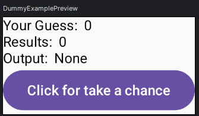

## V087 State Recomposition
- `Remember function`:
  - It is Used to create a persistent and rememebered state in JC (jetpack compose)
  - It Allows a composable to maintain its state accross recompositions, even when the composable is recreated (screen is refreshed) ehich happens a lot every single second.
    - recomposition: process of reenerating and updating the UI to reflect changes in the application state or user interactions.
- `mutable state property delegate`:
  - It is used to create a mutable state that can be updated
  - It is used in conjunction with remember funtion to manage changing data.

## V088 Dummy example
- todas as variaveis que estão com `remember` vao mandar signal de que mudaram no app. e por isso o UI muda.
``` kt
@Composable
fun DummyExample()
{
    val yourGuess = remember {mutableStateOf(0) }
    val result = remember { mutableStateOf(0)}
    val output = remember{mutableStateOf("None")}
    Column {
        Text(text = "Your Guess:  ${yourGuess.value}")
        Text(text = "Results:  ${result.value}")
        Text(text = "Output:  ${output.value}")

        Button(onClick = { /*TODO*/
            yourGuess.value = Random.nextInt(1,10)
            result.value = Random.nextInt(1,10)

            if(yourGuess.value == result.value){
                output .value = "WIN"
            }
            else{
                output .value = "LOOSE"
            }
        }) {
            Text(text = "Click for take a chance")
        }
    }

}

@Preview(showBackground = true)
@Composable
fun DummyExamplePreview() {
    DummyExample()
}
```



## V090 Understanding the by keyword

``` kt
@Composable
fun DummyExample()
{    
    var yourGuess by remember {mutableStateOf(0) }
    var result by remember { mutableStateOf(0)}
    var output by remember{mutableStateOf("None")}
    Column {
        Text(text = "Your Guess:  ${yourGuess}")
        Text(text = "Results:  ${result}")
        Text(text = "Output:  ${output}")

        Button(onClick = { /*TODO*/
            yourGuess = Random.nextInt(1,10)
            result = Random.nextInt(1,10)

            //yourGuess.value= myAns
            //result.value = bankAns

            if(yourGuess == result){
                output = "WIN"
            }
            else{
                output = "LOOSE"
            }
        }) {
            Text(text = "Click for take a chance")
        }
    }
}
```

## V091 Implementing state
- Para adicionar comportamento ao dropmenu e dropitems...

``` kt
Row{
    var iExpanded by remember{ mutableStateOf("false")}
    
    Box{
        Button(onClick = {
            iExpanded = true // o menu vai abrir
        }) {
            Text(text = "Click me")
            Icon(Icons.Default.ArrowDropDown, "Lobo")
        }
        DropdownMenu(expanded = iExpanded,
            onDismissRequest =
            {
                // o menu vai fechar ao clicar em qualquer regiao fora do menu
                iExpanded = false 
            })
        {
            DropdownMenuItem(text = { Text(text = "Lobo") },
                onClick = {
                    iExpanded = false
                    /* codigo here */ 
                })
            DropdownMenuItem(text = { Text(text = "Rufa") },
                onClick = {
                    iExpanded = false
                    /* codigo here */ 
                })
            DropdownMenuItem(text = { Text(text = "Rufo") },
                onClick = {
                    iExpanded = false
                    /* codigo here */ 
                })
            
        }
    }

            

            
            

```