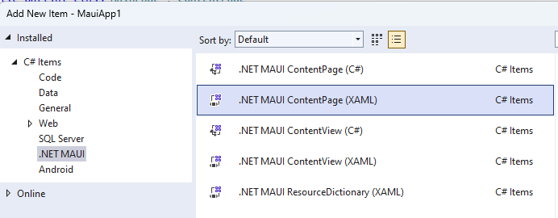

## V009. Introducción
- Una app maui puede tener 1 o más paginas.
- Existen varios tipos de pagina que serám explicados en esta pagina.

## V010. Estableciendo la página inicial en net maui
- Esto se hace en `App.xaml.cs` donde se tiene:
  - `MainPage = new AppShell();`
  - esto puede ser mudado por 
  - `MainPage = new MainPage();` por ejemplo. 

## V0011. El tipo de página ContentPage
- El más utilizado, permite agregar `layouts` y `controls`.
- Su etiqueta es `<ContentPage>`, la `MainPage` en la aplicacion inicial es una `ContentPage`
- Unicamente sólo puede tener un `root element`

- Para **agregar una nueva content page**:
1. Right click 
2. Add New Item
3. `.Net MAUI`
4. Aparecerán las opciones.

5. Escogemos la segunda, el nombre que le demos en este caso `ContentPageExample` criará una clase propia.
6. Ahora para hacerla la pagina inicial vamos a `App.xaml.cs` y 
   1. `MainPage = new ContentPageExample();`

## V012. El tipo de página NavigationPage
## V013. El tipo de página FlyoutPage
## V014. El tipo de página TabbedPage