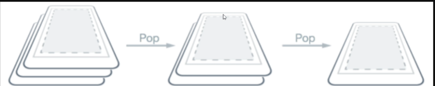

## V009. Introducción
- Una app maui puede tener 1 o más paginas.
- Existen varios tipos de pagina que serám explicados en esta pagina.

## V010. Estableciendo la página inicial en net maui
- Esto se hace en `App.xaml.cs` donde se tiene:
  - `MainPage = new AppShell();`
  - esto puede ser mudado por 
  - `MainPage = new MainPage();` por ejemplo. 


## V0011. El tipo de página ContentPage
- El más utilizado, permite agregar `layouts` y `controls`.
- Su etiqueta es `<ContentPage>`, la `MainPage` en la aplicacion inicial es una `ContentPage`
- Unicamente **sólo puede tener un** `root element`

- Para **agregar una nueva content page**:
1. Right click 
2. Add New Item
3. `.Net MAUI`
4. Aparecerán las opciones.

5. Escogemos la segunda, el nombre que le demos en este caso `ContentPageExample` criará una clase propia.
6. Ahora para hacerla la pagina inicial vamos a `App.xaml.cs` y 
   1. `MainPage = new ContentPageExample();`


## V012. El tipo de página NavigationPage
- Está baseada en una *pila de nabegación*
- Se inicia en una pagina inicial y conforme se abren otras se van *apilando* en la anterior.


- Si se quiere volver a la anterior las paginas van *siendo retiradas* hasta llegar a la deseada.



### Example
- En la página `MainPage.xaml` hay un código de ejemplo para el método `OnCounterClicked`. Este aumenta el valor de la variable en pantalla.

``` cs
private void OnCounterClicked(object sender, EventArgs e)
	{
		count++;

		if (count == 1)
			CounterBtn.Text = $"Clicked {count} time";
		else
			CounterBtn.Text = $"Clicked {count} times";

		SemanticScreenReader.Announce(CounterBtn.Text);
	}
```
- Vamos a borrarlo y substituirlo por codigo para *navegar* entre páginas. En este caso las funciones:
  - `Navigation.PushAsync()` crea una instancia de un objeto `Page` y lo pone encima de la `Page` que lo llamó.
  - `Navigation.PopAsync()`
- Utilizatemos la clase creada en los videos anteriores `ContentPageExample`

``` cs
//MainPage.xaml.cs
private void OnCounterClicked(object sender, EventArgs e)
	{
		Navigation.PushAsync(new ContentPageExample());
	}
```

- Para que esto funcione debemos setar también el tipo de pagina para `NavigationPage`:

``` cs
//App.xaml.cs
public partial class App : Application
{
	public App()
	{
		InitializeComponent();

		MainPage = new NavigationPage(new MainPage());
	}
}
```

- Devido a que `ContentPageExample` es llamada como `NavigationPage` una barra de navegacion es creada para volver a la pantalla inicial.


- Se puede customizar la llamada de la `MainPage` para adicionar parámetros como en el siguiente ejemplo:

``` cs
public partial class App : Application
{
	public App()
	{
		InitializeComponent();

		var navPage = new NavigationPage(new MainPage());

		navPage.BarBackground = Colors.Chocolate;
		navPage.BarTextColor = Colors.White;

		MainPage = navPage;
	}
}
```

## V013. El tipo de página FlyoutPage
- Son páginas del siguiente tipo (Es decir una bventana deslizable):


- Para esto se crea una nueva `ContentPage` e.g. `FlyoutPageExample` 
- Para cambiar su `xaml` a `FlyoutPage` se tiene que substituir 
  1. `ContentPage` por `FlyoutPage` en `FlyoutPageExample.xaml`. 
     - Al hacer esto el codigo interno a la pagina mostrará error.
     
     - El contenido debe estar dentro de una de las dos etiquetas. Estas SI pueden contener una `ContentPage` 
       - `<FlyoutPage.Flyout>`
       - `<FlyoutPage.Detail`     
  2. En `FlyoutPageExample.xaml.cs` heredar de `FlyoutPage`
     
  3. Finalmente adicionar su constructor en `App.xaml.cs`
     - `MainPage = new FlyoutPageExample();`
  
- Un codigo de ejemplo sería:


## V014. El tipo de página TabbedPage