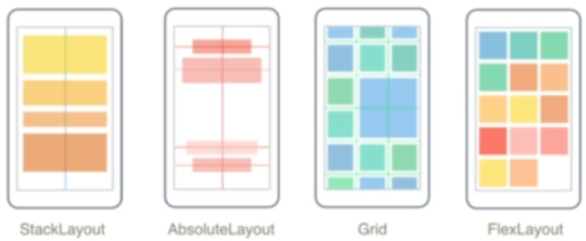
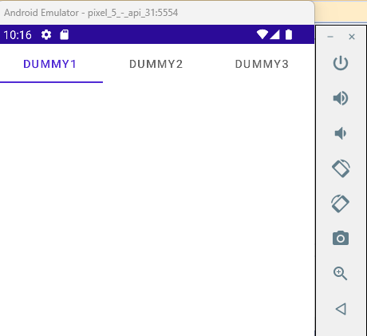
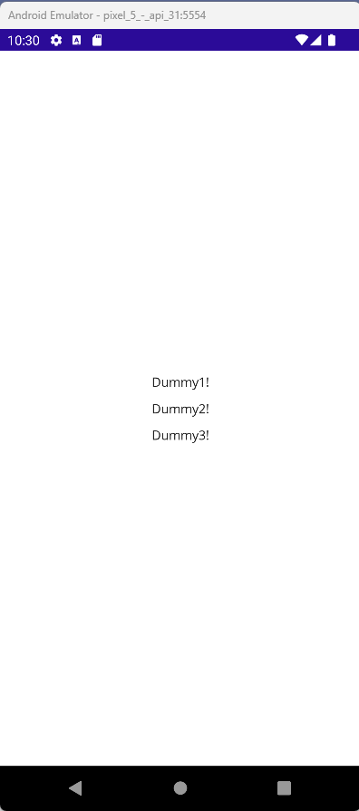
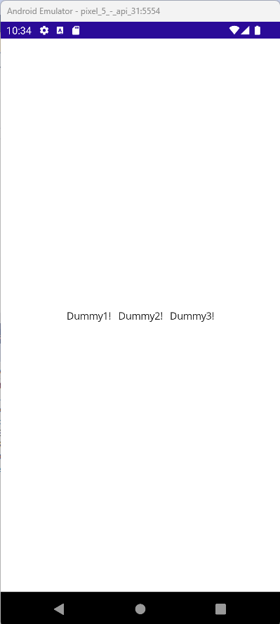
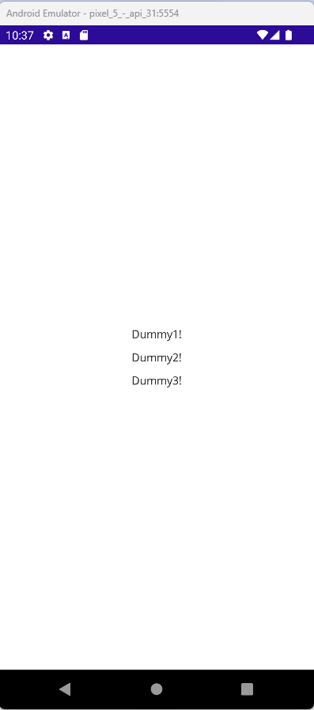
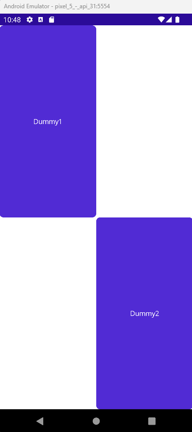
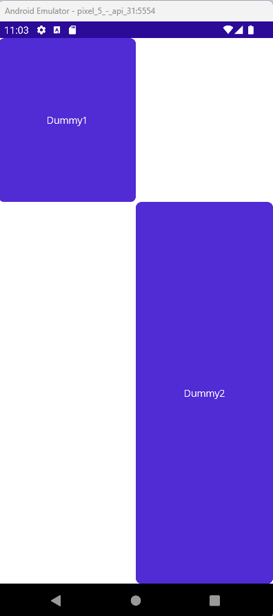
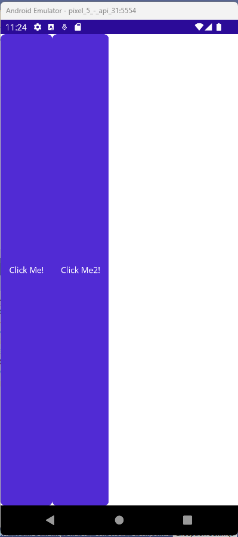
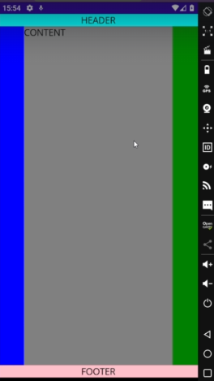

<!-- vscode-markdown-toc -->
* 1. [V016. Introducción](#V016.Introduccin)
* 2. [V017. StackLayout](#V017.StackLayout)
* 3. [V018. Github repo](#V018.Githubrepo)
* 4. [V019. HorizontalStackLayout y VerticalStackLayout](#V019.HorizontalStackLayoutyVerticalStackLayout)
* 5. [V021. Grid](#V021.Grid)
* 6. [V023. AbsoluteLayout](#V023.AbsoluteLayout)
* 7. [V024. Github repo](#V024.Githubrepo)
* 8. [V025. FlexLayout](#V025.FlexLayout)

<!-- vscode-markdown-toc-config
	numbering=true
	autoSave=true
	/vscode-markdown-toc-config -->
<!-- /vscode-markdown-toc -->


##  1. <a name='V016.Introduccin'></a>V016. Introducción



##  2. <a name='V017.StackLayout'></a>V017. StackLayout
1. Crear una nueva `ContentPage` e.g. `StackPageExample`
3. Eliminar el contenido de `StackPageExample.xaml`.  
   1. Adicionar el codigo que se encuentra abajo. O layout tiene atributos como `VerticalOptions` e `Spacing`
4. adicionar su constructor en `App.xaml.cs`
   - `MainPage = new StackPageExample();`
5. Finalmente tenemos la aplicacion


``` xml
    <StackLayout VerticalOptions="Center" Spacing="10">
        <Label 
            Text="Dummy1!"
            VerticalOptions="Center" 
            HorizontalOptions="Center" />
        <Label 
            Text="Dummy2!"
            VerticalOptions="Center" 
            HorizontalOptions="Center" />
        <Label 
            Text="Dummy3!"
            VerticalOptions="Center" 
            HorizontalOptions="Center" />
    </StackLayout>
```

- Resultado

##  4. <a name='V019.HorizontalStackLayoutyVerticalStackLayout'></a>V019. HorizontalStackLayout y VerticalStackLayout

### Horizontal Stack Layout
- An special case of the `StackLayout`
- The only difference is the xaml code

``` xml
    <HorizontalStackLayout HorizontalOptions="Center" VerticalOptions="Center" Spacing="10">
        <Label 
            Text="Dummy1!"
            VerticalOptions="Center" 
            HorizontalOptions="Center" />
        <Label 
            Text="Dummy2!"
            VerticalOptions="Center" 
            HorizontalOptions="Center" />
        <Label 
            Text="Dummy3!"
            VerticalOptions="Center" 
            HorizontalOptions="Center" />
    </HorizontalStackLayout>
```


### Vertical Stack Layout

- An special case of the `StackLayout`
- The only difference is the xaml code

``` xml
    <VerticalStackLayout HorizontalOptions="Center" VerticalOptions="Center" Spacing="10">
        <Label 
            Text="Dummy1!"
            VerticalOptions="Center" 
            HorizontalOptions="Center" />
        <Label 
            Text="Dummy2!"
            VerticalOptions="Center" 
            HorizontalOptions="Center" />
        <Label 
            Text="Dummy3!"
            VerticalOptions="Center" 
            HorizontalOptions="Center" />
    </VerticalStackLayout>
``` 



##  5. <a name='V021.Grid'></a>V021. Grid
- Por defult un `Grid` solo crea una 1 fila y 1 columna
- La posicion de cada columna y file comienza en `0`


``` xml
	<Grid>
        <Grid.RowDefinitions>
            <RowDefinition/>
            <RowDefinition/>
        </Grid.RowDefinitions>
        <Grid.ColumnDefinitions>
            <ColumnDefinition/>
            <ColumnDefinition/>
        </Grid.ColumnDefinitions>

        <Button Text="Dummy1" Grid.Row="0" Grid.Column="0" />
        <Button Text="Dummy2" Grid.Row="1" Grid.Column="1" />
    </Grid>
```


- El tamaño de las filas y columnas puede ser editado como numeros `"50"` o como porcentaje de pantalla `".3*"` (`30%`)
- UN ejempl es mostrado

``` xml
    <Grid>
        <Grid.RowDefinitions>
            <RowDefinition Height=".3*"/>
            <RowDefinition Height=".7*"/>
        </Grid.RowDefinitions>
        <Grid.ColumnDefinitions>
            <ColumnDefinition/>
            <ColumnDefinition/>
        </Grid.ColumnDefinitions>

        <Button Text="Dummy1" Grid.Row="0" Grid.Column="0" />
        <Button Text="Dummy2" Grid.Row="1" Grid.Column="1" />
    </Grid>
```



##  6. <a name='V023.AbsoluteLayout'></a>V023. AbsoluteLayout
- The old way, `0,0` top-left corner and bottom-right is `w,h`
- Two ways:
  - Full absolute: medidas en numeros enteros.
    - Solo usa el tag `AbsoluteLayout.LayoutBounds`
  - Proportional: usa las tags que terminan en `Proportional` i.e. `SizeProportional, XProportional`
    - Se puede utilizar más de dos tags en `LayoutFlags`
``` xml
<AbsoluteLayout>
    <Button Text="Click Me1!" AbsoluteLayout.LayoutBounds="0,200,250,100"/>
    <Button Text="Click Me2!" 
        AbsoluteLayout.LayoutBounds="0,400,.5,.3"
        AbsoluteLayout.LayoutFlags="SizeProportional"/>    
    <Button Text="Click Me3!" 
        AbsoluteLayout.LayoutBounds="0,600,.5,.3"
        AbsoluteLayout.LayoutFlags="SizeProportional, XProportional"/>            
</AbsoluteLayout>
```

##  8. <a name='V025.FlexLayout'></a>V025. FlexLayout

- Puede organizar vertical y horizontalmente los componentes en una fila.
- Puede controlar la orientacion y alineacion para diferentes tamaños de pantalla.

- Un ejemplo seria:

``` xml
<FlexLayout>
    <Button Text="Click Me!" />
    <Button Text="Click Me2!" />
</FlexLayout>
```



- Tiene las siguientes propiedades:
  - `Direction=Strech` comportamiento por default
  - `Direction=Row` los alinea horizontalmente  a la izquierda
  - `Direction=RowReverse` los alinea horizontalmente  a la derecha
  - `Direction=Column` los alinea verticalmente en la parte superior
  - `Direction=ColumnReverse` los alinea verticalmente en la parte inferior
  - `Direction=Center` los alinea horizontalmente  en el centro

- Un ejemplo de como controlar toda la pantalla es el siguiente:
``` xml
    <FlexLayout Direction="Column">

        <!-- Header -->
        <Label Text="HEADER"
               FontSize="18"
               BackgroundColor="Aqua"
               HorizontalTextAlignment="Center" />

        <!-- Body -->
        <FlexLayout FlexLayout.Grow="1">

            <!-- Content -->
            <Label Text="CONTENT"
                   FontSize="18"
                   BackgroundColor="Gray"
                   HorizontalTextAlignment="Center"
                   VerticalTextAlignment="Center"
                   FlexLayout.Grow="1" />

            <!-- Navigation items-->
            <BoxView FlexLayout.Basis="150"
                     FlexLayout.Order="-1"
                     Color="Blue" />

            <!-- Aside items -->
            <BoxView FlexLayout.Basis="50"
                     Color="Green" />

        </FlexLayout>

        <!-- Footer -->
        <Label Text="FOOTER"
               FontSize="18"
               BackgroundColor="Pink"
               HorizontalTextAlignment="Center" />
    </FlexLayout>
```
