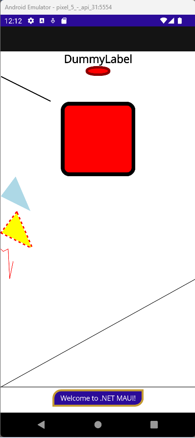
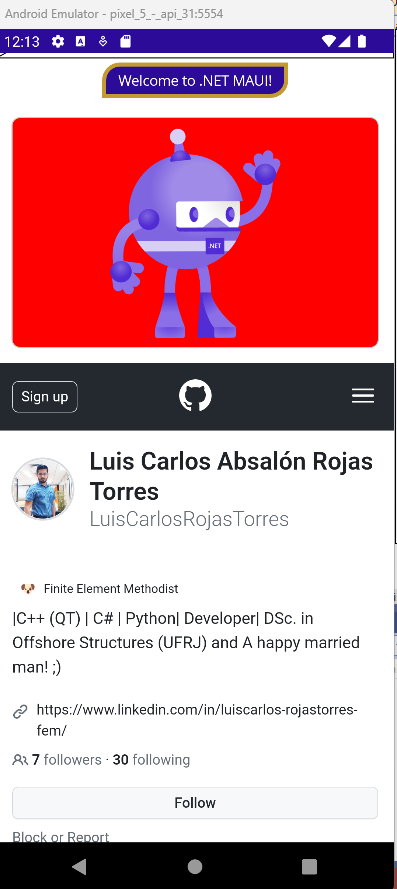
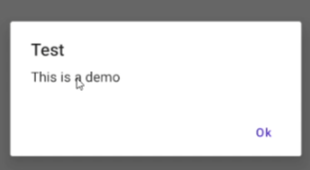
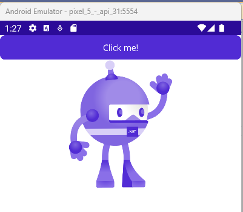
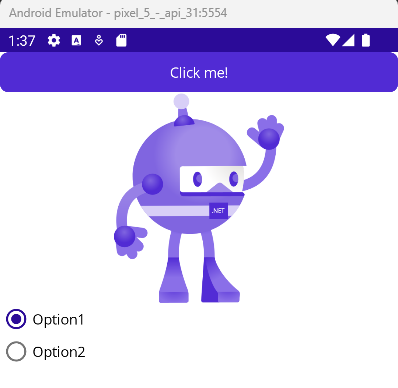
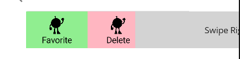

<!-- vscode-markdown-toc -->
* 1. [V27. Controles de Presentación](#V27.ControlesdePresentacin)
* 2. [V28. Controles que inician commandos](#V28.Controlesqueiniciancommandos)
* 3. [V29. Controles para establecer valores](#V29.Controlesparaestablecervalores)
* 4. [V30. Controles de edición de texto](#V30.Controlesdeedicindetexto)
* 5. [V31. Controles para indicar actividad](#V31.Controlesparaindicaractividad)
* 6. [V32. Controles para desplegar colecciones](#V32.Controlesparadesplegarcolecciones)

<!-- vscode-markdown-toc-config
	numbering=true
	autoSave=true
	/vscode-markdown-toc-config -->
<!-- /vscode-markdown-toc -->

##  1. <a name='V27.ControlesdePresentacin'></a>V27. Controles de Presentación
- To add **scroll** property to the layout insert the layout into a `ScrollView`:

``` xml
<ScrollView>
	<StackLayout>
	...
	</StackLayout>
</ScrollView>
```

- `BoxView`:

``` xml
<BoxView BackgroundColor="Black"
                 HeightRequest="200"/>
```

- `Label`:

``` xml
<Label Text="DummyLabel" TextColor="Black"
               FontAttributes="Bold" FontSize="Large"
               HorizontalTextAlignment="Center"/>
```

- `Ellipse`:

``` xml
<Ellipse Fill="Red"
         Stroke="DarkRed"
         StrokeThickness="10"
         HeightRequest="200"
         HorizontalOptions="Center"
         WidthRequest="100"/>
```

- `Line`:
  
``` xml
<Line Stroke="Black"
        X1="0"
        Y1="0"
        X2="100"
        Y2="50"
        StrokeThickness="2" />
```
- `Rectangle`
``` xml
<Rectangle Fill="Red"
            Stroke="Black"
            StrokeThickness="15"
            HeightRequest="150"
            HorizontalOptions="Center"
            WidthRequest="150"
            RadiusX="10"
            RadiusY="10" />
```
- `Polygon`
``` xml
<Polygon Fill="LightBlue"
        Points="40,10 70,80 10,50" />
<Polygon Fill="Yellow"
        Points="40,10 70,80 10,50" 
        Stroke="Red"
        StrokeDashArray="1,1"
        StrokeDashOffset="6"
        StrokeThickness="5" />
```
- `Polyline`
``` xml
<Polyline Points="0,0 5,5 15,0 18,60 25,25 "
            Stroke="Red" />
```
- `Path`
``` xml
<Path Aspect="Uniform"
        Data="M 10,100 L 100,100 100,50Z"
        HorizontalOptions="Center"
        Stroke="Black"/>
```
- `Border`
``` xml
<Border Stroke="#C49B33"
        StrokeThickness="4"
        Background="#2B0B98"
        Padding="16,8"
        HorizontalOptions="Center">
        <Border.StrokeShape>
            <RoundRectangle CornerRadius="40,0,0,40" />
        </Border.StrokeShape>
        <Label Text="Welcome to .NET MAUI!"
        	VerticalOptions="Center" 
            HorizontalOptions="Center" 
            TextColor="White"/>
</Border>
```

- `Frame`
``` xml
<Frame Margin="15"
        BackgroundColor="Red"
        Padding="10">
        <Image Source="dotnet_bot.svg"/>
</Frame>
```
- `WebView`
``` xml
<WebView HeightRequest="500"
        Source="https://github.com/LuisCarlosRojasTorres"/>
```




##  2. <a name='V28.Controlesqueiniciancommandos'></a>V28. Controles que inician commandos

### Button
- Su evento se llama `Clicked`
  - `<Button x:Name="btnDummy" Text="Click me!" Clicked="btnDummy_Clicked"/>`
- El código de este evento se encuentra en la `code behind` asociado. Este es de la siguiente forma:

``` cs 
private void btnDummy_Clicked(object sender, EventArgs e)
{
    // Code here!
    DisplayAlert( "Test", "This is a Demo", "Ok")
}
```

### Display Alert
- Es el tipo de mensaje que aparece en un dialogo.
- TIene la siguiente sintaxis:
  - `DisplayAlert( "Test", "This is a Demo", "Ok")`



### Image Button
- Similar al buton pero se puede utilizar una imagen. Conveniente para cuando tienes una imagen en svg.
- `<ImageButton x:Name="btnDummy2" Source="git.png" Clicked="btnDummy_Clicked"/>`

Ambos botones se verian asi:


### Radio button
- Los de toda la vida...
  - `GroupName` para agruparlos
- Un ejemplo a seguir:

``` xml
<RadioButton CheckedChanged="RadioButton_CheckedChanged"
                Content="Option1" GroupName="Group1"/>
<RadioButton CheckedChanged="RadioButton_CheckedChanged"
                Content="Option2" GroupName="Group1"/>
``` 



### Search Bar
- Es la barra de búsqueda.

``` xml
<SearchBar x:Name="searchControl"
                   SearchButtonPressed="searchControl_SearchButtonPressed" />
```
- Un codigo para la funcion de evento podria ser el siguiente:

``` cs 
private void searchControl_SearchButtonPressed(object sender, EventArgs e)
{
   DisplayAlert("Searching", $"Searching: {searchControl.Text}", "OK");
}
```


### SwipeView
- Elemento muy comun en los programas de email donde al darle swipe a un buton se abren ciertas opciones.
- Tiene una estructura especifica mostrada a seguir:
``` xml
<SwipeView>
            <SwipeView.LeftItems>
                <SwipeItems>
                    <SwipeItem
                            BackgroundColor="LightGreen"
                            IconImageSource="dotnet_bot.svg"  
                            Invoked="SwipeItem_Invoked"
                            Text="Favorite"/>
                    <SwipeItem
                            BackgroundColor="LightPink"
                            IconImageSource="dotnet_bot.svg"  
                            Invoked="SwipeItem_Invoked"
                            Text="Delete"/>

                </SwipeItems>
            </SwipeView.LeftItems>
            <Grid BackgroundColor="LightGray"
                      HeightRequest="60"
                      WidthRequest="300">
                <Label HorizontalOptions="Center"
                           Text="Swipe Right"
                           VerticalOptions="Center"/>
            </Grid>
</SwipeView>
```

- Antes de dar swipe:

- Durante 

##  3. <a name='V29.Controlesparaestablecervalores'></a>V29. Controles para establecer valores

### CheckBox
- Para adicionar etiqueta precisa de un controlador externo.


``` xml
<CheckBox IsChecked="True">
```

### Slider

``` xml
<Slider x:Name="slider"
        Minimum="0"
        Maximum="10"
        MinimumTrackColor="Yellow"
        MaximumTrackColor="Green"
        ThumbColor="DarkRed"
        ValueChanged="slider_ValueChanged"
/>
```

### Stepper
``` xml
<Stepper x:Name="stepper" 
        ValueChanged="stepper_ValueChanged"
        Maximum="10"
        Minimum="2"
        Increment="2"/>
```

### Switch
``` xml
<Switch IsToggled="True"/>
```

### DatePicker
``` xml
<DatePicker />
```

### TimePicker
``` xml
<TimePicker/>
```

##  4. <a name='V30.Controlesdeedicindetexto'></a>V30. Controles de edición de texto

##  5. <a name='V31.Controlesparaindicaractividad'></a>V31. Controles para indicar actividad

##  6. <a name='V32.Controlesparadesplegarcolecciones'></a>V32. Controles para desplegar colecciones

