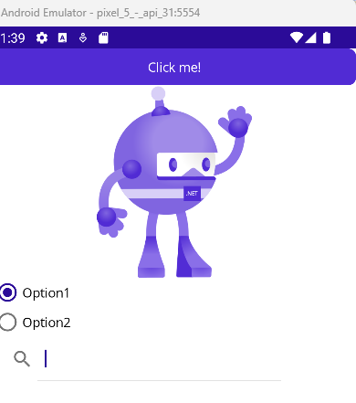
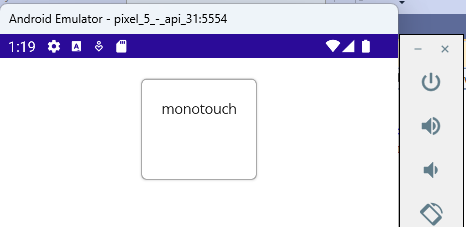

<!-- vscode-markdown-toc -->
* 1. [V27. Controles de Presentación](#V27.ControlesdePresentacin)
* 2. [V28. Controles que inician commandos](#V28.Controlesqueiniciancommandos)
* 3. [V29. Controles para establecer valores](#V29.Controlesparaestablecervalores)
* 4. [V30. Controles de edición de texto](#V30.Controlesdeedicindetexto)
* 5. [V31. Controles para indicar actividad](#V31.Controlesparaindicaractividad)
* 6. [V32. Controles para desplegar colecciones](#V32.Controlesparadesplegarcolecciones)

<!-- vscode-markdown-toc-config
	numbering=true
	autoSave=true
	/vscode-markdown-toc-config -->
<!-- /vscode-markdown-toc -->

##  1. <a name='V27.ControlesdePresentacin'></a>V27. Controles de Presentación
- To add **scroll** property to the layout insert the layout into a `ScrollView`:

``` xml
<ScrollView>
	<StackLayout>
	...
	</StackLayout>
</ScrollView>
```

- `BoxView`:

``` xml
<BoxView BackgroundColor="Black"
                 HeightRequest="200"/>
```

- `Label`:

``` xml
<Label Text="DummyLabel" TextColor="Black"
               FontAttributes="Bold" FontSize="Large"
               HorizontalTextAlignment="Center"/>
```

- `Ellipse`:

``` xml
<Ellipse Fill="Red"
         Stroke="DarkRed"
         StrokeThickness="10"
         HeightRequest="200"
         HorizontalOptions="Center"
         WidthRequest="100"/>
```

- `Line`:
  
``` xml
<Line Stroke="Black"
        X1="0"
        Y1="0"
        X2="100"
        Y2="50"
        StrokeThickness="2" />
```
- `Rectangle`
``` xml
<Rectangle Fill="Red"
            Stroke="Black"
            StrokeThickness="15"
            HeightRequest="150"
            HorizontalOptions="Center"
            WidthRequest="150"
            RadiusX="10"
            RadiusY="10" />
```
- `Polygon`
``` xml
<Polygon Fill="LightBlue"
        Points="40,10 70,80 10,50" />
<Polygon Fill="Yellow"
        Points="40,10 70,80 10,50" 
        Stroke="Red"
        StrokeDashArray="1,1"
        StrokeDashOffset="6"
        StrokeThickness="5" />
```
- `Polyline`
``` xml
<Polyline Points="0,0 5,5 15,0 18,60 25,25 "
            Stroke="Red" />
```
- `Path`
``` xml
<Path Aspect="Uniform"
        Data="M 10,100 L 100,100 100,50Z"
        HorizontalOptions="Center"
        Stroke="Black"/>
```
- `Border`
``` xml
<Border Stroke="#C49B33"
        StrokeThickness="4"
        Background="#2B0B98"
        Padding="16,8"
        HorizontalOptions="Center">
        <Border.StrokeShape>
            <RoundRectangle CornerRadius="40,0,0,40" />
        </Border.StrokeShape>
        <Label Text="Welcome to .NET MAUI!"
        	VerticalOptions="Center" 
            HorizontalOptions="Center" 
            TextColor="White"/>
</Border>
```

- `Frame`
``` xml
<Frame Margin="15"
        BackgroundColor="Red"
        Padding="10">
        <Image Source="dotnet_bot.svg"/>
</Frame>
```
- `WebView`
``` xml
<WebView HeightRequest="500"
        Source="https://github.com/LuisCarlosRojasTorres"/>
```


##  2. <a name='V28.Controlesqueiniciancommandos'></a>V28. Controles que inician commandos

### Button
- Su evento se llama `Clicked`
  - `<Button x:Name="btnDummy" Text="Click me!" Clicked="btnDummy_Clicked"/>`
- El código de este evento se encuentra en la `code behind` asociado. Este es de la siguiente forma:

``` cs 
private void btnDummy_Clicked(object sender, EventArgs e)
{
    // Code here!
    DisplayAlert( "Test", "This is a Demo", "Ok")
}
```

### Display Alert
- Es el tipo de mensaje que aparece en un dialogo.
- TIene la siguiente sintaxis:
  - `DisplayAlert( "Test", "This is a Demo", "Ok")`


### Image Button
- Similar al buton pero se puede utilizar una imagen. Conveniente para cuando tienes una imagen en svg.
- `<ImageButton x:Name="btnDummy2" Source="git.png" Clicked="btnDummy_Clicked"/>`

Ambos botones se verian asi:


### Radio button
- Los de toda la vida...
  - `GroupName` para agruparlos
- Un ejemplo a seguir:

``` xml
<RadioButton CheckedChanged="RadioButton_CheckedChanged"
                Content="Option1" GroupName="Group1"/>
<RadioButton CheckedChanged="RadioButton_CheckedChanged"
                Content="Option2" GroupName="Group1"/>
``` 


### Search Bar
- Es la barra de búsqueda.

``` xml
<SearchBar x:Name="searchControl"
                   SearchButtonPressed="searchControl_SearchButtonPressed" />
```
- Un codigo para la funcion de evento podria ser el siguiente:

``` cs 
private void searchControl_SearchButtonPressed(object sender, EventArgs e)
{
   DisplayAlert("Searching", $"Searching: {searchControl.Text}", "OK");
}
```



### SwipeView
- Elemento muy comun en los programas de email donde al darle swipe a un buton se abren ciertas opciones.
- Tiene una estructura especifica mostrada a seguir:
``` xml
<SwipeView>
            <SwipeView.LeftItems>
                <SwipeItems>
                    <SwipeItem
                            BackgroundColor="LightGreen"
                            IconImageSource="dotnet_bot.svg"  
                            Invoked="SwipeItem_Invoked"
                            Text="Favorite"/>
                    <SwipeItem
                            BackgroundColor="LightPink"
                            IconImageSource="dotnet_bot.svg"  
                            Invoked="SwipeItem_Invoked"
                            Text="Delete"/>

                </SwipeItems>
            </SwipeView.LeftItems>
            <Grid BackgroundColor="LightGray"
                      HeightRequest="60"
                      WidthRequest="300">
                <Label HorizontalOptions="Center"
                           Text="Swipe Right"
                           VerticalOptions="Center"/>
            </Grid>
</SwipeView>
```

- Antes de dar swipe:

- Durante 

##  3. <a name='V29.Controlesparaestablecervalores'></a>V29. Controles para establecer valores

### CheckBox
- Para adicionar etiqueta precisa de un controlador externo.


``` xml
<CheckBox IsChecked="True">
```

### Slider

``` xml
<Slider x:Name="slider"
        Minimum="0"
        Maximum="10"
        MinimumTrackColor="Yellow"
        MaximumTrackColor="Green"
        ThumbColor="DarkRed"
        ValueChanged="slider_ValueChanged"
/>
```

``` cs
private void slider_ValueChanged(object sender, ValueChangedEventArgs e)
{
    lblSlider.Text = slider.Value.ToString();
}    
```

### Stepper
``` xml
<Stepper x:Name="stepper" 
        ValueChanged="stepper_ValueChanged"
        Maximum="10"
        Minimum="2"
        Increment="2"/>
```

``` cs
private void stepper_ValueChanged(object sender, ValueChangedEventArgs e)
{
    if (stepper != null)
    {
        lblSlider.Text = stepper.Value.ToString();
    }
}
```
### Switch
``` xml
<Switch IsToggled="True" />
```

### DatePicker
``` xml
<DatePicker />
```

### TimePicker
``` xml
<TimePicker/>
```


##  4. <a name='V30.Controlesdeedicindetexto'></a>V30. Controles de edición de texto

### Entry
Para una linea de texto
Tiene dos eventos:
- TextChanged: cada vez que una tecla es precionada.
- Complete: cuando se apriete el boton de finalizado en el teclado virtual.

``` xml
<Entry Placeholder="Dummy1"
        PlaceholderColor="Blue"
        IsPassword="False"
        Keyboard="Default" />
```

### Editor
Para multiples lineas de texto

``` xml
<Editor Autosize="TextChanges">
```

##  5. <a name='V31.Controlesparaindicaractividad'></a>V31. Controles para indicar actividad

## Activity Indicator 
- El tipico mensaje de *loading*

``` xml
<ActivityIndicator IsRunning="True" Color="Blue" />
```

## Progress Bar

- Si se conocen cuantos pasos el proceso tiene es recomendable usar una progress bar.
  - El progreso se da en porcentaje.

``` xml
<ProgressBar Progress=".5" />
```

## V032. Controles para  desplegar Colecciones

### CarouselView
- Necesitamos un origen de informacion, esto es realizado en `ItemsSource`
- Para dar formato a los elementos mostrados se usa un `ItemTemplate` i.e. ponerlo dentro de un frame.
``` xml
<CarouselView>
<CarouselView.ItemsSource>
        <x:Array Type="{x:Type x:String}">
                <x:String>mono</x:String>
                <x:String>monodroid</x:String>
                <x:String>monotouch</x:String>
                <x:String>monorail</x:String>
                <x:String>monodevelop</x:String>
                <x:String>monotone</x:String>
                <x:String>monopoly</x:String>
                <x:String>monomodal</x:String>
                <x:String>mononucleosis</x:String>
        </x:Array>
</CarouselView.ItemsSource>

<CarouselView.ItemTemplate>
        <DataTemplate>
                <StackLayout>
                    <Frame Margin="20"
                           BorderColor="DarkGray"
                           CornerRadius="5"
                           HasShadow="True"
                           HeightRequest="100"
                           HorizontalOptions="Center"
                           VerticalOptions="CenterAndExpand">
                        <Label Text="{Binding .}"/>
                    </Frame>
                </StackLayout>
        </DataTemplate>
</CarouselView.ItemTemplate>
</CarouselView>   
```

El resultado es el siguiente:



- Hasta ahora nos encontramos con el siguiente problema. **NO SABEMOS EN QUE ELEMENTO NOS ENCONTRAMOS**
  - Para poder saber esto necesitamos un `IndicatorView`
    - Este debe ser implementado y adicioando como argumento en el `<CarouselView>`
- El codigo final es el siguiente:
```xml
<CarouselView IndicatorView="indicatorView">
        <CarouselView.ItemsSource>
            <x:Array Type="{x:Type x:String}">
                <x:String>mono</x:String>
                <x:String>monodroid</x:String>
                <x:String>monotouch</x:String>
                <x:String>monorail</x:String>
                <x:String>monodevelop</x:String>
                <x:String>monotone</x:String>
                <x:String>monopoly</x:String>
                <x:String>monomodal</x:String>
                <x:String>mononucleosis</x:String>
            </x:Array>
        </CarouselView.ItemsSource>
        <CarouselView.ItemTemplate>
            <DataTemplate>
                <StackLayout>
                    <Frame Margin="20"
                           BorderColor="DarkGray"
                           CornerRadius="5"
                           HasShadow="True"
                           HeightRequest="100"
                           HorizontalOptions="Center"
                           VerticalOptions="CenterAndExpand">
                        <Label Text="{Binding .}"/>
                    </Frame>
                </StackLayout>

            </DataTemplate>
        </CarouselView.ItemTemplate>
     </CarouselView>

        <IndicatorView
        x:Name="indicatorView"
        HorizontalOptions="Center"
        IndicatorColor="LightGray"
        SelectedIndicatorColor="DarkGray"/>
```


### List View
- Parecido al anterior pero vertical
- Requiere el tag `ViewCel` y `HasUnevenRows`
``` xml
    <ListView HasUnevenRows="True">
        <ListView.ItemsSource>
            <x:Array Type="{x:Type x:String}">
                <x:String>mono</x:String>
                <x:String>monodroid</x:String>
                <x:String>monotouch</x:String>
                <x:String>monorail</x:String>
                <x:String>monodevelop</x:String>
                <x:String>monotone</x:String>
                <x:String>monopoly</x:String>
                <x:String>monomodal</x:String>
                <x:String>mononucleosis</x:String>
            </x:Array>
        </ListView.ItemsSource>
        <ListView.ItemTemplate>
            <DataTemplate>
                <ViewCell>
                    <StackLayout>
                        <Frame Margin="20"
                           BorderColor="DarkGray"
                           CornerRadius="5"
                           HasShadow="True"
                           HeightRequest="100"
                           HorizontalOptions="Center"
                           VerticalOptions="CenterAndExpand">
                        <Label Text="{Binding .}"/>
                    </Frame>
                        </StackLayout>
                </ViewCell>

            </DataTemplate>
        </ListView.ItemTemplate>
     </ListView>
```


- Cuando se seleciona queda asi


### Collection View
- Salio despues de `ListView`
   - no necesita `ViewCell`
``` xml
    <CollectionView SelectionMode="None">
        <CollectionView.ItemsSource>
            <x:Array Type="{x:Type x:String}">
                <x:String>mono</x:String>
                <x:String>monodroid</x:String>
                <x:String>monotouch</x:String>
                <x:String>monorail</x:String>
                <x:String>monodevelop</x:String>
                <x:String>monotone</x:String>
                <x:String>monopoly</x:String>
                <x:String>monomodal</x:String>
                <x:String>mononucleosis</x:String>
            </x:Array>
        </CollectionView.ItemsSource>
        <CollectionView.ItemTemplate>
            <DataTemplate>
                    <StackLayout>
                        <Frame Margin="20"
                           BorderColor="DarkGray"
                           CornerRadius="5"
                           HasShadow="True"
                           HeightRequest="100"
                           HorizontalOptions="Center"
                           VerticalOptions="CenterAndExpand">
                        <Label Text="{Binding .}"/>
                    </Frame>
                        </StackLayout>
            </DataTemplate>
        </CollectionView.ItemTemplate>
     </CollectionView>
```
- Similar al `ListView` pero no puede seleccionar elementos.
  - Para esto se usa el argumento `SelectionMode="Single"` (por default está `SelectionMode=None`). 
  - Incluso se puede seleccionar multiples elementos con `SelectionMode="Multiple"`

### Picker


``` cs
    <StackLayout>
        <Picker VerticalOptions="Center">
            <Picker.ItemsSource>
                <x:Array Type="{x:Type x:String}">
                    <x:String>mono</x:String>
                    <x:String>monodroid</x:String>
                    <x:String>monotouch</x:String>
                    <x:String>monorail</x:String>
                    <x:String>monodevelop</x:String>
                    <x:String>monotone</x:String>
                    <x:String>monopoly</x:String>
                    <x:String>monomodal</x:String>
                    <x:String>mononucleosis</x:String>
                </x:Array>
            </Picker.ItemsSource>
        </Picker>
    </StackLayout>
```


### Table View

``` xml
<TableView Intent="Settings">
        <TableRoot>
            <TableSection Title="First Section">
                <TextCell Detail="TextCell Detail" Text="TextCell1" />
                <EntryCell Label="Entry Label" Text="EntryCell Text1" />
                <SwitchCell Text="SwitchCell Text1" />
                <ImageCell
                    Detail="ImageCell Detail"
                    ImageSource="dotnet_bot.svg"
                    Text="ImageCell Text1" />
            </TableSection>
            <TableSection Title="Second Section">
                <TextCell Detail="TextCell Detail" Text="TextCell2" />
                <EntryCell Label="Entry Label" Text="EntryCell Text2" />
                <SwitchCell Text="SwitchCell Text2" />
                <ImageCell
                    Detail="ImageCell Detail"
                    ImageSource="dotnet_bot.svg"
                    Text="ImageCell Text2" />
            </TableSection>
        </TableRoot>
    </TableView>
```
- `Intent=Settings`:
