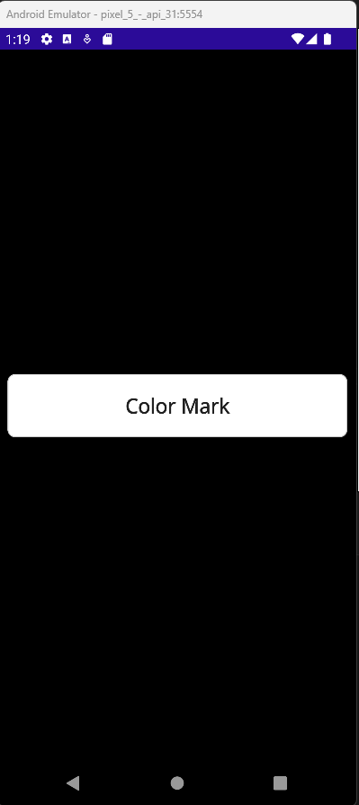
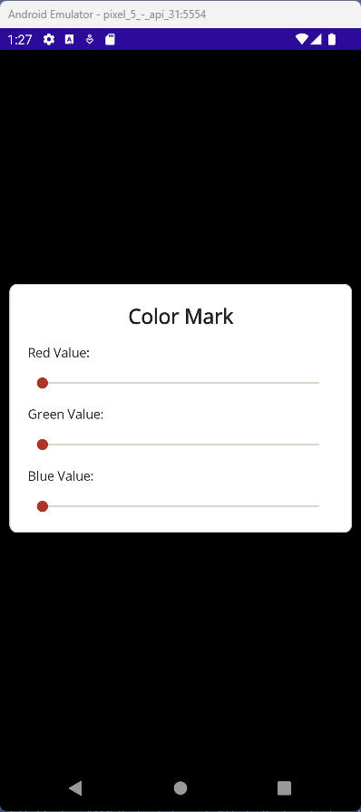
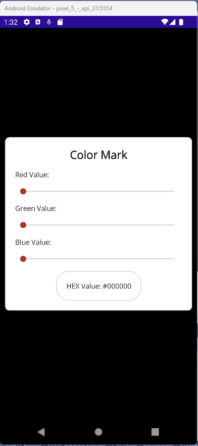
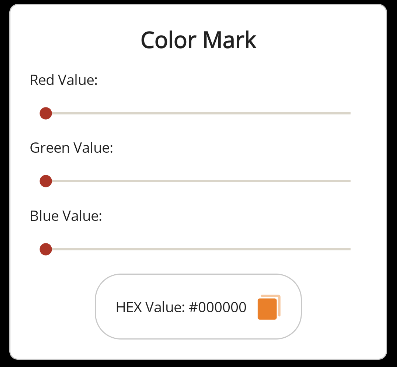
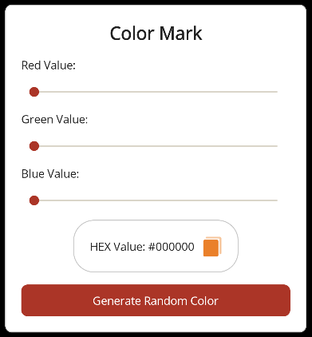

<!-- vscode-markdown-toc -->
* 1. [V034. Overview de la Aplicación](#V034.OverviewdelaAplicacin)
* 2. [V035. Especificando colores para el uso en una ContentPage](#V035.EspecificandocoloresparaelusoenunaContentPage)
* 3. [V036. Determinando el tipo de Layout para la aplicación](#V036.DeterminandoeltipodeLayoutparalaaplicacin)
* 4. [V037. Creando la sección de los controles](#V037.Creandolaseccindeloscontroles)
* 5. [V038. Cambiando el color de fondo](#V038.Cambiandoelcolordefondo)
* 6. [V039. Generando el color aleatorio](#V039.Generandoelcoloraleatorio)
* 7. [V040. Copiando el color al portapapeles](#V040.Copiandoelcoloralportapapeles)

<!-- vscode-markdown-toc-config
	numbering=true
	autoSave=true
	/vscode-markdown-toc-config -->
<!-- /vscode-markdown-toc -->

##  1. <a name='V034.OverviewdelaAplicacin'></a>V034. Overview de la Aplicación

##  2. <a name='V035.EspecificandocoloresparaelusoenunaContentPage'></a>V035. Especificando colores para el uso en una ContentPage
- Para no tener que definir colores en todo momento lo mejor es definirlos como `Resources`
``` xml
<ContentPage.Resources>
    <Color x:Key="Primary">#ab3527</Color>
    <Color x:Key="Secondary">#775752</Color>
    <Color x:Key="Tertiary">#705c2e</Color>
</ContentPage.Resources>
```
##  3. <a name='V036.DeterminandoeltipodeLayoutparalaaplicacin'></a>V036. Determinando el tipo de Layout para la aplicación

- Para conter los elementos siguientes utilizaremos un grid:
``` xml
<Grid x:Name="Container" BackgroundColor="Black">
        
</Grid>
```
##  4. <a name='V037.Creandolaseccindeloscontroles'></a>V037. Creando la sección de los controles

- Se crea un frame para poner los slides
``` xml
<Grid x:Name="Container" BackgroundColor="Black">
    <Frame Margin="10,0,10,0" VerticalOptions="Center">
	<VerticalStackLayout Spacing="15" VerticalOptions="Center">
        <Label FontAttributes="Bold"
                FontSize="Large"
                HorizontalTextAlignment="Center"
                Text="Color Mark" />
	</VerticalStackLayout>
    </Frame>
</Grid>
```



- Adding slides

``` xml
    <Grid x:Name="Container" BackgroundColor="Black">
        <Frame Margin="10,0,10,0" VerticalOptions="Center">
            <VerticalStackLayout Spacing="15" VerticalOptions="Center">
            <Label FontAttributes="Bold"
                   FontSize="Large"
                   HorizontalTextAlignment="Center"
                   Text="Color Mark"/>            
            <Label Text="Red Value:"/>
            <Slider 
                x:Name="sldRed"
                MaximumTrackColor="{StaticResource Tertiary}"
                MinimumTrackColor="{StaticResource Secondary}"
                ThumbColor="{StaticResource Primary}" />
                <Label Text="Green Value:"/>
                <Slider 
                x:Name="sldGreen"
                MaximumTrackColor="{StaticResource Tertiary}"
                MinimumTrackColor="{StaticResource Secondary}"
                ThumbColor="{StaticResource Primary}" />
                <Label Text="Blue Value:"/>
                <Slider 
                x:Name="sldBlue"
                MaximumTrackColor="{StaticResource Tertiary}"
                MinimumTrackColor="{StaticResource Secondary}"
                ThumbColor="{StaticResource Primary}" />
            </VerticalStackLayout>
        </Frame>
    </Grid>
```



- Adicionando un frame para obtener el codigo de color

``` xml
<Grid x:Name="Container" BackgroundColor="Black">
        <Frame Margin="10,0,10,0" VerticalOptions="Center">
            <VerticalStackLayout Spacing="15" VerticalOptions="Center">
            <Label FontAttributes="Bold"
                   FontSize="Large"
                   HorizontalTextAlignment="Center"
                   Text="Color Mark"/>            
            <Label Text="Red Value:"/>
            <Slider 
                x:Name="sldRed"
                MaximumTrackColor="{StaticResource Tertiary}"
                MinimumTrackColor="{StaticResource Secondary}"
                ThumbColor="{StaticResource Primary}" />
            <Label Text="Green Value:"/>
            <Slider 
                x:Name="sldGreen"
                MaximumTrackColor="{StaticResource Tertiary}"
                MinimumTrackColor="{StaticResource Secondary}"
                ThumbColor="{StaticResource Primary}" />
            <Label Text="Blue Value:"/>
            <Slider 
                x:Name="sldBlue"
                MaximumTrackColor="{StaticResource Tertiary}"
                MinimumTrackColor="{StaticResource Secondary}"
                ThumbColor="{StaticResource Primary}" />
            <Frame CornerRadius="25" HorizontalOptions="Center">
                    <HorizontalStackLayout>
                        <Label 
                            x:Name="lblHex"
                            HorizontalTextAlignment="End"
                            Text="HEX Value: #000000"
                            VerticalOptions="Center" />                        
                    </HorizontalStackLayout>
            </Frame>
                <Button x:Name="btnRandom"
                        BackgroundColor="{StaticResource Primary}"
                        Text="Generate Random Color"/>
            </VerticalStackLayout>
        </Frame>
    </Grid>
```



- Adicionando un  `ImageButton`
``` xml
<Grid x:Name="Container" BackgroundColor="Black">
        <Frame Margin="10,0,10,0" VerticalOptions="Center">
            <VerticalStackLayout Spacing="15" VerticalOptions="Center">
            <Label FontAttributes="Bold"
                   FontSize="Large"
                   HorizontalTextAlignment="Center"
                   Text="Color Mark"/>            
            <Label Text="Red Value:"/>
            <Slider 
                x:Name="sldRed"
                MaximumTrackColor="{StaticResource Tertiary}"
                MinimumTrackColor="{StaticResource Secondary}"
                ThumbColor="{StaticResource Primary}" />
            <Label Text="Green Value:"/>
            <Slider 
                x:Name="sldGreen"
                MaximumTrackColor="{StaticResource Tertiary}"
                MinimumTrackColor="{StaticResource Secondary}"
                ThumbColor="{StaticResource Primary}" />
            <Label Text="Blue Value:"/>
            <Slider 
                x:Name="sldBlue"
                MaximumTrackColor="{StaticResource Tertiary}"
                MinimumTrackColor="{StaticResource Secondary}"
                ThumbColor="{StaticResource Primary}" />
            <Frame CornerRadius="25" HorizontalOptions="Center">
                    <HorizontalStackLayout>
                        <Label 
                            x:Name="lblHex"
                            HorizontalTextAlignment="End"
                            Text="HEX Value: #000000"
                            VerticalOptions="Center" />
                        <ImageButton 
                            Margin="10,0,0,0"
                            HeightRequest="25"
                            Source="copy.svg"
                            VerticalOptions="Center"
                            WidthRequest="25" />
                    </HorizontalStackLayout>
            </Frame>                
            </VerticalStackLayout>
        </Frame>
    </Grid>
```



- Adicionando el botón para generar colores random

``` xml
<Grid x:Name="Container" BackgroundColor="Black">
        <Frame Margin="10,0,10,0" VerticalOptions="Center">
            <VerticalStackLayout Spacing="15" VerticalOptions="Center">
            <Label FontAttributes="Bold"
                   FontSize="Large"
                   HorizontalTextAlignment="Center"
                   Text="Color Mark"/>            
            <Label Text="Red Value:"/>
            <Slider 
                x:Name="sldRed"
                MaximumTrackColor="{StaticResource Tertiary}"
                MinimumTrackColor="{StaticResource Secondary}"
                ThumbColor="{StaticResource Primary}" />
            <Label Text="Green Value:"/>
            <Slider 
                x:Name="sldGreen"
                MaximumTrackColor="{StaticResource Tertiary}"
                MinimumTrackColor="{StaticResource Secondary}"
                ThumbColor="{StaticResource Primary}" />
            <Label Text="Blue Value:"/>
            <Slider 
                x:Name="sldBlue"
                MaximumTrackColor="{StaticResource Tertiary}"
                MinimumTrackColor="{StaticResource Secondary}"
                ThumbColor="{StaticResource Primary}" />
            <Frame CornerRadius="25" HorizontalOptions="Center">
                    <HorizontalStackLayout>
                        <Label 
                            x:Name="lblHex"
                            HorizontalTextAlignment="End"
                            Text="HEX Value: #000000"
                            VerticalOptions="Center" />
                        <ImageButton 
                            Margin="10,0,0,0"
                            HeightRequest="25"
                            Source="copy.svg"
                            VerticalOptions="Center"
                            WidthRequest="25" />
                    </HorizontalStackLayout>
            </Frame>
                <Button x:Name="btnRandom"
                        BackgroundColor="{StaticResource Primary}"
                        Text="Generate Random Color"/>
            </VerticalStackLayout>
        </Frame>
    </Grid>
```

##  5. <a name='V038.Cambiandoelcolordefondo'></a>V038. Cambiando el color de fondo

##  6. <a name='V039.Generandoelcoloraleatorio'></a>V039. Generando el color aleatorio

##  7. <a name='V040.Copiandoelcoloralportapapeles'></a>V040. Copiando el color al portapapeles
