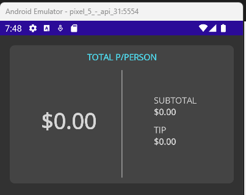
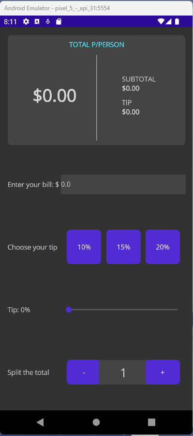
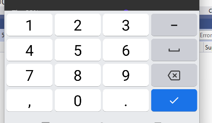
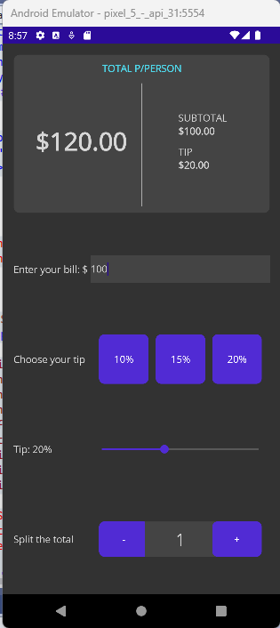

<!-- vscode-markdown-toc -->
* 1. [V42. Overview de la aplicación](#V42.Overviewdelaaplicacin)
* 2. [V43. Creando la sección de información de propinas](#V43.Creandolaseccindeinformacindepropinas)
* 3. [V44. Definiendo sección de entrada de datos](#V44.Definiendoseccindeentradadedatos)
* 4. [V45. Realizando los cálculos](#V45.Realizandolosclculos)

<!-- vscode-markdown-toc-config
	numbering=true
	autoSave=true
	/vscode-markdown-toc-config -->
<!-- /vscode-markdown-toc -->

##  1. <a name='V42.Overviewdelaaplicacin'></a>V42. Overview de la aplicación

##  2. <a name='V43.Creandolaseccindeinformacindepropinas'></a>V43. Creando la sección de información de propinas
- Primero la parte informativa


``` xml
<?xml version="1.0" encoding="utf-8" ?>
<ContentPage xmlns="http://schemas.microsoft.com/dotnet/2021/maui"
             xmlns:x="http://schemas.microsoft.com/winfx/2009/xaml"
             x:Class="PerfectPay.MainPage"
             BackgroundColor="#323232">

    <ContentPage.Resources>
        <Color x:Key="SectionsColor">#444444</Color>
        <Color x:Key="LightFont">#d6d6d6</Color>
        <Color x:Key="DarkFont">#4fd8eb</Color>
    </ContentPage.Resources>

    <Grid Margin="15">
        <Grid.RowDefinitions>
            <RowDefinition Height=".3*" />
            <RowDefinition Height=".7*" />
        </Grid.RowDefinitions>
        <Frame
            Padding="10"
            BackgroundColor="{StaticResource SectionsColor}"
            BorderColor="Transparent">
            <Grid>
                <Grid.ColumnDefinitions>
                    <ColumnDefinition />
                    <ColumnDefinition Width="1" />
                    <ColumnDefinition />
                </Grid.ColumnDefinitions>
                <Grid.RowDefinitions>
                    <RowDefinition Height=".1*" />
                    <RowDefinition Height=".9*" />
                </Grid.RowDefinitions>
                <Label
                    Grid.ColumnSpan="3"
                    FontAttributes="Bold"
                    HorizontalTextAlignment="Center"
                    Text="TOTAL P/PERSON"
                    TextColor="{StaticResource DarkFont}" />
                <Label
                    x:Name="lblTotal"
                    Grid.Row="1"
                    FontAttributes="Bold"
                    FontSize="35"
                    HorizontalTextAlignment="Center"
                    Text="$0.00"
                    TextColor="{StaticResource LightFont}"
                    VerticalOptions="CenterAndExpand" />
                <BoxView
                    Grid.Row="1"
                    Grid.Column="1"
                    Margin="0,10,0,0"
                    VerticalOptions="Center"
                    Color="#adadad" />
                <VerticalStackLayout
                    Grid.Row="1"
                    Grid.Column="2"
                    HorizontalOptions="Center"
                    VerticalOptions="Center">
                    <Label Text="SUBTOTAL" TextColor="{StaticResource LightFont}" />
                    <Label
                        x:Name="lblSubtotal"
                        FontAttributes="Bold"
                        Text="$0.00"
                        TextColor="{StaticResource LightFont}" />
                    <Label
                        Margin="0,10,0,0"
                        Text="TIP"
                        TextColor="{StaticResource LightFont}" />
                    <Label
                        x:Name="lblTipByPerson"
                        FontAttributes="Bold"
                        Text="$0.00"
                        TextColor="{StaticResource LightFont}" />
                </VerticalStackLayout>
            </Grid>
        </Frame>
    </Grid>

</ContentPage>
```



##  3. <a name='V44.Definiendoseccindeentradadedatos'></a>V44. Definiendo sección de entrada de datos
- Los botones para entrar datos.
``` xml
<Grid Grid.Row="1" Margin="0,15,0,0">
        <Grid.ColumnDefinitions>
            <ColumnDefinition Width=".3*" />
            <ColumnDefinition Width=".7*" />
        </Grid.ColumnDefinitions>
        <Grid.RowDefinitions>
            <RowDefinition />
            <RowDefinition />
            <RowDefinition />
            <RowDefinition />
        </Grid.RowDefinitions>

        <Label
                Text="Enter your bill: $"
                TextColor="{StaticResource LightFont}"
                VerticalOptions="Center" />
        <Entry
                x:Name="txtBill"
                Grid.Column="1"
                BackgroundColor="{StaticResource SectionsColor}"
                Keyboard="Numeric"
                Text="0.0"
                TextColor="{StaticResource LightFont}"
                VerticalOptions="Center" />
        <Label
                Grid.Row="1"
                Text="Choose your tip"
                TextColor="{StaticResource LightFont}"
                VerticalOptions="Center" />
        <HorizontalStackLayout
                Grid.Row="1"
                Grid.Column="1"
                HeightRequest="70"
                HorizontalOptions="CenterAndExpand"
                Spacing="10">
            <Button
                    
                    Text="10%"
                    WidthRequest="70" />
            <Button
                    
                    Text="15%"
                    WidthRequest="70" />
            <Button
                    
                    Text="20%"
                    WidthRequest="70" />
        </HorizontalStackLayout>
        <Label
                x:Name="lblTip"
                Grid.Row="2"
                Text="Tip: 0%"
                TextColor="{StaticResource LightFont}"
                VerticalOptions="Center" />
        <Slider
                x:Name="sldTip"
                Grid.Row="2"
                Grid.Column="1"
                Maximum="50"
                Minimum="0"
            
            />
        <Label
                Grid.Row="3"
                Text="Split the total"
                TextColor="{StaticResource LightFont}"
                VerticalOptions="Center" />
        <HorizontalStackLayout
                Grid.Row="3"
                Grid.Column="1"
                HorizontalOptions="Center"
                VerticalOptions="Center">
            <Button
                    x:Name="btnMinus"
            
                    Text="-"
                    WidthRequest="70" />
            <Label
                    x:Name="lblNoPerons"
                    Margin="-5,0,-5,0"
                    BackgroundColor="{StaticResource SectionsColor}"
                    FontSize="25"
                    HeightRequest="50"
                    HorizontalOptions="Center"
                    HorizontalTextAlignment="Center"
                    Text="1"
                    TextColor="{StaticResource LightFont}"
                    VerticalOptions="Center"
                    VerticalTextAlignment="Center"
                    WidthRequest="100" />
            <Button
                    x:Name="btnPlus"
            
                    Text="+"
                    WidthRequest="70" />
        </HorizontalStackLayout>
    </Grid>
```



##  4. <a name='V45.Realizandolosclculos'></a>V45. Realizando los cálculos

- Adicionar `Completed` y un `EventHandler`. Este es llamado cuando se aprieta el botón de OK.



- Para convertir a formato de moneda  se utiliza `${variableName:C}` e.g. `$"{tipByPerson:C}"`
``` xml
<Entry
    x:Name="txtBill"
    Grid.Column="1"
    BackgroundColor="{StaticResource SectionsColor}"
    Keyboard="Numeric"
    Text="0.0"
    TextColor="{StaticResource LightFont}"
    VerticalOptions="Center" 
    Completed="txtBill_Completed"
/>
```

- De esta forma el `xaml` tiene que ser adicionado los `EventHandlers`

``` xml
<?xml version="1.0" encoding="utf-8" ?>
<ContentPage xmlns="http://schemas.microsoft.com/dotnet/2021/maui"
             xmlns:x="http://schemas.microsoft.com/winfx/2009/xaml"
             x:Class="PerfectPay.MainPage"
             BackgroundColor="#323232">

    <ContentPage.Resources>
        <Color x:Key="SectionsColor">#444444</Color>
        <Color x:Key="LightFont">#d6d6d6</Color>
        <Color x:Key="DarkFont">#4fd8eb</Color>
    </ContentPage.Resources>

<Grid Margin="15">
        <Grid.RowDefinitions>
            <RowDefinition Height=".3*" />
            <RowDefinition Height=".7*" />
        </Grid.RowDefinitions>
        <Frame
            Padding="10"
            BackgroundColor="{StaticResource SectionsColor}"
            BorderColor="Transparent">
            <Grid>
                <Grid.ColumnDefinitions>
                    <ColumnDefinition />
                    <ColumnDefinition Width="1" />
                    <ColumnDefinition />
                </Grid.ColumnDefinitions>
                <Grid.RowDefinitions>
                    <RowDefinition Height=".1*" />
                    <RowDefinition Height=".9*" />
                </Grid.RowDefinitions>
                <Label
                    Grid.ColumnSpan="3"
                    FontAttributes="Bold"
                    HorizontalTextAlignment="Center"
                    Text="TOTAL P/PERSON"
                    TextColor="{StaticResource DarkFont}" />
                <Label
                    x:Name="lblTotal"
                    Grid.Row="1"
                    FontAttributes="Bold"
                    FontSize="35"
                    HorizontalTextAlignment="Center"
                    Text="$0.00"
                    TextColor="{StaticResource LightFont}"
                    VerticalOptions="CenterAndExpand" />
                <BoxView
                    Grid.Row="1"
                    Grid.Column="1"
                    Margin="0,10,0,0"
                    VerticalOptions="Center"
                    Color="#adadad" />
                <VerticalStackLayout
                    Grid.Row="1"
                    Grid.Column="2"
                    HorizontalOptions="Center"
                    VerticalOptions="Center">
                    <Label Text="SUBTOTAL" TextColor="{StaticResource LightFont}" />
                    <Label
                        x:Name="lblSubtotal"
                        FontAttributes="Bold"
                        Text="$0.00"
                        TextColor="{StaticResource LightFont}" />
                    <Label
                        Margin="0,10,0,0"
                        Text="TIP"
                        TextColor="{StaticResource LightFont}" />
                    <Label
                        x:Name="lblTipByPerson"
                        FontAttributes="Bold"
                        Text="$0.00"
                        TextColor="{StaticResource LightFont}" />
                </VerticalStackLayout>
            </Grid>
        </Frame>
    

    <Grid Grid.Row="1" Margin="0,15,0,0">
        <Grid.ColumnDefinitions>
            <ColumnDefinition Width=".3*" />
            <ColumnDefinition Width=".7*" />
        </Grid.ColumnDefinitions>
        <Grid.RowDefinitions>
            <RowDefinition />
            <RowDefinition />
            <RowDefinition />
            <RowDefinition />
        </Grid.RowDefinitions>

        <Label
                Text="Enter your bill: $"
                TextColor="{StaticResource LightFont}"
                VerticalOptions="Center" />
        <Entry
                x:Name="txtBill"
                Grid.Column="1"
                BackgroundColor="{StaticResource SectionsColor}"
                Keyboard="Numeric"
                Text="0.0"
                TextColor="{StaticResource LightFont}"
                VerticalOptions="Center" 
                Completed="txtBill_Completed"/>
        <Label
                Grid.Row="1"
                Text="Choose your tip"
                TextColor="{StaticResource LightFont}"
                VerticalOptions="Center" />
        <HorizontalStackLayout
                Grid.Row="1"
                Grid.Column="1"
                HeightRequest="70"
                HorizontalOptions="CenterAndExpand"
                Spacing="10">
            <Button
                    Clicked="Button_Clicked"
                    Text="10%"
                    WidthRequest="70" />
            <Button
                    Clicked="Button_Clicked"
                    Text="15%"
                    WidthRequest="70" />
            <Button
                    Clicked="Button_Clicked"
                    Text="20%"
                    WidthRequest="70" />
        </HorizontalStackLayout>
        <Label
                x:Name="lblTip"
                Grid.Row="2"
                Text="Tip: 0%"
                TextColor="{StaticResource LightFont}"
                VerticalOptions="Center" />
        <Slider
                x:Name="sldTip"
                Grid.Row="2"
                Grid.Column="1"
                Maximum="50"
                Minimum="0"
                ValueChanged="sldTip_ValueChanged"
            />
        <Label
                Grid.Row="3"
                Text="Split the total"
                TextColor="{StaticResource LightFont}"
                VerticalOptions="Center" />
        <HorizontalStackLayout
                Grid.Row="3"
                Grid.Column="1"
                HorizontalOptions="Center"
                VerticalOptions="Center">
            <Button
                    x:Name="btnMinus"
                    Clicked="btnMinus_Clicked"
                    Text="-"
                    WidthRequest="70" />
            <Label
                    x:Name="lblNoPerons"
                    Margin="-5,0,-5,0"
                    BackgroundColor="{StaticResource SectionsColor}"
                    FontSize="25"
                    HeightRequest="50"
                    HorizontalOptions="Center"
                    HorizontalTextAlignment="Center"
                    Text="1"
                    TextColor="{StaticResource LightFont}"
                    VerticalOptions="Center"
                    VerticalTextAlignment="Center"
                    WidthRequest="100" />
            <Button
                    x:Name="btnPlus"
                    Clicked="btnPlus_Clicked"
                    Text="+"
                    WidthRequest="70" />
        </HorizontalStackLayout>
    </Grid>
</Grid>
</ContentPage>
```
- Codigo para los `EventHandlers`
``` cs
namespace PerfectPay;

public partial class MainPage : ContentPage
{
	decimal bill;
	int tip;
	int noPersons = 1;

	public MainPage()
	{
		InitializeComponent();
	}

    private void Button_Clicked(object sender, EventArgs e)
    {
        if (sender is Button) 
        {
            var btn = (Button)sender;
            var percentage = int.Parse(btn.Text.Replace("%", ""));
            sldTip.Value = percentage;
        }
    }

    private void txtBill_Completed(object sender, EventArgs e)
    {
		bill = decimal.Parse(txtBill.Text);
		CalculateTotal();
    }

    private void CalculateTotal()
    {
        var totalTip = (bill * tip) / 100;

        // tip by person
        var tipByPerson = (totalTip/noPersons);
        lblTipByPerson.Text = $"{tipByPerson:C}";

        //subtotal
        var subtotal = (bill / noPersons);
        lblSubtotal.Text = $"{subtotal:C}";

        //total 
        var totalByPerson = (bill + totalTip) / noPersons;
        lblTotal.Text = $"{totalByPerson:C}";
    }

    private void sldTip_ValueChanged(object sender, ValueChangedEventArgs e)
    {
        tip = (int)sldTip.Value;
        lblTip.Text = $"Tip: {tip}%";
        CalculateTotal();
    }

    private void btnMinus_Clicked(object sender, EventArgs e)
    {
        if (noPersons > 1)
        { 
            noPersons--;
        }
        lblNoPerons.Text = noPersons.ToString();
        CalculateTotal();
    }

    private void btnPlus_Clicked(object sender, EventArgs e)
    {        
        noPersons++;
        lblNoPerons.Text = noPersons.ToString();
        CalculateTotal();
    }
}
```

