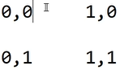
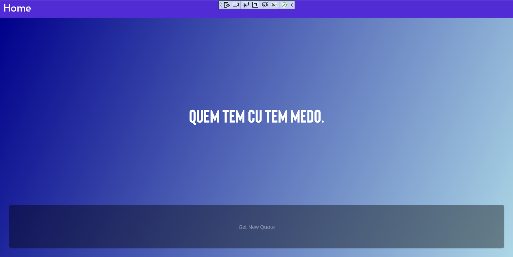
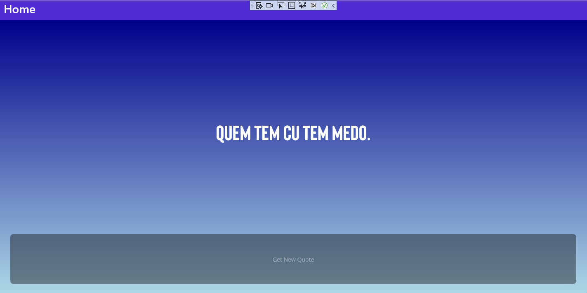
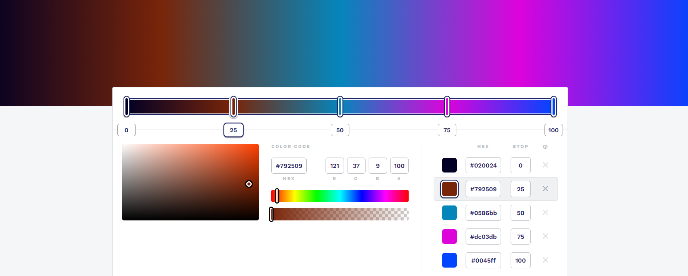
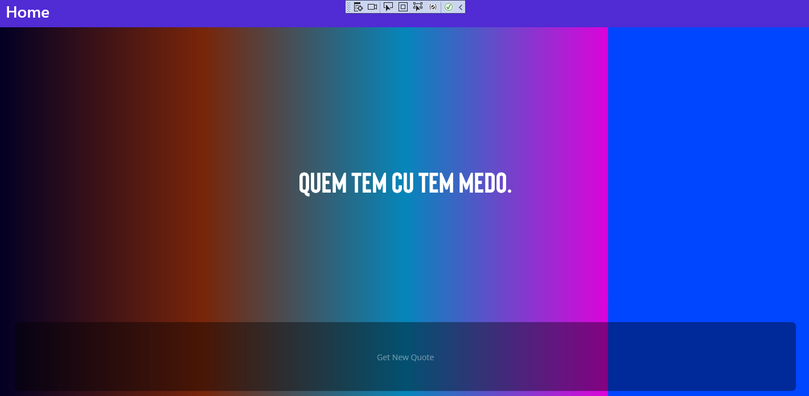

<!-- vscode-markdown-toc -->
* 1. [V052. Introducción](#V052.Introduccin)
* 2. [V053. Definiendo la interfaz principal](#V053.Definiendolainterfazprincipal)
* 3. [V054. Trabajando con degradados en net maui](#V054.Trabajandocondegradadosennetmaui)
* 4. [V055. Creando el fondo de la aplicación](#V055.Creandoelfondodelaaplicacin)
* 5. [V056. Generando la frase aleatoria](#V056.Generandolafrasealeatoria)

<!-- vscode-markdown-toc-config
	numbering=true
	autoSave=true
	/vscode-markdown-toc-config -->
<!-- /vscode-markdown-toc -->


##  1. <a name='V052.Introduccin'></a>V052. Introducción


##  2. <a name='V053.Definiendolainterfazprincipal'></a>V053. Definiendo la interfaz principal
- Primero se implementa la parte gráfica:

``` xml
<Grid BackgroundColor="Navy">
    <Grid Margin="25" RowDefinitions=".8*,.2*">
        <Label
            FontFamily="MainFont"
            FontSize="50"
            HorizontalTextAlignment="Center"
            Text="Quem tem cu tem medo."
            TextColor="White"
            VerticalOptions="Center" />
        <Button 
            Grid.Row="1" 
            BackgroundColor="Black"
            Opacity=".4"
            Text="Get New Quote" />
    </Grid>
</Grid>
```

- Se adiciona la fuente:

``` cs 
builder
	.UseMauiApp<App>()
	.ConfigureFonts(fonts =>
	{
		fonts.AddFont("OpenSans-Regular.ttf", "OpenSansRegular");
		fonts.AddFont("OpenSans-Semibold.ttf", "OpenSansSemibold");
        fonts.AddFont("Bison.ttf", "MainFont");
    });
```
##  3. <a name='V054.Trabajandocondegradadosennetmaui'></a>V054. Trabajando con degradados en net maui
- Las coordenadas de la pantalla son las siguientes:



- Esto se realiza con `<LinearGradientBrush/>` (gradiente diagonal)

``` xml
<Grid BackgroundColor="Navy">
    <Grid.Background>
        <LinearGradientBrush StartPoint="0,0" EndPoint="1,1">
            <GradientStopCollection>
                <GradientStop Offset="0" Color="DarkBlue"/>
                <GradientStop Offset="1" Color="LightBlue"/>
            </GradientStopCollection>
        </LinearGradientBrush>
    </Grid.Background>
    <Grid Margin="25" RowDefinitions=".8*,.2*">
        <Label
            FontFamily="MainFont"
            FontSize="50"
            HorizontalTextAlignment="Center"
            Text="Quem tem cu tem medo."
            TextColor="White"
            VerticalOptions="Center" />
        <Button 
            Grid.Row="1" 
            BackgroundColor="Black"
            Opacity=".4"
            Text="Get New Quote" />
    </Grid>
</Grid>
```



Para `<LinearGradientBrush StartPoint="0,0" EndPoint="0,1">` (gradiente vertical)


- Se puede utilizar sitios de internet como `https://cssgradient.io/`  para estudiar los gradientes y obtener los parametros:

``` xml
<LinearGradientBrush StartPoint="0,0" EndPoint="1,0">
<GradientStopCollection>
    <GradientStop Offset="0" Color="#020024"/>
    <GradientStop Offset="0.25" Color="#792509"/>
    <GradientStop Offset="0.5" Color="#0586bb"/>
    <GradientStop Offset="0.75" Color="#dc03db"/>
    <GradientStop Offset="0.75" Color="#0045ff"/>
</GradientStopCollection>
</LinearGradientBrush>
```



- El resultado es el siguiente:


##  4. <a name='V055.Creandoelfondodelaaplicacin'></a>V055. Creando el fondo de la aplicación
- Primero, se le da un nombre a el button, `x:Name="btnGenerateQuote"` y un evento: `Clicked="btnGenerateQuote_Clicked"`.
- Además de nombre al grid `<Grid x:Name="background">`

``` cs
private void btnGenerateQuote_Clicked(object sender, EventArgs e)
{
    // Code here...
}
```

- Para conseguir los gradientes se utiliza el paquete nuget `ColorUtility`  (solo existe la version 1.0.0).
- El método `ColorUtility.ColorControls.GetColorGradient(System.Drawing.Color, System.Drawing.Color, int)` crea un gradiente. Para esto necesita un color inicial, final y el numero de colores totales.
  - Los colores son generados de forma random:

``` cs
private void btnGenerateQuote_Clicked(object sender, EventArgs e)
{
	var startColor =
		System.Drawing.Color.FromArgb(
			random.Next(0, 256),
			random.Next(0, 256),
			random.Next(0, 256)
		);

    var endColor =
        System.Drawing.Color.FromArgb(
            random.Next(0, 256),
            random.Next(0, 256),
            random.Next(0, 256)
        );

	var color =
		ColorUtility
		.ColorControls
		.GetColorGradient(startColor, endColor, 6);
    
    //...
}
```

- El siguiente código comentado explica como hacer un gradiente:

``` cs
private void btnGenerateQuote_Clicked(object sender, EventArgs e)
{
	var startColor =
		System.Drawing.Color.FromArgb(
			random.Next(0, 256),
			random.Next(0, 256),
			random.Next(0, 256)
		);

    var endColor =
        System.Drawing.Color.FromArgb(
            random.Next(0, 256),
            random.Next(0, 256),
            random.Next(0, 256)
        );

    // Crea una lista de 6 colores
	var colors =
		ColorUtility
		.ColorControls
		.GetColorGradient(startColor, endColor, 6);

    // Crea una coleccion de colores a partir de una lista de colores y sus steps correspondientes.
	float stopOffSet = .0f;
	var stops = new GradientStopCollection();
	foreach ( var c in colors ) 
	{
		stops.Add(new GradientStop(Color.FromArgb(c.Name),
			stopOffSet));
		stopOffSet += .2f;
	}

    // Crear un linear gradient
	var gradient = new LinearGradientBrush(stops, new Point(0, 0), new Point(1, 1));

    // Se asigna el linear gradient a el grid.
	background.Background = gradient;    
}
```

##  5. <a name='V056.Generandolafrasealeatoria'></a>V056. Generando la frase aleatoria

