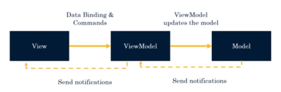

## V076 Introduccion
- Model: 
  - Representan el mundo real. 
  - Encapsulan los datos de la applicacion.
  - E.g. clase `Persona`
- View:
  - Vistas, creadas con codido xaml
- ViewModel
  - Evitan mesclar la logica de programacion con interfaz grafica.
- La comunicacion entre elementos es de la siguiente forma:

## V077 Creando primer View Model
1. Crear las carpetas `Views`, `Models` and `ViewModels`
2. Para el Model `Dummy.cs`: 
   1. se debe crear una pagina xaml `DummyView.xaml` 
   2. y una clase `DummyViewModel.cs`
3. No `ViewModel`:
   1. Instancia objeto a partir de las classes definidas en models.
   2. Crear getter para el objeto instanciado.
4. No `View CS`
   1. CS: Se implementa en su constructor una instancia del `ViewModel`:
      - `BindingContext = new DummyViewModel();`
5. No `View xaml`
   1. Assignar la propiedad del objeto instanciado por el `ViewModel` al control XAML deseado.
      - `<Label Text="{Binding Dummy.Property}">` 

## V078 Creando bindings

## V079 Bindings de Propiedades

## V080 Value Converter 

## V081 Value Converter Back 

## V082 Commands

## V083 Commands with parameters

## V084 Implementando INotify