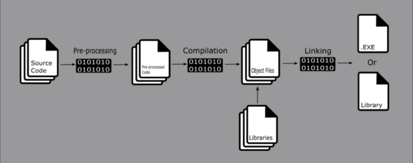

## V034 - Cpp Build Process

1. Source code: we made it
2. Pre-processed Code: The compiler process the pre-processor directives
3. Object Files: Source files are converted into Machine readable files i.e. `.o`
4. THe linker converts these object files into executables or libraries.

