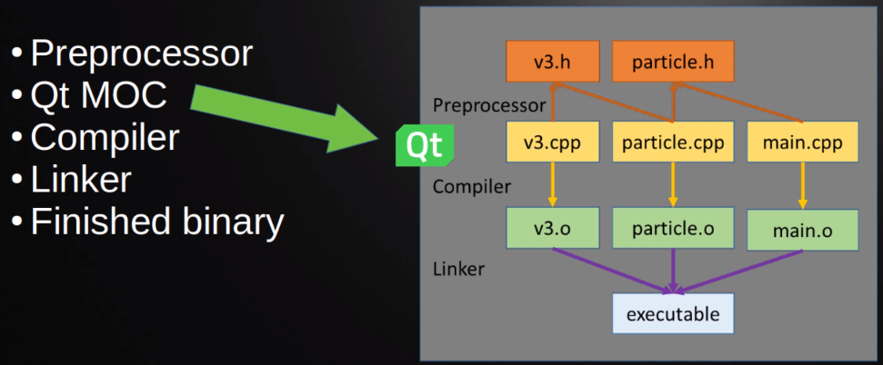

<!-- vscode-markdown-toc -->
* 1. [V034 - Cpp Build Process](#V034-CppBuildProcess)
* 2. [V035 - Cpp Qt Build Process](#V035-CppQtBuildProcess)
* 3. [V038 - How Qt uses Cpp](#V038-HowQtusesCpp)

<!-- vscode-markdown-toc-config
	numbering=true
	autoSave=true
	/vscode-markdown-toc-config -->
<!-- /vscode-markdown-toc -->

##  1. V034 - Cpp Build Process

1. Source code: we made it
2. Pre-processed Code: The compiler process the pre-processor directives
3. Object Files: Source files are converted into Machine readable files i.e. `.o`
4. THe linker converts these object files into executables or libraries.

##  2. V035 - Cpp Qt Build Process

- QT runs the QT MOC between the preoprocessor and the Compiler.
  - QT MOC (meta-object compiler): injects qt functionalities to objects (e.g. signals and slots mechanism)

##  3. V038 - How Qt uses Cpp
- It uses the STL
  - It replicates some parts of STL
- It uses a lot of pointers
- It uses classes and inheritance
- It uses templates
- It lacks of error handling
- Object copy is forbidden so FOR THAT REASON it uses POINTERS!