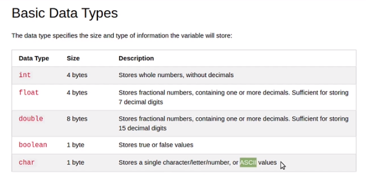

<!-- vscode-markdown-toc -->
* 1. [V044 - Intro to variables](#V044-Introtovariables)
* 2. [V045 - What is a variable](#V045-Whatisavariable)
* 3. [V046 - Intro to data types](#V046-Introtodatatypes)
* 4. [V047 - Data types](#V047-Datatypes)
* 5. [V048 - Intro to constants](#V048-Introtoconstants)
* 6. [V049 - Constants](#V049-Constants)
* 7. [V050 - Enums](#V050-Enums)
* 8. [V051 - Structs](#V051-Structs)
* 9. [V052 - Intro to arrays](#V052-Introtoarrays)
* 10. [V053 - Arrays](#V053-Arrays)
* 11. [V054 - Arithmetic operators](#V054-Arithmeticoperators)
* 12. [V055 - Assignment operators](#V055-Assignmentoperators)
* 13. [V056 - Comparison operators](#V056-Comparisonoperators)
* 14. [V057 - Logical operators](#V057-Logicaloperators)

<!-- vscode-markdown-toc-config
	numbering=true
	autoSave=true
	/vscode-markdown-toc-config -->
<!-- /vscode-markdown-toc -->

##  1. <a name='V044-Introtovariables'></a>V044 - Intro to variables
**Nothing to add**

##  2. <a name='V045-Whatisavariable'></a>V045 - What is a variable

- We can add variables to the `qinfo` message using:

``` cpp
int variable = 5;
qInfo() << "Something: " << variable;
```
##  3. <a name='V046-Introtodatatypes'></a>V046 - Intro to data types
- **Data Type** it defines what a variable or constant represents.


##  4. <a name='V047-Datatypes'></a>V047 - Data types



##  5. <a name='V048-Introtoconstants'></a>V048 - Intro to constants
**Constant* something that does not change

##  6. <a name='V049-Constants'></a>V049 - Constants
- It uses the keyword `const` e.g. `const int id = 100;`
- If you change it, the program will not compile.


##  7. <a name='V050-Enums'></a>V050 - Enums
- You can assign only integers;
- Onde assigned you cant you can change their values.
- 
``` cpp
enum Color {red = 0, green = 35, blue = 1988};
Color myColor = Color::green;

// This line will print 35
qInfo() << "Color: " << myColor;
```

##  8. <a name='V051-Structs'></a>V051 - Structs
- A kind of data structure

``` cpp
enum Colors {red, green, blue, black};

struct device{
    int weight;
    double value;
    Colors itsColor;
}
```

- If we use `sizeof` for a variable which is a `device struct` we will get `24`. Which makes sense because it "contains" 6 integers.
- To set values we do:

``` cpp
int main(int argc, char *argv[])
{
    device laptop;
    qinfo << "Size: " << sizeof(laptop);

    laptop.itsColor = Colors::red;
    laptop.value = 1000;
    laptop.weight = 4;
}
```
