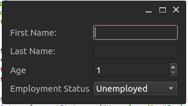
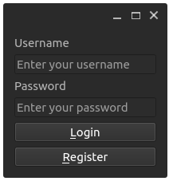

## Layouts

### QGridLayout
``` cpp
#include "Mainwindow.h"
#include <QApplication>
#include <QApplication>
#include <QPushButton>
#include <QGridLayout>
#include <QLineEdit>
#include <QDateTimeEdit>
#include <QSpinBox>
#include <QComboBox>
#include <QLabel>
#include <QStringList>

int main(int argc, char *argv[])
{
    QApplication app(argc, argv);
    QWidget *window = new QWidget;
    QLabel *nameLabel = new QLabel("Open Happiness");
    QLineEdit *firstNameLineEdit= new QLineEdit;
    QLineEdit *lastNameLineEdit= new QLineEdit;
    QSpinBox *ageSpinBox = new QSpinBox;
    ageSpinBox->setRange(1, 100);
    QComboBox *employmentStatusComboBox= new QComboBox;
    QStringList employmentStatus = {"Unemployed", "Employed", "NA"};
    employmentStatusComboBox->addItems(employmentStatus);
    QGridLayout *layout = new QGridLayout;
    layout->addWidget(nameLabel, 0, 0);
    layout->addWidget(firstNameLineEdit, 0, 1);
    layout->addWidget(lastNameLineEdit, 0, 2);
    layout->addWidget(ageSpinBox, 1, 0);
    layout->addWidget(employmentStatusComboBox, 1, 1,1,2);
    window->setLayout(layout);
    window->show();
    return app.exec();
}
```


### QFormLayout

``` cpp
#include <QApplication>
#include <QFormLayout>
#include <QPushButton>
#include <QLineEdit>
#include <QSpinBox>
#include <QComboBox>
#include <QStringList>
int main(int argc, char *argv[])
{
QApplication app(argc, argv);
QWidget *window = new QWidget;
QLineEdit *firstNameLineEdit= new QLineEdit;
QLineEdit *lastNameLineEdit= new QLineEdit;
QSpinBox *ageSpingBox = new QSpinBox;
QComboBox *employmentStatusComboBox= new QComboBox;
QStringList employmentStatus = {"Unemployed", "Employed", "NA"};
ageSpingBox->setRange(1, 100);
employmentStatusComboBox->addItems(employmentStatus);
QFormLayout *personalInfoformLayout = new QFormLayout;
personalInfoformLayout->addRow("First Name:", firstNameLineEdit);
personalInfoformLayout->addRow("Last Name:", lastNameLineEdit );
personalInfoformLayout->addRow("Age", ageSpingBox);
personalInfoformLayout->addRow("Employment Status",
employmentStatusComboBox);
window->setLayout(personalInfoformLayout);
window->show();
return app.exec();
}
```



### Layout with direction

#### QVBoxLayout

``` cpp
#include <QApplication>
#include <QVBoxLayout>
#include <QPushButton>
#include <QLabel>
#include <QLineEdit>
int main(int argc, char *argv[])
{
QApplication app(argc, argv);
QWidget *window = new QWidget;
QLabel *label1 = new QLabel("Username");
QLabel *label2 = new QLabel("Password");
QLineEdit *usernameLineEdit = new QLineEdit;
usernameLineEdit->setPlaceholderText("Enter your username");
QLineEdit *passwordLineEdit = new QLineEdit;
passwordLineEdit->setEchoMode(QLineEdit::Password);
passwordLineEdit->setPlaceholderText("Enter your password");
QPushButton *button1 = new QPushButton("&Login");
QPushButton *button2 = new QPushButton("&Register");
QVBoxLayout *layout = new QVBoxLayout;
layout->addWidget(label1);
layout->addWidget(usernameLineEdit);
layout->addWidget(label2);
layout->addWidget(passwordLineEdit);
layout->addWidget(button1);
layout->addWidget(button2);
window->setLayout(layout);
window->show();
return app.exec();
}
```



#### QHBoxLayout
``` cpp
#include <QApplication>
#include <QHBoxLayout>
#include <QPushButton>
#include <QLineEdit>
int main(int argc, char *argv[])
{
QApplication app(argc, argv);
QWidget *window = new QWidget;
QLineEdit *urlLineEdit= new QLineEdit;
QPushButton *exportButton = new QPushButton("Export");
urlLineEdit->setPlaceholderText("Enter Url to export. Eg, http://yourdomain.com/items");
urlLineEdit->setFixedWidth(400);
QHBoxLayout *layout = new QHBoxLayout;
layout->addWidget(urlLineEdit);
layout->addWidget(exportButton);
window->setLayout(layout);
window->show();
return app.exec();
}
```


