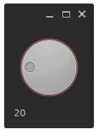
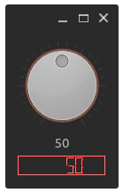
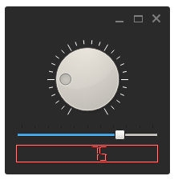

## Signals and Slots

``` cpp
#include <QApplication>
#include <QVBoxLayout>
#include <QLabel>
#include <QDial>
int main(int argc, char *argv[])
{
QApplication app(argc, argv);
QWidget *window = new QWidget;
QVBoxLayout *layout = new QVBoxLayout;
QLabel *volumeLabel = new QLabel("0");
QDial *volumeDial= new QDial;
layout->addWidget(volumeDial);
layout->addWidget(volumeLabel);
QObject::connect(volumeDial, SIGNAL(valueChanged(int)), volumeLabel,
SLOT(setNum(int)));
window->setLayout(layout);
window->show();
return app.exec();
}
```



### Single Signal Multiple slots

``` cpp
#include <QApplication>
#include <QVBoxLayout>
#include <QLabel>
#include <QDial>
#include <QLCDNumber>
int main(int argc, char *argv[])
{
QApplication app(argc, argv);
QWidget *window = new QWidget;
QVBoxLayout *layout = new QVBoxLayout;
QLabel *volumeLabel = new QLabel("0");
QDial *volumeDial= new QDial;
QLCDNumber *volumeLCD = new QLCDNumber;
volumeLCD->setPalette(Qt::red);
volumeLabel->setAlignment(Qt::AlignHCenter);
volumeDial->setNotchesVisible(true);
volumeDial->setMinimum(0);
volumeDial->setMaximum(100);
layout->addWidget(volumeDial);
layout->addWidget(volumeLabel);
layout->addWidget(volumeLCD);
QObject::connect(volumeDial, SIGNAL(valueChanged(int)), volumeLabel,
SLOT(setNum(int)));
QObject::connect(volumeDial, SIGNAL(valueChanged(int)), volumeLCD ,
SLOT(display(int)));
window->setLayout(layout);
window->show();
return app.exec();
}
```



### Single slot multiple signals 

``` cpp
#include <QApplication>
#include <QVBoxLayout>
#include <QLabel>
#include <QDial>
#include <QSlider>
#include <QLCDNumber>
int main(int argc, char *argv[])
{
QApplication app(argc, argv);
QWidget *window = new QWidget;
QVBoxLayout *layout = new QVBoxLayout;
QDial *volumeDial= new QDial;
QSlider *lengthSlider = new QSlider(Qt::Horizontal);
QLCDNumber *volumeLCD = new QLCDNumber;
volumeLCD->setPalette(Qt::red);
lengthSlider->setTickPosition(QSlider::TicksAbove);
lengthSlider->setTickInterval(10);
lengthSlider->setSingleStep(1);
lengthSlider->setMinimum(0);
lengthSlider->setMaximum(100);
volumeDial->setNotchesVisible(true);
volumeDial->setMinimum(0);
volumeDial->setMaximum(100);
layout->addWidget(volumeDial);
layout->addWidget(lengthSlider);
layout->addWidget(volumeLCD);
QObject::connect(volumeDial, SIGNAL(valueChanged(int)), volumeLCD ,
SLOT(display(int)));
QObject::connect(lengthSlider, SIGNAL(valueChanged(int)), volumeLCD
, SLOT(display(int)));
window->setLayout(layout);
window->show();
return app.exec();
}
```

