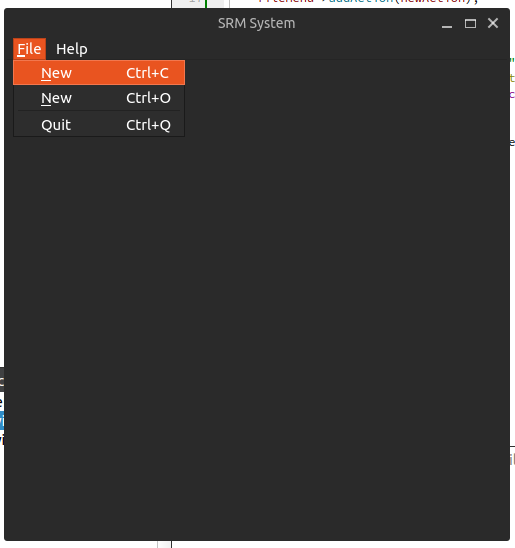
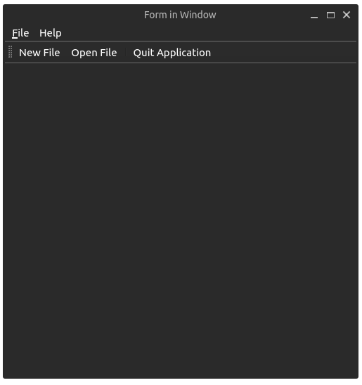

## Creating a Custom Window

``` cpp
#include "mainwindow.h"
MainWindow::MainWindow()
{
setWindowTitle("Main Window");
resize(400, 700);
QLabel *mainLabel = new QLabel("Main Widget");
setCentralWidget(mainLabel);
mainLabel->setAlignment(Qt::AlignCenter);
}
```

``` cpp
#ifndef MAINWINDOW_H
#define MAINWINDOW_H
#include <QMainWindow>
#include <QLabel>
class MainWindow : public QMainWindow
{
    Q_OBJECT
public:
    MainWindow();
};
#endif
```

``` cpp
#include "Mainwindow.h"
MainWindow::MainWindow()
{
    setWindowTitle("Main Window");
    resize(300, 200);
    QLabel *mainLabel = new QLabel("Main Widget");
    setCentralWidget(mainLabel);
    mainLabel->setAlignment(Qt::AlignCenter);
}
```


## QMainWindow Structure


### Menu bar

- `main.cpp`

``` cpp
#include "Mainwindow.h"
MainWindow::MainWindow()
{
    setWindowTitle("Main Window");
    resize(300, 200);
    QLabel *mainLabel = new QLabel("Main Widget");
    setCentralWidget(mainLabel);
    mainLabel->setAlignment(Qt::AlignCenter);
}
```
- `MainWindow.h`

``` cpp
#ifndef MAINWINDOW_H
#define MAINWINDOW_H

#include <QMainWindow>
#include <QApplication>
#include <QAction>
#include <QtGui>
#include <QAction>
#include <QMenuBar>
#include <QMenu>
#include <Qt>
class MainWindow : public QMainWindow
{
    Q_OBJECT
    public:
        MainWindow();
    private slots:
    private:
        // Menus
        QMenu *fileMenu;
        QMenu *helpMenu;
        // Actions
        QAction *quitAction;
        QAction *aboutAction;
        QAction *saveAction;
        QAction *cancelAction;
        QAction *openAction;
        QAction *newAction;
        QAction *aboutQtAction;
};
#endif
```
- `MainWindow.cpp`

``` cpp
#include "mainwindow.h"

MainWindow::MainWindow()
{
    setWindowTitle("SRM System");
    setFixedSize(500, 500);
    
    QPixmap newIcon("new.png");
    QPixmap openIcon("open.png");
    QPixmap closeIcon("close.png");
    
    // Setup File Menu
    fileMenu = menuBar()->addMenu("&File");
    
    quitAction = new QAction(closeIcon, "Quit", this);
    quitAction->setShortcuts(QKeySequence::Quit);
    
    newAction = new QAction(newIcon, "&New", this);
    newAction->setShortcut(QKeySequence(Qt::CTRL + Qt::Key_C));
    
    openAction = new QAction(openIcon, "&New", this);
    openAction->setShortcut(QKeySequence(Qt::CTRL + Qt::Key_O));
    
    fileMenu->addAction(newAction);
    fileMenu->addAction(openAction);
    fileMenu->addSeparator();
    fileMenu->addAction(quitAction);
    
    helpMenu = menuBar()->addMenu("Help");
    
    aboutAction = new QAction("About", this);
    aboutAction->setShortcut(QKeySequence(Qt::CTRL + Qt::Key_H));
    helpMenu->addAction(aboutAction);
    
    // Setup Signals and Slots    
    connect(quitAction, &QAction::triggered, this, &QApplication::quit);
}
```



### Toolbar

- `main.cpp`
``` cpp
#include <QApplication>
#include "mainwindow.h"
int main(int argc, char *argv[])
{
    QApplication app(argc, argv);
    QCoreApplication::setAttribute(Qt::AA_DontUseNativeMenuBar); //
    MainWindow mainwindow;
    mainwindow.show();
    return app.exec();
}
```

- `MainWindow.h`
 
``` cpp
#ifndef MAINWINDOW_H
#define MAINWINDOW_H
#include <QMainWindow>
#include <QApplication>
#include <QAction>
#include <QPushButton>
#include <QAction>
#include <QMenuBar>
#include <QMenu>
#include <QtGui>
#include <Qt>
#include <QToolBar>
#include <QTableView>
class MainWindow : public QMainWindow
{
    Q_OBJECT
    public:
        MainWindow();
    private slots:
    private:
        // Menus
        QMenu *fileMenu;
        QMenu *helpMenu;
        // Actions
        QAction *quitAction;
        QAction *aboutAction;
        QAction *saveAction;
        QAction *cancelAction;
        QAction *openAction;
        QAction *newAction;
        QAction *aboutQtAction;
        QToolBar *toolbar;
        QAction *newToolBarAction;
        QAction *openToolBarAction;
        QAction *closeToolBarAction;
};
#endif
```
- `MainWindow.cpp`

``` cpp
#include "mainwindow.h"
MainWindow::MainWindow()
{
    setWindowTitle("Form in Window");
    setFixedSize(500, 500);
    QPixmap newIcon("new.png");
    QPixmap openIcon("open.png");
    QPixmap closeIcon("close.png");
    // Setup File Menu
    fileMenu = menuBar()->addMenu("&File");
    quitAction = new QAction(closeIcon, "Quit", this);
    quitAction->setShortcuts(QKeySequence::Quit);
    newAction = new QAction(newIcon, "&New", this);
    newAction->setShortcut(QKeySequence(Qt::CTRL + Qt::Key_C));
    openAction = new QAction(openIcon, "&New", this);
    openAction->setShortcut(QKeySequence(Qt::CTRL + Qt::Key_O));

    fileMenu->addAction(newAction);
    fileMenu->addAction(openAction);
    fileMenu->addSeparator();
    fileMenu->addAction(quitAction);

    helpMenu = menuBar()->addMenu("Help");
    aboutAction = new QAction("About", this);
    aboutAction->setShortcut(QKeySequence(Qt::CTRL + Qt::Key_H));
    helpMenu->addAction(aboutAction);
    
    // Setup Tool bar menu
    toolbar = addToolBar("main toolbar");
    // toolbar->setMovable( false );
    newToolBarAction = toolbar->addAction(QIcon(newIcon), "New File");
    openToolBarAction = toolbar->addAction(QIcon(openIcon), "Open File");
    toolbar->addSeparator();
    closeToolBarAction = toolbar->addAction(QIcon(closeIcon), "Quit Application");
    // Setup Signals and Slots
    connect(quitAction, &QAction::triggered, this, &QApplication::quit);
    connect(closeToolBarAction, &QAction::triggered, this, &QApplication::quit);
}
```



### Adding Widgets

- `MainWidget.h`

``` cpp
#ifndef MAINWINDOW_H
#define MAINWINDOW_H
#include <QMainWindow>
#include <QApplication>
#include <QLabel>
#include <QLineEdit>
#include <QDate>
#include <QDateEdit>
#include <QVBoxLayout>
#include <QHBoxLayout>
#include <QGridLayout>
#include <QPushButton>
#include <QMessageBox>
#include <QAction>
#include <QMenuBar>
#include <QMenu>
#include <QtGui>
#include <Qt>
#include <QToolBar>
#include <QTableView>
#include <QHeaderView>

class MainWindow : public QMainWindow
{
    Q_OBJECT
public:
    MainWindow();
private slots:
    void saveButtonClicked();
private:
    // Widgets
    QWidget *mainWidget;
    QVBoxLayout *centralWidgetLayout;
    QGridLayout *formLayout;
    QHBoxLayout *buttonsLayout;
    QLabel *nameLabel;
    QLabel *dateOfBirthLabel;
    QLabel *phoneNumberLabel;
    QPushButton *savePushButton;
    QPushButton *newPushButton;
    QLineEdit *nameLineEdit;
    QDateEdit *dateOfBirthEdit;
    QLineEdit *phoneNumberLineEdit;
    QTableView *appTable;
    QStandardItemModel *model;

    // Menus
    QMenu *fileMenu;
    QMenu *helpMenu;

    // Actions
    QAction *quitAction;
    QAction *aboutAction;
    QAction *saveAction;
    QAction *cancelAction;
    QAction *openAction;
    QAction *newAction;
    QAction *aboutQtAction;
    QAction *newToolBarAction;
    QAction *openToolBarAction;
    QAction *closeToolBarAction;
    QAction *clearToolBarAction;

    // Toolbar
    QToolBar *toolbar;

    // Icons
    QPixmap newIcon;
    QPixmap openIcon;
    QPixmap closeIcon;
    QPixmap clearIcon;

    // init methods
    void clearFields();
    void createIcons();
    void createMenuBar();
    void createToolBar();
    void setupSignalsAndSlot();
    void setupCoreWidgets();
};
#endif
```

- `MainWidget.cpp`

``` cpp
#include "Mainwindow.h"

    MainWindow::MainWindow()
{
    setWindowTitle("Form in Window");
    setFixedSize(500, 500);

    createIcons();
    setupCoreWidgets();
    createMenuBar();
    createToolBar();

    centralWidgetLayout->addLayout(formLayout);
    centralWidgetLayout->addWidget(appTable);
    centralWidgetLayout->addLayout(buttonsLayout);

    mainWidget->setLayout(centralWidgetLayout);
    setCentralWidget(mainWidget);

    setupSignalsAndSlot();
}

void MainWindow::createIcons() {
    newIcon = QPixmap("new.png");
    openIcon = QPixmap("open.png");
    closeIcon = QPixmap("close.png");
    clearIcon = QPixmap("clear.png");
}

void MainWindow::setupCoreWidgets() {
    mainWidget = new QWidget();
    centralWidgetLayout = new QVBoxLayout();
    formLayout = new QGridLayout();
    buttonsLayout = new QHBoxLayout();
    nameLabel = new QLabel("Name:");
    dateOfBirthLabel= new QLabel("Date Of Birth:");
    phoneNumberLabel = new QLabel("Phone Number");
    savePushButton = new QPushButton("Save");
    newPushButton = new QPushButton("Clear All");
    nameLineEdit = new QLineEdit();
    dateOfBirthEdit = new QDateEdit(QDate::currentDate());
    phoneNumberLineEdit = new QLineEdit();

    // TableView
    appTable = new QTableView();
    model = new QStandardItemModel(1, 3, this);

    appTable->setContextMenuPolicy(Qt::CustomContextMenu);
    appTable->horizontalHeader()->setSectionResizeMode(QHeaderView::Stretch);

    /** Note **/
    model->setHorizontalHeaderItem(0, new QStandardItem(QString("Name")));
    model->setHorizontalHeaderItem(1, new QStandardItem(QString("Date of Birth")));
    model->setHorizontalHeaderItem(2, new QStandardItem(QString("Phone Number")));
    appTable->setModel(model);

        QStandardItem *firstItem = new QStandardItem(QString("G. Shone"));
    QDate dateOfBirth(1980, 1, 1);
    QStandardItem *secondItem = new QStandardItem(dateOfBirth.toString());
    QStandardItem *thirdItem = new QStandardItem(QString("05443394858"));

    model->setItem(0,0,firstItem);
    model->setItem(0,1,secondItem);
    model->setItem(0,2,thirdItem);

    formLayout->addWidget(nameLabel, 0, 0);
    formLayout->addWidget(nameLineEdit, 0, 1);
    formLayout->addWidget(dateOfBirthLabel, 1, 0);
    formLayout->addWidget(dateOfBirthEdit, 1, 1);
    formLayout->addWidget(phoneNumberLabel, 2, 0);
    formLayout->addWidget(phoneNumberLineEdit, 2, 1);

    buttonsLayout->addStretch();
    buttonsLayout->addWidget(savePushButton);
    buttonsLayout->addWidget(newPushButton);
}

void MainWindow::createMenuBar() {
    // Setup File Menu
    fileMenu = menuBar()->addMenu("&File");

    quitAction = new QAction(closeIcon, "Quit", this);
    quitAction->setShortcuts(QKeySequence::Quit);

    newAction = new QAction(newIcon, "&New", this);
    newAction->setShortcut(QKeySequence(Qt::CTRL + Qt::Key_C));

    openAction = new QAction(openIcon, "&New", this);
    openAction->setShortcut(QKeySequence(Qt::CTRL + Qt::Key_O));

    fileMenu->addAction(newAction);
    fileMenu->addAction(openAction);
    fileMenu->addSeparator();
    fileMenu->addAction(quitAction);

    helpMenu = menuBar()->addMenu("Help");
    aboutAction = new QAction("About", this);
    aboutAction->setShortcut(QKeySequence(Qt::CTRL + Qt::Key_H));
    helpMenu->addAction(aboutAction);
}

void MainWindow::createToolBar() {
    // Setup Tool bar menu
    toolbar = addToolBar("main toolbar");
    // toolbar->setMovable( false );
    newToolBarAction = toolbar->addAction(QIcon(newIcon), "New File");
    openToolBarAction = toolbar->addAction(QIcon(openIcon), "Open File");
    toolbar->addSeparator();
    clearToolBarAction = toolbar->addAction(QIcon(clearIcon), "Clear All");
    closeToolBarAction = toolbar->addAction(QIcon(closeIcon), "Quit Application");
}

void MainWindow::setupSignalsAndSlot() {
    // Setup Signals and Slots
    connect(quitAction, &QAction::triggered, this, &QApplication::quit);
    connect(closeToolBarAction, &QAction::triggered, this, &QApplication::quit);
    connect(savePushButton, SIGNAL(clicked()), this, SLOT(saveButtonClicked()));
}

void MainWindow::saveButtonClicked()
{
    QStandardItem *name = new QStandardItem(nameLineEdit->text());
    QStandardItem *dob = new QStandardItem(dateOfBirthEdit->date().toString());
    QStandardItem *phoneNumber = new QStandardItem(phoneNumberLineEdit->text());

    model->appendRow({ name, dob, phoneNumber});
    clearFields();
}

void MainWindow::clearFields()
{
    nameLineEdit->clear();
    phoneNumberLineEdit->setText("");
    QDate dateOfBirth(1980, 1, 1);
    dateOfBirthEdit->setDate(dateOfBirth);
}
```

### Adding dialog boxes

- `MainWindow.h`


``` cpp
#ifndef MAINWINDOW_H
#define MAINWINDOW_H
#include <QMainWindow>
#include <QApplication>
#include <QLabel>
#include <QLineEdit>
#include <QDate>
#include <QDateEdit>
#include <QVBoxLayout>
#include <QHBoxLayout>
#include <QGridLayout>
#include <QPushButton>
#include <QMessageBox>
#include <QAction>
#include <QMenuBar>
#include <QMenu>
#include <QtGui>
#include <Qt>
#include <QToolBar>
#include <QTableView>
#include <QHeaderView>
#include <QInputDialog>

class MainWindow : public QMainWindow
{
    Q_OBJECT
    public:
        MainWindow();
    private slots:
        void saveButtonClicked();
        void aboutDialog();
        void clearAllRecords();
        void deleteSavedRecord();
    private:
    // Widgets
        QWidget *mainWidget;
        QVBoxLayout *centralWidgetLayout;
        QGridLayout *formLayout;
        QHBoxLayout *buttonsLayout;
        QLabel *nameLabel;
        QLabel *dateOfBirthLabel;
        QLabel *phoneNumberLabel;
        QPushButton *savePushButton;
        QPushButton *clearPushButton;
        QLineEdit *nameLineEdit;
        QDateEdit *dateOfBirthEdit;
        QLineEdit *phoneNumberLineEdit;
        QTableView *appTable;
        QStandardItemModel *model;
    // Menus
        QMenu *fileMenu;
        QMenu *helpMenu;
    // Actions
        QAction *quitAction;
        QAction *aboutAction;
        QAction *saveAction;
        QAction *cancelAction;
        QAction *openAction;
        QAction *newAction;
        QAction *aboutQtAction;
        QAction *newToolBarAction;
        QAction *openToolBarAction;
        QAction *closeToolBarAction;
        QAction *clearToolBarAction;
        QAction *deleteOneEntryToolBarAction;
    // Icons
        QPixmap newIcon;
        QPixmap openIcon;
        QPixmap closeIcon;
        QPixmap clearIcon;
        QPixmap deleteIcon;
    // Toolbar
        QToolBar *toolbar;
        
        void clearFields();
        void createIcons();
        void createMenuBar();
        void createToolBar();
        void setupSignalsAndSlots();
        void setupCoreWidgets();
};
#endif
```

- `MainWindow.cpp`
 
``` cpp
#include "MainWindow.h"
MainWindow::MainWindow()
{
    setWindowTitle("RMS System");
    setFixedSize(500, 500);
    setWindowIcon(QIcon("window_logo.png"));
    createIcons();
    setupCoreWidgets();
    createMenuBar();
    createToolBar();
    centralWidgetLayout->addLayout(formLayout);
    centralWidgetLayout->addWidget(appTable);
    //centralWidgetLayout->addStretch();
    centralWidgetLayout->addLayout(buttonsLayout);
    mainWidget->setLayout(centralWidgetLayout);
    setCentralWidget(mainWidget);
    setupSignalsAndSlots();
}

void MainWindow::setupSignalsAndSlots() {
    // Setup Signals and Slots
    connect(quitAction, &QAction::triggered, this, &QApplication::quit);
    connect(aboutAction, SIGNAL(triggered()), this, SLOT(aboutDialog()));
    connect(clearToolBarAction, SIGNAL(triggered()), this, SLOT(clearAllRecords()));
    connect(closeToolBarAction, &QAction::triggered, this, &QApplication::quit);
    connect(deleteOneEntryToolBarAction, SIGNAL(triggered()), this, SLOT(deleteSavedRecord()));
    connect(savePushButton, SIGNAL(clicked()), this, SLOT(saveButtonClicked()));
    connect(clearPushButton, SIGNAL(clicked()), this, SLOT(clearAllRecords()));
}

void MainWindow::aboutDialog()
{
QMessageBox::about(this, "About RMS System","RMS System 2.0"
"<p>Copyright &copy; 2005 Inc." "This is a simple application to
demonstrate the use of windows," "tool bars, menus and dialog boxes");
}

void MainWindow::clearAllRecords()
{
int status = QMessageBox::question( this, tr("Delete all Records ?"),
tr("This operation will delete all saved records. " "<p>Do you want to
remove all saved records ? "
), tr("Yes, Delete all records"), tr("No !"), QString(), 1, 1);
if (status == 0) {
int rowCount = model->rowCount();
model->removeRows(0, rowCount);
}
}

void MainWindow::saveButtonClicked()
{
QStandardItem *name = new QStandardItem(nameLineEdit->text());
QStandardItem *dob = new
QStandardItem(dateOfBirthEdit->date().toString());
QStandardItem *phoneNumber = new
QStandardItem(phoneNumberLineEdit->text());
model->appendRow({ name, dob, phoneNumber});
clearFields();
QMessageBox::information(this, tr("RMS System"), tr("Record saved
successfully!"),
QMessageBox::Ok|QMessageBox::Default,
QMessageBox::NoButton, QMessageBox::NoButton);
}

void MainWindow::deleteSavedRecord()
{
bool ok;
int rowId = QInputDialog::getInt(this, tr("Select Row to delete"),
tr("Please enter Row ID of record (Eg. 1)"),
1, 1, model->rowCount(), 1, &ok );
if (ok)
{
model->removeRow(rowId-1);
}
}

void MainWindow::createToolBar() {
// Setup Tool bar menu
toolbar = addToolBar("main toolbar");
// toolbar->setMovable( false );
newToolBarAction = toolbar->addAction(QIcon(newIcon), "New File");
openToolBarAction = toolbar->addAction(QIcon(openIcon), "Open File");
toolbar->addSeparator();
clearToolBarAction = toolbar->addAction(QIcon(clearIcon), "Clear All");
deleteOneEntryToolBarAction = toolbar->addAction(QIcon(deleteIcon),
"Delete a record");
closeToolBarAction = toolbar->addAction(QIcon(closeIcon), "Quit
Application");
}
```