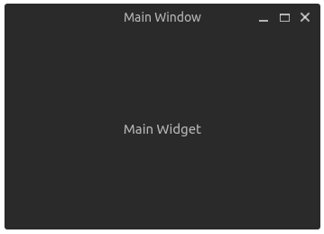
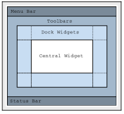

## Creating a Custom Window

``` cpp
#include "mainwindow.h"
MainWindow::MainWindow()
{
setWindowTitle("Main Window");
resize(400, 700);
QLabel *mainLabel = new QLabel("Main Widget");
setCentralWidget(mainLabel);
mainLabel->setAlignment(Qt::AlignCenter);
}
```

``` cpp
#ifndef MAINWINDOW_H
#define MAINWINDOW_H
#include <QMainWindow>
#include <QLabel>
class MainWindow : public QMainWindow
{
    Q_OBJECT
public:
    MainWindow();
};
#endif
```

``` cpp
#include "Mainwindow.h"
MainWindow::MainWindow()
{
    setWindowTitle("Main Window");
    resize(300, 200);
    QLabel *mainLabel = new QLabel("Main Widget");
    setCentralWidget(mainLabel);
    mainLabel->setAlignment(Qt::AlignCenter);
}
```



## QMainWindow Structure
