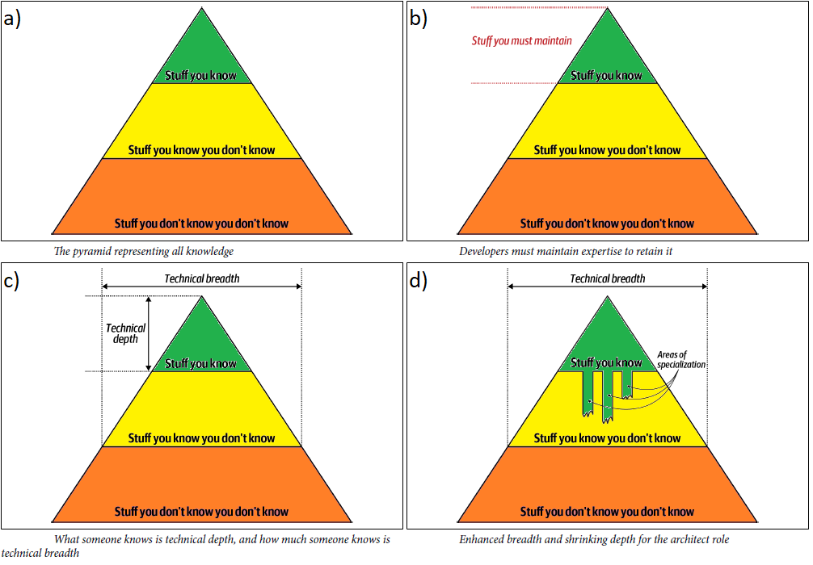

<!-- vscode-markdown-toc -->
* 1. [Architecture Versus Design](#ArchitectureVersusDesign)
* 2. [Technical Breadth](#TechnicalBreadth)
* 3. [Analyzing Trade-Offs](#AnalyzingTrade-Offs)
* 4. [Understanding Business Drivers](#UnderstandingBusinessDrivers)
* 5. [Balancing Architecture and Hands-On Coding](#BalancingArchitectureandHands-OnCoding)

<!-- vscode-markdown-toc-config
	numbering=true
	autoSave=true
	/vscode-markdown-toc-config -->
<!-- /vscode-markdown-toc -->

##  1. Architecture Versus Design

##  2. Technical Breadth
- A Software Architecture shall have a significant amount of *technical depth*.
- All technical knowledge in the world can be represented by the *knowledge pyramid* (Figure a):
  - *Stuff you know* (green): things that it is used every day
  - *Stuff you know you don't know* (yellow): things that you heard of or have little or no expertise in 
  - *Stuff you don't know you don't know* (orange): it would be the perfect solution for a problem but you dont even know those things exist.
- For a *developer* it is recommended to (Figure b):
  - to focus on the green area, to get experience and expertise.
  - invest time and effort to maintain green area up to date
  - Note: green area height is known as `technical depth`
- For an *Architect* it is recomended to:
  - focus on green and yellow areas of the pyramids
  - focus on `technical breadth` rather than `technical depth` (Figure c)
- Eventually the `architect knowledge pyramid` becomes similar to (Figure d) where some areas of expertise will remain and others atrophy.
  

##  3. Analyzing Trade-Offs

> "Architecture is the stuff you can't Google" - Mark Richards

- The famous answer to every question in sw architecture is `it depends`
  - It depends on: deployment environment, business drivers, company culture, budgets, timeframes etc...

##  4. Understanding Business Drivers

- To think like an architect it is mandatory to:
  - understand the business drivers that are required for the success of the software
  - traslate those reqs into *Architecture Characteristics* (i.e., performance, elasticity etc.)
- Perform the aforementioned tasks requires:
  - some level of business domain knowledge
  - healthy and collaborative relationships with stakeholders

> The chapters:
> CH04 Defining Architecture Characteristics
> CH05 Indentifying Architecture Characteristics
> CH06 Measuring Architecture Characteristics
>
> Bring useful information about this topic!

##  5. Balancing Architecture and Hands-On Coding