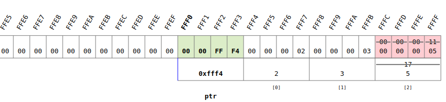
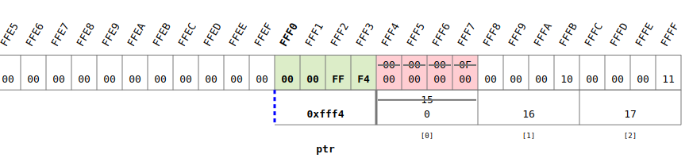

<!-- vscode-markdown-toc -->
* 1. [Defining pointers and dereferencing pointers](#Definingpointersanddereferencingpointers)
	* 1.1. [Exercise](#Exercise)
* 2. [Using pointers with functions](#Usingpointerswithfunctions)
	* 2.1. [Exercise](#Exercise-1)
* 3. [Performing simple pointer arithmetic](#Performingsimplepointerarithmetic)
	* 3.1. [Exercise](#Exercise-1)
* 4. [Passing arrays to functions](#Passingarraystofunctions)
	* 4.1. [Exercise](#Exercise-1)

<!-- vscode-markdown-toc-config
	numbering=true
	autoSave=true
	/vscode-markdown-toc-config -->
<!-- /vscode-markdown-toc -->


##  1. <a name='Definingpointersanddereferencingpointers'></a>Defining pointers and dereferencing pointers
- A pointer 
  


``` c
#include <stdio.h>
int main(){
    //! showMemory(start=65520)
    int a = 42;
    double d = 58.394;
    char c = 'r';
    int * addressOfA = &a;
    printf("address of a: %p\n", addressOfA);
    double * addressOfD = &d;
    printf("address of d: %p\n", addressOfD);
    char * addressOfC = &c;
    printf("address of c: %p\n", addressOfC);
    return 0;
}
```

- Dereference a pointer: get the value stored at a specific address


``` c
#include <stdio.h>
int main(){
    //! showMemory(start=65520)
    double a = 42.98;
    double * addressOfA = &a;
    printf("At the address %p there is the value %.2lf\n",addressOfA,* addressOfA);
    char c = 'm';
    char * addressOfC = &c;
    char d = * addressOfC;
    * addressOfA = 32;
    * addressOfA = * addressOfA + 1;
    printf("At the address %p there is the value %.2lf\n",addressOfA,* addressOfA);
    return 0;
}
```
###  1.1. <a name='Exercise'></a>Exercise
- You are developing an elixir that supposedly makes a person younger. You just need to get the software working correctly before starting to market your product. Your program keeps track of a person's age, but in order to be more secretive you work with a pointer rather than the variable that stores the age directly. 
- You are provided with a main function -- please complete it. Do not change any of the lines of code that have already been completed. Please only change the lines that are currently comments.
``` c
#include <stdio.h>

int main(void) {

    int age;

    // add a line here that declares an integer pointer named "ageptr"

    scanf("%d", &age);

    // add a line here that stores the address of age in ageptr  

    printf("The secret address is... ");

    // add a line here that prints out the address stored in ageptr  

    printf("Now take three drops of the magic elixir. \n");

    // add a line that uses only ageptr to lower the age by 5 years

    printf("Did the elixir work? You are %d years old!", age);

    return 0;

}
```

- solution
``` c
#include <stdio.h>

int main(void) {

    int age;

    // add a line here that declares an integer pointer named "ageptr"
    int *ageptr;

    scanf("%d", &age);

    // add a line here that stores the address of age in ageptr  
    ageptr = &age;
    
    printf("The secret address is... ");
    
    // add a line here that prints out the address stored in ageptr  
    printf("%p \n",ageptr);
    
    printf("Now take three drops of the magic elixir. \n");

    // add a line that uses only ageptr to lower the age by 5 years
    *ageptr = *ageptr - 5;
    printf("Did the elixir work? You are %d years old!", age);

    return 0;
}
```
##  2. <a name='Usingpointerswithfunctions'></a>Using pointers with functions
- Swap two integer variable values using functions and pointers
- 
``` c
#include <stdio.h>
int main(){
    //! showMemory(start=65520)
    int a = 42;
    double d = 58.394;
    char c = 'r';
    int * addressOfA = &a;
    printf("address of a: %p\n", addressOfA);
    double * addressOfD = &d;
    printf("address of d: %p\n", addressOfD);
    char * addressOfC = &c;
    printf("address of c: %p\n", addressOfC);
    return 0;
}
```
-  This dont swap! It only works in the local scope of the function
``` c
#include <stdio.h>
void swap(int,int);
int main() {
     //! showMemory(start=65520)
     int a = 9;
     int b = 1;
     swap(a,b);
     printf("%d %d\n",a,b);
    return 0;
}
void swap(int a, int b){
    int tmp = a;
    a = b;
    b = tmp;
}
```
-  This swap! It only works at the address level!
``` c
#include <stdio.h>
void swap(int *,int *);
int main() {
     //! showMemory(start=65520)
     int a = 9;
     int b = 1;
     swap(&a,&b);
     printf("%d %d\n",a,b);
    return 0;
}
void swap(int * a, int * b){
    int tmp = * a;
    * a = * b;
    * b = tmp;
}
```

- Modify an integer variable value using a functions with pointers

``` c
#include <stdio.h>
void addThree(int *);
int main() {
    //! showMemory(start=65520)
    int a = 5;
    addThree(&a);
    printf("inside main, value of a: %d\n",a);
    return 0;
}
void addThree(int * a){
    *a = *a + 3;
    printf("inside addThree, value of a: %d\n",*a);
}
```
###  2.1. <a name='Exercise-1'></a>Exercise
- You are continuing to work on your elixir of youth, and it turns out that, before purchasing the elixir, customers would like to know how young they will become after drinking the elixir!
  - The way your elixir works is that anyone who is at least 21 years old becomes ten years younger. However, the elixir does not work on anyone twenty years old or younger when these people try the elixir, they actually double in age!
  - You have already created a main function, shown below. All you need to do now is write a function which accepts the integer pointer "ageAddr" as an argument and modifies the integer this pointer points to according to the rules of your elixir. Since you are using pointers to change the value of the variable age, your function should have a void return type. 
  - Be sure not to modify the code that has been given to you, other than to add the following:
    - Your function definition.
    - The appropriate function call where indicated in the main function.
    - Your function prototype where indicated in the provided code.

``` c
#include <stdio.h>

//Write your function prototype here

int main(void){
	int age;
	int *ageAddr = &age;
	scanf("%d", ageAddr);
	printf("Your current age is %d.\n", age);

	//Write your function call here

	printf("Your new age will be %d!\n", age);
	return 0;
}

//Write your function here
```

-Solution
``` c
#include <stdio.h>

//Write your function prototype here
void converter(int *age);

int main(void){
	int age;
	int *ageAddr = &age;
	scanf("%d", ageAddr);
	printf("Your current age is %d.\n", age);

	//Write your function call here
    converter(&age);
    
	printf("Your new age will be %d!\n", age);
	return 0;
}


void converter(int *age){
    if(*age > 20){
        *age = *age -10;
    }
    else{
        *age = *age*2;
    }
}
```
##  3. <a name='Performingsimplepointerarithmetic'></a>Performing simple pointer arithmetic
- Introduction to pointer arithmetic: arrays, addresses and pointers
  - 2, 3 and 5 replaces the values of 15 16 17 in their addresses


``` c
#include <stdio.h>
int main() {
    //! showMemory(start=65520)
    int arr[3] = {15, 16, 17};
    printf("%p\n",arr);
    int * ptr = arr;
    * ptr = 2;
    * (ptr + 1) = 3;
    * (ptr + 2) = 5;
    return 0;
}
```

###  3.1. <a name='Exercise-1'></a>Exercise
- For the example below?
  - Value of `*(ptr1+1)`? `-5`
  - Value of `*(ptr2-3)`? `-7`
``` c
int array[] = {4, 6, 12, -5, -7, 3, 1, 0, -10};
int *ptr1, *ptr2;
ptr1 = array+2;
ptr2 = &ptr1[5];
```

##  4. <a name='Passingarraystofunctions'></a>Passing arrays to functions
- Pass an array to a function
- 


``` c
#include <stdio.h>
void reset(int *);
int main() {
    //! showMemory(start=65520)
    int arr[3] = {15, 16, 17};
    reset(arr);
    return 0;
}
void reset(int * ptr){
    *(ptr + 0) = 0;
    *(ptr +1) = 0;
    *(ptr +2) = 0;
}
```

###  4.1. <a name='Exercise-1'></a>Exercise
- Within this program, we will pass an array with 6 integers to a function, have the function swap the first and last integer, the second and the second to last integer, the third and the third to last integer.
- The function is called reverseArray and doesn't return anything (void). It should take one parameter, representing the array of integers. 
- The main function first reads 6 integers from the input, and assigns them to the array. The main function then calls reverseArray, passing the array as an argument.
- The main function then prints the reversed array.
  - input:1 2 3 4 5 6
  - output: 6 5 4 3 2 1

``` c
#include <stdio.h>
void swap(int *);
int main() {
     //! showMemory(start=65520)
     int a[6];
     scanf("%d %d %d %d %d %d",&a[0],&a[1],&a[2],&a[3],&a[4],&a[5]);
     swap(&a);
     printf("%d %d %d %d %d %d",a[0],a[1],a[2],a[3],a[4],a[5]);
     
    return 0;
}
void swap(int * ptr){
    
    int tmp1 = * (ptr);
    int tmp2 = * (ptr+1);
    int tmp3 = * (ptr+2);
    
    *(ptr)=*(ptr+5);
    *(ptr+1)=*(ptr+4);
    *(ptr+2)=*(ptr+3);
    *(ptr+3)=tmp3;
    *(ptr+4)=tmp2;
    *(ptr+5)=tmp1;
    
}
```