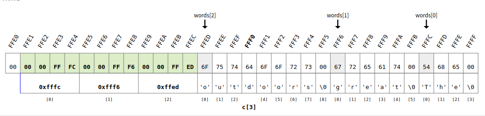
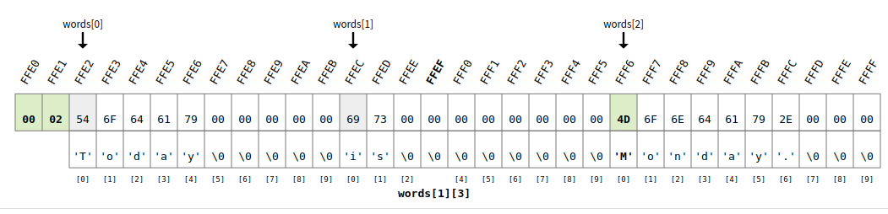

<!-- vscode-markdown-toc -->
* 1. [Working with arrays and pointers](#Workingwitharraysandpointers)
	* 1.1. [Define and work with arrays of pointers and use multiple ways for dereferencing](#Defineandworkwitharraysofpointersandusemultiplewaysfordereferencing)
	* 1.2. [Use pointers to pointers and dereference](#Usepointerstopointersanddereference)
	* 1.3. [Exercise](#Exercise)
* 2. [Storing and manipulating strings in arrays](#Storingandmanipulatingstringsinarrays)
	* 2.1. [Exercise](#Exercise-1)

<!-- vscode-markdown-toc-config
	numbering=true
	autoSave=true
	/vscode-markdown-toc-config -->
<!-- /vscode-markdown-toc -->

##  1. <a name='Workingwitharraysandpointers'></a>Working with arrays and pointers
- NOTE: `a[0]` is pronounced as `a of 0`

###  1.1. <a name='Defineandworkwitharraysofpointersandusemultiplewaysfordereferencing'></a>Define and work with arrays of pointers and use multiple ways for dereferencing

- Define and work with arrays of pointers and use multiple ways for dereferencing
  - Creating an array of pointers let you have an array of arrays.
  - 

``` c
#include <stdio.h>
int main(void){
    short a[3] = {234,655, 843};
    short b[2] = {12, 62};
    short c[4] = {3456, 3467, 23, 276};
    short * arrays[3] = {a, b, c};
    // This array of pointers has?
    // a which is a pointer with the address of a[0]
    // b which is a pointer with the address of b[0]
    // c which is a pointer with the address of c[0]
    return 0;
}
```
- If we change the value of `*array[0]` the value of `a[0]` will change. So for example:
``` c
#include <stdio.h>
int main(void){
     //! showMemory(cursors=[a, arrays[0], b, arrays[1], c, arrays[2]], start=65520)
    short a[3] = {234,655, 843};
    short b[2] = {12, 62};
    short c[4] = {3456, 3467, 23, 276};
    short * arrays[3] = {a, b, c};
    * arrays[0] = 5;
    return 0;
}
```
- It will change the `a[0]` value
  - 

- To change the value of a[1], it shall be used *pointer arithmetic* `a[1]` is equal to `*(array[0]+1)`

``` c
#include <stdio.h>
int main(void){
     //! showMemory(cursors=[a, arrays[0], b, arrays[1], c, arrays[2]], start=65520)
    short a[3] = {234,655, 843};
    short b[2] = {12, 62};
    short c[4] = {3456, 3467, 23, 276};
    short * arrays[3] = {a, b, c};
    * arrays[0] = 5;
    * (arrays[0] + 1) = 6; //Pointer arithmetic
    return 0;
}
```
- It will change `a[1]`
  - 

- So to change the other arrays, i.e. `b` it shall be used `arrays[1]`

``` c
#include <stdio.h>
int main(void){
     //! showMemory(cursors=[a, arrays[0], b, arrays[1], c, arrays[2]], start=65520)
    short a[3] = {234,655, 843};
    short b[2] = {12, 62};
    short c[4] = {3456, 3467, 23, 276};
    short * arrays[3] = {a, b, c};
 
    * arrays[0] = 5; // a[0] = 5
    * (arrays[0] + 1) = 6; // a[1] = 6
    * (arrays[0] + 2) = 7; // a[2] = 7
    * arrays[1] = 3; // b[0] = 3
    * (arrays[1] + 1) = 4; // b[1] = 4
    return 0;
}
```
- There is a second way to access to the arrays pointed by `arrays` vector. It is called `double indexed notation`. So: 
  - `* arrays[0] = a[0] = arrays[0][0]`
  - `* (arrays[0]+1) = a[1] = arrays[0][1]`
  - `* (arrays[0]+2) = a[2] = arrays[0][2]`  
  - `* arrays[1] = b[0] = arrays[1][0]`
  - `* (arrays[1]+1) = b[1] = arrays[1][1]`

###  1.2. <a name='Usepointerstopointersanddereference'></a>Use pointers to pointers and dereference 
1. We have `a` and `b` arrays, and `t` which is an array which contains the initial positions of `a` and `b` so its a pointer. For that reason its type is `short *`.
``` c
#include <stdio.h>
int main(){
     //! showMemory(cursors=[t, t[0], t[1]],start=65520)
    short a[3] = {1245, 1924, 234};
    short b[2] = {24, 256};
    short * t[2] = {a,b};
    
    return 0;
}
```
2. So, the function `setToZero(t)` will replace all the values of the arrays with `0`. The prototype of the function is a `short **` why?
   - `t` is a pointer, which contains tha pointers `a` and `b`
   - so, `*t` is returns `a` and `b`
   - but, to change the values of the elements `a` and `b` we need to have `*a` and `*b`. Which is `**t`.
       
``` c
#include <stdio.h>
void setToZero(short **)
int main(){
     //! showMemory(cursors=[t, t[0], t[1]],start=65520)
    short a[3] = {1245, 1924, 234};
    short b[2] = {24, 256};
    short * t[2] = {a,b};
    setToZero(t);
    return 0;
}
```
3. so the implementation of `setToZero` is as follows:
   1.  `*t` points to `t[0]` which is `a`, but `**t` is `*a` which is `1245`
   
   2. `*((*t) + 1) = 0`
      -  `*t` points to `a[0]` so `*(*t+1)` points to `a[1]`


``` c
#include <stdio.h>
void setToZero(short **);
int main(){
     //! showMemory(cursors=[t, t[0], t[1]],start=65520)
    short a[3] = {1245, 1924, 234};
    short b[2] = {24, 256};
    short * t[2] = {a,b};
    setToZero(t);
    return 0;
}
void setToZero(short ** t){
    *(*t) = 0; //t[0][0] or *(t[0]+0) or a[0]
    *((*t) + 1) = 0; ////t[0][1] or *(t[0]+1) or a[1]
    *((*t) + 2) = 0; //t[0][2] or *(t[0]+2) or a[2]
    *(*(t+1)) = 0; //t[1][0] or *(t[1]+0) or  b[0]
    *(*(t+1)+1) = 0; //t[1][1] or *(t[1]+1) or b[1]
}
```
 
###  1.3. <a name='Exercise'></a>Exercise
- asd
``` c
#include <stdio.h>

int main(void) {

    double totalWet, totalDry, ratio;

    double wet[2];
    double dry[3];
    double * cookie[2] = {wet,dry};
    
    scanf("%lf%lf", &wet[0], &wet[1]);
    scanf("%lf%lf%lf", &dry[0], &dry[1], &dry[2]);

    // Add one line here! 
    /* The line you add should use the array cookie (and not the array wet) to 
       find the sum of the wet ingredients of the cookie recipe and store that sum
       in the variable totalWet. Use only indexed notation to address the cookie
       array (that is, you need to use two pairs of brackets [..]). 
    */

    printf("Total amount of wet ingredients: %.2lf grams.\n", totalWet);
    
    // Add one line here! 
    /* The line you add should use the array cookie (and not the array dry) to 
       find the sum of the dry ingredients of the cookie recipe and store that sum
       in the variable totalDry. This time, use only one pair of brackets [..] each 
       time you address the cookie array. 
    */

    printf("Total amount of dry ingredients: %.2lf grams.\n", totalDry);
    ratio = totalDry/totalWet;
    printf("Ratio of wet to dry ingredients: %.2lf.\n", ratio);

    // Add two lines here.
    /* The lines you add should use the array cookie (and not the array wet) to
       update the amounts of water and oil in your recipe. 
       You believe that any cookie recipe should use equal amounts of water and oil.
       Without changing the total amount of wet ingredients, update the values for
       water and oil, using only the array cookie (and not the array wet) so that 
       these amounts will be equal. The easiest way to do so is to assign the value
       totalWet/2 to both the water and the oil entry. When addressing the array cookie,
       do not use any brackets at all this time.
    */
    
    printf("New water amount: %.2lf grams, new oil amount: %.2lf grams.\n", wet[0], wet[1]);
    
    return 0;
}
```

- Solution 

``` c
#include <stdio.h>

int main(void) {

    double totalWet, totalDry, ratio;

    double wet[2];
    double dry[3];
    double * cookie[2] = {wet,dry};
    
    scanf("%lf%lf", &wet[0], &wet[1]);
    scanf("%lf%lf%lf", &dry[0], &dry[1], &dry[2]);

    totalWet = *(*cookie) + *(*(cookie) + 1);  
    /* The line you add should use the array cookie (and not the array wet) to 
       find the sum of the wet ingredients of the cookie recipe and store that sum
       in the variable totalWet. Use only indexed notation to address the cookie
       array (that is, you need to use two pairs of brackets [..]). 
    */

    printf("Total amount of wet ingredients: %.2lf grams.\n", totalWet);
    
    totalDry = *(*(cookie +1)) + *(*(cookie+1) + 1)+ *(*(cookie+1) + 2);
    /* The line you add should use the array cookie (and not the array dry) to 
       find the sum of the dry ingredients of the cookie recipe and store that sum
       in the variable totalDry. This time, use only one pair of brackets [..] each 
       time you address the cookie array. 
    */

    printf("Total amount of dry ingredients: %.2lf grams.\n", totalDry);
    ratio = totalDry/totalWet;
    printf("Ratio of wet to dry ingredients: %.2lf.\n", ratio);

    // Add two lines here.
    *(*cookie) = totalWet/2;
    *(*cookie+1) = totalWet/2;
    /* The lines you add should use the array cookie (and not the array wet) to
       update the amounts of water and oil in your recipe. 
       You believe that any cookie recipe should use equal amounts of water and oil.
       Without changing the total amount of wet ingredients, update the values for
       water and oil, using only the array cookie (and not the array wet) so that 
       these amounts will be equal. The easiest way to do so is to assign the value
       totalWet/2 to both the water and the oil entry. When addressing the array cookie,
       do not use any brackets at all this time.
    */
    
    printf("New water amount: %.2lf grams, new oil amount: %.2lf grams.\n", wet[0], wet[1]);
    
    return 0;
}
```

##  2. <a name='Storingandmanipulatingstringsinarrays'></a>Storing and manipulating strings in arrays

### Store strings in arrays using pointers

``` c
#include <stdio.h>
int main(void){
     //! showMemory(cursors=[words[0], words[1], words[2]], start=65520)
    char a[4];
    char b[6];
    char c[9];
    char * words[3] = {a, b, c};
    printf("Please enter a word with at  most 3 letters: ");
    scanf("%s", a);
    printf("Please enter a word with at  most 5 letters: ");
    scanf("%s", b);
    printf("Please enter a word with at  most 8 letters: ");
    scanf("%s", c);
    printf("You entered: \n");
    printf("%s %s %s.\n", a, b, c);
    printf("%s %s %s.\n", words[0], words[1], words[2]); // print the shame that previous statement
    return 0;
}
```

- output

```
Please enter a word with at  most 3 letters: The 
Please enter a word with at  most 5 letters: great
Please enter a word with at  most 8 letters: outdoors
You entered: 
The great outdoors.
The great outdoors.
```

### Store multiple strings in an array
``` c
#include <stdio.h>
int main(void){
    //! showMemory(cursors=[words[0], words[1], words[2]], start=65520)
    char words[3][10];
    int i;
    printf("Please enter three words: ");
    for (i=0; i<3; i++) {
        scanf("%s", words[i]);
    }
    printf("You entered: \n");
    for (i=0; i<3; i++) {
        printf("%s ", words[i]);
    }
    printf("\nFirst letters: \n");
    for (i=0; i<3; i++) {
        printf("\"%s\" starts with the letter '%c'.\n", words[i], words[i][0]);
    }
    return 0;
}
```


- Output
```
Please enter three words: Today is Monday.
You entered: 
Today is Monday. 
First letters: 
"Today" starts with the letter 'T'.
"is" starts with the letter 'i'.
"Monday." starts with the letter 'M'.
```
### Work with matrices
``` c
#include <stdio.h>
int main(void){
    //! showMemory(cursors=[matrix[0], matrix[1]], start=65520)
    //! matrix = showArray2D(matrix, rowCursors=[line], colCursors=[col])
    int matrix[2][3];
    int line, col;
    for(line = 0; line < 2; line++){
        for(col = 0; col < 3; col++){
            scanf("%d",&matrix[line][col]);
        }
    }
    return 0;
}
```
- Output
```
```

###  2.1. <a name='Exercise-1'></a>Exercise

Your goal is to read a 68-word text from the input and then print it to the screen backwards. Individual words do not have to be spelled backwards, but rather your program should print out the last word first, then the second-to-last word, etc. No word has more than 40 characters.

Example
Input
```
Science Computer on Papers Selected Knuth, Ervin Donald ― correct." be will results the that reader a convince to and works algorithm an way the communicate to concepts, mathematical as well as forms literary and aesthetic traditional with works who essayist an ideally is programmer A clearly. them understand can beings human that so and quickly them perform can machines computing that so written are programs best "The
```
Output
```
"The best programs are written so that computing machines can perform them quickly and so that human beings can understand them clearly. A programmer is ideally an essayist who works with traditional aesthetic and literary forms as well as mathematical concepts, to communicate the way an algorithm works and to convince a reader that the results will be correct." ― Donald Ervin Knuth, Selected Papers on Computer Science
```
- Solution
``` c
#include <stdio.h>
int main(void){
    
    int numberOfWords = 68;
    char words[numberOfWords][41];
    int i;
    
    for (i=0; i<numberOfWords; i++) {
        scanf("%s", words[i]);
    }
    
    for (i=(numberOfWords-1); i>-1; i--) {
        printf("%s ", words[i]);
    }
  
    return 0;
}
```