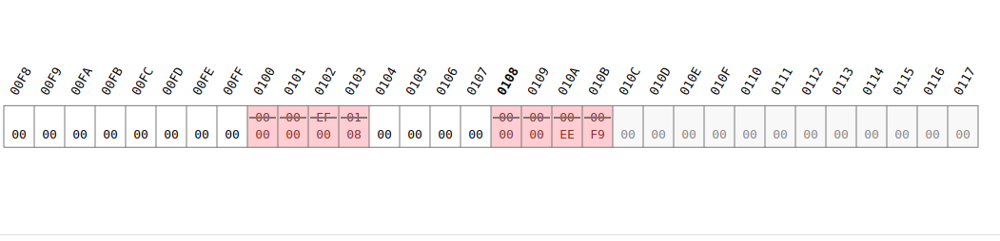
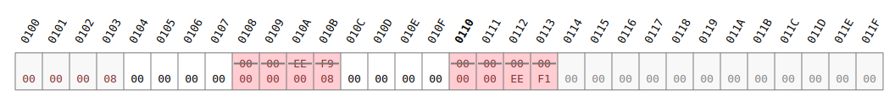
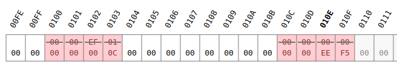
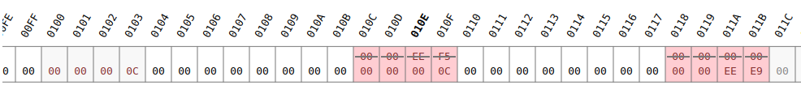
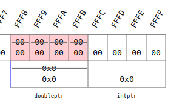
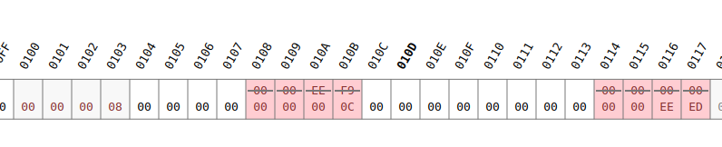
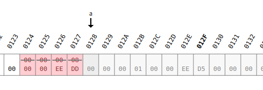
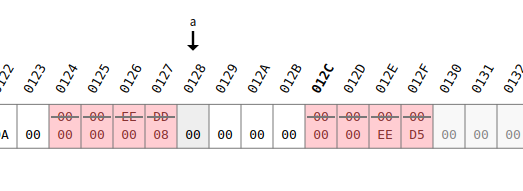
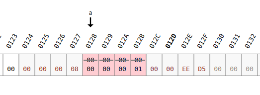

<!-- vscode-markdown-toc -->
* 1. [Allocate memory at runtime](#Allocatememoryatruntime)
	* 1.1. [Exercise](#Exercise)
* 2. [Freeing dynamically allocated memory](#Freeingdynamicallyallocatedmemory)
	* 2.1. [Exercise](#Exercise-1)
* 3. [Storing and addressing arrays in dynamically allocated memory](#Storingandaddressingarraysindynamicallyallocatedmemory)
	* 3.1. [Exercise](#Exercise-1)

<!-- vscode-markdown-toc-config
	numbering=true
	autoSave=true
	/vscode-markdown-toc-config -->
<!-- /vscode-markdown-toc -->

##  1. <a name='Allocatememoryatruntime'></a>Allocate memory at runtime
- Allocate memory in the heap using malloc (memory allocation).
  - So far we use `stack` aka for so called `automatic duration` variables which only persist on their own block or function.
  - `Dinamically allocated memory` (heap) is explicitly managed, so allocated and freed
    - To use it in c we need `stdlib`
- IF we run the code below we see:
  - there are two red blocks and one white block no middle
    - first block: `00 00 00 08` means that 8 bytes are reserved. four we reserved and other 4 are for the other red block.
    - second block: `00 00 00 00` reserved blocks using `malloc`
    - third block:` 00 00 EE F9` hexadecimal number which represents how heap memory is remaining

``` c
#include <stdlib.h>
int main(void){
    //! showMemory(start=272)
    malloc(4);
    return 0;
}
```
- If we add another `malloc` we can see how heap memory is managed:
  - first block: `00 00 00 08` means that 8 bytes are reserved. four we reserved and other 4 are for the other red block.
  - second block: `00 00 00 00` reserved blocks using `malloc`
  - third block:` 00 00 EE F1` hexadecimal number which represents how heap memory is remaining (which is the result of `00 00 EE F9 - 08` )


``` c
#include <stdlib.h>
int main(void){
    malloc(4);
    malloc(4);
    return 0;
}
```
- malloc is architecture dependent. So for the online compiler that im using, the memory is allocated in **multiples of 4**.
- For the code below we see:
  - In the first malloc
    - `0C` for `8 + 4` bits allocated.
      - `8` because is the minimum memory in the compiler to allocate 5 bytes (remember multiples of 4??)
      - and `4` to show the remaining heap memory

  - In the second malloc the memory is managed as follows:
    

``` c
#include <stdlib.h>
int main(void){
    malloc(5);
    malloc(5);
    return 0;
}
```
- normally malloc is used with `sizeof` and variables (no using constants).
###  1.1. <a name='Exercise'></a>Exercise
``` c
#include <stdlib.h>
int main(void){
    //! showMemory(start=272)
    malloc(3*sizeof(int));
    malloc(4*sizeof(double));
    return 0;
}
```
- To store where the memory is allocated we need a pointer.
``` c
#include <stdlib.h>
int main(void){
    //! showMemory(start=272)
    int * intptr;
    double * doubleptr;
    intptr = (int *) malloc(sizeof(int));
    doubleptr = (double *) malloc(sizeof(double));
    return 0;
}
```
- Pointers

- The memory allocated

- `free(a)`, even when freed the 01 value is still there. This is because no one else has used that location.



##  2. <a name='Freeingdynamicallyallocatedmemory'></a>Freeing dynamically allocated memory
- Deallocate memory in the heap using `free()`
- `a = (int *) malloc(sizeof(int));`

- `*a = 1;`

``` c
#include <stdio.h>
#include <stdlib.h>
int main(void) {
    int *a;
    a = (int *) malloc(sizeof(int));
    *a = 1;
    printf("I stored %d at memory location %p.\n", *a, a);
    free(a);
    return 0;
}
```
- If you free the pointer it can be used by another variable
``` c
#include <stdio.h>
#include <stdlib.h>
int main(void) {
    //! showMemory(start=438, cursors=[a,b,c])
    int *a, *b, *c;
    a = (int *) malloc(sizeof(int));
    *a = 1;
    printf("I stored %d at memory location %p.\n", *a, a);
    b = (int *) malloc(sizeof(int));
    *b = 2;
    free(a);
    c = (int *) malloc(sizeof(int));
    *c = 3;
    printf("Can I still access a?\n");
    printf("I stored %d at memory location %p.\n", *a, a);
    return 0;
}
```
- The output of this code is. This because `c` is using the location where `a` used to be.

``` c
I stored 1 at memory location 163.
Can I still access a?
I stored 3 at memory location 163.
```

##  3. <a name='Storingandaddressingarraysindynamicallyallocatedmemory'></a>Storing and addressing arrays in dynamically allocated memory

### Allocate memory for arrays using malloc 

``` c
```
### Learn from another example of array memory allocation

``` c
```

###  3.1. <a name='Exercise-1'></a>Exercise
- You are working on programming a toaster (again!). The user of the toaster has the  option to have their bread toasted "light" or "dark", and you are working on implementations in different languages of this particular setting. For example, in the German model, the settings would be stored as "hell" and "dunkel" instead. In order to be as efficient as possible with the use of the limited memory on the computer chip in the toaster you need to write a function "allocateString()" that allocates memory for strings (and you will then use this function to allocate just enough memory to store the settings on a particular model).

- This function "allocateString()" takes as argument an integer (of type int), representing the number of characters to allocate space for in memory. The function returns a pointer (of type char *), containing the address of the allocated memory. The function should use memory allocation to reserve the correct amount of space in memory. In order to receive credit for your solution you need to use sizeof (char) in this line, even if sizeof (char) returns 1.

- In your main() function you should call the function allocateString() twice: once for the label containing the "light" setting and once for the "dark" setting. You are provided with some code already that explains precisely what you need to do. Please do not change the code that has been given to you. Please only change those lines that say "// add a line of code...".

- Input
```
4 6
hell
dunkel
```
- Ouput
```
Local settings: hell - dunkel
```
- Provided Code
``` c
#include <stdio.h>
// Be sure to include any other library you may need...

// Write your allocateString() prototype here

int main(void) {
    int lengthLight, lengthDark;
    char *strLight, *strDark;
    
    scanf("%d %d", &lengthLight, &lengthDark); 
    // Write a line of code here that calls the function allocateString(). 
    
    /* The goal is to reserve space for the light setting label, therefore you 
       need to pass the number lengthLight to the function allocateString()
       Store the return value of this function call in the variable strLight. */
     
    // Write a line of code here that calls the function allocateString().
    
    /* This time the goal is to reserve space in memory for the dark setting label.
       Store the return value of the function call in the variable strDark. */
   
    scanf("%s", strLight);
    scanf("%s", strDark);
    printf("Local settings: %s - %s\n", strLight, strDark);
    // Write a line of code here to free the memory allocated for strLight
    
    // Write a line of code here to free the memory allocated for strDark
    
	
    return 0;
}

char * allocateString(int numChars){
    // declare your variable(s) here
    
    // Write a line of code here that performs the memory allocation.
    /* You should allocate space in memory for the number of characters specified 
       via the input parameter to the function and the null terminator and store the 
       address of the allocated memory in a pointer named ptr. In order to receive credit 
       for your solution you need to use sizeof(char) in this line, even if sizeof(char) 
       returns 1. */
    
    return ptr;
}
```
- Solution
``` c
```