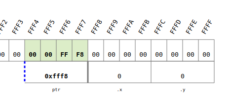
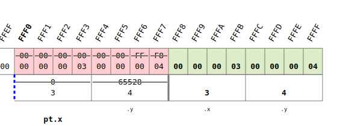
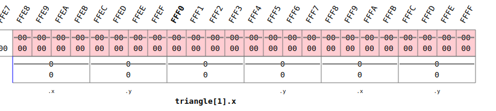
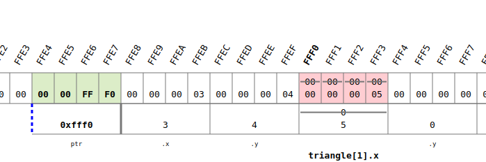
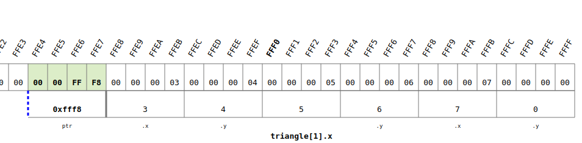

<!-- vscode-markdown-toc -->
* 1. [Create a structure to store the coordinates of a point](#Createastructuretostorethecoordinatesofapoint)
	* 1.1. [Exercise](#Exercise)
* 2. [Allocate memory for structures](#Allocatememoryforstructures)
	* 2.1. [Exercise](#Exercise-1)
* 3. [Get to know the concept of a linked list](#Gettoknowtheconceptofalinkedlist)
	* 3.1. [Exercise](#Exercise-1)

<!-- vscode-markdown-toc-config
	numbering=true
	autoSave=true
	/vscode-markdown-toc-config -->
<!-- /vscode-markdown-toc -->

##  1. <a name='Createastructuretostorethecoordinatesofapoint'></a>Create a structure to store the coordinates of a point

###  asd
- If we analise the following code we have: (addresses are referencial)
  - `ptr` has the `00 00 FF F8` which is the address of `z`
 
- When `printPoint` is called a **copy** is made:
  - For that reason you shall pass the adress of `z` in order to modified


``` c
#include <stdio.h>
struct point{
    int x;
    int y;
};
void printPoint(struct point pt);
void readPoint(struct point * ptr);
int main(void) {
    //! showMemory(start=65520)
    struct point z;
    readPoint(&z);
    printPoint(z);
	return 0;
}

void readPoint(struct point * ptr) {
    printf("\nEnter a new point: \n");
    printf("x-coordinate: ");
    scanf("%d", &ptr->x);
    printf("y-coordinate: ");
    scanf("%d", &ptr->y);
}

void printPoint(struct point pt){
    printf("(%d, %d)\n", pt.x, pt.y);
}
```

### Use an array of structures
So how to store the points of a triangle??
``` c
#include <stdio.h>
struct point{
    int x;
    int y;
};
void printPoint(struct point pt);
void readPoint(struct point * ptr);
int main(void) {
    //! showMemory(start=65520)
    struct point triangle[3];
    readPoint(&triangle[i]);
	return 0;
}

void readPoint(struct point * ptr) {
    printf("\nEnter a new point: \n");
    printf("x-coordinate: ");
    scanf("%d", &ptr->x);
    printf("y-coordinate: ");
    scanf("%d", &ptr->y);
}

void printPoint(struct point pt){
    printf("(%d, %d)\n", pt.x, pt.y);
}
```
- The memory is stored forthe three points:
  - ptr stores the `0000FFE8` address where triangle[0] is located.
	
  - then ptr stores the `0000FFF0` address where triangle[1] is located.
	
  - ptr stores the `0000FFF8` address where triangle[2] is located.
	
  
- The code can be inproved with a loop

``` c
#include <stdio.h>
struct point{
    int x;
    int y;
};
void printPoint(struct point pt);
void readPoint(struct point * ptr);
void printTriangle(struct point *ptr);
int main(void) {
    //! showMemory(start=65520)
    struct point triangle[3];
    int i;
    for (i=0; i<3; i++){
        readPoint(&triangle[i]);
    }
    printTriangle(triangle);
	return 0;
}

void readPoint(struct point * ptr) {
    printf("\nEnter a new point: \n");
    printf("x-coordinate: ");
    scanf("%d", &ptr->x);
    printf("y-coordinate: ");
    scanf("%d", &ptr->y);
}

void printTriangle(struct point *ptr) {
    int i;
    for (i=0; i<3; i++) {
        printPoint(ptr[i]);
    }
}

void printPoint(struct point pt){
    printf("(%d, %d)\n", pt.x, pt.y);
}
```

###  1.1. <a name='Exercise'></a>Exercise

- You have defined a structure struct point as above as well as successfully declared a variable named pentagon as an array of five such points. You would like to assign the value 4.1 to the y-coordinate of the fifth point in pentagon.
Which of the following are the correct ways to do so?
``` c
triangle[1].x = 9;
(triangle+1)->y = 5;  // Both are similar
```
##  2. <a name='Allocatememoryforstructures'></a>Allocate memory for structures

###  2.1. <a name='Exercise-1'></a>Exercise
``` c
```
##  3. <a name='Gettoknowtheconceptofalinkedlist'></a>Get to know the concept of a linked list

###  3.1. <a name='Exercise-1'></a>Exercise
``` c
```
