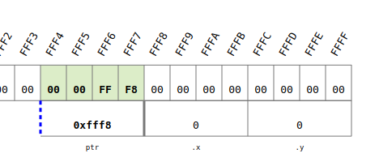
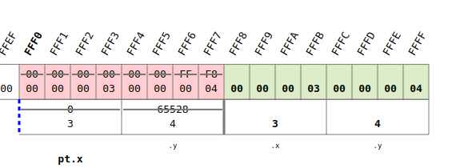
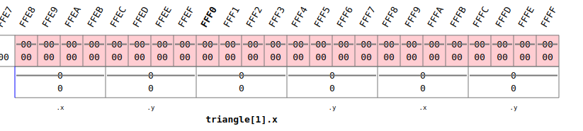
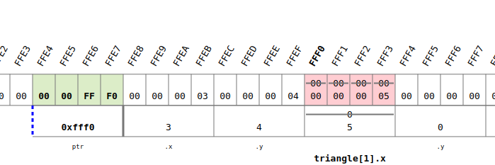
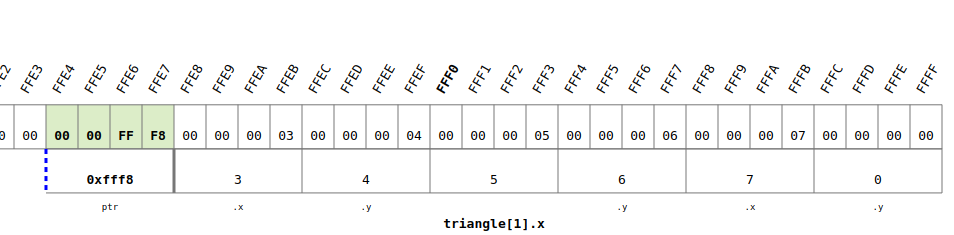
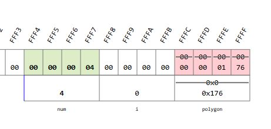

<!-- vscode-markdown-toc -->
* 1. [Create a structure to store the coordinates of a point](#Createastructuretostorethecoordinatesofapoint)
	* 1.1. [Exercise](#Exercise)
* 2. [Allocate memory for structures](#Allocatememoryforstructures)
	* 2.1. [Exercise](#Exercise-1)
* 3. [Get to know the concept of a linked list](#Gettoknowtheconceptofalinkedlist)
	* 3.1. [Exercise](#Exercise-1)

<!-- vscode-markdown-toc-config
	numbering=true
	autoSave=true
	/vscode-markdown-toc-config -->
<!-- /vscode-markdown-toc -->

##  1. <a name='Createastructuretostorethecoordinatesofapoint'></a>Create a structure to store the coordinates of a point

###  asd
- If we analise the following code we have: (addresses are referencial)
  - `ptr` has the `00 00 FF F8` which is the address of `z`
 
- When `printPoint` is called a **copy** is made:
  - For that reason you shall pass the adress of `z` in order to modified


``` c
#include <stdio.h>
struct point{
    int x;
    int y;
};
void printPoint(struct point pt);
void readPoint(struct point * ptr);
int main(void) {
    //! showMemory(start=65520)
    struct point z;
    readPoint(&z);
    printPoint(z);
	return 0;
}

void readPoint(struct point * ptr) {
    printf("\nEnter a new point: \n");
    printf("x-coordinate: ");
    scanf("%d", &ptr->x);
    printf("y-coordinate: ");
    scanf("%d", &ptr->y);
}

void printPoint(struct point pt){
    printf("(%d, %d)\n", pt.x, pt.y);
}
```

### Use an array of structures
So how to store the points of a triangle??
``` c
#include <stdio.h>
struct point{
    int x;
    int y;
};
void printPoint(struct point pt);
void readPoint(struct point * ptr);
int main(void) {
    //! showMemory(start=65520)
    struct point triangle[3];
    readPoint(&triangle[i]);
	return 0;
}

void readPoint(struct point * ptr) {
    printf("\nEnter a new point: \n");
    printf("x-coordinate: ");
    scanf("%d", &ptr->x);
    printf("y-coordinate: ");
    scanf("%d", &ptr->y);
}

void printPoint(struct point pt){
    printf("(%d, %d)\n", pt.x, pt.y);
}
```
- The memory is stored forthe three points:
  - ptr stores the `0000FFE8` address where triangle[0] is located.
	
  - then ptr stores the `0000FFF0` address where triangle[1] is located.
	
  - ptr stores the `0000FFF8` address where triangle[2] is located.
	
  
- The code can be inproved with a loop

``` c
#include <stdio.h>
struct point{
    int x;
    int y;
};
void printPoint(struct point pt);
void readPoint(struct point * ptr);
void printTriangle(struct point *ptr);
int main(void) {
    //! showMemory(start=65520)
    struct point triangle[3];
    int i;
    for (i=0; i<3; i++){
        readPoint(&triangle[i]);
    }
    printTriangle(triangle);
	return 0;
}

void readPoint(struct point * ptr) {
    printf("\nEnter a new point: \n");
    printf("x-coordinate: ");
    scanf("%d", &ptr->x);
    printf("y-coordinate: ");
    scanf("%d", &ptr->y);
}

void printTriangle(struct point *ptr) {
    int i;
    for (i=0; i<3; i++) {
        printPoint(ptr[i]);
    }
}

void printPoint(struct point pt){
    printf("(%d, %d)\n", pt.x, pt.y);
}
```

###  1.1. <a name='Exercise'></a>Exercise

- You have defined a structure struct point as above as well as successfully declared a variable named pentagon as an array of five such points. You would like to assign the value 4.1 to the y-coordinate of the fifth point in pentagon.
Which of the following are the correct ways to do so?
``` c
triangle[1].x = 9;
(triangle+1)->y = 5;  // Both are similar
```
##  2. <a name='Allocatememoryforstructures'></a>Allocate memory for structures
- How to dynamically allocate in memory an array of structures
- From the code of the previous section, now we implement a polygon of `num` vertices. 
  - Because wo dont know how many vertices the polygon will have, the polygon has to be allocated in runtime.
- We use `malloc` to reserve a space in memory of `num*sizeof(struct point)`
  - Remember `malloc` returns a pointer to the beggining of the memory adress array
  - `malloc` belongs to `stdlib`

``` c
#include <stdio.h>
#include <stdlib.h>
struct point{
    int x;
    int y;
};
void printPoint(struct point pt);
void readPoint(struct point * ptr);
void printPoly(struct point *ptr, int vertices);
int main(void) {
    //! showMemory(start=65520)
    struct point * polygon;
    int i, num;
    printf("How many vertices does your polygon have? ");
    scanf("%d", &num);
    polygon = (struct point *) malloc(num * sizeof(struct point));
    for (i=0; i<num; i++){
        readPoint(&polygon[i]);
    }
    printPoly(polygon, num);
    free(polygon); // DONT FORGET this
	return 0;
}

void readPoint(struct point * ptr) {
    printf("\nEnter a new point: \n");
    printf("x-coordinate: ");
    scanf("%d", &ptr->x);
    printf("y-coordinate: ");
    scanf("%d", &ptr->y);
}

void printPoly(struct point *ptr, int vertices) {
    int i;
    for (i=0; i<vertices; i++) {
        printPoint(ptr[i]);
    }
}

void printPoint(struct point pt){
    printf("(%d, %d)\n", pt.x, pt.y);
}
```
- When running: 
  - `polygon` from `FF FC` to `FF FF`
  - `i` from `FF F8` to `FF FB`
  - `num` from `FF F4` to `FF F7`
  - But where is the `array`? Well it is on the `heap`, and `polygon` has the address of this array as its value `01 76` i.e `0x176`
    

    - ``

###  2.1. <a name='Exercise-1'></a>Exercise
- In this task, we will continue to work with polygons. You are provided with the following:
  - A familiar structure definition for a 2-dimensional point.
  - Two familiar functions and their prototypes, "printPoint()" and "printPoly()".
  - A prototype for "initializePoly()", a function that you must write.
  - An empty main function which you must complete.
- Please do not alter the provided code (except to fill in the main function and add your initializePoly() function).
initializePoly() should receive as input a pointer to the first structure in an array of structures as well as an integer, indicating how many points can be stored in the array. Your job is to initialize these points in the following way: Using a for loop with i starting at 0, initialize the x-coordinate of the point at index i as -i, and the y-coordinate as i*i.
- Your main function should read the number of vertices to store in the array of points from the user, then allocate the appropriate amount of memory, initialize the array with the function initializePoly, and finally print the vertices of the polygon using the function printPoly().


``` c
#include <stdio.h>
#include <stdlib.h>

struct point{
	int x;
	int y;
};

void printPoint(struct point);
void printPoly(struct point *, int);
void initializePoly(struct point *, int);
void readPoint(struct point * ptr, int);

int main(void) {
    struct point *polygon;
    int num;
    scanf("%d", &num);
    polygon = (struct point *) malloc(num * sizeof(struct point));
    
    initializePoly(polygon, num);
    printPoly(polygon,num);
    
    free(polygon);

}

void printPoint(struct point pt) {
    printf("(%d, %d)\n", pt.x, pt.y);
}

void printPoly(struct point *ptr, int N) {
    int i;
    for (i=0; i<N; i++) {
        printPoint(ptr[i]);
    }
}

// Write your initializePoly() function here
void initializePoly(struct point *polygon, int num){
    int i;
    for (i=0; i<num; i++){
        readPoint(&polygon[i],i);
    }
}

void readPoint(struct point * ptr, int i) {
    
    ptr->x = -1 * i;
    ptr->y = i*i;
}
```
##  3. <a name='Gettoknowtheconceptofalinkedlist'></a>Get to know the concept of a linked list

### Link structures together in a linked list

``` c
#include <stdio.h>

struct point{
    int x;
    int y;
    // A reference to the next element in the list
    struct point * next; 
};

int main(void) {
    //! showMemory(start=65520)
    struct point pt1 = {1, 2, NULL};
    struct point pt2 = {-2, 3, NULL};
    struct point pt3 = {5, -4, NULL};
    struct point * start, 
    struct point * ptr;
    
    start = &pt1;
    pt1.next = &pt2;
    pt2.next = &pt3;
    
    ptr = start;
    while (ptr!=NULL) {
        printf("(%d, %d)\n", ptr->x, ptr->y);
        ptr = ptr->next;
    }
	return 0;
}
```

- `point1` from `FF F4` to `FF FF`
  - `.x`
    - `FF F4`: `00`
    - `FF F5`: `00`
    - `FF F6`: `00`
    - `FF F7`: `01`
  - `.y`
    - `FF F8`: `00`
    - `FF F9`: `00`
    - `FF FA`: `00`
    - `FF FB`: `02`
  - `.next`
    - `FF FC`: `00`
    - `FF FD`: `00`
    - `FF FE`: `FF`
    - `FF FF`: `E8`
- `point2` from `FF E8` to `FF F3`
  - `.x`
    - `FF E8`: `FF`
    - `FF E9`: `FF`
    - `FF EA`: `FF`
    - `FF EB`: `FE`
  - `.y`
    - `FF EC`: `00`
    - `FF ED`: `00`
    - `FF EE`: `00`
    - `FF EF`: `03`
  - `.next`
    - `FF F0`: `00`
    - `FF F1`: `00`
    - `FF F2`: `FF`
    - `FF F3`: `DC`
- `point3` from `FF DC` to `FF E7`
  - `.x`
    - `FF DC`: `00`
    - `FF DD`: `00`
    - `FF DE`: `00`
    - `FF DF`: `05`
  - `.y`
    - `FF E0`: `FF`
    - `FF E1`: `FF`
    - `FF E2`: `FF`
    - `FF E3`: `FC`
  - `.next`
    - `FF E4`: `00`
    - `FF E5`: `00`
    - `FF E6`: `00`
    - `FF E7`: `00`
- `start` `00 00 FF F4`
- `ptr`: it iterates taking the following values...
  - `FF F4`
  - `FF E8`
  - `FF DC`


### Print a linked list

``` c

```
### Append a new nodes to a linked list

``` c

```

### Delete a linked list

``` c

```
  
###  3.1. <a name='Exercise-1'></a>Exercise
``` c
```
