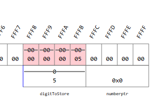
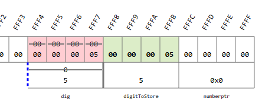
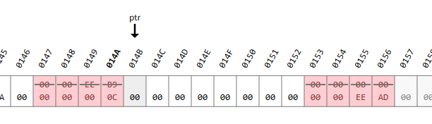
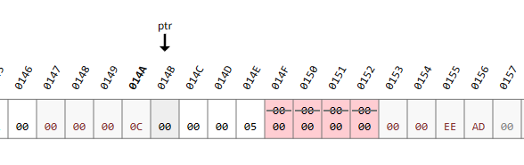
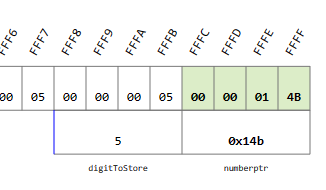
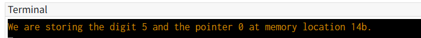
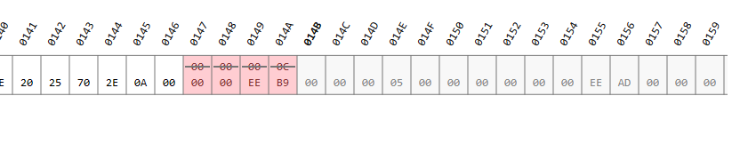

<!-- vscode-markdown-toc -->
* 1. [Creating single node](#Creatingsinglenode)
	* 1.1. [Exercise](#Exercise)
		* 1.1.1. [Solution](#Solution)
* 2. [Linking nodes](#Linkingnodes)
	* 2.1. [Exercise](#Exercise-1)
		* 2.1.1. [Solution](#Solution-1)
* 3. [Printing a linked list](#Printingalinkedlist)
	* 3.1. [Exercise](#Exercise-1)
		* 3.1.1. [Solution](#Solution-1)
* 4. [Free an entire linked list](#Freeanentirelinkedlist)
	* 4.1. [Exercise](#Exercise-1)
		* 4.1.1. [Solution](#Solution-1)
* 5. [Creating linked lists from user input](#Creatinglinkedlistsfromuserinput)
	* 5.1. [Exercise](#Exercise-1)
		* 5.1.1. [Solution](#Solution-1)
* 6. [Searching a linked list](#Searchingalinkedlist)
* 7. [Sorting a linked list using  Insertion Sort](#SortingalinkedlistusingInsertionSort)

<!-- vscode-markdown-toc-config
	numbering=true
	autoSave=true
	/vscode-markdown-toc-config -->
<!-- /vscode-markdown-toc -->

We will create a linked list that stores `long integers`
##  1. <a name='Creatingsinglenode'></a>Creating single node 
``` c
#include <stdio.h>
#include <stdlib.h>

struct digit {
    int num;
    struct digit * next;
};
struct digit * createDigit(int dig);
int main(void) {
    struct digit * numberptr;
    int digitToStore = 5; //1
    numberptr = createDigit(digitToStore); //5
    printf("We are storing the digit %d and the pointer %p at memory location %p.\n", numberptr->num, numberptr->next, numberptr); //6
    free(numberptr); // 7
    return 0;
}

struct digit * createDigit(int dig) {
    struct digit *ptr; //2
    ptr = (struct digit *) malloc(sizeof(struct digit)); //3
    ptr->num = dig; 
    ptr->next = NULL;//4
    return ptr;
}
```
- Once the code is running:
1. The variables are alocated 

2. The `dig` is initialize

3. The malloc is called, and is allocated space for `num` and `next`

4. The fields `num` and `next` are allocated

5. `numberptr` now has the struct address

6. The message is printed in terminal

7. The memory is freed


###  1.1. <a name='Exercise'></a>Exercise
- You would like to store student data (for each student, their name and age) in a linked list of students. You are given the following structure to store each student's information. Please do not modify this structure:

``` c
struct student {
      char name[50];
      int age;
      struct student *next;
};
```
- Your first task is to write a function createStudent() that takes as inputs a string (namely a student's name) and an integer (their age) and that returns a pointer to a struct student which stores this information. Your function should dynamically allocate the memory required for this struct student and then write the student's name and age into this newly allocated memory. 

- You are given the createStudent() function prototype and a main() function to test your code, please do not modify these:

``` c
struct student *createStudent(char studentName[], int studentAge);

int main(void) {
    struct student *studptr;
    int myAge;
    char myName[50];
    scanf("%s %d", myName, &myAge);
    studptr = createStudent(myName, myAge);
    printf("New student created: %s is %d years old.\n", studptr->name, studptr->age);
    free(studptr);
    return 0;
}
```
- Examples:
  - input: `Petra 25`
  - output: `New student created: Petra is 25 years old.   `

- Initial code:

``` c
#include <stdio.h>
#include <stdlib.h>

struct student {
      char name[50];
      int age;
      struct student *next;
};

struct student *createStudent(char studentName[], int studentAge);

// Write other function prototypes here (if any)

int main(void) {
    struct student *studptr;
    int myAge;
    char myName[50];
    scanf("%s %d", myName, &myAge);
    studptr = createStudent(myName, myAge);
    printf("New student created: %s is %d years old.\n", studptr->name, studptr->age);
    free(studptr);
    return 0;
}

// Write your createStudent function here (and any other functions you see fit)
```

####  1.1.1. <a name='Solution'></a>Solution

``` c
#include <stdio.h>
#include <stdlib.h>

struct student {
      char name[50];
      int age;
      struct student *next;
};

struct student *createStudent(char studentName[], int studentAge);

// Write other function prototypes here (if any)

int main(void) {
    struct student *studptr;
    int myAge;
    char myName[50];
    scanf("%s %d", myName, &myAge);
    studptr = createStudent(myName, myAge);
    printf("New student created: %s is %d years old.\n", studptr->name, studptr->age);
    free(studptr);
    return 0;
}

// Write your createStudent function here (and any other functions you see fit)
struct student *createStudent(char studentName[], int studentAge){
    struct student *ptr; 
    ptr = (struct student *) malloc(sizeof(struct student)); 
     
    passCharArray(ptr->name, studentName);
    ptr->age = studentAge; 
    ptr->next = NULL;
    return ptr;
}

void passCharArray(char target[], char studentName[]){
   int i = 0;
   for(i = 0; i < 50; i++)
   {
      target[i] = studentName[i];
   }
}
```

##  2. <a name='Linkingnodes'></a>Linking nodes

``` c
#include <stdio.h>
#include <stdlib.h>

struct digit {
    int num;
    struct digit * next;
};
struct digit * createDigit(int dig);
struct digit * append(struct digit * end, struct digit * newDigitptr);
int main(void) {
    //! stack=showMemory(start=65520,cursors=[start,newDigitptr,end,tmp])
    struct digit *start, *newDigitptr, *end, *tmp;
    int first = 5;
    int second = 3;
    int third = 7;
    start = createDigit(first);
    end = start;
    newDigitptr = createDigit(second);
    end = append(end, newDigitptr);
    newDigitptr = createDigit(third);
    end = append(end, newDigitptr);
    // free needs to be added  here
	// It turns more complex due to the linked nodes 
    tmp = start->next;
    free(start);
    start = tmp;
    tmp = start->next;
    free(start);
    free(tmp);
    return 0;
}

struct digit * append(struct digit * end, struct digit * newDigitptr) {
    //! heap=showMemory(start=260, cursors=[end,newDigitptr])
    end->next = newDigitptr;
    end = newDigitptr;
    return(end);
}

struct digit * createDigit(int dig) {
    //! heap=showMemory(start=260, cursors=[ptr])
    struct digit *ptr;
    ptr = (struct digit *) malloc(sizeof(struct digit));
    ptr->num = dig;
    ptr->next = NULL;
    return ptr;
}

```

###  2.1. <a name='Exercise-1'></a>Exercise
- In this task you will continue working on the linked list of students in which you would like to store, for each student, their name and age. As before you are provided with some code that you should not modify:
  - A structure definition for the storage of each student's information.
  - A main() function to test your code. 
  - Prototypes for the functions createStudent() (from the previous task) and append() (from the current task).
- You will need the function definition (from the previous task) for createStudent(), as well as any other functions you added, such as copyStr() for example. If you were unable to solve the previous task you have the option to be given the code for the createStudent() function (see the quiz preceding this task) so that you can work on the current task.
- Your new task is to write a function append() which takes as input two pointers: the first pointer holds the address of the current end of the linked list of students, the second pointer points to a newly created student. Your function should append this new student to the linked list and return the address (a struct student *) of the new end of the list. 

``` c
#include <stdio.h>
#include <stdlib.h>

struct student {
      char name[50];
      int age;
      struct student *next;
};

struct student *createStudent(char studentName[], int studentAge);
struct student *append(struct student * end, struct student * newStudptr); 
/* add other prototypes here if needed */

int main(void) {
    struct student *start, *newStudptr, *end, *tmp;
    int ageP, ageR, ageM;

    scanf("%d %d %d", &ageP, &ageR, &ageM);
    start = createStudent("Petra", ageP);
    end = start;
    newStudptr = createStudent("Remi", ageR);
    end = append(end, newStudptr);
    newStudptr = createStudent("Mike", ageM);
    end = append(end, newStudptr);

    printf("%s is %d years old.\n", start->name, start->age);
    printf("%s is %d years old.\n", start->next->name, start->next->age);
    printf("%s is %d years old.\n", start->next->next->name, start->next->next->age);

    tmp = start->next;
    free(start);
    start = tmp;
    tmp = start->next;
    free(start);
    free(tmp);

    return 0;
}

/* Place your function definitions here. Be sure to include the definition for 
   createStudent() and any other functions you created for the previous task. */
```

- Example
  - input: `25 18 32`
  - outut:
  ```
  Petra is 25 years old.
  Remi is 18 years old.
  Mike is 32 years old.
  ``` 

####  2.1.1. <a name='Solution-1'></a>Solution

``` c
#include <stdio.h>
#include <stdlib.h>

struct student {
      char name[50];
      int age;
      struct student *next;
};

struct student *createStudent(char studentName[], int studentAge);
struct student *append(struct student * end, struct student * newStudptr); 
void passCharArray(char target[], char studentName[]);

/* add other prototypes here if needed */

int main(void) {
    struct student *start, *newStudptr, *end, *tmp;
    int ageP, ageR, ageM;

    scanf("%d %d %d", &ageP, &ageR, &ageM);
    start = createStudent("Petra", ageP);
    end = start;
    newStudptr = createStudent("Remi", ageR);
    end = append(end, newStudptr);
    newStudptr = createStudent("Mike", ageM);
    end = append(end, newStudptr);

    printf("%s is %d years old.\n", start->name, start->age);
    printf("%s is %d years old.\n", start->next->name, start->next->age);
    printf("%s is %d years old.\n", start->next->next->name, start->next->next->age);

    tmp = start->next;
    free(start);
    start = tmp;
    tmp = start->next;
    free(start);
    free(tmp);

    return 0;
}

/* Place your function definitions here. Be sure to include the definition for 
   createStudent() and any other functions you created for the previous task. */
struct student *createStudent(char studentName[], int studentAge){
    struct student *ptr; 
    ptr = (struct student *) malloc(sizeof(struct student)); 
     
    passCharArray(ptr->name, studentName);
    ptr->age = studentAge; 
    ptr->next = NULL;
    return ptr;
}

struct student *append(struct student * end, struct student * newStudptr){
    end->next = newStudptr;
    end = newStudptr; 
    return(end);
}

void passCharArray(char target[], char studentName[]){
   int i = 0;
   for(i = 0; i < 50; i++)
   {
      target[i] = studentName[i];
   }
}
```
##  3. <a name='Printingalinkedlist'></a>Printing a linked list
``` c
#include <stdio.h>
#include <stdlib.h>

struct digit {
    int num;
    struct digit *next;
};

struct digit * createDigit(int);
struct digit * append(struct digit * end, struct digit * newDigptr);
void printNumber(struct digit *start);

int main(void) {
    //! stackk = showMemory(start=65520)
    struct digit *start, *newDigptr, *end, *tmp;
    int first = 5;
    int second = 3;
    int third = 7;
    start = createDigit(first);
    end = start;
    newDigptr = createDigit(second);
    end = append(end, newDigptr);
    newDigptr = createDigit(third);
    end = append(end, newDigptr);
    printNumber(start);
    tmp = start->next;
    free(start);
    start = tmp;
    tmp = start->next;
    free(start);
    free(tmp);
    return 0;
}

struct digit *createDigit(int dig) {
    struct digit *ptr;
    ptr = (struct digit *) malloc(sizeof(struct digit));
    ptr->num = dig;
    ptr->next = NULL;
    return ptr;
}

struct digit * append(struct digit * end, struct digit * newDigptr) {
    end->next = newDigptr;
    return(end->next);
}

void printNumber(struct digit *start){
    //! heap=showMemory(start=277, cursors=[ptr,start])
    struct digit * ptr = start;
    while (ptr!=NULL) {
        printf("%d", ptr->num);
        ptr = ptr->next;
    }
    printf("\n");
}
```
###  3.1. <a name='Exercise-1'></a>Exercise
- In this task you will continue working on the linked list of students in which you would like to store, for each student, their name and age. As before you are provided with some code that you should not modify:
  - A structure definition for the storage of each student's information.
  - A `main()` function to test your code. 
  - Prototypes for the functions `createStudent()`, `append()` (from previous tasks) and `printStudents()` (from the current task).
- You will need the function definitions (from previous tasks) for `createStudent()`, `append()` as well as any other functions you added, such as `copyStr()` for example. If you were unable to solve the previous task you have the option to be given the code for the `append()` function (see the quiz preceding this task) so that you can work on the current task.
- Your new task is to write a function printStudents() which takes as input a pointer that holds the address of the start of a linked list of students. Your function should then print this list of students to the screen as specified in the example below. Your function should not return anything.

``` c
#include <stdio.h>
#include <stdlib.h>

struct student {
      char name[50];
      int age;
      struct student *next;
};

struct student *createStudent(char studentName[50], int studentAge);
struct student * append(struct student * end, struct student * newStudptr); 
void printStudents(struct student *start);
/* add other prototypes here if needed*/

int main(void) {
    struct student *start, *newStudptr, *end, *tmp;
    int ageP, ageR, ageM;

    scanf("%d %d %d", &ageP, &ageR, &ageM);

    start = createStudent("Petra", ageP);
    end = start;

    newStudptr = createStudent("Remi", ageR);
    end = append(end, newStudptr);

    newStudptr = createStudent("Mike", ageM);
    end = append(end, newStudptr);

    printStudents(start);
    tmp = start->next;

    free(start);

    start = tmp;
    tmp = start->next;

    free(start);
    free(tmp);

    return 0;
}

/* Place your function definitions here. Be sure to include the definitions for 
   createStudent() and append() as well as any other functions you created for 
   the previous tasks. */
```
- Example:
  - Input: `25 18 32`
  - Output: 
    ```
    Petra is 25 years old.
    Remi is 18 years old.
    Mike is 32 years old.
    ```

####  3.1.1. <a name='Solution-1'></a>Solution
``` c
#include <stdio.h>
#include <stdlib.h>

struct student {
      char name[50];
      int age;
      struct student *next;
};

struct student *createStudent(char studentName[50], int studentAge);
struct student * append(struct student * end, struct student * newStudptr); 
void passCharArray(char target[], char studentName[]);
void printStudents(struct student *start);
/* add other prototypes here if needed*/

int main(void) {
    struct student *start, *newStudptr, *end, *tmp;
    int ageP, ageR, ageM;

    scanf("%d %d %d", &ageP, &ageR, &ageM);

    start = createStudent("Petra", ageP);
    end = start;

    newStudptr = createStudent("Remi", ageR);
    end = append(end, newStudptr);

    newStudptr = createStudent("Mike", ageM);
    end = append(end, newStudptr);

    printStudents(start);
    tmp = start->next;

    free(start);

    start = tmp;
    tmp = start->next;

    free(start);
    free(tmp);

    return 0;
}

/* Place your function definitions here. Be sure to include the definitions for 
   createStudent() and append() as well as any other functions you created for 
   the previous tasks. */
struct student *createStudent(char studentName[], int studentAge){
    struct student *ptr; 
    ptr = (struct student *) malloc(sizeof(struct student)); 
     
    passCharArray(ptr->name, studentName);
    ptr->age = studentAge; 
    ptr->next = NULL;
    return ptr;
}

struct student *append(struct student * end, struct student * newStudptr){
    end->next = newStudptr;
    end = newStudptr; 
    return(end);
}

void passCharArray(char target[], char studentName[]){
   int i = 0;
   for(i = 0; i < 50; i++)
   {
      target[i] = studentName[i];
   }
}
void printStudents(struct student *start){

    //! heap=showMemory(start=277, cursors=[ptr,start])
    struct student * ptr = start;
    while (ptr!=NULL) {
        printf("%s is %d years old.\n", ptr->name, ptr->age);
        ptr = ptr->next;
    }
    printf("\n");
}
```

##  4. <a name='Freeanentirelinkedlist'></a>Free an entire linked list

``` c
#include <stdio.h>
#include <stdlib.h>

struct digit {
    int num;
    struct digit *next;
};

struct digit * createDigit(int);
struct digit * append(struct digit * end, struct digit * newDigptr);
void printNumber(struct digit *);
void freeNumber(struct digit *start);

int main(void) {
    //! stack = showMemory(start=65520)
    struct digit *start, *newDigptr, *end, *tmp;
    int first = 5;
    int second = 3;
    int third = 7;
    start = createDigit(first);
    end = start;
    newDigptr = createDigit(second);
    end = append(end, newDigptr);
    newDigptr = createDigit(third);
    end = append(end, newDigptr);
    printNumber(start);
    freeNumber(start);
    return 0;
}

struct digit *createDigit(int dig) {
    struct digit *ptr;
    ptr = (struct digit *) malloc(sizeof(struct digit));
    ptr->num = dig;
    ptr->next = NULL;
    return ptr;
}

struct digit * append(struct digit * end, struct digit * newDigptr) {
    end->next = newDigptr;
    return(end->next);
}

void printNumber(struct digit *start) {
    struct digit * ptr = start;
    while (ptr!=NULL) {
        printf("%d", ptr->num);
        ptr = ptr->next;
    }
    printf("\n");
}

void freeNumber(struct digit *start) {
    //! heap=showMemory(start=277, cursors=[ptr,start,tmp])
    struct digit * ptr = start;
    struct digit * tmp;
    while (ptr!=NULL) {
        tmp = ptr->next;
        free(ptr);
        ptr = tmp;
    }
}
```

###  4.1. <a name='Exercise-1'></a>Exercise
- In this task you will continue working on the linked list of students in which you would like to store, for each student, their name and age. As before you are provided with some code that you should not modify:

  - A structure definition for the storage of each student's information.
  - A main() function to test your code. 
  - Prototypes for the functions createStudent(), append(), printStudents (from previous tasks) and freeStudents() (from the current task).
- You will need the function definitions (from previous tasks) for createStudent(), append(), printStudents() as well as any other functions you added, such as copyStr() for example. If you were unable to solve the previous task you have the option to be given the code for the printStudents() function (see the quiz preceding this task) so that you can work on the current task.

- Your current task is to write a function freeStudents() which takes as input a pointer that holds the address of the start of a linked list of students. Your function should then free the space allocated for each student in this list of students. Your function should not return anything.

``` c
#include <stdio.h>
#include <stdlib.h>

struct student {
      char name[50];
      int age;
      struct student *next;
};

struct student *createStudent(char studentName[], int studentAge);
struct student *append(struct student * end, struct student * newStudptr);
void printStudents(struct student *start);
void freeStudents(struct student *start);
/* add any other prototypes as needed */

int main(void) {
    struct student *start, *newStudptr, *end;
    int ageP, ageR, ageM;

    scanf("%d %d %d", &ageP, &ageR, &ageM);

    start = createStudent("Petra", ageP);
    end = start;
    newStudptr = createStudent("Remi", ageR);
    end = append(end, newStudptr);
    newStudptr = createStudent("Mike", ageM);
    end = append(end, newStudptr);

    printStudents(start);
    freeStudents(start);

    return 0;
}

/* Place your function definitions here. Be sure to include the definitions for 
   createStudent(), append(), printStudents() as well as any other functions you 
   created for the previous tasks. */
```
####  4.1.1. <a name='Solution-1'></a>Solution 
``` c
#include <stdio.h>
#include <stdlib.h>

struct student {
      char name[50];
      int age;
      struct student *next;
};

struct student *createStudent(char studentName[], int studentAge);
struct student *append(struct student * end, struct student * newStudptr);
void passCharArray(char target[], char studentName[]);
void printStudents(struct student *start);
void freeStudents(struct student *start);
/* add any other prototypes as needed */

int main(void) {
    struct student *start, *newStudptr, *end;
    int ageP, ageR, ageM;

    scanf("%d %d %d", &ageP, &ageR, &ageM);

    start = createStudent("Petra", ageP);
    end = start;
    newStudptr = createStudent("Remi", ageR);
    end = append(end, newStudptr);
    newStudptr = createStudent("Mike", ageM);
    end = append(end, newStudptr);

    printStudents(start);
    freeStudents(start);

    return 0;
}

/* Place your function definitions here. Be sure to include the definitions for 
   createStudent(), append(), printStudents() as well as any other functions you 
   created for the previous tasks. */
struct student *createStudent(char studentName[], int studentAge){
    struct student *ptr; 
    ptr = (struct student *) malloc(sizeof(struct student)); 
     
    passCharArray(ptr->name, studentName);
    ptr->age = studentAge; 
    ptr->next = NULL;
    return ptr;
}

struct student *append(struct student * end, struct student * newStudptr){
    end->next = newStudptr;
    end = newStudptr; 
    return(end);
}

void passCharArray(char target[], char studentName[]){
   int i = 0;
   for(i = 0; i < 50; i++)
   {
      target[i] = studentName[i];
   }
}
void printStudents(struct student *start){

    //! heap=showMemory(start=277, cursors=[ptr,start])
    struct student * ptr = start;
    while (ptr!=NULL) {
        printf("%s is %d years old.\n", ptr->name, ptr->age);
        ptr = ptr->next;
    }
    printf("\n");
}
void freeStudents(struct student *start){
    struct student * ptr = start;
    struct student * tmp;
    while (ptr!=NULL) {
        tmp = ptr->next;
        free(ptr);
        ptr = tmp;
    }
}
```

##  5. <a name='Creatinglinkedlistsfromuserinput'></a>Creating linked lists from user input

``` c
#include <stdio.h>
#include <stdlib.h>

struct digit {
    int num;
    struct digit *next;
};

struct digit * createDigit(int);
struct digit * append(struct digit * end, struct digit * newDigptr);
void printNumber(struct digit *);
void freeNumber(struct digit *start);
struct digit * readNumber();

int main(void) {
    //! stack = showMemory(start=65520)
    struct digit *start;
    printf("Please enter a number: ");
    start = readNumber();
    printNumber(start);
    freeNumber(start);
    return 0;
}

struct digit *createDigit(int dig) {
    struct digit *ptr;
    ptr = (struct digit *) malloc(sizeof(struct digit));
    ptr->num = dig;
    ptr->next = NULL;
    return ptr;
}

struct digit * append(struct digit * end, struct digit * newDigptr) {
    end->next = newDigptr;
    return(end->next);
}

void printNumber(struct digit *start) {
    struct digit * ptr = start;
    while (ptr!=NULL) {
        printf("%d", ptr->num);
        ptr = ptr->next;
    }
    printf("\n");
}

void freeNumber(struct digit *start) {
    struct digit * ptr = start;
    struct digit * tmp;
    while (ptr!=NULL) {
        tmp = ptr->next;
        free(ptr);
        ptr = tmp;
    }
}

struct digit * readNumber() {
    //! heap=showMemory(start=309, cursors=[start, end, newptr])
    char c;
    int d;
    struct digit *start, *end, *newptr;
    start = NULL;
    scanf("%c", &c);
    while (c!='\n') {
        d = c - 48;
        newptr = createDigit(d);
        if (start==NULL) {
            start = newptr;
            end = start;
        } else {
            end = append(end, newptr);
        }
        scanf("%c", &c);
    }
    return start;
}
```

###  5.1. <a name='Exercise-1'></a>Exercise
- In this task you will work with the linked list of digits we have created in the lessons up to this point. As before you are provided with some code that you should not modify:
  - A structure definition for the storage of each digit's information.
  - A `main()` function to test your code. 
  - The functions `createDigit()`, `append()`, `printNumber()`, `freeNumber()` and `readNumber()` which we have written in the lectures.
- Your task is to write a new function divisibleByThree() which takes as input a pointer that holds the address of the start of a linked list of digits. Your function should then check whether the number stored in this linked list of digits is divisible by three. The function should return the value 1 if indeed the number is divisible by three and it should return the value 0 otherwise.

``` c
#include <stdio.h>
#include <stdlib.h>

struct digit {
    int num;
    struct digit *next;
};

// Write your prototypes here

int main(void) {
    struct digit *start;
    start = readNumber();
    printf("The number ");
    printNumber(start);
    if (divisibleByThree(start)) 
        printf("is divisible by 3.\n");
    else
        printf("is not divisible by 3.\n");
    freeNumber(start);
    return 0;
}

struct digit *createDigit(int dig) {
    struct digit *ptr;
    ptr = (struct digit *) malloc(sizeof(struct digit));
    ptr->num = dig;
    ptr->next = NULL;
    return ptr;
}

struct digit * append(struct digit * end, struct digit * newDigptr) {
    end->next = newDigptr;
    return(end->next);
}

void printNumber(struct digit *start) {
    struct digit * ptr = start;
    while (ptr!=NULL) {
        printf("%d", ptr->num);
        ptr = ptr->next;
    }
    printf("\n");
}

void freeNumber(struct digit *start) {
    struct digit * ptr = start;
    struct digit * tmp;
    while (ptr!=NULL) {
        tmp = ptr->next;
        free(ptr);
        ptr = tmp;
    }
}

struct digit *readNumber(void) {
    char c;
    int d;
    struct digit *start, *end, *newptr;
    start = NULL;
    scanf("%c", &c);
    while (c != '\n') {
        d = c-48;
        newptr = createDigit(d);
        if (start == NULL) {
            start = newptr;
            end = start;
        } else {
            end = append(end, newptr);
        }
        scanf("%c", &c);
    }
    return(start);
}

// Write your divisibleByThree() function here
```

####  5.1.1. <a name='Solution-1'></a>Solution 
``` c
```
##  6. <a name='Searchingalinkedlist'></a>Searching a linked list

##  7. <a name='SortingalinkedlistusingInsertionSort'></a>Sorting a linked list using  Insertion Sort