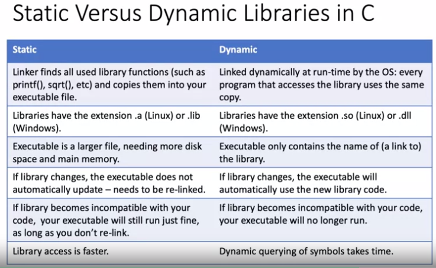
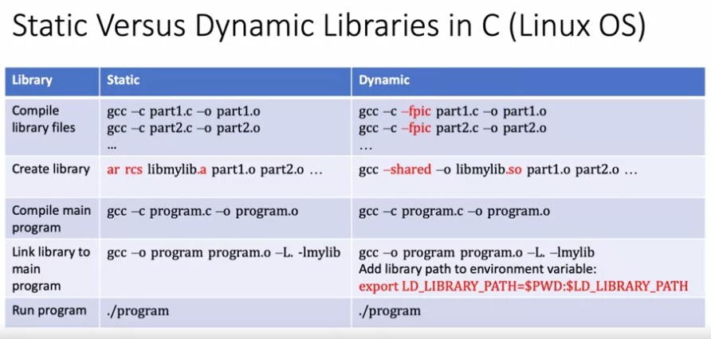

<!-- vscode-markdown-toc -->
* 1. [Modularizing a program](#Modularizingaprogram)
	* 1.1. [GCC details](#GCCdetails)
	* 1.2. [Object files](#Objectfiles)
	* 1.3. [Modify object files](#Modifyobjectfiles)
* 2. [Creating and using a Makefile](#CreatingandusingaMakefile)
	* 2.1. [Make file](#Makefile)
	* 2.2. [More elaborate Makefile](#MoreelaborateMakefile)
	* 2.3. [Run a program with Makefile](#RunaprogramwithMakefile)
* 3. [Creating a static Library](#CreatingastaticLibrary)
	* 3.1. [Create your library](#Createyourlibrary)
	* 3.2. [Modify your Library](#ModifyyourLibrary)
	* 3.3. [Ultimate makefile](#Ultimatemakefile)

<!-- vscode-markdown-toc-config
	numbering=true
	autoSave=true
	/vscode-markdown-toc-config -->
<!-- /vscode-markdown-toc -->

##  1. <a name='Modularizingaprogram'></a>Modularizing a program

###  1.1. <a name='GCCdetails'></a>GCC details
- Assume a c program `MainFile.c`:

``` c
#include<stdio.h>

int main(){
	printf("This is MainFile.c\n");
	return 0;
}
```
- The easiest way to compile:
  - `gcc MainFile.c` which outputs `a.out` 
    - `a.out` can be executed through `./a.out`
- To define a name for the output file:
  - `gcc -o SomeExecutableName MainFile.c` which outputs `SomeExecutableName`
    - `SomeExecutableName` can be executed through `./SomeExecutableName`
- A source file is converted into an `object file` which is a binary file in a language that a computer can understand. It has a `.o` extension.
  - `gcc -c -o MainFile.o MainFile.c`
- Now, to link that object file into an executable:
  - `gcc -o SomeExecutableName MainFile.o`


###  1.2. <a name='Objectfiles'></a>Object files
- Lets say we have the following files:
  - `f.h`:
	``` c
	void printFunction();
	```
  - `f.c`: a dummy file with a void function.
	``` c
	#include<stdio.h>

	void printFunction(){
   		printf("This is the printFunction in SourceFile");
	}
	```
  - `m.c`: Which has the MAIN function.
	``` c
	#include<stdio.h>
	#include "f.h"

	int main(){
		printFunction();
		printf("This is MainFile.c\n");
		return 0;
	}
	``` 
- There is a sequence To compile the program.
  1. Compile the non-main methods files
     - `gcc -c -o f.o f.c`
  2. Compile the main method file
     - `gcc -c -o m.o m.c`
  3. Links the object files
     - `gcc -o SomeName m.o f.o `  
  4. Run to verify that eve3rything is as expected
     - `./SomeName`


###  1.3. <a name='Modifyobjectfiles'></a>Modify object files
- From the previous example, if `f.c` and/or `m.c` are modified:
  - Convert the `c` files into `o` files
  - Then make the executable. 

##  2. <a name='CreatingandusingaMakefile'></a>Creating and using a Makefile

###  2.1. <a name='Makefile'></a>Make file
- Its a file which specify the process described in the previous section. So you can build your program **running this file**.
- The file is called `Makefile` (its a text file).
  - THe file is called using `make` in the terminal.
- It has the following sintaxis:

```
target: dependencies
	command
```
Where:
- target: what will be produced i.e. an `.o` file? an executable?
- dependencies: source file and headers for an object file. Or, many object files for an executable
- command: command use to build the target.

From the previous example with `m.c` `f.c` and the `f.h` files. The `Makefile` will be:

``` make
m: m.o f.o 
	gcc -std=c11 -Wall -fmax-errors=10 -Wextra -o m m.o f.o 
    
m.o: m.c f.h 
	gcc -std=c11 -Wall -fmax-errors=10 -Wextra -c -o m.o m.c   
	
f.o: f.c 
	gcc -std=c11 -Wall -fmax-errors=10 -Wextra -c -o f.o f.c
```
- Then to build this only use `make` in the terminal.

###  2.2. <a name='MoreelaborateMakefile'></a>More elaborate Makefile
- A more  advanced makefile: 

``` make
# This is a comment
# define the C compiler
CC = gcc
# define the compiler flags
CFLAGS = -std=c11 -Wall -Wextra

# define the library paths in addition to /usr/lib
LFLAGS = 


# define the libraries to use
LIBS = 

# define the object files that this project needs
OBJFILES = m.o f.o
# define the name of the executable file
MAIN = m

## The content below is generic - one typically only adjust the above

all: $(MAIN)

$(MAIN): $(OBJFILES)
	$(CC) $(CFLAGS) -o $(MAIN) $(OBJFILES)

%.o: %.c
	$(CC) $(CFLAGS) -c -o $@ $<

clean:
	rm -f $(OBJFILES) $(MAIN)

launch: m
	./m
```

###  2.3. <a name='RunaprogramwithMakefile'></a>Run a program with Makefile

To add the ability of call the program build, add the following code at the end of the previous one.

``` make
launch: m
	./m
```

- Now all the build and run process can be called through:
  - `make lauch`

##  3. <a name='CreatingastaticLibrary'></a>Creating a static Library

###  3.1. <a name='Createyourlibrary'></a>Create your library
- A library is created using the `.o` files.
- Then is is created using: `ar rcs <nameOfLib>.a <listOfObjectFiles>` 
- So, if we want to make a library from the `f.c` and `f.h`:
  1. Compile to generate the `.o` files: 
     - `gcc -c -o f.o f.c`
     - `gcc -c -o m.o -o m.c`
  2. Build the static lib: 
     - `ar rcs libf.a f.o` . (It is recomended that libraries begin with `lib...`)
     - So, now we have a `libf.a` file which is a library.
  3. To generate the executable we do:
     - `gcc -o program m.o libf.a`
     - Alternatively you can use:
       - `gcc -o program m.o -L. -lf`
       - Where the `-L.` means lib at current directory
- Then to run the program it only requires the command `./program` 
- If the executable needs system libraries:
  - `gcc -o program m.o -l<nameOfLib>`

- So far, we have been working with `static libraries`   but there are another types e.g. `dynamic libraries`.



The build process and its differences is described in the following table:

   
###  3.2. <a name='ModifyyourLibrary'></a>Modify your Library

- Lets say we want to add another file `g.c` `g.h` to the `libf.a` library what we should do?:
  1. Create the object files
     1. `gcc -c -o f.c f.o`
     2. `gcc -c -o g.c g.o`
  2. Create the static lib
     1. `ar rcs libf.a f.o g.o`
  3. Create a header to include all the headers of the static library
     1. `touch libheaders.h`
  4. Include in `libheaders.h` all the headers used i.e. `f.h` and `g.h`
  5. Include `libheaders.h` in the program sourcefile.
  6. Build the project:
     1. `gcc m.c -L. -lf -o m`
  7. Run the executable: `./program`


###  3.3. <a name='Ultimatemakefile'></a>Ultimate makefile